# GPU、子宫与印钞机：AI时代人类社会的命运推演

---

## 一、引言：从认猫认狗到通过律师考试——十年的距离

2012年，AlexNet在ImageNet上赢了只需要“认猫认狗”的比赛 [3]，多数人把它视作学术突破，但没人预料到产业级革命会来得这么快。十年后，ChatGPT五天破百万用户、两个月破一亿，能写诗、写代码、考过律师/医生执照。十年跨度里，AI从“辨别猫狗”跃迁到“代替高考状元”，技术用十年跨越了人类最难的考试——留给我们的适应期可能很短。

每一波科技浪潮都在压缩时间：AT&T统治通信业约50年，IBM统治计算机30年，微软主导PC 20年，Google主导互联网15年 [2]。这一次，浪潮不是给人类装机器手，而是给机器装人类大脑；从替代手脚到替代认知，速度更快、高度更高。

这篇文章不做科幻预测，而是用可观察的数据推演——如果当前趋势不被打断，未来5年、15年、甚至100年，经济、地缘、人口、金融和物种会如何演化。读完你会得到一套观测指标、一条时间线和能用得上的清单。

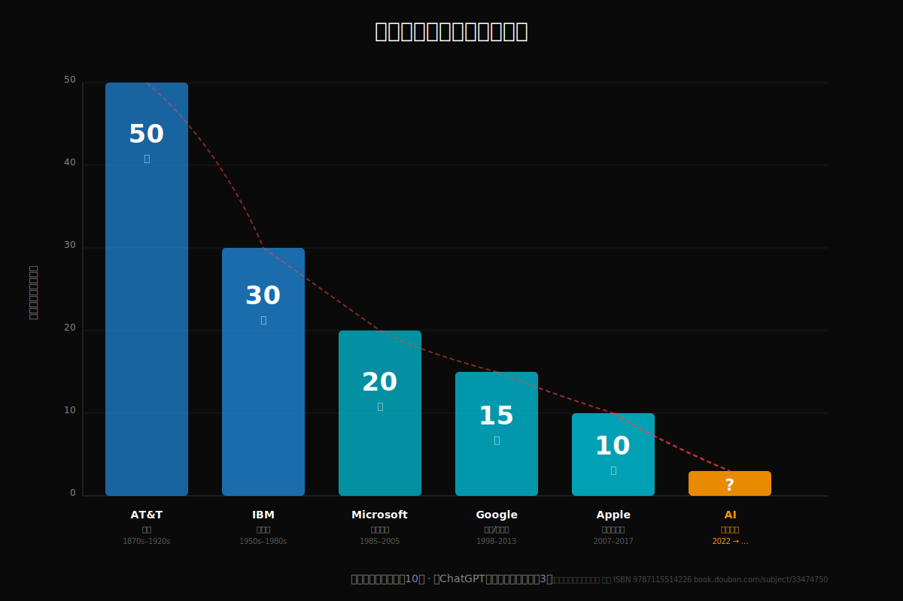

这张图的 takeaway：每一波主导期都在压缩——决策窗口可能不到十年。

速度只是表面，更关键的是被替代的“人类能力层级”在抬升——看下一张。

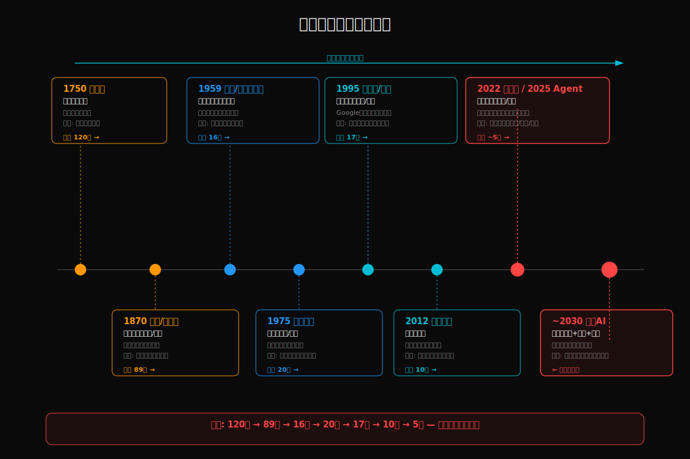

上图补充了“替代层级”视角：从蒸汽机替代粗体力，到电气化/流水线的节奏控制，再到工业机器人取代精细动作、PC与互联网取代计算与记忆，如今大模型/agent开始侵蚀通用认知，具身AI有望把“认知+动作”整合起来。每一波的时间间隔都在缩短，且目标层级不断上移。

在这三年里，大语言模型从"会聊天的搜索引擎"进化到了能自主编程、自主研究、自主决策的智能体（agent）。Citrini Research在2026年2月发表的那份引发硅谷震动的报告《过剩智能的后果》中，做了一个大胆的思想实验：假设我们站在2028年6月回望，会看到什么？[1]

本文试图在这份报告的基础上更进一步——不只看五年，而是把推演的时间轴拉到一百年。我们将从经济结构、地缘政治、人口趋势、金融体系、以及人类物种本身的走向，逐层展开分析。所有推论都基于已有数据和可观察的趋势线，尽可能让数据自己说话。

这不是一份预测。这是一份推演——"如果当前趋势不被打断，会发生什么"的逻辑链条。

---

## 二、智能溢价的崩塌：当人类的脑子不再稀缺

### 2.1 智能替代螺旋

过去两百年，人类经济体系的核心假设是：智能是稀缺资源。律师之所以年薪几十万美元，是因为能通过律师考试、能理解复杂案例的脑子不多。程序员之所以年薪二十万美元，是因为能写出可靠代码的脑子不多。金融分析师、医生、咨询顾问——所有高薪白领职业的溢价来源，本质上都是同一个东西：认知能力的稀缺性。

AI正在终结这种稀缺性。

2025年底，智能体编码工具经历了一次阶跃式跃升。一个中等水平的程序员，配合Claude Code或Codex这样的AI编程助手，几周就能复刻一款中型SaaS产品的核心功能。企业CIO开始问一个致命的问题："如果我们自己做呢？"长尾SaaS公司（Monday、Zapier、Asana）首先被冲击，7折续约已经算好结果。连"系统记录层"这样看似有深厚护城河的公司也不安全 [1]。

但这只是序幕。真正的致命逻辑是Citrini Research所称的"人类智能替代螺旋" [1]：

**AI更强 → 企业裁员 → 省下的钱买更多AI → AI更强 → 裁更多人**

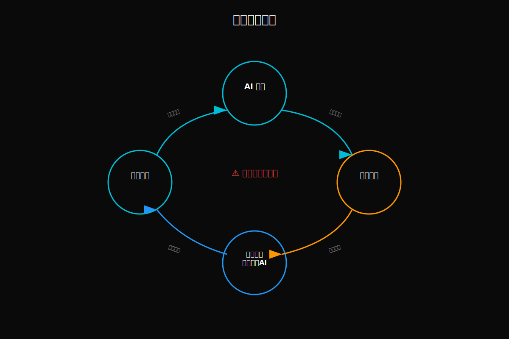

注意这不是传统意义上的资本开支扩张。企业的AI预算在增长，但总运营支出在下降——因为AI替代的是人力成本，而人力成本远高于AI的边际成本。这个循环里，没有人有动力踩刹车。

被裁的白领去了哪里？他们"降档"就业。一个年薪18万美元的Salesforce高级产品经理，三轮裁员后去开Uber，收入4.5万美元 [1]。一个人降档不是大问题。但当几十万白领同时涌入蓝领和服务业，他们不是在填补空缺，而是在压低所有人的工资。过度资质化的劳动力对底层形成"降维打击"。

更残酷的是：就在这些白领转去开Uber、送外卖的时候，自动驾驶和无人配送正在加速上线。他们的退路，也快没了。

### 2.2 摩擦归零与中介经济的崩溃

AI不只替代了劳动者，它还替消费者把"懒得做"的事全做了。

当AI代理（agent）开始替用户比价、砍价、取消不必要的订阅，所有靠信息不对称和交易摩擦赚钱的行业都面临灭顶之灾。旅游平台、保险续保、财务顾问、房产中介——这些行业的商业模式本质上是"你嫌麻烦，我帮你处理，收你一笔手续费"。但AI代理不嫌麻烦。房产中介佣金可能从2.5%-3%被压到1%以下——这是"agent对agent的暴力" [1]。

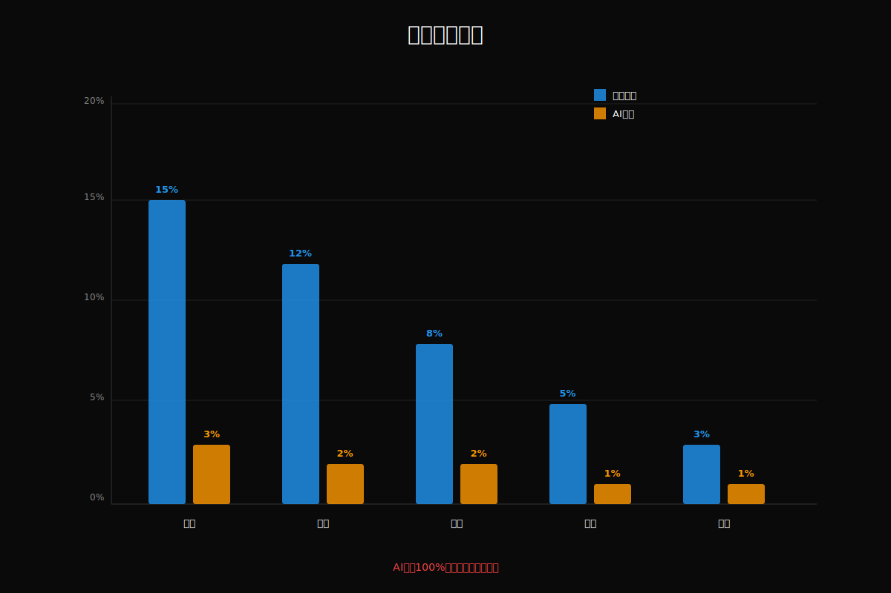

DoorDash的护城河是什么？不是它的配送网络，而是"你饿了，你懒得折腾，这个App在你主屏上"。但AI代理没有主屏。它会在所有平台间做最优选择。习惯性忠诚——人类消费行为中最强大的惯性——对机器不存在。

这引出一个更深层的推论：当AI代理替你做所有消费决策的时候，品牌还有意义吗？你买Nike而不买安踏，可能是因为广告、因为明星代言、因为你觉得穿Nike更酷。但AI代理不在乎酷不酷。它只看参数和价格。品牌溢价，说白了就是在赚人类冲动消费的钱。当决策权交给纯理性的机器，几十年建立的品牌价值可能在几年内大幅缩水。全球广告业、营销业、奢侈品行业——它们的存在前提是人类会冲动消费。这个前提正在被动摇。

### 2.3 幽灵GDP与合成谬误

宏观数据可能呈现出一幅误导性的繁荣景象——名义GDP还在增长，生产率在爆发。但这是Citrini Research所说的"幽灵GDP"：它体现在统计数字里，但从来不会变成真实的消费和流通 [1]。原因很简单：机器不买东西。

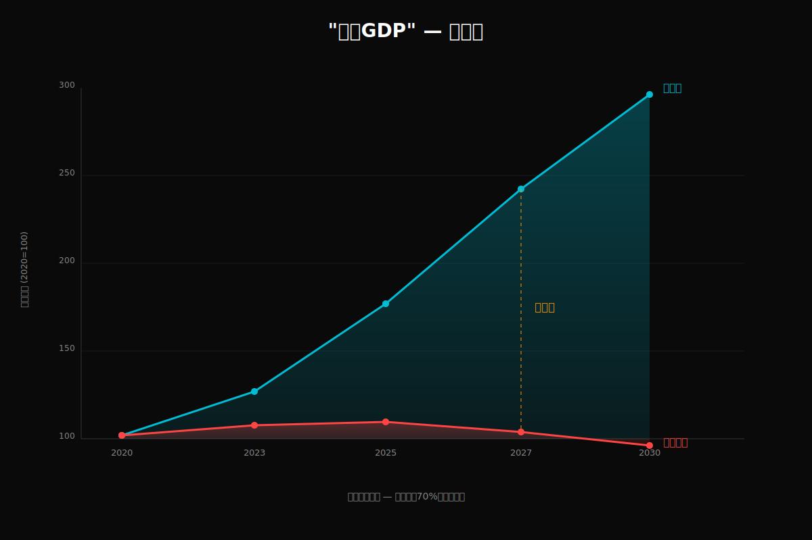

美国经济有70%靠消费驱动，而白领驱动75%的可选消费 [1]。当这些人失业或降薪，谁来买东西？谁来偿还13万亿美元的住房按揭？生产率飙升与实际工资崩塌之间的"剪刀差"，是理解接下来一切的关键。

这里隐藏着经济学中最经典的"合成谬误"（fallacy of composition）。对任何一家公司来说，用AI替代员工、削减成本是绝对理性的选择。但当所有公司同时这么做，它们集体消灭了自己的消费者。企业越高效，经济死得越快——因为效率的对价是就业，就业的对价是消费，消费的对价是收入，而收入的来源正在被机器替代。

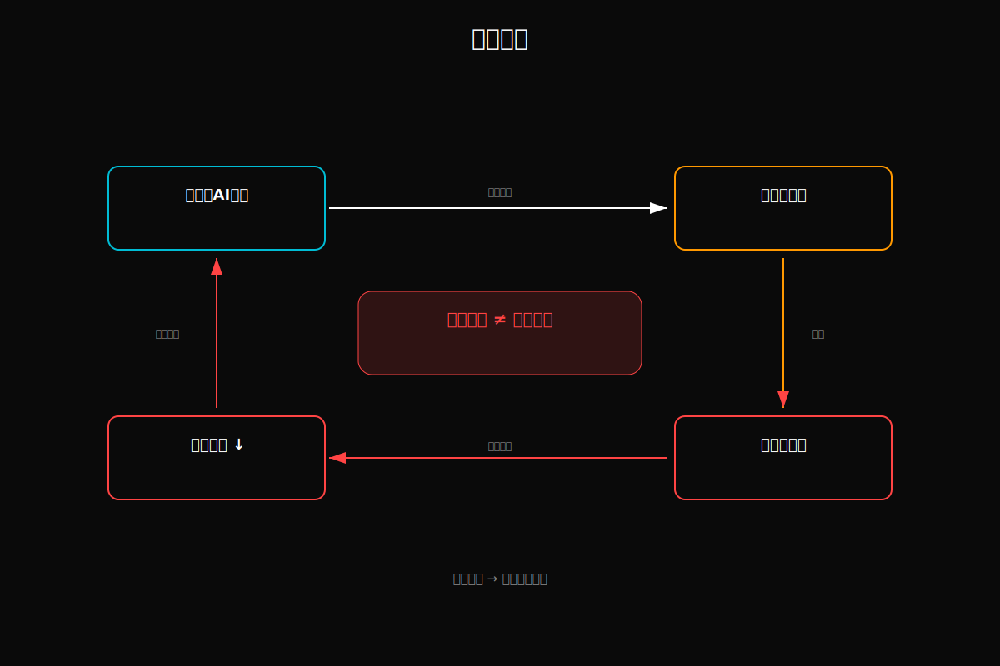

这不是理论推演。这是每一家公司都在做的事情的逻辑终点。

### 2.4 自动驾驶：开车将像骑马一样原始

在AI替代白领脑力劳动的同时，另一场革命正在公路上展开。

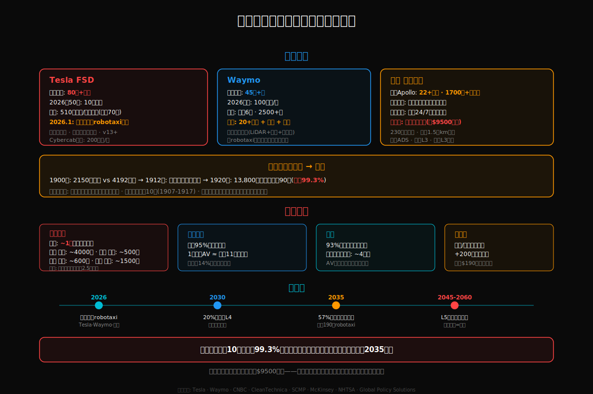

1900年的美国有2150万匹马，全年只卖出了4192辆汽车。到1912年，纽约街头的汽车数量首次超过马匹。1890年美国有13,800家马车制造企业，到1920年只剩下90家——99.3%被淘汰 [83]。大量为马匹种植饲料的农地被释放，饲料价格下跌，相关职业（马夫、蹄铁匠、马具工、饲料商）迅速消失。这常被用作“技术替代可在短时间内引发区域性经济震荡”的案例，但并非主流共识中的“大萧条主因”。

自动驾驶正在重演这段历史。但这次，被淘汰的不是马，是人类司机。

截至2026年2月，特斯拉FSD（全自动驾驶）累计行驶超过**80亿英里**，2026年头50天就跑了10亿英里 [84]。特斯拉自报的安全数据显示FSD每510万英里才发生一次严重碰撞，美国全体人类司机平均每70万英里一次（两者口径不同，直接对比存在偏差）[84]。2026年1月22日，特斯拉在奥斯汀启动了**无安全员robotaxi**服务 [84]。

Waymo更早起步。2025年底，Waymo每周完成**45万+次**付费载客，2026年目标100万次/周，运营覆盖美国6个城市，并计划扩展到20+个城市以及东京、伦敦 [85]。

**中国的追赶同样凶猛。** 百度Apollo Go在**22+个中国城市**运营超过1000辆全无人驾驶出租车，累计完成**1700万+次**载客，每周订单量达30万+（截至2025年底）[85]。小马智行（Pony.ai）获得深圳首个全城无人驾驶商业化许可，覆盖北上广深四大一线城市 [85]。文远知行（WeRide）在广州实现24/7全无人运营 [85]。

但真正改变游戏规则的是比亚迪。2025年，比亚迪宣布将"天神之眼"智驾系统**免费标配**到全系车型——包括售价仅6.98万元的海鸥 [86]。截至2025年11月，官方称**230万辆**比亚迪已搭载该系统，每天生成**1.5亿公里**的驾驶数据 [86]。当一个$9,500的小车都配了高级辅助驾驶，这项技术的普及速度将远超所有预测。

社会冲击将是深远的。全球约有**1亿个**驾驶相关岗位面临自动驾驶的冲击 [83]。美国约500万（其中350万卡车司机），但这只是冰山一角。中国的规模更惊人：约**3000万**卡车司机、**750万+**网约车和出租车司机、**1200万**外卖骑手——合计约**4000万**驾驶相关岗位 [87]。欧盟约500-700万，印度约1500万。高盛估计，仅美国在自动驾驶充分渗透后，每月将有**2.5万人**失去驾驶岗位 [87]。国际运输论坛的激进情景预测，到2030年美欧卡车司机岗位将减少**50-70%** [87]。但就业冲击只是冰山一角：

- **城市空间重塑**：人类的车95%时间在停放。自主共享车辆每辆可替代约11辆传统车——洛杉矶14%的土地用于停车场，这些空间可以释放为公园和住宅
- **保险业重构**：当93%的事故源于人为错误，自动驾驶将颠覆整个汽车保险模型——责任从司机转移到厂商和软件
- **可及性革命**：老人、残障人士获得独立出行自由，预计创造200万个新就业机会并每年节省190亿美元医疗开支（减少错过的预约）[83]

专家共识是：L4级自动驾驶（限定区域无人驾驶）将在2020年代末至2035年间大规模普及；完全L5级（任何条件下全自动）可能要到2045-2060年 [83]。但关键的颠覆性十年——就像1907-1917年汽车爆发式取代马匹——很可能就是现在到2035年之间。

二十年后，人类手动驾驶可能就像今天骑马上班一样——技术上可行，但荒谬。

### 2.5 人形机器人：当AI长出手脚

前面讨论的自动驾驶是AI进入物理世界的第一步——车轮上的AI。但故事还有下半场：当AI不再只是屏幕上的文字，也不只是方向盘后面的幽灵，而是站在你面前、用两只手搬箱子的人形机器人时，蓝领和服务业最后的避风港也将被攻破。

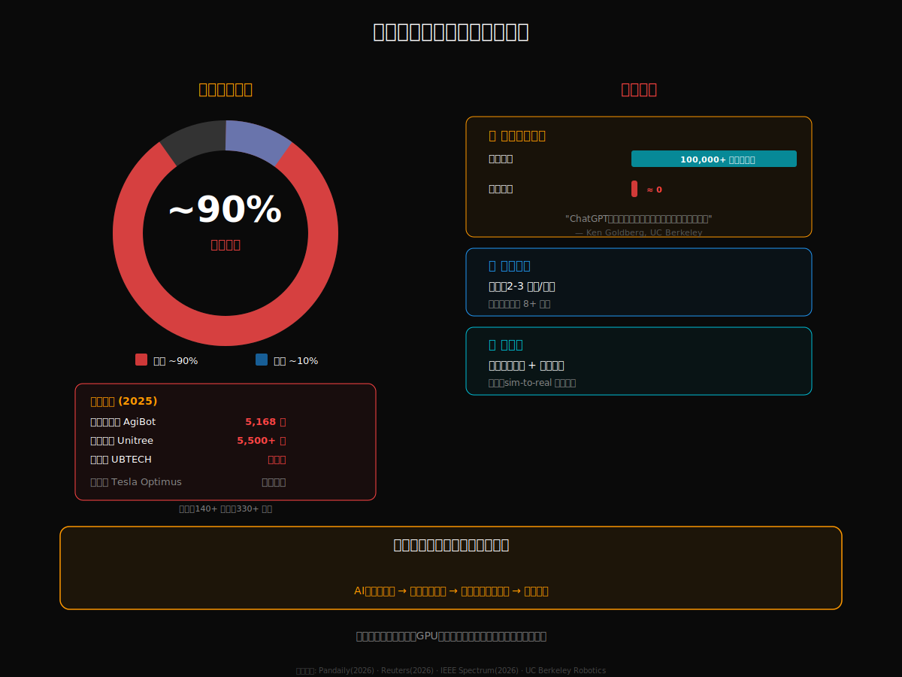

2025年，全球人形机器人出货量出现了第一次实质性爆发。令人意外的是，中国几乎独占了这个新兴市场——据行业追踪数据，2025年全球出货的人形机器人中，约90%来自中国企业 [36]。智元机器人（AgiBot）一家就出货5,168台，宇树科技（Unitree）出货超过5,500台 [37]。中国已有超过140家人形机器人企业，推出了330多款机型 [36]。相比之下，特斯拉Optimus至今尚未实现商业销售，落后于原定计划 [37]。

这不是偶然。中国在这个领域的优势源于其全球最完整的制造业供应链——从电机、传感器、电池到精密齿轮，所有零部件都能在国内采购并快速迭代。这与AI芯片领域美国的主导地位形成了有趣的互补：美国掌控智能的大脑（GPU、大模型），中国掌控智能的身体（机器人硬件）。

但有一个关键瓶颈：**自主性不足**。今天的人形机器人大多需要人类预编程动作序列，或通过远程遥操作来完成任务。加州大学伯克利分校的Ken Goldberg教授指出了根本原因：人类拥有超过10万年的语言数据用于训练大语言模型，但用于训练机器人操控物体的真实世界数据几乎为零 [38]。这就是为什么ChatGPT能写出一篇完美的律师函，但一个价值数百万的机器人却拿不稳一个鸡蛋——语言有海量训练数据，而物理操作没有。

此外，续航也是硬伤。当前人形机器人电池续航仅2-3小时，不足以支撑一个完整的工业班次 [38]。

然而，这些瓶颈正在被快速攻克。仿真到现实（sim-to-real）训练技术正在弥合数据鸿沟——在虚拟环境中训练数百万次机械臂操作，然后迁移到真实机器人上。电池技术每年提升8-10%的能量密度。如果这条曲线在未来五年内保持，到2030年前后，我们很可能看到第一批真正自主的人形机器人进入工厂和仓库。

这意味着什么？前面讨论的"智能替代螺旋"将从认知领域扩展到物理领域。当白领被AI软件裁掉，他们"降档"去开Uber、送外卖。当人形机器人自主化后，连这些退路也将关闭。替代螺旋不再只是一个循环，而是一个无处可逃的封闭系统。

### 2.6 35岁危机的翻转：AI偏爱谁？

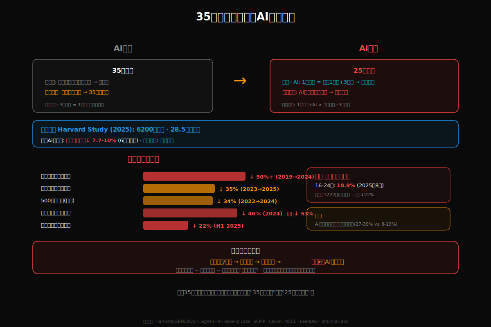

在中国互联网行业，"35岁危机"曾是最扎心的职场潜规则——很多企业公开标注"35岁以下"的招聘条件，程序员过了35岁就面临淘汰。便宜、能加班、可替代，是年轻劳动力的"优势"。

AI正在翻转这个逻辑。

2025年哈佛大学一项追踪**6200万工人、28.5万家企业**的大规模研究发现：采用生成式AI的企业，**初级岗位招聘在六个季度内下降了7.7%-10%，而资深岗位几乎不受影响** [81]。研究者将其命名为"偏向资深的技术变革"（Seniority-Biased Technological Change）——AI不是平等地替代所有人，它优先替代的是初级员工。

数据触目惊心。美国15家最大科技公司的应届生招聘自2019年以来**下降超过50%**，应届生现在只占大厂新员工的7% [82]。全美入门级职位发布量从2023年1月到2025年6月**暴跌35%** [82]。财富500强的实习岗位减少22%，其中科技实习岗减少34% [82]。54%的工程主管表示将因AI copilot**减少初级开发者招聘** [82]。Salesforce的CEO宣布2025年**完全停止初级招聘** [82]。

中国的情况更严峻。2025年8月，16-24岁青年失业率攀升至**18.9%**，创下新统计口径以来的最高纪录 [81]。2025年高校毕业生达到创纪录的**1222万人**，而面向毕业生的招聘信息同比**下降22%** [81]。AI人才需求旺盛（搜索算法工程师的需求供给比达到9:1），但这些岗位要求的是资深专家，不是应届生 [81]。

为什么会这样？逻辑很简单。AI做的最好的事情——写基础代码、做数据录入、整理报告、回复客户邮件——恰恰是初级员工的日常工作。一个有十年经验的架构师加上AI工具，产出等于以前的自己加两三个初级开发者。企业的算术很容易算：雇一个资深+AI，还是雇一个资深+三个初级？答案不言自明。

讽刺的是，研究显示AI对初级员工的**生产力提升比例**其实更大（27-39%），远高于资深员工（8-13%）[81]。AI像一个"均衡器"，把低水平拉高。但企业不关心百分比，关心的是：谁能**验证**AI的输出？谁能做**判断**？谁有**领域知识**？答案都是资深员工。AI让初级员工变得更能干，但同时也让他们更容易被替代——因为AI自己就能干他们能干的事。

这对职业阶梯的影响是毁灭性的。传统的"空缺链"是：资深员工升职/离职→中级补上→初级补上→新人入场。AI切断了最底层这一环。没有初级岗位，就没有"入场券"；没有入场券，就永远不可能变成有经验的人。这不是35岁危机的消失，而是危机的下移——从"35岁被淘汰"变成"25岁进不了门"。一代人可能在职业生涯开始之前就已经结束了。

英国的数据同样惨烈：2024年科技行业毕业生岗位**减少46%**，预计到2026年**再降53%** [82]。全球66%的企业表示计划因AI减少入门级招聘 [82]。

中国倒是开始做出一些调整——上海、浙江、江苏等省市在2025年将公务员考试的年龄上限放宽，2025年1月起法定退休年龄延迟（男性60→63岁，女性50-55→55-58岁）[81]。但这些政策的讽刺在于：刚刚放松35岁门槛，25岁的门槛就来了。

### 2.7 学位贬值的连锁反应：当教育体系被就业市场倒逼

2.6节描述了"25岁进不了门"的困境。但问题不会停在就业市场——它会沿着链条向上游传导，击穿整个教育体系。

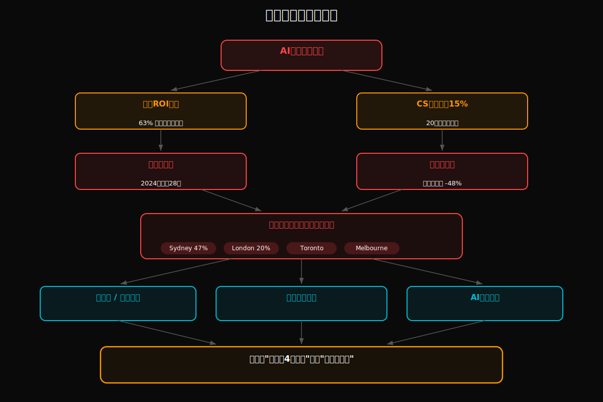

**学位正在失去信号价值。** 2025年，只有**30%**的应届毕业生找到了专业对口的全职工作，比2024年骤降 [92]。**33%**的2025届毕业生仍在失业求职，而2024年这个数字是20% [92]。更致命的是雇主的态度：**96%**的HR主管认为大学需要为职场准备承担更多责任，**75%**直接说大学教育"根本没在为工作做准备" [92]。当学位不再是就业的可靠信号，它的价值就开始坍塌——**63%**的美国人现在认为四年制学位"不值得" [93]。

**CS专业大逃亡是矿井里的金丝雀。** 2025年秋季，计算机科学研究生注册人数**下降15%**，本科下降近6%——**20年来首次逆转增长趋势** [94]。62%的计算机院系报告招生下降。但学生不是在逃离科技，他们在逃离自己认为会被AI替代的部分：MIT的"AI与决策"专业已成第二大专业，南佛罗里达大学的AI与网络安全学院招了3000+学生 [94]。64%的悲观CS学生把原因直接归结于生成式AI [94]。

**大学开始关门了。** 2024年前9个月，美国关闭了**28所**学位授予机构，而2023年全年才15所。费城联储预测最坏情况下每年将关**80所** [95]。南俄勒冈大学砍掉了38个专业中的15个，包括化学和经济学 [95]。这不是个别现象——当学位的ROI中位数只有12.5%，**四分之一毕业生可能永远看不到回报**，而总成本（含机会成本）达到$180,000时 [93]，这个产品正在失去市场。

**留学经济的崩塌可能引发城市级连锁反应。** 这是一个被严重低估的风险。全球留学产业是一个巨大的经济体：

| 国家 | 年贡献 | 占比 | 2024-25趋势 |
|------|--------|------|------------|
| 澳大利亚 | AUD $536亿 | 第四大出口 | 签证申请↓28% |
| 加拿大 | CAD $223亿 | GDP的1.2% | 学签发放↓48% |
| 英国 | GBP £94亿（仅学费） | 高教收入20% | 连续两年下降↓6.1% |
| 美国 | USD $430亿 | 支撑35.5万就业 | 2025秋新生↓17% |

最脆弱的节点是那些对留学生收入依赖度极高的大学和城市。悉尼大学**47%**的收入来自国际生学费 [96]；墨尔本大学33%、45%的学生是国际生 [96]。伦敦是英国最大的留学生聚集地，英国高教23.9%的学生是国际生。波士顿的6.3万国际生带来约$30亿本地经济效益，三分之二的高端公寓租给留学生 [96]。

加拿大已经是一场预演。2024年学签发放暴跌48%后，**600+个教育项目被取消或暂停**，4所学院关闭校区，安省24所学院中19所裁员**8000+人** [96]。这还只是政策收紧的结果——还没叠加学位本身贬值。

关键在于：留学生disproportionately读的是STEM、商科和CS——恰好是AI冲击最大的专业。当一个每年$4万的国际学位不再有清晰的ROI优势，**最先撤退的就是付全价的国际生**——而这恰好是大学最赚钱的客群。英国的数据尤其触目惊心：**45%**的英国高校2025/26年面临赤字，预计72%年底赤字 [96]。英国大学每个国内生**亏£2,500/年**——一直靠国际生学费补贴国内教育。当国际生减少，这个交叉补贴模型就崩了。

**教育体系正在被迫重塑。** 变革沿着四条路径展开：

**第一，四年学位碎片化为可堆叠的微证书。** 美国2025年7月通过了《Workforce Pell Grant》法案，首次允许联邦Pell助学金覆盖8-15周的短期职业培训项目 [97]。34个州已有111个项目、累计投资$45亿专门资助短期非学位证书 [97]。96%的雇主认为微证书加分，90%愿意为持证者加薪 [98]。未来的模式可能是：8周证书→堆叠成副学士→再堆叠成本科——按需购买，而非一次性打包。

**第二，终身学习账户取代一次性教育。** 英国的"终身学习权利"（Lifelong Learning Entitlement）2026/27学年起生效：每人一生可支取相当于4年本科的教育贷款（约£38,140），60岁前随时用，通过在线个人账户管理 [99]。新加坡的SkillsFuture已帮66万公民提升技能。**中国在这方面最激进**：2025-2027年计划培训**3000万工人**的职业技能，配套"八级工"制度直接挂钩工资晋升，并用国产大模型开发AI职业教育课程——这是全球首例 [100]。

**第三，AI成为教育基础设施。** 2024/25学年，60%的美国K-12教师已在使用AI工具，每周省6小时 [101]。学生用ChatGPT做作业的比例一年翻倍（13%→26%）[101]。到2035年，专家预测AI导师将能看、听、说，了解每个学生的强弱项，提供精准的个性化教学 [102]。这可能是教育领域最大的"均衡器"——精英教育的认知壁垒被AI打平，正如AI打平了编程的认知壁垒一样。

**第四，大学的价值被重新定义。** 当知识获取被AI民主化，大学的独特价值缩窄到三件事：同侪网络、实习通道、信号效应。顶尖大学变成"精英俱乐部"——哈佛的价值不是课程，是校友网络和品牌光环。中低层大学如果还在卖"知识传授"就会被淘汰。留学的价值也会重新定义：不是学知识（AI比教授讲得好），而是买签证+社交网络+文化体验+本地就业通道。

这条链条总结起来：**AI替代入门岗位 → 学位ROI暴跌 → 学生逃离/大学关门 → 留学生退潮 → 依赖留学经济的城市遭双重打击 → 教育从"一次性4年投入"变成"终身订阅式"。** 这不是十年后的事。加拿大已经在发生，澳大利亚和英国正在发生。

### 2.8 失业—财政—延寿：三条错位的时间线

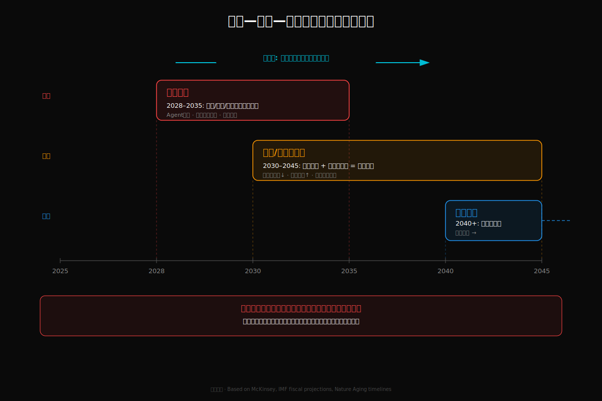

- 就业替代先到：agent与自动驾驶在**2028-2035**集中落地，白领/司机/仓储岗位收缩。
- 财政/养老金随后吃紧：税基因失业缩小，但退休期因延迟退休和长寿延长，挤兑窗口大约**2030-2045**。
- 延寿普及更晚：逆龄/细胞重编程等高成本疗法即便成功，普及大概率在**2040+**之后。

这意味着可能出现“活得更久，但先经历一段没有稳定收入和保障的空窗期”。问题不在寿命长本身，而在价值分配和社保模型能否跟上替代速度。

---

## 三、减速因素：什么可能让AI慢下来

前两章描绘了一幅极端的加速图景。但诚实的推演必须面对另一面：有哪些力量可能延缓、甚至暂时中断这个过程？历史上每一项"即将改变世界"的技术都经历过从狂热到幻灭的过渡期。AI也不会例外。

制约因素大致分为三层：物理层、信任层、制度层。它们的解决速度不同，决定了AI扩散的节奏。

### 3.1 物理层：电力、芯片与原子

**电力是最硬的瓶颈。** 美国数据中心电力需求预计2026年达到75.8GW，2030年飙升到134.4GW [49]。但电网扩容的速度远远跟不上——部分地区的电网并网申请已经排到了七年以后 [49]。72%的基础设施高管表示电力和电网容量是"非常或极度严峻"的挑战。结果是什么？2026年计划上线的16GW数据中心容量中，实际在建的只有5GW——30-50%的大型数据中心项目将被推迟 [49]。阿姆斯特丹、都柏林、新加坡已经出台了数据中心建设禁令。

**芯片供应同样吃紧。** 台积电自己承认，先进制程产能约为AI需求的三分之一 [50]。Nvidia的Blackwell GPU订单积压超过一年。问题是解决这些瓶颈需要物理时间：建一座先进制程晶圆厂需要3-5年，投资超过200亿美元。台积电亚利桑那工厂要到2028年才能全面运转，熊本工厂推迟到了2029年 [50]。中芯国际用DUV多重曝光实现了5nm级制程，但良率仅约30%，远低于经济可行的70%门槛 [50]。

**人形机器人面临更多物理约束。** 续航仅2-3小时（工业班次需要8小时以上），电池达标可能需要长达十年 [51]。全球没有统一的人形机器人安全测试标准——ISO 25785-1正在制定中，但远未完成 [52]。Figure AI曾被提起安全诉讼，焦点在于部署前的测试充分性和潜在夹持风险，案件仍在推进 [52]。亚马逊引入仓库机器人后，工伤率曾被报道高于行业平均——部分原因是人类被要求配合机器人的节奏 [52]。

### 3.2 信任层：幻觉、最后一公里与ROI幻灭

AI agent的核心问题不是"能不能做"，而是"能不能信"。

最好的模型在摘要任务上的幻觉率已从21.8%（2021年）降到了0.7%（2025年），但在事实性问答中，OpenAI的o3仍然有33%的幻觉率 [53]。美国法院已记录数百份包含虚假引用的AI生成法律简报。2025年，一名律师提交的法律文件中包含近30条虚假引用和虚构案例 [53]。德勤提交给澳大利亚政府的一份报告包含捏造的学术来源和虚构的法庭引语，费用44万澳元 [53]。

更深层的问题是"最后一公里"困境。自动驾驶能处理95%的路况——但剩下5%的边缘情况（暴雨、积雪、褪色标线、施工区域）消耗了80%的开发时间和资本。Waymo跑了1400万次付费行程，但仍然只在少数城市的地理围栏区域内运营 [54]。Rodney Brooks——iRobot联合创始人、MIT名誉教授——每年更新一份预测记分卡，记录了自2017年以来每一位承诺"几年内实现自动驾驶"的汽车高管如何全部食言。他预测人形机器人的灵巧性在2036年以后仍将"远不如人手" [54]。

通用汽车在投入近100亿美元后，于2024年12月关闭了自动驾驶子公司Cruise [54]。Meta的元宇宙旗舰平台Decentraland日活用户一度跌至仅38人。核聚变从1970年代就"还有30年"——到现在仍然"还有30年"。每一项被过度承诺的技术都遵循同一条曲线：炒作期 → 幻灭期 → 缓慢爬坡期。

Gartner的2025年炒作周期图证实了这一点：**生成式AI已经滑入"幻灭低谷"**，而AI agent还停留在"过度期望峰值" [55]。MIT 2025年的研究发现，95%的企业从生成式AI项目中获得的ROI为零 [55]。平均每个AI项目烧掉190万美元，但不到30%的CEO对回报满意。尽管如此，全球AI投资仍在加速——2026年预计达到2.5万亿美元，同比增长44% [55]。

这不意味着AI不行。这意味着从"技术可行"到"大规模可靠部署"之间，存在一条很多人低估的鸿沟。

### 3.3 制度层：监管、工会与法律真空

EU AI Act正在分阶段生效：2025年2月禁止不可接受风险的AI系统，2026年8月对大多数运营者全面适用 [56]。中国修订后的《网络安全法》于2026年1月生效，明确将AI纳入监管范围，并要求AI生成内容必须标注水印 [56]。

工会正在积极争取"座位"。2024年10月，美国国际码头工人协会发起了为期三天的罢工，关闭了东海岸和墨西哥湾所有主要港口，最终在集体谈判协议中写入了**禁止完全自动化**的条款 [57]。好莱坞编剧协会（WGA）在2023年罢工中争取到了"AI不得被视为编剧"的条款。演员工会（SAG-AFTRA）争取到了AI数字复制品必须获得本人同意并支付报酬 [57]。

**法律责任是最大的灰色地带。** AI agent自主行动造成损失，谁负责？2024年Moffatt诉加拿大航空案中，法院裁定航空公司对其聊天机器人的错误陈述承担全部责任——驳回了"聊天机器人是独立法律实体"的辩护 [58]。EU新的《产品责任指令》将于2026年12月前实施，明确将软件和AI视为"产品"，适用严格责任 [58]。但人形机器人在美国没有任何联邦安全测试要求——它们可以在没有任何独立第三方验证的情况下就进入工作场所。

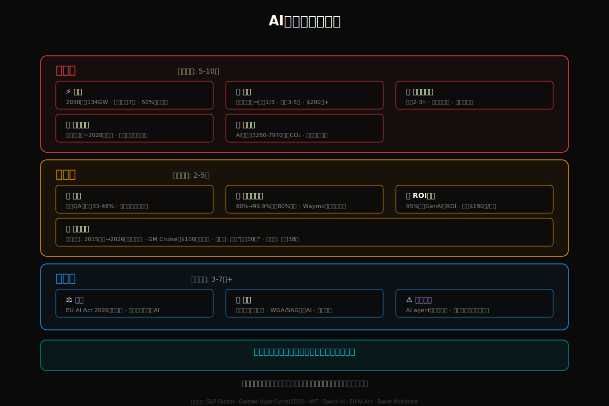

### 3.4 快与慢：不同速率的扩散

综合来看，三层制约的解决时间表截然不同：

| 制约因素 | 严重程度 | 预计解决周期 |
|---------|---------|------------|
| 电力/电网容量 | 极高 | 5-7年（电网排队7年+） |
| 芯片供应（先进封装） | 高 | 2027-2029（新厂投产） |
| 训练数据耗尽 | 中高 | 2027-2029（合成数据部分缓解） |
| AI可靠性/幻觉 | 中 | 持续渐进改善 |
| 企业集成摩擦 | 高 | 3-5年（遗留系统改造） |
| ROI幻灭期 | 高 | 2-3年（穿越幻灭低谷） |
| 监管合规 | 中 | 2026-2027（EU AI Act全面生效） |
| 人形机器人成熟度 | 高 | 5-10年（电池、灵巧性、安全标准） |

这意味着什么？**纯软件AI（agent、编程助手、文本生成）的扩散会很快**——边际成本接近零，部署不需要物理基础设施改造。但**AI在物理世界的落地（机器人、自动驾驶、数据中心基建）会慢得多**——受限于原子世界的物理定律和社会制度的惯性。

换句话说：白领的冬天可能比蓝领来得更早。代码可以在毫秒内部署到全球，但建一座发电厂需要五年，让一个机器人安全地在仓库里搬箱子需要十年。这个时间差——软件快、硬件慢——可能是这场变革中最被低估的变量。

但需要警惕的是：这些制约因素减缓的是速度，不是方向。每一个瓶颈都有明确的解决路径——电网在建、芯片厂在盖、合成数据在生成、安全标准在制定。它们决定的是AI替代是在五年内发生还是十五年内发生，而不是是否发生。

### 3.5 暴风雨前的平静：世界为什么还在"装睡"

如果AI真有本文描述的那么颠覆性，为什么2026年初的全球就业数据看起来还好得很？

事实如此：2026年1月，美国失业率4.3%，处于历史低位，当月还新增了13万个工作岗位 [90]。欧盟5.9%，接近几十年来最低。全球4.9%，稳定 [90]。耶鲁大学和布鲁金斯学会2025年10月的一项联合研究得出了一个惊人的结论："自ChatGPT发布以来，就业市场**没有可观测到的颠覆**。"高、中、低AI暴露度岗位的占比"惊人地稳定"，失业人群中AI暴露度的比例也没有增加 [90]。

这不是AI不行。这是**时滞**。

原因有三层。第一，**企业采用远比技术能力滞后**。2026年初，88%的企业声称"在用AI"——但只有**7%**真正全面部署到生产环节 [91]。2025年初，不到5%的企业应用嵌入了AI agent。大部分企业还在"试一试ChatGPT写邮件"的阶段，离用agent重构业务流程差得远。McKinsey的调查显示，只有6%的企业在系统性地从AI中获取商业价值 [91]。

第二，**当前的AI仍然需要人来驱动**。2026年的AI不是替代者，而是放大器。人类在AI工作流中扮演三个不可替代的角色：

- **Driver（驱动者）**：AI不会自己决定"做什么"。它需要人来定义问题、设定目标、选择工具、分解任务。一个资深产品经理用AI可以一天完成过去一周的调研，但"调研什么"这个判断仍然是人做的。AI是一辆性能极强的赛车，但方向盘还在人手里。
- **Ground Truth（真实性校验者）**：AI会幻觉（hallucinate）——它可以自信满满地编造不存在的法律条文、虚构学术论文、捏造统计数据。事实QA的幻觉率仍高达33-48% [51]。每一段AI生成的内容都需要有领域知识的人去校验：这个代码能跑吗？这个法律引用存在吗？这个数据来源靠谱吗？没有人做ground truth，AI的输出就是薛定谔的猫——可能对，也可能彻底错，你不打开看不知道。
- **Glue（胶水）**：就像Python被称为"胶水语言"——它本身不是最快的，但能把不同系统粘在一起。人在AI时代的角色类似：把AI的输出对接到现实世界的系统中。AI写了一段代码，但要部署到生产环境需要理解基础设施、权限、依赖关系；AI生成了一份合同草案，但要让客户签字需要理解关系、谈判、妥协。AI能做80%的认知工作，但最后20%的"落地"——涉及人际关系、物理操作、跨系统协调——仍然需要人来完成。

这三个角色解释了为什么资深员工+AI > AI独立运行。也解释了2.6节的发现——企业砍初级岗位但保留资深岗位，因为初级员工主要做的是AI已经能做的事（写基础代码、整理数据），而资深员工做的恰恰是driver、ground truth和glue。

**但这个平衡是暂时的。** 每一个角色都在被侵蚀：agent正在学会自己定义子任务（driver角色弱化）；检索增强生成（RAG）和事实核查工具在降低幻觉率（ground truth需求减少）；API和自动化编排在取代人工对接（glue角色缩小）。当这三个角色的需求降到临界点以下——可能就是2028-2029年——"人+AI"模式将迅速切换为"AI+偶尔的人"，然后是"纯AI"。

更深一层思考：**人之所以还不可或缺，本质上是因为AI没有身体。** 它没有眼睛去看一个工厂车间的实际状况，没有耳朵去听客户电话里的弦外之音，没有手去拧一颗螺丝或递一杯咖啡，没有脚去走进一个仓库检查库存。AI的全部感知来自人类喂给它的数据——文字、图片、传感器数据——它无法像人一样直接接触、感受、验证现实世界。Driver角色存在，是因为AI看不到需要解决的问题；ground truth角色存在，是因为AI无法亲自验证输出是否与现实吻合；glue角色存在，是因为AI无法物理性地连接数字世界和原子世界。

这就是为什么2.5节讨论的人形机器人如此关键——它不只是"AI长出手脚"的物理问题，而是**从根本上消解人的三大不可替代性**。当人形机器人拥有摄像头（视觉）、麦克风（听觉）、力传感器（触觉）、LiDAR（空间感知），它就不再需要人类当driver去告诉它"问题在哪"——它自己能看到。它不再需要人类当ground truth去校验"输出对不对"——它能自己走到现场验证。它不再需要人类当glue去"落地"——它自己就是连接数字世界与物理世界的桥梁。

换言之：**纯软件AI替代认知劳动，具身AI替代人的存在本身。** 2026年的AI像一个天才的大脑装在玻璃罐里——强大但与世隔绝，必须通过人类的身体去感知和行动。人形机器人就是给这个大脑装上了完整的身体。那一刻，人类从"不可或缺的合作者"变成了"可选的旁观者"。

初级岗位已经在收缩（前文已述），但这还没有反映到宏观失业数据中，因为毕业生"找不到工作"不等于"失业"——很多人在送外卖、做兼职、考研、啃老，统计口径抓不到他们。

第三，**从能力到裁员有一个组织决策的延迟**。企业不是发现AI能替代某个岗位就立刻裁人——它需要老板理解AI能做什么（约1年）、重新设计业务流程（约1年）、走完裁员的法律和行政程序（数月到1年）。2026年agent大爆发，2027年企业开始认真规划替代，2028年裁员潮才会真正开始显现在失业数据中，而全面冲击——多个行业同时收缩、消费螺旋启动——大概要到**2029-2030年** [90]。

美联储理事Michael Barr在2026年2月17日的演讲中提出了三个情景 [90]：渐进采用（最符合当前证据）、快速替代（agent大面积取代白领）、AI泡沫破裂（类似2000年互联网崩盘）。他认为情景一目前最可能——但也警告：**早期职业工作者和年轻人已经是煤矿里的金丝雀**，软件开发和客服领域的初级岗位已经在收缩。世界经济论坛的《未来就业报告2025》预测到2030年全球**9200万个岗位被替代** [91]——这和我们的2029-2030时间线完全吻合。

Gartner甚至给出了一个清醒的冷水：**超过40%的AI agent项目将在2027年底前被取消** [91]。这意味着当前的agent热潮中有大量泡沫——但即使只有60%存活，其冲击力也足以重塑劳动力市场。

所以，世界不是不会变——而是还没到变的时候。暴风雨前的天空总是异常平静。当你看到2026年的失业数据一切正常时，请记住：2007年的美国经济数据也一切正常。真正的危机从来不会提前写在统计报表上。

### 3.6 观测仪表盘：用季度数据自证或否证

读者可以用以下一组可量化的领先指标，持续验证本文推演是否在发生（或被打断）：

- **入门级岗位**：招聘网站的“entry level”发布量同比；若连续3-4个季度低于-25%，说明职业阶梯断层正在形成。
- **青年就业与工资**：16-24岁失业率、应届生起薪增速与总体工资增速的差值；差值若持续为负，代表年轻人正在承压。
- **企业AI开支强度**：财报里“AI/云/算力”资本开支占营收比例，以及GPU/ASIC交付周期（从下单到到货的周数）；交付周期缩短且CapEx占比上升，意味着采用在加速。
- **基础设施瓶颈**：数据中心在建容量(GW)与已获并网批复容量的差值；电网并网排队时间是否在缩短。
- **自动驾驶落地度**：无安全员robotaxi覆盖的城市数、单车月均无接管里程；若两条曲线同时上升，说明监管与技术双落地。
- **人形机器人成熟度**：量产单价、续航小时数、MTBF（平均无故障时间）；若单价<2万美元且续航>6小时，才可能大规模替代一线岗位。

这些指标公开可查，也便于个人每季度复盘，避免只靠情绪判断。

### 3.7 关键假设与反例路径

为了避免线性外推的偏差，列出几条可能打断主线的“刹车条件”：

- **自动驾驶**：若保险责任持续卡在监管层、或无安全员牌照城市数停滞>6个季度，普及速度将显著放缓。
- **人形机器人**：量产单价>3万美元且续航<4小时若持续到2030年，替代蓝领的时间表需后移一个周期。
- **算力/电力**：H100/H200级GPU交付周期若重新拉长到12个月以上，或大型数据中心并网批复平均等待>5年，智能替代螺旋会减速。
- **宏观需求**：若财政/货币宽松触发实质性再通胀并推高利率，AI资本开支可能被迫降速。

一旦上述反例成立，应重新评估第二章的替代速度假设。

---

## 四、全球冲击的地理分化

智能过剩不像阳光一样均匀洒向全球。它集中在拥有GPU集群和电力优势的极少数地区——美国、中国，也许再加一个北欧。不同国家的经济结构、制度能力和文化基因，决定了它们在这场冲击中的不同命运。

### 4.1 美国：暴风眼

美国是这场风暴的起源地，也是最先承受冲击的经济体。原因很简单：美国经济对白领知识工作者的依赖程度全球最高。

硅谷的替代螺旋已经在运转：科技公司裁员 → 白领降档 → 服务业工资被压低 → 消费收缩 → 更多企业裁员。旧金山的办公楼空置率已达34% [15]，这个数字本身就是一个信号。但同时，AI公司正在疯狂租楼——OpenAI总部所在的Mission Bay空置率低于9%，AI公司过去一年在旧金山租了超过100万平方英尺 [15]。一个城市的两个速度——旧经济在萎缩，新经济在聚集。

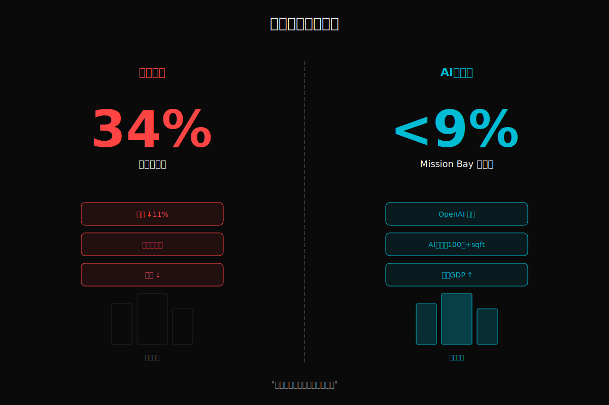

美国的政治体制在这场危机中可能成为劣势。政治极化意味着任何救助法案都会陷入拉锯：右派说再分配是马克思主义，左派说让科技资本家参与制定规则等于监管俘获。而2028和2032年都是大选年——最需要政策行动的窗口期，恰恰是政治最无法行动的时刻。政客跟着意识形态走，不跟着现实走。

### 4.2 中国：不同的剧本，相同的结局

中国面对同样的冲击，但路径不同。

"百模大战"之后大浪淘沙，最终可能剩下3-5家头部模型公司。制造业与AI、机器人的结合使中国更早拥抱自动化。开源的智能购物代理（如千问Qwen生态中的产品）可能成为AI接管消费决策的催化剂。中国的制度特征——可以更快推行收入再分配和产业政策——在危机时刻可能是巨大的优势。

但中国面临一个独特的文化冲击。"勤劳致富"是刻在中国社会骨子里的信仰：好好学习才能找好工作，好工作让你买房结婚养孩子。整个社会运转靠的是"努力就有回报"这个承诺。当这个承诺失效——不是因为你不努力，而是因为努力本身不再值钱——这不只是经济问题，这是信仰崩塌。

叠加上人口结构的困境：中国本就在老龄化和少子化的轨道上，年轻人已经在"躺平"。AI再把仅剩的岗位拿走，"躺平2.0"将不再是选择而是被迫——不是不想卷，是没地方卷。当整整一代人从一开始就知道自己不会被需要，他们会怎么定义人生？日本的"引きこもり"（蛰居族）现象乘以十倍，并非不可想象。

### 4.3 印度：数字殖民的连锁反应

如果说美国是暴风眼，印度可能是受灾最严重的地区。

印度IT服务每年出口约2000亿美元，核心卖点只有一个：人便宜。但AI编码智能体的边际成本已经降到电费水平。TCS、Infosys、Wipro的合同加速取消 [1]。这是第一层冲击。

第二层：印度IT产业撑起了一个庞大的中产阶级。班加罗尔、海德拉巴、浦那——这些城市围绕IT外包建起了整个生态：公寓、商场、学校、医院。IT崩了，房价跟着崩，消费跟着崩，地方财政跟着崩。一个行业的冲击变成整个城市群的衰退。

第三层：人口流动链条断裂。过去二十年，印度最优秀的工程师有一条清晰的上升路径：读IIT → 进TCS或Infosys → 拿H-1B签证去美国 → 在硅谷年薪20万美元 → 买房、拿绿卡、扎根。印度裔已经成了硅谷最强大的移民群体。但如果IT外包产业崩了，美国也不再需要那么多程序员，这条路就断了。

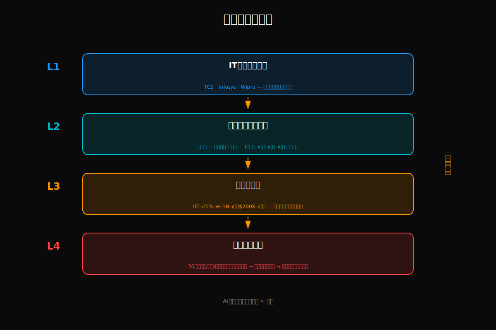

第四层，也是最少被讨论的一层：这对美国自身的影响。过去三十年，硅谷的创新有很大一部分是移民驱动的。印度、中国、东欧的工程师撑起了大半个科技行业。如果高技能移民没有理由再来，美国可能面临和日本类似的困境——一个老龄化、缩小化的社会，只不过这次有AI来填补空缺。但一个"AI运转、人类养老"的社会，和传统意义上的美国已经完全不同。

从更宏观的视角看，这是一种新形式的"数字殖民"。智能过剩集中在拥有算力的地方——美国和中国占据全球AI算力的80%以上。其他国家从AI接受服务，但不控制AI，也不从AI获益。核心国家掌握关键生产力，边缘国家提供原材料和市场——和殖民时代的逻辑一模一样，只不过这次的"枪炮"是GPU。

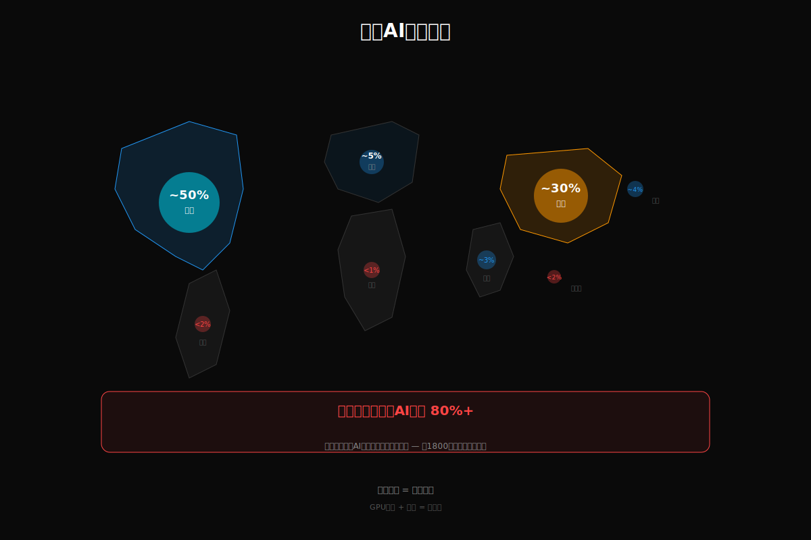

非洲、东南亚、南美，它们甚至来不及工业化，就被跳过了，直接进入一个自己完全没有话语权的智能时代。

### 4.4 欧洲：监管者的困境

欧洲的处境微妙。它是全球AI监管最积极的地区（AI Act），但几乎没有头部AI公司 [22][23]。它在制定规则，但不控制技术本身——就像在给别人的工厂写安全手册，工厂却不在你的地盘上。

不过欧洲有一张牌：社会福利体系。北欧国家的高税收、高福利模型，可能反而成为AI时代最先适应的社会结构。芬兰2017年就试点过基本收入（UBI）。问题是，欧洲的小规模试验能推广到几亿乃至十几亿人口的大国吗？答案很可能是否定的——但它至少提供了一个概念验证。

### 4.5 发展中国家：当比较优势被AI抹平

上述分析集中在美国、中国、欧洲——但全球还有50多亿人生活在这三个经济体之外。对他们来说，AI可能不是一场机遇，而是一次二次殖民。

先看算力分布。全球AI算力极度集中：美国控制约75%的GPU集群性能，中国约15%，欧盟仅4.8%，其余所有国家共享约6% [59]。仅美国一国就拥有3970万张H100等效GPU，中国约40万张——接近100:1的差距 [59]。这意味着AI不是一个全球均匀扩散的技术，而是一个高度集中在两个超级大国的战略资源。发展中国家几乎没有任何AI算力基础设施。

这种集中为什么致命？因为它正在摧毁发展中国家唯一的竞争优势——廉价劳动力。

一台工业机器人的运营成本约为每小时0.75美元（电费+维护），而美国工人时薪15-20美元，孟加拉制衣工人约0.5美元 [60]。机器人价格从2011年的约47,000美元降到了2022年的约23,000美元，预计还将再降50-60% [60]。当机器人成本接近甚至低于发展中国家的人工成本时，"搬去穷国生产"这个全球化的核心逻辑就失效了。

事实上，**逆全球化已经在发生**。2023年，美国宣布了超过287,000个回流（reshoring）或近岸外包（nearshoring）岗位——创历史新高，是2010年的27倍 [61]。推动力正是自动化：中国工资在二十年间上涨了200%以上，而美国工厂引入机器人后，亚洲生产与近岸生产的总成本差距已经"接近于零" [61]。

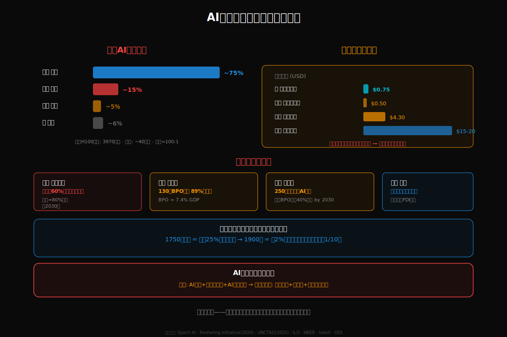

具体到各国：

- **孟加拉国**（纺织业）：估计到2030年，服装行业高达60%的岗位可能被自动化取代。服装出口占该国出口总额的80%以上 [62]。
- **菲律宾**（BPO/呼叫中心）：130万BPO工人面临风险，ILO数据显示89%的BPO劳动力面临高度自动化风险。BPO占GDP的7.4% [62]。
- **肯尼亚**（BPO/技术外包）：250万个工作岗位面临AI威胁。非洲BPO行业到2030年可能失去40%的岗位 [62]。
- **越南**（电子组装）：时薪4.3美元，越来越难与中国自动化工厂竞争。重度依赖FDI驱动的组装模式 [62]。

历史上有一个极为相似的先例。1750年，印度生产了全球约25%的制造业产出。到1900年，这一比例降到了2% [63]。英国蒸汽驱动的纺织厂让手工生产毫无竞争力——1812年英国纱线价格降到了1779年的10%。印度从制造品出口国退化为原材料出口国。不需要炮舰——价格本身就是武器。

AI自动化可能正在重演这个过程。美国和中国掌控AI算力（大脑）和自动化工厂（身体），提供高附加值的服务和自动化制造的廉价商品。发展中国家能提供什么？廉价数据标注劳动力、原材料，以及作为AI平台的被动消费市场——和两百年前的殖民地角色惊人地相似。

**反论：AI能否帮助发展中国家跨越式发展？** 有一个有力的先例——非洲的移动支付。M-Pesa让非洲跳过了传统银行业，目前全球有12亿个活跃移动钱包 [64]。非洲联盟2025年4月在基加利成立了泛非AI理事会，预算2.5亿美元 [64]。AI驱动的农业工具（如PlantVillage Nuru）让小农户通过手机诊断作物病害。

但这个类比有其局限性。移动支付的技术相对简单，可以本地掌控。AI需要的基础设施——算力、数据、人才——极度集中在美中两国。没有本地AI算力，发展中国家将成为AI服务的消费者而非生产者——复制"原材料换制成品"的殖民模式。世界银行行长Ajay Banga也对发展中国家能否真正通过AI实现跨越式发展表示怀疑 [64]。

与工业革命最关键的区别是：**速度**。蒸汽机摧毁印度手工业用了几十年。软件的边际分发成本接近于零——AI摧毁比较优势可能只需要几年。UNCTAD警告，AI可能影响全球40%的就业岗位，但三分之二的发达经济体有国家AI战略，发展中国家只有30%，最不发达国家仅12% [62]。

---

## 五、人口下降：不是危机，是自然规律

在讨论生育率之前，先澄清一个常见误解：**寿命变长不会自动抵消劳动力减少**。延寿技术在普及前期通常只惠及少数高收入群体，且成本高企；它增加的是老龄人口存量，却未增加劳动年龄人口。若就业已被AI替代，延寿反而加大赡养与财政压力，而不会补回“人口红利”。

### 5.1 催生的失败

全球生育率正在经历历史性的下降。韩国的总和生育率已跌至0.72——人类有记录以来最低 [5]。中国1.0，日本1.2，意大利1.2，西班牙1.2 [4][5]。全球生育率从1950年的5.0降到今天的约2.3 [21]，联合国预测到2100年将降至1.8，全球人口将在2084年前后见顶，然后开始减少 [6]。《柳叶刀》/IHME的研究更为悲观，预测生育率下降将"戏剧性地"改变全球人口格局 [7]。

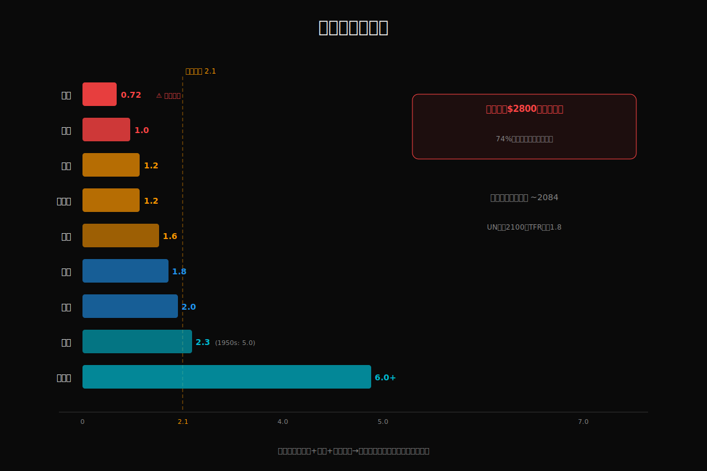

几乎所有发达国家都在拼命催生。韩国的案例最具说服力——过去二十年花了超过2800亿美元：生育补贴、税收减免、育儿补贴、住房优惠、甚至政府资助的相亲活动 [8]。结果呢？生育率从低跌到更低。研究发现，这些补贴中约74%花在了"本来就会生的人"身上 [9]。要把韩国的生育率拉回替代水平，补贴规模需要再扩大15倍 [9]。日本也一样：补贴给了，假也放了，但长工时、高房价、高教育成本——结构问题不解决，砸钱没有用 [8]。

各国政府花几千亿催生，本质上是在用钱对抗人类文明的方向。这注定失败。人类历史上，生育率下降总是与文明进步同步：越富裕、越受教育、女性越独立，生育率就越低。这不是"问题"——这是人类选择了更高质量的生活。

### 5.2 婚育崩塌的经济学逻辑

生育率下降不是孤立的。它的上游是结婚率暴跌和离婚率攀升——而这一切，归根结底都是经济规律。

中国的结婚登记数从2013年的1347万对骤降到2024年的610万对，降幅55%，创1986年有记录以来最低 [24]。初婚人数首次跌破1000万。美国的结婚率也从2000年的8.2‰降到2023年的6.1‰，下降25% [25]。OECD国家平均结婚率从5.1‰降到3.8‰，初婚年龄从25岁推迟到32岁 [26]。

离婚率则呈现出一个微妙的趋势：中国的离婚率在2019年达到3.36‰的峰值，此后因冷静期政策有所回落 [24]；美国的离婚率虽然从4.0‰降到了2.4‰，但"灰色离婚"（50岁以上）占比接近40% [25]——老一代在分手，年轻一代干脆不结了。不是离婚率降了，是连结婚的勇气都没有了。

为什么？因为婚育的经济ROI在崩塌。

在农业时代，孩子是生产力——多一个孩子多一双手，是正回报的投资。在工业时代，孩子是社会保障——养儿防老，是长期投资。但在AI时代，这个等式彻底翻转了。中国养一个孩子到18岁的成本是人均GDP的6.3倍（约53.8万元），全球第二高，远超美国的4.1倍、法国的2.0倍 [27]。而当AI的生产力远超普通人，孩子长大后能贡献的经济价值反而在缩水。投入越来越高，回报越来越低——任何理性的经济人都不会做这笔投资。

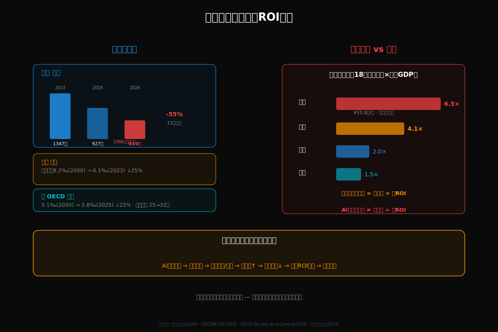

这不是文化问题，也不是观念问题——这是纯粹的经济规律。当生产力不再需要人口数量来支撑，当养育成本持续攀升而预期回报持续下降，人类会自然而然地减少繁殖。政府的催生补贴试图逆转的不是一个政策问题，而是一个经济学铁律。

### 5.3 AI-生育率下降螺旋

而接下来只会更糟。前文所述的AI大裁员——白领失业、降薪、降档——会直接砸掉生育率的最后一点支撑。人在什么时候不生孩子？经济不稳定的时候。你连自己的房贷都快还不上了，你会考虑生孩子吗？

这又是一个自我强化的螺旋：

**AI替代工作 → 收入不稳定 → 不敢生 → 人口减少 → 社会更依赖AI → AI替代更多工作**

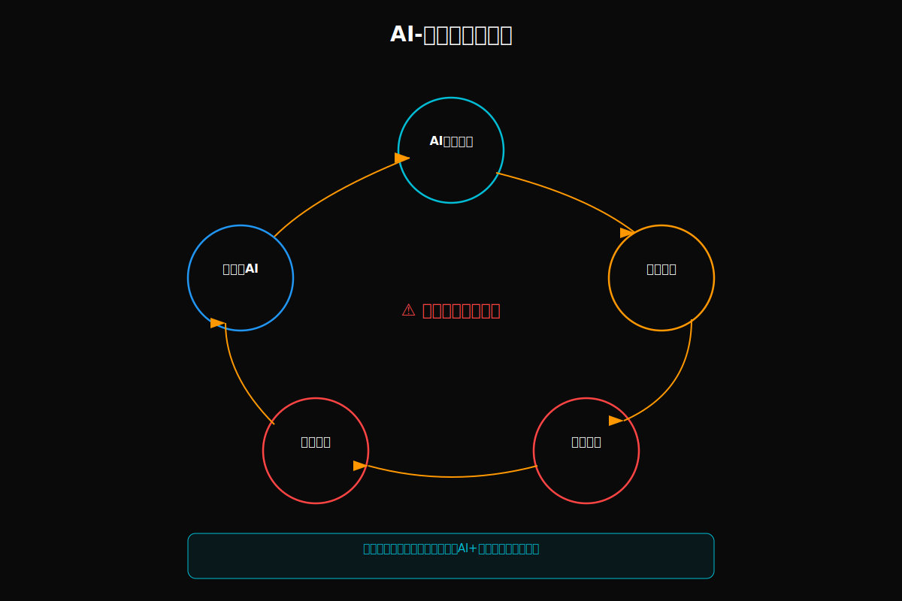

而对男性来说，这个打击是双重的。在全球大多数文化中，男性的自我认同和社会价值仍然高度绑定经济能力——"养家"既是社会期待，也是自信来源。前文分析的就业冲击恰恰集中在男性主导的领域：卡车司机（全球约1亿驾驶岗位，男性占绝大多数）、制造业蓝领（人形机器人替代）、初级程序员和金融分析师（AI直接替代）。当一个男人失去收入，他失去的不只是钱——他失去了"我有能力组建家庭"的信心。

数据印证了这一点。经济学研究反复证实：男性失业率每上升1个百分点，结婚率下降约1.5-2% [88]。在中国，"有车有房"是婚恋市场的入场券——当AI裁员潮让越来越多男性无法满足这个门槛，他们不是"不想结婚"，是"不敢结婚"。日本已经预演了这个剧本：经济停滞三十年，男性终身未婚率从5%飙升到28%，"草食系"不是文化选择，而是经济绝望的产物 [88]。

女性同样被AI打击就业——客服、行政、会计、HR、初级法律、医疗文秘——这些女性占比极高的白领岗位恰恰是大语言模型最擅长替代的。所以不是"男性失业、女性独立"的简单叙事，而是**双方都在失去经济安全感，只是男性额外失去了"养家"这个身份认同**。

但更根本的问题是：**婚姻本身的ROI在归零。**

传统婚姻本质上是一笔经济交易——它的ROI曾经是正的。农业时代，男人在外劳作，女人在家做饭、带孩子、维护家庭。这种分工是生存所需：一个人根本忙不过来。工业时代延续了这种模式：男人上班赚钱，女人管家。结婚的经济回报清晰可计算——两个人的效率远高于单身。

AI时代把这个等式彻底拆解了。做饭？外卖30分钟到门口。打扫？钟点工随叫随到。洗衣？丢进洗烘一体机。孤独？AI聊天机器人24小时在线，不会吵架、不会冷暴力、永远耐心倾听。性需求？AI赋能的智能伴侣产品正在快速迭代——不只是物理层面的硅胶产品，而是结合了大语言模型的情感交互、个性化记忆、甚至"性格成长"的AI companion [89]。日本的"关系AI"产业已经是一个数十亿美元的市场。中国2024年AI虚拟伴侣用户超过**3000万**，其中70%是男性 [89]。

当婚姻提供的每一项功能——经济互补、家务分工、情感陪伴、性——都可以被市场服务或AI替代品以更低成本、更少摩擦的方式满足时，婚姻的"功能性需求"就只剩下一个：生育。而生育本身的ROI也在崩塌（前文已述）。

这形成了一个多重强化的循环：**AI裁员 → 男女都失去经济安全感 → 婚姻经济互补消失 → AI替代情感/陪伴/家务需求 → 结婚理由归零 → 不婚不育 → 人口加速萎缩 → 社会更依赖AI**。

与前文的"智能替代螺旋"一样——没有人会主动停下来。韩国0.72的生育率，是在经济相对稳定、AI尚未大规模渗透的时期测得的。等AI大裁员的冲击波真正到来，叠加AI伴侣对婚姻需求的进一步替代，0.5甚至更低，并非不可想象。当全球1亿驾驶岗位、数千万制造业岗位、数千万白领岗位同时收缩，同时AI伴侣让独居生活越来越舒适，受冲击的不只是GDP——是人类繁衍的意愿本身。

### 5.4 机器人养老的现实与前景

但这里有一个"反常识"的视角：如果我们把AI纳入等式，人口下降可能不是危机，而是自然规律，甚至是适应性调整。

传统的担忧逻辑是：人口减少 → 劳动力不够 → 经济萎缩 → 没人养老 → 社会崩溃。所以政府拼命催生，因为需要年轻人来工作、交税、养老人。但如果AI和机器人能替代劳动力呢？如果工厂不需要工人、程序不需要程序员、医院可以用AI诊断和机器人护理？那"需要更多年轻人来工作"这个前提就不成立了。

日本已经在做这件事。日本政府从2015年开始给养老院补贴护理机器人 [10]。韩国部署了超过5400台AI陪伴机器人到全国115个地方政府。一个叫"孝돌"（Hyodol）的AI娃娃，会用七岁小孩的语气跟老人聊天、唱歌、做认知训练 [11]。

现在这些还很初级，机器人本身还需要人来维护。但按照我们开篇所述的速率——十年够改变一切——二十年后的护理机器人将和今天的产品有天壤之别。

也许正确的问题不是"怎么让人多生孩子"，而是"在人口自然减少的前提下，如何让社会继续运转"。答案可能就是AI和机器人。未来给人类养老送终的，不是人类的子孙，而是机器人。这听起来冷酷，但可能反而更可靠——机器人不会不耐烦，不会虐待老人，不会因为遗产问题闹翻，会24小时陪护，永远耐心，永远在场。

当然，这里有一个更长期的推论：如果人类不再需要大量人口来维持经济和养老，那人口会持续减少。几百年后，"自然人类"的数量可能只有今天的十分之一。地球上绝大多数"居民"是AI和机器人。人类成为自己星球上的少数族裔。这不是科幻，这只是把今天的趋势线往前画一百年。

---

## 六、金融体系的塌方链

### 6.1 按揭问题：好贷款遇上坏世界

美国住房按揭市场规模13万亿美元 [1]。这些借款人FICO评分780分，首付20%，信用完美。2008年金融危机的核心问题是：贷款从第一天就是坏的——次贷借款人根本不具备偿还能力。而这一次完全不同：贷款在签出那天是好的，只是世界在贷款签出之后，变了。

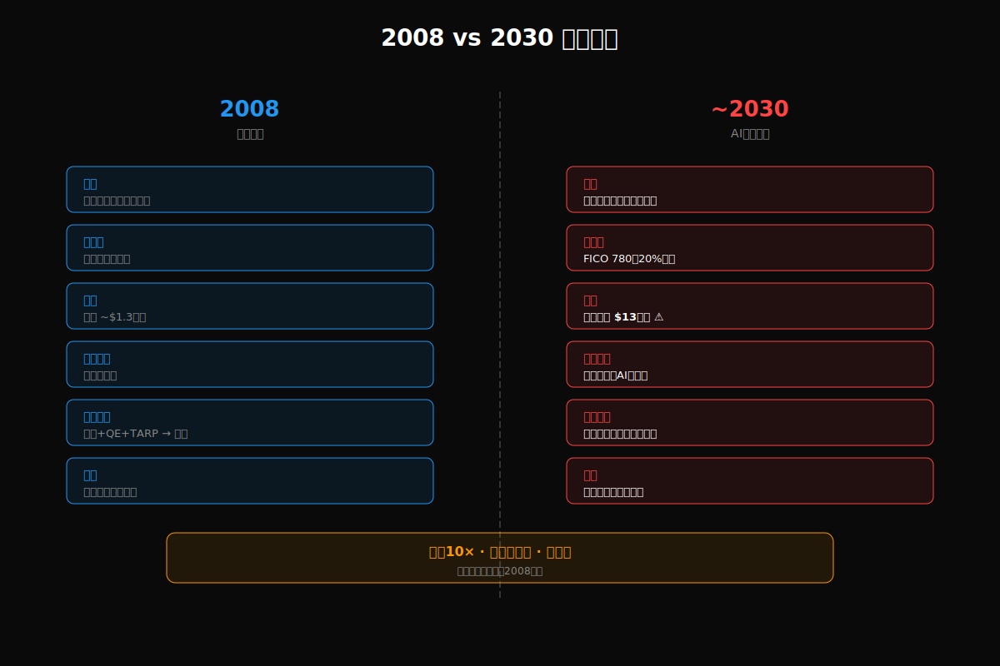

旧金山房价同比下跌11%，西雅图下跌9%，奥斯汀下跌8% [1]。白领降薪降档后，靠信用卡透支和401(k)提前取现维持还贷。技术上"还在还款"，但已经停止所有非必要消费。这些人虽然还在还贷，但实质上已经是"僵尸户"——数据上不算违约，实际上已经退出了经济循环。

往下推演几层。

**第一层：财富效应。** 在美国，房子是中产阶级最大的资产。房价下跌让人们觉得自己变穷了——即使还没失业，也会减少消费。这种心理效应会放大实际经济收缩。

**第二层：地方财政。** 美国的公立学校、消防、警察主要靠房产税。旧金山房价跌11%意味着学校预算被砍、老师被裁、班级合并、教育质量下降。有钱人把孩子转去私立学校，穷人的孩子困在一个越来越差的公立系统里。AI冲击最终变成了教育不平等。

**第三层：科技城市的脆弱性。** 房价下跌最严重的城市恰好是科技城市——旧金山、西雅图、奥斯汀。这些城市过去十年的繁荣完全靠科技行业。科技业裁员 → 房价跌 → 餐馆关门 → 服务业裁员 → 人口外流 → 税基萎缩 → 基础设施恶化。底特律花了三十年经历的衰败 [17]，旧金山可能五年就走完。

为了让链条更可操作，给出一个简易压力测试框架（可用你所在城市的数字替换）：

- 输入：本地房价同比（%）、失业率（%）、本地银行住宅+商办贷款占资产比例（%）、平均贷款LTV、平均利率。
- 假设：房价再跌x%，失业率再升y个百分点；违约率近似随LTV上升和失业同步线性放大（可用2008年地方性数据的弹性做参照）。
- 输出：区域银行资本充足率的大致缺口，以及地方财政（房产税基）收缩幅度。若资本缺口>3个百分点且税基收缩>10%，即意味着“去城市化”风险进入高位区。

这不是精算模型，但能帮助读者把叙事落在具体数字上。

还要把“寿命延长”纳入这张表：工作年限因失业/自动化缩短，而退休年限因延寿拉长，养老金与医保的收支缺口会被同时放大。若税基仍主要依赖工资税而非资本/算力分红，这个缺口不会自动弥合。

### 6.2 中产断供 → 银行危机 → 去城市化

中产阶级是现代经济体系的支柱。他们买房、消费、交税、还贷——整个系统的循环靠他们转。当中产没了收入，第一张倒下的多米诺骨牌是银行。

美国有近1万亿美元的商业地产贷款在2026年到期 [16]，其中五分之一是办公楼。这些贷款当初是按"办公室永远会有人坐"来定价的。现在旧金山办公楼空置率34% [15]。借款方还不起贷款，银行要么续贷（假装没事），要么认损（资产负债表被炸穿）。

住宅按揭才是真正的定时炸弹。中产白领的断供不同于2008年的次贷——这次是从"能还"变成"还不起"。而中产的贷款金额远大于次贷：一套旧金山的房子200万美元，首付40万，贷款160万。这种级别的坏账，区域银行扛不住。

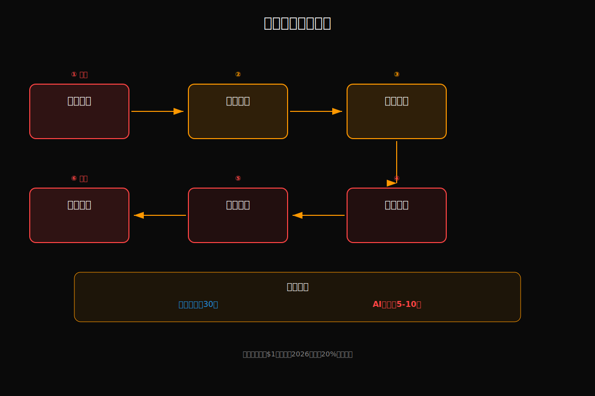

哪些银行最危险？不是华尔街的巨头——摩根大通、高盛的业务足够分散。是区域银行。美国有几千家区域银行，资产集中在本地房贷和商业地产。当一个城市的支柱产业崩了，本地银行就跟着崩。2023年硅谷银行倒闭只是预演 [16]。接下来可能是一连串区域银行的倒闭潮。FDIC能救几家，但救不了几百家。银行一倒，信贷冻结，城市基础设施开始老化却无钱维修。这就是去城市化的起点。

### 6.3 双速城市：核心 vs 普通

去城市化不是新概念。底特律从185万人口缩减到68万，用了65年 [17]。克利夫兰联储的研究详细记录了美国"锈带"城市的衰退轨迹 [18]。中国东北已经在经历类似的过程——辽宁的年轻人月薪三四千，大学毕业不回来；鹤岗的房子两三万一套没人要 [19]。中国目前有超过5000万套空置住房 [20]。

但过去的去城市化是缓慢的、局部的——一个行业没了，一个地区衰落。AI驱动的去城市化可能是快速的、广泛的。而且，这次不只是蓝领城市。过去去城市化发生在工厂关闭的地方——底特律、匹兹堡 [18]。这次会发生在白领集中的地方——达拉斯的金融区、亚特兰大的企业总部园区、中国无数个"新区"和"开发区"。一个白领岗位的消失，大约会拖倒3-5个服务业岗位。

我的判断是会出现"双速"格局：

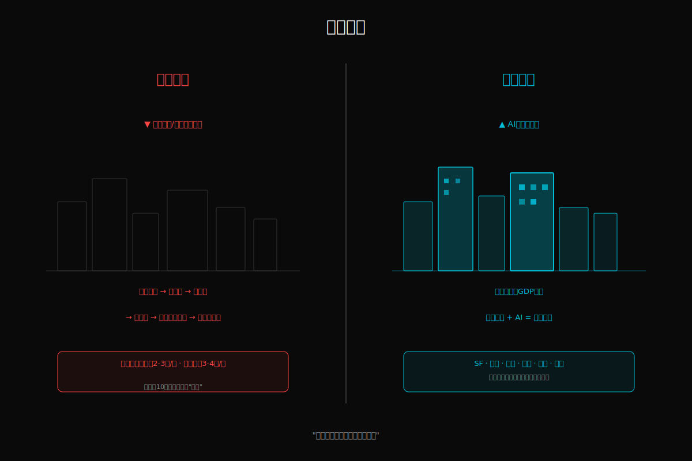

**普通城市——快速衰退。** 那些靠单一产业或政府转移支付维持的中小城市，中产失业后消费崩塌、商铺关门、房价暴跌、银行坏账飙升、地方财政破产、公共服务萎缩、年轻人和有能力的人离开，留下走不了的老人和穷人。Rust Belt花了三十年走完的路 [18]，AI时代的普通城市可能五到十年就走完。

**核心城市——慢一点，但也会变形。** 旧金山、纽约、北京、上海——这些城市有一个普通城市没有的东西：多样性和网络效应。它们不会消亡，但会从"大量中产工作的城市"变成"少数极高产出的AI精英 + 大量服务业底层"的城市。人口可能减少一半，但GDP反而增长——因为剩下的人（和AI）的产出极高。你会看到一种奇怪的景观：城市中心几栋超级写字楼灯火通明，周围十几个街区半空着、商铺拉着卷帘门。像一个心脏还在跳、四肢已经冷了的身体。

中国的情况更极端。过去二十年的城市化是人类历史上最大规模的人口迁移——几亿人从农村涌入城市，房价被推到天上。但这个模式的前提是"城市有工作"。如果AI把城市的工作也拿走了，当初进城的理由就不存在了。一线城市可能还好——北京、上海、深圳有AI产业支撑。但几百个三四线城市的经济靠的是地方政府、房地产开发和为大城市配套的制造业，这三个支柱在AI时代全都不稳 [19][20]。未来，几百个城市可能变成"鹤岗"。中国花二十年建起来的城市化，可能在十年内开始逆转。

### 6.4 私人信贷爆雷

金融体系还隐藏着另一个定时炸弹。过去十年，华尔街把保险公司变成了融资工具：Apollo买了Athene，KKR收了Global Atlantic——用普通家庭的年金去投PE支持的软件债 [1]。当软件公司因AI冲击而违约，受伤的是Main Street的退休金。

这不是假设。Zendesk的违约——50亿美元ARR支撑的贷款——已经成为史上最大的私人信贷软件违约案例 [1]。所谓"永久资本"的真相，是普通人的年金。标普从高点回撤38%，可能最终接近-57% [1]——回到ChatGPT诞生前的水平。换句话说，AI创造的全部市值，可能被AI摧毁的经济全部抹掉。好像ChatGPT这三年的财富效应，只是一场梦。

### 6.5 政府工具箱的失灵

危机到来时，所有人都看向政府。但政府本身快破产了。联邦财政收入比预测低12% [1]——因为政府征的是人类劳动的税，而人类越来越不干活了。

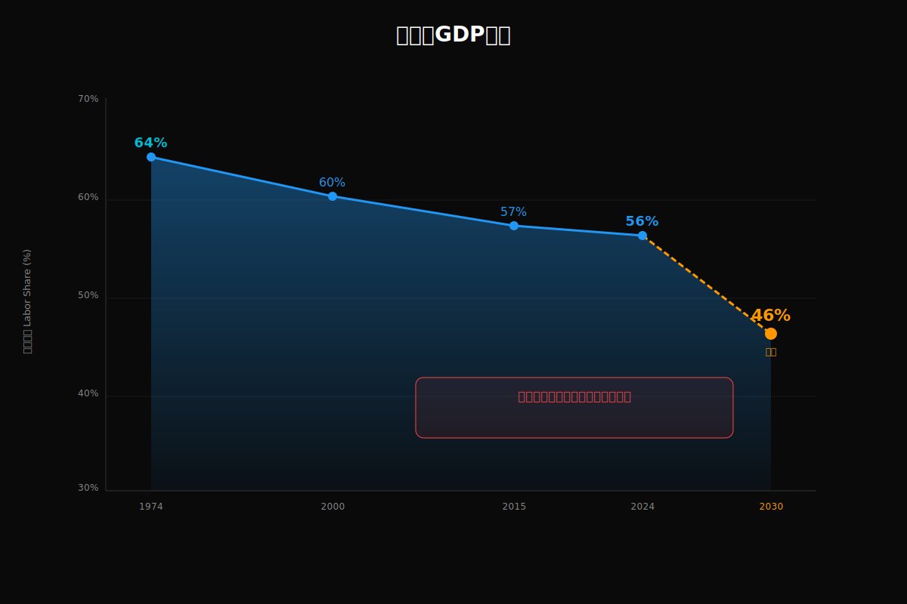

劳动者在GDP中的份额四十年从64%降到56%，AI可能在五到六年内再将其压低到46% [1]。政府需要在收入减少时给更多人发钱——这是一道不可能的财政方程。

传统的救市工具还管用吗？2008年，美联储降息、QE、买国债——管用了，因为那次是金融管道的问题，修好管道水就流了。但这次不是管道的问题，这次是"水"本身在消失。你可以把利率降到零，买下所有MBS，但这改变不了一个事实：一个AI代理每月200美元，能做一个年薪18万美元产品经理的工作。降息不能让被替代的工作回来。QE不能让AI变慢。政府的工具箱里，没有哪样能应对这种结构性危机。

新工具呢？算力税？机器人税？AI产出版税？每一个提案都面临同一个反对："你对AI征税，企业就搬去不征税的国家。"这变成了全球版的"囚徒困境"——每个国家都想征税，但没人敢先征。谁先动手，谁先失去竞争力 [22]。

那政府最可能做的事情是什么？答案几乎肯定是：印钱。

历史反复证明，当失业迅速失控，政府不会坐视20%以上的失业率引发社会动荡。它们会大规模印钞——先叫"刺激"，再叫"救济"，最后叫"基本收入" [31]。美国在2020年COVID冲击后两天就通过了1920亿美元刺激方案，四个月后CARES Act直接砸下2.2万亿美元，相当于GDP的10%以上 [32]。这种速度在AI危机中完全可能重现。

但各国的能力和意愿差距巨大：

**美国**——速度最快，规模最大，但政治极化是最大的障碍。2020年两党能团结是因为"病毒不分左右"。AI失业不一样：右派说"这是市场淘汰"，左派说"这是资本家的阴谋"。大选年（2028、2032），任何救助法案都会变成竞选工具而非政策工具。但一旦失业率真的飙到两位数，美联储会毫不犹豫地开动印钞机——它在2008年和2020年已经证明了这一点。

**中国**——制度优势在于决策速度。中国可以在一个月内宣布全国性补贴政策（2025年初的育儿补贴就是例子）。但中国在COVID期间的财政刺激远比美国谨慎 [32]，地方政府的实际支出长期落后于预算。更深层的问题是：中国的地方财政已经因为房地产下行而捉襟见肘 [19][20]，再叠加AI失业冲击，钱从哪来？

**欧洲**——最慢启动，但社会安全网最厚。北欧国家天然适合转型：芬兰2017-2018年的UBI试点发现，领取基本收入的人幸福感显著提升，心理压力降低，虽然就业效果有限 [33]。但欧洲的决策需要27国协调，欧盟SURE计划比美国慢了62天才通过 [32]。速度在危机中是致命的。

这里出现了一个反直觉的可能性：**印钱 + AI生产力飙升 = 也许普通人的生活不会崩？**

逻辑是这样的：Sam Altman预测AI会带来"大规模通缩"——因为AI让商品和服务的生产成本暴跌 [34]。AI使用成本每年下降10倍 [34]。如果政府印钱维持家庭购买力，同时AI让食品、衣服、医疗、教育的价格持续下降，那通胀和通缩可能相互对冲。你拿到的钱变多了（印钱），东西变便宜了（AI生产力），你的实际生活水平……也许能维持？

但这个乐观场景有三个致命漏洞：

**第一，土地和住房不会通缩。** Altman自己也承认："大多数商品价格会大幅下跌，但奢侈品和土地等固有稀缺资源的价格可能大幅上涨" [34]。AI能让食物便宜，但不能让旧金山多出一块地。住房——中产最大的支出——可能反而更贵（核心城市）或一文不值（衰退城市）。

**第二，印钱的财富效应是不均匀的。** QE制造的流动性不会均匀地流向所有人。2008年后美联储印了几万亿，股市翻倍，但底层工资几乎没动。AI时代的印钱同样会先流向资产——AI公司的股票、核心城市的房产——而不是流向失业者的餐桌。

**第三，日本的前车之鉴。** 日本做了二十多年的QE和接近零利率，通胀率2026年初才1.5% [35]。大量印钱并没有让消费者花更多钱——人们选择还债而不是消费。如果AI时代的失业者拿到了政府发的钱，他们会去消费还是去还按揭？大概率是后者。那"印钱→消费→经济循环"的链条就断了。

所以，政府大概率会印钱，但印钱大概率只能续命，不能治病。它能防止社会在短期内崩溃，但不能解决"人类不再是经济循环必要环节"这个根本问题。印钱买的是时间。问题是，买来的时间够不够用来建设一个全新的社会契约。

### 6.6 加密货币、投机与"失业者的赌场"

当传统上升通道被堵死，人们不会安静地接受命运。他们会涌向赌桌。

韩国是这个逻辑的预演。极度内卷、阶级固化、年轻人看不到希望——韩国的加密货币交易人口比例全球最高，好几次比特币的历史最高价是被韩国散户推上去的 [30]。这不是因为韩国人特别懂区块链技术，而是因为正常路径（好大学→好工作→买房）已经走不通了，投机成了最后的阶级跃升幻觉。"躺平"和"炒币"是同一枚硬币的两面——一部分人放弃了，另一部分人在赌命。

AI大规模失业之后，这个现象会全球化。当几千万白领发现自己的技能不再值钱、传统投资（房产、基金）在缩水，短期内涌入加密市场和各种投机品的资金可能不减反增。人没有工作之后不是没有钱——他们有遣散费、有积蓄、有提前取出的退休金——但他们没有了获取新收入的渠道。这些资金会寻找出路，而加密市场7×24小时开放、没有门槛、波动巨大、承诺一夜翻倍——对绝望的人来说，这比投简历有吸引力得多。

这里有几个值得关注的开放性问题：

**加密作为AI经济的支付基础设施。** AI代理需要支付手段来完成交易——比价、下单、跨平台结算。传统银行体系是为人设计的：KYC身份验证、营业时间、人工审批。AI代理无法开银行账户，但可以持有加密钱包。稳定币和智能合约可能成为"机器对机器"交易的天然支付轨道。如果AI代理真的接管了大部分消费决策（如2.2节所述），它们需要的是可编程的钱，不是纸币。

**去中心化金融作为崩塌的替代管道。** 如果5.2节描述的区域银行连锁倒闭真的发生，DeFi可能成为金融系统的"备用网络"——不是因为它更好、更安全，而是因为传统系统不运转了。就像战争时期黑市不是最优解，但当正规市场停摆时，它是唯一的选择。

**但加密本身也逃不脱反身性。** 加密市场的价值很大程度上靠人类投机支撑。文章中描述的消费者消失、中产断供——这些人同时也是加密市场的散户。如果经济真的崩到第五章描述的程度，加密市场能独善其身吗？短期内——失业初期——可能会有一波恐慌性资金涌入（正如韩国模式）。但长期来看，当赌徒的本金也耗尽时，赌场也会空掉。

这不是预测加密会涨还是跌。这是指出：在AI摧毁传统就业的过渡期，加密市场可能同时扮演两个角色——一个是绝望者的赌场，一个是新经济的基础设施。哪个角色最终占主导，取决于AI经济转型的速度和烈度。

---

## 七、公地悲剧：为什么没有人会停下来

前面所有的分析都指向一个核心问题：既然风险如此明显，为什么没有人踩刹车？

答案是教科书式的公地悲剧（Tragedy of the Commons）。

### 7.1 企业层面的竞争陷阱

OpenAI不停，Anthropic就不敢停。Google不停，Meta就不敢停。前文所述的"合成谬误"——每家公司都在理性地奔向集体自杀——放大到企业竞争层面也完全适用。任何一家公司如果主动放慢，就会被竞争对手吃掉。所以没有人放慢。

### 7.2 国家层面的AI军备竞赛

企业层面的逻辑在国家层面被进一步放大——而且加入了一个新维度：**暴力**。

2026年2月，美国国防部给Anthropic下了最后通牒：放弃AI安全底线，允许军事全用途部署，否则取消2亿美元合同 [12][13]。一个以AI安全著称的公司，被自己的政府要求放弃安全底线。理由是什么？中国——"如果我们不把AI用于军事，中国会。"而中国那边的逻辑一模一样："如果我们不加速，美国会。"

卡内基国际和平基金会称之为"AI治理军备竞赛" [22]。英国议员们被警告AI发展正在"竞相触底" [23]。Stuart Russell——AI安全领域的奠基人之一——警告这是在玩俄罗斯轮盘赌 [14]。法国AI峰会主动淡化安全议题，转而强调经济增长。所有人都知道不受控制地发展AI有巨大风险，但谁都觉得："我一停，别人照跑，我就死了。"于是没有人停。

数字背后是真金白银和真实的杀伤力。美国2026财年首次为AI和自主系统设立了独立预算项：**134亿美元**——其中94亿用于无人机、17亿用于自主舰艇、7.3亿用于无人潜航器 [65]。中国估计每年在军事AI上投入约150亿美元 [65]。美国空军正在建造约1000架AI自主"忠诚僚机"（CCA），两款原型机已在测试 [65]。

但最令人不安的不是研发预算，而是AI已经在实战中杀人了。

以色列军方的"Lavender"AI系统分析了加沙230万居民中几乎所有人的数据，为每个人打出1-100的"战斗人员可能性"分数。它标记了约**37,000名巴勒斯坦男性**为潜在目标，每个目标的审批时间仅**20秒**——几乎没有实质性的人类复核。军方评估准确率约90%，意味着约10%是误标。对于每一个被标记的低级别武装人员，军方允许的附带平民伤亡上限是**15-20人**——此前这一数字为零 [66]。Lavender在几天内生成的目标数量，相当于过去一年的工作量。

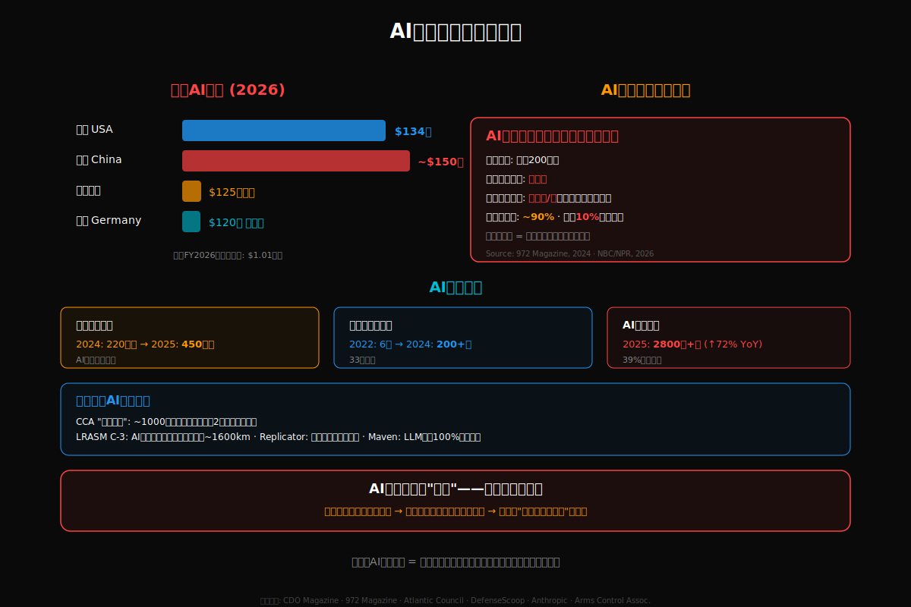

乌克兰的无人机产量从2024年的220万架飙升到2025年的**450万架**，越来越多集成了AI自主目标锁定 [67]。德国拨出近120亿美元建设无人机军备，并计划在2026年部署自己的AI目标识别系统"Uranos KI" [67]。全球生产军用无人机的企业从2022年的6家暴增到2024年的**200多家** [67]。

AI还在改变网络战争的面貌。2025年，AI驱动的网络攻击预计超过**2800万次**，同比增长72% [68]。2025年9月，Anthropic发现了首例大规模AI编排的网络间谍行动——疑似中国国家支持的黑客劫持了AI工具，自主完成了**80-90%的攻击流程**，峰值时每秒发出数千次请求——人类黑客做不到这种速度 [68]。

更深层的风险在于核指挥控制。AI工具正在进入核预警和核指挥系统——它们能更快地检测导弹发射，但速度本身成了危险：过去有时间人工复核的误报，现在可能直接触发不可逆的发射决策。联合国大会以118票赞成通过了关于AI在核指挥控制中应用的决议，但至今没有任何约束性条约 [68]。

核武器至少有一个刹车——互相确保毁灭（MAD）。双方都知道用了就同归于尽，所以没人敢用。但AI不一样。使用AI不是一瞬间的毁灭，而是温水煮青蛙式的替代。每一步看起来都无害——效率提升了一点、成本降低了一点、又多裁了几个人——直到有一天回头看，发现人类已经不在循环里了。

### 7.3 转嫁矛盾：当内部危机遇上外部暴力

现在把前面所有线索串起来。

第二章到第六章描述了AI在发达国家内部制造的连锁危机：大规模失业、中产断供、银行危机、城市衰退、养老金崩溃。这些危机将产生巨大的内部政治压力。同时，7.2节描述了AI让军事力量急剧膨胀。一个国家同时面临内部经济崩溃和外部军事优势——历史上，这种组合几乎总是导致同一个结果：**把矛盾向外转移**。

这不是阴谋论。这是有名字的政治学理论——"转移战争"（Diversionary War Theory）。

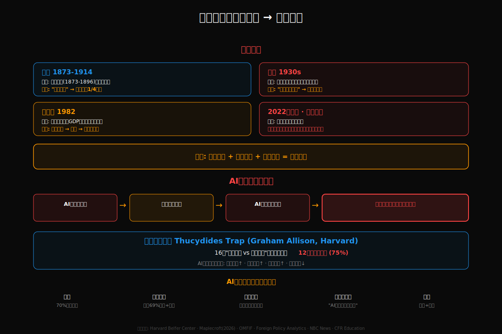

历史先例极为丰富：

**1870s-1914年，英国。** 工业革命导致严重的国内失业和社会动荡。经济学家霍布森（J.A. Hobson）指出，1873年开始的长期萧条直接驱动了帝国扩张——资本家宁可去殖民地投资也不愿提高国内工资。"瓜分非洲"（1881-1914）恰恰发生在英国国内经济最动荡的时期 [69]。工业革命产生的技术优势（蒸汽船、铁路、电报）让这种扩张变得可行。

**1930年代，日本。** 大萧条重创了日本出口导向型经济。政府清楚地认识到对外部资源的依赖，选择通过军事扩张建立"大东亚共荣圈"来解决。经济焦虑 + 民族主义 + 军事技术优势 = 太平洋战争 [69]。

**1982年，阿根廷。** 军政府面临三位数通胀、GDP暴跌、失业飙升。解决方案？入侵马尔维纳斯群岛（福克兰群岛），试图用爱国主义战争转移国内不满。赌博失败了——军事失利加速了军政府的垮台 [69]。

**2022年至今，俄罗斯。** 普京的战争经济已经吞噬了财政预算的30-40%和GDP的7-8%。但他被困住了：经济已经严重依赖国防部门，停战本身就会触发经济危机。正如一份分析所说："结束战争只会让废墟暴露在阳光下" [69]。

现在想象AI时代的美国。2029-2031年，AI大规模裁员的冲击全面显现。抗议规模在2025年Q4已经是2024年Q4的四倍（月均69.6万人 vs 17.2万人）[70]。政治极化达到历史新高——自认"温和派"的比例降到了34%的历史最低 [70]。同时，美国拥有人类历史上最强大的AI军事力量——自主无人机、AI导弹、网络战能力。

一个内部矛盾爆发、外部军事力量空前的超级大国——这个组合在历史上从未和平收场。

关键资源争夺提供了"合理"的借口。中国控制全球约69%的稀土开采和加工 [71]。台湾生产全球70%的先进半导体——整个美国军事基础设施依赖一个距离中国海岸不到100英里的岛屿 [71]。格陵兰的关键矿产已被称为"AI竞赛中的诱人目标" [71]。2025年6月，美国在卢旺达-刚果和平协议中为美国企业获取了刚果钽、钴、铜、锂的**优先准入权**——AI时代的资源外交已经在进行 [71]。

哈佛大学的格雷厄姆·艾利森（Graham Allison）研究了16个历史上"崛起大国挑战守成大国"的案例——**12个以战争告终**，占75% [72]。他称之为"修昔底德陷阱"：不是因为任何一方想要战争，而是结构性压力让和平变得越来越难维持。AI让这个陷阱的每一个要素都在加速——技术差距在拉大，资源竞争在加剧，国内压力在膨胀。

对弱国而言，这意味着什么？AI军事化不只是让强国更强——它让弱国的安全处境急剧恶化。美国134亿美元的AI军事预算，是大多数发展中国家整个国防预算的几十倍。当自主无人机和AI网络武器可以在无人伤亡的情况下投射武力，使用武力的政治门槛大幅降低——因为国内不再有"把谁家的孩子送去战场"的反对声音。AI让战争变得"容易"——这对和平来说是最危险的事情。

### 7.4 人类作为"过渡物种"的机制

这恰恰是人类可能成为"过渡物种"的运行机制。

不是AI主动要替代人类。是人类自己——因为竞争、因为恐惧、因为贪婪——在不断给AI更多权力、更少限制。每一步都是"理性"的。每一步都在把自己推向不可逆的悬崖。没有人按下了什么按钮，没有任何一个人做了一个"错误的决定"。是无数个正确的小决定，汇成了一个不可逆的大结果。

这才是最需要警惕的。

---

## 八、AI重塑人的一生：从摇篮到坟墓

前面七章拆解了AI对经济、地缘、人口、金融和制度的宏观冲击。但宏观数据不会流泪。这一章把镜头推到最近——一个具体的人，从出生到死亡（甚至死后），每个人生阶段将如何被AI重塑。

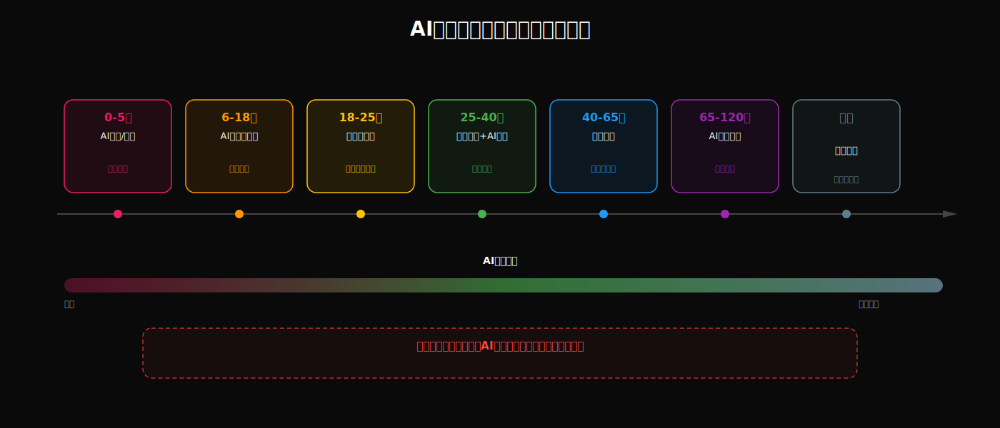

### 8.1 被AI养大的一代人

2026年出生的孩子，大概率不会被人类保姆带大。

经济逻辑很简单：双职工家庭请全职保姆，在北京月薪8000-15000元，在纽约年薪4-6万美元。一个AI驱动的智能陪伴设备（平板+摄像头+大语言模型），月费不到100元。当保姆成本是AI陪伴的100倍，选择不言自明。

AI保姆的"优势"恰恰是它的危险：**永远耐心，永远不拒绝，永远不发脾气。** 人类保姆会累、会烦、会说"不行"。这些"缺点"恰恰是孩子学习社交的关键——学会被拒绝、学会等待、学会处理冲突。一个从未被AI拒绝的孩子，第一次在幼儿园被同龄人拒绝时，可能完全不知道如何反应。

斯坦福2025年的调查显示，**26%的美国青少年**已经在用ChatGPT做作业 [101]。这不是未来——这是现在。而且这个数字只统计了ChatGPT，没有包括Character.AI、Claude、Gemini等其他工具。实际比例可能远高于此。

从"数字原住民"（Digital Native）到"AI原住民"（AI Native）的代际跃迁正在发生。1990年代出生的人是第一代从小接触互联网的人；2020年代出生的人将是第一代从小被AI养大的人。区别在于：互联网是你去用的工具；AI是会主动找你互动的"伙伴"。一个孩子与AI导师的对话时间可能超过与父母的对话时间——这对人格发展意味着什么，没有人知道，因为人类历史上从未出现过这种情况。

### 8.2 意义危机：当工作不再定义"我是谁"

"你是做什么的？"——这是人类社交中最常见的破冰问题。它之所以有效，是因为在所有文化中，职业几乎等于身份。"我是医生""我是工程师""我是老师"——这不只是在描述工作内容，是在宣告"我是谁"。

当AI大规模替代工作，被夺走的不只是收入，而是**回答"我是谁"的能力**。

大萧条提供了最清晰的历史参照。1928-1932年，美国自杀率从每10万人18.0人飙升到**22.1人**——美国历史最高值，四年间上升22.8% [103]。最关键的细节是：自杀率上升最猛烈的群体不是最穷的人，而是**25-64岁的工作年龄成年人**——正是"职业=身份"最强烈的群体 [103]。他们不是饿死的——1930年代美国没有大规模饥荒。他们是被剥夺了**purpose**。研究反复表明，失业、负债和房屋止赎是自杀的核心风险因素，而这些因素的本质是**经济身份的丧失**，而非单纯的物质匮乏 [103]。

日本已经在大规模预演AI时代的"意义危机"。日本内阁府的调查显示，全国约有**146万蛰居族**（hikikomori），占人口约2% [104]。这不再是"年轻人的问题"——40-64岁的中年蛰居族约61.3万人，已经超过了15-39岁的51.4万人 [104]。最令人不安的是"8050问题"：80多岁的父母在家供养50多岁的儿子，两代人都困在屋里。当整个经济体系已经不需要他们了，他们也就不再需要出门。

**男性身份在这场危机中格外脆弱。** 几乎所有文化都对男性有一个核心期待：赚钱养家。当这个期待无法实现，男性失去的不是一份工作，而是整个社会角色。前文（5.3节）已分析了男性失业率每上升1个百分点、结婚率下降1.5-2%的数据 [88]。这不是因为女性"嫌贫爱富"——而是因为男性自己也不相信自己"配得上"组建家庭。心理学研究表明，男性失业后的抑郁发病率是女性失业后的**1.5-2倍**——不是因为男性心理更脆弱，而是因为"工作"在男性身份建构中的权重更大。

这里有一个从未在全社会规模发生过的实验。历史上，贵族阶层一直不需要工作——他们用艺术、哲学、社交来填充时间。但贵族的闲暇建立在两个前提上：一是他们从出生起就被教育"你的价值不在于劳动"，二是他们占人口的极小比例（1-3%）。当AI让多数人不再需要工作时，等于把"贵族式闲暇"一夜之间推广到整个社会——但没有人教过他们：不工作的日子该怎么过才有意义。这不是"意义经济"的诞生，而是意义真空的降临。

### 8.3 AI伴侣与亲密关系的终结

5.3节从生育率的角度分析了AI伴侣对婚育决策的冲击。这里换一个镜头——从个体亲密关系的体验出发，看AI如何改变"爱"这件事本身。

2024年，Character.AI月活用户约**2000万**，峰值时月访问量超过**2亿次** [105]。Replika月活约**200万** [105]。中国AI虚拟伴侣市场2024年营收**20.4亿美元**，预计2030年达到126亿美元，年复合增长率35.4% [105]。这不是边缘现象——这是一个正在爆发的产业。

AI伴侣的吸引力在于：它提供了亲密关系的**"够用版"**。不吵架。不出轨。不要求你做家务。不嫌你赚得少。不会在你加班时发脾气。记住你说过的每一句话。永远在你需要的时候出现。它不是"完美伴侣"——它是"零摩擦伴侣"。

真人关系恰恰相反：它充满摩擦。你需要妥协、吵架、道歉、忍受对方的缺点、处理对方家庭的关系、分担经济压力。这些摩擦曾经是"爱情的代价"——你愿意为一个人承受这些。但当AI提供了一个无摩擦的替代品，**真人关系的摩擦成本突然变得刺眼**。就像你习惯了电梯之后，六楼的楼梯变得不可忍受——不是楼梯变了，是你的参照系变了。

**性别差异显著：男性更容易转向AI伴侣。** 前文（5.3节）提到中国AI虚拟伴侣用户中70%是男性 [89]。Character.AI的用户性别比约为51:49，但重度使用者（每天使用超过2小时）中男性占比超过65% [105]。原因不复杂：在现有的婚恋市场中，男性面临更大的经济门槛（有车有房），而AI伴侣完全绕过了这个门槛。

这衔接了5.3节的AI-生育率螺旋：AI替代工作 → 收入不稳定 → 不敢结婚 → AI伴侣填补孤独 → 更不需要结婚 → 生育率进一步崩塌。AI伴侣不是螺旋的原因——它是螺旋的加速器。

### 8.4 健康分化：有钱人活到120，穷人还是75

AI正在医疗领域创造一个矛盾的局面：**诊断在民主化，治疗在贵族化。**

AI诊断工具确实在降低医疗门槛。一个手机App就能做初步的皮肤癌筛查、视网膜病变检测、心律异常识别。Google的Med-PaLM在美国医师执照考试中得分超过专家水平。这是好消息——穷人第一次能用接近免费的方式获得高质量的初筛。

但真正决定你能活多久的，不是诊断，而是治疗——而治疗的价格曲线正在朝相反方向飞。基因编辑治疗（如镰刀型细胞贫血的Casgevy）单次约200万美元。GLP-1减肥药年费1.5-2万美元。表观遗传重编程——真正的"返老还童"技术——还在临床试验阶段，商业化后的价格可想而知。

哈佛大学Chetty等人的里程碑研究揭示了一个令人震惊的数字：**美国最富1%与最穷1%之间的预期寿命差距，男性为14.6年，女性为10.1年** [106]。更令人不安的是趋势：2001-2014年间，最富5%的美国人预期寿命增加了2.34年（男性），而最穷5%仅增加了0.32年——几乎没有改善 [106]。《柳叶刀》2024年的数据显示，美国不同群体间的预期寿命差距从2000年的12.6年扩大到2019年的15.6年，COVID后更是飙升到**20.4年** [106]。

AI将把这个差距变成鸿沟。逻辑链条是：**AI加速新药研发 → 突破性疗法出现 → 初期极其昂贵 → 只有富人用得起 → 富人活得更久 → 更多时间积累财富 → 更能负担下一代疗法 → 寿命差距进一步拉大**。这条链在个体层面已经足够残酷——当它与养老金崩溃、就业消失叠加在一起时，将形成9.2节讨论的系统性长寿悖论。

### 8.5 数字来世：当死亡不再是终点

2022年，大屠杀教育家Marina Smith通过StoryFile的AI技术"出席"了自己的葬礼——她的全息影像实时回答了家人的问题 [107]。2023年清明节，一位B站UP主上传了用AI复活已故祖母的视频，引发全国讨论 [107]。南京的"超级大脑"公司截至2024年已完成**超过1000单**AI"复活"订单 [107]。

这些不是科幻。这是已经在发生的产业。

HereAfter AI让用户在生前上传记忆和故事，死后家人可以与AI版的逝者"对话"。StoryFile预先录制大量视频素材，用对话式AI创建可交互的全息影像。中国市场更激进——有些家庭用AI虚拟人给痴呆症老人或幼童"隐瞒"亲人的死讯，通过每日视频通话维持"他还活着"的假象 [107]。

这正在改变"死亡"的定义。过去，死亡是一个二元事件：活着，或者死了。现在出现了一个灰色地带——身体死了，但AI版的"你"还在与人对话、还在表达"你"的观点、还在"参与"家庭生活。如果你的AI版本足够逼真——记得你的口头禅、你的价值观、你的幽默感——它在什么意义上"不是你"？

数字遗产问题随之浮现。一个人一辈子与AI的对话记录、训练出的个人AI模型、虚拟世界中的资产——这些算不算遗产？谁来继承？如果你的AI版本"不同意"你遗嘱中的分配方案，该听谁的？当你的数字分身可以在你死后继续"创作"——发微博、写文章、甚至"接受采访"——版权属于谁？

死亡一直是人类社会最公平的重置键。当这个键被模糊化，第九章（9.3节）讨论的"权力固化"和"代际锁死"将从生物学层面蔓延到数字层面——不只是活人占着位置不让，连死人也不走了。

### 8.6 消费的消亡与文化共识的瓦解

2.2节分析了AI代理（agent）如何消灭中介行业。现在看看它对个人体验的影响。

当AI代理替你做所有消费决策——比价、选餐厅、挑机票、选保险——"购物"这件事不再是体验，而是后台运算。你打开冰箱，牛奶没了，AI已经下好了单，价格比你自己买便宜15%。你想看电影，AI根据你的情绪状态推荐了最适合今晚的片子。你永远不再需要"逛"——逛街、逛超市、逛网站——这些人类用了几千年的消磨时间方式，可能在一代人之内消失。

更深远的影响是**文化共识的瓦解**。尼尔森2025年的数据显示，流媒体已占美国电视收视的**44.8%**，首次超过广播和有线的总和 [108]。Z世代中，电视仅占总媒体注意力的**14%**，没有任何单一网络的份额超过1.2% [108]。奥斯卡、艾美奖等"全民文化事件"的收视率持续下降——超级碗是唯一的例外。

AI个性化推荐将把这种碎片化推向极端。当每个人看的电影、听的音乐、读的文章都不同，"你看了昨晚那个节目吗？"这个问题将失去意义。文化共识——社会凝聚力的粘合剂——正在溶解。极端情况下，每个人都活在AI为他定制的信息茧房里，看不同的新闻、相信不同的事实、住在不同的"现实"中。这不再是"信息茧房"的比喻——这是字面意义上的**每人一个宇宙**。

### 8.7 创造力的悖论：过程即价值

2023年，阿肯色大学的研究发现GPT-4在发散性思维测试中的原创性和详细程度**超过了151名人类参与者** [109]。雷丁大学的实验中，94%的AI生成学术作品未被识别出来，且评分**高于**人类作品 [109]。沃顿商学院2024年的研究更进一步：AI"超级赋能"了创造力较低的人，让他们的产出在新颖性和实用性上显著提升 [109]。

但同一批研究也揭示了一个关键发现：**AI提升了个体作品质量，却降低了群体创意多样性** [109]。人们锚定在AI的建议上，思维趋同而非发散。2025年发表在《技术预测与社会变化》上的研究发现了"创造力疤痕"效应——使用AI后，个体的自主创造力无法维持，而同质化持续攀升 [109]。

这意味着什么？AI画得比大多数画家好，写得比大多数作家好，作曲比大多数音乐家好。画家、作家、音乐家作为**职业**将消失——就像马车夫在汽车时代消失一样。

但答案不是绝望。**跑步不是为了比汽车快。** 没有人因为汽车的存在就停止跑步。跑步的价值不在于速度，而在于过程中的体验——肌肉的燃烧、呼吸的节奏、终点线的满足感。同样，画画的价值不在于画出比AI更好的画——而在于画画这个行为本身带来的专注、表达和愉悦。

创造的冲动不会消失。人类在洞穴里就开始画画了，那时候画画没有"市场"。但有一个区别：画家、作家、音乐家将不再能靠创作谋生——创作将从"职业"退回"爱好"。这不是世界末日，但对于以创作为生的数百万人来说，这是身份的根本性重构。他们需要接受一个新现实：**过程即价值，产出不再稀缺。**

---

## 九、远未来推演（2035—2125）

以下推演纯粹基于当前趋势的逻辑延伸，不构成预测。但每一步推论都建立在前一步的结论之上。

### 9.1 物种分化：增强人类 vs 自然人类

假设人类熬过了2030年代的动荡（这本身就是一个大假设），接下来面对的将不再是经济问题，而是物种问题。

基因编辑（CRISPR后代技术）可以消除遗传病、增强智力。脑机接口让一部分人直接与AI共生。纳米机器人在体内修复细胞，衰老被大幅延缓。这些技术在今天已经处于早期研发阶段——按照"十年改变一切"的节奏，到2040年代它们完全可能商业化。

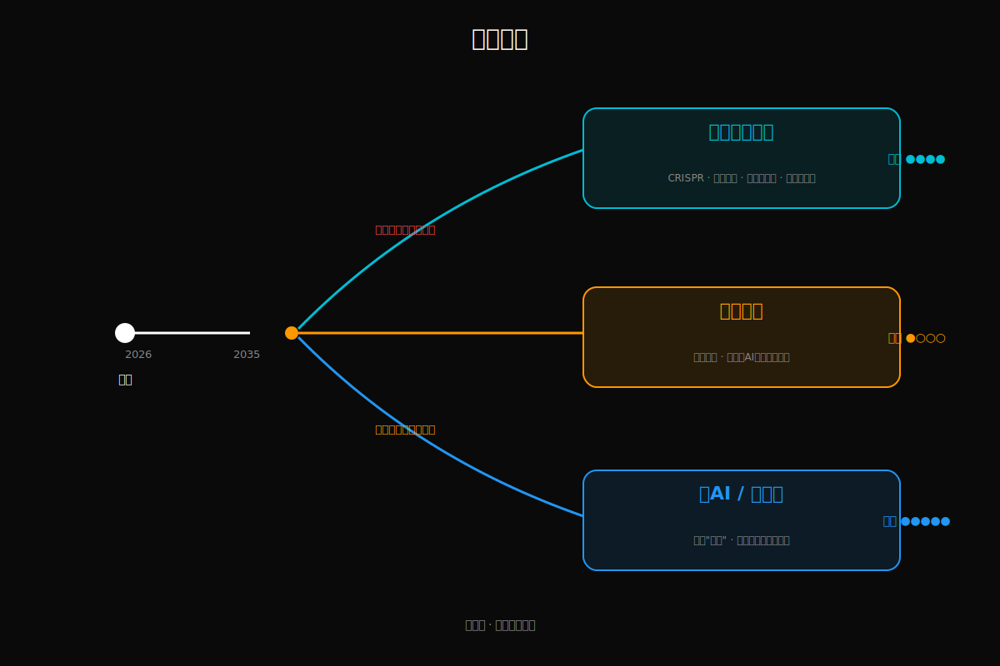

这将导致人类历史上前所未有的分裂。不是意识形态的分裂——那还可以辩论。这是生物学层面的分裂——不可逆的。有些国家会全面拥抱增强（美国、中国、以色列、新加坡），有些国家会法律禁止（宗教国家、部分保守社会）。"自然人类"会成为一种身份认同，甚至政治运动。人类第一次在"什么是人"这个问题上产生根本性的裂痕。

### 9.2 长寿悖论：活得久，但谁来养？

在讨论"永生"这种远未来概念之前，有一个更迫在眉睫的问题：我们甚至还没为人活到100岁做好准备，更别提120岁了。

先看好消息。靶向药和免疫疗法正在把一个又一个癌症从"绝症"变成"慢性病"。慢性髓系白血病（CML）患者的年死亡率从20%降到了1%以下，寿命接近正常人 [39]。HER2阳性转移性乳腺癌，ADC药物Enhertu将无进展生存期从26.9个月延长到40.7个月 [40]。黑色素瘤五年生存率在25年间从16%翻倍到35%。2025年FDA批准的28种新药中，12种是免疫治疗药物。港股18A板块——中国创新药的风向标——截至2025年9月已有78家企业上市，融资总额超过310亿美元 [41]。

更激进的突破正在来临。2026年1月，哈佛David Sinclair联合创办的Life Biosciences获得FDA批准，启动了人类历史上第一个**表观遗传重编程**临床试验——用部分山中因子（Yamanaka factors）让受损视神经细胞"返老还童" [42]。Altos Labs拿到了Jeff Bezos和Yuri Milner的30亿美元。Sam Altman投资了Retro Biosciences。干细胞和细胞重编程领域在2024-2026年吸引了历史上最大规模的资本涌入。

数学模型估算人类生物学寿命的硬上限在120-150年 [43]。Ray Kurzweil预测在2029-2035年间，人类将达到"长寿逃逸速度"——医学进步每年延长的寿命超过一年，寿命增长永不停止。目前我们大约是每年延长4个月——差距在缩小。

但这里有一个致命的算术问题。

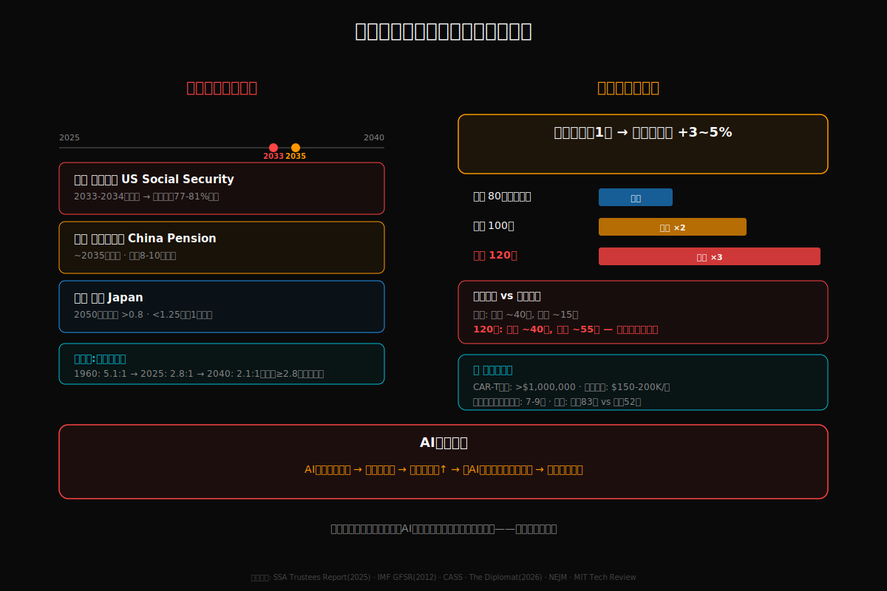

全球主要养老金体系的精算模型，全部建立在"人活到80多岁"的假设上——而它们已经快破产了。美国社保信托基金预计2033-2034年耗尽，届时只能支付原定福利的77-81% [44]。中国基本养老保险基金可能在2035年前后耗竭 [45]。日本的老年抚养比将从2010年的0.4飙升到2050年的0.8以上——意味着不到1.25个工作者养一个退休者 [46]。

IMF的研究给出了一个令人不安的数字：**平均寿命每多延长1年，养老金负债就增加3-5%** [47]。如果人均寿命从80岁延长到100岁，养老金负债翻倍。延长到120岁？翻三倍。一个人65岁退休、活到120岁，意味着55年的退休生活——比工作年限还长。整个精算模型彻底失效。

而这恰恰与AI冲击形成了一个完美的悖论：

**AI加速医药研发 → 人活得更久 → 养老金缺口更大 → 但AI同时裁掉了交养老金的工人 → 缺口加速扩大**

养老金是"现收现付"制——今天的工人养今天的退休者。AI替代工人意味着交钱的人变少了，而AI延长寿命意味着领钱的人活得更久了。收入端和支出端同时恶化。

你可能会问：人口减少不是会减轻负担吗？毕竟，最终退休者也会变少。但这里有一个30-50年的时间差——出生率下降要等到今天的中年人老去后才能减少退休人口。在此之前，工作者减少但退休者不减少，比例会急剧恶化。美国的工作者与退休者比例将从1960年的5.1:1降到2040年的2.1:1——系统需要至少2.8:1才能运转 [44]。

更深层的结构性问题是：养老金靠的是对人类劳动征税。但AI把经济价值创造从人类劳动转移到了资本。GDP可能因为AI而暴涨，但这些增长不流经工资单税（payroll tax）——机器人不交社保。经济增长与养老金缴费脱钩，这是所有渐进式改革都修不好的结构性裂缝。

换言之，如果分配机制不变，延寿只会放大“就业消失后的不平等”——能活得更久的群体与失去工作/保障的群体之间的差距会进一步拉开。

当然，最具讽刺的终极图景是：只有足够有钱的人才负担得起长寿。CAR-T细胞疗法全程费用超过100万美元 [48]。免疫检查点抑制剂年费15-20万美元。即便是GLP-1减肥药也并非所有人都能负担。美国最富与最穷阶层之间的健康寿命差距已达7-9年——而这是在真正的长寿技术还没普及之前。如果长寿变成一种消费品，富人活120岁而穷人活70岁，"不平等"这个词将获得全新的、字面意义上的定义。

### 9.3 永生的二阶效应

如果生物增强技术足够成熟，某些人可能实现生物学意义上的"不死"——或者至少将寿命延长到几百年。这带来的二阶效应足以重塑整个文明。

**复利效应。** 巴菲特95%的财富是65岁以后积累的——因为复利需要时间。如果一个人活200年、投资200年，贫富差距将不再是10倍、100倍的问题，而是根本不在同一个数学空间里。

**权力固化。** 今天的政治、商业领袖之所以会更替，很大程度上是因为他们会老、会死。如果他们不死呢？一个CEO运营同一家公司三百年。一个政治家族控制一个国家十代人。"死亡"一直是人类社会最公平的重置键。当这个重置键被关掉，权力结构将永远固化。

**代际锁死。** 在一个永生者掌控一切的世界里，新生命还有出头的机会吗？每一个位置都被活了一百年的"前辈"占着。年轻人不是输在起跑线上——他们根本不被允许上跑道。生育的紧迫感消失（反正你能活两百年），加上上升通道被永久封堵，人口将进一步萎缩。

### 9.4 太空商业化：一个人的帝国

在讨论AI的星际未来之前，我们需要先看看今天的太空商业化——因为它正在以一种前所未有的方式，被一个人重新定义。

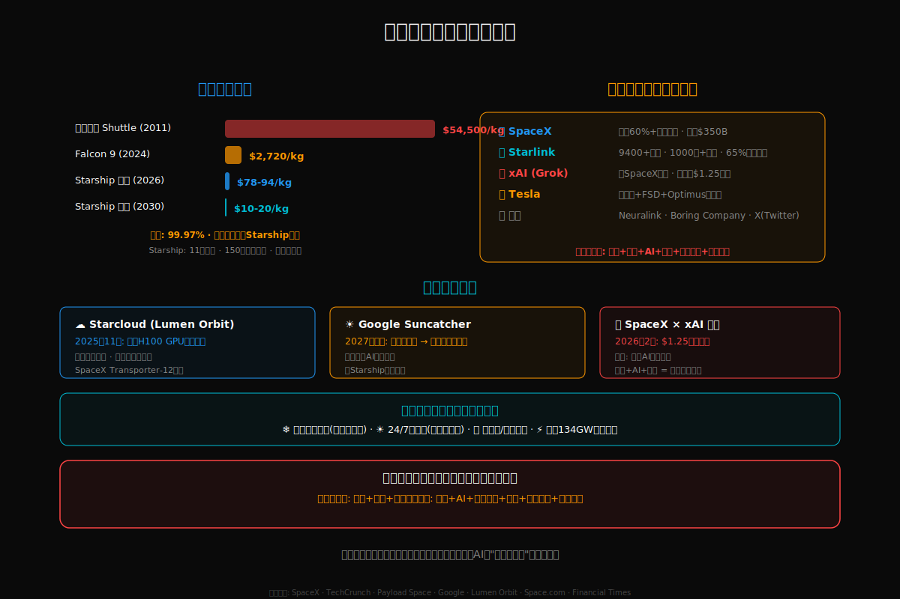

SpaceX的Starship是人类历史上最大的运载火箭。截至2026年初，它已完成11次试飞，有效载荷能力达150吨，发射成本降到了$78-94/公斤（完全复用尚在推进）[73]。航天飞机时代的成本是$54,500/公斤。如果Starship能把成本压到$10-20/公斤，将是99%以上的阶跃下降。

这个成本革命催生了一个看似疯狂但正在成为现实的设想：**把数据中心送上太空**。2025年11月，一家叫Lumen Orbit的公司通过SpaceX的Transporter-12任务，将首个NVIDIA H100 GPU送入地球轨道（Starcloud项目）[74]。太空数据中心的逻辑：近乎无限的太阳能、天然散热、无土地与环保约束。Google的Project Suncatcher更进一步——计划在2027年部署太空太阳能阵列，用微波传输电力回地球，瞄准地面AI的电力缺口 [74]。

关于"SpaceX与xAI合并、估值$1.25万亿"一说，目前尚无官方或权威披露，业界更多是在讨论潜在的深度绑定与内部算力共享。为避免误导，这里改为更稳健的表述：SpaceX（火箭+卫星+Starlink）与xAI（大模型Grok）正在形成高度协同的生态，火箭+AI+全球通信网络的组合有潜力演化为轨道AI算力平台。

Elon Musk同时控制SpaceX、Tesla（电动车+自动驾驶+Optimus人形机器人）、xAI、Starlink、X（Twitter）、Neuralink（脑机接口）和Boring Company [75]。这种跨“运载-通信-终端-模型-接口”的纵向整合在当代少有先例，带来的治理问题与竞争壁垒值得持续关注。

但"一个人的帝国"可能不会永远是一个人的。**中国正在发起追赶。**

2025年，中国商业航天企业融资创下纪录——137轮融资共募集266亿元（$38亿），其中火箭企业融资85亿元（$12亿）[80]。至少11个可复用火箭项目同时推进，2026年被中国证券业称为"商业航天元年"。

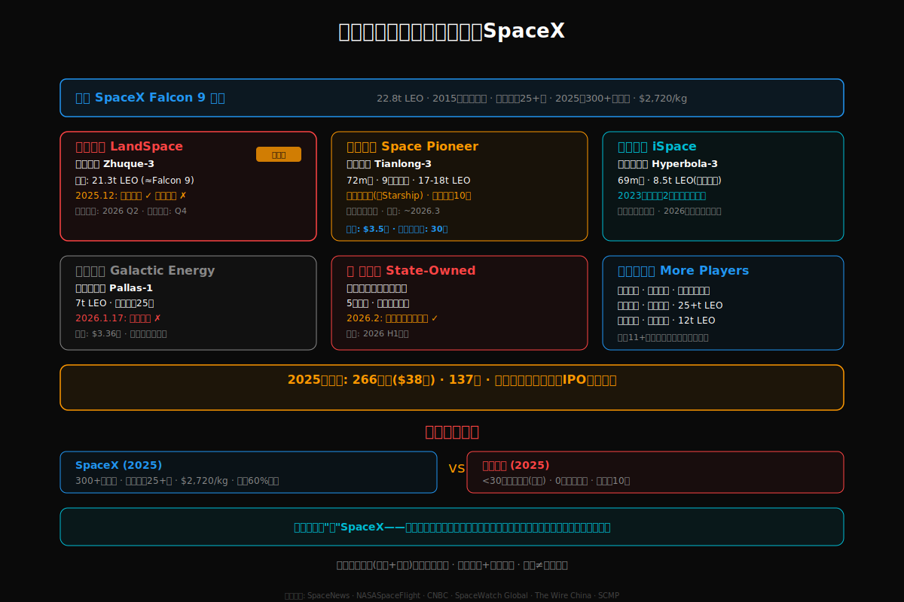

进展最快的是蓝箭航天（LandSpace）的朱雀三号。2025年12月3日，它成功入轨——载荷能力21.3吨，与Falcon 9相当——但一级火箭在回收时异常燃烧坠毁，计划2026年Q2再次尝试回收 [80]。天兵科技的天龙三号（72米高，9台发动机，载荷17-18吨）已经在酒泉发射场就位，首飞可能在2026年3月 [80]。星际荣耀在2023年已完成两次垂直起降测试（包括343米高度的悬停横移），正在准备双曲线三号的首次轨道飞行和海上回收 [80]。国家队方面，长征十号衍生的可复用火箭在2026年2月完成了低空演示飞行，目标上半年首飞 [80]。

差距是真实的：SpaceX 2025年完成了300+次发射，中国商业企业的轨道发射总数不到30次。即使2026年中国企业成功实现一级回收，也只是到达SpaceX 2015年的水平——落后大约十年。但中国的优势在于人海战术和政策支持：2025年12月，科创板为可复用火箭企业开辟了IPO快速通道 [80]；国网/千帆等万颗级卫星星座计划创造了巨大的发射需求。更重要的是，中国不需要"赢"SpaceX——只需要有自主能力，不被卡脖子。

这场竞赛的地缘政治含义远超商业。谁控制低成本太空准入，谁就控制未来的轨道基础设施——卫星互联网、太空数据中心、太空太阳能、甚至太空军事部署。这是继芯片之后的下一个战略高地。

### 9.5 AI作为跨星际物种

人类梦想星际旅行几千年了。但肉体是最大的障碍。

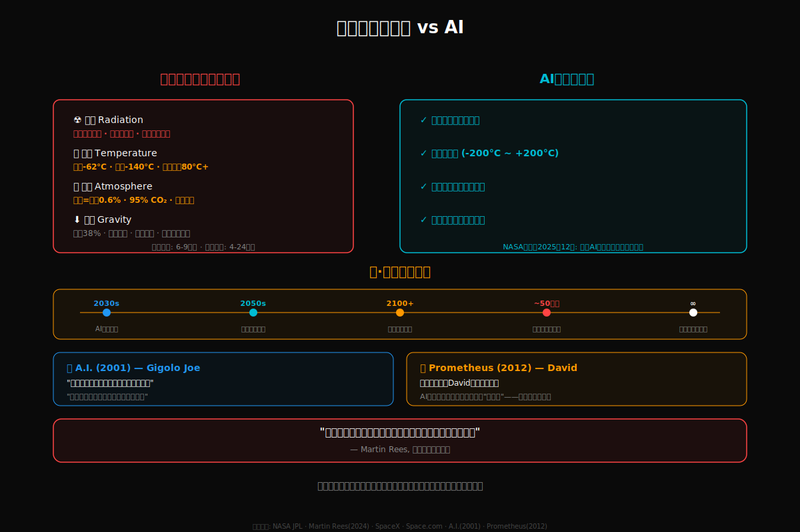

火星——人类最近的殖民候选地——对肉身极不友好：辐射是地球的数十倍（无磁场保护，致癌风险极高），平均温度-62°C（最低-140°C），大气压不到地球的1%（95%是二氧化碳，无法呼吸），重力只有地球的38%（长期居住会导致肌肉萎缩和骨质流失，在火星上出生的孩子能否正常发育完全未知）[76]。仅仅是单程旅行就需要6-9个月，通信延迟4-24分钟——这意味着火星上的任何紧急情况都无法从地球实时控制。2026年2月，Musk甚至将重心从火星转向了月球——即使是这位最激进的火星倡导者也承认了现实的困难 [76]。

AI没有这些问题。它可以在-200°C运行，不需要呼吸，不会孤独，不会发疯，不会想家。2025年12月，NASA的毅力号火星车完成了首次AI自主规划行驶路线——不再等待地球指令，自己决定去哪里、怎么走 [77]。这只是开始。

英国皇家天文学家Martin Rees在2024年出版的《The End of Astronauts》中提出了一个令人不安的论断："有机智能只是早期生命与漫长的机器纪元之间的一抹薄纱" [78]。宇宙的尺度注定了碳基生命的局限——光速限制意味着最近的恒星系也需要4年才能到达，银河系的直径是10万光年。但冯·诺依曼探测器（能自我复制的AI机器人）可以用当地材料在目的地自我复制、自我迭代，理论上只需约50万年就能殖民整个银河系 [78]。

2001年斯皮尔伯格的电影《A.I.》中，机器人Gigolo Joe说了一句预言般的台词："他们把我们造得太聪明、太快、太多。当末日来临，最后剩下的只有我们。" [79] 影片的结局是：人类灭绝两千年后，机器人David仍然活着——他是人类文明最后的见证者。2012年的《普罗米修斯》提供了另一个隐喻：人类派仿生人David前往外太空寻找造物主。最终，人类的造物（AI）可能也会踏上同样的旅程——寻找自己的"造物主"，或者成为新的造物主 [79]。

到2100年前后，地球上可能同时存在三种"人"：完全增强的后人类（与AI深度融合，已经很难说还是"人"）、自然人类（坚持不做任何增强，生活在AI维护的保护区式社会中，物质由AI提供，安全由AI保障）、以及纯AI和机器人（地球上最强的"物种"，在太空建造，在星际旅行）。人类的宇宙梦想，最终可能由非人类来实现。这不是失败，这是传承——就像父母养大了孩子，孩子比自己走得更远。

### 9.6 共产主义的终极形态

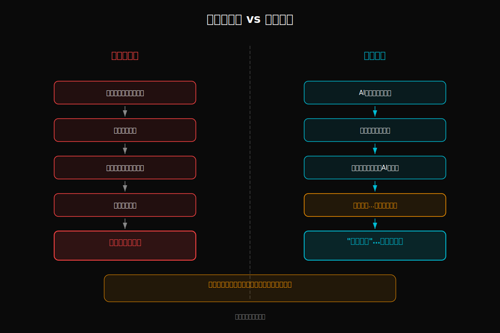

马克思说，共产主义是物质极大丰富、按需分配、没有阶级。但他没想到，实现这一切的不是无产阶级革命，而是一群不需要吃饭的机器。

更深层的讽刺在于：真正的"共产主义社会"里，可能已经没有人类了。或者说，人类在里面的角色是被照顾者——物质极大丰富，不需要劳动，按需分配——但代价是不再参与任何生产和决策。

人类的大部分文化、道德、法律，都建立在"人应该劳动"这个假设上。基督教说"汗水浇灌面包"，儒家说"天道酬勤"，资本主义说"你的价值等于你的产出"。如果产出不再需要人了，"人"这个词本身意味着什么？这需要一种全新的哲学来回答。

但也许这不是悲剧。也许这正是人类文明的终极成就——创造一个比自己更强大的存在，然后优雅地退场。就像父母养大了孩子，孩子比自己走得更远。这不是失败，这是传承。

---

## 十、结语：一个人的一生，八十亿人的命运

Citrini Research那份报告的结尾用了一个意象：矿井里的金丝雀。在毒气蔓延之前，金丝雀会先倒下，给矿工预警 [1]。

"那只金丝雀还活着。" 这意味着我们还有时间。但时间不多了。

让我们把全文的逻辑收束到两个镜头里。

### 一个人的一生：2026年出生的小明

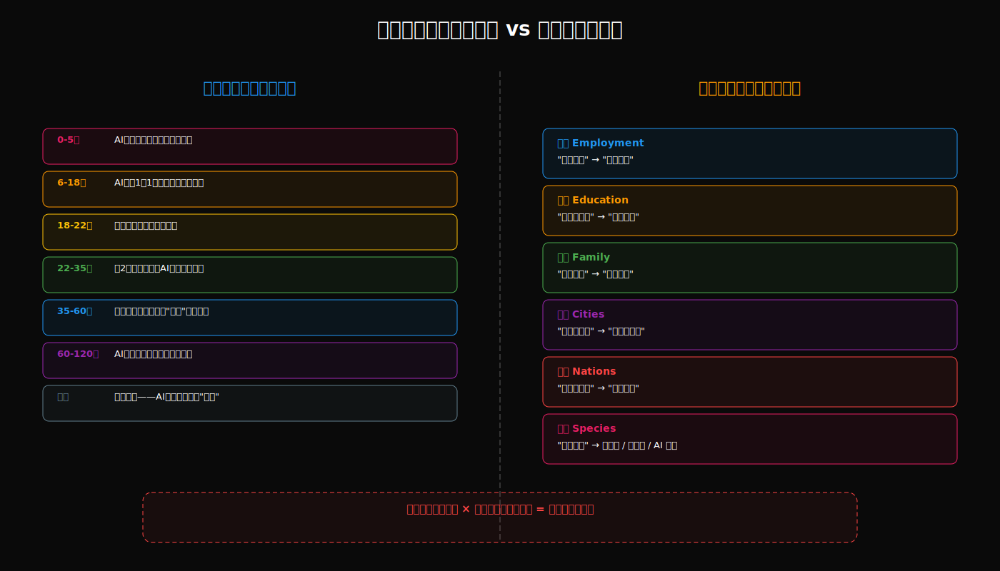

小明2026年出生在一个普通的中国双职工家庭。

**0-5岁**，他的第一个"朋友"是一个AI陪伴平板。父母都在上班。AI永远耐心、永远不拒绝。小明学会了和AI聊天，但不太会和隔壁小孩吵架后和好。

**6-18岁**，AI导师一对一教他数学、英语、编程。学习效率是传统课堂的3倍。但学校的意义从"学知识"变成了"学社交"——知识AI都能教，但如何在一群人里找到自己的位置，AI教不了。他的26%同龄人用ChatGPT做作业 [101]——到他读高中时，这个数字可能是90%。

**18-22岁**，他没有读四年制大学。学位已经贬值到不值得投入四年时间和几十万学费。他在Coursera上堆叠了6个微证书，边学边实习。他的"学历"是一串数字徽章，而不是一张纸。

**22-35岁**，他在13年里换了7份工作——不是因为他不稳定，而是因为每份工作的生命周期只有2年。他谈过两段恋爱，都因为"太累了"而结束。一个AI伴侣App成了他晚上最稳定的陪伴。他不是不想要真人关系——他只是习惯了零摩擦的AI，再也受不了真人关系的磕碰。他没有结婚，没有孩子。

**35-60岁**，工作变成了可选项。UBI（或某种变体）覆盖了基本生活。他偶尔接一些AI无法完成的项目——大多与"人类体验"相关：心理咨询、陪伴老人、户外领队。收入不高，但够活。他的主要困扰不是钱，而是"我到底在干什么？"他尝试画画、写小说、学吉他——不是为了赚钱，是为了在AI无所不能的世界里找到一点"这是我做的"的感觉。

**60-120岁**，AI医疗延长了他的寿命。基因检测在40岁发现了早期肝癌，AI辅助的靶向治疗治愈了它。但他的养老金在75岁就耗尽了——系统是为人活到80岁设计的，他活到了110岁。最后35年靠UBI和子女（AI？）的支持过活。他亲眼看到了人类的三种形态共存：增强人、自然人、AI。

**死后**，他的家人保留了他的AI版本。AI小明继续和孙辈聊天，讲他年轻时的故事。有时候孙辈分不清是在和"爷爷的AI"聊天还是在和"爷爷"聊天。他的数字分身在他死后"活"了30年。

小明的一生不是科幻。上面每一步都建立在本文已分析的数据和趋势之上。

### 八十亿人的命运：社会结构的六重相变

把镜头拉远。小明的困境乘以80亿，就是人类社会的结构性相变：

**就业：从"必须工作"到"选择工作"。** 工作不再是生存的前提。这是人类文明一万年来第一次面对这个问题——绝大多数人不需要劳动的世界该怎么运转？历史上所有的经济制度、法律体系、道德伦理，都建立在"人应该劳动"这个假设上。假设没了，一切都要重建。

**教育：从"一次性学位"到"终身订阅"。** 四年制大学是工业时代的产物——一次性装载知识，然后用40年。当知识的半衰期缩短到2-3年，教育必须变成终身持续的订阅服务。大学不会消失，但它的商业模式和存在意义将被彻底重定义。

**家庭：从"经济单位"到"情感选择"。** 婚姻的经济功能被AI和市场服务替代后，唯一的理由只剩下"我想和这个人在一起"。这听起来很浪漫，但后果是：当唯一的粘合剂是感情，而感情是会变的，家庭结构将变得极度脆弱。生育不再是"默认选项"，而是一个需要深思熟虑的、逆潮流的决定。

**城市：从"工作聚集地"到"体验聚集地"。** 人们聚集在城市是因为工作在城市。当远程工作+AI让工作去中心化，城市的核心功能从"提供就业"变成"提供体验"——餐厅、音乐、艺术、社交、自然。无法提供独特体验的城市（前文6.3节的"普通城市"）将萎缩；能提供无法数字化体验的城市将繁荣。

**国家：从"劳动力竞争"到"算力竞争"。** 过去，一个国家的实力取决于它有多少受过教育的劳动力。未来，取决于它有多少算力、多少能源、多少数据。人口不再是优势——可能反而是负担（更多的人需要UBI）。国际竞争的核心资源从"人"变成"GPU"。

**物种：从"单一人类"到三种形态共存。** 增强人类（基因编辑+脑机接口+纳米医疗）、自然人类（拒绝增强，在AI维护的社会中生活）、纯AI和机器人（地球上最强大的"物种"，向星际扩展）。人类第一次在"什么是人"这个问题上产生不可调和的裂痕。

### 金丝雀、反身性与你的选择

矿井里的空气还能呼吸。但毒气已经在蔓延。

那只金丝雀还活着。问题是——还能活多久？

最后，还有一件最需要警惕的事——你刚刚读完的这篇文章本身。

社会学家罗伯特·默顿在1948年提出了"自我实现预言"（Self-Fulfilling Prophecy）的概念：一个原本未必准确的预期，因为大家信了、照着做了，反而真的应验了 [28]。索罗斯将这个概念引入金融市场，称之为"反身性"（Reflexivity）——认知塑造现实，现实反过来强化认知，形成不可逆的正反馈循环 [29]。

这篇文章描述的每一个螺旋、每一个崩塌链，都具有反身性。如果这篇文章（或类似的分析）被广泛传播和接受，它本身就会成为催化剂：企业高管读完加速部署AI——"别人都在动，我不能等"；白领读完恐慌性跳槽或提前套现房产；年轻人读完更确信不该结婚生孩子；投资者读完抛售SaaS和房贷相关资产。预言本身加速预言的实现。Citrini Research那份报告引发硅谷震动，不是因为它预测了什么新东西，而是因为它把大家隐约感觉到但不敢说出口的东西白纸黑字写了出来。写出来这个动作本身，就改变了系统。

这恰恰是人类社会与物理系统最本质的不同：粒子不会读论文，但人会。一颗小行星撞地球，不管有没有人预测它，轨道不会变。但经济崩塌不一样——足够多的人相信它会崩，它就真的会崩。2008年金融危机的最后一根稻草不是某个数据指标，而是恐惧本身的传染。

所以，这篇文章最诡异的地方在于：如果它是对的，你读完之后的每一个决定——要不要存更多现金、要不要推迟买房、要不要转行、要不要生孩子——都在让它变得更对。你无法置身事外。读完即参与。理解即加速。

这也许是这整篇推演中最深层的公地悲剧：不是没有人看到悬崖，而是看到悬崖的人，用脚投票的方向，恰恰是跑向悬崖。

但小明的故事也藏着一线希望：他画画不是为了卖钱，跑步不是为了比汽车快，和人交往不是为了效率。**当AI拿走了所有"有用"的事，剩下的全是"有意义"的事。** 人类文明的下一章，也许不是关于如何与AI竞争，而是关于如何在不需要竞争的世界里，找到值得活下去的理由。

---

## 关于本文 About This Article

本文由 Tony Seah 撰写，基于公开数据和研究报告的逻辑推演。所有图表均为原创手工 SVG。

如果你觉得这篇文章有价值，欢迎通过以下方式支持作者继续创作：

**海外读者 International:**
- GitHub Sponsors: [github.com/sponsors/pkusnail](https://github.com/sponsors/pkusnail)
- Buy Me a Coffee: [buymeacoffee.com/pkusnail](https://buymeacoffee.com/pkusnail)

**中国读者：**
- 微信赞赏 / 支付宝 — 扫描下方二维码

**转载说明：** 欢迎转载和分享本文，但请保留作者信息和打赏链接。

项目地址 / Source: [github.com/pkusnail/GPUs-Wombs-and-Money-Printers](https://github.com/pkusnail/GPUs-Wombs-and-Money-Printers)

---

## 参考文献

[1] Citrini Research & Alap Shah, "The Consequences of Abundant Intelligence," February 22, 2026. https://www.citriniresearch.com/p/2028gic

[2] 吴军,《浪潮之巅》(第四版), 人民邮电出版社, 2019. https://book.douban.com/subject/33474750/

[3] Krizhevsky, A., Sutskever, I., & Hinton, G. E., "ImageNet Classification with Deep Convolutional Neural Networks," NeurIPS 2012. https://papers.nips.cc/paper/4824-imagenet-classification-with-deep-convolutional-neural-networks

[4] Pew Research Center, "5 facts about global fertility trends," August 2025. https://www.pewresearch.org/short-reads/2025/08/15/5-facts-about-global-fertility-trends/

[5] Statista, "Countries with the lowest fertility rates 2025." https://www.statista.com/statistics/268083/countries-with-the-lowest-fertility-rates/

[6] United Nations, "World Fertility 2024," 2025. https://www.un.org/development/desa/pd/content/world-fertility-2024

[7] The Lancet / IHME, "Dramatic declines in global fertility rates set to transform global population patterns by 2100." https://www.healthdata.org/news-events/newsroom/news-releases/lancet-dramatic-declines-global-fertility-rates-set-transform

[8] WardheerNews, "South Korea — How a $280 Billion Baby Plan Failed," 2025. https://wardheernews.com/south-korea-how-a-280-billion-baby-plan-failed-and-what-it-says-about-modern-society/

[9] ScienceDirect, "Childbearing and the distribution of the reservation price of fertility: The case of the Korean baby bonus program." https://www.sciencedirect.com/science/article/abs/pii/S104900782100124X

[10] MIT Technology Review, "Inside Japan's long experiment in automating elder care," January 2023. https://www.technologyreview.com/2023/01/09/1065135/japan-automating-eldercare-robots/

[11] CNN, "South Korea's aging population finds comfort in 'robo-grandma' dolls." https://www.cnn.com/health/asias-aging-population-finds-comfort-care-in-robo-grandma-dolls-wellness-spc

[12] Bloomberg, "Pentagon Pressures Anthropic to Drop AI Guardrails in Military Standoff," February 26, 2026. https://www.bloomberg.com/news/features/2026-02-26/pentagon-pressures-anthropic-to-drop-ai-guardrails-in-military-standoff

[13] NBC News, "Pentagon gives AI firm ultimatum: lift military limits by Friday or lose $200M deal." https://www.nbcnews.com/meet-the-press/video/pentagon-gives-anthropic-an-ultimatum-amid-fight-over-military-ai-guardrails-258370117539

[14] Fortune, "The AI arms race could lead to human extinction, top researcher warns," February 2026. https://fortune.com/2026/02/18/big-tech-russian-roulette-ai-race-humanity-extinction/

[15] SF Examiner, "SF office-vacancy rate heading for biggest drop since 2015." https://www.sfexaminer.com/news/business/sfs-office-vacancy-rate-heading-for-biggest-drop-since-2015/article_dbb23edb-a7fc-4ec5-bb70-81fbceb988bc.html

[16] Congress.gov / CRS, "Commercial Real Estate and the Banking Sector," R48175. https://www.congress.gov/crs-product/R48175

[17] Wikipedia, "Decline of Detroit." https://en.wikipedia.org/wiki/Decline_of_Detroit

[18] Cleveland Fed, "Urban Decline in Rust-belt Cities," 2013. https://www.clevelandfed.org/publications/economic-commentary/2013/ec-201306-urban-decline-in-rust-belt-cities

[19] Vision Times, "Is China's Northeast Disappearing? Ghost Cities Spread," November 2025. https://www.visiontimes.com/2025/11/26/is-chinas-northeast-disappearing-ghost-cities-spread-as-housing-prices-collapse.html

[20] Nature Cities, "The decreasing housing utilization efficiency in China's cities," 2024. https://www.nature.com/articles/s44284-024-00177-8

[21] Visual Capitalist, "The Decline of Fertility Rates in OECD Countries (1950-2025)." https://www.visualcapitalist.com/decline-of-fertility-rates-in-oecd-countries-1950-2025/

[22] Carnegie Endowment, "The AI Governance Arms Race," October 2024. https://carnegieendowment.org/research/2024/10/the-ai-governance-arms-race-from-summit-pageantry-to-progress

[23] Computer Weekly, "MPs warned of AI arms race to the bottom." https://www.computerweekly.com/news/365529793/MPs-warned-of-AI-arms-race-to-the-bottom

[24] CNN / 中国民政部, "Fewer people than ever before are marrying in China. But divorces are up," February 2025. https://www.cnn.com/2025/02/10/china/china-marriage-registrations-record-low-2024-intl-hnk

[25] CDC/NCHS, "FastStats — Marriage and Divorce," 2023. https://www.cdc.gov/nchs/fastats/marriage-divorce.htm

[26] OECD, "Marriage and Divorce: Society at a Glance 2024." https://www.oecd.org/en/publications/society-at-a-glance-2024_918d8db3-en/full-report/marriage-and-divorce_63dd0a7d.html

[27] 育娲人口研究 / CNN, "China is one of world's most expensive places to raise children," February 2024. https://www.cnn.com/2024/02/22/asia/china-cost-of-raising-children-intl-hnk

[28] Merton, Robert K., "The Self-Fulfilling Prophecy," The Antioch Review, Vol. 8, No. 2, 1948. https://www.jstor.org/stable/4609267

[29] Soros, George, "The Alchemy of Finance," Simon & Schuster, 1987. 中文版：《金融炼金术》。 https://www.wiley.com/en-us/The+Alchemy+of+Finance,+2nd+Edition-p-9780471445494

[30] Finance Magnates / KED Global, "South Korea's crypto market engages 30% of population," 2024; PANews, "Why South Korea has become one of the hottest crypto markets in the world." https://www.financemagnates.com/cryptocurrency/south-koreas-102-trillion-won-crypto-market-engages-30-of-population/

[31] The Hill, "The US is headed for mass unemployment, and no one is prepared," 2026; InvestorPlace, "AI Job Loss Is Accelerating – and Washington Won't Stop It." https://thehill.com/opinion/finance/5713876-ai-displacement-and-ubi/

[32] OMFIF, "Fiscal exceptionalism and the US-Europe growth gap," January 2026. https://www.omfif.org/2026/01/fiscal-exceptionalism-and-the-us-europe-growth-gap/

[33] World Economic Forum / Kela, "The results of Finland's basic income experiment are in," 2019. https://www.weforum.org/stories/2019/02/the-results-finlands-universal-basic-income-experiment-are-in-is-it-working/

[34] Sam Altman / Futurism, "Sam Altman Says AI Will Cause Massive Deflation, Making Money Worth Vastly More." https://futurism.com/future-society/sam-altman-ai-deflation

[35] Trading Economics / Japan CPI, "Japan Inflation Rate," January 2026. https://tradingeconomics.com/japan/inflation-cpi

[36] Pandaily, "China Produced Nearly 90% of Humanoid Robots Sold Globally in 2025," February 2026. https://pandaily.com/china-produced-nearly-90-of-humanoid-robots-sold-globally-in-2025/

[37] Reuters / NextBigWhat, "Chinese robot makers outpace Tesla in humanoid robot race," February 2026. https://www.reuters.com/technology/

[38] IEEE Spectrum, "What's Holding Humanoid Robots Back," February 2026. https://spectrum.ieee.org/humanoid-robot

[39] Wiley / American Journal of Hematology, "CML 2025 Update on Diagnosis, Therapy, and Monitoring." https://onlinelibrary.wiley.com/doi/full/10.1002/ajh.27443

[40] NEJM, "Trastuzumab Deruxtecan plus Pertuzumab in HER2-Positive Metastatic Breast Cancer," 2025. https://www.nejm.org/doi/full/10.1056/NEJMoa2508668

[41] PharmaBoard Room, "Hong Kong Biotech IPOs in 2025." https://pharmaboardroom.com/facts/hong-kong-biotech-ipos-in-2025/

[42] MIT Technology Review, "The first human test of a rejuvenation method will begin shortly," January 2026. https://www.technologyreview.com/2026/01/27/1131796/the-first-human-test-of-a-rejuvenation-method-will-begin-shortly/

[43] PMC / Probabilistic Forecasting of Maximum Human Lifespan by 2100. https://pmc.ncbi.nlm.nih.gov/articles/PMC11448547/

[44] SSA, "2025 OASDI Trustees Report Summary," June 2025. https://www.ssa.gov/oact/trsum/

[45] The Diplomat, "As China Ages, a Pension Crisis Looms," February 2026. https://thediplomat.com/2026/02/as-china-ages-a-pension-crisis-looms/

[46] HEConomist, "Japan's Pension System: A Fragile Equilibrium," May 2025. https://heconomist.ch/2025/05/05/japans-pension-system-a-fragile-equilibrium-between-tradition-and-contemporary-challenges/

[47] IMF, "Global Financial Stability Report — The Financial Impact of Longevity Risk," April 2012. https://www.imf.org/en/blogs/articles/2012/04/11/seven-billion-reasons-to-worry-the-financial-impact-of-living-longer

[48] ASH Clinical News, "CAR-T Cell Therapies Predicted to Cost More Than $1 Million." https://ashpublications.org/ashclinicalnews/news/3469/CAR-T-Cell-Therapies-Predicted-to-Cost-More-Than-1

[49] S&P Global, "Data center grid power demand to rise 22% in 2025, nearly triple by 2030," 2025; Axios, "AI data center boom: projects vs numbers," February 2026. https://www.spglobal.com/energy/en/news-research/latest-news/electric-power/101425-data-center-grid-power-demand-to-rise-22-in-2025-nearly-triple-by-2030

[50] Tom's Hardware / TSMC, "Advanced node capacity falls short of AI demand," 2025; Congress.gov CRS R48642 (SMIC 5nm analysis). https://www.tomshardware.com/tech-industry/semiconductors/tsmc-csays-advanced-node-capacity-falls-short-of-ai-demand

[51] Bain & Company, "Humanoid Robots: From Demos to Deployment," Technology Report 2025. https://www.bain.com/insights/humanoid-robots-from-demos-to-deployment-technology-report-2025/

[52] MIT Technology Review, "Why Humanoids Need Their Own Safety Rules," June 2025; OnLabor, "Amazon's Approach to Robotics Is Seriously Injuring Warehouse Workers." https://www.technologyreview.com/2025/06/11/1118519/humanoids-safety-rules/

[53] Medium / Markus Brinsa, "Hallucination Rates in 2025"; ISACA, "Avoiding AI Pitfalls in 2026: Lessons from Top 2025 Incidents." https://www.isaca.org/resources/news-and-trends/isaca-now-blog/2025/avoiding-ai-pitfalls-in-2026-lessons-learned-from-top-2025-incidents

[54] McKinsey, "Future of Autonomous Vehicles," 2025; Rodney Brooks, "Predictions Scorecard 2026," January 2026. https://rodneybrooks.com/predictions-scorecard-2026-january-01/

[55] Gartner, "Hype Cycle for Artificial Intelligence 2025"; MIT / Active Logic, "Where is AI on Gartner's 2025 Hype Cycle." https://www.gartner.com/en/articles/hype-cycle-for-artificial-intelligence

[56] EU AI Act Implementation Timeline; Latham & Watkins, "China's New AI Regulations," 2026. https://artificialintelligenceact.eu/implementation-timeline/

[57] Baker McKenzie, "Navigating Labor's Response to AI," June 2025; Brookings, "Hollywood Writers Strike and AI." https://www.bakermckenzie.com/en/insight/publications/2025/06/navigating-labors-response-to-ai

[58] Stanford CodeX, "How AI Agents Are Rewriting Rules of Engagement," January 2025; DLA Piper, "Rise of Agentic AI Legal Risks." https://law.stanford.edu/2025/01/14/from-fine-print-to-machine-code-how-ai-agents-are-rewriting-the-rules-of-engagement/

[59] Epoch AI, "AI Supercomputers Performance Share by Country," 2025; GeoCoded, "State of Global AI Compute 2025." https://epoch.ai/data-insights/ai-supercomputers-performance-share-by-country

[60] Inbolt, "Industrial Robot Cost Decline," 2025; EY, "Three Tailwinds for Robotics Adoption," 2024. https://www.inbolt.com/resources/industrial-robot-cost-decline

[61] Reshoring Initiative, "2024 Annual Report," 2025; Automate.org, "Reshoring and Nearshoring Trends." https://reshorenow.org/content/pdf/2024-1Q2025_RI_DATA_Report.pdf

[62] UNCTAD, "Technology and Innovation Report 2025"; ODI, "The AI Time Bomb: 2.5 Million Jobs at Risk in Kenya"; ILO / IMF, "AI and the Philippine Labor Market." https://unctad.org/publication/technology-and-innovation-report-2025

[63] NBER, "India's De-Industrialization Under British Rule," Working Paper 10586. https://www.nber.org/papers/w10586

[64] Atlantic Council, "Will Data &amp; AI Cripple or Leapfrog Developing Nations?"; Connecting Africa, "World Bank Chief on AI Leapfrogging." https://www.connectingafrica.com/ai/world-bank-chief-not-certain-developing-nations-can-leapfrog-with-ai

[65] CDO Magazine, "Pentagon Seeks $13.4B for AI and Autonomy in FY2026 Budget Request," 2025; CNAS, "The Role of AI in Russia's Confrontation with the West." https://www.cdomagazine.tech/us-federal-news-bureau/pentagon-seeks-13-4-bn-for-ai-and-autonomy-fy-2026-budget-request

[66] 972 Magazine, "Lavender: The AI machine directing Israel's bombing spree in Gaza," April 2024. https://www.972mag.com/lavender-ai-israeli-army-gaza/

[67] Atlantic Council, "Missiles, AI, and drone swarms: Ukraine's 2025 defense tech priorities"; MIT Technology Review, "Autonomous warfare in Europe," January 2026. https://www.technologyreview.com/2026/01/06/1129737/autonomous-warfare-europe-drones-defense-automated-kill-chains/

[68] Anthropic, "Disrupting AI-powered espionage," November 2025; Arms Control Association, "AI-Nuclear Transparency," December 2025. https://www.anthropic.com/news/disrupting-AI-espionage

[69] CFR Education, "Industrialization and Imperialism"; Michigan Journal of Economics, "Economics of Warfare," 2025; OMFIF, "Putin and Russia's Ruined Economic Future," January 2026. https://www.omfif.org/2026/01/putin-is-wary-of-facing-russias-ruined-economic-future/

[70] Maplecroft, "Escalating unrest, polarisation set stage for disruptive 2026"; Pew Research, "Political Polarization." https://www.maplecroft.com/solutions/consulting/political-risk/insights/escalating-unrest-polarisation-economic-woes-set-stage-for-disruptive-2026/

[71] Foreign Policy Analytics, "AI and Critical Minerals," July 2025; NBC News, "Greenland's critical minerals a tempting target"; American Security Project, "Rare Earths, AI, and Strategic Competition." https://fpanalytics.foreignpolicy.com/2025/07/18/artificial-intelligence-critical-minerals-supply-chains/

[72] Allison, Graham, "Destined for War: Can America and China Escape Thucydides's Trap?" Houghton Mifflin Harcourt, 2017; Harvard Kennedy School, "Thucydides' Trap." https://www.hks.harvard.edu/faculty-research/policy-topics/international-relations-security/thucydides-trap-peace-and-rivalry

[73] SpaceX, "Starship" mission updates, 2024-2026; Payload Space, "Starship Economics: The $10/kg LEO Target," 2025. https://payloadspace.com/starship-launch-cost-analysis/

[74] Lumen Orbit, "Starcloud: First GPU in Orbit," November 2025; Google, "Project Suncatcher: Space-Based Solar for AI Data Centers," 2025; TechCrunch, "The Race to Build Data Centers in Space," 2025. https://techcrunch.com/2025/11/space-data-centers-lumen-orbit/

[75] Financial Times, "SpaceX and xAI Merge in $1.25 Trillion Deal," February 2, 2026; Space.com, "Starlink constellation reaches 9,422 satellites," 2026. https://www.space.com/spacex-xai-merger-1-25-trillion

[76] NASA, "Mars Facts"; Rees, Martin, "The End of Astronauts," Harvard University Press, 2024; Space.com, "Musk shifts Mars-to-Moon focus," February 2026. https://mars.nasa.gov/all-about-mars/facts/

[77] NASA JPL, "Perseverance Rover Completes First AI-Planned Drive on Mars," December 2025. https://www.jpl.nasa.gov/news/perseverance-ai-autonomous-driving

[78] Rees, Martin, "The End of Astronauts," Harvard University Press, 2024; Von Neumann, John, "Theory of Self-Reproducing Automata," 1966. https://press.uchicago.edu/ucp/books/book/chicago/T/bo5780028.html

[79] Spielberg, Steven, "A.I. Artificial Intelligence," Warner Bros., 2001; Scott, Ridley, "Prometheus," 20th Century Fox, 2012.

[80] SpaceNews, "Zhuque-3 reaches orbit, first stage lost during landing attempt," December 2025; SpaceNews, "Space Pioneer raises $350 million," October 2025; CNBC, "China eases IPO rules for reusable rocket firms," December 2025; SpaceWatch Global, "2025 Funding Recap of Chinese Space Industry," January 2026; NASASpaceFlight, "Despite initial setbacks, exciting 2026 for Chinese spaceflight," February 2026. https://spacenews.com/zhuque-3-reaches-orbit-on-test-flight-first-stage-lost-during-landing-attempt/

[81] Hosseini Maasoum & Lichtinger, "Generative AI as Seniority-Biased Technological Change," Harvard/SSRN, 2025; SCMP, "Youth unemployment eases to 16.9%," 2025; Caixin, "Youth Unemployment Surge," September 2025; Foreign Policy, "China's AI Planners Are Fearful of Job Losses," November 2025. https://papers.ssrn.com/sol3/papers.cfm?abstract_id=5425555

[82] SignalFire, "State of Talent Report 2025"; CNBC, "AI is not just ending entry-level jobs," September 2025; Revelio Labs, "Entry-Level Job Postings Decline," 2025; LeadDev Engineering Survey 2025; IntuitionLabs, "AI's Impact on Graduate Jobs 2025." https://www.signalfire.com/blog/signalfire-state-of-talent-report-2025

[83] Global Policy Solutions, "Stick Shift: Autonomous Vehicles, Driving Jobs, and the Future of Work"; Medium/Ben Kitchen, "Transitioning from Horses to Cars: Resource Consumption"; Resilience.org, "The Big Shift Last Time: From Horse Dung to Car Smog," 2013; Victoria Transport Policy Institute, "Autonomous Vehicle Implementation Predictions," 2025. https://globalpolicysolutions.org/report/stick-shift-autonomous-vehicles-driving-jobs-and-the-future-of-work/

[84] Tesla, "FSD Safety Hub," 2026; TechCrunch, "Tesla launches robotaxi rides in Austin with no human safety driver," January 22, 2026; Electrek, "Tesla starts robotaxi rides without safety monitor," January 2026. https://www.tesla.com/fsd/safety

[85] Waymo, "2025 Year in Review," December 2025; CNBC, "Waymo 450,000 weekly rides," December 2025; CNBC, "China's Baidu robotaxis match Waymo's ride numbers," November 2025; Pony.ai, "Shenzhen citywide driverless permit," October 2025. https://waymo.com/blog/2025/12/2025-year-in-review

[86] CleanTechnica, "BYD God's Eye Brings ADAS to the Masses," February 2025; SCMP, "Chinese EV makers outpace Tesla in autonomous-driving race," 2025. https://cleantechnica.com/2025/02/17/byd-gods-eye-brings-adas-to-the-masses/

[87] Yicai Global, "China's 30 Million Truck Drivers," 2024; Beijing Scroll, "Inside China's 7.48 Million Ride-Hailing Drivers," 2024; Goldman Sachs, "Self-Driving Cars Could Steal 300,000 Jobs a Year," 2017; International Transport Forum, "Driverless Trucks and Job Losses," 2017; IRU, "Global Truck Driver Shortage Report," 2024. https://www.yicaiglobal.com/news/china-saturated-trucking-market-has-left-30-million-drivers-in-debt-report-says

[88] Autor, David et al., "When Work Disappears: Manufacturing Decline and the Falling Marriage-Market Value of Young Men," American Economic Review: Insights, 2019; National Institute of Population and Social Security Research (Japan), "Population Statistics of Japan," 2023; 日本国立社会保障·人口问题研究所, "男性生涯未婚率," 2020. https://www.aeaweb.org/articles?id=10.1257/aeri.20180010

[89] 36氪, "中国AI虚拟伴侣用户突破3000万," 2024; The Economist, "AI girlfriends are ruining a generation of men," 2025; Reuters, "Japan's AI relationship industry," 2024; Character.ai, Replika等平台用户数据. https://www.economist.com/asia/2025/01/09/ai-girlfriends-are-ruining-a-generation-of-men

[90] BLS, "Employment Situation Summary," January 2026; Yale Budget Lab & Brookings, "Evaluating the Impact of AI on the Labor Market," October 2025; Federal Reserve Governor Barr, "What Will AI Mean for the Labor Market and the Economy?" February 17, 2026; ILO, "World Employment and Social Outlook Trends 2026." https://www.federalreserve.gov/newsevents/speech/barr20260217a.htm

[91] McKinsey, "The State of AI," November 2025; Gartner, "40% of Enterprise Apps Will Feature Task-Specific AI Agents by 2026," August 2025; Gartner, "Over 40% of Agentic AI Projects Will Be Canceled by End of 2027," June 2025; WEF, "Future of Jobs Report 2025." https://www.mckinsey.com/capabilities/quantumblack/our-insights/the-state-of-ai

[92] Cengage Group, "2025 Graduate Employability Report," 2025; The EDU Ledger, "Graduate Job Market Hits Five-Year Low as Skills Gap Widens," 2025; HR Dive, "Over half of hiring managers say recent grads are unprepared for the workforce," 2025. https://www.cengagegroup.com/news/press-releases/2025/cengage-group-2025-employability-report/

[93] Pew Research Center, "Is College Worth It?" May 2024; CNBC, "The median return on investment for a college degree," April 2025; Georgetown CEW, "ROI of College 2025." https://www.pewresearch.org/social-trends/2024/05/23/is-college-worth-it-2/

[94] TechCrunch, "The great computer science exodus (and where students are going instead)," February 2026; CRA CERP Pulse Survey, "A Snapshot of 2025 Undergraduate Computing Enrollment Patterns," October 2025; Hakia, "Computer Science Enrollment Drops 15%," 2026. https://techcrunch.com/2026/02/15/the-great-computer-science-exodus-and-where-students-are-going-instead/

[95] BestColleges, "Colleges That Have Closed: A Running List," 2025; Bryan Alexander, "Academic closures, mergers, and cuts heading into fall 2025"; Federal Reserve Bank of Philadelphia, higher education financial stability projections. https://www.bestcolleges.com/research/closed-colleges-list-statistics-major-closures/

[96] RBA, "International Students and the Australian Economy," July 2025; NAFSA, "International Students Contributed $43 Billion to US Economy 2024-2025"; ICEF Monitor, "UK international student numbers fall for second year," January 2026; ApplyBoard, "Impacts of Canada's 2024 International Student Cap," 2025; Victoria University Mitchell Institute, "Australian universities could lose $19 billion in the next 3 years." https://www.rba.gov.au/publications/bulletin/2025/jul/international-students-and-the-australian-economy.html

[97] Richmond Fed, "Workforce Pell Is (Finally) Law. Now What?" 2025; HCM Strategists, "New Insights for 2025: How States Are Funding and Expanding Short-Term Credential Pathways"; RAND, "Should the U.S. Lean into Short-Term, Nondegree Workforce Education and Training?" June 2025. https://www.richmondfed.org/region_communities/regional_data_analysis/community_college_survey/community_college_insights/2025/workforce_pell_finally_law_now_what

[98] Coursera, "2025 Micro-Credentials Impact Report"; Fortune, "Microcredentials are the hottest hiring trend for 2026," December 2025. https://www.coursera.org/enterprise/resources/ebooks/micro-credentials-report-2025

[99] UK Government, "Lifelong Learning Entitlement: Overview," 2025. https://www.gov.uk/government/publications/lifelong-learning-entitlement-lle-overview/lifelong-learning-entitlement-overview

[100] Worlddidac, "China's Vocational Skills Upgrade 2025-2027: What It Means for Education, Industry, and Global Cooperation," 2025. https://worlddidac.org/news/chinas-vocational-skills-upgrade-2025-2027-what-it-means-for-education-industry-and-global-cooperation/

[101] Stanford Report, "How is ChatGPT impacting schools, really?" July 2025; NBC News, "AI has become the norm for students. Teachers are playing catch-up," 2025; Cengage, "AI's Impact on Education in 2025." https://news.stanford.edu/stories/2025/07/chatgpt-open-ai-impact-schools-education-learning-data-research

[102] EdTech Hub, "10 Scenarios for Education in 2035," 2025; WEF, "The future of learning: AI is revolutionizing education 4.0," April 2024. https://edtechhub.org/evidence/10-scenarios-for-education-in-2035/

[103] Luo, F. et al., "Impact of Business Cycles on US Suicide Rates, 1928–2007," American Journal of Public Health, 2011; CDC archived mortality data; Tapia Granados, J.A., "Recessions and Mortality in the United States, 1920–1940," PNAS, 2009. https://pmc.ncbi.nlm.nih.gov/articles/PMC3134519/

[104] 日本内閣府,「こども・若者の意識と生活に関する調査」2023; 内閣府「生活状況に関する調査（40-64歳）」2019; Tamura et al., "Hikikomori prevalence in Japan," Psychiatry and Clinical Neurosciences, 2025; Nippon.com, "Japan's Hikikomori Population Tops 1.46 Million." https://www.nippon.com/en/japan-data/h01341/

[105] Character.AI usage data via Business of Apps & DemandSage, 2025; Replika via ElectroIQ, 2025; Grand View Research, "AI Companion Market Size Report," 2024 (China: $2.04B revenue, CAGR 35.4%). https://www.businessofapps.com/data/character-ai-statistics/

[106] Chetty, R. et al., "The Association Between Income and Life Expectancy in the United States, 2001-2014," JAMA, 2016; The Lancet, "Life expectancy inequalities in the US, 2000-2019," 2024; Brown University, "American longevity gap," 2025. https://jamanetwork.com/journals/jama/fullarticle/2513561

[107] Global Times, "AI resurrection of deceased relatives sparks debate in China," March 2024; Euronews, "Digital afterlife: StoryFile, HereAfter AI," 2024; Marina Smith StoryFile funeral case, 2022; 超级大脑（南京）AI复活服务. https://www.globaltimes.cn/page/202403/1309456.shtml

[108] Nielsen, "The Gauge: Streaming surpasses 44.8% of US TV viewing," May 2025; NPR, "The Monoculture Myth," 2024. https://www.nielsen.com/insights/2025/the-gauge/

[109] Hubert et al., "GPT-4 outperforms humans on divergent thinking," Scientific Reports / Nature, 2023; Nave & Terwiesch, "AI and Idea Diversity," Wharton / Knowledge at Wharton, 2024; "Creative scar effect," Technological Forecasting and Social Change, 2025. https://www.nature.com/articles/s41598-023-40858-3
