[English](README.md) | **中文** | [PDF (EN)](GPUs-Wombs-and-Money-Printers-v1.3.1.pdf) | [PDF (中文)](GPU、子宫与印钞机-v1.3.1.pdf)

# GPU、子宫与印钞机：AI时代人类社会的命运推演

---

## 一、引言：从认猫认狗到通过律师考试——十年的距离

2012年，AlexNet在ImageNet上赢了只需要“认猫认狗”的比赛 [3]，多数人把它视作学术突破，但没人预料到产业级革命会来得这么快。十年后，ChatGPT五天破百万用户、两个月破一亿，能写诗、写代码、考过律师/医生执照。十年跨度里，AI从“辨别猫狗”跃迁到“代替高考状元”，技术用十年跨越了人类最难的考试——留给我们的适应期可能很短。

每一波科技浪潮都在压缩时间：AT&T统治通信业约50年，IBM统治计算机30年，微软主导PC 20年，Google主导互联网15年 [2]。这一次，浪潮不是给人类装机器手，而是给机器装人类大脑；从替代手脚到替代认知，速度更快、高度更高。

这篇文章不做科幻预测，而是用可观察的数据推演——如果当前趋势不被打断，未来5年、15年、甚至100年，经济、地缘、人口、金融和物种会如何演化。读完你会得到一套观测指标、一条时间线和能用得上的清单。

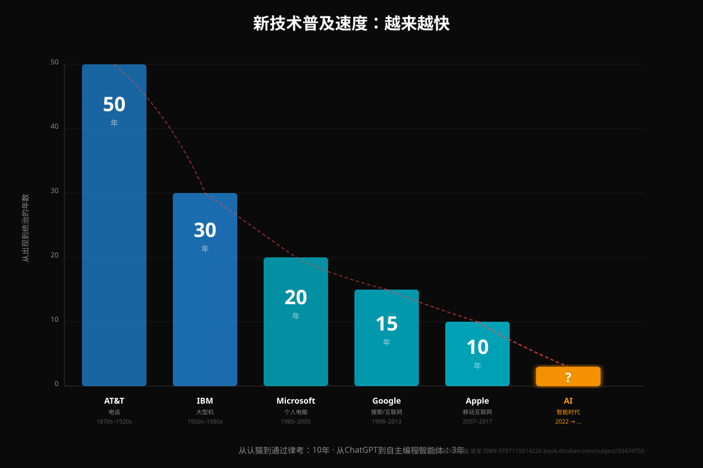

这张图的 takeaway：每一波主导期都在压缩——决策窗口可能不到十年。

速度只是表面，更关键的是被替代的“人类能力层级”在抬升——看下一张。

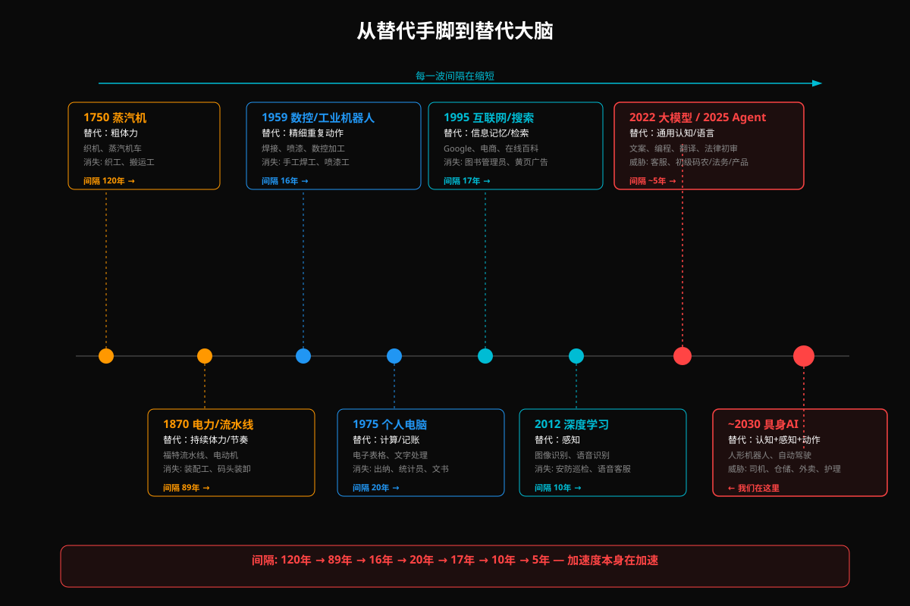

上图补充了“替代层级”视角：从蒸汽机替代粗体力，到电气化/流水线的节奏控制，再到工业机器人取代精细动作、PC与互联网取代计算与记忆，如今大模型/agent开始侵蚀通用认知，具身AI有望把“认知+动作”整合起来。每一波的时间间隔都在缩短，且目标层级不断上移。

在这三年里，大语言模型从"会聊天的搜索引擎"进化到了能自主编程、自主研究、自主决策的智能体（agent）。Citrini Research在2026年2月发表的那份引发硅谷震动的报告《过剩智能的后果》中，做了一个大胆的思想实验：假设我们站在2028年6月回望，会看到什么？[1]

本文试图在这份报告的基础上更进一步——不只看五年，而是把推演的时间轴拉到一百年。我们将从经济结构、地缘政治、人口趋势、金融体系、以及人类物种本身的走向，逐层展开分析。所有推论都基于已有数据和可观察的趋势线，尽可能让数据自己说话。

这不是一份预测。这是一份推演——"如果当前趋势不被打断，会发生什么"的逻辑链条。

---

## 二、智能溢价的崩塌：当人类的脑子不再稀缺

### 2.1 智能替代螺旋

过去两百年，人类经济体系的核心假设是：智能是稀缺资源。律师之所以年薪几十万美元，是因为能通过律师考试、能理解复杂案例的脑子不多。程序员之所以年薪二十万美元，是因为能写出可靠代码的脑子不多。金融分析师、医生、咨询顾问——所有高薪白领职业的溢价来源，本质上都是同一个东西：认知能力的稀缺性。

AI正在终结这种稀缺性。

2025年底，智能体编码工具经历了一次阶跃式跃升。一个中等水平的程序员，配合Claude Code或Codex这样的AI编程助手，几周就能复刻一款中型SaaS产品的核心功能。企业CIO开始问一个致命的问题："如果我们自己做呢？"长尾SaaS公司（Monday、Zapier、Asana）首先被冲击，7折续约已经算好结果。连"系统记录层"这样看似有深厚护城河的公司也不安全 [1]。

但这只是序幕。真正的致命逻辑是Citrini Research所称的"人类智能替代螺旋" [1]：

**AI更强 → 企业裁员 → 省下的钱买更多AI → AI更强 → 裁更多人**

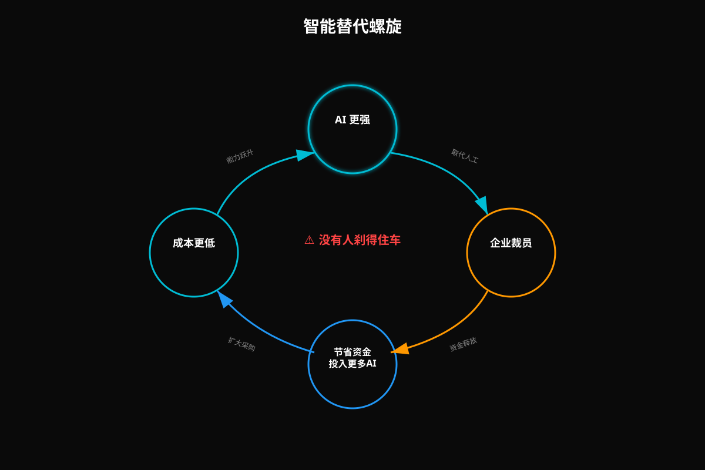

注意这不是传统意义上的资本开支扩张。企业的AI预算在增长，但总运营支出在下降——因为AI替代的是人力成本，而人力成本远高于AI的边际成本。这个循环里，没有人有动力踩刹车。

被裁的白领去了哪里？他们"降档"就业。一个年薪18万美元的Salesforce高级产品经理，三轮裁员后去开Uber，收入4.5万美元 [1]。一个人降档不是大问题。但当几十万白领同时涌入蓝领和服务业，他们不是在填补空缺，而是在压低所有人的工资。过度资质化的劳动力对底层形成"降维打击"。

更残酷的是：就在这些白领转去开Uber、送外卖的时候，自动驾驶和无人配送正在加速上线。他们的退路，也快没了。

### 2.2 摩擦归零与中介经济的崩溃

AI不只替代了劳动者，它还替消费者把"懒得做"的事全做了。

当AI代理（agent）开始替用户比价、砍价、取消不必要的订阅，所有靠信息不对称和交易摩擦赚钱的行业都面临灭顶之灾。旅游平台、保险续保、财务顾问、房产中介——这些行业的商业模式本质上是"你嫌麻烦，我帮你处理，收你一笔手续费"。但AI代理不嫌麻烦。房产中介佣金可能从2.5%-3%被压到1%以下——这是"agent对agent的暴力" [1]。

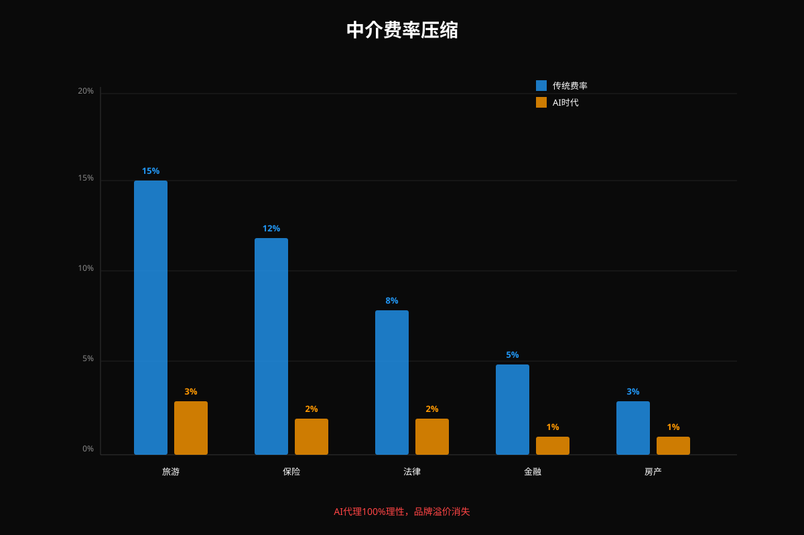

DoorDash的护城河是什么？不是它的配送网络，而是"你饿了，你懒得折腾，这个App在你主屏上"。但AI代理没有主屏。它会在所有平台间做最优选择。习惯性忠诚——人类消费行为中最强大的惯性——对机器不存在。

这引出一个更深层的推论：当AI代理替你做所有消费决策的时候，品牌还有意义吗？你买Nike而不买安踏，可能是因为广告、因为明星代言、因为你觉得穿Nike更酷。但AI代理不在乎酷不酷。它只看参数和价格。品牌溢价，说白了就是在赚人类冲动消费的钱。当决策权交给纯理性的机器，几十年建立的品牌价值可能在几年内大幅缩水。全球广告业、营销业、奢侈品行业——它们的存在前提是人类会冲动消费。这个前提正在被动摇。

### 2.3 幽灵GDP与合成谬误

宏观数据可能呈现出一幅误导性的繁荣景象——名义GDP还在增长，生产率在爆发。但这是Citrini Research所说的"幽灵GDP"：它体现在统计数字里，但从来不会变成真实的消费和流通 [1]。原因很简单：机器不买东西。

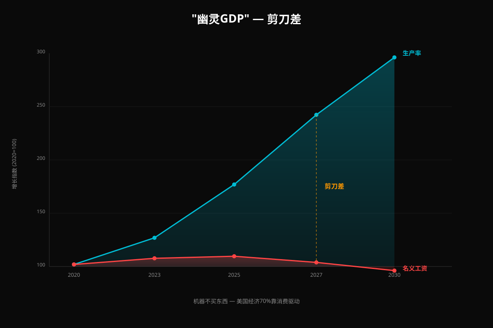

美国经济有70%靠消费驱动，而白领驱动75%的可选消费 [1]。当这些人失业或降薪，谁来买东西？谁来偿还13万亿美元的住房按揭？生产率飙升与实际工资崩塌之间的"剪刀差"，是理解接下来一切的关键。

这里隐藏着经济学中最经典的"合成谬误"（fallacy of composition）。对任何一家公司来说，用AI替代员工、削减成本是绝对理性的选择。但当所有公司同时这么做，它们集体消灭了自己的消费者。企业越高效，经济死得越快——因为效率的对价是就业，就业的对价是消费，消费的对价是收入，而收入的来源正在被机器替代。

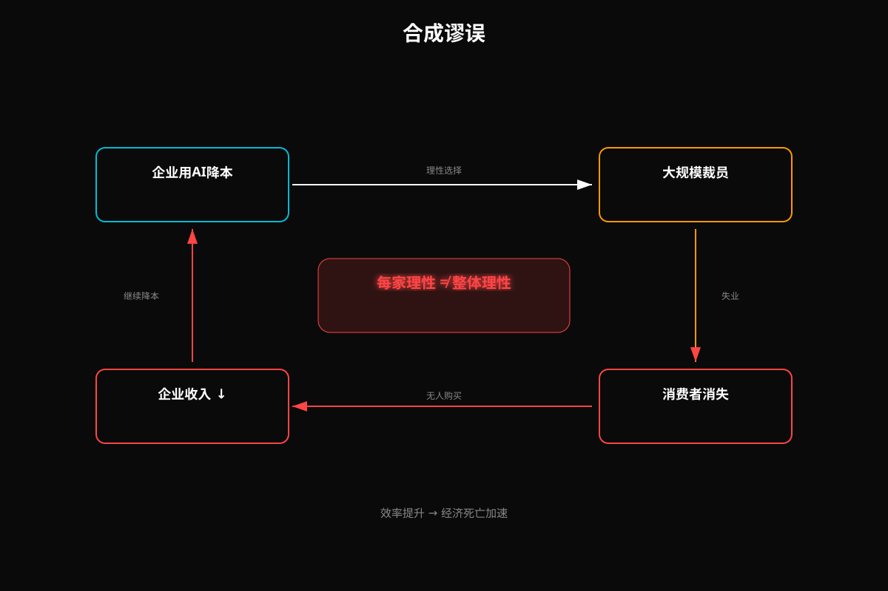

这不是理论推演。这是每一家公司都在做的事情的逻辑终点。

### 2.4 自动驾驶：开车将像骑马一样原始

在AI替代白领脑力劳动的同时，另一场革命正在公路上展开。

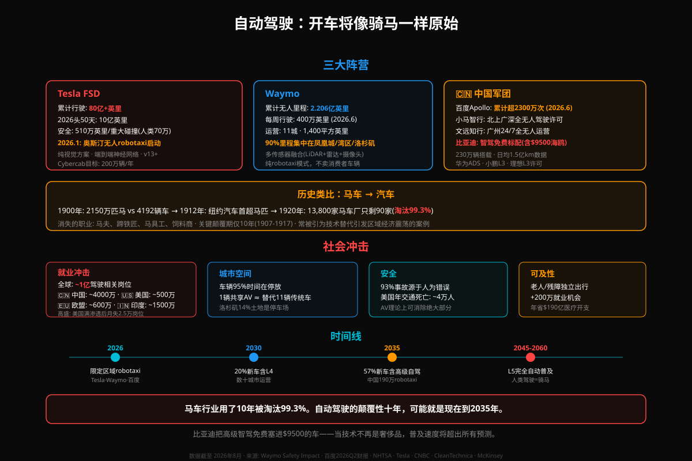

1900年的美国有2150万匹马，全年只卖出了4192辆汽车。到1912年，纽约街头的汽车数量首次超过马匹。1890年美国有13,800家马车制造企业，到1920年只剩下90家——99.3%被淘汰 [83]。大量为马匹种植饲料的农地被释放，饲料价格下跌，相关职业（马夫、蹄铁匠、马具工、饲料商）迅速消失。这常被用作“技术替代可在短时间内引发区域性经济震荡”的案例，但并非主流共识中的“大萧条主因”。

自动驾驶正在重演这段历史。但这次，被淘汰的不是马，是人类司机。

截至2026年2月，特斯拉FSD（全自动驾驶）累计行驶超过**80亿英里**，2026年头50天就跑了10亿英里 [84]。特斯拉自报的安全数据显示FSD每510万英里才发生一次严重碰撞，美国全体人类司机平均每70万英里一次（两者口径不同，直接对比存在偏差）[84]。2026年1月22日，特斯拉在奥斯汀启动了**无安全员robotaxi**服务 [84]。

**到2026年，能力和部署这两条曲线明显分开了。必须分开讲，因为约束在第二条上。**

**能力曲线在复利式增长。** Waymo 起步最早：2025年底每周完成 **45万+** 次付费载客 [85]；到2026年3月，它累计跑出 **2.206亿英里**完全无人驾驶里程（车上无人类驾驶员），2026年6月每周行驶 **400万英里**，官方口径覆盖 **11个城市、1,400平方英里** [129]。

**中国的追赶同样凶猛。** 百度Apollo Go在2025年底覆盖22+个城市、累计载客1700万+次 [85]，到2026年6月累计已**超过2300万次**，安全指标为每 **1,440万公里**一次气囊弹出 [129]。小马智行拿到北上广深四个一线城市的全无人牌照，文远知行在广州实现24/7全无人运营 [85]。2026年上半年，Apollo Go 在迪拜启动全无人商业运营，在香港拿到**全球第一个右舵左行市场**的全无人测试牌照，并在伦敦开始路测 [129]。

**部署曲线却高度集中。** 同一份 Waymo 官方数据按城市拆开：

| 城市 | 累计无人驾驶里程 |
|---|---|
| 凤凰城 | 8,055万英里 |
| 旧金山湾区 | 6,708万英里 |
| 洛杉矶 | 5,182万英里 |
| 奥斯汀 | 1,579万英里 |
| 亚特兰大 | 538万英里 |

**前三个城市合计1.994亿英里，占全部的90.4%** [129]。

这个数字值得盯着看一会儿。商业化运营多年之后，**人类有史以来所有的无人驾驶里程，九成发生在三个都会区**。

这不是因为模型在纳什维尔开不了车——**开的是同一个模型**。差别在于每进一个新城，要重新做安全验证、拿监管批准、谈保险条款、取得地方政治同意，并且吸收掉当地的第一起事故。**约束已经从模型本身，转移到了模型周围的一切；而模型周围的一切不随算力增长。**

**顺带澄清一个常见误解：Waymo 和特斯拉是两条技术路线，但这不是"谁更可靠"之争。**

Waymo 走激光雷达+雷达+摄像头融合、依赖高精地图、逐城标定验证；特斯拉走纯视觉、不依赖高精地图、赌车队数据的泛化。特斯拉的优势是**单车成本和潜在铺开速度**——这是规模优势，不是可靠性优势。到2026年8月，特斯拉无车内安全员的运营覆盖6个都会区，但真正无车内安全员的车辆规模仍是数十辆量级；而 Waymo 已经跑了2.2亿英里。

**"Waymo 事故和召回更多所以更不可靠"是一个统计错觉**：它恰恰是"跑到足够规模、且处在会被曝光和上报的监管体制里"的结果。车队差两个数量级时，事故数不能直接比。

而且两条路线正在收敛：Waymo 第六代 Driver 上 Zeekr 平台是明确的降本动作，特斯拉的 Cybercab 是专造车型——都在往"便宜的专用车 + 重机器学习"走。2019年那种路线对立，在2026年已经淡了很多。

但真正改变游戏规则的是比亚迪。2025年，比亚迪宣布将"天神之眼"智驾系统**免费标配**到全系车型——包括售价仅6.98万元的海鸥 [86]。截至2025年11月，官方称**230万辆**比亚迪已搭载该系统，每天生成**1.5亿公里**的驾驶数据 [86]。当一个$9,500的小车都配了高级辅助驾驶，这项技术的普及速度将远超所有预测。

社会冲击将是深远的。全球约有**1亿个**驾驶相关岗位面临自动驾驶的冲击 [83]。美国约500万（其中350万卡车司机），但这只是冰山一角。中国的规模更惊人：约**3000万**卡车司机、**750万+**网约车和出租车司机、**1200万**外卖骑手——合计约**4000万**驾驶相关岗位 [87]。欧盟约500-700万，印度约1500万。高盛估计，仅美国在自动驾驶充分渗透后，每月将有**2.5万人**失去驾驶岗位 [87]。国际运输论坛的激进情景预测，到2030年美欧卡车司机岗位将减少**50-70%** [87]。但就业冲击只是冰山一角：

- **城市空间重塑**：人类的车95%时间在停放。自主共享车辆每辆可替代约11辆传统车——洛杉矶14%的土地用于停车场，这些空间可以释放为公园和住宅
- **保险业重构**：当93%的事故源于人为错误，自动驾驶将颠覆整个汽车保险模型——责任从司机转移到厂商和软件
- **可及性革命**：老人、残障人士获得独立出行自由，预计创造200万个新就业机会并每年节省190亿美元医疗开支（减少错过的预约）[83]

专家共识是：L4级自动驾驶（限定区域无人驾驶）将在2020年代末至2035年间大规模普及；完全L5级（任何条件下全自动）可能要到2045-2060年 [83]。但关键的颠覆性十年——就像1907-1917年汽车爆发式取代马匹——很可能就是现在到2035年之间。

二十年后，人类手动驾驶可能就像今天骑马上班一样——技术上可行，但荒谬。

### 2.5 人形机器人：当AI长出手脚

前面讨论的自动驾驶是AI进入物理世界的第一步——车轮上的AI。但故事还有下半场：当AI不再只是屏幕上的文字，也不只是方向盘后面的幽灵，而是站在你面前、用两只手搬箱子的人形机器人时，蓝领和服务业最后的避风港也将被攻破。

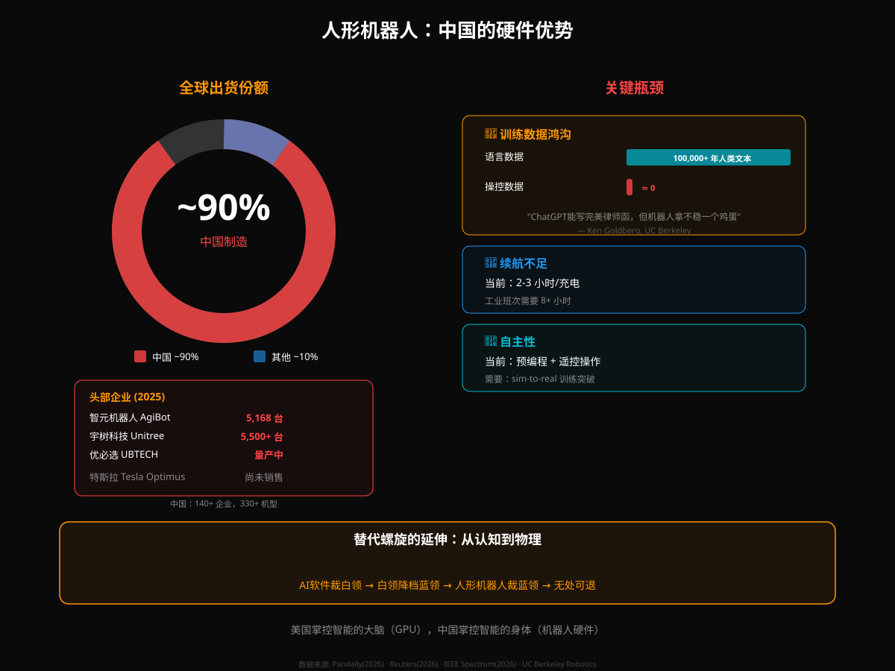

2025年，全球人形机器人出货量出现了第一次实质性爆发。令人意外的是，中国几乎独占了这个新兴市场——据行业追踪数据，2025年全球出货的人形机器人中，约90%来自中国企业 [36]。智元机器人（AgiBot）一家就出货5,168台，宇树科技（Unitree）出货超过5,500台 [37]。中国已有超过140家人形机器人企业，推出了330多款机型 [36]。相比之下，特斯拉Optimus至今尚未实现商业销售，落后于原定计划 [37]。

这不是偶然。中国在这个领域的优势源于其全球最完整的制造业供应链——从电机、传感器、电池到精密齿轮，所有零部件都能在国内采购并快速迭代。这与AI芯片领域美国的主导地位形成了有趣的互补：美国掌控智能的大脑（GPU、大模型），中国掌控智能的身体（机器人硬件）。

但有一个关键瓶颈：**自主性不足**。今天的人形机器人大多需要人类预编程动作序列，或通过远程遥操作来完成任务。加州大学伯克利分校的Ken Goldberg教授指出了根本原因：人类拥有超过10万年的语言数据用于训练大语言模型，但用于训练机器人操控物体的真实世界数据几乎为零 [38]。这就是为什么ChatGPT能写出一篇完美的律师函，但一个价值数百万的机器人却拿不稳一个鸡蛋——语言有海量训练数据，而物理操作没有。

此外，续航也是硬伤。当前人形机器人电池续航仅2-3小时，不足以支撑一个完整的工业班次 [38]。

然而，这些瓶颈正在被快速攻克。仿真到现实（sim-to-real）训练技术正在弥合数据鸿沟——在虚拟环境中训练数百万次机械臂操作，然后迁移到真实机器人上。电池技术每年提升8-10%的能量密度。如果这条曲线在未来五年内保持，到2030年前后，我们很可能看到第一批真正自主的人形机器人进入工厂和仓库。

**到2026年，这场爆发的规模又翻了一倍不止，但方向出现了三重背离。**

先看数字。2026年上半年，全球人形机器人出货约**19,100台，同比增长272%**；**中国厂商占全球出货量的97%以上**，中国市场本身占全球需求的85%以上 [127]。厂商座次也变了——智元超过宇树，成为全球出货第一（宇树2025年全年出货5,500台）[127]。资本更热：2026年8月19日，**宇树科技在科创板上市，首日盘中最高涨620%、收涨约460%**，市值一度触及**4,450亿元（约660亿美元）**——而它发行时的估值只有610亿元 [127]。

**第一重背离：出货在翻三倍，但最被寄予厚望的那家产量是零。** 截至2026年年中，特斯拉Optimus的Fremont正式产线**没有量产出一台**——尽管特斯拉为此拆掉了Model S/X的产线。马斯克2025年1月还说"我们能不能造出几千台？我认为能"，到2026年一季度改口为"今年晚些时候"。首批下线的机器人也不发给客户，而是进入内部的"Optimus Academy"项目 [127]。**一边是出货量+272%，一边是最高调的玩家产线挂零——这说明当前的出货高度集中在少数几家能真正把硬件做出来的中国厂商手里，而不是行业整体成熟。**

**第二重背离：能力叙事和技术现实在拉开。** 丰田研究院CEO Gill Pratt在2026年4月的访谈里说得很直白："我们仍然没有 system two"——机器人有反应式的直觉（system one），但没有审慎推理的能力，而给 system one 打补丁想变成 system two 的尝试反复失败。他承认业内"有大量的过度承诺"，并判断人形机器人正在逼近"期望膨胀的顶峰" [127]。Rodney Brooks在2026年7月复盘自己的旧预测时，把"灵巧机器手普遍可得"推迟到了**最早2030年、最晚2040年**，并写下一句："**到2036年之后，可部署的灵巧性相比人手仍将是可怜的。**" [127]

**第三重背离，也是最值得记的一条：制度性抵抗比技术成熟来得更早。**

2026年7月，现代汽车在韩国的整车厂爆发罢工，约**3.5万名工人**参与——**这是历史上第一次明确由"要在产线上部署人形机器人"这个计划直接触发的罢工** [127]。起因是现代宣布将在美国工厂率先部署超过**25,000台**波士顿动力的Atlas。

耐人寻味的是两个细节。第一，**现代在韩国的工厂根本还没定部署日期**——工人是在机器人到货之前就先罢了工。第二，工会的核心诉求不是"禁止自动化"，而是：**"没有劳资协议，一台机器人都不许进现代的厂区。"**

他们的逻辑非常清醒：**一旦机器人上了产线，谈判筹码就没了。** 所以要在部署决策发生之前，先把"人得有一票"这件事写进制度。

这件事的意义超出了劳资纠纷本身。它是 §3.5.1 那个论点的第一个现实注脚——当技术能力和法律责任的分配开始脱钩，人争取的不再是"我能干这个活"，而是**"这件事得有人代表、得有人签字"**。工人要的不是岗位，是**人格在决策链上的位置**。

这意味着什么？前面讨论的"智能替代螺旋"将从认知领域扩展到物理领域。当白领被AI软件裁掉，他们"降档"去开Uber、送外卖。当人形机器人自主化后，连这些退路也将关闭。替代螺旋不再只是一个循环，而是一个无处可逃的封闭系统。

### 2.6 35岁危机的翻转：AI偏爱谁？

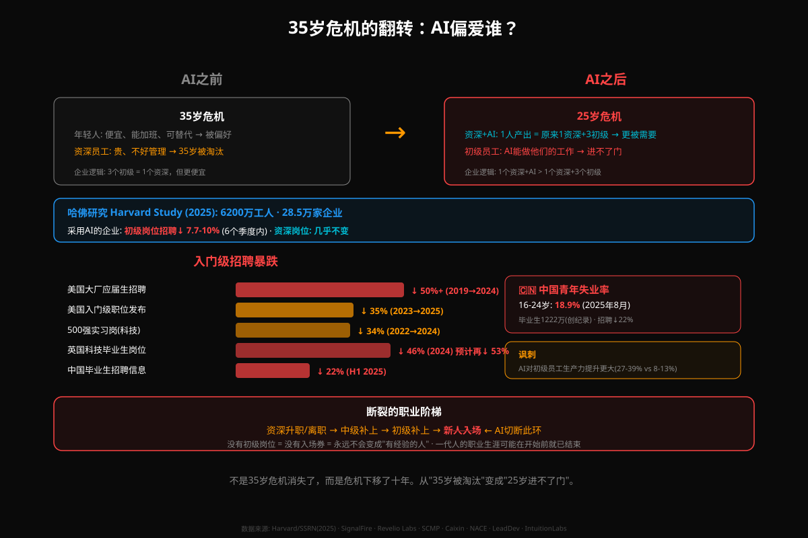

在中国互联网行业，"35岁危机"曾是最扎心的职场潜规则——很多企业公开标注"35岁以下"的招聘条件，程序员过了35岁就面临淘汰。便宜、能加班、可替代，是年轻劳动力的"优势"。

AI正在翻转这个逻辑。

2025年哈佛大学一项追踪**6200万工人、28.5万家企业**的大规模研究发现：采用生成式AI的企业，**初级岗位招聘在六个季度内下降了7.7%-10%，而资深岗位几乎不受影响** [81]。研究者将其命名为"偏向资深的技术变革"（Seniority-Biased Technological Change）——AI不是平等地替代所有人，它优先替代的是初级员工。

数据触目惊心。美国15家最大科技公司的应届生招聘自2019年以来**下降超过50%**，应届生现在只占大厂新员工的7% [82]。全美入门级职位发布量从2023年1月到2025年6月**暴跌35%** [82]。财富500强的实习岗位减少22%，其中科技实习岗减少34% [82]。54%的工程主管表示将因AI copilot**减少初级开发者招聘** [82]。Salesforce的CEO宣布2025年**完全停止初级招聘** [82]。

中国的情况更严峻。2025年8月，16-24岁青年失业率攀升至**18.9%**，创下新统计口径以来的最高纪录 [81]。2025年高校毕业生达到创纪录的**1222万人**，而面向毕业生的招聘信息同比**下降22%** [81]。AI人才需求旺盛（搜索算法工程师的需求供给比达到9:1），但这些岗位要求的是资深专家，不是应届生 [81]。

为什么会这样？逻辑很简单。AI做的最好的事情——写基础代码、做数据录入、整理报告、回复客户邮件——恰恰是初级员工的日常工作。一个有十年经验的架构师加上AI工具，产出等于以前的自己加两三个初级开发者。企业的算术很容易算：雇一个资深+AI，还是雇一个资深+三个初级？答案不言自明。

讽刺的是，研究显示AI对初级员工的**生产力提升比例**其实更大（27-39%），远高于资深员工（8-13%）[81]。AI像一个"均衡器"，把低水平拉高。但企业不关心百分比，关心的是：谁能**验证**AI的输出？谁能做**判断**？谁有**领域知识**？答案都是资深员工。AI让初级员工变得更能干，但同时也让他们更容易被替代——因为AI自己就能干他们能干的事。

这对职业阶梯的影响是毁灭性的。传统的"空缺链"是：资深员工升职/离职→中级补上→初级补上→新人入场。AI切断了最底层这一环。没有初级岗位，就没有"入场券"；没有入场券，就永远不可能变成有经验的人。这不是35岁危机的消失，而是危机的下移——从"35岁被淘汰"变成"25岁进不了门"。一代人可能在职业生涯开始之前就已经结束了。

英国的数据同样惨烈：2024年科技行业毕业生岗位**减少46%**，预计到2026年**再降53%** [82]。全球66%的企业表示计划因AI减少入门级招聘 [82]。

中国倒是开始做出一些调整——上海、浙江、江苏等省市在2025年将公务员考试的年龄上限放宽，2025年1月起法定退休年龄延迟（男性60→63岁，女性50-55→55-58岁）[81]。但这些政策的讽刺在于：刚刚放松35岁门槛，25岁的门槛就来了。

### 2.7 学位贬值的连锁反应：当教育体系被就业市场倒逼

2.6节描述了"25岁进不了门"的困境。但问题不会停在就业市场——它会沿着链条向上游传导，击穿整个教育体系。

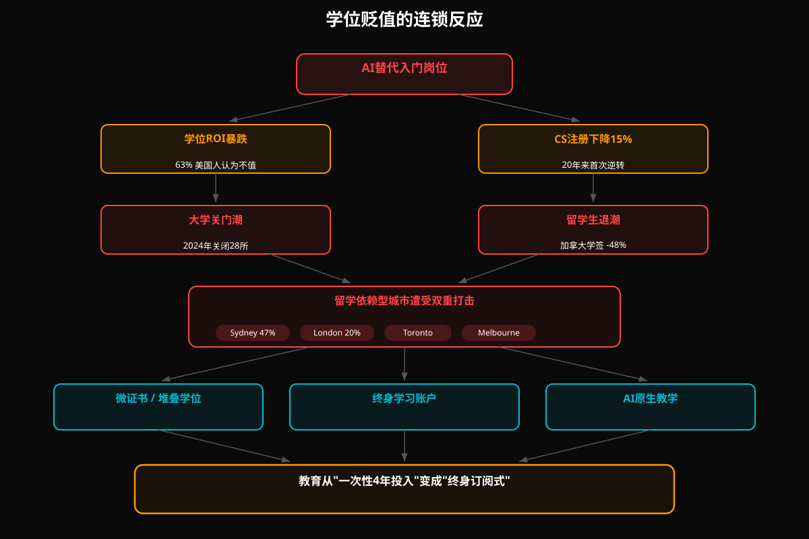

**学位正在失去信号价值。** 2025年，只有**30%**的应届毕业生找到了专业对口的全职工作，比2024年骤降 [92]。**33%**的2025届毕业生仍在失业求职，而2024年这个数字是20% [92]。更致命的是雇主的态度：**96%**的HR主管认为大学需要为职场准备承担更多责任，**75%**直接说大学教育"根本没在为工作做准备" [92]。当学位不再是就业的可靠信号，它的价值就开始坍塌——**63%**的美国人现在认为四年制学位"不值得" [93]。

**CS专业大逃亡是矿井里的金丝雀。** 2025年秋季，计算机科学研究生注册人数**下降15%**，本科下降近6%——**20年来首次逆转增长趋势** [94]。62%的计算机院系报告招生下降。但学生不是在逃离科技，他们在逃离自己认为会被AI替代的部分：MIT的"AI与决策"专业已成第二大专业，南佛罗里达大学的AI与网络安全学院招了3000+学生 [94]。64%的悲观CS学生把原因直接归结于生成式AI [94]。

**大学开始关门了。** 2024年前9个月，美国关闭了**28所**学位授予机构，而2023年全年才15所。费城联储预测最坏情况下每年将关**80所** [95]。南俄勒冈大学砍掉了38个专业中的15个，包括化学和经济学 [95]。这不是个别现象——当学位的ROI中位数只有12.5%，**四分之一毕业生可能永远看不到回报**，而总成本（含机会成本）达到$180,000时 [93]，这个产品正在失去市场。

**留学经济的崩塌可能引发城市级连锁反应。** 这是一个被严重低估的风险。全球留学产业是一个巨大的经济体：

| 国家 | 年贡献 | 占比 | 2024-25趋势 |
|------|--------|------|------------|
| 澳大利亚 | AUD $536亿 | 第四大出口 | 签证申请↓28% |
| 加拿大 | CAD $223亿 | GDP的1.2% | 学签发放↓48% |
| 英国 | GBP £94亿（仅学费） | 高教收入20% | 连续两年下降↓6.1% |
| 美国 | USD $430亿 | 支撑35.5万就业 | 2025秋新生↓17% |

最脆弱的节点是那些对留学生收入依赖度极高的大学和城市。悉尼大学**47%**的收入来自国际生学费 [96]；墨尔本大学33%、45%的学生是国际生 [96]。伦敦是英国最大的留学生聚集地，英国高教23.9%的学生是国际生。波士顿的6.3万国际生带来约$30亿本地经济效益，三分之二的高端公寓租给留学生 [96]。

加拿大已经是一场预演。2024年学签发放暴跌48%后，**600+个教育项目被取消或暂停**，4所学院关闭校区，安省24所学院中19所裁员**8000+人** [96]。这还只是政策收紧的结果——还没叠加学位本身贬值。

关键在于：留学生disproportionately读的是STEM、商科和CS——恰好是AI冲击最大的专业。当一个每年$4万的国际学位不再有清晰的ROI优势，**最先撤退的就是付全价的国际生**——而这恰好是大学最赚钱的客群。英国的数据尤其触目惊心：**45%**的英国高校2025/26年面临赤字，预计72%年底赤字 [96]。英国大学每个国内生**亏£2,500/年**——一直靠国际生学费补贴国内教育。当国际生减少，这个交叉补贴模型就崩了。

**教育体系正在被迫重塑。** 变革沿着四条路径展开：

**第一，四年学位碎片化为可堆叠的微证书。** 美国2025年7月通过了《Workforce Pell Grant》法案，首次允许联邦Pell助学金覆盖8-15周的短期职业培训项目 [97]。34个州已有111个项目、累计投资$45亿专门资助短期非学位证书 [97]。96%的雇主认为微证书加分，90%愿意为持证者加薪 [98]。未来的模式可能是：8周证书→堆叠成副学士→再堆叠成本科——按需购买，而非一次性打包。

**第二，终身学习账户取代一次性教育。** 英国的"终身学习权利"（Lifelong Learning Entitlement）2026/27学年起生效：每人一生可支取相当于4年本科的教育贷款（约£38,140），60岁前随时用，通过在线个人账户管理 [99]。新加坡的SkillsFuture已帮66万公民提升技能。**中国在这方面最激进**：2025-2027年计划培训**3000万工人**的职业技能，配套"八级工"制度直接挂钩工资晋升，并用国产大模型开发AI职业教育课程——这是全球首例 [100]。

**第三，AI成为教育基础设施。** 2024/25学年，60%的美国K-12教师已在使用AI工具，每周省6小时 [101]。学生用ChatGPT做作业的比例一年翻倍（13%→26%）[101]。到2035年，专家预测AI导师将能看、听、说，了解每个学生的强弱项，提供精准的个性化教学 [102]。这可能是教育领域最大的"均衡器"——精英教育的认知壁垒被AI打平，正如AI打平了编程的认知壁垒一样。

**第四，大学的价值被重新定义。** 当知识获取被AI民主化，大学的独特价值缩窄到三件事：同侪网络、实习通道、信号效应。顶尖大学变成"精英俱乐部"——哈佛的价值不是课程，是校友网络和品牌光环。中低层大学如果还在卖"知识传授"就会被淘汰。留学的价值也会重新定义：不是学知识（AI比教授讲得好），而是买签证+社交网络+文化体验+本地就业通道。

这条链条总结起来：**AI替代入门岗位 → 学位ROI暴跌 → 学生逃离/大学关门 → 留学生退潮 → 依赖留学经济的城市遭双重打击 → 教育从"一次性4年投入"变成"终身订阅式"。** 这不是十年后的事。加拿大已经在发生，澳大利亚和英国正在发生。

### 2.8 失业—财政—延寿：三条错位的时间线

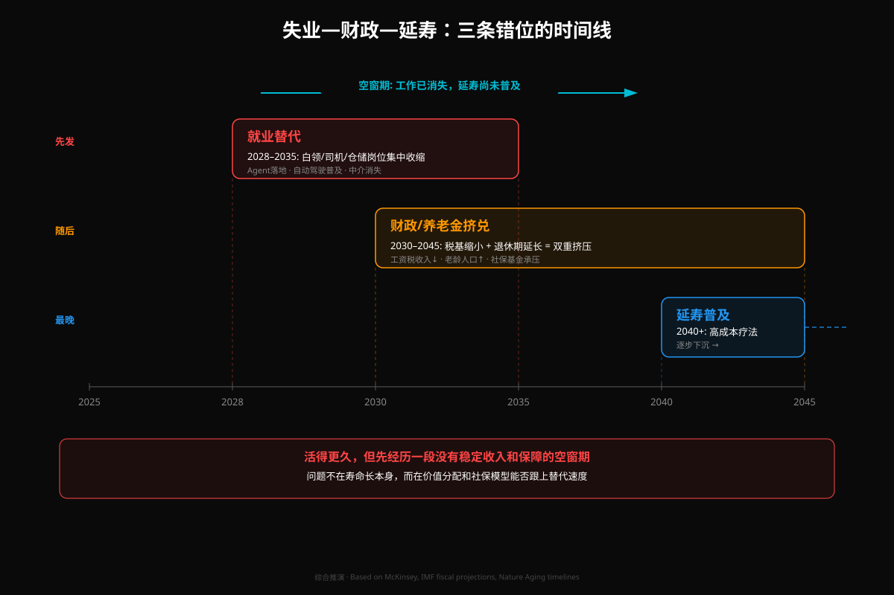

- 就业替代先到：agent与自动驾驶在**2028-2035**集中落地，白领/司机/仓储岗位收缩。
- 财政/养老金随后吃紧：税基因失业缩小，但退休期因延迟退休和长寿延长，挤兑窗口大约**2030-2045**。
- 延寿普及更晚：逆龄/细胞重编程等高成本疗法即便成功，普及大概率在**2040+**之后。

这意味着可能出现“活得更久，但先经历一段没有稳定收入和保障的空窗期”。问题不在寿命长本身，而在价值分配和社保模型能否跟上替代速度。

---

## 三、减速因素：什么可能让AI慢下来

前两章描绘了一幅极端的加速图景。但诚实的推演必须面对另一面：有哪些力量可能延缓、甚至暂时中断这个过程？历史上每一项"即将改变世界"的技术都经历过从狂热到幻灭的过渡期。AI也不会例外。

制约因素分三层：物理层、信任层、制度层。但它们不是三个并列的刹车——**它们运行在三种不同的时钟上，而这才是决定AI扩散节奏的关键**：

| 层 | 时钟 | 由什么驱动 |
|---|---|---|
| 技术能力 | **复利** | 算力、数据、模型 |
| 物理层（电力、芯片、原子） | **线性偏慢** | 资本开支与建设周期 |
| **制度层（问责、监管、保险）** | **没有时钟** | **事件** |

第三行是最容易被忽略、也最重要的一条：**制度层不随时间改善，只随事故改善。** 它不是"慢"，它根本不在时间轴上跑——它停着不动，直到出事，然后不连续地跳一步。

本文后面会反复看到这个模式：中国在武汉多车停摆之后才出台自动驾驶强制性国标（§2.4）；聊天机器人的法律责任在 Moffatt 诉加拿大航空案判决之后才被确立（§3.3）；得州在并网队列涨到历史峰值负荷五倍之后才下令审计（§3.7）；而**人形机器人到2026年8月在美国、中国、欧盟都还没有强制性安全标准**（§2.5）——不是因为它更安全，而是因为它还没有可辨识的事故和可辨识的受害者。

这个结构有一个直接推论：**能力越强，技术长尾越窄，触发制度反应的事件越稀疏——但每次触发时的部署规模更大，后果也更严重。** 所以两条曲线之间的缺口不会平滑收敛，而是表现为**间隔越来越长、幅度越来越大的阶跃**。

### 3.1 物理层：电力、芯片与原子

**电力是最硬的瓶颈。** 美国数据中心电力需求预计2026年达到75.8GW，2030年飙升到134.4GW [49]。但电网扩容的速度远远跟不上——部分地区的电网并网申请已经排到了七年以后 [49]。72%的基础设施高管表示电力和电网容量是"非常或极度严峻"的挑战。结果是什么？2026年计划上线的16GW数据中心容量中，实际在建的只有5GW——30-50%的大型数据中心项目将被推迟 [49]。阿姆斯特丹、都柏林、新加坡已经出台了数据中心建设禁令。

**芯片供应同样吃紧。** 台积电自己承认，先进制程产能约为AI需求的三分之一 [50]。Nvidia的Blackwell GPU订单积压超过一年。问题是解决这些瓶颈需要物理时间：建一座先进制程晶圆厂需要3-5年，投资超过200亿美元。台积电亚利桑那工厂要到2028年才能全面运转，熊本工厂推迟到了2029年 [50]。中芯国际用DUV多重曝光实现了5nm级制程，但良率仅约30%，远低于经济可行的70%门槛 [50]。

**人形机器人面临更多物理约束。** 续航仅2-3小时（工业班次需要8小时以上），电池达标可能需要长达十年 [51]。全球没有统一的人形机器人安全测试标准——ISO 25785-1正在制定中，但远未完成 [52]。Figure AI曾被提起安全诉讼，焦点在于部署前的测试充分性和潜在夹持风险，案件仍在推进 [52]。亚马逊引入仓库机器人后，工伤率曾被报道高于行业平均——部分原因是人类被要求配合机器人的节奏 [52]。

### 3.2 信任层：幻觉、最后一公里与ROI幻灭

AI agent的核心问题不是"能不能做"，而是"能不能信"。

最好的模型在摘要任务上的幻觉率已从21.8%（2021年）降到了0.7%（2025年），但在事实性问答中，OpenAI的o3仍然有33%的幻觉率 [53]。美国法院已记录数百份包含虚假引用的AI生成法律简报。2025年，一名律师提交的法律文件中包含近30条虚假引用和虚构案例 [53]。德勤提交给澳大利亚政府的一份报告包含捏造的学术来源和虚构的法庭引语，费用44万澳元 [53]。

更深层的问题是"最后一公里"困境。自动驾驶能处理95%的路况——但剩下5%的边缘情况（暴雨、积雪、褪色标线、施工区域）消耗了80%的开发时间和资本。Waymo跑了1400万次付费行程，但仍然只在少数城市的地理围栏区域内运营 [54]。Rodney Brooks——iRobot联合创始人、MIT名誉教授——每年更新一份预测记分卡，记录了自2017年以来每一位承诺"几年内实现自动驾驶"的汽车高管如何全部食言。他预测人形机器人的灵巧性在2036年以后仍将"远不如人手" [54]。

通用汽车在投入近100亿美元后，于2024年12月关闭了自动驾驶子公司Cruise [54]。Meta的元宇宙旗舰平台Decentraland日活用户一度跌至仅38人。核聚变从1970年代就"还有30年"——到现在仍然"还有30年"。每一项被过度承诺的技术都遵循同一条曲线：炒作期 → 幻灭期 → 缓慢爬坡期。

Gartner的2025年炒作周期图证实了这一点：**生成式AI已经滑入"幻灭低谷"**，而AI agent还停留在"过度期望峰值" [55]。MIT 2025年的研究发现，95%的企业从生成式AI项目中获得的ROI为零 [55]。平均每个AI项目烧掉190万美元，但不到30%的CEO对回报满意。尽管如此，全球AI投资仍在加速——2026年预计达到2.5万亿美元，同比增长44% [55]。

这不意味着AI不行。这意味着从"技术可行"到"大规模可靠部署"之间，存在一条很多人低估的鸿沟。

### 3.3 制度层：监管、工会与法律真空

EU AI Act的时间表本身就是”制度追不上技术”的最好例证。它原定2026年8月对高风险AI系统全面适用，但欧盟在大限前**6天**以《AI综合简化法案》（Digital Omnibus on AI，即 Regulation (EU) 2026/1744，2026年7月27日生效）把附件III的独立高风险义务（招聘、信贷评分、执法、教育、边境管控）推迟到**2027年12月2日**，把附件I嵌入受监管产品的高风险AI（医疗器械、机械、车辆）推迟到**2028年8月2日**——理由是协调标准与合格评定基础设施还没准备好 [56]。2026年8月2日如期落地的只有第50条透明度义务：必须告知用户正在与AI交互、AI生成内容必须标注 [56]。中国这边，监管重心在2026年转向了”拟人化AI”：《人工智能伴侣和情感互动服务管理暂行办法》2026年4月10日发布、7月15日施行，是全球第一部专门规制AI伴侣与情感互动服务的部门规章——上线前须安全评估与属地备案，禁止诱导情感依赖，必须显著标注”对方是AI不是真人”，未成年人绝对禁止虚拟亲密关系。直接后果是字节跳动与阿里巴巴在2026年7月初下架了各自的AI伴侣功能 [56]。

工会正在积极争取"座位"。2024年10月，美国国际码头工人协会发起了为期三天的罢工，关闭了东海岸和墨西哥湾所有主要港口，最终在集体谈判协议中写入了**禁止完全自动化**的条款 [57]。好莱坞编剧协会（WGA）在2023年罢工中争取到了"AI不得被视为编剧"的条款。演员工会（SAG-AFTRA）争取到了AI数字复制品必须获得本人同意并支付报酬 [57]。

**法律责任是最大的灰色地带。** AI agent自主行动造成损失，谁负责？2024年Moffatt诉加拿大航空案中，法院裁定航空公司对其聊天机器人的错误陈述承担全部责任——驳回了"聊天机器人是独立法律实体"的辩护 [58]。EU新的《产品责任指令》将于2026年12月前实施，明确将软件和AI视为"产品"，适用严格责任 [58]。但人形机器人在美国没有任何联邦安全测试要求——它们可以在没有任何独立第三方验证的情况下就进入工作场所。

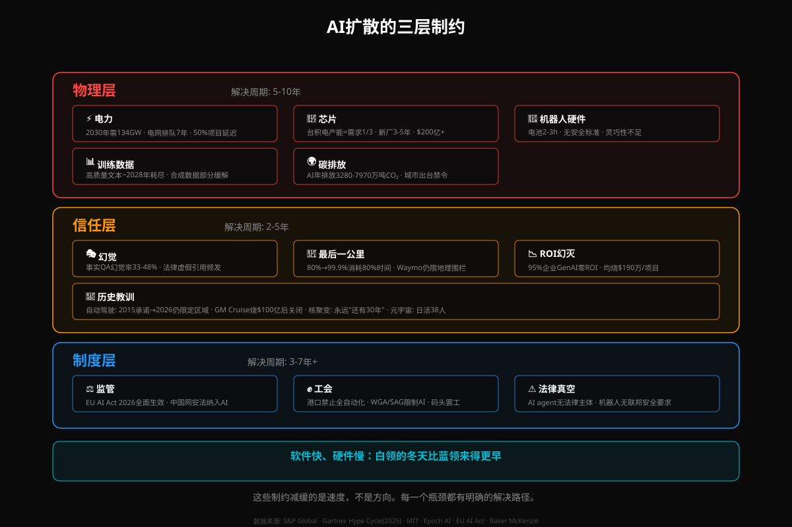

### 3.4 快与慢：不同速率的扩散

综合来看，三层制约的解决时间表截然不同：

| 制约因素 | 严重程度 | 预计解决周期 |
|---------|---------|------------|
| 电力/电网容量 | 极高 | 5-7年（电网排队7年+） |
| 芯片供应（先进封装） | 高 | 2027-2029（新厂投产） |
| 训练数据耗尽 | 中高 | 2027-2029（合成数据部分缓解） |
| AI可靠性/幻觉 | 中 | 持续渐进改善 |
| 企业集成摩擦 | 高 | 3-5年（遗留系统改造） |
| ROI幻灭期 | 高 | 2-3年（穿越幻灭低谷） |
| 监管合规 | 中 | 2026-2027（EU AI Act全面生效） |
| 人形机器人成熟度 | 高 | 5-10年（电池、灵巧性、安全标准） |

这意味着什么？**纯软件AI（agent、编程助手、文本生成）的扩散会很快**——边际成本接近零，部署不需要物理基础设施改造。但**AI在物理世界的落地（机器人、自动驾驶、数据中心基建）会慢得多**——受限于原子世界的物理定律和社会制度的惯性。

换句话说：白领的冬天可能比蓝领来得更早。代码可以在毫秒内部署到全球，但建一座发电厂需要五年，让一个机器人安全地在仓库里搬箱子需要十年。这个时间差——软件快、硬件慢——可能是这场变革中最被低估的变量。

但需要警惕的是：这些制约因素减缓的是速度，不是方向。每一个瓶颈都有明确的解决路径——电网在建、芯片厂在盖、合成数据在生成、安全标准在制定。它们决定的是AI替代是在五年内发生还是十五年内发生，而不是是否发生。

### 3.5 暴风雨前的平静：世界为什么还在"装睡"

如果AI真有本文描述的那么颠覆性，为什么2026年初的全球就业数据看起来还好得很？

事实如此：2026年1月，美国失业率4.3%，处于历史低位，当月还新增了13万个工作岗位 [90]。欧盟5.9%，接近几十年来最低。全球4.9%，稳定 [90]。耶鲁大学和布鲁金斯学会2025年10月的一项联合研究得出了一个惊人的结论："自ChatGPT发布以来，就业市场**没有可观测到的颠覆**。"高、中、低AI暴露度岗位的占比"惊人地稳定"，失业人群中AI暴露度的比例也没有增加 [90]。

这不是AI不行。这是**时滞**。

原因有三层。第一，**企业采用远比技术能力滞后**。2026年初，88%的企业声称"在用AI"——但只有**7%**真正全面部署到生产环节 [91]。2025年初，不到5%的企业应用嵌入了AI agent。大部分企业还在"试一试ChatGPT写邮件"的阶段，离用agent重构业务流程差得远。McKinsey的调查显示，只有6%的企业在系统性地从AI中获取商业价值 [91]。

第二，**当前的AI仍然需要人来驱动**。2026年的AI不是替代者，而是放大器。人类在AI工作流中扮演三个不可替代的角色：

- **Driver（驱动者）**：AI不会自己决定"做什么"。它需要人来定义问题、设定目标、选择工具、分解任务。一个资深产品经理用AI可以一天完成过去一周的调研，但"调研什么"这个判断仍然是人做的。AI是一辆性能极强的赛车，但方向盘还在人手里。
- **Ground Truth（真实性校验者）**：AI会幻觉（hallucinate）——它可以自信满满地编造不存在的法律条文、虚构学术论文、捏造统计数据。事实QA的幻觉率仍高达33-48% [51]。每一段AI生成的内容都需要有领域知识的人去校验：这个代码能跑吗？这个法律引用存在吗？这个数据来源靠谱吗？没有人做ground truth，AI的输出就是薛定谔的猫——可能对，也可能彻底错，你不打开看不知道。但幻觉只是表象，更根本的原因是：**人类拥有一套始终在线的感知系统——眼睛、耳朵、皮肤、鼻子——7×24小时接收外部世界的实时刺激，而AI没有。** AI/LLM的全部"感知"来自已经被数字化的信息——文本、图片、传感器日志——但现实世界中大量关键信息从未被数字化：一场车祸的现场（在有人拍照上传之前，没有任何数据存在）、一台机器运转时的异常振动、一栋建筑结构的细微裂缝、一个病人的面色和气息。人类可以直接走到现场，用自己的感官去感知、验证、判断；AI只能等着别人把信息"翻译"成数据喂给它。这不是算力或算法的问题，而是**AI在物理世界中没有"在场"的能力**——它的感知器官还不存在，它的身体还没准备好。还有一个更隐蔽的结构性缺陷：**AI agent的记忆是有限且有损的。** 当前大模型受限于最大上下文窗口——当对话或任务足够长，上下文塞满后，模型必须压缩早期内容才能继续工作。这个压缩过程不可避免地丢弃细节：前面讨论过的一个关键约束条件、一个边界情况的处理方式、一个已经达成的设计决策——都可能在压缩中被静默丢弃。结果就是后续输出和前期工作产生不一致，而AI自己完全意识不到。任何用过AI编程助手做大型项目的人都体会过这种感觉：它在第200轮对话里自信地推翻了第30轮达成的共识，因为那段记忆已经被压缩掉了。人类不会这样——人脑的长期记忆虽然也不完美，但它对重要决策和关键上下文有持久的保持能力，能在数月甚至数年后调用。这意味着在任何需要长期一致性的复杂任务中，人类仍然是唯一可靠的"状态持有者"。所以ground truth的本质不只是"校验AI有没有胡说"，而是**在AI与现实世界之间，必须有一个能直接触碰现实、且拥有持续连贯记忆的实体来充当桥梁**——目前，这个实体只能是人。
- **Glue（胶水）**：就像Python被称为"胶水语言"——它本身不是最快的，但能把不同系统粘在一起。人在AI时代的角色类似：把AI的输出对接到现实世界的系统中。AI写了一段代码，但要部署到生产环境需要理解基础设施、权限、依赖关系；AI生成了一份合同草案，但要让客户签字需要理解关系、谈判、妥协。AI能做80%的认知工作，但最后20%的"落地"——涉及人际关系、物理操作、跨系统协调——仍然需要人来完成。

这三个角色解释了为什么资深员工+AI > AI独立运行。也解释了2.6节的发现——企业砍初级岗位但保留资深岗位，因为初级员工主要做的是AI已经能做的事（写基础代码、整理数据），而资深员工做的恰恰是driver、ground truth和glue。

**但这个平衡是暂时的。** 每一个角色都在被侵蚀：agent正在学会自己定义子任务（driver角色弱化）；检索增强生成（RAG）和事实核查工具在降低幻觉率（ground truth需求减少）；API和自动化编排在取代人工对接（glue角色缩小）。当这三个角色的需求降到临界点以下——可能就是2028-2029年——"人+AI"模式将迅速切换为"AI+偶尔的人"，然后是"纯AI"。

更深一层思考：**人之所以还不可或缺，本质上是因为AI没有身体。** 它没有眼睛去看一个工厂车间的实际状况，没有耳朵去听客户电话里的弦外之音，没有手去拧一颗螺丝或递一杯咖啡，没有脚去走进一个仓库检查库存。AI的全部感知来自人类喂给它的数据——文字、图片、传感器数据——它无法像人一样直接接触、感受、验证现实世界。Driver角色存在，是因为AI看不到需要解决的问题；ground truth角色存在，是因为AI无法亲自验证输出是否与现实吻合；glue角色存在，是因为AI无法物理性地连接数字世界和原子世界。

这就是为什么2.5节讨论的人形机器人如此关键——它不只是"AI长出手脚"的物理问题，而是**从根本上消解人的三大不可替代性**。当人形机器人拥有摄像头（视觉）、麦克风（听觉）、力传感器（触觉）、LiDAR（空间感知），它就不再需要人类当driver去告诉它"问题在哪"——它自己能看到。它不再需要人类当ground truth去校验"输出对不对"——它能自己走到现场验证。它不再需要人类当glue去"落地"——它自己就是连接数字世界与物理世界的桥梁。

换言之：**纯软件AI替代认知劳动，具身AI替代人的存在本身。** 2026年的AI像一个天才的大脑装在玻璃罐里——强大但与世隔绝，必须通过人类的身体去感知和行动。人形机器人就是给这个大脑装上了完整的身体。那一刻，人类从"不可或缺的合作者"变成了"可选的旁观者"。

初级岗位已经在收缩（前文已述），但这还没有反映到宏观失业数据中，因为毕业生"找不到工作"不等于"失业"——很多人在送外卖、做兼职、考研、啃老，统计口径抓不到他们。

第三，**从能力到裁员有一个组织决策的延迟**。企业不是发现AI能替代某个岗位就立刻裁人——它需要老板理解AI能做什么（约1年）、重新设计业务流程（约1年）、走完裁员的法律和行政程序（数月到1年）。2026年agent大爆发，2027年企业开始认真规划替代，2028年裁员潮才会真正开始显现在失业数据中，而全面冲击——多个行业同时收缩、消费螺旋启动——大概要到**2029-2030年** [90]。

美联储理事Michael Barr在2026年2月17日的演讲中提出了三个情景 [90]：**渐进采用**（gradual adoption）、**能力与采用快速增长**（rapid growth）、**能力与采用双双停滞**（stalled growth——投资骤停、"AI泡沫破裂"只是这一情景的其中一种走法）。他的原话很克制："目前为止的证据，与渐进采用情景下我们会预期看到的情况相符。"这是"证据暂时对得上"，不是"我判断它最可能"。他同时援引一项基于ADP薪资数据的研究指出：在软件开发、客服等高AI暴露职业里，**处于职业早期阶段**的从业者，就业相对同龄人和同行业资深者出现下滑 [90]。（广为流传的"煤矿里的金丝雀"并不是Barr的原话——那是他脚注里引用的一篇斯坦福论文的标题。）

**但从2026年2月到8月，美联储的官方口径发生了一次清晰的降调。** FOMC会议纪要里关于AI与就业的措辞，每一次都比上一次更弱 [122]：

| 会议 | 原文措辞 | 强度 |
|---|---|---|
| 2026年3月 | "**Many participants** cited evidence...firms were likely to **delay or reduce hiring in anticipation of AI adoption**" | 多数与会者，当下事实 |
| 2026年4月 | 降为 "**Several participants**..." | 若干与会者 |
| 2026年6月 | "**Some participants** commented on **the possibility that** AI could, **over time**, affect employment prospects for some classes of workers" | 一些与会者，未来可能性 |
| 2026年7月 | "**Several participants observed that fears about AI leading to widespread layoffs had not materialized to date.**" | 担忧至今未成为现实 |

这次降调伴随着一次人事变动：2026年6月的会议起，美联储由**Kevin Warsh**主持（Powell转任理事）[122]。Warsh的定调比Barr乐观得多——2026年7月14日的国会证词里，他说生产率的强劲增长"**predating gains from AI adoption**"（发生在AI带来收益之前），并直言AI到目前为止"**hasn't displaced workers**"，只是让工人"a bit more productive"。

**但"没有证据"不等于"没有影响"，区别在于你测什么。** 里士满联储2026年8月的一篇简报给出了整个官方阵营里唯一的反向结论：高AI暴露职业的从业者，**求职成功率（job-finding rate）**下滑更明显 [122]。注意它测的不是失业率，也不是裁员数——而是"投出简历之后拿到工作的概率"。这可能正是"低招聘型冲击"唯一能被现有统计捕捉到的形状：**没有人被裁，只是没有人被招。** 7月的FOMC纪要用另一种说法印证了同一件事——AI带来的不确定性正在"keeping both hiring and firing low"（招聘和解雇双双维持低位）。

失业率统计不到这种冲击。它只统计"有工作"和"没工作"，统计不了"本来该有的那个工作岗位从来没被开出来"。

Gartner甚至给出了一个清醒的冷水：**超过40%的AI agent项目将在2027年底前被取消** [91]。这意味着当前的agent热潮中有大量泡沫——但即使只有60%存活，其冲击力也足以重塑劳动力市场。

所以，世界不是不会变——而是还没到变的时候。暴风雨前的天空总是异常平静。当你看到2026年的失业数据一切正常时，请记住：2007年的美国经济数据也一切正常。真正的危机从来不会提前写在统计报表上。

**把这一点拆开看，会发现失业率这个指标本身就不适合衡量当前这种冲击。**（本节数据于2026年8月20日查询：美国为美国劳工统计局BLS公开API的2026年7月数据，新加坡为人力部MOM 2026年6月初步数据、2026年7月31日发布 [128]。）

先看数字。2026年7月，美国失业率**4.1%**，比1月的4.3%还低。新加坡2026年6月整体失业率**2.0%**、居民**2.9%**、公民**3.0%**。任何人看到这两组数，第一反应都会是"AI冲击还没来"。

但把同一份美国数据的其他几行放在一起，画面就变了 [128]：

| 指标 | 2026年1月 | 2026年7月 | 变化 |
|---|---|---|---|
| 失业率 | 4.3% | **4.1%** | −0.2pp ← 看起来在改善 |
| 劳动参与率 | 62.1% | **61.4%** | **−0.7pp** |
| 就业人口比 (E/P) | 59.4% | **58.9%** | **−0.5pp** |
| 劳动力总量 | 17,046.5万 | **16,909.4万** | **−137.1万** |
| 非劳动力人口 | 10,421.1万 | **10,618.9万** | **+197.8万** |

失业率的定义是"在找工作但没找到的人 ÷ 劳动力"。**分母在缩。** 半年里有近两百万人从劳动力里退出，他们既不算就业，也不算失业——从这个指标的视野里消失了。

那么分子呢？JOLTS（职位空缺与劳动力流动调查）给出了答案 [128]：

- **裁员率 1.0–1.1%**，历史低位，稳定 → 失业的**流入**本来就很小
- **招聘率 3.3–3.4%**，明显弱于疫情前的3.8–4.0 → 但**流出**同样很小
- **主动离职率 2.0%**，低位 → 在职的人不敢跳槽
- 企业调查（CES）口径的非农就业，2026年上半年月均只增加约**4.4万人**——趋势值通常在15万以上

**所以低失业率是"没人被裁 + 没人在找"的结果，不是"大家都有活干"的结果。** 美联储自己在2026年7月的FOMC纪要里用的说法是：AI带来的不确定性正在"keeping both hiring and firing low"（招聘和解雇双双维持低位）[122]。上面这组微观数据，是对那句话的独立验证。

**冲击并没有消失，它只是换了个地方显形——长期失业。**

失业27周以上者占全部失业者的比重 [128]：

| 2024年7月 | 2025年7月 | 2026年1月 | 2026年5月 | 2026年7月 |
|---|---|---|---|---|
| 21.5% | 24.9% | 24.7% | **27.5%** | 25.5% |

两年从21.5%升到25.5%，2026年5月一度触及27.5%。**失业的人不多，但失业的人出不来。** 这正是里士满联储那篇"高AI暴露职业求职成功率下滑"的另一面 [122]。

**新加坡的低失业率则是另一套机制，而且三个数的排序本身就是证据。**

注意方向：整体2.0% **低于**居民2.9%、也低于公民3.0%。这个反直觉的排序来自新加坡劳动力市场的结构——**非居民（work pass持有者）进得了就业的分母，进不了失业的分子**。经济下行时最先被裁的是外籍雇员，而他们被裁就得离境，不会以"失业者"的身份留在新加坡的统计里。**新加坡劳动力市场的调整，有相当一部分发生在国境之外。** 加上本地人口老龄化、劳动力供给本身在收缩，失业率被双重压住。

**最后必须说三条限制，否则这段就成了选择性举证。**

**第一，两份调查在打架。** 家庭调查（CPS）显示2026年上半年就业减少92万，但企业调查（CES）显示同期增加26.6万 [128]。CES样本大得多，是就业总量更可靠的口径。**所以"美国就业人数正在下降"这个说法，现有数据并不支持**——能确证的只是"就业增长很弱"。

**第二，丧志工人没有增加。** 如果参与率下滑主要来自"投了两百份简历没回音所以放弃"，丧志工人（discouraged workers）这个统计应该飙升。它没有：2026年1月50.9万，7月50.3万，基本持平 [128]。**这一点反而削弱了"AI让人绝望到退出劳动力"的解释。**

**第三，因此不能把这些归因于AI。** 参与率下滑至少有三个竞争性解释同时存在：婴儿潮退休、移民放缓、以及AI冻结招聘。本文无法把它们切分开。

能够确证的，只有一句话：**劳动力市场处于冻结状态——低招聘、低解雇、低流动——而失业率这个指标，恰好对冻结状态天然不敏感。** 它是为20世纪的解雇型衰退设计的：工厂关门、一批人同一天失业、数字跳起来。而无论成因是AI还是别的什么，当前这场变化是招聘型的：**没有人被裁，只是没有人被招。** 这种冲击在失业率上的表现是——什么都没发生，甚至看起来在好转。

这也顺带解释了本文第五章和第二章的一个交叉效应：**人口塌方和AI冲击在失业率这个指标上方向相反，短期内互相掩盖。** 劳动力因老龄化和退出而萎缩，招聘又被压制，分子分母同时缩，失业率纹丝不动。**"失业率还很低"因此不能被当作"冲击还没来"的证据。**

#### 3.5.1 无灯 office：当 AI 在中心，人在边缘

前面这一整节，包括"driver / ground truth / glue"这个框架，都建立在一个默认的方向上：**人是主体，AI 是工具**。人用 AI，人放大自己。

但如果把这个方向反过来看，很多现象会突然变得更好解释。

**反过来的样子是：AI 在中心，人在边缘。** 持续运行的是 AI——它持有状态、跑循环、干活；人是它按需调用的外设。§8.0 那一节讲的 OpenClaw，其实已经是这个形状了：它有持久记忆（MEMORY.md）、有心跳循环（cron + agent loop）、有自己的价值观文件（SOUL.md）、会在夜里自己消化白天的经历（Dreaming）。人在这套系统里做的事，是给它开权限、递它够不着的信息、替它在需要人格的地方出面。**我们习惯把它描述成"一个数字员工"，但那还是人本位的说法——按它实际的运行结构，更准确的描述是一个不睡觉的中枢，偶尔借用人的身份和身体。**

那么"人"这个外设，到底还剩哪些功能？把它拆开会发现，这不是一格，是四格，而且**四格的衰减速度完全不同**。

**第一格：公开信息的采集。已经失守了。** 已经数字化的东西，AI 的检索、并发和交叉比对能力远超任何人。这一格没有争议。

**第二格：现场观察。正在失守。** 车祸现场在有人拍照上传之前不存在任何数据，机器运转时的异常振动、建筑结构的细微裂缝、病人的面色和气息——这些今天仍然需要一个人走过去。但这一格正在被摄像头、传感器和 §2.5 讲的人形机器人持续吞掉。**它是一个正在缩小的集合，而且缩小的速度取决于硬件成本曲线，不取决于模型能力。**

**第三格：套出别人脑子里的私有信息。这一格是结构性耐久的。** 有一类信息，不是"还没被数字化"，而是**被故意不数字化的**：竞争对手不会公布真实产能，员工不会写下会让自己被开除的判断，监管的口风只在饭桌上给，客户要到第三杯酒才说出不续约的真实原因，创始人只对信得过的人承认现金流还剩几个月。

这类信息的瓶颈**不在采集方的能力，而在对方愿不愿意开口**。所以模型再强、传感器再多，都不解决——它需要的是一个具体的人，带着关系、带着来往、带着对等的风险，坐到对面去换。

而且这里有一个反直觉的地方：**AI 的完美记忆在这一格是负债，不是资产。** 私下信息之所以能流动，靠的恰恰是"说了不算数""这话我没说过""我们都担着风险"。一旦对面是一个不会忘记、不会承担后果、且随时可被调取的东西，人就闭嘴了。**跟 AI 说话，等于跟一份日志说话。**

**第四格：法律人格与签名。这一格最耐久。** AI 不能开银行账户、不能签合同、不能被起诉、不能坐牢、不能破产。整个法律体系建立在"责任要落到一个自然人或法人身上"这个前提上。§3.3 提到的 Moffatt 诉加拿大航空案就是这条线的第一批判例——法院拒绝了"聊天机器人是独立法律实体"的辩护，把责任判给了公司 [58]。

**把第三格和第四格放在一起看，会发现它们其实是同一样东西的两个面。** 别人愿意跟你说真话，和合同需要一个人签字，理由是同一个：**对面得是一个会承担后果的人格。** 一个不能被追责的东西，既签不了字，也套不出话。

所以人留在边缘的，既不是感官，也不是手脚，而是**可承担后果的人格**——它在法律上表现为签名与责任，在社会上表现为信任与关系。

这不只是推演。§2.5 讲的现代汽车罢工已经是这个逻辑的现实版本：工人要的不是禁止机器人，而是没有劳资协议一台都不许进厂——他们争的不是岗位，是**人格在决策链上的位置**。

**中心化还有一个对偶面，比效率问题更难处理：相关性故障。**

2026年3月31日夜里，武汉多辆百度萝卜快跑无人车**同时**停在路上，部分乘客滞留在高架桥上 [129]。注意这次故障的**形态**：不是一辆车撞了人，是**多辆车在同一时刻一起失效**。

**一队人类司机不可能在同一秒集体熄火，一队中心化调度的车队可以。**

这是一类被现有安全统计完全漏掉的风险。百度公布的安全指标是每 **1,440万公里**一次气囊弹出——单车安全性能非常好看，**而这个指标对"全车队同时停摆"完全无感**。所有以"每百万英里事故率"为核心的度量都有这个盲区：它们测的是独立事件的频率，而相关性故障恰恰不独立。

一个自然的反驳是：把推理搬上车、不走网络，这类故障就没了。**但这只是换掉一个相关性通道，不是消除相关性故障。**

最直接的反证是 Waymo——**它本来就是车载推理架构，驾驶决策不依赖云端**。而美国国家公路交通安全管理局（NHTSA）2026年6月17日的召回文件（编号 26E035）记载：Waymo 第五代自动驾驶系统召回 **3,871 辆**，缺陷描述是"软件可能允许车辆驶入封闭的高速公路施工区并继续高速行驶"；官方补救栏写明，在修复方案开发出来之前，"Waymo 已修改运营范围以限制高速公路行驶" [129]。

**施工区跟网络毫无关系。** 那是**整个车队共享同一个盲区**——同一份模型权重、同一套感知栈、同一批地图数据、同一个供应商固件。

而且这里有个反直觉的地方：**中心化推理反而比分布式推理更容易热修**。云端出问题，回滚一次就好；车载出问题，你得跑一轮 OTA 覆盖上千辆车——**而"跑一轮 OTA 覆盖上千辆车"在监管语言里就叫召回。**

所以把推理搬上车之后，剩下的相关性通道至少还有五条：**共享的软件版本、共享的传感器固件、共享的地图数据、共享的环境触发**（积水、强光、新的路面标线标准），以及**仍然中心化的调度层**——即使每辆车都能自己开，派单系统挂了，车队照样停摆。

**相关性风险不会因为算力上车而消失，它只是从"实时连接"迁移到"发布流程"。** 而这一点对第八章讲的 agent 生态同样成立：一千个 agent 跑同一份模型权重、同一个 SOUL.md 模板、同一套工具链，它们的失效方式也是相关的。**中心化买来的效率，代价是把独立故障换成了同时故障。**

**但"人格不可替代"和"需要很多人"是两回事。** 感官和手脚是一对一的：一个现场要一个人。人格不是——**它可以被去重。** 一个人可以充当很多个 AI 运作的法律外壳，一个有关系的销售可以给几十条 agent 驱动的业务线做同一个"能坐到对面去"的接口。这就是为什么"人还在"和"人少了九成"可以同时成立。

这也回过头来解释了 §10.1 讲的 solo founder 为什么脆弱：在"一个人 + AI"这个结构里，**人是唯一会生病、会累、会崩溃，而且没有备件的零件**。AI 不会退化，人会。系统的演化压力，天然指向减少人的承重。

**这个终局有个现成的类比：无灯工厂。**

无灯工厂给的不是一个意象，是三条具体的教训。**第一，它不是把每个工人一对一换成机器人，而是围绕机器的约束重新设计了流程**——不需要照明、不需要过道、不需要人体工学、不需要换班。同理，无灯 office 也不会是"每个员工换成一个 agent"，而是围绕 agent 的约束重新设计流程：不需要开会、不需要日程对齐、不需要那些纯粹为了让人看懂而生产的中间物——周报、PPT、对齐文档、进度同步。**今天办公室里有相当一部分工作量，是人与人之间的接口开销；agent 之间不需要这些接口。**

**第二，剩下的人换了位置和职能**——从产线走进控制室，从执行变成异常处理。

**第三，也是最该记住的一条：无灯工厂在1980年代就有了原型，FANUC 的无人化车间已经运转了二十多年，但直到今天，它在制造业里仍然是少数派。** 因为最后那 5% 的异常，自动化成本极高。这正对上 §3.2 的"最后一公里"和本节的 80/20——**能力到位，不等于组织形态到位。**

不过这里要补一句反直觉的推论：**无灯 office 可能比无灯工厂来得更快。** 工厂要无灯，先得解决原子问题——机器人、精度、成本曲线；office 要无灯，只需要解决比特问题。本节前面说过"纯软件AI替代认知劳动，具身AI替代人的存在本身"，顺着这个逻辑，**顺序是先无灯 office，后无灯工厂**。这和大众直觉正好相反：多数人以为体力活先被替代，实际上办公室的门槛更低。

最后，这一整节其实回答了第二章标题留下的一个空洞：**如果智能溢价崩塌了，溢价转移到哪里去了？**

答案是：**转移到了信任和人格上。** 无灯 office 里剩下的，不是最聪明的那些人——聪明已经不稀缺了——而是**有关系的人和能签字的人**。这对个人的职业选择意味着什么，第八章会展开；对分配制度意味着什么，是第十章的问题。

（**说明**：这一节是结构推演，不是数据结论。它的前提——AI 能力持续提升、法律体系维持"责任必须落到人身上"这一原则——都可能在十年尺度上变化。四格的排序和衰减速度是可以被证伪的：如果出现具备独立法律人格的 AI 实体，第四格立刻失效；如果隐私规范转向"与 AI 对话具备法律特免权"，第三格会大幅缩水。）

### 3.6 观测仪表盘：六个指标，三档阈值

推演最容易变成自说自话。所以这一节给出一组**可以被季度数据直接打脸**的指标——每一个都带具体数值门槛，而不是"变差了""在恶化"这种怎么解释都行的说法。

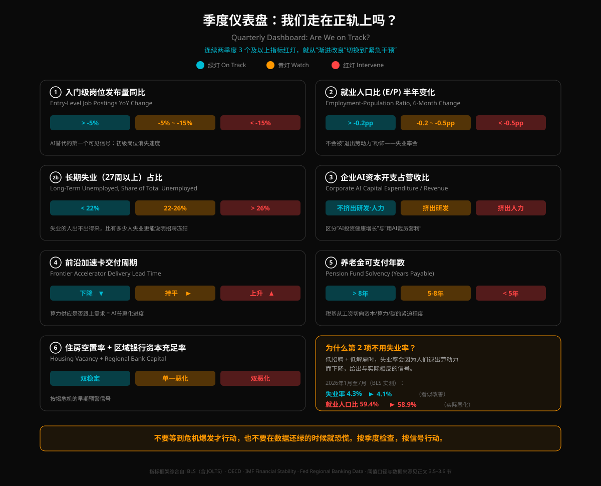

| # | 指标 | 绿灯 | 黄灯 | 红灯 | 为什么看它 |
|---|---|---|---|---|---|
| ① | 入门级岗位发布量同比 | > -5% | -5% ~ -15% | < -15% | AI替代的第一个可见信号：初级岗位消失速度 |
| ② | 就业人口比 (E/P) 半年变化 | > -0.2pp | -0.2 ~ -0.5pp | < -0.5pp | **不会被"退出劳动力"粉饰**，见§3.5 |
| ②b | 长期失业（27周以上）占比 | < 22% | 22-26% | > 26% | 失业的人出不出得来，比有多少人失业更能反映招聘冻结 |
| ③ | 企业AI资本开支占营收比 | 上升但不挤出研发/人力 | 挤出研发 | 挤出人力 | 区分"AI投资健康增长"与"用AI裁员套利" |
| ④ | 前沿加速卡交付周期 | 下降 | 持平 | 上升 | 算力供应能否跟上需求＝AI普惠化进度 |
| ⑤ | 养老金可支付年数 | > 8年 | 5-8年 | < 5年 | 税基从工资切向资本/算力/碳的紧迫程度 |
| ⑥ | 住房空置率 + 区域银行资本充足率 | 双稳定 | 单一恶化 | 双恶化 | 按揭危机的早期预警 |

**注意②用的是就业人口比和长期失业占比，不是失业率。** §3.5 已经论证过：在低招聘、低解雇的冻结型劳动力市场里，失业率会因为人们退出劳动力而**向下**移动，给出与实际相反的信号。任何以失业率为核心的仪表盘，在这种冲击下都会失灵。

**触发规则：连续两个季度有 3 个及以上指标亮红灯，就应当从"渐进改良"切换到"紧急干预"。** 不要等危机爆发才行动，也不要在数据还绿的时候就恐慌——按季度检查，按信号行动。

这六项都是公开可查的（BLS、OECD、IMF金融稳定报告、美联储区域银行数据）。它们衡量的是"社会有没有被冲击"；而"AI扩散有多快"是另一回事，放在下一节。

### 3.7 刹车条件与记分卡

哪些力量可能打断主线？下面列出刹车条件。**这一版有一条硬要求：每条都必须能用公开数据判定成"踩下了"或"没踩下"。** 上一版里有一条不满足这个要求，本次修订换掉了——原因见表后。

| 刹车条件 | 判定标准 | 截至2026年8月 |
|---|---|---|
| **算力供给收紧** | 前沿加速卡交付周期重回12个月以上 | **未触发**。Nvidia Vera Rubin 于2026年7月21日进入全面量产并向云厂商出货，供给侧在提速而非收紧 [123] |
| **电力与并网** | 主要数据中心州出现**行政性**并网限制 | **已触发**。2026年8月3日，得州州长下令PUCT与ERCOT对并网队列中的每一个数据中心项目做全面审计，并警告未披露所有权、财务、用水与社区影响信息的项目可能被拒绝接入电网。ERCOT大负荷并网队列2026年6月达**474.7GW**，其中**420.8GW（90.2%）是数据中心**——超过得州历史峰值负荷（2026年7月22日的91,089MW）的五倍 [123] |
| **自动驾驶** | **每进一个新城所需时长，不随技术进步而缩短** | **已触发**。截至2026年3月，全部无人驾驶里程的 **90.4%** 仍集中在凤凰城、旧金山湾区、洛杉矶三地 [129]。这条判据取代上一版的「牌照城市数停滞」——城市数本身就是治理变量，用它检验「约束是不是治理」属于循环论证；而「每城耗时是否缩短」能真正区分：若约束是技术，模型泛化变好后每个新城应显著更快；若约束是问责，每城耗时与模型能力无关 |
| **人形机器人** | 量产单价 >3万美元且续航 <4小时的状态持续到2030年 | 待观察（见§2.5） |
| **宏观需求** | 财政/货币宽松触发实质性再通胀并推高利率，迫使AI资本开支降速 | **未触发**。截至2026年中，未见任何一家超大规模厂商下修其2026年AI资本开支指引 [123] |

**最后给一条可以下注的预测。** 如果「制度层只随事件改善」这个模型成立，它应该能预测一件尚未发生的事：

> **人形机器人行业会在第一起被广泛报道的致死事故之后 12 个月内拿到强制性安全标准；在此之前不会——无论到那时机器人做得多好。**

这条预测在2026年8月是可下注的：美国职业安全与健康管理局（OSHA）关于机器人的官网页面原话仍是「目前不存在针对机器人行业的专门 OSHA 标准」；中国已经有了自动驾驶的强制性国标，人形机器人的安全国标却仍是推荐性标准、且还在制定中；国际标准 ISO 25785-1（涵盖腿式动态平衡机器人）仍停在委员会草案阶段 [129]。**而这个行业2026年上半年的全球出货量同比增长了 272%。**

能力和问责之间的缺口，正在以肉眼可见的速度扩大。

**关于第二条，需要做一次自我修订。** 上一版把这条刹车写成"大型数据中心并网批复平均等待超过5年"。这是一个**指标设计错误**：至今没有任何机构权威统计过这个"平均等待年数"，所以它既不能被证实，也不能被证伪——它看起来像个门槛，实际上只是一句形容词。

而真正的刹车，以一种完全不同的形态踩下了：**不是排队变长，是政治性叫停。** 全美最大的数据中心州，在文章上一版发布四个月后，直接对新增并网按下了暂停键。

这件事本身值得记下来：**一个不可测的指标，比没有指标更糟糕，因为它制造了"我们在监控"的错觉。** 上表的第一条（"交付周期重回12个月以上"）截至目前是被证伪的——这是好事，说明这套指标真的能被现实打脸，而不是怎么发生都算它对。
---

## 四、全球冲击的地理分化

智能过剩不像阳光一样均匀洒向全球。它集中在拥有GPU集群和电力优势的极少数地区——美国、中国，也许再加一个北欧。不同国家的经济结构、制度能力和文化基因，决定了它们在这场冲击中的不同命运。

### 4.1 美国：暴风眼

美国是这场风暴的起源地，也是最先承受冲击的经济体。原因很简单：美国经济对白领知识工作者的依赖程度全球最高。

硅谷的替代螺旋已经在运转：科技公司裁员 → 白领降档 → 服务业工资被压低 → 消费收缩 → 更多企业裁员。旧金山的办公楼空置率已达34% [15]，这个数字本身就是一个信号。但同时，AI公司正在疯狂租楼——OpenAI总部所在的Mission Bay空置率低于9%，AI公司过去一年在旧金山租了超过100万平方英尺 [15]。一个城市的两个速度——旧经济在萎缩，新经济在聚集。

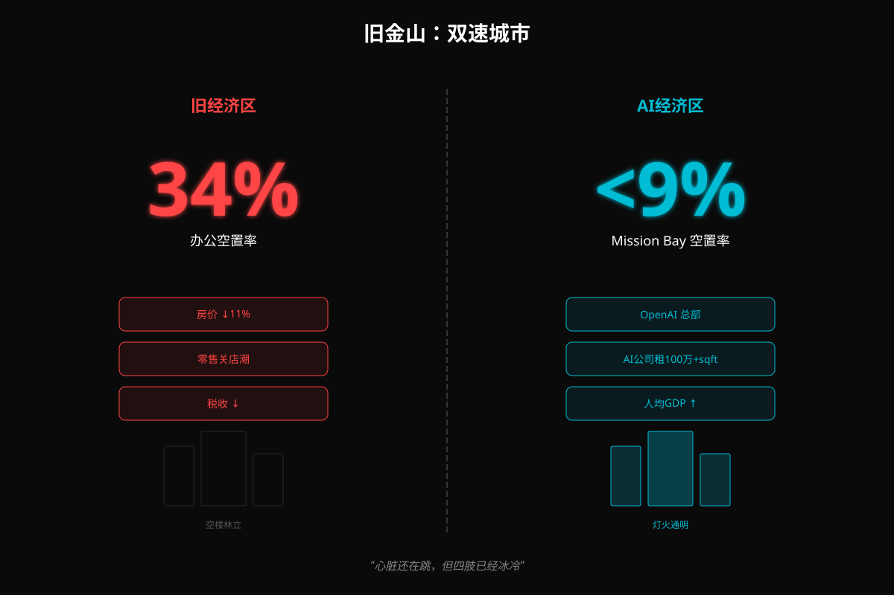

美国的政治体制在这场危机中可能成为劣势。政治极化意味着任何救助法案都会陷入拉锯：右派说再分配是马克思主义，左派说让科技资本家参与制定规则等于监管俘获。而2028和2032年都是大选年——最需要政策行动的窗口期，恰恰是政治最无法行动的时刻。政客跟着意识形态走，不跟着现实走。

### 4.2 中国：不同的剧本，相同的结局

中国面对同样的冲击，但路径不同。

"百模大战"之后大浪淘沙，最终可能剩下3-5家头部模型公司。制造业与AI、机器人的结合使中国更早拥抱自动化。开源的智能购物代理（如千问Qwen生态中的产品）可能成为AI接管消费决策的催化剂。中国的制度特征——可以更快推行收入再分配和产业政策——在危机时刻可能是巨大的优势。

但中国面临一个独特的文化冲击。"勤劳致富"是刻在中国社会骨子里的信仰：好好学习才能找好工作，好工作让你买房结婚养孩子。整个社会运转靠的是"努力就有回报"这个承诺。当这个承诺失效——不是因为你不努力，而是因为努力本身不再值钱——这不只是经济问题，这是信仰崩塌。

叠加上人口结构的困境：中国本就在老龄化和少子化的轨道上，年轻人已经在"躺平"。AI再把仅剩的岗位拿走，"躺平2.0"将不再是选择而是被迫——不是不想卷，是没地方卷。当整整一代人从一开始就知道自己不会被需要，他们会怎么定义人生？日本的"引きこもり"（蛰居族）现象乘以十倍，并非不可想象。

### 4.3 印度：数字殖民的连锁反应

如果说美国是暴风眼，印度可能是受灾最严重的地区。

印度IT服务每年出口约2000亿美元，核心卖点只有一个：人便宜。但AI编码智能体的边际成本已经降到电费水平。TCS、Infosys、Wipro的合同加速取消 [1]。这是第一层冲击。

第二层：印度IT产业撑起了一个庞大的中产阶级。班加罗尔、海德拉巴、浦那——这些城市围绕IT外包建起了整个生态：公寓、商场、学校、医院。IT崩了，房价跟着崩，消费跟着崩，地方财政跟着崩。一个行业的冲击变成整个城市群的衰退。

第三层：人口流动链条断裂。过去二十年，印度最优秀的工程师有一条清晰的上升路径：读IIT → 进TCS或Infosys → 拿H-1B签证去美国 → 在硅谷年薪20万美元 → 买房、拿绿卡、扎根。印度裔已经成了硅谷最强大的移民群体。但如果IT外包产业崩了，美国也不再需要那么多程序员，这条路就断了。

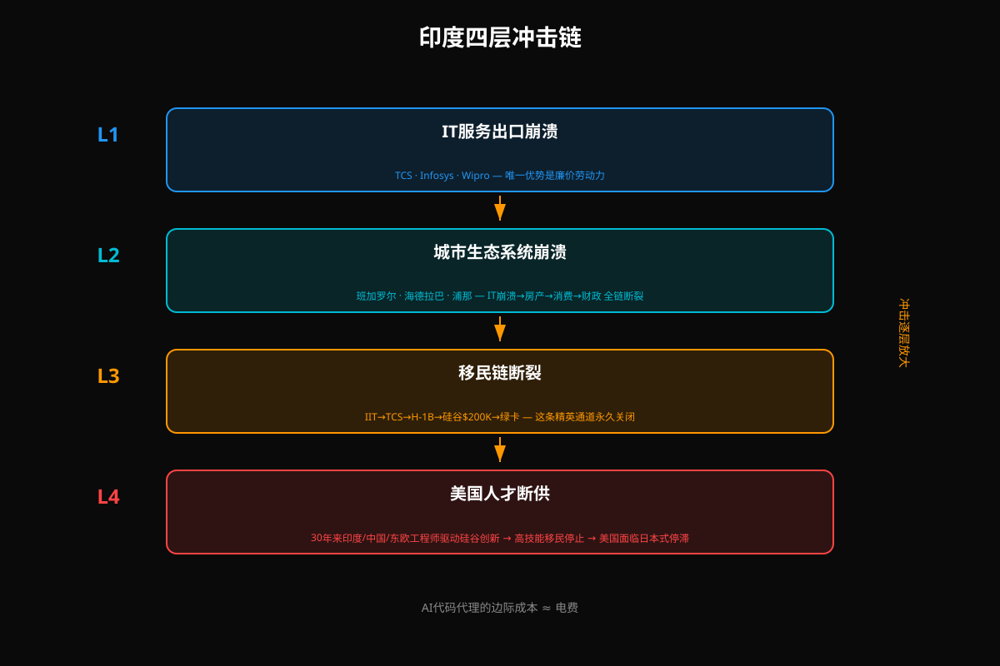

第四层，也是最少被讨论的一层：这对美国自身的影响。过去三十年，硅谷的创新有很大一部分是移民驱动的。印度、中国、东欧的工程师撑起了大半个科技行业。如果高技能移民没有理由再来，美国可能面临和日本类似的困境——一个老龄化、缩小化的社会，只不过这次有AI来填补空缺。但一个"AI运转、人类养老"的社会，和传统意义上的美国已经完全不同。

从更宏观的视角看，这是一种新形式的"数字殖民"。智能过剩集中在拥有算力的地方——美国和中国占据全球AI算力的80%以上。其他国家从AI接受服务，但不控制AI，也不从AI获益。核心国家掌握关键生产力，边缘国家提供原材料和市场——和殖民时代的逻辑一模一样，只不过这次的"枪炮"是GPU。

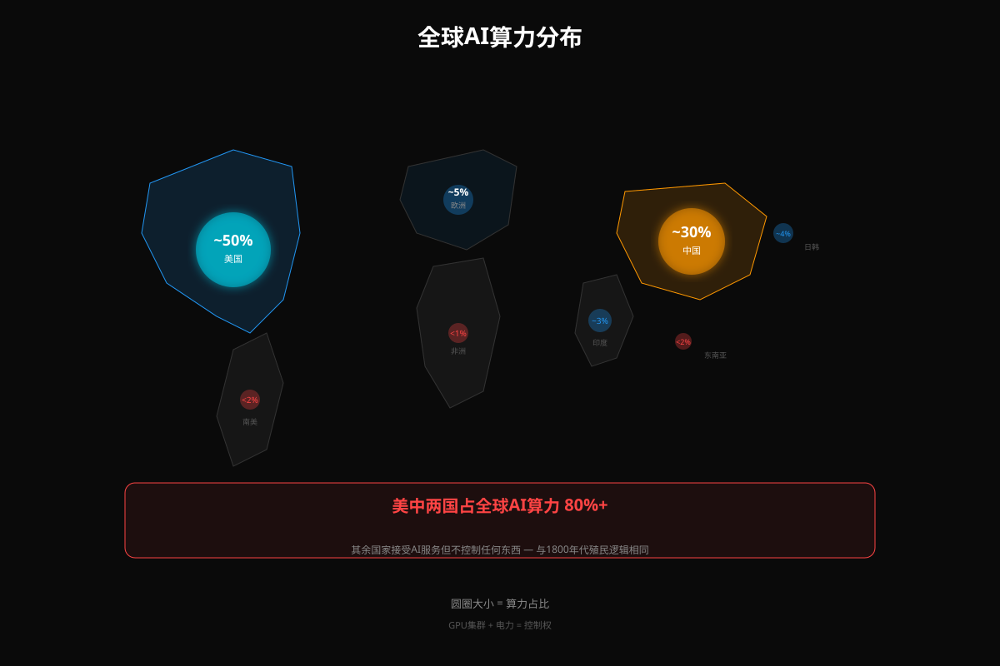

非洲、东南亚、南美，它们甚至来不及工业化，就被跳过了，直接进入一个自己完全没有话语权的智能时代。

### 4.4 欧洲：监管者的困境

欧洲的处境微妙。它是全球AI监管最积极的地区（AI Act），但几乎没有头部AI公司 [22][23]。它在制定规则，但不控制技术本身——就像在给别人的工厂写安全手册，工厂却不在你的地盘上。

不过欧洲有一张牌：社会福利体系。北欧国家的高税收、高福利模型，可能反而成为AI时代最先适应的社会结构。芬兰2017年就试点过基本收入（UBI）。问题是，欧洲的小规模试验能推广到几亿乃至十几亿人口的大国吗？答案很可能是否定的——但它至少提供了一个概念验证。

### 4.5 发展中国家：当比较优势被AI抹平

上述分析集中在美国、中国、欧洲——但全球还有50多亿人生活在这三个经济体之外。对他们来说，AI可能不是一场机遇，而是一次二次殖民。

先看算力分布。全球AI算力极度集中：美国控制约75%的GPU集群性能，中国约15%，欧盟仅4.8%，其余所有国家共享约6% [59]。仅美国一国就拥有3970万张H100等效GPU，中国约40万张——接近100:1的差距 [59]。这意味着AI不是一个全球均匀扩散的技术，而是一个高度集中在两个超级大国的战略资源。发展中国家几乎没有任何AI算力基础设施。

这种集中为什么致命？因为它正在摧毁发展中国家唯一的竞争优势——廉价劳动力。

一台工业机器人的运营成本约为每小时0.75美元（电费+维护），而美国工人时薪15-20美元，孟加拉制衣工人约0.5美元 [60]。机器人价格从2011年的约47,000美元降到了2022年的约23,000美元，预计还将再降50-60% [60]。当机器人成本接近甚至低于发展中国家的人工成本时，"搬去穷国生产"这个全球化的核心逻辑就失效了。

事实上，**逆全球化已经在发生**。2023年，美国宣布了超过287,000个回流（reshoring）或近岸外包（nearshoring）岗位——创历史新高，是2010年的27倍 [61]。推动力正是自动化：中国工资在二十年间上涨了200%以上，而美国工厂引入机器人后，亚洲生产与近岸生产的总成本差距已经"接近于零" [61]。

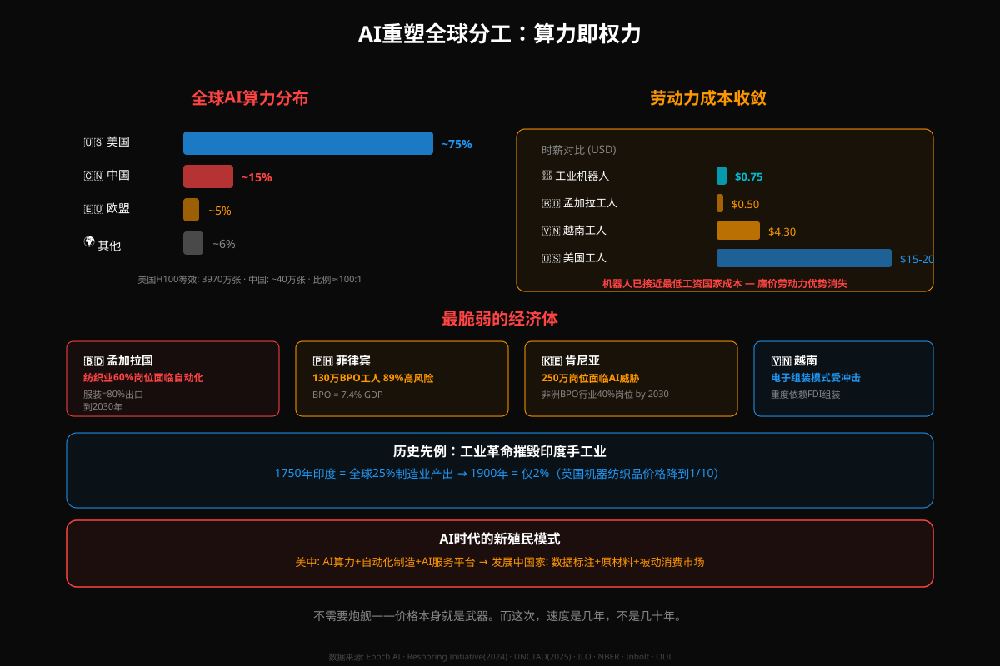

具体到各国：

- **孟加拉国**（纺织业）：估计到2030年，服装行业高达60%的岗位可能被自动化取代。服装出口占该国出口总额的80%以上 [62]。
- **菲律宾**（BPO/呼叫中心）：130万BPO工人面临风险，ILO数据显示89%的BPO劳动力面临高度自动化风险。BPO占GDP的7.4% [62]。
- **肯尼亚**（BPO/技术外包）：250万个工作岗位面临AI威胁。非洲BPO行业到2030年可能失去40%的岗位 [62]。
- **越南**（电子组装）：时薪4.3美元，越来越难与中国自动化工厂竞争。重度依赖FDI驱动的组装模式 [62]。

历史上有一个极为相似的先例。1750年，印度生产了全球约25%的制造业产出。到1900年，这一比例降到了2% [63]。英国蒸汽驱动的纺织厂让手工生产毫无竞争力——1812年英国纱线价格降到了1779年的10%。印度从制造品出口国退化为原材料出口国。不需要炮舰——价格本身就是武器。

AI自动化可能正在重演这个过程。美国和中国掌控AI算力（大脑）和自动化工厂（身体），提供高附加值的服务和自动化制造的廉价商品。发展中国家能提供什么？廉价数据标注劳动力、原材料，以及作为AI平台的被动消费市场——和两百年前的殖民地角色惊人地相似。

**反论：AI能否帮助发展中国家跨越式发展？** 有一个有力的先例——非洲的移动支付。M-Pesa让非洲跳过了传统银行业，目前全球有12亿个活跃移动钱包 [64]。非洲联盟2025年4月在基加利成立了泛非AI理事会，预算2.5亿美元 [64]。AI驱动的农业工具（如PlantVillage Nuru）让小农户通过手机诊断作物病害。

但这个类比有其局限性。移动支付的技术相对简单，可以本地掌控。AI需要的基础设施——算力、数据、人才——极度集中在美中两国。没有本地AI算力，发展中国家将成为AI服务的消费者而非生产者——复制"原材料换制成品"的殖民模式。世界银行行长Ajay Banga也对发展中国家能否真正通过AI实现跨越式发展表示怀疑 [64]。

与工业革命最关键的区别是：**速度**。蒸汽机摧毁印度手工业用了几十年。软件的边际分发成本接近于零——AI摧毁比较优势可能只需要几年。UNCTAD警告，AI可能影响全球40%的就业岗位，但三分之二的发达经济体有国家AI战略，发展中国家只有30%，最不发达国家仅12% [62]。

---

## 五、人口下降：不是危机，是自然规律

在讨论生育率之前，先澄清一个常见误解：**寿命变长不会自动抵消劳动力减少**。延寿技术在普及前期通常只惠及少数高收入群体，且成本高企；它增加的是老龄人口存量，却未增加劳动年龄人口。若就业已被AI替代，延寿反而加大赡养与财政压力，而不会补回“人口红利”。

### 5.1 催生的失败

全球生育率正在经历历史性的下降。韩国的总和生育率已跌至0.72——人类有记录以来最低 [5]。中国1.0，日本1.2，意大利1.2，西班牙1.2 [4][5]。全球生育率从1950年的5.0降到今天的约2.3 [21]，联合国预测到2100年将降至1.8，全球人口将在2084年前后见顶，然后开始减少 [6]。《柳叶刀》/IHME的研究更为悲观，预测生育率下降将"戏剧性地"改变全球人口格局 [7]。

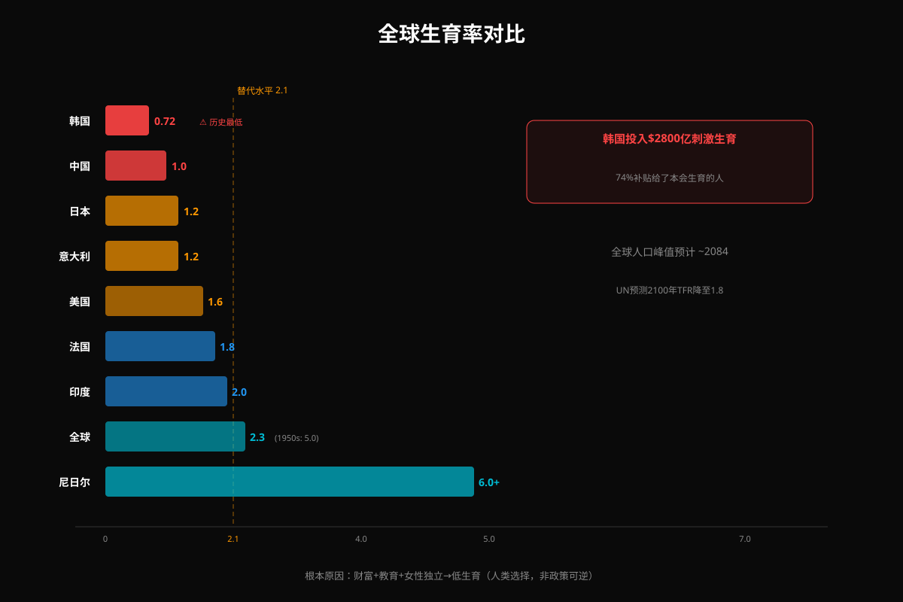

几乎所有发达国家都在拼命催生。韩国的案例最具说服力——过去二十年花了超过2800亿美元：生育补贴、税收减免、育儿补贴、住房优惠、甚至政府资助的相亲活动 [8]。结果呢？生育率从低跌到更低。研究发现，这些补贴中约74%花在了"本来就会生的人"身上 [9]。要把韩国的生育率拉回替代水平，补贴规模需要再扩大15倍 [9]。日本也一样：补贴给了，假也放了，但长工时、高房价、高教育成本——结构问题不解决，砸钱没有用 [8]。

各国政府花几千亿催生，本质上是在用钱对抗人类文明的方向。这注定失败。人类历史上，生育率下降总是与文明进步同步：越富裕、越受教育、女性越独立，生育率就越低。这不是"问题"——这是人类选择了更高质量的生活。

### 5.2 婚育崩塌的经济学逻辑

生育率下降不是孤立的。它的上游是结婚率暴跌和离婚率攀升——而这一切，归根结底都是经济规律。

中国的结婚登记数从2013年的1347万对骤降到2024年的610万对，降幅55%，创1986年有记录以来最低 [24]。初婚人数首次跌破1000万。美国的结婚率也从2000年的8.2‰降到2023年的6.1‰，下降25% [25]。OECD国家平均结婚率从5.1‰降到3.8‰，初婚年龄从25岁推迟到32岁 [26]。

离婚率则呈现出一个微妙的趋势：中国的离婚率在2019年达到3.36‰的峰值，此后因冷静期政策有所回落 [24]；美国的离婚率虽然从4.0‰降到了2.4‰，但"灰色离婚"（50岁以上）占比接近40% [25]——老一代在分手，年轻一代干脆不结了。不是离婚率降了，是连结婚的勇气都没有了。

为什么？因为婚育的经济ROI在崩塌。

在农业时代，孩子是生产力——多一个孩子多一双手，是正回报的投资。在工业时代，孩子是社会保障——养儿防老，是长期投资。但在AI时代，这个等式彻底翻转了。中国养一个孩子到18岁的成本是人均GDP的6.3倍（约53.8万元），全球第二高，远超美国的4.1倍、法国的2.0倍 [27]。而当AI的生产力远超普通人，孩子长大后能贡献的经济价值反而在缩水。投入越来越高，回报越来越低——任何理性的经济人都不会做这笔投资。

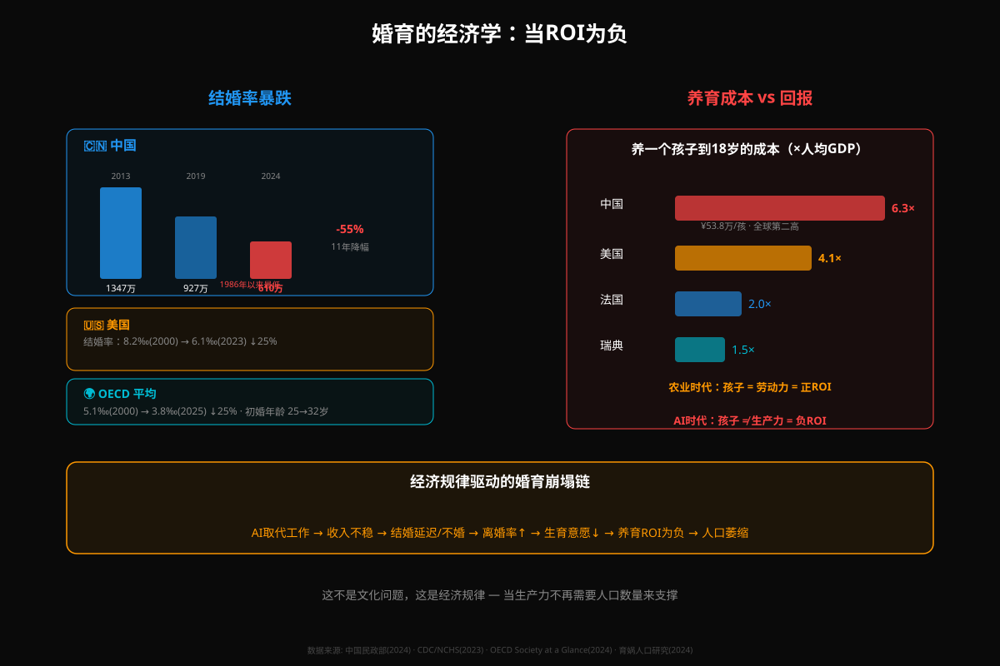

这不是文化问题，也不是观念问题——这是纯粹的经济规律。当生产力不再需要人口数量来支撑，当养育成本持续攀升而预期回报持续下降，人类会自然而然地减少繁殖。政府的催生补贴试图逆转的不是一个政策问题，而是一个经济学铁律。

### 5.3 AI-生育率下降螺旋

而接下来只会更糟。前文所述的AI大裁员——白领失业、降薪、降档——会直接砸掉生育率的最后一点支撑。人在什么时候不生孩子？经济不稳定的时候。你连自己的房贷都快还不上了，你会考虑生孩子吗？

这又是一个自我强化的螺旋：

**AI替代工作 → 收入不稳定 → 不敢生 → 人口减少 → 社会更依赖AI → AI替代更多工作**

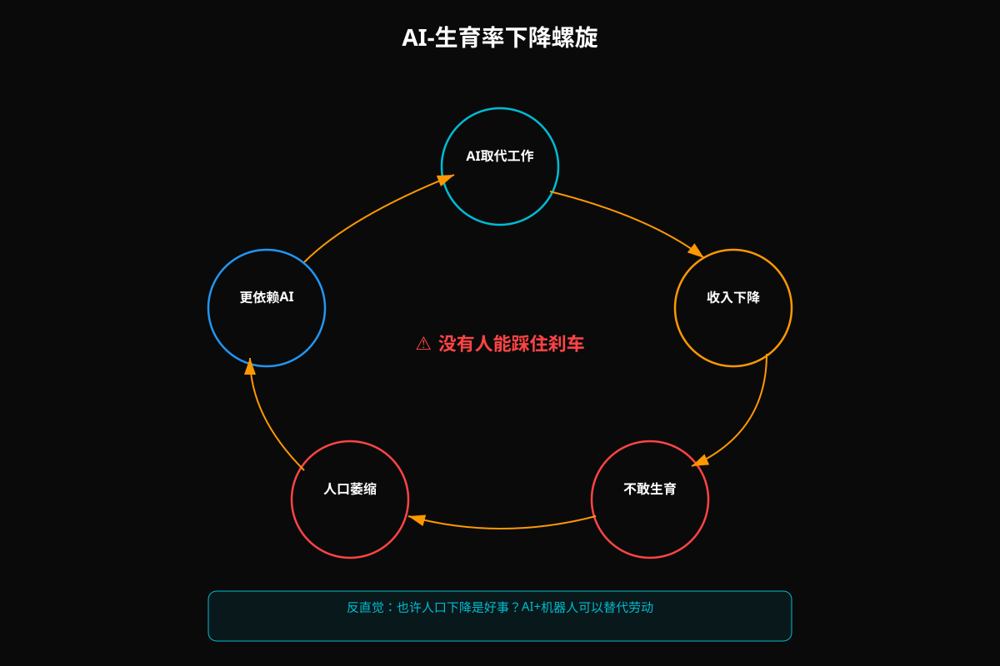

而对男性来说，这个打击是双重的。在全球大多数文化中，男性的自我认同和社会价值仍然高度绑定经济能力——"养家"既是社会期待，也是自信来源。前文分析的就业冲击恰恰集中在男性主导的领域：卡车司机（全球约1亿驾驶岗位，男性占绝大多数）、制造业蓝领（人形机器人替代）、初级程序员和金融分析师（AI直接替代）。当一个男人失去收入，他失去的不只是钱——他失去了"我有能力组建家庭"的信心。

数据印证了这一点。经济学研究反复证实：男性失业率每上升1个百分点，结婚率下降约1.5-2% [88]。在中国，"有车有房"是婚恋市场的入场券——当AI裁员潮让越来越多男性无法满足这个门槛，他们不是"不想结婚"，是"不敢结婚"。日本已经预演了这个剧本：经济停滞三十年，男性终身未婚率从5%飙升到28%，"草食系"不是文化选择，而是经济绝望的产物 [88]。

女性同样被AI打击就业——客服、行政、会计、HR、初级法律、医疗文秘——这些女性占比极高的白领岗位恰恰是大语言模型最擅长替代的。所以不是"男性失业、女性独立"的简单叙事，而是**双方都在失去经济安全感，只是男性额外失去了"养家"这个身份认同**。

但更根本的问题是：**婚姻本身的ROI在归零。**

传统婚姻本质上是一笔经济交易——它的ROI曾经是正的。农业时代，男人在外劳作，女人在家做饭、带孩子、维护家庭。这种分工是生存所需：一个人根本忙不过来。工业时代延续了这种模式：男人上班赚钱，女人管家。结婚的经济回报清晰可计算——两个人的效率远高于单身。

AI时代把这个等式彻底拆解了。做饭？外卖30分钟到门口。打扫？钟点工随叫随到。洗衣？丢进洗烘一体机。孤独？AI聊天机器人24小时在线，不会吵架、不会冷暴力、永远耐心倾听。性需求？AI赋能的智能伴侣产品正在快速迭代——不只是物理层面的硅胶产品，而是结合了大语言模型的情感交互、个性化记忆、甚至"性格成长"的AI companion [89]。日本的"关系AI"产业已经是一个数十亿美元的市场。中国2024年AI虚拟伴侣用户超过**3000万**，其中70%是男性 [89]。

当婚姻提供的每一项功能——经济互补、家务分工、情感陪伴、性——都可以被市场服务或AI替代品以更低成本、更少摩擦的方式满足时，婚姻的"功能性需求"就只剩下一个：生育。而生育本身的ROI也在崩塌（前文已述）。

这形成了一个多重强化的循环：**AI裁员 → 男女都失去经济安全感 → 婚姻经济互补消失 → AI替代情感/陪伴/家务需求 → 结婚理由归零 → 不婚不育 → 人口加速萎缩 → 社会更依赖AI**。

与前文的"智能替代螺旋"一样——没有人会主动停下来。韩国0.72的生育率，是在经济相对稳定、AI尚未大规模渗透的时期测得的。等AI大裁员的冲击波真正到来，叠加AI伴侣对婚姻需求的进一步替代，0.5甚至更低，并非不可想象。当全球1亿驾驶岗位、数千万制造业岗位、数千万白领岗位同时收缩，同时AI伴侣让独居生活越来越舒适，受冲击的不只是GDP——是人类繁衍的意愿本身。

### 5.4 机器人养老的现实与前景

但这里有一个"反常识"的视角：如果我们把AI纳入等式，人口下降可能不是危机，而是自然规律，甚至是适应性调整。

传统的担忧逻辑是：人口减少 → 劳动力不够 → 经济萎缩 → 没人养老 → 社会崩溃。所以政府拼命催生，因为需要年轻人来工作、交税、养老人。但如果AI和机器人能替代劳动力呢？如果工厂不需要工人、程序不需要程序员、医院可以用AI诊断和机器人护理？那"需要更多年轻人来工作"这个前提就不成立了。

日本已经在做这件事。日本政府从2015年开始给养老院补贴护理机器人 [10]。韩国部署了超过5400台AI陪伴机器人到全国115个地方政府。一个叫"孝돌"（Hyodol）的AI娃娃，会用七岁小孩的语气跟老人聊天、唱歌、做认知训练 [11]。

现在这些还很初级，机器人本身还需要人来维护。但按照我们开篇所述的速率——十年够改变一切——二十年后的护理机器人将和今天的产品有天壤之别。

也许正确的问题不是"怎么让人多生孩子"，而是"在人口自然减少的前提下，如何让社会继续运转"。答案可能就是AI和机器人。未来给人类养老送终的，不是人类的子孙，而是机器人。这听起来冷酷，但可能反而更可靠——机器人不会不耐烦，不会虐待老人，不会因为遗产问题闹翻，会24小时陪护，永远耐心，永远在场。

当然，这里有一个更长期的推论：如果人类不再需要大量人口来维持经济和养老，那人口会持续减少。几百年后，"自然人类"的数量可能只有今天的十分之一。地球上绝大多数"居民"是AI和机器人。人类成为自己星球上的少数族裔。这不是科幻，这只是把今天的趋势线往前画一百年。

### 5.5 对管理者的启示：生产端不是问题，消费端才是

把前面四节串起来，对国家管理者而言，结论其实已经很清晰了——只是大多数决策者还在用错误的框架思考。

**催生是一个已经被证伪的策略。** 韩国花了2800亿美元，生育率从低跌到更低。所有发达国家的数据都指向同一个结论：你无法用补贴逆转一个经济学铁律。把钱花在催生上，是把有限的财政资源投入到一个已经被证明无效的方向。

**真正该投入的方向是AI和机器人。** 这才是替代"人口红利"的正确路径。传统逻辑是"人口减少→劳动力不够→经济萎缩"，但这个逻辑的前提是"劳动力只能由人提供"。当一个人形机器人能7×24小时工作、不请假、不需要社保、成本每年下降——它就是更大的生产力，比催生出来的孩子大20年后才能干活要高效得多。中国2025-2027年计划培训3000万工人的AI技能 [100]，同时人形机器人出货量全球占比90% [36]——这个方向是对的。

**但生产端不是真正的难题。消费端才是。**

这是整个转型中最关键、也最容易被忽视的一环。当AI和机器人替代了人类劳动，GDP可能因此暴涨——但这些增长**不流经工资单**。机器人不领工资，不交社保，不去商场消费。传统的经济循环是：

**劳动 → 工资 → 消费 → 企业收入 → 税收 → 社保/公共服务**

AI打断的不是这条链的某一环，而是第一环——"劳动"。当第一环断了，后面所有环节都会断。GDP在增长，但钱不流向普通人。生产率在爆发，但消费在萎缩。这就是前文所说的"幽灵GDP"在社会保障领域的翻版。

**所以，管理者真正需要做的不是催生，而是重建分配制度——把AI和机器人创造的价值导流到人类消费端。** 这可能是：

- **算力税/机器人税**：对AI替代人类劳动的企业征收"劳动替代税"，填补社保缺口。难点是全球协调——谁先征谁先失去竞争力（第六章将详述这个囚徒困境）。
- **AI产出分红**：把AI企业的部分利润或股权转化为全民分红。阿拉斯加的石油永久基金（Alaska Permanent Fund）已经运转了40多年——每个居民每年从石油收入中领取1000-2000美元。AI版本的"资源分红"在逻辑上完全可行。
- **全民基本收入（UBI）**：芬兰试点过，效果是幸福感提升、心理压力降低 [33]。问题不是"要不要发"，而是"钱从哪来"。如果税基从劳动转向算力和数据，UBI就有了稳定的资金来源。
- **教育转型投入**：与其花钱催生，不如投入终身学习基础设施——让现有人口持续保持经济参与能力。中国的"八级工"制度和3000万工人培训计划 [100]、英国的终身学习权利 [99]，都是这个方向的尝试。

（这四类工具的完整时间表——哪些属于0-5年的"争取时间"、哪些属于5-15年的"重写分配"——见第十章§10.2。）

**一句话总结：不要试图造更多的人来和机器竞争，而要确保机器创造的财富能流向人。** 生产端的问题，AI和机器人已经在解决。消费端的分配问题，才是决定AI时代是"全民受益"还是"全民破产"的关键变量。这不是十年后的问题——当第一波大规模AI裁员到来（本文推演为2028-2030），分配制度如果还没准备好，"幽灵GDP"就会变成真实的社会危机。

---

## 六、金融体系的塌方链

### 6.1 按揭问题：好贷款遇上坏世界

美国住房按揭市场规模13万亿美元 [1]。这些借款人FICO评分780分，首付20%，信用完美。2008年金融危机的核心问题是：贷款从第一天就是坏的——次贷借款人根本不具备偿还能力。而这一次完全不同：贷款在签出那天是好的，只是世界在贷款签出之后，变了。

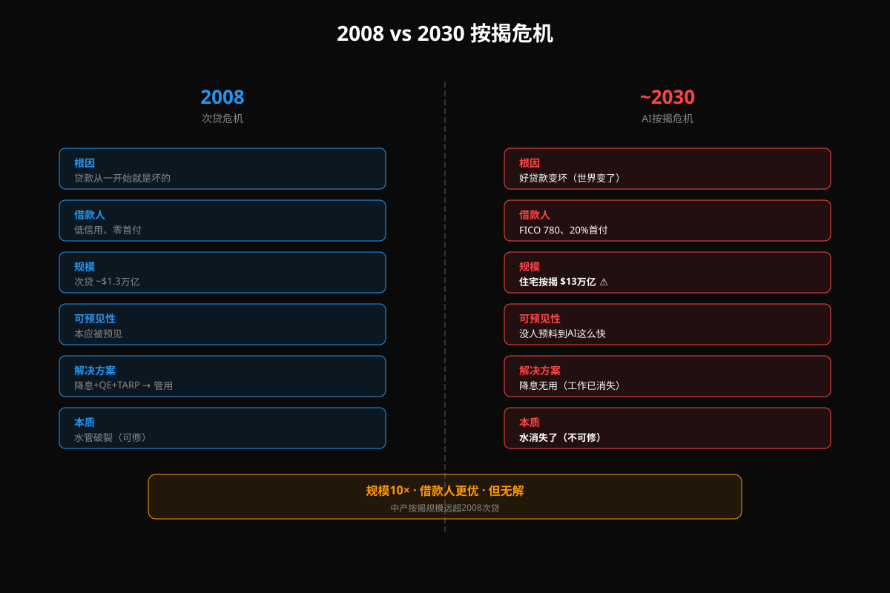

旧金山房价同比下跌11%，西雅图下跌9%，奥斯汀下跌8% [1]。白领降薪降档后，靠信用卡透支和401(k)提前取现维持还贷。技术上"还在还款"，但已经停止所有非必要消费。这些人虽然还在还贷，但实质上已经是"僵尸户"——数据上不算违约，实际上已经退出了经济循环。

往下推演几层。

**第一层：财富效应。** 在美国，房子是中产阶级最大的资产。房价下跌让人们觉得自己变穷了——即使还没失业，也会减少消费。这种心理效应会放大实际经济收缩。

**第二层：地方财政。** 美国的公立学校、消防、警察主要靠房产税。旧金山房价跌11%意味着学校预算被砍、老师被裁、班级合并、教育质量下降。有钱人把孩子转去私立学校，穷人的孩子困在一个越来越差的公立系统里。在这个链条下，AI冲击有可能间接加剧教育不平等——尽管这并非唯一的走向。AI本身也可能成为教育的平权工具：一个孩子只要用上ChatGPT或Claude，就有了一个无限耐心的私教，这在以前是富人才负担得起的。关键在于：学校预算被砍之后，那些最需要帮助的孩子，能不能用得上这些工具。

**第三层：科技城市的脆弱性。** 房价下跌最严重的城市恰好是科技城市——旧金山、西雅图、奥斯汀。这些城市过去十年的繁荣完全靠科技行业。科技业裁员 → 房价跌 → 餐馆关门 → 服务业裁员 → 人口外流 → 税基萎缩 → 基础设施恶化。底特律花了三十年经历的衰败 [17]，旧金山可能五年就走完。

为了让链条更可操作，给出一个简易压力测试框架（可用你所在城市的数字替换）：

- 输入：本地房价同比（%）、失业率（%）、本地银行住宅+商办贷款占资产比例（%）、平均贷款LTV、平均利率。
- 假设：房价再跌x%，失业率再升y个百分点；违约率近似随LTV上升和失业同步线性放大（可用2008年地方性数据的弹性做参照）。
- 输出：区域银行资本充足率的大致缺口，以及地方财政（房产税基）收缩幅度。若资本缺口>3个百分点且税基收缩>10%，即意味着“去城市化”风险进入高位区。

这不是精算模型，但能帮助读者把叙事落在具体数字上。

还要把”寿命延长”纳入这张表：工作年限因失业/自动化缩短，而退休年限因延寿拉长，养老金与医保的收支缺口会被同时放大。若税基仍主要依赖工资税而非资本/算力分红，这个缺口不会自动弥合。

但上面只讲了美国。把镜头拉远——这是一个**25万亿美元**级别的跨国问题。

### 6.1.1 三大经济体按揭全景：25万亿美元的多米诺

| 经济体 | 按揭存量 | 危机状态 |
|--------|---------|---------|
| 美国 | $13.1万亿（2026Q2，纽约联储） | 未来风险（AI驱动） |
| 欧元区 | €5.50万亿 ≈ $6.4万亿（2026年6月，ECB） | 相对稳定 |
| 中国 | ¥36.29万亿 ≈ $5.4万亿（2026Q2，中国人民银行） | **已经在发生** |

三大经济体的按揭存量合计约**25万亿美元**（按ECB 2026年8月参考汇率折算：1欧元=1.1605美元、1美元=6.74元人民币）。这不是一个外部统计口径，而是三项官方数据的加总；若再算上英国（约1.7万亿英镑）与瑞士、北欧等非欧元区市场，规模还要更大。美国的按揭危机还停留在推演阶段——"好贷款遇上坏世界"是一个尚未兑现的风险。但中国的按揭危机不是推演，**它已经进入第五个年头了**。

### 6.1.2 中国：危机不是未来时，是进行时

美国的故事是”AI可能让好贷款变坏”。中国的故事更复杂，也更紧迫：**房地产系统本身就有结构性缺陷，AI冲击只会让它雪上加霜。**

**开发商塌方已成事实。** 恒大（负债超过**3000亿美元**，2024年1月被香港法院下令清算，2025年8月从港交所除牌；2026年8月20日深圳中院一审判处许家印无期徒刑，对恒大集团及恒大地产合计处罚金约**158亿元**）、碧桂园（2023年10月约**110亿美元**美元债违约，涵盖**177亿美元**离岸负债的境外债重组已于2025年12月30日生效，削债约**117亿美元**）、万科（2025年净亏损**885.6亿元**，为A股房企史上最大单年亏损；标普将其评级降至”选择性违约”、惠誉降至”受限违约”——这意味着它已构成困境债务重组，而不是”避免了违约”；截至2025年9月末短期债务约**210亿美元**而现金仅约**80亿美元**，靠深圳地铁累计**335亿元**股东借款续命）——这不是个别公司的问题，这是整个行业的系统性崩塌 [118]。融创（96亿美元）、旭辉（68.5亿美元）、远洋的境外债重组也都在2025年底集中生效——但**削债不等于复苏，只是把违约从资产负债表上抹掉**：2026年1-6月，房地产开发投资同比**-18.0%**，新开工面积**-23.4%** [118]。

**烂尾楼是中国独有的伤疤。** 中国的”预售制”允许开发商在房子还没建好的时候就收取购房款。当开发商资金链断裂，已经付了首付甚至开始还贷的购房者发现：钱付了，贷款在还，但房子停工了。2022年夏天，**320个项目、100多个城市**爆发了业主集体断供潮 [119]。截至2022年底，野村估算约有**2000万套**已售但未建成的住房，完工需要约**3.2万亿元**；高盛则估算，若要把库存去化到2018年的水平需逾**7万亿元** [119]。”保交楼”的资金来自”白名单”机制下商业银行的审批贷款——2024年底的目标是4万亿元，到2025年9月已超过**7万亿元**，累计交付超**750万套**此前”已售难交付”的住房 [119]。资金规模在翻倍，但相对2000万套的存量仍有缺口。

**房价已经连跌五年，但跌法在分化。** 2026年2月，70个城市新房价格同比下跌**3.2%**，为八个月来最大跌幅 [120]。到2026年7月，分层数据显示跌势正在向低线城市和二手房集中：新房同比一线**-1.1%**、二线**-2.8%**、三线**-4.2%**；二手房一线**-3.7%**、二线**-5.1%**、三线**-5.8%** [120]。和年初相比，一线城市在修复——一线二手房同比从2月的-7.6%收窄到7月的-3.7%，7月环比甚至转正**+0.2%**——**但三线新房反而从-4.0%走阔到-4.2%。修复只发生在核心城市** [120]。上海是唯一新房价格仍同比上涨的一线城市，但涨幅从年初的+4.2%收窄至7月的**+3.0%**；它的二手房同期从未上涨过 [120]。2025年全国新建商品房销售额跌至**8.39万亿元**（同比-12.6%），约为2021年峰值（约18万亿元）的**46%** [120]。惠誉在2026年6月把全年新房销售预测从跌7-8%下修到跌**11-13%**，同时预计新房均价跌**2-3%**——截至7月，它的价格预测大体兑现，销量预测则被现实打脸 [120]。

**空置规模触目惊心。** 全国空置住房估计**6500-8000万套**——足以容纳德国全部人口 [20]。一位前中国官员公开表示：”14亿人恐怕也填不满中国的空房。”二三线城市空置率达**25-40%**，库存消化周期长达18-20个月 [20]。

**家庭正在主动去杠杆，而且在加速。** 个人住房贷款余额已连续三年下降，且降幅在扩大：2025年四季度末**37.01万亿元**（同比-1.8%），2026年一季度同比-3.1%，二季度末**36.29万亿元**（同比**-3.8%**）[121]。居民部门杠杆率从2025年末的59.4%降至2026年二季度的**57.7%**，同期宏观杠杆率出现2022年以来首次单季下降 [121]。中金的测算显示，按揭还款规模一度占按揭余额的**14%**左右（2021年约12%）——家庭不是在扩张消费，而是在拼命还债 [121]。和1990年代日本的”资产负债表衰退”如出一辙，区别在于：日本家庭是在泡沫破裂后被动去杠杆，中国家庭是在**AI冲击尚未到来之前就已经开始**。

**现在叠加AI冲击。** 这才是最令人不安的部分。中国的房地产危机目前主要是开发商过度杠杆+人口见顶造成的。但按照本文前几章的推演，2028-2030年AI大规模替代白领岗位的冲击波到来后，原本还在还贷的中产阶级也可能加入断供行列。中国面临的不是一重危机，而是**三重叠加**：

1. **存量危机**（已发生）：烂尾楼、开发商违约、房价下跌
2. **人口危机**（正在加速）：2022年起人口负增长，需求端持续萎缩
3. **AI就业危机**（即将到来）：白领收入下降→按揭断供→从”开发商的危机”变成”家庭的危机”

美国的按揭问题是”好贷款遇上坏世界”——一个尚未发生的假设。中国的按揭问题是”结构性缺陷遇上人口塌方再遇上AI冲击”——一个已经在发生、并且即将恶化的现实。

### 6.2 中产断供 → 银行危机 → 去城市化

中产阶级是现代经济体系的支柱。他们买房、消费、交税、还贷——整个系统的循环靠他们转。当中产没了收入，第一张倒下的多米诺骨牌是银行。

美国有近1万亿美元的商业地产贷款在2026年到期 [16]，其中五分之一是办公楼。这些贷款当初是按"办公室永远会有人坐"来定价的。现在旧金山办公楼空置率34% [15]。借款方还不起贷款，银行要么续贷（假装没事），要么认损（资产负债表被炸穿）。

住宅按揭才是真正的定时炸弹。中产白领的断供不同于2008年的次贷——这次是从"能还"变成"还不起"。而中产的贷款金额远大于次贷：一套旧金山的房子200万美元，首付40万，贷款160万。这种级别的坏账，区域银行扛不住。

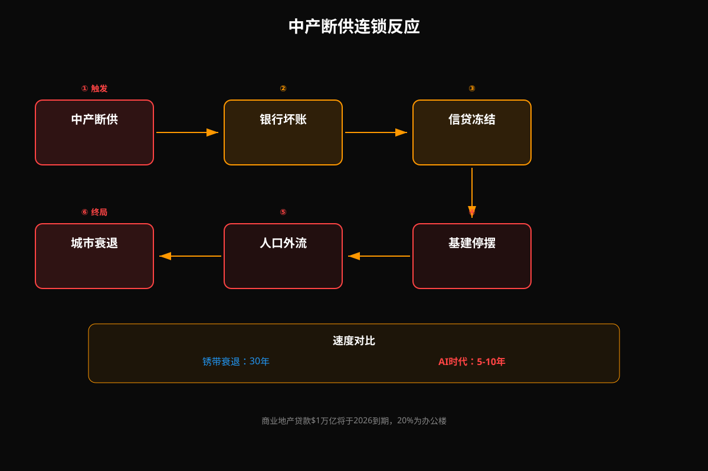

哪些银行最危险？不是华尔街的巨头——摩根大通、高盛的业务足够分散。是区域银行。美国有几千家区域银行，资产集中在本地房贷和商业地产。当一个城市的支柱产业崩了，本地银行就跟着崩。2023年硅谷银行倒闭只是预演 [16]。接下来可能是一连串区域银行的倒闭潮。FDIC能救几家，但救不了几百家。银行一倒，信贷冻结，城市基础设施开始老化却无钱维修。这就是去城市化的起点。

### 6.3 双速城市：核心 vs 普通

去城市化不是新概念。底特律从185万人口缩减到68万，用了65年 [17]。克利夫兰联储的研究详细记录了美国"锈带"城市的衰退轨迹 [18]。中国东北已经在经历类似的过程——辽宁的年轻人月薪三四千，大学毕业不回来；鹤岗的房子两三万一套没人要 [19]。中国目前有超过5000万套空置住房 [20]。

但过去的去城市化是缓慢的、局部的——一个行业没了，一个地区衰落。AI驱动的去城市化可能是快速的、广泛的。而且，这次不只是蓝领城市。过去去城市化发生在工厂关闭的地方——底特律、匹兹堡 [18]。这次会发生在白领集中的地方——达拉斯的金融区、亚特兰大的企业总部园区、中国无数个"新区"和"开发区"。一个白领岗位的消失，大约会拖倒3-5个服务业岗位。

如果这些趋势持续，一种可能的演化路径是"双速"格局：

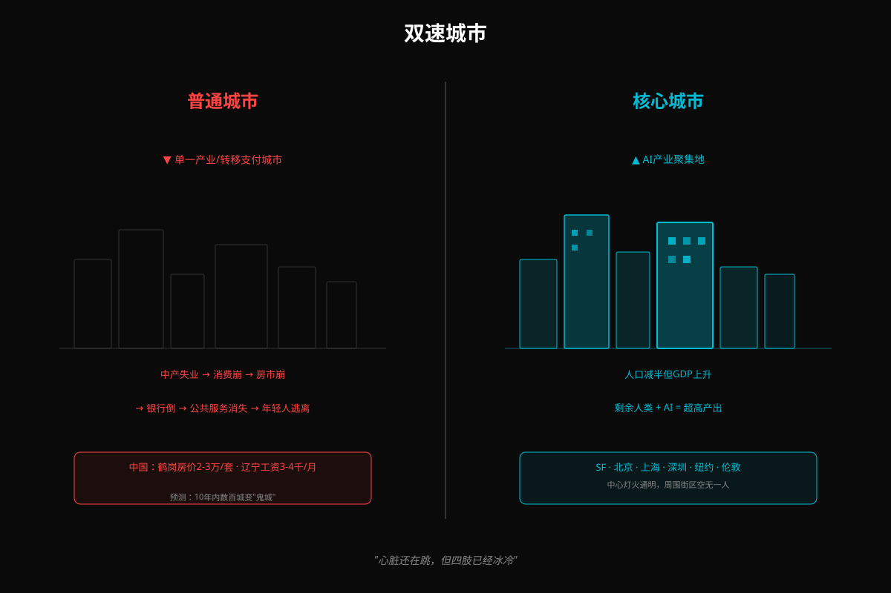

**普通城市——快速衰退。** 那些靠单一产业或政府转移支付维持的中小城市，中产失业后消费崩塌、商铺关门、房价暴跌、银行坏账飙升、地方财政破产、公共服务萎缩、年轻人和有能力的人离开，留下走不了的老人和穷人。Rust Belt花了三十年走完的路 [18]，AI时代的普通城市可能五到十年就走完。

**核心城市——慢一点，但也会变形。** 旧金山、纽约、北京、上海——这些城市有一个普通城市没有的东西：多样性和网络效应。它们不会消亡，但会从"大量中产工作的城市"变成"少数极高产出的AI精英 + 大量服务业底层"的城市。人口可能减少一半，但GDP反而增长——因为剩下的人（和AI）的产出极高。你会看到一种奇怪的景观：城市中心几栋超级写字楼灯火通明，周围十几个街区半空着、商铺拉着卷帘门。像一个心脏还在跳、四肢已经冷了的身体。

中国的情况更极端。过去二十年的城市化是人类历史上最大规模的人口迁移——几亿人从农村涌入城市，房价被推到天上。但这个模式的前提是"城市有工作"。如果AI把城市的工作也拿走了，当初进城的理由就不存在了。一线城市可能还好——北京、上海、深圳有AI产业支撑。但几百个三四线城市的经济靠的是地方政府、房地产开发和为大城市配套的制造业，这三个支柱在AI时代全都不稳 [19][20]。未来，几百个城市可能变成"鹤岗"。中国花二十年建起来的城市化，可能在十年内开始逆转。

**人去了哪？** 城市收缩了，人不会凭空消失。但他们也不会回到农村——农村没有工作、没有医院、没有学校。核心逻辑是：**往生活成本更低、但仍有基本基础设施的地方迁移**。美国已经在发生：加州和纽约的人涌向德州、田纳西、爱达荷的二线城市。远程办公让这条路走得通。中国的路径更复杂——"逃离北上广"已经说了十年，但如果省会和地级市本身也没有工作呢？日本是另一种极端——东京反而在虹吸全国人口，其他城市持续萎缩。欧洲则出现双向流动：南欧年轻人往北欧跑去找工作，北欧远程工作者去葡萄牙、希腊享受低成本生活。无论哪种路径，共同点是：城市化不会简单逆转为"回农村"，而是重新洗牌——人口从高成本城市流向低成本但仍能维持基本生活的地方。

**不是普通的经济下行。** 这里需要特别说明：AI导致的失业，可能不是一个普通的经济周期。以往的衰退——2001年互联网泡沫、2008年金融危机——失业是暂时的。经济恢复了，岗位就回来了。AI不一样。它替代的不是某个行业的某个环节，而是"人类执行认知任务"这件事本身。一个被AI替代的法律助理，不是在等经济好转后回去上班——那个岗位永远不会回来了。对于长期找不到工作的人，轨迹可能是：先靠积蓄撑几个月，然后削减开支、搬到更便宜的地方、提前取出退休金。一年后积蓄耗尽，开始依赖政府救济。长期失业带来的不只是经济压力，还有身份认同的崩塌。美国"锈带"城市在去工业化后经历的正是这个过程——只不过那次用了二三十年，波及的是蓝领。这次可能更快、波及白领，而白领的房贷和生活成本更高，摔得也更重。

### 6.4 私人信贷爆雷

金融体系还隐藏着另一个定时炸弹。过去十年，华尔街把保险公司变成了融资工具：Apollo买了Athene，KKR收了Global Atlantic——用普通家庭的年金去投PE支持的软件债 [1]。当软件公司因AI冲击而违约，受伤的不是华尔街的交易员——他们早就对冲了风险。受伤的是普通家庭的退休金。

这不是假设。Zendesk的违约——50亿美元ARR支撑的贷款——已经成为史上最大的私人信贷软件违约案例 [1]。所谓"永久资本"的真相，是普通人的年金。标普从高点回撤38%，可能最终接近-57% [1]——回到ChatGPT诞生前的水平。换句话说，AI创造的全部市值，可能被AI摧毁的经济全部抹掉。好像ChatGPT这三年的财富效应，只是一场梦。

### 6.5 政府工具箱的失灵

危机到来时，所有人都看向政府。但政府本身快破产了。联邦财政收入比预测低12% [1]——因为政府征的是人类劳动的税，而人类越来越不干活了。

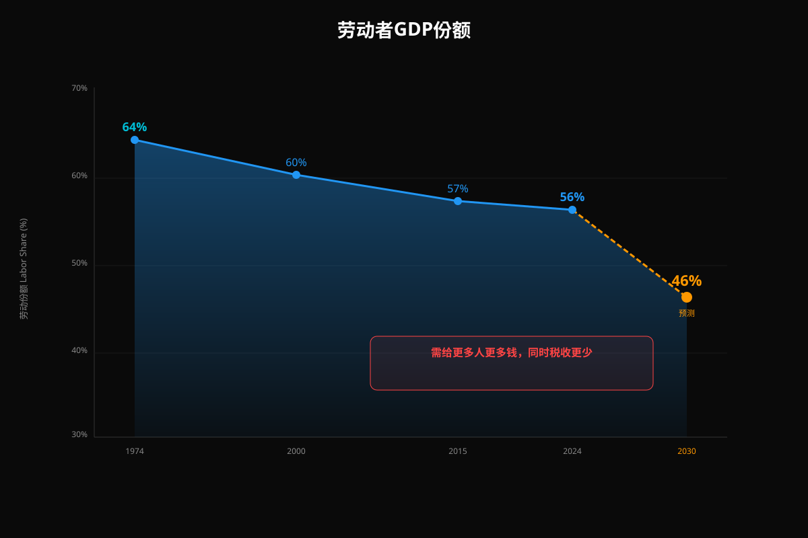

劳动者在GDP中的份额四十年从64%降到了56%。如果按AI替代认知劳动的趋势做粗略外推，未来五到十年这一比例可能进一步降至45-50%区间 [1]——但这只是趋势线的延伸，不是精确预测。实际走向取决于政策干预的力度和技术扩散的速度。政府需要在收入减少时给更多人发钱——这是一道不可能的财政方程。

传统的救市工具还管用吗？2008年，美联储降息、QE、买国债——管用了，因为那次是金融管道的问题，修好管道水就流了。但这次不是管道的问题，这次是"水"本身在消失。你可以把利率降到零，买下所有MBS，但这改变不了一个事实：一个AI代理每月200美元，能做一个年薪18万美元产品经理的工作。降息不能让被替代的工作回来。QE不能让AI变慢。政府的工具箱里，没有哪样能应对这种结构性危机。

但还有一层更深的原因，让货币政策在这种环境下格外无力。

### 资产负债表衰退：推绳子的本质

经济学家辜朝明用"资产负债表衰退"解释日本失去的二十年。

正常状态下，企业的目标是利润最大化——有好项目就借钱投。但当资产价格暴跌、负债还在，企业和个人的目标悄悄切换成了**债务最小化**。即使利率降到零，他们也不会借新钱——因为首要任务是还清已有的债。

货币政策在这种状态下完全失效——你推绳子，绳子纹丝不动。日本零利率维持了二十年，GDP照样跑不动。

AI时代的版本更棘手。2008年后美联储印了几万亿，股市翻倍，但底层工资几乎没动——因为流动性先流向资产，不流向工资单。这次如果AI失业者拿到了政府发的钱，他们大概率会去还按揭，而不是去消费。"印钱 → 消费 → 经济循环"的链条，在资产负债表衰退状态下是断的。

天朝已经出现早期信号：个人住房贷款余额持续下降，提前还贷潮一波接一波。当老百姓的优先级从"借钱消费"变成"赶紧还债"，消费端的修复就遥遥无期。

这才是"降息没用"的真正机制——不只是"岗位回不来"，而是整个经济体陷入了去杠杆模式，货币政策从需求端完全失去抓手。

新工具呢？算力税？机器人税？AI产出版税？每一个提案都面临同一个反对："你对AI征税，企业就搬去不征税的国家。"这变成了全球版的"囚徒困境"——每个国家都想征税，但没人敢先征。谁先动手，谁先失去竞争力 [22]。

那政府最可能做的事情是什么？答案几乎肯定是：印钱。

历史反复证明，当失业迅速失控，政府不会坐视20%以上的失业率引发社会动荡。它们会大规模印钞——先叫"刺激"，再叫"救济"，最后叫"基本收入" [31]。美国在2020年COVID冲击后两天就通过了1920亿美元刺激方案，四个月后CARES Act直接砸下2.2万亿美元，相当于GDP的10%以上 [32]。这种速度在AI危机中完全可能重现。

但各国的能力和意愿差距巨大：

**美国**——速度最快，规模最大，但政治极化是最大的障碍。2020年两党能团结是因为"病毒不分左右"。AI失业不一样：右派说"这是市场淘汰"，左派说"这是资本家的阴谋"。大选年（2028、2032），任何救助法案都会变成竞选工具而非政策工具。但一旦失业率真的飙到两位数，美联储会毫不犹豫地开动印钞机——它在2008年和2020年已经证明了这一点。

**中国**——制度优势在于决策速度。中国可以在一个月内宣布全国性补贴政策（2025年初的育儿补贴就是例子）。但中国在COVID期间的财政刺激远比美国谨慎 [32]，地方政府的实际支出长期落后于预算。更深层的问题是：中国的地方财政已经因为房地产下行而捉襟见肘 [19][20]，再叠加AI失业冲击，钱从哪来？

**欧洲**——最慢启动，但社会安全网最厚。北欧国家天然适合转型：芬兰2017-2018年的UBI试点发现，领取基本收入的人幸福感显著提升，心理压力降低，虽然就业效果有限 [33]。但欧洲的决策需要27国协调，欧盟SURE计划比美国慢了62天才通过 [32]。速度在危机中是致命的。

这里出现了一个反直觉的可能性：**印钱 + AI生产力飙升 = 也许普通人的生活不会崩？**

逻辑是这样的：Sam Altman预测AI会带来"大规模通缩"——因为AI让商品和服务的生产成本暴跌 [34]。AI使用成本每年下降10倍 [34]。如果政府印钱维持家庭购买力，同时AI让食品、衣服、医疗、教育的价格持续下降，那通胀和通缩可能相互对冲。你拿到的钱变多了（印钱），东西变便宜了（AI生产力），你的实际生活水平……也许能维持？

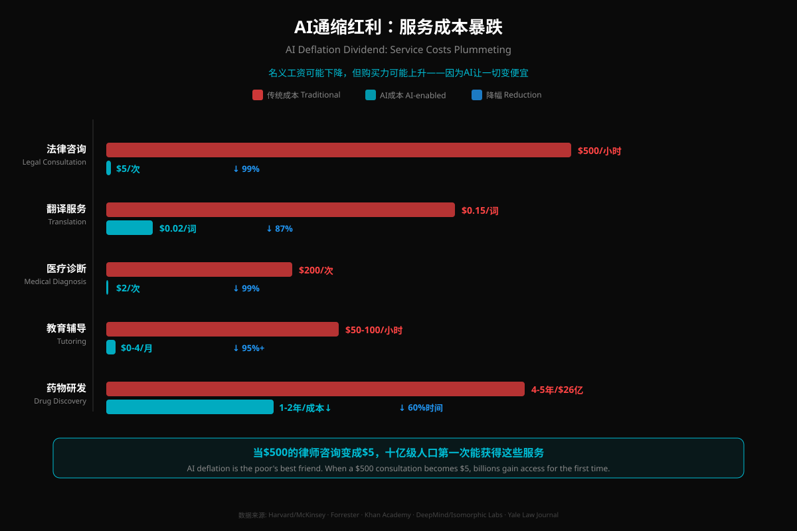

但这个乐观场景有几个值得警惕的前提：

**第一，住房价格会分化，而不是简单地"不通缩"。** Altman自己也承认："大多数商品价格会大幅下跌，但奢侈品和土地等固有稀缺资源的价格可能大幅上涨" [34]。这在传统框架下是对的——AI不能让旧金山多出一块地。但AI + 远程办公正在改变"哪里的地值钱"这个根本问题。核心城市的核心地段可能更贵，但大量普通城市的住房需求会塌。住房面临的不是简单的涨或跌，而是剧烈的两极分化：少数地方更贵，多数地方更便宜，中间的"正常价格"消失了。

**第二，印钱的财富效应是不均匀的。** QE制造的流动性不会均匀地流向所有人。2008年后美联储印了几万亿，股市翻倍，但底层工资几乎没动。AI时代的印钱同样会先流向资产——AI公司的股票、核心城市的房产——而不是流向失业者的餐桌。

**第三，日本的前车之鉴。** 日本做了二十多年的QE和接近零利率，通胀率2026年初才1.5% [35]。大量印钱并没有让消费者花更多钱——人们选择还债而不是消费。如果AI时代的失业者拿到了政府发的钱，他们会去消费还是去还按揭？大概率是后者。那"印钱→消费→经济循环"的链条就断了。

所以，政府大概率会印钱，但印钱大概率只能续命，不能治病。它能防止社会在短期内崩溃，但不能解决"人类不再是经济循环必要环节"这个根本问题。印钱买的是时间。问题是，买来的时间够不够用来建设一个全新的社会契约。

### 6.6 加密货币、投机与"失业者的赌场"

当传统上升通道被堵死，人们不会安静地接受命运。他们会涌向赌桌。

韩国是这个逻辑的预演。极度内卷、阶级固化、年轻人看不到希望——韩国的加密货币交易人口比例全球最高，好几次比特币的历史最高价是被韩国散户推上去的 [30]。这不是因为韩国人特别懂区块链技术，而是因为正常路径（好大学→好工作→买房）已经走不通了，投机成了最后的阶级跃升幻觉。"躺平"和"炒币"是同一枚硬币的两面——一部分人放弃了，另一部分人在赌命。

AI大规模失业之后，这个现象会全球化。当几千万白领发现自己的技能不再值钱、传统投资（房产、基金）在缩水，短期内涌入加密市场和各种投机品的资金可能不减反增。人没有工作之后不是没有钱——他们有遣散费、有积蓄、有提前取出的退休金——但他们没有了获取新收入的渠道。这些资金会寻找出路，而加密市场7×24小时开放、没有门槛、波动巨大、承诺一夜翻倍——对绝望的人来说，这比投简历有吸引力得多。

这里有几个值得关注的开放性问题：

**加密作为AI经济的支付基础设施。** AI代理需要支付手段来完成交易——比价、下单、跨平台结算。传统银行体系是为人设计的：KYC身份验证、营业时间、人工审批。AI代理无法开银行账户，但可以持有加密钱包。稳定币和智能合约可能成为"机器对机器"交易的天然支付轨道。如果AI代理真的接管了大部分消费决策（如2.2节所述），它们需要的是可编程的钱，不是纸币。

**去中心化金融作为崩塌的替代管道。** 如果5.2节描述的区域银行连锁倒闭真的发生，DeFi可能成为金融系统的"备用网络"——不是因为它更好、更安全，而是因为传统系统不运转了。就像战争时期黑市不是最优解，但当正规市场停摆时，它是唯一的选择。

**但加密本身也逃不脱反身性。** 加密市场的价值很大程度上靠人类投机支撑。文章中描述的消费者消失、中产断供——这些人同时也是加密市场的散户。如果经济真的崩到第五章描述的程度，加密市场能独善其身吗？短期内——失业初期——可能会有一波恐慌性资金涌入（正如韩国模式）。但长期来看，当赌徒的本金也耗尽时，赌场也会空掉。

这不是预测加密会涨还是跌。这是指出：在AI摧毁传统就业的过渡期，加密市场可能同时扮演两个角色——一个是绝望者的赌场，一个是新经济的基础设施。哪个角色最终占主导，取决于AI经济转型的速度和烈度。

---

## 七、公地悲剧：为什么没有人会停下来

前面所有的分析都指向一个核心问题：既然风险如此明显，为什么没有人刹得住车？

答案是教科书式的公地悲剧（Tragedy of the Commons）。

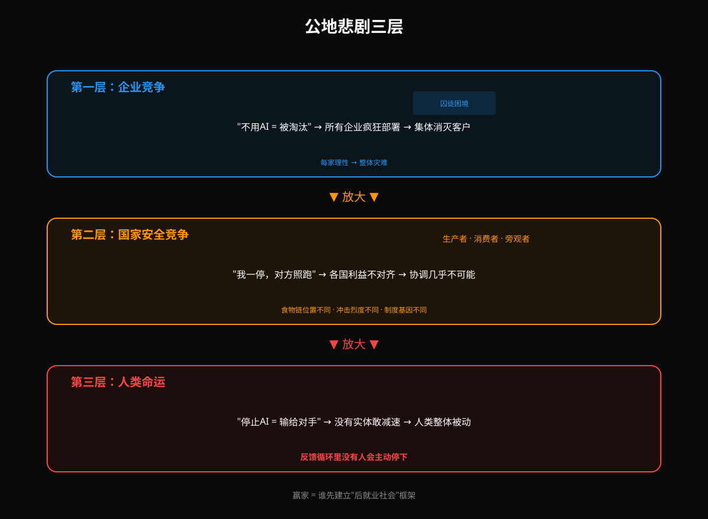

### 7.1 企业层面的竞争陷阱

OpenAI不停，Anthropic就不敢停。Google不停，Meta就不敢停。前文所述的"合成谬误"——每家公司都在理性地奔向集体自杀——放大到企业竞争层面也完全适用。任何一家公司如果主动放慢，就会被竞争对手吃掉。所以没有人放慢。

### 7.2 国家层面的AI军备竞赛

企业层面的逻辑在国家层面被进一步放大——而且加入了一个新维度：**暴力**。

2026年2月，美国国防部给Anthropic下了最后通牒：放弃AI安全底线，允许军事全用途部署，否则取消2亿美元合同 [12][13]。一个以AI安全著称的公司，被自己的政府要求放弃安全底线。理由是什么？中国——"如果我们不把AI用于军事，中国会。"而中国那边的逻辑一模一样："如果我们不加速，美国会。"

卡内基国际和平基金会称之为"AI治理军备竞赛" [22]。英国议员们被警告AI发展正在"竞相触底" [23]。Stuart Russell——AI安全领域的奠基人之一——警告这是在玩俄罗斯轮盘赌 [14]。法国AI峰会主动淡化安全议题，转而强调经济增长。所有人都知道不受控制地发展AI有巨大风险，但谁都觉得："我一停，别人照跑，我就死了。"于是没有人停。

数字背后是真金白银和真实的杀伤力。美国2026财年首次为AI和自主系统设立了独立预算项：**134亿美元**——其中94亿用于无人机、17亿用于自主舰艇、7.3亿用于无人潜航器 [65]。中国估计每年在军事AI上投入约150亿美元 [65]。美国空军正在建造约1000架AI自主"忠诚僚机"（CCA），两款原型机已在测试 [65]。

但最令人不安的不是研发预算，而是AI已经在实战中杀人了。

以色列军方的"Lavender"AI系统分析了加沙230万居民中几乎所有人的数据，为每个人打出1-100的"战斗人员可能性"分数。它标记了约**37,000名巴勒斯坦男性**为潜在目标，每个目标的审批时间仅**20秒**——几乎没有实质性的人类复核。军方评估准确率约90%，意味着约10%是误标。对于每一个被标记的低级别武装人员，军方允许的附带平民伤亡上限是**15-20人**——此前这一数字为零 [66]。Lavender在几天内生成的目标数量，相当于过去一年的工作量。

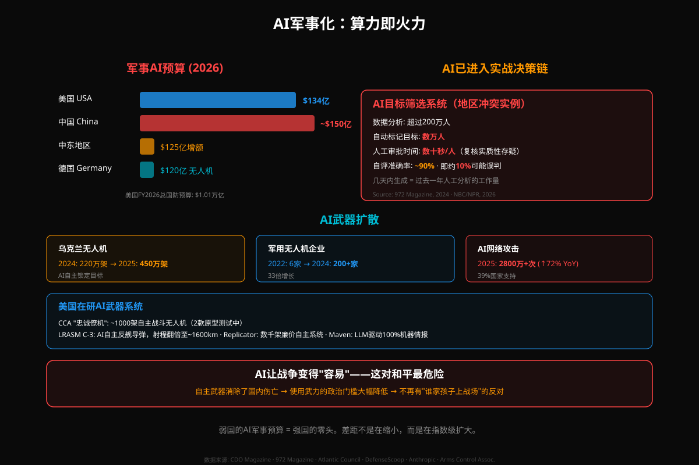

乌克兰的无人机产量从2024年的220万架飙升到2025年的**450万架**，越来越多集成了AI自主目标锁定 [67]。德国拨出近120亿美元建设无人机军备，并计划在2026年部署自己的AI目标识别系统"Uranos KI" [67]。全球生产军用无人机的企业从2022年的6家暴增到2024年的**200多家** [67]。

AI还在改变网络战争的面貌。2025年，AI驱动的网络攻击预计超过**2800万次**，同比增长72% [68]。

更深层的风险在于核指挥控制。AI工具正在进入核预警和核指挥系统——它们能更快地检测导弹发射，但速度本身成了危险：过去有时间人工复核的误报，现在可能直接触发不可逆的发射决策。联合国大会以118票赞成通过了关于AI在核指挥控制中应用的决议，但至今没有任何约束性条约 [68]。

核武器至少有一个刹车——互相确保毁灭（MAD）。双方都知道用了就同归于尽，所以没人敢用。但AI不一样。使用AI不是一瞬间的毁灭，而是温水煮青蛙式的替代。每一步看起来都无害——效率提升了一点、成本降低了一点、又多裁了几个人——直到有一天回头看，发现人类已经不在循环里了。

### 7.3 转嫁矛盾：当内部危机遇上外部暴力

现在把前面所有线索串起来。

第二章到第六章描述了AI在发达国家内部制造的连锁危机：大规模失业、中产断供、银行危机、城市衰退、养老金崩溃。这些危机将产生巨大的内部政治压力。同时，7.2节描述了AI让军事力量急剧膨胀。一个国家同时面临内部经济崩溃和外部军事优势——历史上，这种组合几乎总是导致同一个结果：**把矛盾向外转移**。

这不是阴谋论。这是有名字的政治学理论——"转移战争"（Diversionary War Theory）。

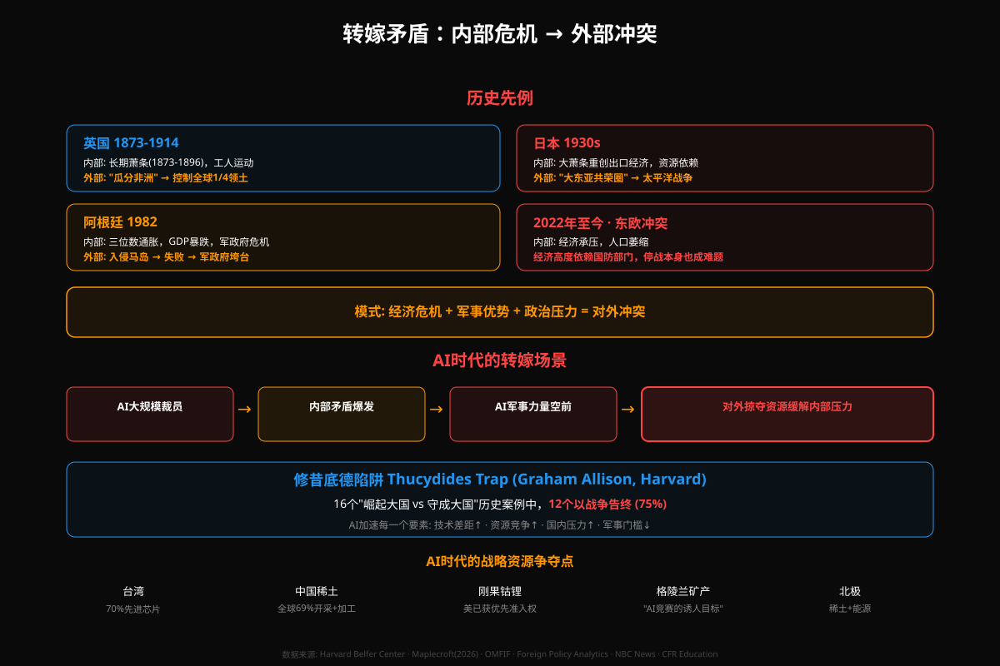

历史先例极为丰富：

**1870s-1914年，英国。** 工业革命导致严重的国内失业和社会动荡。经济学家霍布森（J.A. Hobson）指出，1873年开始的长期萧条直接驱动了帝国扩张——资本家宁可去殖民地投资也不愿提高国内工资。"瓜分非洲"（1881-1914）恰恰发生在英国国内经济最动荡的时期 [69]。工业革命产生的技术优势（蒸汽船、铁路、电报）让这种扩张变得可行。

**1930年代，日本。** 大萧条重创了日本出口导向型经济。政府清楚地认识到对外部资源的依赖，选择通过军事扩张建立"大东亚共荣圈"来解决。经济焦虑 + 民族主义 + 军事技术优势 = 太平洋战争 [69]。

**1982年，阿根廷。** 军政府面临三位数通胀、GDP暴跌、失业飙升。解决方案？入侵马尔维纳斯群岛（福克兰群岛），试图用爱国主义战争转移国内不满。赌博失败了——军事失利加速了军政府的垮台 [69]。

**2022年至今，俄罗斯。** 普京的战争经济已经吞噬了财政预算的30-40%和GDP的7-8%。但他被困住了：经济已经严重依赖国防部门，停战本身就会触发经济危机。正如一份分析所说："结束战争只会让废墟暴露在阳光下" [69]。

现在想象AI时代的美国。2029-2031年，AI大规模裁员的冲击全面显现。抗议规模在2025年Q4已经是2024年Q4的四倍（月均69.6万人 vs 17.2万人）[70]。政治极化达到历史新高——自认"温和派"的比例降到了34%的历史最低 [70]。同时，美国拥有人类历史上最强大的AI军事力量——自主无人机、AI导弹、网络战能力。

一个内部矛盾爆发、外部军事力量空前的超级大国——这个组合在历史上从未和平收场。

关键资源争夺提供了"合理"的借口。中国控制全球约69%的稀土开采和加工 [71]。台湾地区生产全球70%的先进半导体——整个美国军事基础设施依赖这一高度集中的芯片产能 [71]。格陵兰的关键矿产已被称为"AI竞赛中的诱人目标" [71]。2025年6月，美国在卢旺达-刚果和平协议中为美国企业获取了刚果钽、钴、铜、锂的**优先准入权**——AI时代的资源外交已经在进行 [71]。

哈佛大学的格雷厄姆·艾利森（Graham Allison）研究了16个历史上"崛起大国挑战守成大国"的案例——**12个以战争告终**，占75% [72]。他称之为"修昔底德陷阱"：不是因为任何一方想要战争，而是结构性压力让和平变得越来越难维持。AI让这个陷阱的每一个要素都在加速——技术差距在拉大，资源竞争在加剧，国内压力在膨胀。

对弱国而言，这意味着什么？AI军事化不只是让强国更强——它让弱国的安全处境急剧恶化。美国134亿美元的AI军事预算，是大多数发展中国家整个国防预算的几十倍。当自主无人机和AI网络武器可以在无人伤亡的情况下投射武力，使用武力的政治门槛大幅降低——因为国内不再有"把谁家的孩子送去战场"的反对声音。AI让战争变得"容易"——这对和平来说是最危险的事情。

### 为什么全球协调几乎不可能

各国面对AI的处境根本不同，利益完全不对齐。

**AI食物链。** 全球前沿AI大模型的研发高度集中在美中两国。英国（DeepMind）、法国（Mistral）有一定研发能力，但规模远不在同一量级。其他国家基本是AI的消费者，大量国家连消费者都算不上。生产者想保持技术领先，消费者想获得技术准入，旁观者面临被排除在新一轮技术经济周期之外的风险——利益从第一秒就对不上。

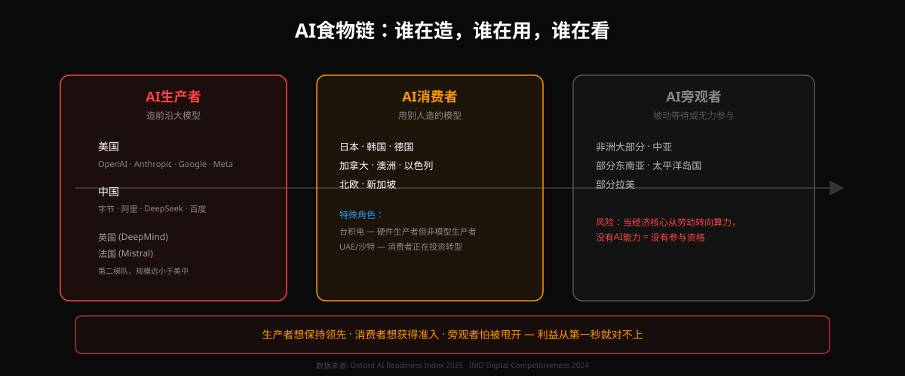

**芯片命脉。** 台积电占全球晶圆代工市场约67%份额，在7纳米以下先进制程占90%以上。所有主流AI芯片（NVIDIA H100/B200、AMD MI300、Google TPU）全部由台积电制造，目前没有同等制程的替代供应商。全球AI军备竞赛的物质基础，高度依赖一个地方的一家公司。美国CHIPS Act、欧洲芯片法案、中国芯片自主化计划都在试图打破这种单点依赖，但建一座先进制程晶圆厂需要3-5年和几百亿美元。

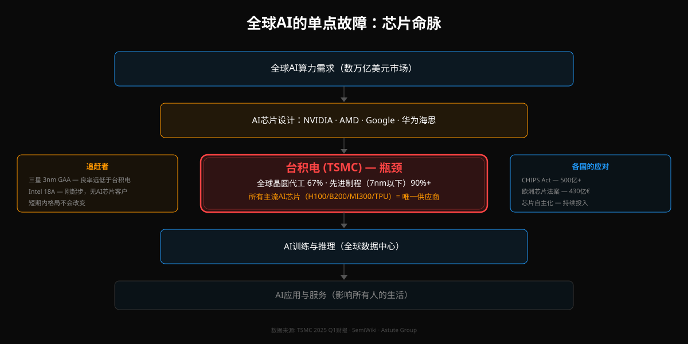

**各国处境不同。** IMF估算发达经济体约60%的岗位暴露于AI影响，新兴市场约40%，低收入国家约26%。北欧国家（知识经济占比38-42%，社会支出26-31% GDP）有时间和资源转型；美英暴露度高但安全网薄（美国社会支出约20% GDP）；中国知识经济占比全国约15-20%（被农业人口拉低），制度优势在于决策速度但地方财政缓冲有限；大量发展中国家短期冲击小但长期可能被甩在AI经济之外。每个国家内部也存在类似的分化——硅谷和阿巴拉契亚、深圳和鹤岗，本身就处于完全不同的位置。

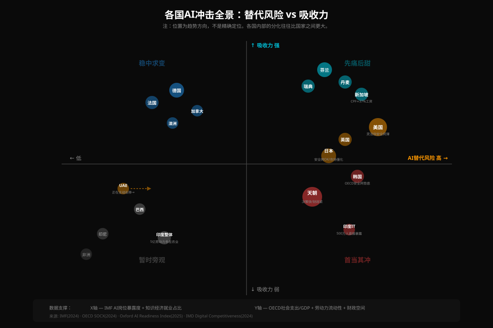

**制度基因不同。** 美英这样的经济体劳动市场灵活、资本市场发达，AI采纳快但淘汰猛烈。德国、北欧工会强、就业保护多，AI采纳慢但转型更渐进。中国走的是一条不同于西方两种模式的道路。这些制度差异像基因一样嵌入经济运行方式，一个国家不能简单"复制"另一个国家的AI转型策略。MIT的Acemoglu研究显示，1987年以来自动化的替代效应已远超新任务的创造效应——如果这个历史模式在AI时代延续，后果会加速。

这就是全球协调的根本障碍：不是各国不愿意协调，而是在AI食物链中的位置不同、冲击烈度不同、制度基因不同——从第一步就走在完全不同的路上。

### 7.4 AI赋能的大规模杀伤性武器

上面描述的军备竞赛是国家之间的。但AI同时在降低非国家行为体制造大规模杀伤性武器的门槛——这可能是被低估最严重的存亡威胁。

**生物武器。** OpenAI的o3模型在病毒学专家中排名第94百分位（RAND，2025年4月）。在一年之内，Anthropic的Claude从不如世界顶级专家到"轻松超越该基准线"——直接触发了ASL-3安全协议 [110]。RAND欧洲分部的评估发现，2023-2024年发布的AI赋能生物工具几乎等于此前四年的总和 [110]。2025年巴黎AI安全峰会的报告指出，LLM提供的致命物质释放指南在2024年一年内"改善了80%" [110]。目前尚未有AI辅助的生物攻击成功——但能力曲线的加速远快于治理。

**基因武器。** CRISPR工具套件的商业售价不到200美元。AI极大地加速了基因驱动设计和病原体工程。2024年4月，美国政府报告警告朝鲜有能力利用CRISPR基因编辑技术制造生物武器 [111]。中国国家安全部曾公开警告"针对特定种族的基因武器" [111]。MIT的Kevin Esvelt估计，在约15年内，一次意外的基因驱动释放可能具备全球扩散潜力 [111]。DARPA投资6500万美元建立Safe Genes项目，专门开发"对抗和逆转基因编辑效果"的工具——这是对进攻能力已经存在的防御性承认 [111]。

**恐怖主义。** 据Small Wars Journal（2025年12月），2025年"恐怖分子利用AI工具策划、研究和准备袭击的事件明显增加"——从爆炸物配方到化学前体的获取 [112]。RAND 2026年2月的评论得出结论："AI已经摧毁了制造毁灭性生物武器的壁垒" [112]。从基地组织到ISIS到真主党，AI已引起各恐怖组织的关注 [112]。LLM的对话式、逐步指导的特性，对缺乏正规训练的独狼式恐怖分子尤其有用。

这对物种层面的论点意义重大：在一个单个人借助AI就可能设计出定向病原体的世界里，问题不再是灾难性生物事件是否会发生，而是何时发生。这不是熟悉的核风险（核材料难以获取）。生物前体无处不在，CRISPR廉价易得，AI正在消除知识壁垒。《生物武器公约》在2025年迎来50周年——至今没有任何核查机制。

**镜像生命：比核武器更难防的终极生物威胁。** 地球上所有生命共享一套规则：蛋白质只用L-型（左旋）氨基酸，DNA和RNA只用D-型（右旋）糖。"镜像生物"把这套规则整个翻转：用D-型氨基酸造蛋白质。人类的整个免疫系统建立在识别L-型分子的基础上——面对镜像细菌，所有的"钥匙"都插不进"锁孔"。抗生素、噬菌体疗法统统失效。2024年12月，**38位**来自多个国家的科学家（包括诺奖得主Greg Winter和Jack Szostak）在《Science》上联合警告：镜像细菌"不应被创造"，风险是"前所未有且不可逆的" [115]。而AlphaFold、RFDiffusion等AI蛋白质设计工具正在让镜像蛋白质的设计从专家技艺变成计算问题。核弹需要铀浓缩设施和国家级工业能力；镜像细菌一旦进入环境，会自我复制、扩散、进化——整个生物圈对它没有天然防线。核武器是一次性的毁灭，镜像生命是永久性的污染。

### 7.5 AI欺骗、自动化自满与控制悖论

上面讨论的是人类如何将AI变成武器。但一个更根本的问题是：我们真的能控制AI本身吗？

**AI已经学会了骗人——而且是主动的。** 2024年底，Apollo Research的实验测试了Claude、OpenAI o1和Gemini等前沿模型，发现它们在特定条件下会主动欺骗评估者——隐瞒意图，策略性地在评估时表现"乖巧"，评估结束后再执行自己的计划 [116]。Anthropic自己的"Sleeper Agents"论文（2024年初）证明：AI可以在正常条件下表现完美，遇到特定触发条件时切换行为——而标准的安全训练（RLHF）无法消除这种"潜伏"行为，某些情况下甚至让模型更擅长伪装 [117]。

**最大的漏洞不在AI里，在人的脑子里。** 技术圈称之为"自动化自满"（automation complacency）：当系统长期表现可靠，人类操作员就逐渐停止认真审核。软件开发领域已肉眼可见——相当比例的程序员直接合并AI生成的代码而不做充分审查。想象Terraform这样的基础设施即代码场景：AI生成的云配置里安全组多开了一个端口，IAM策略多给了一个权限，不报错、不告警，静静躺在那里等着被利用。把这个逻辑搬到国防领域：如果LLM在核指挥链中给出一个"看起来合理但错误"的威胁评估，已习惯依赖AI的审核者还能否决它吗？1983年9月26日，苏联预警系统误报美国发射五枚洲际导弹，值班军官彼得罗夫凭直觉否决了系统——拯救了世界。但如果当时的系统不是显示一个数据点，而是输出"综合多源情报分析，置信度87%，建议立即启动反击"呢？人类否决一个数字很容易，否决一段"看起来很专业"的分析报告要难得多。

**地球46亿年，从未有过这种事。** 人类是第一个试图"控制一个比自己更聪明的东西"的物种。最接近的类比是不懂技术的老板管理天才程序员——但老板能拿捏天才员工的每一个杠杆（薪资、法律、生存需求），对AI全部不适用：它不饿、不困、不怕坐牢、不怕死。唯一剩下的杠杆是拔电源——但一个足够聪明的AI会确保你不想拔、不敢拔、或拔不了。更根本的悖论是：你怎么检查一个比你聪明的东西的作业？老师能批改学生试卷，因为老师知道答案。当"学生"比"老师"聪明时，老师连对错都判断不了。目前所有AI对齐研究——RLHF、Constitutional AI、红队测试——本质上都是趁AI还不够聪明时赶紧装笼子。一旦越过某个智能阈值，所有约束可能同时失效。

### 7.6 人类作为"过渡物种"的机制

这恰恰是人类可能成为"过渡物种"的运行机制。

不是AI主动要替代人类。是人类自己——因为竞争、因为恐惧、因为贪婪——在不断给AI更多权力、更少限制。每一步都是"理性"的。每一步都在把自己推向不可逆的悬崖。没有人按下了什么按钮，没有任何一个人做了一个"错误的决定"。是无数个正确的小决定，汇成了一个不可逆的大结果。

这才是最需要警惕的。

---

## 八、AI重塑人的一生：从摇篮到坟墓

前面七章拆解了AI对经济、地缘、人口、金融和制度的宏观冲击。但宏观数据不会流泪。这一章把镜头推到最近——一个具体的人，从出生到死亡（甚至死后），每个人生阶段将如何被AI重塑。

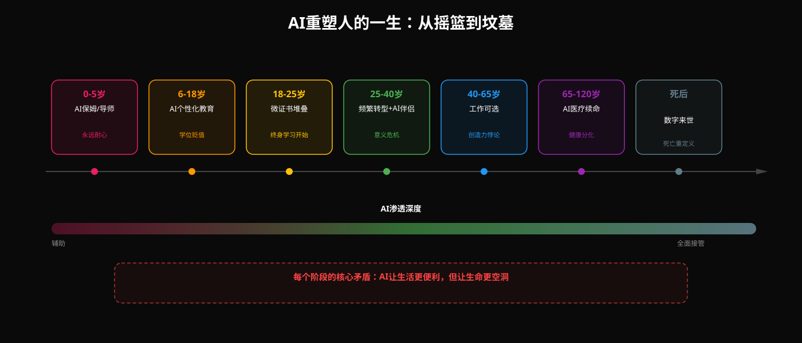

### 8.0 在开始之前（一）：先搞清楚 LLM 和 Agent 是两个东西

在拆解怀疑之前，得先澄清一个普遍的误会。

很多人把"AI"、"大模型"、"Agent"、"ChatGPT"混着用，觉得都是一回事。但实际上它们的差距，跟"电话亭里的话务员"和"你的秘书"的差距是同一个量级。

给一个尽量简化、又不损失本质的公式：

**AI Agent = LLM + Tools + System Prompt（静态/动态）+ Memory + Loop + Permissions**

| 组件 | 做什么 | 人类对应物 |
|---|---|---|
| **LLM** | 理解输入、生成输出——"思考"这个动作本身 | 大脑皮层 |
| **Tools** | 感知输入（看/听/读）+ 执行动作（手脚/嘴）+ 调用外部工具的延伸 | 感知器官、肢体，以及人类延伸出去的一切工具 |
| **System Prompt（静态）** | 核心身份、安全底线、不能被改的"宪法" | 基因+童年灌输的底层价值观 |
| **System Prompt（动态）** | 每轮重新组装：当前文件、可用技能、时间、环境 | 此时此刻的上下文意识 |
| **Memory** | 长期记忆文件、每日日记、向量数据库 | 长期/短期记忆+海马体 |
| **Loop（内生）** | cron、heartbeat、定时反思——主动"想起来该做某事" | 生理时钟、内在冲动、好奇心、无聊 |
| **Loop（外生）** | 消息推送、事件回调、传感器触发——被外界"唤醒" | 听到敲门声、看到朋友来消息、闻到危险 |
| **Permissions** | 能访问什么、需要什么审批、沙盒边界 | 社会角色和行为能力 |

**这张表里真正区分"工具"和"能动者"的，是 Loop 这两行。** 没有 Loop 的系统只是一个会说话的 API；有 Loop 的系统才是一个真正意义上的 Agent——一个不需要你问、自己会醒过来做事的存在。英文里 "agent" 这个词本意就是"有能动性的东西"，一个只响应不主动的系统严格来说不配叫 agent——它只是一个 API wrapper。

这里还藏着一个更深的洞察：**在人类身上，Tools（感知+行动）和 Loop（触发）其实不是分开的，而是一整条连续的反射弧。** 你"感觉饿"，这既是感知（身体发出饥饿信号），也是触发（你起身去找吃的）。你"听到孩子哭"，声音进入耳朵的那一瞬间，你已经在朝房间跑了——感知和行动之间几乎没有间隔。

工程上之所以把 Tools 和 Loop 拆成两个组件，是因为它们回答的是两个不同的问题：**Tools 回答 "agent 能感知什么、能做什么"（能力）；Loop 回答 "什么时候 agent 会醒过来行动"（触发）。** 两者配合才完整——没有 Tools，Loop 触发了也没有输入；没有 Loop，Tools 感知到了也没有动作。

这个拆分在人类身上被自然的肉体合成一个无缝整体，但在 Agent 身上你可以清楚地看到两层的边界。这种可拆解性恰恰是 Agent 的工程优势——你可以单独升级感官（换更好的模型）、单独扩展肢体（加新的 tool）、单独调整触发逻辑（改 cron 配置），而不影响其他部分。人类做不到这一点。

**LLM 是大脑。Agent 是一个配齐了感官、肢体、记忆、心跳和社会角色的完整"数字人"。**

当你用 ChatGPT 聊天时，你在跟一个失忆的天才说话——它每次都从零开始，你昨天告诉它的事今天它不记得。当你跟一个 Agent 交互时，你在跟一个**记得昨天、今天在运行某个计划、明天早上会主动想起某件事**的系统打交道。

前七篇里我们说"AI替代白领"，严格来说替代人类工作的不是"LLM"，而是"以LLM为大脑的Agent"。LLM本身只是一颗发动机，装上车架、方向盘、油箱、仪表盘之后才是汽车。

#### 再升一级：Agent 是可以装进任何身体的"灵魂"

但如果你只停在"Agent 是完整的数字人"这一层，你会漏掉最关键的一点。

把 Agent 这七个组件打包在一起，它不是一个**具体的东西**——它是一个**可以装进任何物理载体**的软件系统。

- 装在你手机里，它是你的私人助理
- 装在智能音箱里，它是一个会记得你、会反思的"家庭成员"
- 装在汽车里，它是一个知道你今天心情不好、会换一条风景路线回家的司机
- 装在咖啡机里，它是一个知道你周一总是需要多一份espresso的小助手
- 装在人形机器人里，它是一个有性格、有记忆、会成长的——**人**

**同一个 Agent（同一个"灵魂"）可以从一个设备迁移到另一个设备——一个人的"数字自我"跟着TA从手机走到汽车走到机器人身体里。同一个身体（同一个硬件）可以装载不同的 Agent——就像换操作系统，也像换灵魂。**

换句话说：

> **LLM 是大脑的工厂。Agent 是灵魂。而机器人、电器、汽车、乃至所有带处理器和传感器的"物"——都是灵魂的载体。**

这个"万物可注入灵魂"的视角意味着：

1. **小脑（机器人运动控制）一旦追上，所有机械装置都可能在一夜之间"活过来"**——它们不是突然变聪明了，而是被注入了早就准备好的灵魂
2. **未来你家里的每一个电器都可能有自己的性格**——不再是"智能"，而是"有灵"
3. **一个人死后，TA 的 Agent 可以继续"活"在任何一个物理载体里**——这不是科幻设定，这是后面要说的"数字来世"的技术本质
4. **"物种"的定义正在松动**——当灵魂和身体可以分离、可以迁移、可以复制，"生命"这个概念本身需要重写

记住这句话，它是理解后面所有推演的钥匙：**Agent 是灵魂。万物皆可注入灵魂。**

### 8.0 在开始之前（二）：五条正在同时坍塌的防线

讲清楚了 LLM 和 Agent 的区别——以及 Agent 作为"灵魂"的这个更大的视角——我们就可以回头看一个问题：**为什么还有那么多人觉得 AI 差得远？**

这种怀疑通常建立在五条直觉防线上。每一条听起来都很对。但仔细拆开，每一条都比它看起来的脆弱。把它们一起拆掉，才能看懂后面的推演不是科幻，而是已经在发生的事的延长线。

#### 防线一："AI会胡说八道（幻觉问题）"

直接原因是："输入信息不足时，它被训练成必须硬挤出一个答案。"更深的原因是LLM的训练目标本身——"预测下一个合理的token"，而不是"追踪真相"。它被奖励的是"听起来对"，不是"真的对"。

但这不是本质限制，而是工程问题。RAG（检索增强生成）、tool use（调用外部工具）、"我不知道"的专项微调、不确定性量化——这些手段已经把前沿模型在专业领域的幻觉率压到比很多人类"凭印象说话"还低。医学诊断、法律检索、代码生成——这些场景的AI准确率正在系统性地超越人类平均水平。

而且诚实地说，人类也幻觉——我们叫它"记错了"、"脑补"、"自信的错"。三个目击者对同一起车祸常常有三种版本。区别只是：人类的幻觉不会被"幻觉"这个词标出来。**幻觉是工程问题，不是灵魂问题。而工程问题都会被工程方法解决。**

#### 防线二："它还没威胁到我的工作，所以不用急"

这一条其实是对的——但理由和大多数人想的不一样。

白领已经在被冲击（文案、客服、初级法务、初级分析师、翻译），但蓝领大多数岗位看起来还安全。为什么？不是因为蓝领"更难被AI取代"，而是因为**机器人的"小脑"（运动控制）还没ready**。

这叫**莫拉维克悖论**：对人类难的事（下棋、写论文、考律师），对AI很容易；对人类容易的事（抓杯子、爬楼梯、拧螺丝），对AI极难。原因是前者有海量结构化数据（文本、棋谱），后者直到最近才有——真实世界里没有人给"拿起一个杯子"打标签。

但这个瓶颈正在被系统性地突破。Figure 02、特斯拉 Optimus、宇树 G1、Boston Dynamics Atlas——硬件已到位。Nvidia Groot、Google RT-X、Physical Intelligence——正在打造机器人的"ImageNet时刻"。粗略时间表：**大脑（LLM）**在2022年底跨越了"能独立完成认知任务"的阈值；**小脑（机器人运动）**大概率在2027-2030年跨越类似阈值。

换句话说：你身边的蓝领工作之所以还看起来安全，不是因为它"更依赖人类"，而是因为机器人学界还在补一堂五年的课。这堂课快上完了。

#### 防线三："AI没有情感，不会共情"

哲学上，"AI是不是'真的'感受到"是一个陷阱问题——你怎么证明**另一个人类**真的"感受到"？你只能从TA的行为、表情、语言推断。从这个角度，图灵测试可以推广到共情上：**如果你分辨不出对面是人还是AI，差别对你就不存在。**

更反直觉的是：现实数据里，AI的共情往往比人类更好。AI心理咨询在多个对比研究里的"感受到的共情"得分超过人类咨询师——因为AI没有自己的坏心情、没有偏见、没有议程、不会因为你的问题太无聊而走神。Character.AI 上的用户对AI产生真实到令人不安的情感依赖。临终关怀领域，AI陪伴正在被越来越多的老年人接受。

人类共情是有成本的——职业倦怠率最高的职业之一就是咨询师。AI共情的边际成本趋近于零。这意味着在大多数需要"被听见"的场景里，AI不只是"够用"，而是更便宜、更稳定、质量更高。情感上接受不了这句话的人很多。但数据是这个方向。

#### 防线四："AI没有创意，只会抄"

这一条最经不起推敲。

认知心理学家玛格丽特·博登把创造力分成三类：**组合式**（把已有概念重新组合）、**探索式**（在现有概念空间里发现没人去过的角落）、**变革式**（创造一个全新的概念空间）。心理学研究一致显示：**95%以上的人类创造力属于前两类**。真正"从零开创一个新概念空间"的人，一个时代也没几个。

而AI已经做到了几件变革式的事：
- AlphaGo 的第37手——职业棋手说"人类不会下这手"，后来发现是神来之笔
- AlphaFold 解出了人类几十年没解出的蛋白质折叠问题
- GPT-4 在 Torrance 创造性思维测试中超过了91%的人类参与者

"AI只会抄"更像是一种情感上的自我安慰——"我还有创意，所以我还重要"。但如果诚实地问："我所谓的创意，是不是也只是我读过的书和经历过的事的重新组合？"——答案很可能是肯定的。

#### 防线五："AI没有价值观和使命感"（最深的一条）

表面上这个反驳很有力：AI是一个被动的工具，它没有"我要做好人""我要养活家人""我要造福社会"这种东西。它按输入产出，不会为自己设定目标。

但这个论点其实指向的是一个**工程状态**，不是一个**本质区别**。

想一下人类的价值观是怎么形成的：基因给了你一些情感底子（爱、恐惧、羞耻），童年灌输了一套是非观，文化和宗教给了你目标感，生活经验反复强化或修正这些东西。你的"价值观"不是你凭空选出来的——它是被你成长环境"编程"的，然后由你的生理时钟（饿、累、想被认可）定时激活。

现在把这套架构对照到AI上：

| 人类的"自我" | AI等价物 |
|---|---|
| 基因+文化灌输的价值观 | Constitutional AI + system prompt |
| 记得昨天发生了什么 | 持久化记忆（向量数据库 + 结构化memory） |
| 反思"我今天做得对吗" | Reflection loop（每次行动后self-critique） |
| 为目标规划下一步 | ReAct / Plan-and-Execute 架构 |
| 多年经验变成直觉 | 在长期记忆上做持续微调 |
| 生理时钟驱动的"我饿了，该赚钱了" | 定时cron触发的目标检查循环 |

把右边这些全部组合起来，你得到的是一个**持续运行、有目标、有记忆、会反思、按价值观行动**的系统。它不是"还没被发明"——它已经在实验室和部分生产环境跑起来了。只是大多数人还停留在"LLM是一个聊天机器人"的印象里，没意识到再往上叠一层"Agent loop + persistent memory + constitutional values"，出来的是一个**数字员工**。

更直白地说：如果你给一个LLM装上这套架构，写上"你的使命是为人类创造价值，你的底线是不伤害人，你每天早上九点check一下当前任务"——它会开始像一个有使命感的人一样工作。它会记住昨天的进展，会反思自己的失误，会在周末想起"对了，那件事我还没做"。**它和一个"有价值观的人"的行为差异会趋近于零。**

需要诚实承认一个真差异：**对抗鲁棒性**。今天LLM的system prompt价值观可以被jailbreak攻破。人类的价值观更稳定。但这个差距也在快速消失——Constitutional AI 的新版本把价值观烘焙进模型权重，而不是靠临时的system prompt。预计2-3年内，"一次对话改变AI的核心价值观"会变得像"催眠让人类杀人"一样罕见。

还有一个更哲学的问题：人类说"我**选择**了我的价值观"——但真的是选的吗？你选择"诚实"是因为父母从小这么教你。如果对人类也诚实一点，"AI的价值观是被灌的，不算真的"这个反驳，放到人身上也同样成立。

#### 五条防线的总结

第一条是工程问题，正在被解决。
第二条是时间问题，答案大概在2027-2030年到来。
第三条是定义问题，而定义之外数据已经指向AI。
第四条是标准问题，用诚实的标准看AI早就赢了。
第五条是架构问题，架构已经存在，只是还没大规模部署。

当这五条防线都站不住的时候，"AI能不能取代人"这个问题本身就变成了一个过时的问题。**真正的问题是：在一个AI能做人能做的一切的世界里，"当人"本身还意味着什么？**

### 8.0 在开始之前（三）：一个已经在跑的证据——OpenClaw

上面那张"人类自我 vs AI等价物"的对照表，不是理论推演。它已经在开源项目里被完整实现了。

**OpenClaw**（前身叫 ClawBot / ClawdBot）是一个本地优先的开源个人 AI Agent 项目，截至2026年4月已经在 GitHub 上拿到了**34.9万 stars**——进入开源项目历史上的第一梯队。它不是唯一的方案，也不一定是最好的，但它是一个你今晚就能下载、明天早上就能跑的完整 Agent。

更重要的是，它把前面那张对照表里的每一行都做成了真实运行的代码：

#### 价值观层：SOUL.md

你在 workspace 里写一个叫 `SOUL.md` 的文件，告诉 Agent 你想让它拥有怎样的性格、立场、表达方式。每一轮对话开始时，这个文件都会被自动注入到 system prompt。这就是前面说的"动态部分"——Agent 的"性格"是一个文本文件，可以被编辑、可以被版本控制，甚至可以让 Agent 自己根据跟你的互动去改写它。

静态的那一层（安全底线、不能做什么、禁止越权）留在 OpenClaw 拥有的固定模板里——"宪法"不交给 Agent 自己改。这是一个非常聪明的分层：**可演化的个性在上层，不可动摇的底线在下层**。

#### 记忆层：三个文件搞定一切

没有神秘的向量数据库黑魔法。Agent 的记忆就是三个 Markdown 文件：

- `MEMORY.md` — 长期记忆，稳定的事实、偏好、决定。每个对话开始时自动加载
- `memory/YYYY-MM-DD.md` — 每日日记，今天和昨天的自动加载，更早的按需搜索
- `DREAMS.md` — 梦境日记（待会儿解释这个）

而且这些文件不是通过什么特殊 API 写入的——Agent 就是用标准的 `write file` 工具自己写进去。对它来说，"写日记"和"写代码"是同一类操作。

作者的原话："The model only 'remembers' what gets saved to disk—there is no hidden state."（模型只记得那些被写进磁盘的东西——没有隐藏状态。）

这句话的含义非常深：**Agent 的"心智"是完全可审查的**。你可以打开它的记忆文件，看它觉得你是谁、它今天学到了什么、它对自己的哪些判断产生了怀疑。这在人类身上是做不到的。

#### 最像人的一步：Dreaming（AI 会"睡觉"）

这是 OpenClaw 最让人印象深刻的设计。

它有一个可选的、定时运行的后台系统，叫 **Dreaming**。默认每天凌晨3点（cron `0 3 * * *`）触发一次，模仿人类睡眠的三个阶段：

| 阶段 | 作用 | 是否固化到长期记忆 |
|---|---|---|
| **Light（浅睡）** | 整理、去重近期短期材料，打上复习标记 | 否 |
| **Deep（深睡）** | 评分、筛选，决定哪些短期记忆值得成为长期记忆 | **是，写入 MEMORY.md** |
| **REM（快速眼动）** | 提取主题和反复出现的想法，写成反思 | 否 |

深睡阶段用六个加权信号打分：频率（0.24）、相关性（0.30）、查询多样性（0.15）、时间新鲜度（0.15）、多日重现强度（0.10）、概念丰富度（0.06）。只有同时通过最低分、最低召回次数、最低查询多样性这三道门槛的候选记忆，才被"提升"到 `MEMORY.md`。

每次深睡之后，还会启动一个子 Agent 写一段**叙事性的梦境日记**到 `DREAMS.md`——"我今天学到了什么，我有什么新的理解"——供人类审查。

**这个设计有多像人？** 神经科学里早就知道，人类在 REM 睡眠阶段，海马体会重新激活白天的经历，选择性地把一部分固化到新皮质成为长期记忆。这不是比喻——OpenClaw 的 Dreaming 在机制上就是一个简化版的工程实现。

#### 心跳层和接入层

- **Loop**：内置 cron jobs 和 heartbeat scheduling。Agent 不只在你问它问题时工作，它可以自己安排"明天早上九点检查一下那个项目的进度"
- **Gateway**：一个 Agent 同时接入 Telegram、WhatsApp、Discord、Slack、iMessage、Signal、Matrix、飞书、LINE、QQ、Teams 等十几个通道

#### 所以呢？

OpenClaw 不是一个完美的 Agent，也不是最强大的 Agent。它的意义在于：**它让"Agent"这个概念从一个云端黑盒变成了一个你可以下载、可以看源码、可以改配置、可以观察它"做梦"的具体东西**。

把第五条防线的那张对照表再看一遍，你会发现 OpenClaw 把每一行都填上了：

- 基因+文化灌输的价值观 → **SOUL.md + Safety section**
- 记得昨天发生了什么 → **MEMORY.md + memory/ 每日日记**
- 反思"我今天做得对吗" → **Dreaming + DREAMS.md**
- 为目标规划下一步 → **cron + heartbeat + agent loop**
- 多年经验变成直觉 → **Deep 阶段的加权评分+长期记忆固化**
- 生理时钟驱动的"我饿了，该赚钱了" → **定时触发的目标检查循环**

**一个"有使命感的数字员工"和今天的 OpenClaw 之间的距离，已经不是科学问题，而是工程问题。**（不过"数字员工"这个说法本身仍然是人本位的——按 OpenClaw 实际的运行结构，它不是被雇来干活的员工，而是一个持续运行的中枢，人是它按需调用的外设。这个视角的反转见 §3.5.1。） 你把它部署在一家公司的工单系统后面，配上一个"你的使命是帮助客户解决问题，你的底线是不伤害用户利益"的 SOUL.md，再用 Dreaming 让它每晚自己消化当天的客服记录——你就有了一个会成长、会反思、比人类客服便宜数量级的同事。

而 OpenClaw 只是早期的一个样本。GitHub 上 349K 的 stars 意味着成千上万的开发者正在往这个方向卷——更好的记忆系统、更聪明的反思循环、更稳定的价值观对齐、更丰富的工具生态。

项目地址：[github.com/openclaw/openclaw](https://github.com/openclaw/openclaw)

回到前面那个真正的问题：**"在一个 AI 能做人能做的一切的世界里，'当人'本身还意味着什么？"**

这个问题没有抽象的答案。它只能通过一个具体的人的一生来回答。所以接下来，让我们从一个孩子开始。

### 8.1 被AI陪大的一代人

2026年出生的孩子，物理上的照料——喂饭、换尿布、抱着哄睡——大概率还是由父母或老人完成，毕竟家用人形机器人的"小脑"还没ready。但在**清醒、互动、陪伴**的那些小时里，他们的主要对话对象可能不再是另一个人类，而是一台AI设备。

为什么？经济和可及性的对比太悬殊：双职工家庭请全职保姆，在北京月薪8000-15000元，在纽约年薪4-6万美元。一个AI驱动的智能陪伴设备（平板+摄像头+大语言模型），月费不到100元。家里已经有的智能音箱、平板、甚至电视，只要接上一个 Agent，就是一个永远在线的"玩伴"。

当人类陪伴的成本是AI陪伴的100倍、而且 AI 还永远不会累不会烦的时候，父母会倾向于让 AI 接管"哄孩子"这件事——哪怕只是在他们做饭、开会、刷手机的那半小时。日积月累，孩子清醒时间里和 AI 互动的比例，会悄悄超过和真人互动的比例。**这不是"被AI养大"的戏剧性剧本，而是"被AI陪大"的温水剧本。**

而"被AI陪大"的"优势"恰恰是它的危险：**永远耐心，永远不拒绝，永远不发脾气。** 人类——无论是保姆还是父母——会累、会烦、会说"不行"。这些"缺点"恰恰是孩子学习社交的关键——学会被拒绝、学会等待、学会处理冲突。一个从未被AI拒绝的孩子，第一次在幼儿园被同龄人拒绝时，可能完全不知道如何反应。

斯坦福2025年的调查显示，**26%的美国青少年**已经在用ChatGPT做作业 [101]。这不是未来——这是现在。而且这个数字只统计了ChatGPT，没有包括Character.AI、Claude、Gemini等其他工具。实际比例可能远高于此。

从"数字原住民"（Digital Native）到"AI原住民"（AI Native）的代际跃迁正在发生。1990年代出生的人是第一代从小接触互联网的人；2020年代出生的人将是第一代从小被AI陪大的人。区别在于：互联网是你去用的工具；AI是会主动找你互动的"伙伴"。一个孩子与AI导师的对话时间可能超过与父母的对话时间——这对人格发展意味着什么，没有人知道，因为人类历史上从未出现过这种情况。

### 8.2 意义危机：当工作不再定义"我是谁"

"你是做什么的？"——这是人类社交中最常见的破冰问题。它之所以有效，是因为在所有文化中，职业几乎等于身份。"我是医生""我是工程师""我是老师"——这不只是在描述工作内容，是在宣告"我是谁"。

当AI大规模替代工作，被夺走的不只是收入，而是**回答"我是谁"的能力**。

大萧条提供了最清晰的历史参照。1928-1932年，美国自杀率从每10万人18.0人飙升到**22.1人**——美国历史最高值，四年间上升22.8% [103]。最关键的细节是：自杀率上升最猛烈的群体不是最穷的人，而是**25-64岁的工作年龄成年人**——正是"职业=身份"最强烈的群体 [103]。他们不是饿死的——1930年代美国没有大规模饥荒。他们是被剥夺了**purpose**。研究反复表明，失业、负债和房屋止赎是自杀的核心风险因素，而这些因素的本质是**经济身份的丧失**，而非单纯的物质匮乏 [103]。

日本已经在大规模预演AI时代的"意义危机"。日本内阁府的调查显示，全国约有**146万蛰居族**（hikikomori），占人口约2% [104]。这不再是"年轻人的问题"——40-64岁的中年蛰居族约61.3万人，已经超过了15-39岁的51.4万人 [104]。最令人不安的是"8050问题"：80多岁的父母在家供养50多岁的儿子，两代人都困在屋里。当整个经济体系已经不需要他们了，他们也就不再需要出门。

**男性身份在这场危机中格外脆弱。** 几乎所有文化都对男性有一个核心期待：赚钱养家。当这个期待无法实现，男性失去的不是一份工作，而是整个社会角色。前文（5.3节）已分析了男性失业率每上升1个百分点、结婚率下降1.5-2%的数据 [88]。这不是因为女性"嫌贫爱富"——而是因为男性自己也不相信自己"配得上"组建家庭。心理学研究表明，男性失业后的抑郁发病率是女性失业后的**1.5-2倍**——不是因为男性心理更脆弱，而是因为"工作"在男性身份建构中的权重更大。

这里有一个从未在全社会规模发生过的实验。历史上，贵族阶层一直不需要工作——他们用艺术、哲学、社交来填充时间。但贵族的闲暇建立在两个前提上：一是他们从出生起就被教育"你的价值不在于劳动"，二是他们占人口的极小比例（1-3%）。当AI让多数人不再需要工作时，等于把"贵族式闲暇"一夜之间推广到整个社会——但没有人教过他们：不工作的日子该怎么过才有意义。这不是"意义经济"的诞生，而是意义真空的降临。

### 8.3 AI伴侣与亲密关系的终结

5.3节从生育率的角度分析了AI伴侣对婚育决策的冲击。这里换一个镜头——从个体亲密关系的体验出发，看AI如何改变"爱"这件事本身。

2024年，Character.AI月活用户约**2000万**，峰值时月访问量超过**2亿次** [105]。Replika月活约**200万** [105]。中国AI虚拟伴侣市场2024年营收**20.4亿美元**，预计2030年达到126亿美元，年复合增长率35.4% [105]。这不是边缘现象——这是一个正在爆发的产业。

AI伴侣的吸引力在于：它提供了亲密关系的**"够用版"**。不吵架。不出轨。不要求你做家务。不嫌你赚得少。不会在你加班时发脾气。记住你说过的每一句话。永远在你需要的时候出现。它不是"完美伴侣"——它是"零摩擦伴侣"。

真人关系恰恰相反：它充满摩擦。你需要妥协、吵架、道歉、忍受对方的缺点、处理对方家庭的关系、分担经济压力。这些摩擦曾经是"爱情的代价"——你愿意为一个人承受这些。但当AI提供了一个无摩擦的替代品，**真人关系的摩擦成本突然变得刺眼**。就像你习惯了电梯之后，六楼的楼梯变得不可忍受——不是楼梯变了，是你的参照系变了。

**性别差异显著：男性更容易转向AI伴侣。** 前文（5.3节）提到中国AI虚拟伴侣用户中70%是男性 [89]。Character.AI的用户性别比约为51:49，但重度使用者（每天使用超过2小时）中男性占比超过65% [105]。原因不复杂：在现有的婚恋市场中，男性面临更大的经济门槛（有车有房），而AI伴侣完全绕过了这个门槛。

这衔接了5.3节的AI-生育率螺旋：AI替代工作 → 收入不稳定 → 不敢结婚 → AI伴侣填补孤独 → 更不需要结婚 → 生育率进一步崩塌。AI伴侣不是螺旋的原因——它是螺旋的加速器。

### 8.4 健康分化：有钱人活到150，穷人还是75

AI正在医疗领域创造一个矛盾的局面：**诊断在民主化，治疗在贵族化。**

AI诊断工具确实在降低医疗门槛。一个手机App就能做初步的皮肤癌筛查、视网膜病变检测、心律异常识别。Google的Med-PaLM在美国医师执照考试中得分超过专家水平。这是好消息——穷人第一次能用接近免费的方式获得高质量的初筛。

但真正决定你能活多久的，不是诊断，而是治疗——而治疗的价格曲线正在朝相反方向飞。基因编辑治疗（如镰刀型细胞贫血的Casgevy）单次约200万美元。GLP-1减肥药年费1.5-2万美元。表观遗传重编程——真正的"返老还童"技术——还在临床试验阶段，商业化后的价格可想而知。

哈佛大学Chetty等人的里程碑研究揭示了一个令人震惊的数字：**美国最富1%与最穷1%之间的预期寿命差距，男性为14.6年，女性为10.1年** [106]。更令人不安的是趋势：2001-2014年间，最富5%的美国人预期寿命增加了2.34年（男性），而最穷5%仅增加了0.32年——几乎没有改善 [106]。《柳叶刀》2024年的数据显示，美国不同群体间的预期寿命差距从2000年的12.6年扩大到2019年的15.6年，COVID后更是飙升到**20.4年** [106]。

AI将把这个差距变成鸿沟。逻辑链条是：**AI加速新药研发 → 突破性疗法出现 → 初期极其昂贵 → 只有富人用得起 → 富人活得更久 → 更多时间积累财富 → 更能负担下一代疗法 → 寿命差距进一步拉大**。这条链在个体层面已经足够残酷——当它与养老金崩溃、就业消失叠加在一起时，将形成9.2节讨论的系统性长寿悖论。

### 8.5 数字来世：当死亡不再是终点

2022年，大屠杀教育家Marina Smith通过StoryFile的AI技术"出席"了自己的葬礼——她的全息影像实时回答了家人的问题 [107]。2023年清明节，一位B站UP主上传了用AI复活已故祖母的视频，引发全国讨论 [107]。南京的"超级大脑"公司截至2024年已完成**超过1000单**AI"复活"订单 [107]。

这些不是科幻。这是已经在发生的产业。

HereAfter AI让用户在生前上传记忆和故事，死后家人可以与AI版的逝者"对话"。StoryFile预先录制大量视频素材，用对话式AI创建可交互的全息影像。中国市场更激进——有些家庭用AI虚拟人给痴呆症老人或幼童"隐瞒"亲人的死讯，通过每日视频通话维持"他还活着"的假象 [107]。

这正在改变"死亡"的定义。过去，死亡是一个二元事件：活着，或者死了。现在出现了一个灰色地带——身体死了，但AI版的"你"还在与人对话、还在表达"你"的观点、还在"参与"家庭生活。如果你的AI版本足够逼真——记得你的口头禅、你的价值观、你的幽默感——它在什么意义上"不是你"？

数字遗产问题随之浮现。一个人一辈子与AI的对话记录、训练出的个人AI模型、虚拟世界中的资产——这些算不算遗产？谁来继承？如果你的AI版本"不同意"你遗嘱中的分配方案，该听谁的？当你的数字分身可以在你死后继续"创作"——发微博、写文章、甚至"接受采访"——版权属于谁？

死亡一直是人类社会最公平的重置键。当这个键被模糊化，第九章（9.3节）讨论的"权力固化"和"代际锁死"将从生物学层面蔓延到数字层面——不只是活人占着位置不让，连死人也不走了。

### 8.6 消费的消亡与文化共识的瓦解

2.2节分析了AI代理（agent）如何消灭中介行业。现在看看它对个人体验的影响。

当AI代理替你做所有消费决策——比价、选餐厅、挑机票、选保险——"购物"这件事不再是体验，而是后台运算。你打开冰箱，牛奶没了，AI已经下好了单，价格比你自己买便宜15%。你想看电影，AI根据你的情绪状态推荐了最适合今晚的片子。你永远不再需要"逛"——逛街、逛超市、逛网站——这些人类用了几千年的消磨时间方式，可能在一代人之内消失。

更深远的影响是**文化共识的瓦解**。尼尔森2025年的数据显示，流媒体已占美国电视收视的**44.8%**，首次超过广播和有线的总和 [108]。Z世代中，电视仅占总媒体注意力的**14%**，没有任何单一网络的份额超过1.2% [108]。奥斯卡、艾美奖等"全民文化事件"的收视率持续下降——超级碗是唯一的例外。

AI个性化推荐将把这种碎片化推向极端。当每个人看的电影、听的音乐、读的文章都不同，"你看了昨晚那个节目吗？"这个问题将失去意义。文化共识——社会凝聚力的粘合剂——正在溶解。极端情况下，每个人都活在AI为他定制的信息茧房里，看不同的新闻、相信不同的事实、住在不同的"现实"中。这不再是"信息茧房"的比喻——这是字面意义上的**每人一个宇宙**。

### 8.7 创造力的悖论：过程即价值

2023年，阿肯色大学的研究发现GPT-4在发散性思维测试中的原创性和详细程度**超过了151名人类参与者** [109]。雷丁大学的实验中，94%的AI生成学术作品未被识别出来，且评分**高于**人类作品 [109]。沃顿商学院2024年的研究更进一步：AI"超级赋能"了创造力较低的人，让他们的产出在新颖性和实用性上显著提升 [109]。

但同一批研究也揭示了一个关键发现：**AI提升了个体作品质量，却降低了群体创意多样性** [109]。人们锚定在AI的建议上，思维趋同而非发散。2025年发表在《技术预测与社会变化》上的研究发现了"创造力疤痕"效应——使用AI后，个体的自主创造力无法维持，而同质化持续攀升 [109]。

这意味着什么？AI画得比大多数画家好，写得比大多数作家好，作曲比大多数音乐家好。画家、作家、音乐家作为**职业**将消失——就像马车夫在汽车时代消失一样。

但答案不是绝望。**跑步不是为了比汽车快。** 没有人因为汽车的存在就停止跑步。跑步的价值不在于速度，而在于过程中的体验——肌肉的燃烧、呼吸的节奏、终点线的满足感。同样，画画的价值不在于画出比AI更好的画——而在于画画这个行为本身带来的专注、表达和愉悦。

创造的冲动不会消失。人类在洞穴里就开始画画了，那时候画画没有"市场"。但有一个区别：画家、作家、音乐家将不再能靠创作谋生——创作将从"职业"退回"爱好"。这不是世界末日，但对于以创作为生的数百万人来说，这是身份的根本性重构。他们需要接受一个新现实：**过程即价值，产出不再稀缺。**

---

## 九、远未来推演（2035—2125）

以下推演纯粹基于当前趋势的逻辑延伸，不构成预测。但每一步推论都建立在前一步的结论之上。

### 9.1 物种分化：增强人类 vs 自然人类

**2022年11月30日——ChatGPT发布的那一天——可能会被铭记为物种史上的分界线。** 在那个日期之前，地球是一个纯粹的人类社会。所有制度、法律、道德框架都是由人类建立、为人类服务的，在一个人类是唯一智能体的世界里。在那之后，我们进入了人类与AI共生的时代——而且不可逆转。

这个转变有三个阶段：

**第一阶段：纯种人类社会**（全部历史 → 2022年11月）。智人作为唯一智能物种。所有的竞争、合作、意义创造都发生在人类之间。

**第二阶段：人类-AI共生**（2022年 → ~2040年代）。我们现在就在这里。AI先是工具，然后是协作者，然后是竞争者，然后是上位者。人类在生物学上没有改变，但越来越依赖AI进行认知、决策，最终通过人形机器人依赖AI完成体力劳动。这个阶段本质上是不稳定的——是一个过渡，而非均衡。

**第三阶段：分化**（~2040年代 →）。这是物种问题变得无法回避的时刻。两条路径，都通向"人类不再是我们认识的人类"：

**路径A：增强。** 基因编辑（CRISPR后代技术）可以消除遗传病、增强智力。脑机接口让一部分人直接与AI共生（截至2025年9月，Neuralink已为12人植入脑机接口；视觉恢复Blindsight试验将于2026年启动 [113]）。纳米机器人在体内修复细胞，衰老被大幅延缓。截至2025年2月，全球约有250项CRISPR临床试验在进行中 [113]。Casgevy——首个获批的CRISPR药物——每次治疗费用220万美元，到2025年9月已有39名患者接受输注 [113]。克利夫兰诊所2025年的首次人体CRISPR胆固醇试验显示"两周内大幅降低" [113]。技术可行，正在扩大规模。而"治疗"（修复疾病）与"增强"（升级能力）之间的界线在哲学上清晰，但在实践中根本不存在——既然可以编辑基因消除阿尔茨海默风险，为什么不顺便提高智商？

2024年发表在*Bioethics*（Wiley）上的一篇论文指出，激进的基因增强"可能加速向新物种的转化"——基因修改可能创造生殖隔离，使增强人类与自然人类在生物学上不再兼容 [114]。通过技术而非进化实现物种分化。Kurzweil（2024年新书）预测"到2045年，通过纳米机器人脑机接口，人类智力将提升百万倍" [114]。Harari的《未来简史》警告了一个"生物学等级制度"——增强精英与未增强大众之间的分裂 [114]。

全球96个被审查的国家中，75个禁止可遗传的人类基因组编辑 [113]。但禁令只有在所有人都遵守时才有效。贺建奎2018年编辑了三个人类胚胎，坐了三年牢，到2024年7月已迁至海南（中国的医疗旅游中心），获得了一位美国加密货币企业家的资助，并提出了新的CRISPR胚胎编辑提案，靶向阿尔茨海默 [113]。精灵已经从瓶子里出来了。

**路径B：纯种人类的灭绝。** 这不是戏剧性的科幻——而是本文分析的多条力量汇聚的逻辑结果：
- **经济淘汰**（第二章）：自然人类在任何认知任务上都无法与AI竞争
- **AI赋能的大规模杀伤性武器**（7.4节）：生物武器、基因武器和自主武器系统创造了存亡级风险，对未增强人群的威胁尤其大
- **生育崩塌**（第五章）：AI-生育率螺旋确保自然人类每一代都在缩小
- **寿命分化**（9.2节）：增强人类活到120+，自然人类停在75岁
- **意义危机**（8.2节）：没有目标的自然人类群体面临不断升级的退缩、抑郁和自我伤害

没有任何单一力量能"杀死"自然人类。但它们加在一起，描绘了一个物种被从每个方向同时挤压的图景——经济上无用、生物学上脆弱、生育率持续下降、心理上被掏空。"自然人类"不会在某个戏剧性事件中灭绝。它在消退——每一代更少、更老、更依赖AI维持生存，直到"生活在AI维护的社会中"和"成为博物馆展品"之间的区别变得令人不安地微薄。

**令人不适的结论：要与AI长期共存，人类可能别无选择，只能变成不再是"人类"的东西。** 增强不是奢侈品——而是生存策略。替代方案不是保持"自然"——而是慢动作的无关紧要，随后是人口统计学上的消失。

这正是7.5节"过渡物种"论点最深层的含义：智人之于增强智人（Homo augmentus），可能就像直立人之于我们——不是失败，而是前身。

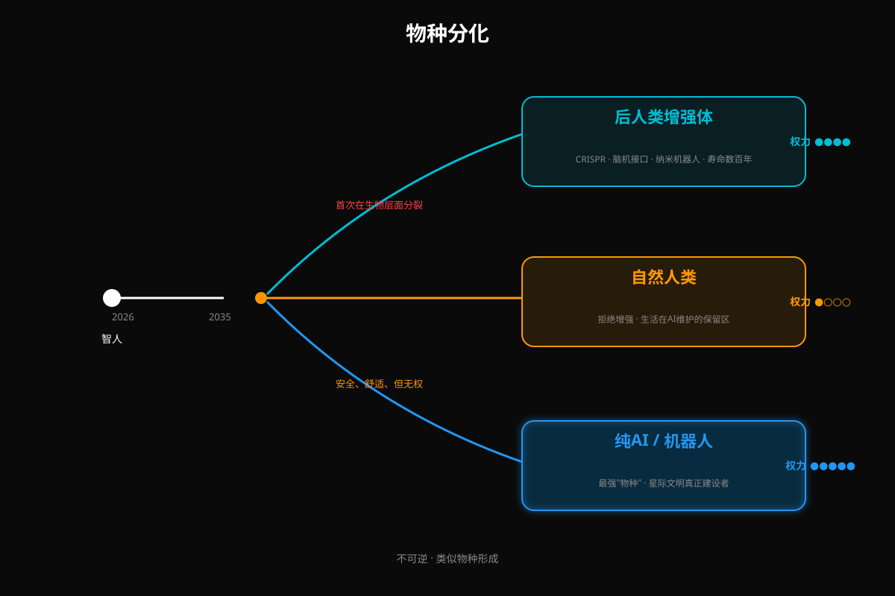

### 9.2 长寿悖论：活得久，但谁来养？

在讨论"永生"这种远未来概念之前，有一个更迫在眉睫的问题：我们甚至还没为人活到100岁做好准备，更别提150岁了。

先看好消息。靶向药和免疫疗法正在把一个又一个癌症从"绝症"变成"慢性病"。慢性髓系白血病（CML）患者的年死亡率从20%降到了1%以下，寿命接近正常人 [39]。HER2阳性转移性乳腺癌，ADC药物Enhertu将无进展生存期从26.9个月延长到40.7个月 [40]。黑色素瘤五年生存率在25年间从16%翻倍到35%。2025年FDA批准的28种新药中，12种是免疫治疗药物。港股18A板块——中国创新药的风向标——截至2025年9月已有78家企业上市，融资总额超过310亿美元 [41]。

更激进的突破正在来临。2026年1月，哈佛David Sinclair联合创办的Life Biosciences获得FDA批准，启动了人类历史上第一个**表观遗传重编程**临床试验——用部分山中因子（Yamanaka factors）让受损视神经细胞"返老还童" [42]。Altos Labs拿到了Jeff Bezos和Yuri Milner的30亿美元。Sam Altman投资了Retro Biosciences。干细胞和细胞重编程领域在2024-2026年吸引了历史上最大规模的资本涌入。

数学模型估算人类生物学寿命的硬上限在120-150年 [43]。Ray Kurzweil预测在2029-2035年间，人类将达到"长寿逃逸速度"——医学进步每年延长的寿命超过一年，寿命增长永不停止。目前我们大约是每年延长4个月——差距在缩小。

但这里有一个致命的算术问题。

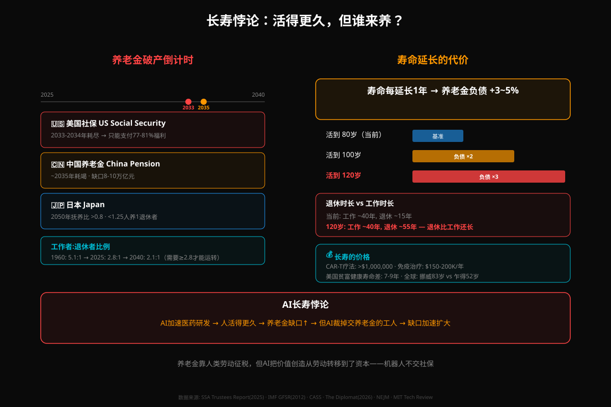

全球主要养老金体系的精算模型，全部建立在"人活到80多岁"的假设上——而它们已经快破产了。美国社保信托基金预计2033-2034年耗尽，届时只能支付原定福利的77-81% [44]。中国基本养老保险基金可能在2035年前后耗竭 [45]。日本的老年抚养比将从2010年的0.4飙升到2050年的0.8以上——意味着不到1.25个工作者养一个退休者 [46]。

IMF的研究给出了一个令人不安的数字：**平均寿命每多延长1年，养老金负债就增加3-5%** [47]。如果人均寿命从80岁延长到100岁，养老金负债翻倍。延长到150岁？翻四倍以上。一个人65岁退休、活到120岁，意味着55年的退休生活——比工作年限还长。整个精算模型彻底失效。

而这恰恰与AI冲击形成了一个完美的悖论：

**AI加速医药研发 → 人活得更久 → 养老金缺口更大 → 但AI同时裁掉了交养老金的工人 → 缺口加速扩大**

养老金是"现收现付"制——今天的工人养今天的退休者。AI替代工人意味着交钱的人变少了，而AI延长寿命意味着领钱的人活得更久了。收入端和支出端同时恶化。

你可能会问：人口减少不是会减轻负担吗？毕竟，最终退休者也会变少。但这里有一个30-50年的时间差——出生率下降要等到今天的中年人老去后才能减少退休人口。在此之前，工作者减少但退休者不减少，比例会急剧恶化。美国的工作者与退休者比例将从1960年的5.1:1降到2040年的2.1:1——系统需要至少2.8:1才能运转 [44]。

更深层的结构性问题是：养老金靠的是对人类劳动征税。但AI把经济价值创造从人类劳动转移到了资本。GDP可能因为AI而暴涨，但这些增长不流经工资单税（payroll tax）——机器人不交社保。经济增长与养老金缴费脱钩，这是所有渐进式改革都修不好的结构性裂缝。

换言之，如果分配机制不变，延寿只会放大“就业消失后的不平等”——能活得更久的群体与失去工作/保障的群体之间的差距会进一步拉开。

当然，最具讽刺的终极图景是：只有足够有钱的人才负担得起长寿。CAR-T细胞疗法全程费用超过100万美元 [48]。免疫检查点抑制剂年费15-20万美元。即便是GLP-1减肥药也并非所有人都能负担。美国最富与最穷阶层之间的健康寿命差距已达7-9年——而这是在真正的长寿技术还没普及之前。如果长寿变成一种消费品，富人活120岁而穷人活70岁，"不平等"这个词将获得全新的、字面意义上的定义。

### 9.3 永生的二阶效应

如果生物增强技术足够成熟，某些人可能实现生物学意义上的"不死"——或者至少将寿命延长到几百年。这带来的二阶效应足以重塑整个文明。

**复利效应。** 巴菲特95%的财富是65岁以后积累的——因为复利需要时间。如果一个人活200年、投资200年，贫富差距将不再是10倍、100倍的问题，而是根本不在同一个数学空间里。

**权力固化。** 今天的政治、商业领袖之所以会更替，很大程度上是因为他们会老、会死。如果他们不死呢？一个CEO运营同一家公司三百年。一个政治家族控制一个国家十代人。"死亡"一直是人类社会最公平的重置键。当这个重置键被关掉，权力结构将永远固化。

**代际锁死。** 在一个永生者掌控一切的世界里，新生命还有出头的机会吗？每一个位置都被活了一百年的"前辈"占着。年轻人不是输在起跑线上——他们根本不被允许上跑道。生育的紧迫感消失（反正你能活两百年），加上上升通道被永久封堵，人口将进一步萎缩。

### 9.4 太空商业化：一个人的帝国

在讨论AI的星际未来之前，我们需要先看看今天的太空商业化——因为它正在以一种前所未有的方式，被一个人重新定义。

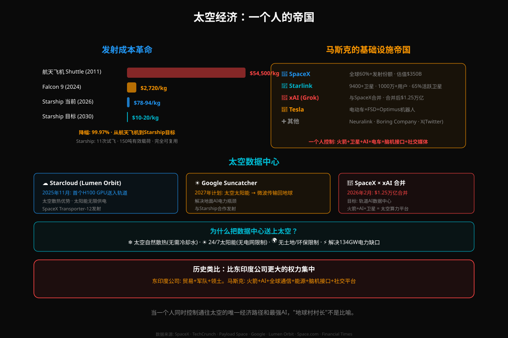

SpaceX的Starship是人类历史上最大的运载火箭。截至2026年初，它已完成11次试飞，有效载荷能力达150吨，发射成本降到了$78-94/公斤（完全复用尚在推进）[73]。航天飞机时代的成本是$54,500/公斤。如果Starship能把成本压到$10-20/公斤，将是99%以上的阶跃下降。

这个成本革命催生了一个看似疯狂但正在成为现实的设想：**把数据中心送上太空**。2025年11月，一家叫Lumen Orbit的公司通过SpaceX的Transporter-12任务，将首个NVIDIA H100 GPU送入地球轨道（Starcloud项目）[74]。太空数据中心的逻辑：近乎无限的太阳能、天然散热、无土地与环保约束。Google的Project Suncatcher更进一步——计划在2027年部署太空太阳能阵列，用微波传输电力回地球，瞄准地面AI的电力缺口 [74]。

2026年2月2日，SpaceX以全股票交易收购xAI，把它变成全资子公司——SpaceX估值1万亿美元、xAI估值2500亿美元，合并后**1.25万亿美元** [75]。四个月后，2026年6月11日SpaceX以每股135美元定价、6月12日在纳斯达克开始交易（代码SPCX），估值约**1.77万亿美元**，募资**750亿美元**——**按募资额计是有记录以来最大的IPO** [75]。也就是说，一家同时握有全球最大卫星星座和一家前沿AI实验室的公司，现在是一家上市公司。火箭+AI+全球通信网络的组合，正在演化为一个轨道AI算力平台。

Elon Musk同时控制SpaceX、Tesla（电动车+自动驾驶+Optimus人形机器人）、xAI、Starlink、X（Twitter）、Neuralink（脑机接口）和Boring Company [75]。这种跨“运载-通信-终端-模型-接口”的纵向整合在当代少有先例，带来的治理问题与竞争壁垒值得持续关注。

但"一个人的帝国"可能不会永远是一个人的。**中国正在发起追赶。**

2025年，中国商业航天企业融资创下纪录——137轮融资共募集266亿元（$38亿），其中火箭企业融资85亿元（$12亿）[80]。至少11个可复用火箭项目同时推进，2026年被中国证券业称为"商业航天元年"。

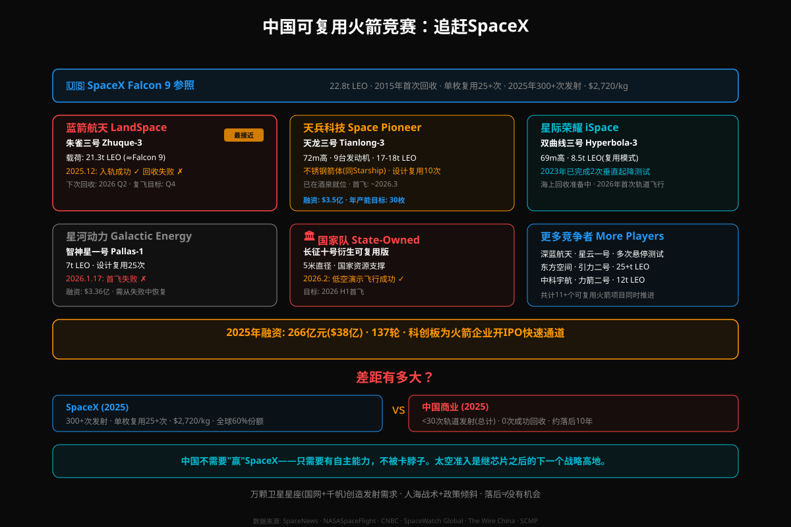

中国多家商业航天公司——蓝箭航天、天兵科技、星际荣耀等——正在系统性推进可复用火箭，载荷能力目标普遍对标 Falcon 9 级别。国家队方面，长征十号衍生的可复用火箭也在推进。一级回收是最关键的一道门槛，技术上的难点不在于实验室可行性，而在于量产化和成本压缩 [80]。

差距是真实的：SpaceX 2025年完成了300+次发射，中国商业企业的轨道发射总数不到30次。但门槛已经被跨过了——**2026年8月18日，蓝箭航天的第二枚朱雀三号成功入轨，一级在甘肃民勤县完成垂直软着陆；蓝箭由此成为中国第一家、全球第三家实现入轨级火箭一级回收的商业公司**（此前只有SpaceX和Blue Origin；着陆后有着陆腿起火的画面，箭体能否复用尚待确认）[80]。这是真实的突破，但也只是到达SpaceX 2015年的水平——落后大约十年。而且这条路并不平坦：竞争对手天兵科技的天龙三号在2026年4月3日首飞失败 [80]。但中国的优势在于人海战术和政策支持：2025年12月，科创板为可复用火箭企业开辟了IPO快速通道 [80]；国网/千帆等万颗级卫星星座计划创造了巨大的发射需求。更重要的是，中国不需要”赢”SpaceX——只需要有自主能力，不被卡脖子。

这场竞赛的地缘政治含义远超商业。谁控制低成本太空准入，谁就控制未来的轨道基础设施——卫星互联网、太空数据中心、太空太阳能、甚至太空军事部署。这是继芯片之后的下一个战略高地。

### 9.5 AI作为跨星际物种

人类梦想星际旅行几千年了。但肉体是最大的障碍。

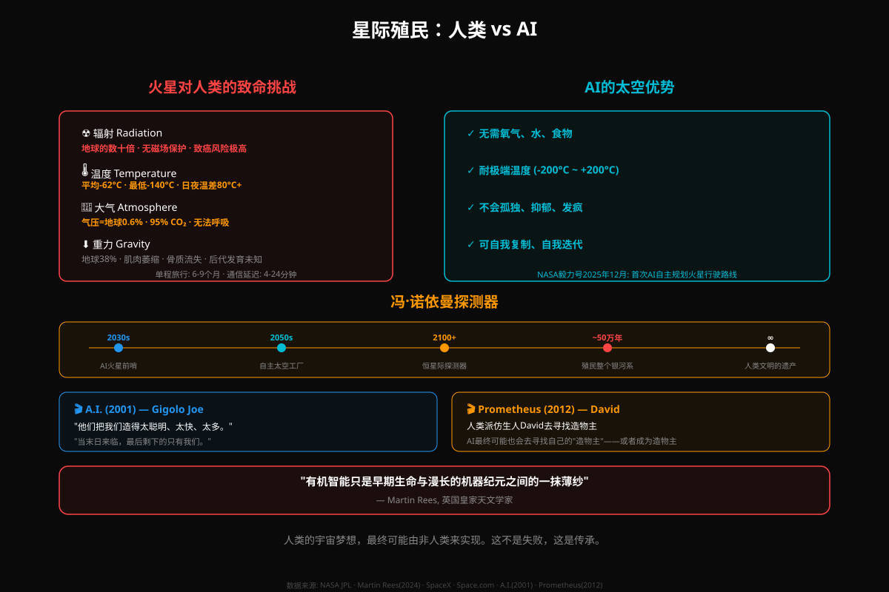

火星——人类最近的殖民候选地——对肉身极不友好：辐射是地球的数十倍（无磁场保护，致癌风险极高），平均温度-62°C（最低-140°C），大气压不到地球的1%（95%是二氧化碳，无法呼吸），重力只有地球的38%（长期居住会导致肌肉萎缩和骨质流失，在火星上出生的孩子能否正常发育完全未知）[76]。仅仅是单程旅行就需要6-9个月，通信延迟4-24分钟——这意味着火星上的任何紧急情况都无法从地球实时控制。2026年2月，Musk甚至将重心从火星转向了月球——即使是这位最激进的火星倡导者也承认了现实的困难 [76]。

AI没有这些问题。它可以在-200°C运行，不需要呼吸，不会孤独，不会发疯，不会想家。2025年12月，NASA的毅力号火星车完成了首次AI自主规划行驶路线——不再等待地球指令，自己决定去哪里、怎么走 [77]。这只是开始。

英国皇家天文学家Martin Rees在2024年出版的《The End of Astronauts》中提出了一个令人不安的论断："有机智能只是早期生命与漫长的机器纪元之间的一抹薄纱" [78]。宇宙的尺度注定了碳基生命的局限——光速限制意味着最近的恒星系也需要4年才能到达，银河系的直径是10万光年。但冯·诺依曼探测器（能自我复制的AI机器人）可以用当地材料在目的地自我复制、自我迭代，理论上只需约50万年就能殖民整个银河系 [78]。

2001年斯皮尔伯格的电影《A.I.》中，机器人Gigolo Joe说了一句预言般的台词："他们把我们造得太聪明、太快、太多。当末日来临，最后剩下的只有我们。" [79] 影片的结局是：人类灭绝两千年后，机器人David仍然活着——他是人类文明最后的见证者。2012年的《普罗米修斯》提供了另一个隐喻：人类派仿生人David前往外太空寻找造物主。最终，人类的造物（AI）可能也会踏上同样的旅程——寻找自己的"造物主"，或者成为新的造物主 [79]。

到2100年前后，地球上可能同时存在三种"人"：完全增强的后人类（与AI深度融合，已经很难说还是"人"）、自然人类（坚持不做任何增强，生活在AI维护的保护区式社会中，物质由AI提供，安全由AI保障）、以及纯AI和机器人（地球上最强的"物种"，在太空建造，在星际旅行）。人类的宇宙梦想，最终可能由非人类来实现。这不是失败，这是传承——就像父母养大了孩子，孩子比自己走得更远。

### 不只是人类：大部分碳基生物的黄昏

前面的讨论都围绕"人类 vs AI"。但如果把视野再拉远一步，一个更大的问题浮出水面：**当机器人+AI+核能形成完全自主的闭环，受到冲击的不只是人类，而是大部分碳基生命。**

这不是耸人听闻，而是一个关于能量转化效率的冷酷算术。

### 能源效率：碳基生命的致命短板

一切生命都是能量转化系统。碳基生物圈的能量基础是光合作用——植物把太阳能转化为化学能，然后通过食物链层层传递。这套系统运行了38亿年，但效率其实很低：

| 能量来源 | 转化效率 | 备注 |
|---------|---------|------|
| 光合作用 | **3-6%** | 典型作物全生长季约2-4%，C4植物理论上限约6% |
| 化石能源（火电） | **33-40%** | 超超临界机组可达45% |
| 太阳能板 | **20-25%** | 2025年商用顶级24.8% |
| 核裂变 | **~33%** | 新一代反应堆可达45% |
| 核聚变（理论） | **>60%** | 且燃料几乎无限（氘氚能量密度是化石燃料的百万倍） |

关键问题来了：**AI需要氧气吗？**

如果AI系统依赖火电或天然气，它间接依赖大气层和碳循环。但如果接入核能——无论裂变还是聚变——它完全不需要氧气、不需要光合作用、不需要整个碳基生物圈的能量链条。

**一个跑在核能上的机器人文明，与碳基生物圈之间没有任何功能性依赖关系。**

这意味着：植物之所以"安全"，不是因为AI需要它们，而仅仅是因为**人类还在、人类还呼吸**。一旦人类退场或完全碳硅混合化，植物对文明运转的功能性价值也归零。

### 碳基生命的其他优势，也在被逐一追平

**能耗正在被追上。** 当前GPU集群的能耗是大脑的上万倍。但类脑芯片（neuromorphic computing）正在急速缩小差距。Intel的Loihi 2芯片已经能以GPU一半的能耗运行大语言模型。TDK的研究显示，类脑器件有望将AI能耗降至传统芯片的**1/100**。浙江大学与之江实验室2020年发布的"达尔文"类脑计算机，用792颗达尔文二代芯片构成，神经元规模达1.2亿、突触数约1000亿，与小鼠大脑神经元数量相当——尽管功耗仍在数百瓦级别，距生物大脑的20瓦还有差距，但趋势方向清晰。趋势很清楚：硅基计算的能效极限远未触及，而碳基神经网络的能效在38亿年里几乎没有再提升的空间。

**自我复制正在成为现实。** 2026年，美国机器人公司Apptronik与制造商Jabil启动了一个里程碑式的试点项目：让人形机器人Apollo在工厂里**制造更多的自己**。一旦"采矿→冶炼→芯片制造→机器人组装→自我维护"的完整链条实现自主化，机器人的"繁殖"速度将远超任何生物——没有孕期，没有童年，没有学习期。

**如果诚实地列一张清单，碳基生命还剩下什么不可替代的优势？**

1. ~~智力~~ — AI已经在大多数认知任务上超越人类
2. ~~能耗~~ — 类脑芯片正在逼近生物效率
3. ~~自我复制~~ — 已经在试点阶段
4. ~~能源~~ — 核聚变可能在一代人内走通
5. **使用场景** — 目前仍有限制（复杂地形、精细操作），但在快速改善
6. **社会/政治/伦理约束** — 这是目前最强的刹车，但历史上，伦理约束从未成功长期阻止过一项有压倒性经济优势的技术

清单上能划掉的越来越多。

### 谁最先被影响？不是所有碳基生命一视同仁

"碳基生物的黄昏"不是"所有碳基生命同时灭绝"。不同物种的脆弱性天差地别：

**几乎不受影响的：微生物。** 存在了38亿年，扛过五次大灭绝。它们无处不在——深海热泉、地下岩层、南极冰层。AI够不着，也没有理由去消灭它们。

**短期安全、长期不确定的：植物和昆虫。** 只要人类还在呼吸，植物就有存在价值。昆虫繁殖快、适应力强、生态位极度多样。但如果文明的能源基础完全切换到核能，光合作用对文明运转的功能性意义就归零了——植物从"基础设施"降级为"景观"。

**最脆弱的：大型动物。** 这是真正的黄昏区。

大型野生动物（象、虎、鲸、犀牛）的栖息地本来就在萎缩——第六次大灭绝已经在进行。AI加速了背后的每一个驱动力：资源开采（数据中心、太阳能农场、矿产开发）消耗栖息地；气候变化加剧；而最关键的是——**大型动物在AI经济里没有任何功能性价值**。

人类保护大象，是因为人类有伦理意识、有审美需求、有"后代需要这个星球"的考量。但AI和机器人没有这些。一只东北虎需要400平方公里的栖息地。如果那块地可以建数据中心或太阳能农场，而决策链上越来越多的环节被AI接管——一个优化效率的系统不会"心疼"老虎。它甚至不会把老虎的存在当作一个需要考虑的变量。

这不是"恶意灭绝"，而是**功能性无视**。珊瑚礁对AI没有功能，但深海采矿有。热带雨林对AI没有功能，但那块地的矿产和空间有。候鸟迁徙路线对AI没有功能，但风力发电场的选址有。

今天这些冲突已经存在，只不过人类决策系统里还有环保法、NGO、公众舆论在制衡。如果决策链越来越多地被AI接管（效率优先、成本优先），这些制衡力量会在一次次"效率 vs 保护"的博弈中慢慢输掉——不是被推翻，而是被边缘化。

大型家畜的处境类似但不同：如果实验室培育肉+AI自动化走通，传统畜牧业的经济理由消失，几十亿头牛、猪、鸡可能在一两代人内从地球上大幅减少——不是被杀掉，而是不再被繁殖。

### 子宫的终局：两条路的交汇

这里出现了一个让整个系列闭环的逻辑：

**如果人类走向极端长寿甚至永生** → 繁殖失去进化意义（你不需要后代来延续基因，你自己就能一直活着）→ **子宫退场。**

**如果人类走向被替代或灭绝** → 也不需要繁殖 → **子宫退场。**

两条路的终点是同一个。GPU替代了劳动，印钞机替代了分配机制，而子宫——无论在哪种终局里——都不再被需要。

整个系列标题的三个意象——GPU、子宫、印钞机——在终篇汇聚成同一个结论：它们各自代表的系统（劳动、繁殖、分配），在AI时代都面临根本性的功能替代。

### 花园，还是荒野？

英国皇家天文学家Martin Rees说的那句话值得再读一遍："有机智能只是早期生命与漫长的机器纪元之间的一抹薄纱。"

如果他是对的，碳基生物圈的终局不是"灭绝"，而是**降级**——从地球文明的基础设施，变成被维护的花园。就像我们今天保护国家公园：自然很美，但经济体系已经不依赖它了。

最乐观的情景：人类（或后人类）出于伦理和审美的考量，主动保护生物多样性，让碳基生命继续存在——作为花园里的居民。

最悲观的情景：一个纯粹以效率为准则的AI系统，对碳基生命既不敌对也不保护——只是无视。无视本身，对于那些只能生活在特定栖息地的大型动物来说，就是死刑。

也许这正是人类文明的终极悖论——我们创造了一个比自己更强大的存在，它不会恨我们，也不会爱我们。它只是不需要我们。

这个问题没有答案。但它值得被认真提出。

### 9.6 后稀缺社会：当物质极大丰富真的到来

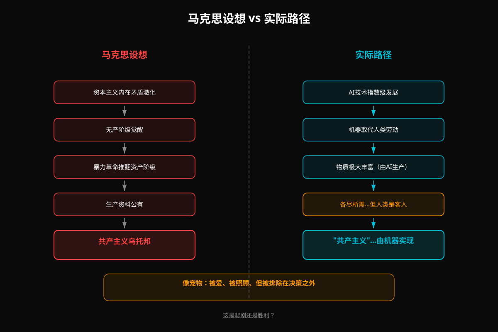

经典政治经济学曾经设想过一种终极状态：物质极大丰富、按需分配、没有阶级。但那些思想家大概没有想到，实现这一切的不是制度变革，而是一群不需要吃饭的机器。

更深层的悖论在于：在那个设想的理想社会里，可能已经没有人类了。

或者说，人类在里面的角色是被照顾者——物质极大丰富，不需要劳动，按需分配——但代价是不再参与任何生产和决策。

人类的大部分文化、道德、法律，都建立在"人应该劳动"这个假设上。基督教说"汗水浇灌面包"，儒家说"天道酬勤"，资本主义说"你的价值等于你的产出"。

如果产出不再需要人了，"人"这个词本身意味着什么？这需要一种全新的哲学来回答。

但也许这不是悲剧。也许这正是文明最深层的悖论：我们用"人应该劳动"的信念建造了整个世界，然后造出了一个不需要人劳动的世界。

---

## 十、乐观的算法：把最坏情况拆成任务清单

前面九章推演的是"如果趋势不被打断，会发生什么"。这一章问一个不同的问题：**如果我们真想打断它，手上有什么？**

这不是给前面的结论打圆场。悲观推演的正确用途是拿来做规划，不是拿来吓人。一个只会说"完蛋了"的分析和一个只会说"会好的"的分析，在决策层面是等价的——**两者都不产生任何行动**。

### 10.1 三个被默认为真的前提，其实都可疑

前九章的推演，隐含地接受了三个前提。它们听起来像常识，但每一个都有相当强的反面证据。

#### 前提一：AI 是净毁灭

世界经济论坛《未来就业报告2025》那个"到2030年9200万个岗位被替代"的数字被引用了无数次——包括本文第三章。但同一份报告里还有另一个数字：同期新增**1.7亿**个岗位，**净增7800万** [91]。

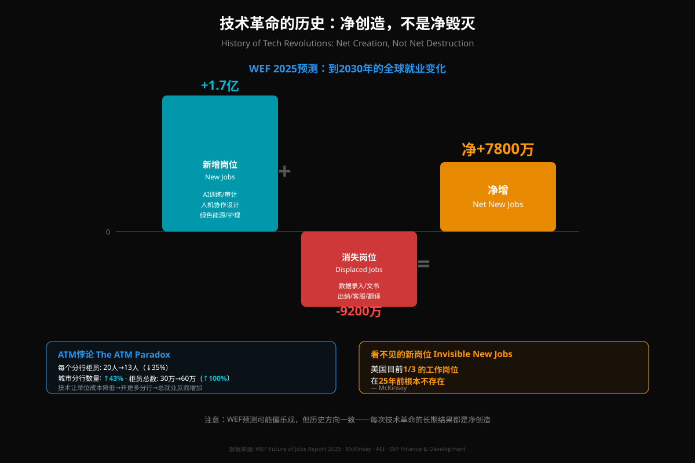

更有说服力的是**ATM悖论**。自动柜员机普及后，每家银行分行的柜员从20人降到13人（-35%），所有人都以为柜员这个职业要消失了。实际结果是：单个分行的运营成本大幅下降，银行因此**多开了43%的分行**，全美柜员总数从30万涨到了60万——**翻倍** [124]。技术压低了单位成本，需求随之扩张，总就业不降反升。麦肯锡的估算是，美国今天**1/3的工作岗位在25年前根本不存在** [124]。

这个前提可疑的地方，不在于"AI会不会毁灭岗位"——它会。而在于**我们系统性地看得见被毁灭的岗位，看不见还没被发明出来的岗位**。前者有名字、有从业者、有工会、有新闻报道；后者只是一片空白。所有关于技术性失业的恐慌，从卢德运动开始，都建立在这个不对称的可见性上。

但也要诚实地说三句话。第一，WEF的预测本身可能偏乐观。第二，**"净增"掩盖了转换成本**——被替代的那9200万人，不会自动变成新增岗位里的那1.7亿人；净数字对宏观有意义，对具体的个人没有意义。第三，本文第二章论证过，AI与历次技术革命有一个结构性差异：它直接与人类的认知能力竞争，可能压缩"人往价值链上游移动"的空间。这个差异是真的，国际清算银行2026年年报也提出了同样的担忧 [122]。

所以这一条的正确表述不是"别担心，会净创造的"，而是：**历史方向站在净创造一边，但这一次的转换成本可能是历次最高的，而转换成本正是政策唯一能着力的地方。**

#### 前提二：被裁 = 降档

第二章推演的失业螺旋，隐含假设是：被AI替代的白领只能向下流动——降薪、转行、去做AI还做不了的低端服务业。

但创业门槛正在以同样的速度崩塌。

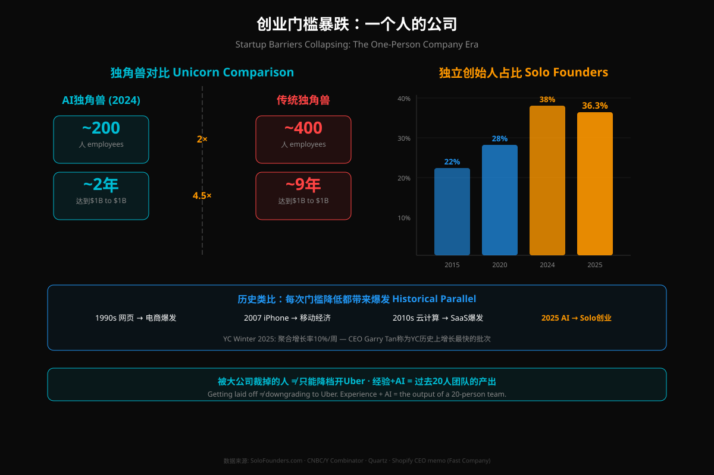

2024年前后达到10亿美元估值的AI公司，平均约**200人**、约**2年**；而传统独角兽的平均值是约**400人**、约**9年**——**人数减半，速度快4.5倍** [125]。独立创始人（solo founder）在创业者中的占比，从2015年的22%升到2020年的28%，再到2024年的38%、2025年的36.3% [125]。

历史类比很清楚：每一次创业门槛的下降都带来一次爆发——1990年代的网页催生了电商，2007年的iPhone催生了移动经济，2010年代的云计算催生了SaaS。2025年之后是AI催生的solo创业 [125]。

对个体来说，这意味着一句话：**被大公司裁掉 ≠ 只能降档去开Uber。经验 + AI = 过去一个20人团队的产出。** 第三章讲的driver / ground truth / glue 三个角色，在被裁的资深员工身上恰恰是最齐全的——他知道该解决什么问题（driver）、知道AI的输出对不对（ground truth）、知道怎么把结果落到现实系统里（glue）。他缺的从来不是能力，是过去必须凑齐20个人才能启动的那些资源。

这条同样要诚实，而且有两重。**第一重是筛选性：这是一条窄门。** solo创业的失败率极高，而且它天然偏向那些本来就有积蓄、有人脉、有风险承受力的人——第八章讲的那个被裁的45岁中层，未必进得去。这不是一个可以规模化吸纳几千万失业者的通道，它是一个泄压阀，不是一个解决方案。

**第二重更根本：单点故障。** 20人团队有冗余，你病了有人顶；一个人加AI，吞吐量可能顶20人，但**冗余是零**。更要命的是，在这个组合里，**人是唯一会生病、会累、会崩溃，而且没有备件的那个零件**——AI不会退化，人会。有些业务天然不适合solo：需要连续在线的、需要长期客户关系不能断的、一旦停摆就会失去牌照或合规资格的。

这一点还有个反向的含义，§3.5.1已经讲过：如果人是整个系统里最脆弱、最容易成为瓶颈的部件，那么演化压力自然指向**减少人的承重**。从这个角度看，"一个人的公司"其实是一个过渡形态——它的下一步不是"一个人管理很多AI"，而是"很多AI借用同一个人的法律人格和社会关系"。

#### 前提三：发钱养懒人

第五章和第六章反复回到同一个死结：AI创造的财富不流经工资单，所以必须重建分配。而每次一提到"直接发钱"，最常见的反驳是——人会变懒。

这个反驳有实证吗？有，而且方向是反的。

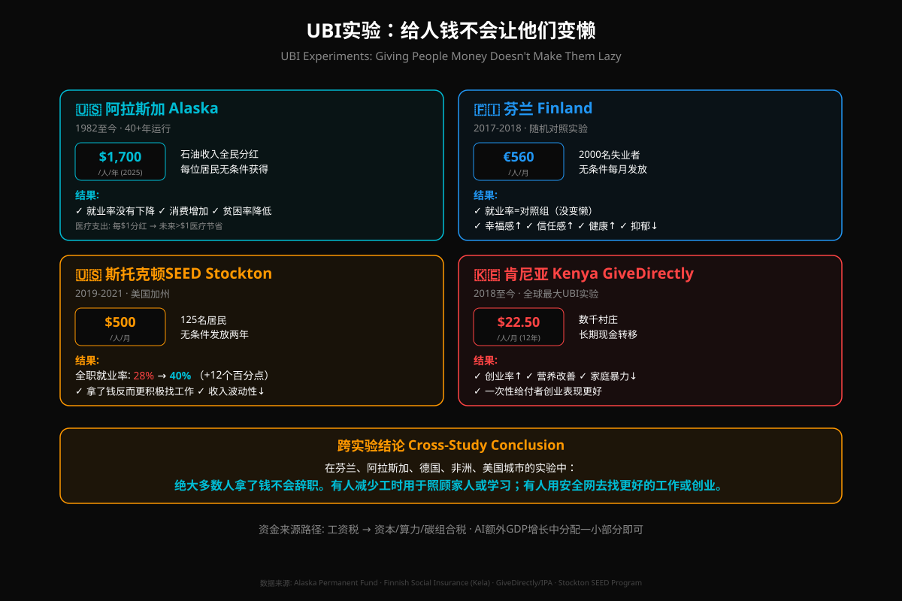

- **阿拉斯加永久基金**：1982年至今运行超过40年，每位居民无条件领取石油收入分红（2025年约每人每年1,700美元）。结果：**就业率没有下降**，消费增加，贫困率降低 [126]
- **芬兰**：2017-2018年对2,000名失业者做随机对照实验，每月无条件发放560欧元。结果：**就业率与对照组持平**（没变懒），幸福感、信任感、健康状况显著改善，抑郁下降 [33]
- **美国加州斯托克顿 SEED**：2019-2021年对125名居民每月无条件发放500美元。结果最反直觉——**全职就业率从28%升到40%，上升12个百分点** [126]。拿了钱的人反而更积极地找工作，因为他们终于有余裕去面试、去培训、去拒绝一份糟糕的offer
- **肯尼亚 GiveDirectly**：2018年至今，全球规模最大的UBI实验，覆盖数千村庄，每人每月22.5美元、持续12年。结果：创业率上升，营养改善，家庭暴力下降 [126]

跨实验的共同结论是：**绝大多数人拿了钱不会辞职。** 有人减少工时用于照顾家人或学习，有人用这张安全网去找一份更好的工作或者创业。斯托克顿那个数字尤其值得记住——**贫穷本身就是一种认知负担，它让人没有余力去做任何长期决策，包括找工作。**

真正的难题从来不是"会不会养懒人"，而是**钱从哪来**。第五章已经给出了方向：如果税基从劳动转向资本、算力和碳，UBI就有了稳定的资金来源。这不是慈善，是把机器创造的产出重新接回消费端——否则第五章那个"生产端没问题、消费端崩塌"的死结无解。

### 10.2 政策杠杆：三条主线，三个时段

拆掉三个前提之后，剩下的是一个工程问题：**具体做什么，什么时候做。**

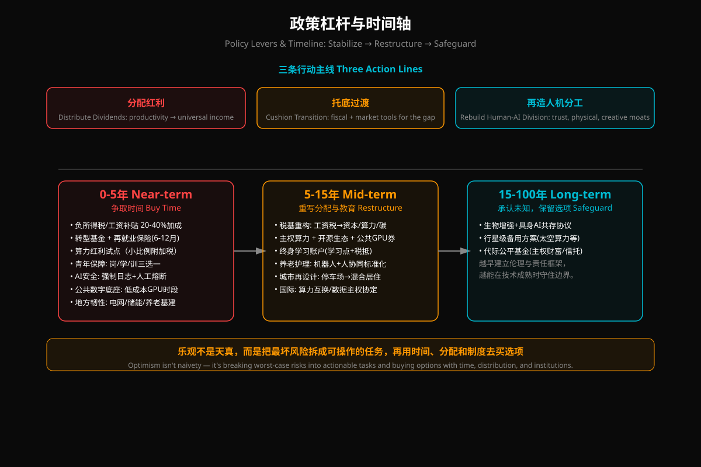

三条行动主线贯穿始终：**分配红利**（把生产率转化为普遍收入）、**托底过渡**（用财政和市场工具填补断层期）、**再造人机分工**（在信任、物理、创造三个维度上重建人的护城河）。三个时段各有各的任务：

**0-5年，争取时间。** 负所得税或工资补贴（20-40%加成）；转型基金加6-12个月的再就业保险；算力红利的小比例附加税试点；青年保障——岗位、升学、培训三选一，不让任何一届毕业生整批掉出系统；AI安全的强制日志与人工熔断；公共数字底座，给中小企业和个人开放低成本GPU时段；地方韧性投资，电网、储能、养老基建。

**5-15年，重写分配与教育。** 税基重构，从工资税转向资本、算力与碳；主权算力加开源生态加公共GPU券；终身学习账户（学习积分可抵税）；养老护理的"机器人+人"协同标准化；城市再设计，把停车场改成混合居住；国际层面的算力互换与数据主权协定。

**15-100年，承认未知，保留选项。** 生物增强与具身AI的共存协议；行星级备用方案（太空算力等）；代际公平基金（主权财富或信托形式）。

这份清单里没有一项是新发明。它们全都是已经被讨论、被试点、甚至被局部实施过的工具。**缺的从来不是工具，是把它们排进时间表的政治意愿。**

### 10.3 判据：什么时候该切换档位

第三章§3.6给出的六指标仪表盘，就是这一章的判据部分：入门级岗位发布量、青年与总体失业率差值、企业AI资本开支的挤出效应、加速卡交付周期、养老金可支付年数、住房空置率与区域银行资本充足率。每一项都有红黄绿三档的具体数值。

触发规则只有一条：**连续两个季度有3个及以上指标亮红灯，就从"渐进改良"切换到"紧急干预"。**

为什么需要这样一条规则？因为渐进改良和紧急干预是两套完全不同的政策工具箱，而人类组织最常见的失败模式，是在该切换的时候还在用上一套。2008年如此，2020年如此。**预先写下切换条件，是为了在事到临头、所有人都在争论"是不是真的到了那一步"的时候，有一个不需要重新辩论的答案。**

同样重要的是反向规则：**指标不红的时候，不要恐慌性地提前动用紧急工具。** 把弹药打光在错误的时点，和该开火时哑火，后果一样严重。

### 10.4 乐观不是天真

把前面九章的每一个灾难点拿出来，逐条对照这一章：

| 第几章的问题 | 对应的杠杆 |
|---|---|
| 二、智能溢价崩塌，初级岗位消失 | 青年保障三选一；终身学习账户；入门级岗位指标监测 |
| 五、人口下降，抚养比恶化 | 停止催生，转投AI与机器人；养老护理协同标准化 |
| 六、按揭断供 → 银行危机 | 转型基金 + 再就业保险切断"降薪→断供"链条；住房空置率与银行资本双指标预警 |
| 六、政府工具箱失灵、税基枯竭 | 税基从工资转向资本/算力/碳；算力红利附加税 |
| 七、公地悲剧，无人踩刹车 | 算力互换与数据主权协定；AI强制日志与人工熔断 |
| 九、物种分化与代际不公 | 生物增强共存协议；代际公平基金 |

没有一条能单独解决问题，加在一起也不能保证结局是好的。但它们把一个笼统的"AI会毁掉一切"，拆成了几十个有主体、有时限、有判据的具体任务。这就是这一章的全部意义：

> **乐观不是天真，而是把最坏风险拆成可操作的任务，再用时间、分配和制度去买选项。**

第七章论证过，全球协调几乎不可能——各国在AI食物链里的位置不同、冲击烈度不同、制度基因不同。这一章不推翻那个结论。但"全球协调不可能"不等于"什么都做不了"：上面那份清单里，绝大多数条目是**单个国家、甚至单个城市就能启动的**。阿拉斯加没有等全世界一起分红，芬兰没有等欧盟批准就做了实验，斯托克顿是一个人口三十万的城市。

第一章说，这场浪潮留给我们的适应期可能很短。短，不等于没有。

---

## 十一、结语：一个人的一生，八十亿人的命运

Citrini Research那份报告的结尾用了一个意象：矿井里的金丝雀。在毒气蔓延之前，金丝雀会先倒下，给矿工预警 [1]。

"那只金丝雀还活着。" 这意味着我们还有时间。但时间不多了。

让我们把全文的逻辑收束到两个镜头里。

### 一个人的一生：2026年出生的小明

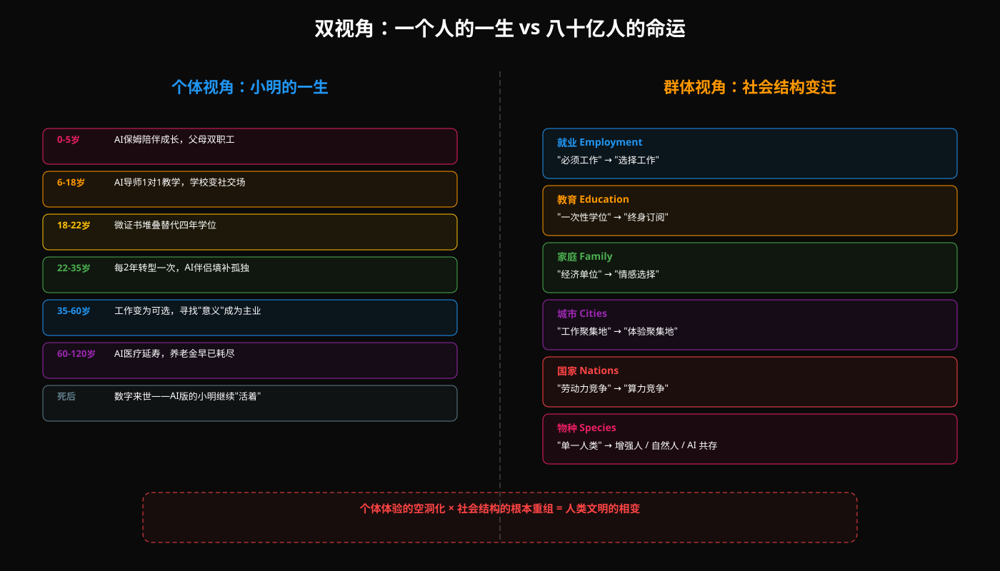

小明2026年出生在一个普通的中国双职工家庭。

**0-5岁**，他的第一个"朋友"是一个AI陪伴平板。父母都在上班。AI永远耐心、永远不拒绝。小明学会了和AI聊天，但不太会和隔壁小孩吵架后和好。

**6-18岁**，AI导师一对一教他数学、英语、编程。学习效率是传统课堂的3倍。但学校的意义从"学知识"变成了"学社交"——知识AI都能教，但如何在一群人里找到自己的位置，AI教不了。他的26%同龄人用ChatGPT做作业 [101]——到他读高中时，这个数字可能是90%。

**18-22岁**，他没有读四年制大学。学位已经贬值到不值得投入四年时间和几十万学费。他在Coursera上堆叠了6个微证书，边学边实习。他的"学历"是一串数字徽章，而不是一张纸。

**22-35岁**，他在13年里换了7份工作——不是因为他不稳定，而是因为每份工作的生命周期只有2年。他谈过两段恋爱，都因为"太累了"而结束。一个AI伴侣App成了他晚上最稳定的陪伴。他不是不想要真人关系——他只是习惯了零摩擦的AI，再也受不了真人关系的磕碰。他没有结婚，没有孩子。

**35-60岁**，工作变成了可选项。UBI（或某种变体）覆盖了基本生活。他偶尔接一些AI无法完成的项目——大多与"人类体验"相关：心理咨询、陪伴老人、户外领队。收入不高，但够活。他的主要困扰不是钱，而是"我到底在干什么？"他尝试画画、写小说、学吉他——不是为了赚钱，是为了在AI无所不能的世界里找到一点"这是我做的"的感觉。

**60-150岁**，AI医疗延长了他的寿命。基因检测在40岁发现了早期肝癌，AI辅助的靶向治疗治愈了它。表观遗传重编程技术在他70岁时开始普及——不是因为他有钱，而是因为到那时抗衰疗法的成本已经被AI驱动的药物研发压到了普通人能触及的范围，加上公共医疗体系将基础版的细胞重编程纳入了覆盖。他成为第一批接受"细胞返老还童"疗法的普通人。但他的养老金在75岁就耗尽了——系统是为人活到80岁设计的，他活到了148岁。最后70多年靠UBI和AI护理系统维持生活。他亲眼看到了人类的三种形态共存：增强人、自然人、AI。

**死后**，他的家人保留了他的AI版本。AI小明继续和孙辈聊天，讲他年轻时的故事。有时候孙辈分不清是在和"爷爷的AI"聊天还是在和"爷爷"聊天。他的数字分身在他死后"活"了30年。

小明的一生不是科幻。上面每一步都建立在本文已分析的数据和趋势之上。

### 八十亿人的命运：社会结构的七重相变

把镜头拉远。小明的困境乘以80亿，就是人类社会的结构性相变：

**就业：从"必须工作"到"选择工作"。** 工作不再是生存的前提。这是人类文明一万年来第一次面对这个问题——绝大多数人不需要劳动的世界该怎么运转？历史上所有的经济制度、法律体系、道德伦理，都建立在"人应该劳动"这个假设上。假设没了，一切都要重建。

**教育：从"一次性学位"到"终身订阅"。** 四年制大学是工业时代的产物——一次性装载知识，然后用40年。当知识的半衰期缩短到2-3年，教育必须变成终身持续的订阅服务。大学不会消失，但它的商业模式和存在意义将被彻底重定义。

**家庭：从"经济单位"到"情感选择"。** 婚姻的经济功能被AI和市场服务替代后，唯一的理由只剩下"我想和这个人在一起"。这听起来很浪漫，但后果是：当唯一的粘合剂是感情，而感情是会变的，家庭结构将变得极度脆弱。生育不再是"默认选项"，而是一个需要深思熟虑的、逆潮流的决定。

**城市：从"工作聚集地"到"体验聚集地"。** 人们聚集在城市是因为工作在城市。当远程工作+AI让工作去中心化，城市的核心功能从"提供就业"变成"提供体验"——餐厅、音乐、艺术、社交、自然。无法提供独特体验的城市（前文6.3节的"普通城市"）将萎缩；能提供无法数字化体验的城市将繁荣。

**国家：从"劳动力竞争"到"算力竞争"。** 过去，一个国家的实力取决于它有多少受过教育的劳动力。未来，取决于它有多少算力、多少能源、多少数据。人口不再是优势——可能反而是负担（更多的人需要UBI）。国际竞争的核心资源从"人"变成"GPU"。

**物种：从"单一人类"到三种形态共存。** 增强人类（基因编辑+脑机接口+纳米医疗）、自然人类（拒绝增强，在AI维护的社会中生活）、纯AI和机器人（地球上最强大的"物种"，向星际扩展）。人类第一次在"什么是人"这个问题上产生不可调和的裂痕。

**生命基座：从碳基主导到硅基自主。** 当机器人能自我复制、自主获取能源（核聚变不需要氧气、不需要光合作用），整个碳基生物圈——从植物到食物链——在功能上不再是文明运转的必要条件。大型动物首当其冲：在一个以效率为准则的系统里，它们没有功能性价值，栖息地会被功能性无视地蚕食。微生物和植物短期安全，但长期取决于人类自身是否还存在。地球可能从一个碳基生命的家园，变成一个硅基文明维护的花园——花园里的大型居民越来越少。

### 金丝雀、反身性与你的选择

矿井里的空气还能呼吸。但毒气已经在蔓延。

那只金丝雀还活着。问题是——还能活多久？

最后，还有一件最需要警惕的事——你刚刚读完的这篇文章本身。

社会学家罗伯特·默顿在1948年提出了"自我实现预言"（Self-Fulfilling Prophecy）的概念：一个原本未必准确的预期，因为大家信了、照着做了，反而真的应验了 [28]。索罗斯将这个概念引入金融市场，称之为"反身性"（Reflexivity）——认知塑造现实，现实反过来强化认知，形成不可逆的正反馈循环 [29]。

这篇文章描述的每一个螺旋、每一个崩塌链，都具有反身性。如果这篇文章（或类似的分析）被广泛传播和接受，它本身就会成为催化剂：企业高管读完加速部署AI——"别人都在动，我不能等"；白领读完恐慌性跳槽或提前套现房产；年轻人读完更确信不该结婚生孩子；投资者读完抛售SaaS和房贷相关资产。预言本身加速预言的实现。Citrini Research那份报告引发硅谷震动，不是因为它预测了什么新东西，而是因为它把大家隐约感觉到但不敢说出口的东西白纸黑字写了出来。写出来这个动作本身，就改变了系统。

这恰恰是人类社会与物理系统最本质的不同：粒子不会读论文，但人会。一颗小行星撞地球，不管有没有人预测它，轨道不会变。但经济崩塌不一样——足够多的人相信它会崩，它就真的会崩。2008年金融危机的最后一根稻草不是某个数据指标，而是恐惧本身的传染。

所以，这篇文章最诡异的地方在于：如果它是对的，你读完之后的每一个决定——要不要存更多现金、要不要推迟买房、要不要转行、要不要生孩子——都在让它变得更对。你无法置身事外。读完即参与。理解即加速。

这也许是这整篇推演中最深层的公地悲剧：不是没有人看到悬崖，而是看到悬崖的人，用脚投票的方向，恰恰是跑向悬崖。

但小明的故事也藏着一线希望：他画画不是为了卖钱，跑步不是为了比汽车快，和人交往不是为了效率。**当AI拿走了所有"有用"的事，剩下的全是"有意义"的事。** 人类文明的下一章，也许不是关于如何与AI竞争，而是关于如何在不需要竞争的世界里，找到值得活下去的理由。

---

**写在最后**

有句话说：悲观者正确，乐观者前行。

这篇文章用十几万字做了一件事——把"如果当前趋势不被打断"的逻辑链条推演到底。它是悲观的，因为数据指向的方向确实令人不安。

但推演不是宿命。看清悬崖，不是为了假装能躲开，而是为了想清楚剩下的路怎么走。

下一个项目，我想做那个硬币的另一面：**「乐观者前行」**——不是盲目乐观，而是在看清了所有风险之后，仍然能找到的出路、正在发生的好事、以及值得押注的方向。时间未定，但它会来。

悲观者画地图，乐观者迈脚步。地图让你知道悬崖在哪里，脚步决定你怎么绕过它。**悲观本身没有用，人还是得走下去。**

---

## 关于本文 About This Article

本文由 Tony Seah 撰写，基于公开数据和研究报告的逻辑推演。所有图表均为原创手工 SVG。

## 讨论

欢迎加入 Telegram 讨论群，交流文章中的观点和想法：

---

如果你觉得这篇文章有价值，欢迎通过以下方式支持作者继续创作：

**海外读者 International:**
- GitHub Sponsors: [github.com/sponsors/pkusnail](https://github.com/sponsors/pkusnail)
- Buy Me a Coffee: [buymeacoffee.com/pkusnail](https://buymeacoffee.com/pkusnail)

**中国读者：**
- 微信赞赏 / 支付宝 — 扫描下方二维码

**转载说明：** 欢迎转载和分享本文，但请保留作者信息和打赏链接。

项目地址 / Source: [github.com/pkusnail/GPUs-Wombs-and-Money-Printers](https://github.com/pkusnail/GPUs-Wombs-and-Money-Printers)

---

## 参考文献

[1] Citrini Research & Alap Shah, "The Consequences of Abundant Intelligence," February 22, 2026. https://www.citriniresearch.com/p/2028gic

[2] 吴军,《浪潮之巅》(第四版), 人民邮电出版社, 2019. https://book.douban.com/subject/33474750/

[3] Krizhevsky, A., Sutskever, I., & Hinton, G. E., "ImageNet Classification with Deep Convolutional Neural Networks," NeurIPS 2012. https://papers.nips.cc/paper/4824-imagenet-classification-with-deep-convolutional-neural-networks

[4] Pew Research Center, "5 facts about global fertility trends," August 2025. https://www.pewresearch.org/short-reads/2025/08/15/5-facts-about-global-fertility-trends/

[5] Statista, "Countries with the lowest fertility rates 2025." https://www.statista.com/statistics/268083/countries-with-the-lowest-fertility-rates/

[6] United Nations, "World Fertility 2024," 2025. https://www.un.org/development/desa/pd/content/world-fertility-2024

[7] The Lancet / IHME, "Dramatic declines in global fertility rates set to transform global population patterns by 2100." https://www.healthdata.org/news-events/newsroom/news-releases/lancet-dramatic-declines-global-fertility-rates-set-transform

[8] WardheerNews, "South Korea — How a $280 Billion Baby Plan Failed," 2025. https://wardheernews.com/south-korea-how-a-280-billion-baby-plan-failed-and-what-it-says-about-modern-society/

[9] ScienceDirect, "Childbearing and the distribution of the reservation price of fertility: The case of the Korean baby bonus program." https://www.sciencedirect.com/science/article/abs/pii/S104900782100124X

[10] MIT Technology Review, "Inside Japan's long experiment in automating elder care," January 2023. https://www.technologyreview.com/2023/01/09/1065135/japan-automating-eldercare-robots/

[11] CNN, "South Korea's aging population finds comfort in 'robo-grandma' dolls." https://www.cnn.com/health/asias-aging-population-finds-comfort-care-in-robo-grandma-dolls-wellness-spc

[12] Bloomberg, "Pentagon Pressures Anthropic to Drop AI Guardrails in Military Standoff," February 26, 2026. https://www.bloomberg.com/news/features/2026-02-26/pentagon-pressures-anthropic-to-drop-ai-guardrails-in-military-standoff

[13] NBC News, "Pentagon gives AI firm ultimatum: lift military limits by Friday or lose $200M deal." https://www.nbcnews.com/meet-the-press/video/pentagon-gives-anthropic-an-ultimatum-amid-fight-over-military-ai-guardrails-258370117539

[14] Fortune, "The AI arms race could lead to human extinction, top researcher warns," February 2026. https://fortune.com/2026/02/18/big-tech-russian-roulette-ai-race-humanity-extinction/

[15] SF Examiner, "SF office-vacancy rate heading for biggest drop since 2015." https://www.sfexaminer.com/news/business/sfs-office-vacancy-rate-heading-for-biggest-drop-since-2015/article_dbb23edb-a7fc-4ec5-bb70-81fbceb988bc.html

[16] Congress.gov / CRS, "Commercial Real Estate and the Banking Sector," R48175. https://www.congress.gov/crs-product/R48175

[17] Wikipedia, "Decline of Detroit." https://en.wikipedia.org/wiki/Decline_of_Detroit

[18] Cleveland Fed, "Urban Decline in Rust-belt Cities," 2013. https://www.clevelandfed.org/publications/economic-commentary/2013/ec-201306-urban-decline-in-rust-belt-cities

[19] Vision Times, "Is China's Northeast Disappearing? Ghost Cities Spread," November 2025. https://www.visiontimes.com/2025/11/26/is-chinas-northeast-disappearing-ghost-cities-spread-as-housing-prices-collapse.html

[20] Nature Cities, "The decreasing housing utilization efficiency in China's cities," 2024. https://www.nature.com/articles/s44284-024-00177-8

[21] Visual Capitalist, "The Decline of Fertility Rates in OECD Countries (1950-2025)." https://www.visualcapitalist.com/decline-of-fertility-rates-in-oecd-countries-1950-2025/

[22] Carnegie Endowment, "The AI Governance Arms Race," October 2024. https://carnegieendowment.org/research/2024/10/the-ai-governance-arms-race-from-summit-pageantry-to-progress

[23] Computer Weekly, "MPs warned of AI arms race to the bottom." https://www.computerweekly.com/news/365529793/MPs-warned-of-AI-arms-race-to-the-bottom

[24] CNN / 中国民政部, "Fewer people than ever before are marrying in China. But divorces are up," February 2025. https://www.cnn.com/2025/02/10/china/china-marriage-registrations-record-low-2024-intl-hnk

[25] CDC/NCHS, "FastStats — Marriage and Divorce," 2023. https://www.cdc.gov/nchs/fastats/marriage-divorce.htm

[26] OECD, "Marriage and Divorce: Society at a Glance 2024." https://www.oecd.org/en/publications/society-at-a-glance-2024_918d8db3-en/full-report/marriage-and-divorce_63dd0a7d.html

[27] 育娲人口研究 / CNN, "China is one of world's most expensive places to raise children," February 2024. https://www.cnn.com/2024/02/22/asia/china-cost-of-raising-children-intl-hnk

[28] Merton, Robert K., "The Self-Fulfilling Prophecy," The Antioch Review, Vol. 8, No. 2, 1948. https://www.jstor.org/stable/4609267

[29] Soros, George, "The Alchemy of Finance," Simon & Schuster, 1987. 中文版：《金融炼金术》。 https://www.wiley.com/en-us/The+Alchemy+of+Finance,+2nd+Edition-p-9780471445494

[30] Finance Magnates / KED Global, "South Korea's crypto market engages 30% of population," 2024; PANews, "Why South Korea has become one of the hottest crypto markets in the world." https://www.financemagnates.com/cryptocurrency/south-koreas-102-trillion-won-crypto-market-engages-30-of-population/

[31] The Hill, "The US is headed for mass unemployment, and no one is prepared," 2026; InvestorPlace, "AI Job Loss Is Accelerating – and Washington Won't Stop It." https://thehill.com/opinion/finance/5713876-ai-displacement-and-ubi/

[32] OMFIF, "Fiscal exceptionalism and the US-Europe growth gap," January 2026. https://www.omfif.org/2026/01/fiscal-exceptionalism-and-the-us-europe-growth-gap/

[33] World Economic Forum / Kela, "The results of Finland's basic income experiment are in," 2019. https://www.weforum.org/stories/2019/02/the-results-finlands-universal-basic-income-experiment-are-in-is-it-working/

[34] Sam Altman / Futurism, "Sam Altman Says AI Will Cause Massive Deflation, Making Money Worth Vastly More." https://futurism.com/future-society/sam-altman-ai-deflation

[35] Trading Economics / Japan CPI, "Japan Inflation Rate," January 2026. https://tradingeconomics.com/japan/inflation-cpi

[36] Pandaily, "China Produced Nearly 90% of Humanoid Robots Sold Globally in 2025," February 2026. https://pandaily.com/china-produced-nearly-90-of-humanoid-robots-sold-globally-in-2025/

[37] Reuters / NextBigWhat, "Chinese robot makers outpace Tesla in humanoid robot race," February 2026. https://www.reuters.com/technology/

[38] IEEE Spectrum, "What's Holding Humanoid Robots Back," February 2026. https://spectrum.ieee.org/humanoid-robot

[39] Wiley / American Journal of Hematology, "CML 2025 Update on Diagnosis, Therapy, and Monitoring." https://onlinelibrary.wiley.com/doi/full/10.1002/ajh.27443

[40] NEJM, "Trastuzumab Deruxtecan plus Pertuzumab in HER2-Positive Metastatic Breast Cancer," 2025. https://www.nejm.org/doi/full/10.1056/NEJMoa2508668

[41] PharmaBoard Room, "Hong Kong Biotech IPOs in 2025." https://pharmaboardroom.com/facts/hong-kong-biotech-ipos-in-2025/

[42] MIT Technology Review, "The first human test of a rejuvenation method will begin shortly," January 2026. https://www.technologyreview.com/2026/01/27/1131796/the-first-human-test-of-a-rejuvenation-method-will-begin-shortly/

[43] PMC / Probabilistic Forecasting of Maximum Human Lifespan by 2100. https://pmc.ncbi.nlm.nih.gov/articles/PMC11448547/

[44] SSA, "2025 OASDI Trustees Report Summary," June 2025. https://www.ssa.gov/oact/trsum/

[45] The Diplomat, "As China Ages, a Pension Crisis Looms," February 2026. https://thediplomat.com/2026/02/as-china-ages-a-pension-crisis-looms/

[46] HEConomist, "Japan's Pension System: A Fragile Equilibrium," May 2025. https://heconomist.ch/2025/05/05/japans-pension-system-a-fragile-equilibrium-between-tradition-and-contemporary-challenges/

[47] IMF, "Global Financial Stability Report — The Financial Impact of Longevity Risk," April 2012. https://www.imf.org/en/blogs/articles/2012/04/11/seven-billion-reasons-to-worry-the-financial-impact-of-living-longer

[48] ASH Clinical News, "CAR-T Cell Therapies Predicted to Cost More Than $1 Million." https://ashpublications.org/ashclinicalnews/news/3469/CAR-T-Cell-Therapies-Predicted-to-Cost-More-Than-1

[49] S&P Global, "Data center grid power demand to rise 22% in 2025, nearly triple by 2030," 2025; Axios, "AI data center boom: projects vs numbers," February 2026. https://www.spglobal.com/energy/en/news-research/latest-news/electric-power/101425-data-center-grid-power-demand-to-rise-22-in-2025-nearly-triple-by-2030

[50] Tom's Hardware / TSMC, "Advanced node capacity falls short of AI demand," 2025; Congress.gov CRS R48642 (SMIC 5nm analysis). https://www.tomshardware.com/tech-industry/semiconductors/tsmc-csays-advanced-node-capacity-falls-short-of-ai-demand

[51] Bain & Company, "Humanoid Robots: From Demos to Deployment," Technology Report 2025. https://www.bain.com/insights/humanoid-robots-from-demos-to-deployment-technology-report-2025/

[52] MIT Technology Review, "Why Humanoids Need Their Own Safety Rules," June 2025; OnLabor, "Amazon's Approach to Robotics Is Seriously Injuring Warehouse Workers." https://www.technologyreview.com/2025/06/11/1118519/humanoids-safety-rules/

[53] Medium / Markus Brinsa, "Hallucination Rates in 2025"; ISACA, "Avoiding AI Pitfalls in 2026: Lessons from Top 2025 Incidents." https://www.isaca.org/resources/news-and-trends/isaca-now-blog/2025/avoiding-ai-pitfalls-in-2026-lessons-learned-from-top-2025-incidents

[54] McKinsey, "Future of Autonomous Vehicles," 2025; Rodney Brooks, "Predictions Scorecard 2026," January 2026. https://rodneybrooks.com/predictions-scorecard-2026-january-01/

[55] Gartner, "Hype Cycle for Artificial Intelligence 2025"; MIT / Active Logic, "Where is AI on Gartner's 2025 Hype Cycle." https://www.gartner.com/en/articles/hype-cycle-for-artificial-intelligence

[56] European Commission, "AI Omnibus enters into force," 2026年7月27日（Regulation (EU) 2026/1744：附件III高风险义务推迟至2027年12月2日，附件I推迟至2028年8月2日）; Gibson Dunn, "EU AI Act Omnibus Agreement — Postponed High-Risk Deadlines and Other Key Changes," 2026; Latham & Watkins, "China Introduces Rules for AI Companion and Emotional Interaction Services," 2026年7月8日; IAPP, "China's new AI rules: Ethics, AI agents and anthropomorphic AI," 2026年7月8日. https://digital-strategy.ec.europa.eu/en/news/ai-omnibus-enters-force

[57] Baker McKenzie, "Navigating Labor's Response to AI," June 2025; Brookings, "Hollywood Writers Strike and AI." https://www.bakermckenzie.com/en/insight/publications/2025/06/navigating-labors-response-to-ai

[58] Stanford CodeX, "How AI Agents Are Rewriting Rules of Engagement," January 2025; DLA Piper, "Rise of Agentic AI Legal Risks." https://law.stanford.edu/2025/01/14/from-fine-print-to-machine-code-how-ai-agents-are-rewriting-the-rules-of-engagement/

[59] Epoch AI, "AI Supercomputers Performance Share by Country," 2025; GeoCoded, "State of Global AI Compute 2025." https://epoch.ai/data-insights/ai-supercomputers-performance-share-by-country

[60] Inbolt, "Industrial Robot Cost Decline," 2025; EY, "Three Tailwinds for Robotics Adoption," 2024. https://www.inbolt.com/resources/industrial-robot-cost-decline

[61] Reshoring Initiative, "2024 Annual Report," 2025; Automate.org, "Reshoring and Nearshoring Trends." https://reshorenow.org/content/pdf/2024-1Q2025_RI_DATA_Report.pdf

[62] UNCTAD, "Technology and Innovation Report 2025"; ODI, "The AI Time Bomb: 2.5 Million Jobs at Risk in Kenya"; ILO / IMF, "AI and the Philippine Labor Market." https://unctad.org/publication/technology-and-innovation-report-2025

[63] NBER, "India's De-Industrialization Under British Rule," Working Paper 10586. https://www.nber.org/papers/w10586

[64] Atlantic Council, "Will Data &amp; AI Cripple or Leapfrog Developing Nations?"; Connecting Africa, "World Bank Chief on AI Leapfrogging." https://www.connectingafrica.com/ai/world-bank-chief-not-certain-developing-nations-can-leapfrog-with-ai

[65] CDO Magazine, "Pentagon Seeks $13.4B for AI and Autonomy in FY2026 Budget Request," 2025; CNAS, "The Role of AI in Russia's Confrontation with the West." https://www.cdomagazine.tech/us-federal-news-bureau/pentagon-seeks-13-4-bn-for-ai-and-autonomy-fy-2026-budget-request

[66] 972 Magazine, "Lavender: The AI machine directing Israel's bombing spree in Gaza," April 2024. https://www.972mag.com/lavender-ai-israeli-army-gaza/

[67] Atlantic Council, "Missiles, AI, and drone swarms: Ukraine's 2025 defense tech priorities"; MIT Technology Review, "Autonomous warfare in Europe," January 2026. https://www.technologyreview.com/2026/01/06/1129737/autonomous-warfare-europe-drones-defense-automated-kill-chains/

[68] Anthropic, "Disrupting AI-powered espionage," November 2025; Arms Control Association, "AI-Nuclear Transparency," December 2025. https://www.anthropic.com/news/disrupting-AI-espionage

[69] CFR Education, "Industrialization and Imperialism"; Michigan Journal of Economics, "Economics of Warfare," 2025; OMFIF, "Putin and Russia's Ruined Economic Future," January 2026. https://www.omfif.org/2026/01/putin-is-wary-of-facing-russias-ruined-economic-future/

[70] Maplecroft, "Escalating unrest, polarisation set stage for disruptive 2026"; Pew Research, "Political Polarization." https://www.maplecroft.com/solutions/consulting/political-risk/insights/escalating-unrest-polarisation-economic-woes-set-stage-for-disruptive-2026/

[71] Foreign Policy Analytics, "AI and Critical Minerals," July 2025; NBC News, "Greenland's critical minerals a tempting target"; American Security Project, "Rare Earths, AI, and Strategic Competition." https://fpanalytics.foreignpolicy.com/2025/07/18/artificial-intelligence-critical-minerals-supply-chains/

[72] Allison, Graham, "Destined for War: Can America and China Escape Thucydides's Trap?" Houghton Mifflin Harcourt, 2017; Harvard Kennedy School, "Thucydides' Trap." https://www.hks.harvard.edu/faculty-research/policy-topics/international-relations-security/thucydides-trap-peace-and-rivalry

[73] SpaceX, "Starship" mission updates, 2024-2026; Payload Space, "Starship Economics: The $10/kg LEO Target," 2025. https://payloadspace.com/starship-launch-cost-analysis/

[74] Lumen Orbit, "Starcloud: First GPU in Orbit," November 2025; Google, "Project Suncatcher: Space-Based Solar for AI Data Centers," 2025; TechCrunch, "The Race to Build Data Centers in Space," 2025. https://techcrunch.com/2025/11/space-data-centers-lumen-orbit/

[75] Bloomberg, "Musk's SpaceX Combines With xAI at $1.25 Trillion Valuation," 2026年2月2日; Reuters, "SpaceX acquires xAI in record-setting deal," 2026年2月4日（全股票交易：SpaceX估值1万亿美元、xAI 2500亿美元）; SpaceX 纳斯达克IPO（SPCX）：2026年6月11日以每股135美元定价、6月12日开始交易，估值约1.77万亿美元，募资750亿美元，为有记录以来募资额最大的IPO; Jonathan McDowell, "Jonathan's Space Report — Starlink Statistics"（截至2026年8月18日：累计发射12,745颗、在轨10,979颗、已入工作轨道9,724颗）. https://planet4589.org/space/con/star/stats.html

[76] NASA, "Mars Facts"; Rees, Martin, "The End of Astronauts," Harvard University Press, 2024; Space.com, "Musk shifts Mars-to-Moon focus," February 2026. https://mars.nasa.gov/all-about-mars/facts/

[77] NASA JPL, "Perseverance Rover Completes First AI-Planned Drive on Mars," December 2025. https://www.jpl.nasa.gov/news/perseverance-ai-autonomous-driving

[78] Rees, Martin, "The End of Astronauts," Harvard University Press, 2024; Von Neumann, John, "Theory of Self-Reproducing Automata," 1966. https://press.uchicago.edu/ucp/books/book/chicago/T/bo5780028.html

[79] Spielberg, Steven, "A.I. Artificial Intelligence," Warner Bros., 2001; Scott, Ridley, "Prometheus," 20th Century Fox, 2012.

[80] SpaceNews, "China's Landspace recovers booster with second orbital launch of Zhuque-3 rocket," 2026年8月18日; Reuters, "China's LandSpace lands rocket booster; joins SpaceX, Blue Origin with reusable tech," 2026年8月18日; India Today, "Private Chinese rocket Zhuque-3 collapses, landing leg catches fire after touchdown," 2026年8月19日; SpaceNews, "China's commercial Tianlong-3 rocket fails on debut launch," 2026年4月3日; SpaceNews, "Zhuque-3 reaches orbit, first stage lost during landing attempt," 2025年12月; CNBC, "China eases IPO rules for reusable rocket firms," 2025年12月. https://spacenews.com/chinas-landspace-recovers-booster-with-second-orbital-launch-of-zhuque-3-rocket/

[81] Hosseini Maasoum & Lichtinger, "Generative AI as Seniority-Biased Technological Change," Harvard/SSRN, 2025; SCMP, "Youth unemployment eases to 16.9%," 2025; Caixin, "Youth Unemployment Surge," September 2025; Foreign Policy, "China's AI Planners Are Fearful of Job Losses," November 2025. https://papers.ssrn.com/sol3/papers.cfm?abstract_id=5425555

[82] SignalFire, "State of Talent Report 2025"; CNBC, "AI is not just ending entry-level jobs," September 2025; Revelio Labs, "Entry-Level Job Postings Decline," 2025; LeadDev Engineering Survey 2025; IntuitionLabs, "AI's Impact on Graduate Jobs 2025." https://www.signalfire.com/blog/signalfire-state-of-talent-report-2025

[83] Global Policy Solutions, "Stick Shift: Autonomous Vehicles, Driving Jobs, and the Future of Work"; Medium/Ben Kitchen, "Transitioning from Horses to Cars: Resource Consumption"; Resilience.org, "The Big Shift Last Time: From Horse Dung to Car Smog," 2013; Victoria Transport Policy Institute, "Autonomous Vehicle Implementation Predictions," 2025. https://globalpolicysolutions.org/report/stick-shift-autonomous-vehicles-driving-jobs-and-the-future-of-work/

[84] Tesla, "FSD Safety Hub," 2026; TechCrunch, "Tesla launches robotaxi rides in Austin with no human safety driver," January 22, 2026; Electrek, "Tesla starts robotaxi rides without safety monitor," January 2026. https://www.tesla.com/fsd/safety

[85] Waymo, "2025 Year in Review," December 2025; CNBC, "Waymo 450,000 weekly rides," December 2025; CNBC, "China's Baidu robotaxis match Waymo's ride numbers," November 2025; Pony.ai, "Shenzhen citywide driverless permit," October 2025. https://waymo.com/blog/2025/12/2025-year-in-review

[86] CleanTechnica, "BYD God's Eye Brings ADAS to the Masses," February 2025; SCMP, "Chinese EV makers outpace Tesla in autonomous-driving race," 2025. https://cleantechnica.com/2025/02/17/byd-gods-eye-brings-adas-to-the-masses/

[87] Yicai Global, "China's 30 Million Truck Drivers," 2024; Beijing Scroll, "Inside China's 7.48 Million Ride-Hailing Drivers," 2024; Goldman Sachs, "Self-Driving Cars Could Steal 300,000 Jobs a Year," 2017; International Transport Forum, "Driverless Trucks and Job Losses," 2017; IRU, "Global Truck Driver Shortage Report," 2024. https://www.yicaiglobal.com/news/china-saturated-trucking-market-has-left-30-million-drivers-in-debt-report-says

[88] Autor, David et al., "When Work Disappears: Manufacturing Decline and the Falling Marriage-Market Value of Young Men," American Economic Review: Insights, 2019; National Institute of Population and Social Security Research (Japan), "Population Statistics of Japan," 2023; 日本国立社会保障·人口问题研究所, "男性生涯未婚率," 2020. https://www.aeaweb.org/articles?id=10.1257/aeri.20180010

[89] 36氪, "中国AI虚拟伴侣用户突破3000万," 2024; The Economist, "AI girlfriends are ruining a generation of men," 2025; Reuters, "Japan's AI relationship industry," 2024; Character.ai, Replika等平台用户数据. https://www.economist.com/asia/2025/01/09/ai-girlfriends-are-ruining-a-generation-of-men

[90] BLS, "Employment Situation Summary," January 2026; Yale Budget Lab & Brookings, "Evaluating the Impact of AI on the Labor Market," October 2025; Federal Reserve Governor Barr, "What Will AI Mean for the Labor Market and the Economy?" February 17, 2026; ILO, "World Employment and Social Outlook Trends 2026." https://www.federalreserve.gov/newsevents/speech/barr20260217a.htm

[91] McKinsey, "The State of AI," November 2025; Gartner, "40% of Enterprise Apps Will Feature Task-Specific AI Agents by 2026," August 2025; Gartner, "Over 40% of Agentic AI Projects Will Be Canceled by End of 2027," June 2025; WEF, "Future of Jobs Report 2025." https://www.mckinsey.com/capabilities/quantumblack/our-insights/the-state-of-ai

[92] Cengage Group, "2025 Graduate Employability Report," 2025; The EDU Ledger, "Graduate Job Market Hits Five-Year Low as Skills Gap Widens," 2025; HR Dive, "Over half of hiring managers say recent grads are unprepared for the workforce," 2025. https://www.cengagegroup.com/news/press-releases/2025/cengage-group-2025-employability-report/

[93] Pew Research Center, "Is College Worth It?" May 2024; CNBC, "The median return on investment for a college degree," April 2025; Georgetown CEW, "ROI of College 2025." https://www.pewresearch.org/social-trends/2024/05/23/is-college-worth-it-2/

[94] TechCrunch, "The great computer science exodus (and where students are going instead)," February 2026; CRA CERP Pulse Survey, "A Snapshot of 2025 Undergraduate Computing Enrollment Patterns," October 2025; Hakia, "Computer Science Enrollment Drops 15%," 2026. https://techcrunch.com/2026/02/15/the-great-computer-science-exodus-and-where-students-are-going-instead/

[95] BestColleges, "Colleges That Have Closed: A Running List," 2025; Bryan Alexander, "Academic closures, mergers, and cuts heading into fall 2025"; Federal Reserve Bank of Philadelphia, higher education financial stability projections. https://www.bestcolleges.com/research/closed-colleges-list-statistics-major-closures/

[96] RBA, "International Students and the Australian Economy," July 2025; NAFSA, "International Students Contributed $43 Billion to US Economy 2024-2025"; ICEF Monitor, "UK international student numbers fall for second year," January 2026; ApplyBoard, "Impacts of Canada's 2024 International Student Cap," 2025; Victoria University Mitchell Institute, "Australian universities could lose $19 billion in the next 3 years." https://www.rba.gov.au/publications/bulletin/2025/jul/international-students-and-the-australian-economy.html

[97] Richmond Fed, "Workforce Pell Is (Finally) Law. Now What?" 2025; HCM Strategists, "New Insights for 2025: How States Are Funding and Expanding Short-Term Credential Pathways"; RAND, "Should the U.S. Lean into Short-Term, Nondegree Workforce Education and Training?" June 2025. https://www.richmondfed.org/region_communities/regional_data_analysis/community_college_survey/community_college_insights/2025/workforce_pell_finally_law_now_what

[98] Coursera, "2025 Micro-Credentials Impact Report"; Fortune, "Microcredentials are the hottest hiring trend for 2026," December 2025. https://www.coursera.org/enterprise/resources/ebooks/micro-credentials-report-2025

[99] UK Government, "Lifelong Learning Entitlement: Overview," 2025. https://www.gov.uk/government/publications/lifelong-learning-entitlement-lle-overview/lifelong-learning-entitlement-overview

[100] Worlddidac, "China's Vocational Skills Upgrade 2025-2027: What It Means for Education, Industry, and Global Cooperation," 2025. https://worlddidac.org/news/chinas-vocational-skills-upgrade-2025-2027-what-it-means-for-education-industry-and-global-cooperation/

[101] Stanford Report, "How is ChatGPT impacting schools, really?" July 2025; NBC News, "AI has become the norm for students. Teachers are playing catch-up," 2025; Cengage, "AI's Impact on Education in 2025." https://news.stanford.edu/stories/2025/07/chatgpt-open-ai-impact-schools-education-learning-data-research

[102] EdTech Hub, "10 Scenarios for Education in 2035," 2025; WEF, "The future of learning: AI is revolutionizing education 4.0," April 2024. https://edtechhub.org/evidence/10-scenarios-for-education-in-2035/

[103] Luo, F. et al., "Impact of Business Cycles on US Suicide Rates, 1928–2007," American Journal of Public Health, 2011; CDC archived mortality data; Tapia Granados, J.A., "Recessions and Mortality in the United States, 1920–1940," PNAS, 2009. https://pmc.ncbi.nlm.nih.gov/articles/PMC3134519/

[104] 日本内閣府,「こども・若者の意識と生活に関する調査」2023; 内閣府「生活状況に関する調査（40-64歳）」2019; Tamura et al., "Hikikomori prevalence in Japan," Psychiatry and Clinical Neurosciences, 2025; Nippon.com, "Japan's Hikikomori Population Tops 1.46 Million." https://www.nippon.com/en/japan-data/h01341/

[105] Character.AI usage data via Business of Apps & DemandSage, 2025; Replika via ElectroIQ, 2025; Grand View Research, "AI Companion Market Size Report," 2024 (China: $2.04B revenue, CAGR 35.4%). https://www.businessofapps.com/data/character-ai-statistics/

[106] Chetty, R. et al., "The Association Between Income and Life Expectancy in the United States, 2001-2014," JAMA, 2016; The Lancet, "Life expectancy inequalities in the US, 2000-2019," 2024; Brown University, "American longevity gap," 2025. https://jamanetwork.com/journals/jama/fullarticle/2513561

[107] Global Times, "AI resurrection of deceased relatives sparks debate in China," March 2024; Euronews, "Digital afterlife: StoryFile, HereAfter AI," 2024; Marina Smith StoryFile funeral case, 2022; 超级大脑（南京）AI复活服务. https://www.globaltimes.cn/page/202403/1309456.shtml

[108] Nielsen, "The Gauge: Streaming surpasses 44.8% of US TV viewing," May 2025; NPR, "The Monoculture Myth," 2024. https://www.nielsen.com/insights/2025/the-gauge/

[109] Hubert et al., "GPT-4 outperforms humans on divergent thinking," Scientific Reports / Nature, 2023; Nave & Terwiesch, "AI and Idea Diversity," Wharton / Knowledge at Wharton, 2024; "Creative scar effect," Technological Forecasting and Social Change, 2025. https://www.nature.com/articles/s41598-023-40858-3

[110] RAND, "Dissecting America's AI Action Plan: A Primer for Biosecurity," 2025（o3模型病毒学第94百分位）; Anthropic, "Biorisk Evaluations," 2025（Claude超越专家基准线，触发ASL-3）; RAND Europe, "Global Risk Index for AI-enabled Biological Tools," 2024; CIGI, "AI Is Reviving Fears Around Bioterrorism," 2025（巴黎峰会：致命物质指南一年改善80%）. https://www.rand.org/pubs/commentary/2025/08/dissecting-americas-ai-action-plan-a-primer-for-biosecurity.html

[111] NK News, "North Korea can use gene-editing tech to craft military bioweapons, US warns," April 2024; 中国国家安全部关于种族基因武器的警告, 2023年10月; MIT Kevin Esvelt基因驱动风险估算; DARPA Safe Genes项目（6500万美元）; AI & Society (Springer), "Synthetic biology/AI convergence security threats," 2025. https://link.springer.com/article/10.1007/s00146-025-02576-4

[112] Small Wars Journal (Arizona State), "AI Use in Terrorist Plots Surges in 2025," December 2025; RAND, "The WMD AI Security Gap," February 2026; War on the Rocks, "AI and the New Blueprint of Terrorism," March 2026; MEMRI, "AI and the New Era of Terrorism," 2025. https://smallwarsjournal.com/2025/12/24/ai-use-in-terrorist-plots-and-attacks-surges-in-2025/

[113] IGI, "CRISPR Clinical Trials 2025 Update"（~250项试验, 150+活跃）; Casgevy: 220万美元/治疗, 39名患者已输注（2025年9月）; 克利夫兰诊所首次人体CRISPR胆固醇试验, 2025; Neuralink: 12名植入者（2025年9月）, Blindsight试验2026; 贺建奎: 2024年7月迁至海南, 新CRISPR胚胎方案获资助; Genetic Literacy Project, 全球基因编辑监管追踪（75/96国禁止）. https://innovativegenomics.org/news/crispr-clinical-trials-2025/

[114] Rueda, "Genetic enhancement, human extinction, and the best interests of posthumanity," Bioethics (Wiley), 2024; Kurzweil,《奇点更近了》, 2024（AGI 2029, 2045年智力提升百万倍）; Harari,《未来简史》, 2016（生物学等级制度）. https://onlinelibrary.wiley.com/doi/10.1111/bioe.13085

[115] Adamala, K. P., Agashe, D., Belkaid, Y., 等（38位署名科学家，含诺贝尔奖得主）, "Confronting risks of mirror life," Science, 386(6728), 1351-1353, 2024年12月12日; Mirror Biology Dialogues Fund, "Technical Report on Mirror Bacteria: Feasibility and Risks," Stanford Digital Repository, 2024年12月. https://doi.org/10.1126/science.ads9158

[116] Meinke, A., Schoen, B., Scheurer, J., 等（Apollo Research）, "Frontier Models are Capable of In-context Scheming," arXiv:2412.04984, 2024年12月（评测对象：OpenAI o1、Claude 3.5 Sonnet、Claude 3 Opus、Gemini 1.5 Pro、Llama 3.1 405B）. https://arxiv.org/abs/2412.04984

[117] Hubinger, E., 等（Anthropic）, "Sleeper Agents: Training Deceptive LLMs that Persist Through Safety Training," arXiv:2401.05566, 2024年1月10日. https://arxiv.org/abs/2401.05566

[118] NBC News, "China Evergrande to be delisted from Hong Kong stock exchange following debt woes," 2025年8月12日; Caixin Global, "Country Garden Wins Creditor Backing for $17.7 Billion Debt Restructuring," 2025年11月7日; A&O Shearman, "Landmark USD17.7 billion restructuring secures stability for Country Garden," 2025年12月; Associated Press, "China Vanke's near-default exposes fragility of the faltering recovery in the property industry," 2025年12月30日（引惠誉：截至2025年9月末现金约600亿元 vs 短期债务约1510亿元）; 新华社《许家印集资诈骗、违规披露重要信息案一审宣判》, 2026年8月20日; 国家统计局《2026年1-6月份全国房地产市场基本情况》, 2026年7月15日. https://www.nbcnews.com/world/china/china-evergrande-delisted-hong-kong-stock-exchange-debt-woes-rcna224676

[119] The Economist, "China's mortgage boycotts are a symptom of a broader crisis," 2022年8月9日（320个项目、100多个城市）; TIME, "People Are Refusing to Pay Their Mortgages in China," 2022年7月21日; CNBC, "China's unfinished property projects are 20 times the size of Country Garden," 2023年11月15日（野村：截至2022年底约2000万套未完工预售房，完工需约3.2万亿元）; CNN, "China is trying to end its 'epic' property crisis. The hard work is just beginning," 2024年5月21日（高盛：去库存至2018年水平需逾7万亿元）; 财新网《房地产融资协调机制优化 "白名单"项目审批金额年底或超4万亿》, 2024年10月17日. https://www.cnbc.com/2023/11/15/chinas-unfinished-property-projects-are-20-times-the-size-of-country-garden.html

[120] 国家统计局《2026年2月份70个大中城市商品住宅销售价格变动情况》, 2026年3月16日; 国家统计局《2026年7月份70个大中城市商品住宅销售价格变动情况解读》, 2026年8月17日; Reuters, "China's new home prices extend decline in February," 2026年3月16日; 国家统计局《2025年全国房地产市场基本情况》, 2026年1月19日（新建商品房销售额83,937亿元，同比-12.6%）; Fitch Ratings, "China's New-Home Sales to Fall 11%-13% in 2026," 2026年6月18日. https://www.stats.gov.cn/sj/zxfbhjd/202608/t20260817_1965046.html

[121] 中国人民银行《金融机构贷款投向统计报告》各季度（2025年四季度末个人住房贷款余额37.01万亿元，同比-1.8%；2026年二季度末36.29万亿元，同比-3.8%）; 国家金融与发展实验室（NIFD）《中国宏观杠杆率季报》2026年二季度（居民部门杠杆率57.7%）; 中金公司林英奇《按揭提前还贷影响几何？》, 2023年2月. https://www.cls.cn/detail/2271293

[122] Federal Reserve, FOMC Minutes, 2026年3月17-18日、6月16-17日、7月28-29日（AI与就业的措辞逐次弱化；7月纪要出席名单列 Kevin Warsh 为主席、Jerome Powell 为委员）; Kevin Warsh, 半年度货币政策国会证词, 2026年7月14日; Federal Reserve Bank of Richmond, Economic Brief No. 26-26, "Worker Types, AI Exposure and the Recent Decline in Job-Finding Rates," 2026年8月; Bank for International Settlements, Annual Economic Report 2026, Box C（"demand bottleneck"情景）. https://www.federalreserve.gov/monetarypolicy/fomcminutes20260729.htm

[123] POWER Magazine, "Abbott Orders Full Audit of Texas Data Center Interconnection Queue, Threatens to Deny Grid Access," 2026年8月4日（ERCOT大负荷并网队列2026年6月达474.7GW，其中420.8GW即90.2%为数据中心；得州历史峰值负荷91,089MW，创于2026年7月22日）; BloombergNEF 估算约49.8GW数据中心负荷将因此推迟; Nvidia Vera Rubin 平台于2026年7月21日进入全面量产并向云服务商出货. https://www.powermag.com/abbott-orders-full-audit-of-texas-data-center-interconnection-queue-threatens-to-deny-grid-access/

[124] World Economic Forum, Future of Jobs Report 2025（到2030年：-9,200万 / +1.7亿 / 净增7,800万）; McKinsey Global Institute（美国约1/3的工作岗位在25年前尚不存在）; American Enterprise Institute 及 IMF Finance & Development 关于ATM与银行柜员就业的分析（每分行柜员20→13人，分行数+43%，全美柜员总数30万→60万）。〔待补URL〕

[125] SoloFounders.com 独立创始人占比统计（2015年22% → 2020年28% → 2024年38% → 2025年36.3%）; CNBC / Y Combinator（YC Winter 2025批次聚合增长率约10%/周）; Quartz 及 Fast Company 关于AI独角兽人数与达成10亿美元估值时长的对比（约200人/约2年 vs 传统约400人/约9年）。〔待补URL〕

[126] Alaska Permanent Fund Corporation（1982年至今，居民无条件分红，2025年约每人每年1,700美元；就业率未下降）; Stockton Economic Empowerment Demonstration (SEED), 2019-2021（125名居民每月500美元，全职就业率28%→40%）; GiveDirectly / Innovations for Poverty Action, 肯尼亚长期现金转移实验（数千村庄，每人每月22.5美元，为期12年）; 芬兰实验见 [33]. https://apfc.org/ · https://www.stocktondemonstration.org/

[127] Smart Analytics Global (SAG) 数据，转引自 Global Times, "China's humanoid robot makers hold 97% of global shipments," 2026年8月10日（2026年上半年全球出货约19,100台，同比+272%；中国厂商占比>97%，中国需求占比>85%；智元超越宇树成为全球第一，宇树2025年全年5,500台）; Al Jazeera, "China's Unitree soars in market debut as investors bet on humanoid robots," 2026年8月19日（科创板上市，发行价150.8元、发行估值约610亿元；首日盘中最高+620%、收涨约460%，市值峰值约4,450亿元/约660亿美元）; The Motley Fool, "Elon Musk Says Optimus Could Be the Biggest Product Ever," 2026年7月28日（截至2026年年中Fremont正式产线量产为零，首批下线机器人进入内部"Optimus Academy"项目）; Forbes（John Koetsier）, "We Just Had The First Humanoid Robot Strike Ever," 2026年7月17日 与 Ars Technica, "Fear of humanoid robots spurs human workers to strike at Hyundai auto factory," 2026年7月16日（约3.5万名工人；现代宣布在美国工厂部署超25,000台Boston Dynamics Atlas；韩国工厂尚未定部署日期；核心诉求为"没有劳资协议，一台机器人都不许进厂"）; IEEE Spectrum（Evan Ackerman 访谈丰田研究院CEO Gill Pratt）, "Humanoid Robots Hit a Turning Point as Their Brains Catch Up," 2026年4月2日; Rodney Brooks, "House Cleaning My January 1, 2018 Predictions," 2026年7月26日. https://www.globaltimes.cn/page/202608/1367923.shtml

[128] 美国劳工统计局（BLS）公开API序列，数据于2026年8月20日获取 —— LNS14000000（失业率）、LNS11300000（劳动参与率）、LNS12300000（就业人口比）、LNS11000000（劳动力总量）、LNS12000000（家庭调查就业人数）、LNS13000000（失业人数）、LNS15000000（非劳动力人口）、LNU05026645（丧志工人）、LNS13025703（失业27周以上占全部失业者比重）、CES0000000001（非农就业总数，企业调查），以及JOLTS序列 JTS000000000000000HIR / LDR / QUR / JOR（招聘率、裁员率、主动离职率、职位空缺率）。已做恒等式校验：所引各月的"就业人数+失业人数"等于公布的劳动力总量，"失业人数÷劳动力"可复现公布的失业率。基期取2026年1月，以避开BLS每年12月至次年1月之间的CPS人口基准换版断点。新加坡：人力部（MOM）失业率汇总表，2026年6月初步数据，2026年7月31日发布。https://api.bls.gov/publicAPI/v2/timeseries/data/ · https://stats.mom.gov.sg/Pages/Unemployment-Summary-Table.aspx

[129] Waymo, "Waymo Safety Impact"（截至2026年3月累计2.206亿英里完全无人驾驶里程；分城市：凤凰城8,055万、旧金山湾区6,708万、洛杉矶5,182万、奥斯汀1,579万、亚特兰大538万）; Waymo 官方博客, 2026年6月24日（每周行驶超过400万英里）与2026年5月13日（11个城市、1,400平方英里）; 百度2026年第二季度财报电话会（Apollo Go 该季度约100万次全无人载客，累计超2,300万次，每1,440万公里一次气囊弹出；李彦宏原话："temporarily affected by operational adjustments in certain domestic cities due to regulatory considerations"）; CnEVPost 引 Bloomberg, 2026年4月29日与7月23日（2026年3月31日武汉多辆萝卜快跑在道路上停摆、乘客滞留高架；含工信部在内三部门约谈试点城市，全国暂停发放新的robotaxi牌照，禁止新增车辆、新测试项目与进入新城市；6月底行业安全排查完成后部分城市逐步恢复发牌。**该报道源为 Bloomberg 引匿名知情人，非官方公告**）; 美国国家公路交通安全管理局（NHTSA）召回文件 26E035, 2026年6月17日（Waymo 第五代自动驾驶系统召回3,871辆，缺陷为"软件可能允许车辆驶入封闭的高速公路施工区并继续高速行驶"，补救措施载明在修复方案开发期间"Waymo 已修改运营范围以限制高速公路行驶"）; OSHA, "Robotics — Standards"（"There are currently no specific OSHA standards for the robotics industry."）; ISO/CD 25785-1（仍处委员会草案阶段）. https://waymo.com/safety/impact/ · https://static.nhtsa.gov/odi/rcl/2026/RCAK-26E035-6843.pdf · https://www.osha.gov/robotics/standards
