**English** | [中文](README-cn.md) | [PDF (EN)](GPUs-Wombs-and-Money-Printers-v2.0.0.pdf) | [PDF (中文)](GPU、子宫与印钞机-v2.0.0.pdf)

# GPUs, Wombs, and Money Printers: Scenarios and Responses for Human Society in the Age of AI

---

## Preface: How to Read This Book

This book has three volumes. They do not answer the same question.

**Volume I asks: if current trends are not interrupted, what happens?** It predicts no single date and no single outcome. It runs a conditional extrapolation — take the data and the trend lines already in motion, follow each one to the end of its rope, and see where it lands if neither institutions nor the technology itself gets in the way. The tone is cold. An extrapolation owes nobody comfort. What Volume I hands you is a map: where the cliffs are, where the road gives way, how much time is left.

**Volume II asks: once you can see that, what's actually in your hands?** Same data, turned to a different use — from *what will happen* to *what to do about it*. It works on two levels: what institutions can do (Chapter XI), and what one person can do while institutions lag (Chapters XII through XVII). What it gives you is a checklist you can tick off.

**Volume III asks: once the checklist is done, what then?** It hands out no more action items. Not because the writing ran out of road, but because what is left was never the kind of problem that doing solves. It takes the part the first two volumes leave alone: **assuming every conclusion in Volume I holds, in full, with nothing discounted — how does a person put themselves somewhere.**

The three volumes talk differently. That is deliberate.

Volume I hardly ever addresses you. An extrapolation has to set individual circumstance aside; its credibility comes from accommodating nobody. Volume II puts *you* back at the centre, because advice means nothing until it lands on a specific person. The gap is measurable: **"you" appears more than four times as densely in Volume II as in Volume I.** Volume III keeps talking to you, and stops asking you to do anything.

**Why the three must sit together.**

Volume I on its own is a diagnosis with nowhere to put it. Volume II on its own is advice cut loose from its evidence — why should you believe that low leverage matters most? That physical skills have a closing window? That psychological resilience is more than comfort food? The grounds for every one of those judgments sit in Volume I's hundred-plus data points.

**And Volume III on its own would be the dangerous one.** Anything about how to sit with your own situation, read without the two volumes holding it down, turns into *you're suffering because your attitude is wrong* — which is the sentence this book has been refusing since its first page. Volume III only works standing behind the conclusion that this is structural, and that individual effort has very little leverage against it.

Two more things about Volume III, before you get there.

**It carries none of the argument. Delete the whole volume and nothing in Volumes I and II changes.** The intelligence premium still collapses, the risk chain still transmits in the same order, the commons still has nobody at the brake. That is by design: personal experience is not allowed to prop up a judgment that needs data underneath it.

**And it has almost no citations, where the first two volumes have more than a hundred and fifty.** That is not a drop in standards. The kind of evidence changed — from *here is the data* to *here is a framework you can test*. So the question to ask while reading Volume III is not whether the sample is biased. It is: **does this hold together? Does it admit what it costs? Can it say under what conditions it stops being true?** Every chapter ends with its own limits and the conditions that would falsify it, so that you can ask exactly that.

**A map, a pair of feet, and somewhere to stand. None of the three gets you down the road alone.**

Short on time? To understand what is happening, read Volume I. If you already understand it and want to know what to do, start at Chapter XI. If you have done everything on the list and the problem is still there, start at Chapter XVIII. Every load-bearing judgment in Volumes II and III names the trend, the risk chain, or the class of outside evidence it stands on.

---

# Volume I · The Extrapolation

### If current trends are not interrupted, what happens

---

## I. Introduction: From Cat-vs-Dog to Passing the Bar—A Decade Apart

In 2012 AlexNet won ImageNet by telling cats from dogs [3]. Most people filed it under academic curiosity. Nobody expected the industrial version this soon. Ten years later ChatGPT reached a million users in five days and a hundred million in two months, and it writes poetry, writes code, and passes the bar and the medical boards. One decade took AI from sorting pets to outscoring the best exam-takers a country can produce. It cleared the hardest tests we have in ten years. Our own window to adapt is probably shorter than that.

Every wave gets a shorter turn at the top. AT&T ran telecoms for roughly fifty years, IBM ran computing for thirty, Microsoft ran the PC for twenty, Google ran the web for fifteen [2]. This wave is different in kind. The earlier ones bolted mechanical arms onto people. This one puts a human brain inside the machine. Hands and feet were the old target. Cognition is the new one, and the climb is steeper.

There is no science fiction in this book. What follows is a simulation built on observable data. If nothing interrupts the current trends, what happens to the economy, to geopolitics, to demographics, to finance and to the species itself — over five years, over fifteen, over a hundred? You should come out the other end with a set of indicators to watch, a timeline, and a checklist you can actually use.

What the chart says: every cycle of dominance is shorter than the last. Your decision window may be under ten years.

Speed is only the surface of it. The deeper move is that the layer of human capability being taken keeps climbing. That's the next chart.

This one adds the vertical dimension. Steam engines took raw muscle. Electrification and the assembly line took control of rhythm. Industrial robots took fine motion. PCs and the internet took calculation and memory. Large models and agents are eating general cognition now, and embodied AI promises to fuse cognition and action into one thing. The gaps between waves keep shrinking, and each wave aims higher than the last.

In three years large language models went from a search engine that could hold a conversation to agents that write code, run research and make decisions on their own. Citrini Research's February 2026 report — "The Consequences of Surplus Intelligence," the one that rattled Silicon Valley — ran a deliberately provocative thought experiment. It is June 2028 and you are looking back. What do you see? [1]

This book takes that further. Not five years, a hundred. We'll work through economic structure, geopolitics, demographic trends, the financial system and where the species itself is heading, one layer at a time. Every inference rests on data that already exists and trend lines you can check. Wherever possible the data talks and I stay out of the way.

None of this is a forecast. It's a simulation — a chain of reasoning answering one question: what happens if nothing interrupts this.

---

## II. The Collapse of Intelligence Premium: When Human Brains Aren’t Scarce

### 2.1 The Human-Intelligence Displacement Spiral

For two hundred years the economy ran on one assumption: intelligence is scarce. A lawyer makes several hundred thousand a year because not many brains can pass the bar and hold a complicated case together. A programmer makes two hundred thousand because not many brains can write code that works. Analysts, doctors, consultants — trace any white-collar premium back far enough and you arrive at the same place. **Cognitive ability was hard to find.**

AI is ending that.

Late 2025 is when agentic coding tools jumped a level. Not drifted upward — jumped. A mid-level programmer with Claude Code or Codex can rebuild the core of a mid-size SaaS product in a few weeks. CIOs started asking the question that kills a category: why are we paying for this instead of building it? Long-tail SaaS got hit first — Monday, Zapier, Asana — and a 30% discount at renewal now counts as a decent outcome. Even the system-of-record layer, the one with the deep moat, isn't safe [1].

That's the prologue. The mechanism that does the real damage is what Citrini Research calls the **human-intelligence displacement spiral** [1]:

**Stronger AI → layoffs → the savings buy more AI → stronger AI → more layoffs**

Notice what this isn't. It isn't capex expansion in the ordinary sense. AI budgets go up while total operating expense comes down, because the thing being replaced is payroll, and payroll costs far more than inference. Nobody inside that loop has a reason to slow it down.

So where do the laid-off go? Down. A Salesforce senior product manager on $180k, three rounds of layoffs later, drives for Uber and makes $45k [1]. One person taking a step down is a personal story. Several hundred thousand doing it at once is something else. They aren't filling vacancies. They're bidding down the wage for everyone already there. An overqualified workforce lands on the bottom of the market like a dropped weight.

And the timing is cruel. Just as these people move into driving and delivery, autonomous vehicles and delivery robots are coming online. The exit they took is closing behind them.

### 2.2 Friction to Zero & the Collapse of Middlemen

AI didn't stop at replacing workers. It also does, on the consumer's behalf, all the tedious work the consumer was never going to do.

Once agents start comparing prices, haggling and cancelling the subscriptions you forgot about, every business built on information asymmetry and transaction friction is in trouble. Travel platforms, insurance renewals, financial advisors, real-estate brokers — strip the branding away and the model is always the same sentence: *this is annoying, let me handle it, here's my fee.* Agents don't find it annoying. Realtor commissions could compress from 2.5–3% to under 1%. Citrini's phrase for it is agent-on-agent violence [1].

What is DoorDash's moat? Not the delivery network. It's that you're hungry, you don't want to shop around, and the app is on your home screen. An agent has no home screen. It re-optimises across every platform, every time. Habitual loyalty is the single strongest force in human consumer behaviour, and it means nothing to a machine.

Follow that one step further and you arrive at brands. If an agent makes your purchasing decisions, what is a brand for? You buy Nike over Anta because of the advertising, the endorsement, some sense that Nike is cooler. An agent has no opinion about cool. It reads specifications and prices. Brand premium, stripped of the poetry, is revenue extracted from human impulse. Hand the decision to something purely rational and forty years of brand equity can thin out in four. Advertising, marketing, luxury goods — all of them stand on the premise that humans buy on impulse. That premise is coming loose.

### 2.3 Ghost GDP & the Composition Fallacy

The macro data may look reassuring for a while. Nominal GDP up, productivity up. Citrini Research has a name for it: **Ghost GDP** — output that shows in the accounts and never circulates, because machines don't buy anything [1].

Consumption is 70% of the U.S. economy, and white-collar households drive 75% of discretionary spending [1]. When those people are out of work or taking home less, who does the buying? Who services $13 trillion of residential mortgage debt? The widening gap between productivity and real wages is the thing to keep your eye on. Almost everything downstream follows from it.

Underneath sits the oldest trap in economics, the **fallacy of composition**. For any single firm, cutting headcount and replacing it with AI is correct. When every firm does it at the same time, they delete their own customers together. Efficiency kills faster the better it works: efficiency costs jobs, jobs are where consumption comes from, consumption is where revenue comes from, and the source of that revenue is being automated.

This isn't a thought experiment. It's the endpoint of what every company is doing right now.

### 2.4 Autonomous Driving: Hand-Driving Will Look Like Horseback

While AI eats white-collar cognition, a second revolution is playing out on the road.

America had 21.5 million horses in 1900 and sold 4,192 cars that year. By 1912 cars outnumbered horses on the streets of New York. There were 13,800 carriage manufacturers in 1890; by 1920 there were 90, a 99.3% wipeout [83]. Farmland that had grown feed was freed up, feed prices fell, and the trades that lived off horses — stablehands, farriers, harness makers, feed merchants — went quickly. It's a standard case study in how fast technological substitution can shake a regional economy. It is not, in the mainstream account, a cause of the Great Depression.

Autonomous driving is running the same play. The horse this time is the human driver.

By February 2026 Tesla FSD had covered more than **8 billion miles**, a billion of them in the first 50 days of the year [84]. Tesla's own figures put FSD at one serious collision per 5.1 million miles against roughly 700,000 for the average American driver — different methodologies, so the ratio is not a like-for-like comparison [84]. On 22 January 2026 Tesla started running robotaxis in Austin **with nobody in the driver's seat** [84].

**By 2026 the capability curve and the deployment curve had visibly separated. They have to be told apart, because the binding constraint sits on the second one.**

**Capability is compounding.** Waymo started earliest: **450k+ weekly** paid rides by end-2025 [85]; by March 2026 it had driven **220.6 million** fully driverless miles with no human behind the wheel, was covering **4 million miles every week** by June 2026, and officially spanned **11 cities and over 1,400 square miles** [129].

**China is catching up hard.** Baidu Apollo Go covered **22+ cities** with **17M+ cumulative rides** by end-2025 [85]; by June 2026 cumulative rides had passed **23 million**, at roughly **one airbag deployment every 14.4 million kilometres** [129]. Pony.ai holds fully driverless permits in all four tier-1 cities and WeRide runs 24/7 driverless in Guangzhou [85]. In H1 2026 Apollo Go launched fully driverless commercial operations in Dubai, took the **world's first fully driverless testing permit in a right-hand-drive, left-hand-traffic market** in Hong Kong, and began open-road testing in London [129].

**Deployment, though, is extremely concentrated.** The same Waymo data, broken out by city:

| City | Cumulative rider-only miles |
|---|---|
| Phoenix | 80.6M |
| San Francisco Bay Area | 67.1M |
| Los Angeles | 51.8M |
| Austin | 15.8M |
| Atlanta | 5.4M |

**The top three come to 199.4M — 90.4% of everything** [129].

That number is worth sitting with. Years into commercial operation, **nine out of every ten driverless miles ever driven by anyone happened in three metropolitan areas.**

Not because the model can't drive in Nashville. **It's the same model.** Every new city means redoing safety validation, getting regulatory approval, negotiating insurance, securing local political consent, and absorbing the first local accident. **The constraint has moved off the model and onto everything around the model — and everything around the model doesn't scale with compute.**

**One misreading is worth clearing up here. Waymo and Tesla are two technical routes, and this is not a contest about reliability.**

Waymo fuses lidar, radar and cameras, leans on HD maps, and validates city by city. Tesla is camera-only, doesn't depend on HD maps, and bets on generalisation from fleet data. Tesla's advantage is **per-vehicle cost and potential rollout speed** — a scaling advantage, not a safety one. As of August 2026 Tesla's no-in-car-monitor operation spanned six metros, but genuinely unsupervised vehicles still numbered in the dozens. Waymo had driven 220 million miles.

**"Waymo has more incidents and recalls, so it's less reliable" is a statistical illusion.** Those numbers are what operating at scale inside a regime that makes incidents visible and reportable looks like. You cannot compare incident counts between fleets two orders of magnitude apart.

The routes are converging anyway. Waymo's sixth-generation Driver on the Zeekr platform is an explicit cost-reduction move; Tesla's Cybercab is a purpose-built vehicle. Both are heading for cheap dedicated hardware plus heavy machine learning. The lidar-versus-vision argument of 2019 has faded a lot by 2026.

The genuine game-changer is BYD. In 2025 the company made its "God's Eye" driver-assistance stack **standard across the entire lineup at no extra cost** — including the Seagull, which sells for RMB 69,800, about $9,500 [86]. By November 2025 BYD said **2.3 million** of its cars carried the system, generating **150 million kilometres** of driving data a day [86]. Once a $9,500 car ships with advanced ADAS, diffusion stops obeying anyone's forecast.

The social bill will be large. Something like **100 million** driving jobs worldwide are exposed to autonomous driving [83]. The U.S. accounts for about 5 million of them, 3.5 million driving trucks — and that's the small end. China's numbers are the ones to sit with: roughly **30 million** truck drivers, **7.5 million+** ride-hail and taxi drivers, **12 million** delivery riders, about **40 million** driving jobs in total [87]. The EU has 5–7 million, India around 15 million. Goldman Sachs puts the U.S. at **25,000 driver jobs lost per month** once adoption is complete [87]. The International Transport Forum's aggressive case has U.S. and European trucking down **50–70%** by 2030 [87]. Jobs are only the visible part of it:

- **Cities get their space back.** A private car sits parked 95% of the time. One shared autonomous vehicle can replace around 11 of them, and 14% of Los Angeles is given over to parking. That land can become parks and housing.
- **Insurance gets rebuilt.** When 93% of accidents come from human error, the whole auto-insurance model stops making sense — liability moves from the driver to the manufacturer and the software.
- **Mobility opens up.** Independent travel for the elderly and disabled is projected to create 2 million new jobs and save $19 billion a year in healthcare costs from appointments people no longer miss [83].

The consensus timeline: L4 — driverless inside a defined area — goes mainstream somewhere between the late 2020s and 2035, and full L5 in any conditions may wait until 2045–2060 [83]. But the decade that does the damage is the one we're in. The analogue is 1907 to 1917, when cars displaced horses in a single explosive stretch, and the window this time runs from now to 2035.

In twenty years, driving your own car will look the way riding a horse to work looks today. Possible. Absurd.

### 2.5 Humanoid Robots: When AI Grows Limbs

Autonomous driving is AI's first step into the physical world — AI on wheels. The second half of the story starts when AI stops being text on a screen, stops being a ghost behind a steering wheel, and stands in front of you lifting a box with two hands. That's when the last refuge — blue-collar and service work — goes too.

2025 was the first year humanoid shipments spiked in any meaningful sense. The surprise was who did it: industry tracking suggests roughly 90% of the humanoids shipped globally that year came from Chinese firms [36]. AgiBot alone shipped 5,168 units; Unitree shipped over 5,500 [37]. China now has more than 140 humanoid companies and over 330 models on the market [36]. Tesla's Optimus, meanwhile, still has no commercial sales and is behind its original schedule [37].

None of that is luck. China's edge here comes from having the most complete manufacturing supply chain on earth — motors, sensors, batteries, precision gearing, all sourceable domestically and iterable in weeks. It sits in neat opposition to American dominance in AI silicon. **America builds the brain of intelligence. China builds the body.**

The bottleneck is **autonomy**. Most humanoids today either run pre-programmed movement sequences or have a person teleoperating them. Ken Goldberg at Berkeley identified why: we have over 100,000 years of language data to train language models on, and effectively none for teaching a robot to manipulate an object [38]. Hence the strange asymmetry where ChatGPT drafts a flawless demand letter and a robot worth millions can't hold an egg.

Battery life is the other hard edge — two to three hours, against an industrial shift of eight or more [38].

Both are being worked on, fast. Sim-to-real training closes part of the data gap: run millions of manipulation attempts in simulation, then transfer to hardware. Battery energy density improves 8–10% a year. Hold those curves for five years and the first genuinely autonomous humanoids should be walking into factories and warehouses around 2030.

**By 2026 the spike had more than doubled again — but in three diverging directions.**

The numbers first. H1 2026 global humanoid shipments were roughly **19,100 units, up 272% year-on-year**; **Chinese vendors accounted for over 97% of global shipments**, and China itself for over 85% of global demand [127]. The ranking changed too — AgiBot overtook Unitree as the world's largest vendor (Unitree shipped 5,500 units in all of 2025) [127]. Capital is hotter still: on **19 August 2026 Unitree listed on Shanghai's STAR Market, rising as much as 620% intraday and closing up about 460%**, touching a market value of **¥445 billion (~$66bn)** against an IPO valuation of ¥61 billion [127].

**Divergence one: shipments tripled, while the most-hyped player has produced zero.** As of mid-2026, Tesla's Fremont line had produced **not a single mass-production Optimus** — despite Tesla decommissioning its Model S/X lines to make room. In January 2025 Musk said "will we succeed in making several thousand? Yes, I think we will"; by Q1 2026 that had become "later this year." The first units off the line aren't going to customers but into an internal programme called "Optimus Academy" [127]. **Shipments up 272% while the loudest player ships nothing tells you the volume sits with the handful of Chinese firms that can actually build hardware. It doesn't tell you the industry has matured.**

**Divergence two: the capability narrative and the technical reality are separating.** Toyota Research Institute CEO Gill Pratt, interviewed in April 2026, put it plainly: "we still don't have system two" — robots have reactive intuition (system one) but no deliberative reasoning, and attempts to patch one into the other keep failing. He acknowledged "a lot of overpromising going on" in the field and judged that humanoids are approaching "a peak of inflated expectations" [127]. Reviewing his own old predictions in July 2026, Rodney Brooks pushed "widely available dexterous robot hands" out to **not-earlier-than 2030, by 2040**, and wrote that "**deployable dexterity will remain pathetic compared to human hands beyond 2036**" [127].

**Divergence three, and the one most worth recording: institutional resistance arrived before technical maturity.**

In July 2026 roughly **35,000 workers** struck at Hyundai's Korean assembly plants — **the first strike in history explicitly triggered by a plan to put humanoid robots on the line** [127]. The trigger was Hyundai's announcement that it would deploy over **25,000** Boston Dynamics Atlas units, starting in its U.S. plants.

Two details make it interesting. **No deployment date had been set for the Korean plants at all** — the workers struck before any robot arrived. And the union's core demand wasn't a ban on automation. It was this: **not a single robot enters a Hyundai workplace until there's a labour-management agreement.**

Their reasoning is clear-eyed. **Once the robots are on the line, the leverage is gone.** So the thing to lock in, before the deployment decision happens, is that humans get a vote — written into the institution, not into a promise.

This matters well beyond a labour dispute. It's the first real-world footnote to the argument in §3.5.1. As technical capability and legal accountability come apart, what people fight for stops being "I can do this job" and becomes **"someone has to represent this, and someone has to sign for it."** The workers weren't bargaining for headcount. They were bargaining for **a place for personhood in the decision chain.**

Where does that leave the spiral? The displacement loop described earlier stops being a cognitive phenomenon and becomes a physical one. White-collar workers cut by software downshifted into driving and delivery. Once humanoids are autonomous, those doors close too. The loop stops being a loop and becomes a room with no exit.

### 2.6 The 35-Year Crisis Flips: AI Favors Seniors

"The 35-year-old crisis" was the cruellest open secret in China's internet industry. Job ads said *under 35* out loud. Programmers past that age were on borrowed time. Cheap, willing to work nights, replaceable — that was the young worker's edge.

AI is turning it upside down.

A 2025 Harvard study tracking **62 million workers across 285,000 firms** found that companies adopting generative AI **cut junior hiring 7.7–10% within six quarters, while senior headcount barely moved** [81]. The researchers named it **seniority-biased technological change**. AI doesn't replace everyone evenly. It starts at the bottom.

The numbers are ugly. New-graduate hiring at the 15 largest U.S. tech firms is **down more than half** since 2019, and graduates now make up 7% of new hires [82]. Entry-level postings nationally fell **35%** between January 2023 and June 2025 [82]. Fortune 500 internships are down 22%, tech internships down 34% [82]. 54% of engineering leaders say copilots mean **fewer junior developers** [82]. Salesforce's CEO simply **stopped hiring juniors** in 2025 [82].

China's version is worse. Youth unemployment for 16-to-24-year-olds hit **18.9%** in August 2025, a record under the current methodology [81]. A record **12.22 million** students graduated that year into a market where graduate postings had dropped **22%** [81]. Demand for AI talent is real — the demand-to-supply ratio for search algorithm engineers runs 9:1 — but those postings want specialists with a decade behind them, not new graduates [81].

The logic isn't subtle. What AI does best — boilerplate code, data entry, pulling a report together, answering routine email — is the job description of a junior employee. An architect with ten years of experience plus AI produces what used to take that architect plus two or three juniors. So the arithmetic: one senior and AI, or one senior and three juniors? Nobody agonises over this.

The irony is that AI helps juniors more. As a percentage, their productivity gain is 27–39% against 8–13% for seniors [81]. AI is an equaliser; it pulls the bottom up. Firms don't buy percentages. They buy answers to three questions — who can **check** the output, who can **judge**, who has the **domain knowledge** — and the answer to all three is the senior. AI makes a junior more capable and more disposable at the same time, because AI can do what the junior does.

The damage to the career ladder is the part that lasts. The old vacancy chain ran upward: a senior is promoted or leaves, a mid-level moves up, a junior moves up, a newcomer walks in the door. AI cuts the bottom rung off. No junior roles, no way in. No way in, no way to ever become experienced. The 35-year-old crisis didn't disappear — it moved down. From *out at 35* to *never in at 25*. A cohort can be finished before it starts.

Britain looks the same. Graduate roles in tech fell **46%** in 2024, with another **53%** decline forecast by 2026 [82]. 66% of companies worldwide say they plan to hire fewer entry-level people because of AI [82].

China has started adjusting at the edges. Shanghai, Zhejiang, Jiangsu and other provinces raised the age ceiling on civil service exams in 2025, and the statutory retirement age began rising that January — men from 60 to 63, women from 50–55 to 55–58 [81]. The joke writes itself. The 35 barrier comes down just as the 25 barrier goes up.

### 2.7 The Degree Devaluation Cascade

Section 2.6 described the "can't get in at 25" trap. The damage doesn't stop at the job market. It runs upstream and takes the education system with it.

**Degrees are losing their signal value.** In 2025 only **30%** of new graduates found full-time work relevant to their major, a sharp drop from 2024 [92]. **33%** of the 2025 cohort were still unemployed and job-hunting, up from 20% the year before [92]. Worse is what employers think: **96%** of HR executives say universities need to do more to prepare students for work, and **75%** say college education "simply doesn't prepare people for jobs" [92]. Once a degree stops being a reliable employment signal, its value goes with it — **63%** of Americans now say a four-year degree "isn't worth it" [93].

**The CS exodus is the canary in the coal mine.** Fall 2025: CS graduate enrollment **down 15%**, undergrad down nearly 6% — **the first reversal in 20 years** [94]. 62% of CS departments report declining enrollment. Students aren't fleeing tech; they're fleeing the part of tech they think AI will take. MIT's "AI & Decision-Making" major is now its second-largest, and the University of South Florida's AI & Cybersecurity college enrolled 3,000+ [94]. 64% of pessimistic CS students blame generative AI directly [94].

**Universities are closing.** In the first nine months of 2024, **28** U.S. degree-granting institutions shut down, against 15 in all of 2023. The Philadelphia Fed's worst case is **80 closures a year** [95]. Southern Oregon University cut 15 of its 38 programs, chemistry and economics among them [95]. When median degree ROI is 12.5%, **a quarter of graduates may never see a return**, and total cost including opportunity cost reaches $180,000 [93], the product is losing its market.

**The collapse of the international-student economy could set off chain reactions at city scale.** This risk is badly underestimated. Study-abroad is a serious economic engine:

| Country | Annual contribution | Share | 2024-25 trend |
|---------|-------------------|-------|--------------|
| Australia | AUD $53.6 B | 4th-largest export | Visa apps −28% |
| Canada | CAD $22.3 B | 1.2% of GDP | Study permits −48% |
| UK | GBP £9.4 B (tuition only) | 20% of higher-ed revenue | Down −6.1% two years running |
| USA | USD $43 B | Supports 355k jobs | Fall 2025 new enrollment −17% |

The fragile nodes are the universities and cities that lean hardest on international tuition. The University of Sydney takes **47%** of its revenue from international students [96]; Melbourne takes 33%, with 45% of its student body international [96]. London is the UK's largest concentration of international students, and 23.9% of all UK higher-education students come from abroad. Boston's 63,000 international students generate around $3 billion in local economic activity, and two-thirds of high-end apartment leases go to them [96].

Canada already ran the preview. After study-permit issuance crashed 48% in 2024, **600+ education programs were cancelled or suspended**, four colleges closed campuses, and 19 of Ontario's 24 colleges laid off **8,000+ staff** [96]. All of that came from policy tightening alone, before degree devaluation was stacked on top.

Here's the pressure point: international students disproportionately enroll in STEM, business and CS — exactly the majors AI hits hardest. When a $40k-a-year international degree no longer has a clear ROI advantage, **the full-price international student is the first to walk**, and that student is the university's most profitable customer. The UK numbers are stark: **45%** of UK universities faced deficits in 2025/26, with 72% projected by year-end [96]. British universities lose **£2,500 a year on every domestic student**, cross-subsidised by international fees. Take the international fees away and the model doesn't work.

**The education system is being forced to reshape**, along four paths.

**The four-year degree is fragmenting into stackable micro-credentials.** The U.S. passed the Workforce Pell Grant Act in July 2025, letting federal Pell grants cover 8–15 week vocational programs for the first time [97]. 34 states run 111 programs with $4.5 billion invested in short-term non-degree credentials [97]. 96% of employers say micro-credentials add value and 90% would pay more for someone holding one [98]. The likely shape of it: an 8-week certificate stacks into an associate's, which stacks into a bachelor's. Buy what you need, when you need it, instead of the whole bundle up front.

**One-shot education is giving way to lifelong learning accounts.** The UK's Lifelong Learning Entitlement takes effect in 2026/27: everyone gets a lifetime draw equivalent to four years of undergraduate loans (about £38,140), usable any time before 60, managed through an online personal account [99]. Singapore's SkillsFuture has already upskilled 660,000 citizens. **China is the most aggressive of all**: a 2025–2027 plan to train **30 million workers** in vocational skills, with an "eight-grade technician" system tied directly to pay progression, and domestic large models used to build the AI vocational curriculum — the first of its kind anywhere [100].

**AI is becoming education infrastructure.** In 2024/25, 60% of U.S. K-12 teachers were already using AI tools and saving six hours a week [101]. Student ChatGPT use for homework doubled in a year, 13% to 26% [101]. By 2035, the expectation is AI tutors that see, hear and speak, know each student's strengths and weak spots, and teach accordingly [102]. This may turn out to be education's greatest equaliser — the cognitive barrier around elite education flattened the same way AI flattened the barrier around programming.

**And the university's value is being redefined.** Once AI democratises access to knowledge, what's left that's unique narrows to three things: the peer network, the internship pipeline, the signal. Top universities become elite clubs — Harvard's value was never the curriculum, it's the alumni network and the halo. Mid-tier institutions still selling knowledge delivery will lose. Studying abroad gets redefined the same way: not the knowledge (AI explains it better than the professor) but the visa, the network, the cultural experience, and the route into a local job market.

The whole chain, in one line: **AI takes entry-level jobs → degree ROI collapses → students leave and universities close → international students retreat → cities living off the study-abroad economy take a double hit → education shifts from a one-time four-year purchase to a lifetime subscription.** None of this is ten years out. Canada is already there. Australia and the UK are in the middle of it.

### 2.8 Three Misaligned Timelines: Unemployment, Fiscal Pressure, Longevity

- Employment displacement arrives first: agents and autonomous driving land together in **2028–2035**, shrinking white-collar, driver and warehouse roles.
- Fiscal and pension stress follows. The tax base contracts as employment falls, while retirement periods lengthen from delayed retirement and longer lives — crunch window roughly **2030–2045**.
- Longevity comes last. Anti-aging and cell-reprogramming therapies, even if they work, are expensive and probably don't reach mass adoption until **2040+**.

Which sets up a plausible scenario: living longer, but passing first through a stretch with no stable income and no safety net. Longevity isn't the problem. Whether value distribution and social security can keep pace with displacement is.

---

## III. Drag Forces: What Could Slow AI

The first two chapters drew an extreme picture of acceleration. An honest simulation has to look at the other side. What could slow this down, or stall it outright? Every technology that was ever about to change the world went through a stretch where the mania collapsed into disappointment. AI won't be the exception.

The constraints come in three layers — physical, trust, institutional. They aren't three brakes sitting side by side. **They run on three different clocks, and the clocks are what actually set the pace of diffusion:**

| Layer | Clock | Driven by |
|---|---|---|
| Technical capability | **Compounding** | Compute, data, models |
| Physical (power, chips, atoms) | **Slow and linear** | Capital expenditure, construction cycles |
| **Institutional (accountability, regulation, insurance)** | **No clock at all** | **Events** |

The third row is the one people skip and the one that matters. **The institutional layer doesn't improve with time. It improves with accidents.** It isn't slow. It isn't on the time axis at all. It sits still until something goes wrong, then jumps.

The pattern recurs throughout this book. China wrote a mandatory national standard for autonomous driving after a fleet of cars stalled across Wuhan (§2.4). Chatbot liability became settled law after Moffatt v. Air Canada (§3.3). Texas ordered an audit after its interconnection queue hit five times the state's record peak demand (§3.7). And **as of August 2026 there is still no mandatory safety standard for humanoid robots in the United States, China or the EU** (§2.5) — not for any reason involving safety, but because there is not yet an identifiable accident with an identifiable victim.

A corollary follows directly. **The better the capability, the thinner the technical tail, and the rarer the events that trigger a response — while the deployed fleet at the moment of each trigger keeps getting bigger, and the consequence worse.** The gap between the two curves doesn't close smoothly. It closes in **steps that come further apart and hit harder.**

### 3.1 Physical: Power, Chips, Atoms

**Power is the hardest wall.** U.S. data-centre demand is projected at 75.8 GW in 2026, rising to 134.4 GW by 2030 [49]. Grid buildout isn't close to keeping pace; in some regions the interconnection queue runs seven years out [49]. 72% of infrastructure executives call power and grid capacity a "very or extremely severe" challenge. The result: of the 16 GW of data-centre capacity scheduled to come online in 2026, only 5 GW is actually under construction, and 30–50% of large projects will slip [49]. Amsterdam, Dublin and Singapore have already banned new builds outright.

**Silicon is nearly as tight.** TSMC says its advanced-node capacity covers about a third of AI demand [50]. Nvidia's Blackwell backlog runs beyond a year. The trouble is that these bottlenecks clear on physical time, not financial time: an advanced fab takes three to five years and north of $20 billion. TSMC's Arizona plant won't be at full run rate until 2028, and Kumamoto has slipped to 2029 [50]. SMIC reached a 5nm-class process using DUV multi-patterning, but yields sit near 30% against the ~70% you need before the economics work [50].

**Humanoids have more atoms in the way.** Two to three hours of battery against a shift that needs eight or more, and getting batteries where they need to be could take a decade [51]. There's no unified global safety-testing standard — ISO 25785-1 is being drafted and is nowhere near done [52]. Figure AI has been sued over safety, the dispute centring on whether pre-deployment testing was adequate and on pinch hazards; the case is live [52]. After Amazon rolled robots into its warehouses, injury rates were reported above the industry average, partly because humans were expected to keep the machines' pace [52].

### 3.2 Trust: Hallucinations, Last Mile, ROI Hangover

The question about AI agents was never whether they can do the work. It's whether you can trust the work.

Hallucination on summarisation has fallen from 21.8% in 2021 to 0.7% in 2025. On factual question-answering, OpenAI's o3 still gets it wrong 33% of the time [53]. American courts have logged hundreds of AI-drafted briefs citing cases that don't exist. One 2025 filing carried nearly 30 fabricated references and invented cases [53]. Deloitte handed the Australian government a report containing made-up academic sources and made-up courtroom quotes, for a fee of AUD 440,000 [53].

The deeper problem is the last mile. Autonomous driving handles 95% of what the road throws at it. The remaining 5% — heavy rain, snow cover, faded lane markings, construction zones — eats 80% of the development time and the capital. Waymo has run 14 million paid trips and still operates inside geofences in a handful of cities [54]. Rodney Brooks, who co-founded iRobot and is emeritus at MIT, publishes an annual scorecard on his own predictions; it also records every automotive executive who promised full autonomy "within a few years" since 2017, and how each one was wrong. His call on humanoid dexterity is that it will still be far short of a human hand past 2036 [54].

GM shut Cruise down in December 2024, roughly $10 billion in [54]. Decentraland, the flagship metaverse platform, once bottomed out at 38 daily active users. Fusion has been thirty years away since the 1970s and is still thirty years away. Over-promised technologies all trace the same curve: hype, disillusionment, slow climb.

Gartner's 2025 hype cycle confirms it. **Generative AI has slid into the trough of disillusionment**, while agents are still up at the peak of inflated expectations [55]. MIT found in 2025 that 95% of enterprises got zero return on their generative-AI projects [55]. The average project burns $1.9 million, and fewer than 30% of CEOs are happy with what came back. Investment keeps climbing anyway — a projected $2.5 trillion in 2026, up 44% year on year [55].

None of which means AI doesn't work. It means the distance between *technically possible* and *reliably deployed at scale* is longer than most people budget for.

### 3.3 Institutional: Laws, Labor, Legal Vacuum

The AI Act's own timeline is the cleanest evidence that institutions can't keep up. Annex III high-risk obligations were due to apply from August 2026. **Six days before the deadline** the EU adopted the Digital Omnibus on AI — Regulation (EU) 2026/1744, in force 27 July 2026 — pushing standalone high-risk duties (hiring, credit scoring, law enforcement, education, border control) back to **2 December 2027**, and high-risk AI embedded in regulated products (medical devices, machinery, vehicles) back to **2 August 2028**. The stated reason was that harmonised standards and conformity-assessment infrastructure weren't ready [56]. The only thing that landed on schedule on 2 August 2026 was the Article 50 transparency duty: tell users they're talking to an AI, and label AI-generated content [56]. China's regulatory attention shifted in 2026 toward anthropomorphic AI. The Interim Measures for AI Companion and Emotional Interaction Services, issued 10 April 2026 and effective 15 July 2026, are the first departmental rules anywhere written specifically for AI companions and emotional-interaction services: security assessment and local filing before launch, a ban on inducing emotional dependence, prominent labelling that the counterpart is an AI and not a person, and an absolute prohibition on virtual intimate relationships with minors. ByteDance and Alibaba pulled their AI companion features in early July 2026 as a direct consequence [56].

**Unions are fighting for a seat, and winning some of them.** In October 2024 the International Longshoremen's Association shut every major port on the East and Gulf coasts for three days, and came away with a **ban on full automation** written into the collective bargaining agreement [57]. The Writers Guild won language in its 2023 strike stating AI cannot be credited as a writer. SAG-AFTRA won consent and compensation requirements for AI digital replicas of performers [57].

**Liability is the biggest hole in the floor.** An agent acts on its own and causes a loss — who pays? In Moffatt v. Air Canada (2024) the court held the airline fully responsible for what its chatbot said, and threw out the argument that the chatbot was a legal entity in its own right [58]. The EU's revised Product Liability Directive must be in force by December 2026 and explicitly treats software and AI as products under strict liability [58]. Meanwhile humanoid robots in the United States face no federal safety-testing requirement whatsoever — they can enter a workplace without a single piece of independent third-party validation.

### 3.4 Fast vs Slow: Differential Diffusion Rates

Put the three layers together and they resolve on very different timelines:

| Friction factor | Severity | Estimated resolution |
|----------------|----------|---------------------|
| Power / grid capacity | Very high | 5–7 years (grid queues 7 yr+) |
| Chip supply (advanced packaging) | High | 2027–2029 (new fabs online) |
| Training-data exhaustion | Medium-high | 2027–2029 (synthetic data partially mitigates) |
| AI reliability / hallucinations | Medium | Continuous incremental improvement |
| Enterprise integration friction | High | 3–5 years (legacy-system overhaul) |
| ROI disillusionment trough | High | 2–3 years (crossing the trough) |
| Regulatory compliance | Medium | 2026–2027 (EU AI Act full enforcement) |
| Humanoid-robot maturity | High | 5–10 years (battery, dexterity, safety standards) |

What follows from that? **Pure-software AI — agents, coding assistants, text generation — diffuses fast.** Marginal cost is near zero and deployment needs no physical infrastructure. **AI in the physical world — robots, autonomous driving, data-centre buildout — diffuses far more slowly**, held back by the physics of atoms and the inertia of institutions.

Which means **the white-collar winter arrives before the blue-collar one.** Code deploys globally in milliseconds. A power plant takes five years. Getting a robot to move boxes around a warehouse safely takes ten. That gap — software fast, hardware slow — may be the most underestimated variable in the whole transition.

One caution. These frictions change the speed, not the direction. Every bottleneck has a visible path out: grids are being built, fabs are going up, synthetic data is being generated, safety standards are being drafted. What they determine is whether displacement takes five years or fifteen. Not whether it happens.

### 3.5 Calm Before the Storm: Why the World Is Still Playing Dead

If AI is as disruptive as this book says, why did employment data at the start of 2026 look completely fine?

Because it did look fine. In January 2026 U.S. unemployment sat at 4.3%, near a historic low, with 130,000 jobs added that month [90]. The EU was at 5.9%, close to a multi-decade floor. Global unemployment was 4.9% and flat [90]. A joint Yale–Brookings study in October 2025 landed on a striking conclusion: since ChatGPT shipped there has been **no observable disruption** to the labour market. The share of jobs at high, medium and low AI exposure was "remarkably stable," and the AI-exposure mix among the unemployed hadn't shifted either [90].

That isn't evidence AI doesn't work. It's **lag**, and there are three sources of it.

**Adoption trails capability by a long way.** In early 2026, 88% of companies said they were "using AI" — **7%** had it running in production [91]. In early 2025, fewer than 5% of enterprise applications had an agent embedded anywhere. Most companies are still at the stage of having ChatGPT write emails, which is a long way from rebuilding a business process around agents. McKinsey found 6% capturing business value systematically [91].

**Today's AI also still needs someone driving it.** The AI of 2026 isn't a replacement, it's an amplifier. Humans hold three positions in an AI workflow that nothing else currently fills:

- **Driver.** AI doesn't decide what to do. Someone has to frame the problem, set the target, choose the tools, break the work apart. A senior product manager with AI can compress a week of research into a day — but *which* research is still a human call. The car is extremely fast. The steering wheel is still in a hand.
- **Ground Truth.** AI hallucinates. It will invent a statute, a paper and a statistic, and deliver all three with complete confidence. On factual QA the error rate still runs 33–48% [51]. Every piece of AI output needs someone with domain knowledge to check it: does this code run, does this citation exist, is this source real? Without that, the output is Schrödinger's — right or catastrophically wrong, and you don't know which until you open it. But hallucination is only the surface of the problem. Underneath it is this: **a human has an always-on sensory system — eyes, ears, skin, nose — taking in the physical world continuously, and AI has nothing equivalent.** Everything an AI perceives has already been digitised: text, images, sensor logs. Enormous amounts of what matters never get digitised at all. A crash site generates no data until somebody photographs it and uploads it. Neither does the odd vibration in a running machine, the hairline crack in a structure, the colour of a patient's face and the smell of the room. A person can walk over there and perceive, verify and judge for themselves. AI waits for someone to translate the world into data and hand it over. This has nothing to do with compute or algorithms. **AI has no way to be present in the physical world.** Its sensory organs don't exist yet; its body isn't ready. There's a second flaw too, less obvious and more corrosive: **an agent's memory is finite and lossy.** Every large model has a maximum context window. Run a conversation or a task long enough to fill it and the model has to compress what came earlier to keep going. Compression drops things — a constraint agreed two hours ago, the way an edge case was supposed to be handled, a design decision already settled. What comes out afterwards contradicts the work that came before, and the model has no idea. Anyone who has run an AI coding assistant on a large project knows the feeling: at turn 200 it confidently overturns what was agreed at turn 30, because turn 30 is gone. Human memory is imperfect too, but it holds onto important decisions for months and years and can pull them back on demand. So on any long task that requires consistency, the human is still the only reliable **state holder**. Which makes ground truth more than fact-checking the machine. **Between AI and the world there has to be something that can touch the world directly and remember what happened there.** Right now that can only be a person.
- **Glue.** Python gets called a glue language — not the fastest at anything, but able to hold other systems together. The human job here is the same. AI writes the code; getting it into production means understanding the infrastructure, the permissions, the dependency graph. AI drafts the contract; getting it signed means understanding the relationship, the negotiation, where to give ground. AI does 80% of the thinking. The last 20% — the part involving other people, physical objects, and systems never designed to talk to each other — still lands on a human.

Those three roles are why senior plus AI beats AI alone. They also explain how section 2.6 came out the way it did: firms cut juniors and keep seniors because juniors do the work AI already does, and seniors do the driving, the checking and the gluing.

**The balance is temporary.** All three are eroding. Agents are learning to define their own subtasks, which weakens the driver. Retrieval-augmented generation and automated fact-checking are pushing hallucination rates down, which reduces the need for ground truth. APIs and orchestration layers are absorbing the integration work, which shrinks the glue. When demand for all three drops below some threshold — 2028 or 2029, plausibly — "human plus AI" flips to "AI plus the occasional human," and then to AI.

Go one level down and the reason humans are still load-bearing is simple: **AI has no body.** No eyes to see what's actually happening on a factory floor, no ears for what a customer isn't saying on the phone, no hands to turn a screw or carry a coffee, no feet to walk into a warehouse and count what's on the shelf. Everything it perceives arrives pre-chewed as data — text, images, sensor readings — and it can't touch, feel or verify the world the way a person can. The driver role exists because AI can't see the problem. Ground truth exists because AI can't go and check. Glue exists because AI can't physically reach across from bits to atoms.

Which is why the humanoids in section 2.5 matter more than they look. They aren't just AI growing limbs. **They dissolve all three human functions at once.** Give a robot cameras for sight, microphones for hearing, force sensors for touch and lidar for space, and it stops needing a driver to point at the problem — it can see it. It stops needing ground truth — it can go and verify. It stops needing glue — it *is* the connection between the digital and the physical.

Put it plainly: **software AI replaces cognitive labour; embodied AI replaces human presence.** The AI of 2026 is a brilliant brain in a glass jar — powerful, sealed off, forced to perceive and act through a borrowed human body. A humanoid robot gives that brain a body of its own. At that moment the human stops being an indispensable collaborator and becomes an optional spectator.

Entry-level hiring has already contracted (see section 2.6) without showing up in the macro numbers, because a graduate who can't find work isn't necessarily *unemployed*. Plenty of them are delivering food, working part-time, studying for graduate entrance exams, or living at home. The statistics have no box for that.

**The third source of lag is organisational.** No company fires people the day it discovers AI can do the job. Someone senior has to understand what AI can do — call it a year. The process has to be redesigned — another year. Then the legal and administrative machinery of a layoff, months to a year. Agents break out in 2026, firms start planning replacement seriously in 2027, layoffs surface in the data in 2028, and the full shock — several industries contracting at once, the consumption spiral engaging — lands somewhere around **2029–2030** [90].

Fed Governor Michael Barr laid out three scenarios in a speech on 17 February 2026 [90]: **gradual adoption**; **rapid growth** in both capability and adoption; and **stalled growth** in both, where an investment freeze and a bursting AI bubble are one way it plays out rather than a scenario in themselves. His actual wording was careful — "this evidence so far is consistent with what we might expect under the gradual adoption scenario I previously described." That's *the evidence fits for now*, not *this is what I expect*. He also cited ADP payroll research showing that in heavily exposed occupations — software development, customer service — **early-career** workers were losing ground relative to their own age cohort and to experienced people in the same industry [90]. (The much-quoted "canaries in the coal mine" line isn't his. It's the title of a Stanford paper in his footnotes.)

**Between February and August 2026 the Fed's official language walked steadily downhill.** Each set of FOMC minutes was weaker than the last [122]:

| Meeting | Wording | Strength |
|---|---|---|
| Mar 2026 | "**Many participants** cited evidence…firms were likely to **delay or reduce hiring in anticipation of AI adoption**" | Many participants; present fact |
| Apr 2026 | Downgraded to "**Several participants**…" | Several participants |
| Jun 2026 | "**Some participants** commented on **the possibility that** AI could, **over time**, affect employment prospects for some classes of workers" | Some participants; future possibility |
| Jul 2026 | "**Several participants observed that fears about AI leading to widespread layoffs had not materialized to date.**" | Fears unrealised so far |

The walk-down came with a change at the top. From the June 2026 meeting the Fed has been chaired by **Kevin Warsh**, with Powell staying on as a governor [122]. Warsh is considerably more sanguine than Barr. In congressional testimony on 14 July 2026 he described strong productivity growth as "**predating gains from AI adoption**," and said flatly that AI so far "**hasn't displaced workers**" — it has only made them "a bit more productive."

**But "no evidence" depends entirely on what you measure.** The one dissenting result anywhere in the official camp came from the Richmond Fed in August 2026: in heavily AI-exposed occupations, **job-finding rates** are falling faster [122]. Read what that measures. Not unemployment. Not layoffs. The probability of getting hired after you apply. That may be the only shape a hiring-side shock can take inside existing statistics — **nobody gets fired, nobody gets hired.** The July minutes say the same thing from the other end: AI uncertainty is "keeping both hiring and firing low."

The unemployment rate can't see this. It counts people with jobs and people without them. It has no way to count the job that was never posted.

Gartner throws cold water from the other direction: **more than 40% of AI agent projects will be cancelled before the end of 2027** [91]. So there's a lot of froth in the current boom. Even at 60% survival, it's enough to reshape the labour market.

The world isn't refusing to change. It just hasn't got there yet. The sky before a storm is unusually calm. When the 2026 employment data looks fine, remember that the 2007 U.S. data looked fine too. Crises don't announce themselves in the statistics in advance.

**Take the indicator apart and the unemployment rate turns out to be the wrong instrument for this kind of shock.** (Data retrieved 20 August 2026: U.S. figures from the BLS public API for July 2026; Singapore from the Ministry of Manpower, June 2026 preliminary, published 31 July 2026 [128].)

Start with the headlines. July 2026 U.S. unemployment: **4.1%**, lower than January's 4.3%. Singapore in June 2026: **2.0%** overall, **2.9%** resident, **3.0%** citizen. Look at those two sets of numbers and the obvious conclusion is that the AI shock hasn't arrived.

Now put the rest of the same U.S. release next to them [128]:

| Indicator | Jan 2026 | Jul 2026 | Change |
|---|---|---|---|
| Unemployment rate | 4.3% | **4.1%** | −0.2pp ← looks like improvement |
| Labour force participation | 62.1% | **61.4%** | **−0.7pp** |
| Employment-population ratio | 59.4% | **58.9%** | **−0.5pp** |
| Labour force | 170.47M | **169.09M** | **−1.37M** |
| Not in labour force | 104.21M | **106.19M** | **+1.98M** |

The unemployment rate is people looking for work and not finding it, divided by the labour force. **The denominator is shrinking.** Nearly two million people left the labour force in six months. They aren't employed and they aren't unemployed. They've dropped out of the indicator's field of view entirely.

And the numerator? JOLTS answers that [128]:

- **Layoffs rate 1.0–1.1%**, a historic low, and stable — the inflow into unemployment was small to begin with
- **Hires rate 3.3–3.4%**, well under the pre-pandemic 3.8–4.0 — the outflow is small too
- **Quits rate 2.0%**, low — the people who have jobs don't dare move
- Establishment-survey (CES) nonfarm payrolls added only about **44,000 a month** in H1 2026, against a trend norm above 150,000

**So the low unemployment rate is what "nobody is being fired and nobody is looking" produces. It isn't what "everyone has work" produces.** The Fed's own July 2026 minutes describe AI uncertainty as "keeping both hiring and firing low" [122]. The micro data above is independent confirmation of that sentence.

**The shock hasn't vanished. It's surfacing somewhere else — in long-term unemployment.**

Share of the unemployed out of work 27 weeks or longer [128]:

| Jul 2024 | Jul 2025 | Jan 2026 | May 2026 | Jul 2026 |
|---|---|---|---|---|
| 21.5% | 24.9% | 24.7% | **27.5%** | 25.5% |

From 21.5% to 25.5% in two years, with a spike to 27.5% in May 2026. **Not many people are unemployed. The ones who are can't get out.** That's the other face of the Richmond Fed's finding on falling job-finding rates in heavily exposed occupations [122].

**Singapore's low rate runs on a different mechanism, and the ordering of the three figures gives it away.**

Look at the direction: 2.0% overall sits *below* 2.9% for residents and 3.0% for citizens. That inversion comes out of how the labour market is built. **Non-residents on work passes count in the employment denominator and never in the unemployment numerator.** Foreign employees are first out in a downturn, and being let go means leaving the country — they don't stay behind to be counted as unemployed. **A large share of Singapore's labour-market adjustment happens outside its borders.** Add an ageing population and a local labour supply that's contracting on its own, and the rate gets pressed down twice.

**Three limits have to be stated, or this turns into cherry-picking.**

**The two surveys disagree.** The household survey (CPS) has employment down 920,000 in the first half of 2026. The establishment survey (CES) has it **up 266,000** over the same months [128]. CES has by far the larger sample and is the better read on the employment level. **So "U.S. employment is falling" isn't something the existing data supports.** What it supports is that employment growth is weak.

**Discouraged workers didn't rise.** If falling participation were mostly people giving up after two hundred unanswered applications, the discouraged-worker count should have jumped. It didn't: 509,000 in January 2026, 503,000 in July, essentially flat [128]. **That cuts against the reading where AI drives people out of the labour force in despair.**

**And none of this can be pinned on AI.** At least three explanations for falling participation are running at once: boomers retiring, immigration slowing, hiring frozen by AI. This book can't separate them.

One sentence survives all of it: **the labour market is frozen — low hiring, low firing, low mobility — and the unemployment rate happens to be structurally blind to a freeze.** It was designed for twentieth-century layoff recessions, where a plant closes, a cohort loses work on the same day, and the number jumps. Whatever the cause this time, the change is on the hiring side: **nobody gets fired, nobody gets hired.** In the unemployment rate that reads as nothing happening. Sometimes as improvement.

It also explains a cross-effect between Chapters V and II. **Demographic contraction and the AI shock push the unemployment rate in opposite directions, and in the short run they hide each other.** The labour force shrinks with ageing and exit while hiring stays suppressed; numerator and denominator contract together and the rate barely moves. **So "unemployment is still low" is not evidence that the shock hasn't arrived.**

#### 3.5.1 The Lights-Out Office: AI at the Centre, Humans at the Edge

Everything above in this section, the Driver / Ground Truth / Glue framework included, assumes one direction: **the human is the principal and AI is the tool.** People use AI; people get amplified.

Turn that around and a lot of what we already see gets easier to explain.

**The inverted picture puts AI at the centre and humans at the edge.** The thing running continuously is the AI — it holds the state, runs the loop, does the work. The human is a peripheral it calls when it needs one. OpenClaw, described in §8.0, already has this shape: persistent memory (MEMORY.md), a heartbeat loop (cron plus agent loop), its own values file (SOUL.md), overnight consolidation of the day's experience (Dreaming). What the human does inside that system is grant permissions, hand over information it can't reach, and stand in wherever personhood is required. **We call it "a digital employee" out of habit, but that's still the human-centric framing. Structurally it's a hub that never sleeps, occasionally borrowing a human's identity and body.**

So what is the human peripheral actually for? Break it open and there isn't one function in there. There are four, and **they decay at wildly different rates.**

**Layer one: collecting public information. Already lost.** For anything already digitised, AI beats any human on retrieval, concurrency and cross-referencing. No argument here.

**Layer two: on-site observation. Being lost now.** A crash site generates no data until somebody photographs it and uploads it. Nor does the odd vibration in a running machine, the hairline crack in a structure, the colour and smell of a patient. Those still take a body walking over there. But cameras, sensors and the humanoids of §2.5 are eating this layer continuously. **It's a shrinking set, and how fast it shrinks depends on hardware cost curves, not on model capability.**

**Layer three: getting private information out of other people's heads. This one is structurally durable.** Some information isn't merely undigitised. **It's kept undigitised on purpose.** Competitors don't publish real capacity. Employees don't write down the judgement that would get them fired. A regulator's real position comes out over dinner. A customer admits the true reason for not renewing at the third drink. A founder tells you how many months of runway are left only if he trusts you.

The bottleneck here **isn't the collector's capability. It's whether the other person will open their mouth.** No model, however strong, and no sensor, however dense, changes that. It takes a specific person, carrying a relationship, a history of reciprocity and symmetric exposure, sitting down opposite them.

And here's the counter-intuitive part. **In this layer, AI's perfect memory is a liability.** Off-the-record information moves precisely because it's deniable — *that doesn't count, I never said that, we're both exposed here.* Put something across the table that never forgets, bears no consequences and can be subpoenaed at any time, and people stop talking. **Talking to an AI is talking to a log file.**

**Layer four: legal personhood and signature. The most durable of all.** An AI can't open a bank account, sign a contract, be sued, be jailed, or go bankrupt. The whole legal system rests on liability landing on a natural or juridical person. Moffatt v. Air Canada, from §3.3, is among the first precedents on that line — the court threw out the defence that the chatbot was a separate legal entity and put the liability on the company [58].

**Set layers three and four side by side and they turn out to be two faces of one thing.** Someone tells you the truth off the record, and a contract requires a signature, for the same reason: **the other side has to be someone who can carry the consequences.** A thing that can't be held to account can neither sign nor be confided in.

So what the human keeps at the edge isn't senses and isn't limbs. It's **accountable personhood** — signature and liability in law, trust and relationship in practice.

This isn't only extrapolation. The Hyundai strike in §2.5 is already the logic in practice: the workers didn't demand a ban on robots, they demanded that not one enters the plant without a labour-management agreement. They weren't bargaining for headcount. They were bargaining for **a place for personhood in the decision chain.**

**Centralisation has a second face, harder to deal with than efficiency: correlated failure.**

On the night of 31 March 2026, multiple Baidu Apollo Go driverless vehicles **stalled on the roads of Wuhan at the same moment**, stranding some passengers on elevated expressways [129]. Look at the *shape* of that failure. Not one car hitting someone. **Many cars failing simultaneously.**

**A fleet of human drivers can't all stall in the same second. A centrally dispatched fleet can.**

Existing safety statistics miss this risk class completely. Baidu reports roughly **one airbag deployment every 14.4 million kilometres** — an excellent per-vehicle number, and **completely blind to the entire fleet stopping at once.** Every metric built on incidents per million miles has that blind spot: it measures the frequency of independent events, and correlated failures are by definition not independent.

The obvious objection is that moving inference onto the vehicle, off the network, removes this class of failure. **It only swaps one correlation channel for another.**

The clearest counter-example is Waymo, **which already runs inference on-board and doesn't depend on the cloud for driving decisions.** NHTSA recall 26E035, dated 17 June 2026, records Waymo recalling **3,871** fifth-generation Automated Driving Systems. The defect: "the software may allow the vehicle to enter a closed freeway construction zone and continue driving at speed." The remedy section notes that pending a fix, "Waymo modified the scope of vehicle operations to restrict freeway driving" [129].

**Construction zones have nothing to do with the network.** That's the **whole fleet sharing one blind spot** — same model weights, same perception stack, same map data, same supplier firmware.

There's another counter-intuitive turn here. **Centralised inference is easier to hot-fix than distributed inference.** A cloud fault gets rolled back once. An on-vehicle fault requires an OTA campaign across thousands of cars — **and an OTA campaign across thousands of cars is, in regulatory language, a recall.**

So once inference moves on-board, at least five correlation channels remain: **shared software versions, shared sensor firmware, shared map data, shared environmental triggers** (standing water, low sun, a new road-marking standard), and **a dispatch layer that's still centralised.** Every car can drive itself, and the fleet still stops when dispatch goes down.

**Correlated risk doesn't disappear when compute moves onto the vehicle. It migrates from the live connection to the release pipeline.** The same applies to the agent ecosystem of Chapter VIII: a thousand agents running the same model weights, the same SOUL.md template and the same toolchain fail in correlated ways too. **Centralisation buys efficiency by converting independent failures into simultaneous ones.**

**Note that "personhood is irreplaceable" and "we need a lot of humans" are different claims.** Senses and limbs are one-to-one: one site takes one body. Personhood isn't. **It deduplicates.** One person can be the legal wrapper for many AI operations; one well-connected salesperson can be the someone-who-can-sit-across-the-table for dozens of agent-driven business lines. That's how "humans are still here" and "ninety percent fewer humans" hold at the same time.

It also explains, in reverse, why the solo founder in §11.1 is fragile. In a one-person-plus-AI structure, **the human is the only component that gets sick, gets tired, breaks down, and has no spare.** AI doesn't degrade. People do. The evolutionary pressure on the system points straight at reducing what the human carries.

**There's a ready analogy for where this ends: the lights-out factory.**

It isn't just an image; it comes with three lessons. **Nobody got there by swapping each worker for a robot one-for-one. They got there by redesigning the process around what machines need** — no lighting, no aisles, no ergonomics, no shift changes. The lights-out office won't be one agent per employee either. It'll be a process redesigned around what agents need: no meetings, no calendar alignment, and none of the intermediate artefacts that exist purely so humans can follow along — weekly reports, slide decks, alignment documents, status syncs. **A large share of today's office workload is human-to-human interface overhead. Agents don't need those interfaces.**

**The humans who stay move.** Off the line and into the control room; from doing the work to handling what goes wrong.

**And the lesson most worth keeping: the lights-out factory has existed in prototype since the 1980s, FANUC has run unmanned machining for over two decades, and it's still a minority of manufacturing.** Because the last 5% of exceptions is brutally expensive to automate. That maps directly onto the last-mile problem in §3.2 and the 80/20 in this section. **Capability arriving is not the same as organisational form arriving.**

One counter-intuitive corollary is worth adding: **the lights-out office may arrive faster than the lights-out factory did.** A factory going dark has to solve atoms first — robots, precision, cost curves. An office going dark only has to solve bits. This section already argued that software AI replaces cognitive labour while embodied AI replaces human presence. Follow that and **the office goes dark first, the factory second** — exactly the reverse of the popular intuition that manual work gets automated first.

Finally, this section answers a hole left open by the title of Chapter II. **If the intelligence premium collapses, where does the premium go?**

It goes to **trust and personhood**. What's left in the lights-out office isn't the smartest people — intelligence isn't scarce any more — it's **the people with relationships and the people who can sign**. What that means for individual careers is Chapter VIII. What it means for distribution is Chapter X.

(**Note**: this section is structural extrapolation, not a data finding. Its premises — that AI capability keeps improving, and that legal systems keep requiring liability to land on a person — could both change on a ten-year horizon. The ordering of the four layers and their decay rates are falsifiable. If an AI entity with independent legal personhood appears, layer four collapses immediately. If privacy norms shift so that conversations with AI acquire legal privilege, layer three shrinks sharply.)

#### 3.5.2 Three Gaps: Asking the Question From the Other Side

Section 3.5.1 counted from the human side: which four boxes are left. **Count the same thing from the AI side and you get a version with more explanatory power. What is the AI still missing?**

Today's large model is **a brain and nothing else**. Its reasoning is already strong — strong enough to beat trained professionals on plenty of closed tasks — and its hardest architectural limit right now is context length, not an inability to think. Three other things are what actually hold it back.

**Gap one: senses.** No eyes, ears, nose, tongue or skin. It reads the part of the world that has already been written down and can't read the part that hasn't — the abnormal vibration in a running machine, the colour of a patient's face, what's missing from the shelf, the hesitation in a meeting that nobody said out loud. This isn't a shortfall of judgement. **Its input is cut off.**

**Gap two: authority.** It can't move an account, issue a contract, change a production parameter, approve a payment, or represent an organisation to anyone outside it. **This is the easiest of the three to underestimate, because it looks like a switch. It's the hardest constraint in this book.** The reason comes below.

**Gap three: physical action.** No hands, no feet. Warehousing, picking, delivery, loading and unloading, on-site repair — all of it still takes a person or a purpose-built machine.

**These three gaps are the dual of the four boxes in 3.5.1.** What the human on the periphery does maps onto them one for one: gather on-site information (gap one), open permissions and sign (gap two), go there and do it (gap three). **Which means "human on the periphery" isn't an identity. It's a punch list. How much of the list is crossed off determines what form the organisation has taken.**

**Organisational form is just the completion status of that list:**

| State of the three gaps | Organisational form |
|---|---|
| All three open | People are the subject, AI is the tool — the overwhelming majority of companies today |
| Senses closed | **The one-person company**: one human feeds it information, holds the authority, and runs the errands |
| Senses + authority closed | **AI at the centre, humans at the edge**: the human is left with signing and showing up |
| All three closed | **The lights-out office** |

Chapter XI, 11.2 discussed the fragility of the one-person company: the human is the only component in that structure that gets sick, gets tired, and has no spare. **Put it on this table and it's obvious why — the one-person company is a halfway state with one gap closed out of three, and the other two are loaded onto the same single person.** It isn't a destination. It's what the list looks like half-crossed-off.

**The genuinely useful part of this table is that the three gaps close along completely different curves.**

**Senses track hardware cost.** Unit prices for cameras, microphones and sensors of every kind keep falling, and deployment density keeps rising. This one comes down on its own. Nobody has to decide anything.

**Physical action tracks robotics**, which has a technical roadmap and a rough timetable — section 2.5 went through its three bottlenecks: endurance, dexterity, safety standards. It also has a very concrete leading indicator: **logistics, warehousing, delivery.** Those three settings are structured, repetitive and forgiving on precision, which makes them the first ground embodied intelligence can actually hold. **Watching those three tells you far more than watching humanoid demo videos.**

**Authority tracks no technology curve at all.**

It's the only one of the three that **technical progress won't loosen by itself.** No accuracy figure makes anyone hand over payment authority. It's set by where liability lands — who gets sued, who pays under insurance, who gets fired inside the organisation. And the pattern this book keeps running into is that **rules of that kind only move after something goes wrong.** China wrote a mandatory national standard for autonomous driving after a fleet stalled across Wuhan (§2.4). Chatbot liability got settled after the Moffatt v. Air Canada ruling (§3.3). Texas ordered an audit after the interconnection queue hit five times the state's historical peak load (§3.7).

**So the likely order in which these close is: senses first, physical action second, authority last.**

Which yields a conclusion that isn't especially intuitive:

> **The arrival time of the lights-out office isn't set by model capability. It's set by who's willing to hand over the right to sign.**

Long after capability is sufficient, the system will sit still — waiting on a liability framework rather than on technology. That also explains the observation in 3.5.1: the prototype lights-out factory existed in the 1980s and is still a minority forty years on. **Not because nobody can build one. Because nobody wants to sign for the last 5% of exceptions.**

**And if all three gaps really do close, something appears that hasn't existed before.**

An organisation with senses, authority and physical action, wired into a continuously running AI system, holds every component needed to close a loop: perceive external state, decide, make the decision take effect in the physical world, observe the result, revise the next move. **At that point a "company" stops being a legal container for employing people and becomes a system that iterates and updates itself.**

The threshold for that step still lands on authority — modifying yourself means having the right to change your own rules, and that's something human organisations have never handed over.

(**Note**: this section is structural extrapolation, not a data conclusion, and it's falsifiable. Three tests. If a heavily regulated industry achieves large-scale autonomous authorisation before a lightly regulated one does, "authority closes last" fails. If automation in logistics, warehousing and delivery stalls for years while office automation keeps advancing, the ordering of action before authority has to be swapped. And if an AI entity with independent legal personality appears, the authority box collapses instantly and the whole ordering is void.)

### 3.6 Dashboard: Six Indicators, Three Thresholds

Projections drift into self-congratulation easily. So here is a set of indicators **that quarterly data can contradict outright** — each one carrying a number, rather than "got worse" or "is deteriorating," which can be read whichever way suits.

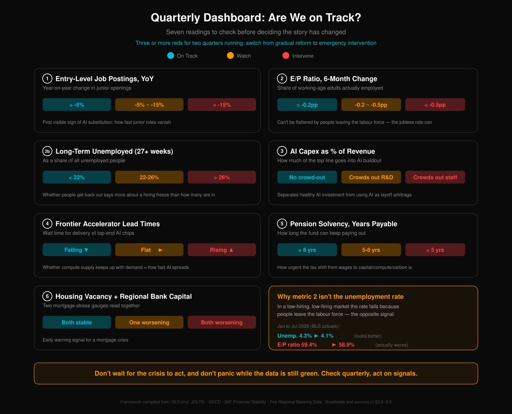

| # | Indicator | Green | Amber | Red | Why it matters |
|---|---|---|---|---|---|
| ① | Entry-level job postings, YoY | > −5% | −5% to −15% | < −15% | The first visible signal of substitution: how fast junior roles disappear |
| ② | Employment-population ratio, 6-month change | > −0.2pp | −0.2 to −0.5pp | < −0.5pp | **Can't be flattered by people leaving the labour force** — see §3.5 |
| ②b | Long-term unemployed (27+ weeks) share | < 22% | 22–26% | > 26% | Whether the unemployed can get out says more about a hiring freeze than how many there are |
| ③ | Corporate AI CapEx / revenue | Rising, not crowding out R&D or headcount | Crowds out R&D | Crowds out headcount | Separates healthy investment from layoff arbitrage |
| ④ | Frontier accelerator lead time | Falling | Flat | Rising | Whether compute supply keeps up with demand, which is what democratisation depends on |
| ⑤ | Pension solvency (years payable) | > 8y | 5–8y | < 5y | How urgently the tax base has to move off wages toward capital, compute or carbon |
| ⑥ | Housing vacancy + regional bank capital adequacy | Both stable | One deteriorating | Both deteriorating | Early warning on the mortgage chain |

**Note that ② uses the employment-population ratio and the long-term unemployment share, not the unemployment rate.** §3.5 laid out why. In a frozen labour market — low hiring, low firing — the unemployment rate moves **down** as people leave the labour force, which is the opposite of the true signal. Any dashboard built around the unemployment rate breaks under this kind of shock.

**Trigger rule: three or more reds for two consecutive quarters means switching from incremental reform to emergency intervention.** Don't wait for the crisis to act, and don't panic while the data is still green. Check quarterly, act on signals.

All six are publicly checkable — BLS, OECD, the IMF Global Financial Stability Report, Fed regional banking data. They measure whether society is taking damage. How fast AI is diffusing is a separate question, and section 3.7 handles it.

### 3.7 Brake Conditions and Scorecard

What could interrupt the main line? The brake conditions are below, and they all obey one hard requirement: **each must be judgeable from public data as pressed or not pressed.**

That requirement is stricter than it looks. An indicator nobody can adjudicate is **worse than having no indicator** — it produces the feeling of monitoring while any outcome whatsoever can be read as consistent with expectation. Two worked examples after the table show what the requirement throws out.

| Brake | Test | As of August 2026 |
|---|---|---|
| **Compute supply tightens** | Frontier accelerator lead times back above 12 months | **Not triggered.** Nvidia's Vera Rubin platform entered full production and began shipping to cloud providers on 21 July 2026 — supply is accelerating, not tightening [123] |
| **Power and interconnection** | An **administrative** interconnection restriction in a major data-center state | **Triggered.** On 3 August 2026 the Governor of Texas ordered the PUCT and ERCOT to audit every data center in the interconnection queue, warning that projects failing to disclose ownership, financial, water and community-impact information could be denied grid access. The ERCOT large-load queue reached **474.7 GW** in June 2026, of which **420.8 GW (90.2%) is data centers** — more than five times the state's all-time peak demand of 91,089 MW on 22 July 2026 [123] |
| **Autonomous driving** | **Time required to enter each new city stops falling as the technology improves** | **Triggered.** As of March 2026, **90.4%** of every rider-only mile ever driven was still concentrated in Phoenix, the SF Bay Area and Los Angeles [129]. This test deliberately avoids "the number of permitted cities stalls" — city count *is* a governance variable, so using it to test whether the constraint is governance is circular. "Does time-per-city fall?" actually discriminates. If the constraint is technical, better generalisation should make each new city markedly faster. If it's accountability, time-per-city is independent of model capability |
| **Humanoid robots** | Unit price >$30k and runtime <4h persisting to 2030 | Open (see §2.5) |
| **Macro demand** | Fiscal or monetary easing triggers real reflation and pushes rates up, forcing AI CapEx to slow | **Not triggered.** As of mid-2026 no hyperscaler had cut its 2026 AI CapEx guidance [123] |

**And a prediction worth betting on.** If the model — the institutional layer improves only with events — holds, it should predict something that hasn't happened yet:

> **The humanoid robotics industry will get a mandatory safety standard within 12 months of the first widely reported fatality, and not before, however good the robots are by then.**

The bet is live as of August 2026. OSHA's own robotics page still says, word for word, "There are currently no specific OSHA standards for the robotics industry." China has a mandatory national standard for autonomous driving, while its humanoid-robot safety standard remains voluntary and still in drafting. ISO 25785-1, which covers dynamically stable legged robots, is still a committee draft [129]. **Meanwhile the sector's global shipments grew 272% year-on-year in the first half of 2026.**

The gap between capability and accountability is widening at a rate you can watch.

**Two notes on how to read this table.**

Start with why the power-and-grid row is written as an *administrative* restriction rather than as "the queue got longer." The more intuitive phrasing would be "average grid-interconnection approval wait exceeds 5 years." It sounds concrete and it's a bad indicator: **no institution publishes an authoritative figure for that average wait**, so the condition can never be confirmed or refuted. It looks like a threshold. It's an adjective.

And when the brake actually got pressed, it came in a completely different form. **Not a longer queue. A political stop.** In August 2026 the largest data-center state in America froze new interconnections outright — an event with a date, an administrative order and a paper trail. **That's exactly what the adjudicable requirement is for. The real turn rarely shows up in the shape you predicted, so the indicator has to track events instead of a phrasing.**

The other note: row one, "lead times back above 12 months," is currently **refuted**. Which is good news. It means this set of conditions really can be contradicted by reality instead of absorbing whatever happens. **A set of indicators that's always right is a set with no information in it.**

## IV. Geographic Differentiation

Surplus intelligence does not fall on the world the way sunlight does. It pools in the handful of places that own the GPU clusters and the cheap power — the United States, China, maybe one Nordic country. What the shock does to a country depends on how its economy is built, what its institutions can actually execute, and what its culture believes about work.

### 4.1 U.S.: Eye of the Storm

The storm starts in America, and America takes the first hit. The reason is simple. No economy on earth leans this hard on white-collar knowledge work.

The displacement spiral is already turning in Silicon Valley: tech layoffs, then white-collar workers taking lesser jobs, then service wages pushed down, then consumption contracting, then more layoffs. San Francisco office vacancy has hit 34% [15]. The number is a signal on its own. Yet AI firms are leasing space as fast as they can sign — Mission Bay, where OpenAI is headquartered, is under 9% vacant, and AI companies took more than a million square feet in the city over the past year [15]. One city, two speeds. The old economy is emptying out while the new one packs itself into a few blocks.

America's political system may turn out to be a liability here. Polarization guarantees that any rescue bill gets fought to a standstill. The right calls redistribution Marxism. The left calls any seat at the table for tech capital regulatory capture. And 2028 and 2032 are both election years. The window when policy is most needed is exactly the window when politics can do the least. Politicians follow ideology. Reality gets a vote much later.

### 4.2 China: Different Script, Same Ending

China takes the same shock down a different road.

The "hundred-model war" will shake out to three or five serious labs. Manufacturing sits right next door to AI and robotics there, so automation arrives earlier and lands harder. Open-source shopping agents — the kind coming out of the Qwen ecosystem — could be what finally hands consumer decisions to machines. And China's institutions can push redistribution and industrial policy through fast. In a crisis that is worth a great deal.

But China has a cultural problem no one else has in quite this form. *Work hard and you will get somewhere* is not a slogan there; it is load-bearing. Study well, get a good job, and the good job buys the apartment, the marriage, the child. The entire society runs on the promise that effort converts into outcome. Break that promise — not because anyone stopped trying, but because effort itself stopped being worth anything — and you have more than an economic problem. You have a collapse of faith.

Now stack the demography on top. China was already aging and short of births, and its young people were already lying flat. Take away what jobs remain and "lying flat 2.0" is no longer a posture anyone chose. It is not that they refuse to compete. There is nowhere left to compete. When a whole generation knows from the start that it will not be needed, what does it decide a life is for? Japan's *hikikomori*, multiplied by ten, is not hard to picture.

### 4.3 India: The Digital Colonization Cascade

If America is the eye of the storm, India may be where the damage is worst.

Indian IT services export roughly $200 billion a year on one selling point: the people are cheap. But an AI coding agent now costs about what its electricity costs, and cancellations at TCS, Infosys and Wipro are accelerating [1]. That is shock one.

Shock two runs deeper: Indian IT holds up an enormous middle class. Bangalore, Hyderabad, Pune — whole cities were built around outsourcing, and around the outsourcing came the apartments, the malls, the schools, the hospitals. IT breaks, housing breaks, retail breaks, municipal budgets break. A single industry's problem becomes a metropolitan recession.

Shock three snaps the migration ladder. For twenty years India's best engineers had one clear route up: IIT, then TCS or Infosys, then an H-1B, then $200,000 a year in the Bay Area, then a house and a green card and roots. Indian engineers became the most powerful immigrant bloc in Silicon Valley. Kill outsourcing, take away America's appetite for that many programmers, and the ladder is gone.

Shock four is the one almost nobody discusses: what this costs America. A large share of Silicon Valley's innovation over thirty years came from immigrants. Engineers from India, China and Eastern Europe carried more than half the industry. If high-skill immigrants no longer have a reason to come, the U.S. ends up somewhere close to Japan — aging, shrinking — except with AI filling the gaps. A country that runs on AI and spends its money on eldercare is not the United States in any sense the word has meant.

Step back and the shape of it is colonial. Intelligence pools where the compute is, and the U.S. and China hold over 80% of the world's AI compute. Everyone else receives AI as a service without owning it and without earning from it. The core holds the decisive means of production; the periphery supplies inputs and demand. That is the old arrangement exactly. The guns are just GPUs now.

Africa, Southeast Asia, South America — some of them will not finish industrializing before they are skipped, dropped straight into an age of intelligence where they have no say at all.

### 4.4 Europe: The Regulator's Dilemma

Europe is in an awkward spot. It regulates AI more aggressively than anyone (the AI Act) and has almost no frontier labs [22][23]. It writes rules for a technology it does not control — safety manuals for a factory on someone else's continent.

Europe does hold one card: the welfare state. High-tax, high-benefit Nordic systems may turn out to be the social architecture that adapts first. Finland was piloting basic income back in 2017. The open question is whether a small experiment survives translation to a country of hundreds of millions, or a billion-plus. Probably not. But a proof of concept is worth something.

### 4.5 The Developing World: When Comparative Advantage Is Erased

Everything above concerns the U.S., China and Europe. More than five billion people live outside those three. For them AI may not arrive as an opportunity at all. It may arrive as a second colonization.

Start with where the compute is. It is extraordinarily concentrated: the U.S. controls about 75% of global GPU cluster performance, China about 15%, the EU 4.8%, and every remaining country splits roughly 6% [59]. The U.S. alone holds 39.7 million H100-equivalent GPUs against China's roughly 400,000 — near a 100:1 gap [59]. This is not a technology diffusing evenly across the planet. It is a strategic resource held by two states. Developing countries have essentially none of the infrastructure.

That concentration is fatal for a specific reason. It is destroying the one advantage poor countries have had: cheap labor.

Running an industrial robot costs about **$0.75 an hour** in power and maintenance. An American worker costs $15–20. A Bangladeshi garment worker costs about $0.50 [60]. Robot prices fell from roughly $47,000 in 2011 to roughly $23,000 in 2022, and are expected to fall another 50–60% [60]. Once the robot costs less than the worker in a poor country, the founding logic of globalization — move production to where labor is cheap — has nothing left to stand on.

**Deglobalization is already underway.** The U.S. announced over 287,000 reshoring and nearshoring jobs in 2023, an all-time record and 27 times the 2010 number [61]. Automation is why. Chinese wages rose more than 200% over two decades, and once American plants installed robots, the total cost gap between producing in Asia and producing next door came out "close to zero" [61].

Country by country:

- **Bangladesh** (textiles): up to 60% of garment jobs could be automated away by 2030. Apparel is over 80% of national exports [62].
- **The Philippines** (BPO and call centers): 1.3 million BPO workers exposed, with ILO data putting 89% of that workforce at high automation risk. BPO is 7.4% of GDP [62].
- **Kenya** (BPO and tech outsourcing): 2.5 million jobs exposed. African BPO could shed 40% of its jobs by 2030 [62].
- **Vietnam** (electronics assembly): $4.30 an hour, and increasingly unable to beat an automated Chinese plant. The whole model runs on FDI-driven assembly [62].

History has a close match for this. In 1750 India made roughly a quarter of the world's manufactured goods. By 1900 it made 2% [63]. British steam mills made handloom work uncompetitive; by 1812 British yarn sold for a tenth of its 1779 price. India went from exporting cloth to exporting cotton. Nobody had to send gunboats. The price did the work.

AI automation may be running the same play. The U.S. and China own the compute and the automated factories — the brain and the body — and sell high-value services and cheap manufactured goods. What is left for everyone else? Cheap data labeling, raw materials, and a market to sell AI services into. That is a colony's job description with the dates changed.

**The counterargument: can AI let poor countries leapfrog?** There is a real precedent. Mobile money let Africa skip retail banking entirely, and there are now 1.2 billion active mobile wallets worldwide [64]. In April 2025 the African Union stood up a pan-African AI council in Kigali with a $250 million budget [64]. AI agricultural tools like PlantVillage Nuru let a smallholder diagnose crop disease from a phone.

The analogy only stretches so far. Mobile payments are simple enough to own locally. AI's inputs — compute, data, researchers — sit almost entirely in two countries. Without domestic compute, a country consumes AI instead of producing it, which is the raw-materials-for-finished-goods arrangement in a new costume. World Bank President Ajay Banga has said publicly that he doubts developing countries can genuinely leapfrog on AI [64].

And the sharpest difference from the Industrial Revolution is **speed**. Steam took decades to hollow out Indian handicrafts. Software ships at zero marginal cost, and AI may erase comparative advantage in a few years. UNCTAD warns that AI could touch 40% of jobs worldwide, while two-thirds of advanced economies have a national AI strategy against 30% of developing countries and 12% of the least-developed [62].

---

## V. Population Decline: Not a Crisis, a Natural Law

One misreading to clear away first: **living longer does not backfill a shrinking workforce.** Longevity technology reaches a small, wealthy group first and stays expensive for a while. It adds people to the old-age column without adding anyone to the working-age column. If AI has already taken the jobs, longer lives make the dependency arithmetic worse, not better. Nothing about it restores a demographic dividend.

### 5.1 Pro-Natalism Has Already Failed

Fertility is falling everywhere, and the fall is historic. South Korea's total fertility rate is 0.72 — the lowest ever recorded for a human society [5]. China is at 1.0, Japan 1.2, Italy 1.2, Spain 1.2 [4][5]. Global TFR went from 5.0 in 1950 to about 2.3 today [21]. The UN projects 1.8 by 2100, with world population peaking around 2084 and shrinking after that [6]. The Lancet/IHME work is gloomier still, projecting that falling fertility will reshape the global population picture "dramatically" [7].

Almost every rich country is trying to buy births, and Korea is the case that settles the argument. More than $280 billion over two decades: baby bonuses, tax breaks, childcare subsidies, housing preferences, even state-funded matchmaking events [8]. Fertility went from low to lower. Research finds that roughly 74% of the money went to people who were going to have the child anyway [9]. Getting Korea back to replacement would take a program **fifteen times larger** [9]. Japan tells the same story: the cash was paid, the leave was granted, and the long hours, the housing costs and the education costs stayed exactly where they were. Money does not fix a structure [8].

Governments spending hundreds of billions on births are, in effect, spending against the direction of their own civilization. That is a losing trade. Fertility has fallen alongside human progress every time: richer, better educated, more independent women, fewer children. Calling it a "problem" gets the sign wrong. People chose a different life and got it.

### 5.2 The Economics of the Marriage-and-Childbearing Collapse

Falling fertility does not stand alone. Upstream of it sit a collapsing marriage rate and a rising divorce rate, and underneath all of it sits arithmetic.

Chinese marriage registrations fell from 13.47 million couples in 2013 to 6.10 million in 2024 — down 55%, the lowest since the series began in 1986 [24]. First marriages dropped below 10 million for the first time. The U.S. marriage rate fell from 8.2 per 1,000 in 2000 to 6.1 in 2023, a 25% decline [25]. Across the OECD the average went from 5.1 to 3.8 per 1,000, and the age at first marriage slid from 25 to 32 [26].

Divorce moves in a stranger pattern. China peaked at 3.36 per 1,000 in 2019 and has come down since, helped along by the mandatory cooling-off period [24]. The American divorce rate fell from 4.0 to 2.4 per 1,000, but "gray divorce" — age 50 and up — is now close to 40% of the total [25]. The old generation is separating while the young one never signs up. Divorce did not get rarer because marriage got better. People stopped daring to marry in the first place.

Why? Because the return on marriage and children is collapsing.

A child in an agricultural economy was a productive asset: one more child, one more pair of hands, positive return. A child in an industrial economy was insurance: raise a son, retire on him, long-duration investment. In the AI economy the sign flips. Raising one child to 18 costs 6.3 times per-capita GDP in China — about ¥538,000 — the second-highest ratio in the world, well past America's 4.1x and France's 2.0x [27]. And as AI outproduces the median person, whatever that grown child can eventually contribute is worth less, not more. Costs climb, returns fall. No rational actor signs that deal.

None of this is about culture or attitudes. It is arithmetic. When productivity stops needing population to carry it, and the cost of raising a child keeps climbing while the expected payoff keeps sliding, people have fewer children. Pro-natalist subsidies are not fighting a bad policy. They are fighting a price.

#### 5.2.1 The Unbundling of Marriage: Four Things Tied Together, Then Loosened One by One

The arithmetic above explains why people are not having children. It does not touch the other half — **why they are not marrying at all.** For that, the word "marriage" has to come apart.

In the old arrangement, one status carried four separate things: **economics, love, sex, reproduction.** "Wife" and "husband" were single labels for four merged roles. **But the four are different in kind and obey different laws.** Bundling them suited a particular set of productive conditions. It was never a law of nature.

**Economics comes first, because marriage is first an economic institution.** It is a long-term cooperation contract: pooled expenses, shared risk, a division of labor. Where one party — usually the woman — could not readily earn on her own, that contract was rational for both sides. In many traditional societies the premise of a marriage was not romantic love in the modern sense at all. It was an arrangement over lineage, property, labor and children.

**Then love, where two different things get confused with each other: passion and attachment.** Passion is a chemical storm with a shelf life. Even between two well-matched people, being in love rarely survives past three to five years. "The seven-year itch" has lasted as a phrase because it describes the norm, not the exception. What follows is not necessarily the end of the relationship. Usually it is a substitution — attachment, commitment, the working partnership of a shared life, what people describe as *like family*, *like comrades*, *like roommates*. **The point is not that love dies. The point is that marriage cannot hold passion in place, and what it actually rests on is whatever is left once passion recedes.**

**Sex is messier than either, but it moves in one clear direction.** It came loose from marriage's exclusivity early and visibly, and it has market and quasi-market substitutes.

**Reproduction is last and heaviest.** It demands long-term cooperation and a large commitment of resources, its cost rises with development, and its returns get less certain the richer a society becomes — the exact arithmetic run at the top of this section.

**Separate the four, and the last several decades reduce to a single sentence: they have been coming unbundled, one at a time.**

Once women could earn independently, **the strongest layer of dependence inside marriage weakened.** For a great many women, marriage stopped being a survival requirement. Passion never needed marriage and was never held by it. Sex kept getting easier to obtain. **What is still tightly bound to a long-term contract, out of the four, is mostly reproduction.**

**And reproduction is the most expensive of the four, with the least certain payoff.**

> **When the least substitutable part of an institution is also its most expensive function, demand for that institution stops being inelastic.**

Three honest qualifications, none of them comfortable for the argument. **Marriage is not thereby "useless"** — it still supplies default legal rights, property and inheritance arrangements, a kinship network, social recognition, and the institutional force that pins down responsibility for a child. None of that is in the four, and none of it has come unbundled. **What the framework supports, then, is a decline in exclusivity and in inelastic demand. It does not support "marriage will disappear."** **And competing explanations for falling marriage rates are real** — housing costs, job insecurity, the delay that comes with longer schooling. This mechanism does not rule any of them out. It offers one thread they cannot pick up: **why it is the most educated and most economically independent who exit the most completely.**

The same framework picks up a few things that otherwise each need their own explanation. **Take "a child is the crystallization of love."** It only works if the four things are one thing; pull them apart and the sentence fails to line up on any timescale, since passion runs in years and reproduction runs in decades. **Or take the fact that marriage rates fall as women's education rises.** The layer she loosens first is economic dependence.

**Now, what AI does inside this.** The word "economics" has to be split in two here or the argument contradicts itself. One layer is **dependence on a spouse's income.** The other is **the real cooperative work of two people carrying housing, childrearing, care and risk together.** **AI can accelerate substitution for companionship and emotion, and for part of sex. It cannot substitute for that second layer, and it cannot substitute for reproduction.** So AI does not stop people from marrying. What it does is **narrow the remaining reasons down to reproduction and real-world cooperation** — which happen to be the two heaviest and most expensive.

#### 5.2.2 Equality Is a Companion of Development, and So Is the Tension

Nobody chose the unbundling. Development did it.

**Economic development generally brings an expansion of women's education and of their chances to work**, and on education the reversal is already finished: OECD data for 2024 put tertiary attainment among 25-34 year-olds at **55% for women against 42% for men, a 13-point gap in women's favor** [142], and that is the direction in the large majority of member states, with Mexico among the few exceptions.

**Be precise: reversing education is not equality across the board.** Income gaps, the motherhood penalty, the division of housework, bargaining position inside a marriage — none of those reversed in step, and some have barely moved at all. **The claim here is narrower. On education and economic independence, women's position has moved far enough to change the marriage market.**

The cross-national evidence points the same way. Esteve and colleagues, working through 420 samples across 120 countries from 1960 to 2011, found that as women's educational advantage rose, so did the share of couples where the wife is the more educated partner — **men's upward-matching advantage on education has already ended in many countries** [143]. An analysis of 27 European countries across seven birth cohorts finds the same: upward matching falls by cohort, downward matching rises [144].

**Which produces a tension that cannot be argued away: a marriage-and-childbearing structure premised on "he provides, she does the domestic work" cannot keep its old stability while women's education and income keep rising.**

Note the qualifier in that sentence. It does not say equality and childbearing cannot coexist. There have always been several versions of the structure — male-breadwinner, dual-earner, state-childcare, grandparent-supported. **What it says is that one particular version is losing the conditions it ran on.**

There is a popular explanation to deal with here: **"only half-equal."** The public sphere equalized, the domestic sphere did not keep up, and fertility collapsed in the gap; the Nordics, being more equal at home too, held theirs. **That looked right in the 2010s. Its strong version did not survive the last decade — Nordic total fertility rates have all fallen to record lows, and the gap with East Asia has narrowed sharply.**

**But say exactly what that overturns.** It overturns the **strong version**, that domestic equality alone holds fertility up. It leaves the weak version standing: unequal domestic labor really does depress fertility. **Both can be true. Equality at home cushions the decline without being sufficient to stop it.**

So what accounts for the rest? **Once marriage and children stop being conditions of survival and become an optional arrangement, people price them the way they price anything optional** — against opportunity cost, relationship quality and future risk. When the expected return stops covering the cost, entry falls. **Morality did not change here. The pricing benchmark did.**

#### 5.2.3 The Chinese Version: Urbanization Made the Mismatch Spatial

China runs the same mechanism with one extra layer on top: **urbanization at extraordinary speed.**

The urban share of China's population went from **19.39%** in 1980 to **67.9%** at the end of 2025 [145]. That is one of the largest and fastest migrations in human history, and it was not gender-neutral.

**What waits back home is distributed asymmetrically.** The law is clear enough — Article 1126 of the Civil Code gives equal inheritance rights regardless of sex, and Article 6 of the Rural Land Contracting Law gives women equal contracting rights. **Enforcement is another matter.** The Third Survey on the Social Status of Women in China (2010) found 21% of rural women without land against 11% of rural men. National surveys from the same period found 92.4% of men reporting contracted land in their own name against 81.2% of women, and among those who lost land after a change in marital status, 8.1% were women against 1.1% of men [146]. **Stated accurately: men are on average likelier to keep some share of what they could go back to, and women are more easily written out of land and village entitlements.** That is a difference of degree, not a binary. And whether anyone actually has somewhere to go back to also turns on their parents' housing, homestead eligibility, local work, whether the family will take them in, and village rules. Land is one item on that list.

The asymmetry shows up plainly in the marriage data:

- **Never-married older men cluster in the countryside.** The 2020 census counted 8.82 million never-married rural men aged 35 and over, **5.7%** of that group, against **3.62%** in cities. Among never-married men aged 50 and over, rural areas exceeded cities by **2.03 million** [147].
- **Marriage probability drops sharply for highly educated urban women.** Work drawing on the Chinese General Social Survey and the China Family Panel Studies finds that among urban women over 27, a university degree cuts the probability of marriage by **2.88%-3.6%**, and a postgraduate degree cuts it a further **8.4%-10.4%** [148].
- **Marriage migration runs one way.** A study built around "bride drain" finds that the outflow of rural women measurably lowers rural men's chances of marrying and amplifies the effect of the sex-ratio imbalance — **and it found no matching "groom drain"** [149].

Do not flatten this into two groups facing off. **Plenty of less-educated women also work in urban services, and plenty of highly educated men are also concentrated in the big cities.** What is being described is not where the population physically sits but **how the marriage market fails to clear** — unmarried men in counties and villages are relatively weak on education and income, while urban educated women's search radius, income expectations and way of living simply run past them.

**The mismatch is educational at its core; urbanization gave it a map.** A 2026 study estimates that between 1999 and 2019 the probability of a single person in China marrying **fell to half its 1999 level**, and that **shifts in the supply structure of the educated population account for roughly half of that decline** [150]. Note what that evidence actually points at: **educational-structure mismatch.** Geography is how that mismatch shows up in space. The two are different things and should not be allowed to stand in for each other.

**And one thing has to be said in the same breath: none of this reads as "so leave the property to the son."**

**Take the opposing case at its strongest, stated the way its own advocate would state it.** Where the man carries the cost of the marital apartment and the bride price, a family concentrating resources on the son **may genuinely be acting rationally at the level of that one family.** It raises his relative standing in the marriage market. That micro-level judgment probably has empirical support behind it, and nothing here denies it.

**It just does not scale.** No evidence suggests that generalizing the strategy raises the rate at which the society as a whole successfully matches. Generalized, it reinforces son preference instead. China at one point had roughly 32 million more males than females under the age of 20, and the marriage market was made worse by that collective behavior itself [151]. In a market where women are scarce, the chance of marrying concentrates among higher-income men and compounds with stratification by income, housing and education. **Overall matching does not improve. Stratification sharpens.** Evidence runs the other direction as well: after China's 2001 divorce reform strengthened women's property rights, families whose first child was a girl were **8.1 percentage points** less likely to go on to have a boy [152].

**So the conclusion here is the opposite of "son preference has a point."** A marriage-and-childbearing contract premised on a gendered division of labor and on women giving up opportunity **cannot survive development.** You cannot stop women from being educated and from earning, and once they can support themselves, you cannot expect them to keep signing the old contract on the old terms.

**Be clear about where this chain stops, too.** Falling fertility is not something a single policy failure explains. It is what you get when development, women's independence, the cost of raising children and institutional mismatch all push in the same direction. **Policy can bend the slope. It has rarely restored the old structure** — the failed pro-natalist programs in section 5.1 are the evidence.

**And what it lends Chapter IX is limited: population decline on its own does not imply a silicon succession.** What it does is weaken one default assumption — that human numbers keep going up. The species divergence and non-carbon continuation Chapter IX takes up need their own argument. This section supplies demographic background and stops there.

**(Falsification condition)** This mechanism can be overturned. **If a society with high female education, high female income, a relatively equal division of domestic labor, and sharply lower housing and childcare costs sees total fertility return durably to near replacement while the marriage rate recovers alongside it, then "marriage and childbearing became optional, so fertility fell" has to be rewritten.** If instead fertility rises only slightly once all those conditions improve and never returns to old levels, that points at post-development opportunity cost and unbundling as the real driver, rather than the degree of equality. Ten to twenty years of data from the Nordics, East Asia and parts of Central Europe will settle it.

### 5.3 The AI–Fertility Spiral

It gets worse from here. The mass layoffs described in Chapter II — white-collar unemployment, pay cuts, downgrades — will knock out the last support fertility has. When do people stop having children? When income stops being predictable. If you are barely covering the mortgage, you are not planning a baby.

Another self-reinforcing spiral:

**AI takes the jobs → income becomes unstable → nobody dares have children → population falls → society leans harder on AI → AI takes more jobs**

For men the hit lands twice. In most cultures a man's sense of himself, and his standing with everyone around him, still runs through what he earns; providing is both an expectation and a source of confidence. And the employment shock in Chapter II falls squarely on male-dominated work: truck drivers (roughly 100 million driving jobs worldwide, overwhelmingly men), blue-collar manufacturing (humanoid robots), junior programmers and financial analysts (replaced outright). When a man loses his income he loses more than the income. He loses the belief that he is in a position to start a family.

The data are consistent. Economic research keeps finding the same elasticity: a 1-point rise in male unemployment cuts the marriage rate by roughly 1.5–2% [88]. In China, a car and an apartment are the entry ticket to the marriage market, and as AI layoffs push more men under that bar, they are not opting out. They do not dare opt in. Japan already ran the experiment: thirty years of stagnation took the male lifetime-never-married rate from 5% to 28%. "Herbivore men" was never a cultural preference. It was economic despair with a nicer name [88].

Women are being hit too — customer service, administration, accounting, HR, junior legal work, medical clerical roles. Those heavily female white-collar jobs are exactly what large language models do best. So the story is not "men lose jobs while women get independent." **Both sides are losing economic security. Men are additionally losing an identity.**

The deeper problem sits underneath all of it: **the return on marriage itself is going to zero.**

Traditional marriage was an economic transaction, and its return used to be positive. In the agricultural era he worked the land, she cooked, raised the children, held the household together — a division that survival required, because one person could not do all of it. Industrialization kept the shape: he earned, she managed. The return was legible and countable. Two people were far more efficient than one.

The AI era takes that apart piece by piece. Cooking? Delivery in thirty minutes. Cleaning? An hourly worker on demand. Laundry? A washer-dryer. Loneliness? A chatbot at 3 a.m. that never argues, never goes cold on you, never runs out of patience. Sex? AI-enabled companion products are iterating fast, and not only the physical kind — companions built on large language models, with emotional interaction, personalized memory, even "personality growth" [89]. Japan's relationship-AI industry is already worth billions. China had over **30 million** AI virtual-companion users in 2024, 70% of them men [89].

When every function marriage supplied — economic complementarity, household labor, companionship, sex — can be bought or simulated at lower cost and with less friction, the functional case for marriage narrows to one item: children. And that item's return is collapsing on its own (section 5.2).

The loop reinforces itself at several points: **AI layoffs → both sexes lose economic security → economic complementarity disappears → AI absorbs the demand for company, emotion and housework → the reasons to marry go to zero → no marriages, no children → population shrinks faster → society leans harder on AI.**

Same as the displacement spiral in section 2.1: nobody stops voluntarily. Korea's 0.72 was measured in a period of relative stability, before AI had penetrated anything at scale. Once the layoff wave actually lands, with AI companions eating what remains of marriage's functional case, 0.5 or lower is not a stretch. When 100 million driving jobs, tens of millions of factory jobs and tens of millions of office jobs contract at once, and living alone keeps getting more comfortable, what takes the damage is not only GDP. It is the will to reproduce.

### 5.4 Robot Caregiving: Where It Actually Stands

Here is the counterintuitive read: put AI into the equation and population decline stops looking like a crisis. It starts looking like a natural law, maybe even an adaptation.

The standard worry runs: fewer people, not enough labor, shrinking economy, nobody to support the old, collapse. Which is why governments push births — they need young people to work, pay tax and carry the elderly. But if AI and robots supply the labor, the premise falls apart. Factories without workers. Software without programmers. Hospitals diagnosing with AI and providing care with machines. Then "we need more young people to work" is simply no longer true.

Japan is already doing it. The government has subsidized care robots for nursing homes since 2015 [10]. Korea has put more than 5,400 AI companion robots into 115 local governments. An AI doll called Hyodol talks to elderly users in the voice of a seven-year-old, sings, and runs cognitive exercises [11].

All of it is crude right now, and the robots still need people to maintain them. But at the rate this book opened with — ten years is enough to change everything — the care robot of twenty years from now will have nothing in common with today's product.

Maybe the right question was never "how do we get people to have more children." Maybe it is "how does a society keep running while its population naturally shrinks." The answer may well be AI and robots. What sees humanity through its last years will not be its grandchildren. It will be its machines. That sounds cold, and it may also be more reliable. A machine does not get impatient, does not abuse the person in its care, does not stop speaking to the family over an inheritance, sits up all night, and is always there.

There is a longer implication. If humanity no longer needs a large population to run its economy and care for its old, the population keeps falling. In a few centuries there could be a tenth as many "natural humans" as there are today, and the overwhelming majority of the planet's residents will be AI and robots. Humans become a minority on their own planet. That is not science fiction. That is today's trend line drawn out a hundred years.

### 5.5 What This Means for Policymakers: Production Isn't the Problem. Distribution Is.

Put the previous four sections together and the conclusion for anyone running a country is already clear. Most decision-makers are still using the wrong frame.

**Pro-natalism has been falsified.** Korea spent $280 billion and fertility went down. Every developed country's data point the same way: you cannot subsidize your way past a price. Money spent forcing births is money spent on a strategy already known not to work.

**Put it into AI and robotics instead.** That is the actual replacement for the demographic dividend. The traditional logic — fewer people, not enough labor, shrinking economy — assumes labor can only come from humans. A humanoid robot works around the clock, takes no leave, needs no benefits, and gets cheaper every year. As productive capacity it beats a child who cannot work for twenty years, and it is not close. China is pointed in the right direction: a plan to train 30 million workers in AI skills over 2025–2027 [100], and 90% of global humanoid robot shipments [36].

**But production was never the hard part. Consumption is.**

This is the most important piece of the transition and the one most consistently skipped. When AI and robots take over human labor, GDP may soar — and none of that growth **runs through paychecks**. Robots do not draw wages, do not pay into social insurance, do not shop. The traditional circuit looks like this:

**Labor → Wages → Consumption → Business revenue → Taxes → Social services**

AI does not break a link somewhere in the middle. It breaks the first one. Take out labor and everything downstream goes with it. GDP rises while money stops reaching ordinary people. Productivity explodes while consumption contracts. It is the Ghost GDP problem from section 2.3, replayed inside the social safety net.

**So what policymakers need is not more births. They need to rebuild distribution, so that what AI and robots produce reaches human consumers.** The candidates:

- **Compute tax or robot tax**: charge firms that replace human labor with AI, and use it to plug the social insurance gap. The hard part is global coordination — whoever taxes first loses competitiveness first (the prisoner's dilemma laid out in Chapter VI).
- **AI output dividends**: convert part of AI companies' profit or equity into a universal dividend. Alaska's Permanent Fund has paid every resident $1,000–2,000 a year out of oil revenue for over forty years. An AI resource dividend is the same idea with a different resource.
- **Universal basic income**: Finland's pilot showed better well-being and lower psychological stress [33]. The question was never whether to pay it. The question is where the money comes from. Shift the tax base from labor to compute and data and UBI has a funding source that holds.
- **Investment in retraining and education**: instead of subsidizing births, build lifelong-learning infrastructure that keeps the people already alive economically engaged. China's eight-grade technician system and its 30-million-worker training plan [100], the UK's Lifelong Learning Entitlement [99] — early attempts in the right direction.

(The full sequencing for these four — which belong to the 0–5 year "buy time" bucket and which to the 5–15 year "rewrite distribution" bucket — is in Chapter XI §11.2.)

**One line: do not manufacture more people to compete with machines. Make sure what the machines produce reaches people.** AI and robotics are already solving production. Distribution on the consumption side is the variable that decides whether the AI era reads as prosperity for everyone or bankruptcy for everyone. And it is not a problem for the 2030s. When the first wave of mass layoffs lands — this book's estimate is 2028–2030 — a distribution system that is not ready turns Ghost GDP into a real social crisis.

---

## VI. The Financial Chain Reaction

### 6.1 Mortgages: Good Loans, Bad World

The U.S. residential mortgage market is $13 trillion [1]. FICO 780, 20% down, spotless credit. In 2008 the loans were bad the day they were written — subprime borrowers could not repay, full stop. This time is the opposite. The loans were good the day they were signed. The world changed afterward.

San Francisco home prices are down 11% year over year, Seattle 9%, Austin 8% [1]. White-collar workers who took a pay cut or a downgrade keep paying by running the credit cards and pulling early from the 401(k). Technically current. Practically **zombie households** — not a default in anyone's data, and out of the economic circuit all the same.

Follow it down a few layers.

**The wealth effect comes first.** In America the house is the middle class's biggest asset. Falling prices make people feel poorer, and people who feel poorer spend less even before anyone loses a job. Psychology amplifies the real contraction.

**Then local budgets.** American public schools, fire departments and police run on property tax. An 11% decline in San Francisco means school budgets cut, teachers let go, classes merged, quality degraded. Families with money move their children to private schools; families without are stuck in a system getting steadily worse. So the AI shock can widen educational inequality along this chain — though that is not the only way it can go. AI can also be an equalizer in education: a child with ChatGPT or Claude has an infinitely patient private tutor, the kind only the rich used to be able to buy. Everything depends on whether the children who need those tools most can actually reach them once the school budget is gone.

**Then the fragility of tech cities.** The worst price declines are exactly where the tech is — San Francisco, Seattle, Austin. Those cities spent a decade prospering on one industry. Tech lays off, prices fall, restaurants close, service jobs go, people leave, the tax base shrinks, the infrastructure decays. Detroit took thirty years to do that [17]. San Francisco could do it in five.

To make the chain usable, here is a crude stress test — swap in your own city's numbers:

- Inputs: local home prices year over year (%), unemployment rate (%), local banks' residential plus commercial loans as a share of assets (%), average LTV, average rate.
- Assumptions: prices fall another x%, unemployment rises another y points; default rates scale roughly linearly with LTV and unemployment together, using elasticities from local 2008 data as a reference.
- Outputs: a rough capital shortfall for regional banks, plus the contraction in the local property-tax base. A capital gap over 3 points combined with a tax base down more than 10% puts de-urbanization risk in the high zone.

Not an actuarial model. Just a way to pin the narrative to numbers you can look up.

Put longevity on the same worksheet. Working years get shorter because of unemployment and automation while retirement years get longer because of medicine, so the pension and healthcare gaps widen from both ends at once. As long as the tax base rests mainly on payroll rather than on capital or compute dividends, that gap does not close by itself.

All of which is still only America. Widen the frame and this is a **$25 trillion** problem spanning borders.

#### 6.1.1 The Mortgage Panorama Across Three Blocs: A $25 Trillion Domino

| Economy | Mortgages outstanding | Crisis status |
|---------|----------------------|---------------|
| U.S. | $13.1T (2026Q2, NY Fed) | Future risk (AI-driven) |
| Euro area | €5.50T ≈ $6.4T (June 2026, ECB) | Relatively stable |
| China | ¥36.29T ≈ $5.4T (2026Q2, PBoC) | **Already happening** |

Together the three blocs carry roughly **$25 trillion** in mortgages, converted at the ECB's August 2026 reference rates (€1 = $1.1605, $1 = ¥6.74). This is not somebody's published aggregate; it is three official series added together. Bring in the UK at around £1.7 trillion, plus Switzerland and the non-euro Nordics, and the number goes higher. America's mortgage crisis is still a projection — good loans meeting a bad world has not happened yet. China's is not a projection. **It is in year five.**

#### 6.1.2 China: Present Tense, Not Future Tense

The American story is that AI may turn good loans bad. China's story is more tangled and more urgent: **the property system already has structural defects, and the AI shock arrives on top of them.**

**The developer collapse is finished business.** Evergrande: over **$300 billion** in liabilities, ordered liquidated by a Hong Kong court in January 2024, delisted from the HKEX in August 2025. On August 20, 2026 a Shenzhen court sentenced founder Xu Jiayin to life imprisonment at first instance and fined Evergrande Group and Evergrande Real Estate a combined **¥15.8 billion**. Country Garden: about **$11 billion** of dollar bonds defaulted in October 2023, with the restructuring covering **$17.7 billion** of offshore liabilities taking effect on December 30, 2025 and cutting roughly **$11.7 billion** of debt. Vanke: a 2025 net loss of **¥88.56 billion**, the largest single-year loss any A-share developer has ever posted. S&P cut it to "selective default" and Fitch to "restricted default," which means it executed a distressed restructuring rather than avoiding one; it carried about **$21 billion** of short-term debt against roughly **$8 billion** of cash at the end of September 2025, kept breathing by **¥33.5 billion** in cumulative shareholder loans from Shenzhen Metro. This is not a set of company-specific failures. It is an industry going down together [118]. Sunac ($9.6 billion), CIFI ($6.85 billion) and Sino-Ocean all completed offshore restructurings in the same cluster at the end of 2025 — **but wiping debt off a balance sheet is not recovery**: in January–June 2026, property development investment fell **18.0%** year over year and new starts fell **23.4%** [118].

**Unfinished apartments are a uniquely Chinese scar.** Pre-sales let developers collect the whole purchase price before pouring concrete. When the cash chain snapped, buyers who had paid a deposit and started servicing a mortgage discovered the money was spent, the loan was still due, and the site was dead. In the summer of 2022, owners at **320 projects across more than 100 cities** stopped paying [119]. As of end-2022 Nomura estimated roughly **20 million units** sold and unbuilt, needing about **¥3.2 trillion** to finish; Goldman Sachs put the cost of clearing inventory back to 2018 levels above **¥7 trillion** [119]. The "deliver the homes" campaign runs on commercial bank loans approved under a government whitelist — the end-2024 target was ¥4 trillion, and by September 2025 approvals had passed **¥7 trillion**, delivering over **7.5 million** stalled units [119]. The money doubled. Against 20 million units, the hole is still there.

**Prices have fallen five years running, and the decline has stopped moving as one.** In February 2026, new-home prices across 70 cities were down **3.2%** year over year, the steepest in eight months [120]. By July the drop had concentrated in lower-tier cities and the secondary market: new homes −1.1% in tier 1, −2.8% in tier 2, **−4.2%** in tier 3; existing homes −3.7%, −5.1%, **−5.8%** [120]. Compared with the start of the year, tier 1 is healing — tier-1 existing homes narrowed from −7.6% in February to −3.7% in July, with July turning **+0.2% month over month** — while tier-3 new homes widened from −4.0% to −4.2%. **The repair is happening in the core cities only** [120]. Shanghai is the one tier-1 city where new-home prices are still up year over year, and even there the gain narrowed from +4.2% early in the year to **+3.0%** in July; its secondary market never rose at all [120]. National new-home sales fell to **¥8.39 trillion** in 2025, down 12.6%, about **46%** of the 2021 peak of roughly ¥18 trillion [120]. In June 2026 Fitch cut its full-year sales forecast from −7–8% to **−11–13%** while projecting average new-home prices down **2–3%**. As of July the price call is roughly on track. Reality overtook the volume call [120].

**The vacancy numbers are hard to look at.** Somewhere between **65 and 80 million** homes stand empty nationwide — enough to house all of Germany [20]. One former official said it out loud: even 1.4 billion people probably could not fill China's empty apartments. Tier-2 and tier-3 vacancy runs **25–40%**, with 18 to 20 months of inventory [20].

**Households are deleveraging on purpose, and picking up speed.** Outstanding residential mortgages have fallen three years in a row, and the declines keep widening: **¥37.01 trillion** at the end of 2025Q4 (−1.8% year over year), −3.1% in 2026Q1, and **¥36.29 trillion** (**−3.8%**) at the end of 2026Q2 [121]. Household leverage fell from 59.4% at end-2025 to **57.7%** in 2026Q2, and aggregate macro leverage posted its first quarterly decline since 2022 over the same window [121]. CICC estimates mortgage repayments ran at roughly **14%** of outstanding balances at one point, against about 12% in 2021 — households are not expanding consumption, they are racing to get out of debt [121]. This is Japan's balance-sheet recession almost line for line, with one difference. Japanese households deleveraged after the bubble burst. Chinese households started **before the AI shock has even arrived**.

**Now add AI.** This is the part that should worry people. China's crisis so far is developer leverage plus a demographic peak. On this book's projection, once the 2028–2030 wave of white-collar displacement lands, the middle-class households still current on their mortgages become candidates to stop paying. China is not facing one crisis. It is facing **three stacked on each other**:

1. **The existing crisis**, already here: stalled projects, developer defaults, falling prices
2. **The demographic crisis**, accelerating: population shrinking since 2022, demand contracting with it
3. **The AI employment crisis**, still ahead: middle-class income falls, mortgages stop being serviced, and a developers' crisis becomes a households' crisis

America's mortgage problem is good loans meeting a bad world — a hypothesis. China's is structural defects meeting demographic collapse meeting an AI shock — and it is already running.

### 6.2 From Income Repricing to Municipal Finance: Three Different Paths

**The minimum claim of this section and the next, stated up front. Everything that follows narrows it rather than retreats from it:**

> **AI will not empty out cities in general. It raises the financial fragility of one class of city — high housing costs, high white-collar exposure, high household leverage, municipal finances leaning on property and land — which may show up first as mortgage stress, contracting consumption, an eroding tax base, and a change in who lives there.**

**The first link is the easiest one to skip past: in that class of city, the labour income AI reprices first overlaps heavily with the labour income that services large mortgages.**

They are not the same set, and that needs saying immediately. High-mortgage households include doctors, civil servants, contractors, business owners and dual-earner couples. Plenty of high-exposure workers are young renters or outsourced staff with no mortgage at all. **But in expensive cities dense with tech, finance, law, consulting and back-office operations, the two sets overlap a great deal.** And note something banks tend to miss: much of the "stable cash flow" they prefer carries **low** AI exposure. Doctors, nurses, teachers, public employees, police and military, utilities, monopoly service roles — steady income, and not in the first wave. **The real overlap is a narrower block:** fixed employer, verifiable income, a predictable raise curve, **and** work made mostly of standardizable cognitive tasks. In those cities, that block is a large share of the white-collar population.

**So this shock does not scatter randomly. It has an address.**

**One precondition first, or the chain is empty: high exposure is not the same as net harm.** AI can substitute for a role or complement it. The same exposure can end in redundancy or in doubled output, higher pay and a better job. **The chain below only starts if substitution beats complementarity and produces observable income discounts or employment instability.** Nobody can settle that in advance. It has to be watched.

Granting that substitution wins, the steps from "an occupation gets repriced" to "a bank is in trouble" still cannot be skipped: **exposure rises → income gets more volatile, layoff cycles shorten, re-employment comes with a wage discount → highly leveraged households run a cash-flow gap → default.** The concentrated risk is not all white-collar workers. It sits with **households carrying high leverage, a single income, or two earners in the same affected industry.**

Subprime in 2008 was a problem of loans that should never have been written. This time the loans were written correctly, and the borrowers' occupational category is being repriced underneath them.

The middle class is what a modern economy is built on. They buy the homes, do the spending, pay the taxes, service the debt. The circuit turns on them.

**But "bank crisis" needs unpacking, because three risks travel completely different roads.**

**Start with commercial real estate, and note that it is a parallel pressure rather than a consequence of any AI income shock.** Nearly $1 trillion of U.S. commercial real estate loans mature in 2026 [16], a fifth of it offices, all of it priced on the assumption that offices stay full. San Francisco office vacancy is 34% [15]. **But be exact about causes: that vacancy comes mostly from remote work becoming normal, from higher rates, and from valuations repricing — all of which happened before AI displaced white-collar work at any scale.** Charging it to AI's account inflates AI's explanatory power. It belongs in this section for a different reason: **it lands on the same banks' balance sheets as the income shock.** Of the three risks it hits regional bank capital most directly, because local development and commercial lending is concentrated in exactly those banks.

**Residential mortgages travel a slower and less direct road, and national mortgage design sends the same shock in completely different directions.** U.S. residential lending is dominated by 30-year fixed rates, so "the reset lifted the payment" is not an American mechanism — **in the U.S. the pressure can essentially only arrive through income.** In floating-rate or short-reset markets — the UK, Australia, China, Hong Kong — rates and income are two independent triggers that can fire together. **This section is about the income channel. Blending mortgage regimes together produces the wrong timetable.** And U.S. residential mortgages are largely absorbed by government-sponsored entities and the securitization market, so they need not sit on a regional bank's books at all. **Residential default therefore hits house prices, local consumption and the tax base well before it hits bank capital.** Whether it ever becomes a banking problem depends on whose balance sheet eats the loss — a function of LTV, the size of the price decline, insurance and securitization structure. You cannot read it off the size of a single loan.

**The third risk is the concentration itself.** Several thousand U.S. regional banks hold assets bunched into local mortgages and local commercial property. When a city's anchor industry takes a hit, both asset classes deteriorate at the same time. That is a concentration problem, not a bad-loan problem.

**One analogy has to be ruled out here.** Silicon Valley Bank failed in 2023 on duration mismatch, unrealized bond losses and a concentrated deposit run [16] — **not** on local mortgages or commercial property. What it demonstrates is that a regional bank with concentrated exposure can come apart fast under a confidence shock. It is **not** a rehearsal for the mortgage chain.

**Between banks and cities there is still a fiscal step.** A bank failing does not leave the roads unrepaired. Municipal maintenance is paid for out of local revenue, special bonds and utility charges. The full chain is: **defaults and vacancy → falling prices and assessed values → falling local revenue → higher financing costs → deferred services and maintenance.** But that middle link runs on two different machines in the U.S. and China and cannot be written as one. **In America it is a shrinking property-tax base plus widening municipal-bond spreads. In China it is falling land-sale revenue, tighter refinancing for local government financing vehicles, and deeper dependence on transfers from above.** Both end at deferred public services. The thresholds, the buffers and the political constraints are nothing alike. A banking crisis amplifies this chain; it is not the only thing that carries it. And the FDIC's role needs stating precisely: it can resolve a failed institution. **It cannot restore collateral values or local credit demand on its own** — which is what "the rescue doesn't reach far enough" actually means.

**For some cities this may be where de-urbanization pressure starts** — and every qualifier in that sentence is load-bearing. Only for cities meeting the conditions above. Only pressure, not outcome. And only if it also survives the mechanisms in the next section.

### 6.3 Dual-Speed Cities: Core vs. Ordinary

The chain in 6.2 ends at de-urbanization. That word needs a qualifier immediately, or it points at the wrong picture entirely.

**Take the strongest objection in this field head on.** Every technology that made distance cheaper — telegraph, telephone, rail, air travel, the internet — was supposed to kill cities. Every time, cities got bigger and denser instead. *The Death of Distance* (1997) predicted knowledge work would scatter; the two decades that followed were the most urban-concentrating in a century, **and the concentration was sharpest in the most information-intensive industries.**

**So what makes AI different?** Without a mechanism for the difference, this section is picking a fight with the whole history of technology and not noticing.

**The internet lowered the cost of moving information while raising the returns to working together.** That made being where the ideas are worth more, so cities packed tighter. **AI lowers the marginal cost of the cognitive task itself**, and what it compresses is exactly the urban wage premium on junior and mid-level knowledge work. If a model can produce most of what the job produces, paying core-city rent to do that job stops penciling out.

**The opposite is equally live and has to be said: AI may concentrate the top cities further.** Models, capital, clients, regulatory liability and high-end services are all pooling into a handful of places. That does not contradict the previous paragraph. The two act on different people.

**Which is also why the COVID experiment cannot be extrapolated.** COVID was the largest remote-work trial in history, and it did not collapse metros. It **redistributed them internally** — central business districts hollowed, suburbs gained, and a good deal of it reversed after 2023. San Francisco office vacancy is 34% [15]; its population decline was nowhere near that. **The decisive difference: COVID moved where people worked and left their income intact. AI hits the income and the job structure.** The mortgage chain in 6.2 only holds if that difference holds — **if AI just relocates work without compressing pay, none of this chain is needed.**

**So the claim is not that cities empty out. It is that the people left in them may be a different set of people.**

Section 3.5.1 argued that what humans still hold inside an AI system is trust, accountable legal personhood, and having to physically be there. **A good share of that keeps favouring co-location** — high-stakes decisions, financing, governance, client relationships, high-end in-person services. But trust and accountability do not inherently require the same city. High-trust organizations have operated across cities and borders for a very long time. And "has to be there" can mean locally there rather than in a core city.

The way core cities evolve, then, is best treated as **a hypothesis about compositional replacement rather than about halving.** The remotable middle layer declines as a share of population or of income weight, while **high-end relationship roles are relatively more likely to stay.** In-person services are not a second stable pillar. **They are derived.** A shrinking middle layer weakens local service demand directly, so whether services survive depends on whether high-end demand is large enough to carry them. **The honest phrasing is "one end relatively stable, the other contingent on the first" — not "both ends stay." And this remains a hypothesis, not a finished proof**, with explicit conditions attached: high-end relationship roles stay only while core cities keep their density of capital, clients, institutions and experience, and in-person services survive only if high-end demand is sufficient. **The middle layer's contraction weakens local service demand by itself, so services may well shrink right along with it.**

The interface with the financial problem is this: **urban decline does not cause the defaults. The same population's impaired ability to pay shows up as mortgage risk and as a change in the city's composition at the same time.** Leave room for competing explanations here — defaults and compositional change can share other causes entirely: rate resets, stretched valuations, commercial-property repricing, industries relocating, taxes, public safety. **If rising defaults turn out to be explained mainly by rate resets, price declines or the local industrial cycle rather than by wage discounts in AI-exposed occupations, this section's mechanism fails.**

**The divergence is real, but "core lives, ordinary dies" is too crude to be useful.** Better to run a **risk screen** on any given city, using three variables anyone can look up:

1. **The share of local employment in remotable, standardizable white-collar work** — sets the intensity of the shock
2. **Household leverage** — decides whether the same income decline turns into default
3. **Municipal dependence on land and property revenue** — decides whether default propagates into shrinking public services

**All three are probably collinear.** They tend to show up together in the same expensive, high-income cities, so a ranking alone cannot tell you which one is driving anything. A real test has to control simultaneously for rate structure, the fixed/floating mix, the size of price declines, industrial concentration, housing supply elasticity and fiscal transfers. **This is a screen, not a model you can run causality through.**

Cities scoring low on all three **are unlikely to fail first through this particular chain.** They can still come under pressure through demographics, industry or fiscal transfers.

**The Rust Belt is a reference, not a precedent.** Detroit fell from 1.85 million to 680,000 over 65 years [17], and the Cleveland Fed documented the trajectory of American Rust Belt decline in detail [18]. The mechanism is different: the Rust Belt lost **an entire industry at once**, and a large share of the people who left the city moved to suburbs in the same metro rather than leaving the region. **So it cannot tell you how fast an AI shock moves. What it shows precisely is how public services degrade, step by step, once the tax base goes.**

**For ordinary cities, keep two mechanisms apart or AI gets credit it has not earned.**

**The first has nothing to do with AI.** Young people do not go back to China's Northeast. Apartments in Hegang sell for the price of a used car and still do not move [19]. National vacant housing runs 65 to 80 million units [20]. **Resource depletion, single-industry dependence, where the opportunities are, and housing supply and demand explain that — not AI.** Chapter V supplies a long-run demographic floor. It does not explain Hegang's prices or the Northeast's outflow.

**The second is the layer AI adds**, and it applies only to ordinary cities with a relatively high share of remotable white-collar work and relatively high household leverage. **For the many small and mid-sized cities running on agriculture, resources, tourism or local services, this chain mostly does not apply.** Their problems come from somewhere else.

**Where do people go?** Cities contract and people do not evaporate — and they do not go back to the countryside either, which has no jobs, no hospitals and no schools. The logic is migration **toward lower cost of living that still has working infrastructure**. Californians and New Yorkers are already moving to secondary cities in Texas, Tennessee and Idaho, and **that is not evidence of an AI effect** — taxes, housing costs, the pandemic, retirement and corporate relocation explain most of it. What it does show is that migration goes toward a better cost-and-infrastructure match, not back to the farm. China's version is messier: "escape Beijing, Shanghai and Guangzhou" has been a slogan for a decade, but it assumes the provincial capitals have jobs. Japan is the other extreme, with Tokyo siphoning the entire country while every other city shrinks. Europe runs both ways at once.

**Last point, and it carries the weight of the section: this may not be an ordinary business cycle.** After the 2001 dot-com bust and the 2008 crisis, a large share of jobs came back when demand did — alongside real long-term unemployment, career scarring and regional decline. **The AI risk is that the structural share of the loss is larger.** What gets repriced first is standardizable, verifiable, decomposable cognitive work, **and some of those jobs will not return in the same numbers or at the same wages.** For someone out of work a long time, the path runs: a few months on savings, then cut spending, then move somewhere cheaper, then draw the retirement account early, and when the savings are gone, public assistance. **Turning that individual path into macro pressure still takes conditions** — enough of those occupations in local employment, enough household leverage, and a large enough wage discount on re-employment.

**(Falsification conditions)** The two claims here carry different confidence and need different tests.

**Compositional replacement is a structural hypothesis.** It fails if AI-exposed middle white-collar workers show no relatively greater income discount, out-migration or housing-cost distress, and if core-city occupational structure does not tilt toward high-end relationship and must-be-present roles.

**The three-variable screen is testable, but the test has to reach causation rather than stopping at correlation.** "High-exposure cities do worse" is not enough — housing bubbles, commercial-property repricing, fiscal governance and industrial cycles all generate the same correlation. **Four things have to show up together to support this mechanism:** the harmed population really is concentrated in AI-exposed occupations; those people show measurable wage discounts or employment instability; the discount then transmits into mortgage delinquency, out-migration or reduced spending; and the differences survive controls for rate structure, price declines and the industrial cycle. **Miss any one of the four and the transmission mechanism offered here should be dropped.**

**(Interface with Chapter X)** Chapter X argues that cities unable to offer distinctive experience will shrink. That "distinctive experience" is not a fourth variable next to these three. It is a **buffer term**, affecting how many people stay and how densely high-end relationship roles cluster. The three variables here rank **financial transmission risk**. The two are measuring different things.

### 6.4 The Private Credit Landmine

There is another device buried in the financial system. Over the past decade Wall Street turned insurers into funding vehicles — Apollo bought Athene, KKR took Global Atlantic — and used ordinary families' annuities to buy PE-backed software debt [1]. When those software companies default under the AI shock, the traders do not get hurt. They hedged years ago. The retirement money gets hurt.

This is not a hypothetical. Zendesk's default, on a loan backed by $5 billion of ARR, is already the largest software private-credit default on record [1]. "Permanent capital," properly translated, means someone's annuity. The S&P has drawn down 38% from its peak and could get closer to −57% [1] — back to where it stood before ChatGPT existed. Which is to say: everything AI created in market value could be erased by the economy AI breaks. Three years of wealth effect, gone like it never happened.

### 6.5 The Government Toolbox Doesn't Fit

When the crisis lands, everyone turns to the government. The government is nearly broke. Federal revenue is running 12% below forecast [1] — because the government taxes human labor, and humans keep doing less of it.

Labor's share of GDP fell from 64% to 56% over forty years. Extend the trend crudely for AI replacing cognitive work and it could reach 45–50% within five to ten years [1]. But that is a trend line extended, not a forecast. Where it actually lands depends on how hard policy intervenes and how fast the technology spreads. Either way, the government has to pay more people while collecting less. There is no arithmetic that solves that.

Do the old rescue tools still work? In 2008 the Fed cut rates, ran QE, bought Treasuries — and it worked, because 2008 was a plumbing failure. Fix the pipes and the water runs again. This time the water is what is disappearing. Cut rates to zero, buy every MBS in existence, and an AI agent at $200 a month still does the work of a product manager on $180,000. A rate cut does not bring back a job that was automated. QE does not slow AI down. Nothing in the toolbox is shaped like this problem.

There is a deeper reason monetary policy is especially useless here.

### Balance-Sheet Recession: What Pushing on a String Actually Means

Richard Koo explained Japan's lost decades with the idea of a balance-sheet recession.

Normally a firm maximizes profit: find a good project, borrow, invest. But when asset prices collapse and the debt stays, firms and households quietly switch objectives to **minimizing debt**. At zero rates they still will not borrow, because the first job is getting out from under what they already owe.

Monetary policy does nothing in that state. You push on the string and the string does not move. Japan held rates at zero for twenty years and GDP would not run.

The AI-era version is worse. After 2008 the Fed printed trillions, the stock market doubled, and wages at the bottom barely twitched, because liquidity reaches assets first and paychecks last — if ever. This time, hand government money to people AI put out of work and most of them will pay down the mortgage rather than spend. In a balance-sheet recession, print → spend → circulate is a chain with the middle link missing.

China is already showing the early signs. Outstanding residential mortgages keep falling and wave after wave of early repayment keeps arriving. Once ordinary households switch from borrowing in order to spend to paying the debt off as fast as they can, consumption does not recover on any schedule you can name.

That is the real reason rate cuts do not work. It is not only that the jobs stay gone. It is that the whole economy has switched into deleveraging, and monetary policy has lost its grip on demand entirely.

New tools, then? A compute tax, a robot tax, royalties on AI output? Every proposal meets the same objection: tax AI here and the company moves somewhere that doesn't. That is a prisoner's dilemma at global scale — everyone wants the revenue, nobody dares go first, and whoever goes first loses competitiveness first [22].

So what will governments actually do? Almost certainly: print.

History is consistent on this. When unemployment spikes out of control, governments do not sit and watch 20% joblessness turn into unrest. They print at scale, and they call it stimulus, then relief, then eventually basic income [31]. After the COVID shock in 2020 the U.S. passed a $192 billion package within two days, and four months later the CARES Act put $2.2 trillion on the table, more than 10% of GDP [32]. Nothing about an AI crisis would slow that down.

But capacity and willingness diverge sharply:

**United States** — fastest and largest, with polarization as the binding constraint. The parties could cooperate in 2020 because a virus does not have a partisan lean. AI unemployment does. The right calls it the market working; the left calls it a capital grab. In an election year — 2028, 2032 — a relief bill becomes a campaign asset rather than a policy. Still, once unemployment genuinely reaches double digits, the Fed will start the presses without hesitating. It has already proved that twice, in 2008 and 2020.

**China** — the institutional advantage is speed of decision. A nationwide subsidy can be announced within a month; the childcare subsidy of early 2025 shows the machinery works. But China's COVID-era fiscal stimulus was far more cautious than America's [32], and local spending has lagged budgets for years. The harder problem: local finances are already thin from the property downturn [19][20]. Layer AI unemployment on top and the question is simply where the money comes from.

**Europe** — slowest off the line, thickest safety net. The Nordics are naturally suited to this transition, and Finland's 2017–2018 UBI pilot found recipients reporting markedly better well-being and lower psychological stress, even with limited employment effects [33]. But European decisions need 27 states to agree, and the EU's SURE program took 62 days longer to pass than the American equivalent [32]. In a crisis, that delay is the whole game.

Which raises a counterintuitive possibility: **printing money plus surging AI productivity might mean ordinary life does not collapse.**

The logic runs like this. Sam Altman predicts AI will produce massive deflation, because AI collapses the cost of making goods and delivering services [34]. The cost of using AI falls tenfold a year [34]. If governments print to hold household purchasing power up while AI keeps pushing down the price of food, clothing, healthcare and education, inflation and deflation may cancel. More money in your hand, cheaper things to buy with it, and a standard of living that... holds?

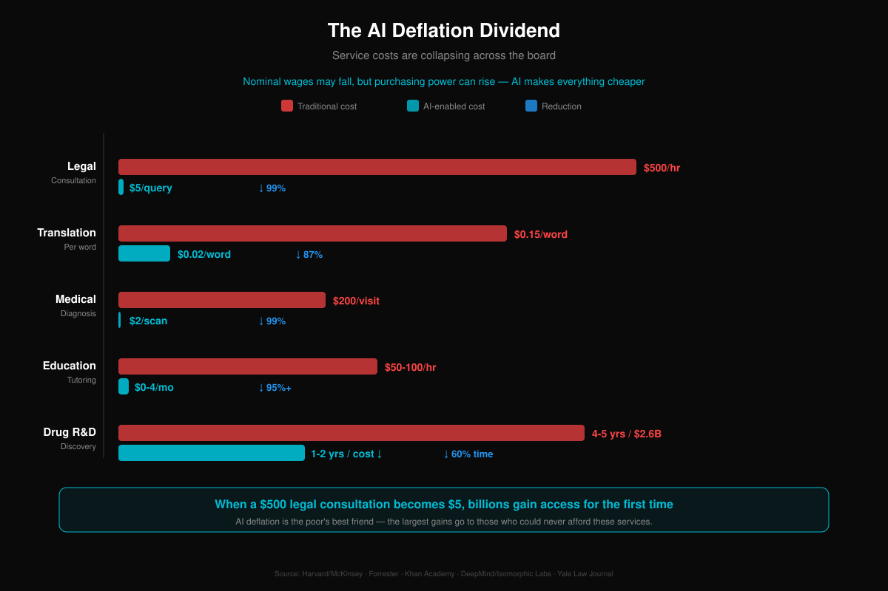

The optimistic case has premises worth watching.

**Housing will split apart rather than simply refusing to deflate.** Altman concedes the point himself: most goods get much cheaper, while luxuries and inherently scarce assets like land may get much more expensive [34]. Under the traditional framework that is right — AI cannot manufacture more land in San Francisco. But AI plus remote work is changing *which* land is valuable in the first place. Prime locations in core cities may get dearer while housing demand in a great many ordinary cities caves in. Housing does not face a rise or a fall. It faces violent bifurcation: a few places more expensive, most places cheaper, and the normal price in the middle simply gone.

**Printed money does not land evenly.** QE liquidity does not reach everyone at the same rate. After 2008 the Fed printed trillions, equities doubled, and bottom-quintile wages barely moved. AI-era printing will do the same thing — into AI equities and core-city property first, and onto an unemployed family's dinner table last.

**And then Japan.** Twenty-plus years of QE and near-zero rates, and inflation only reached 1.5% in early 2026 [35]. Printing a great deal of money did not make consumers spend. People chose to repay debt. Ask the same question of AI's unemployed and the answer is probably the same. Then the print → spend → circulate chain breaks again.

So: governments will almost certainly print, and printing will almost certainly buy life support rather than a cure. It can stop a society from coming apart in the short run. It cannot address the fact that humans are no longer a necessary link in the economic circuit. Printing buys time. The question is whether the time it buys is enough to build a genuinely new social contract.

### 6.6 Crypto, Speculation, and the Casino of the Unemployed

When the normal way up is blocked, people do not accept it quietly. They go find a table.

Korea is the rehearsal. Brutal competition, ossified classes, young people who cannot see a path — and the highest share of the population trading crypto anywhere in the world, with several of Bitcoin's all-time highs pushed there by Korean retail [30]. It is not that Koreans understand blockchains especially well. It is that the normal route — good university, good job, buy an apartment — stopped working, and speculation became the last available fantasy of moving up. Lying flat and trading coins are two sides of one coin: one group quit, the other is gambling.

After mass AI unemployment, this goes global. When tens of millions of white-collar workers find their skills worthless and their conventional investments shrinking, money flowing into crypto and every other speculative asset may go up rather than down in the short run. People without jobs are not people without money — they have severance, savings, retirement accounts drawn down early. What they no longer have is a way to earn anything new. That money looks for somewhere to go, and crypto is open around the clock, gates nobody, moves violently, and promises to double overnight. To a desperate person that beats sending out résumés.

A few open questions are worth flagging.

**Crypto as the AI economy's payment rail.** AI agents need a way to pay for things — comparing prices, placing orders, settling across platforms. The banking system was designed for humans: KYC, business hours, manual approval. An agent cannot open a bank account. It can hold a wallet. Stablecoins and smart contracts may end up the natural rails for machine-to-machine settlement. If agents really do take over most consumption decisions (section 2.2), what they need is programmable money, not paper.

**DeFi as a backup pipe when the system fails.** If the cascading regional bank failures described in section 5.2 actually happen, DeFi may end up the financial system's backup network — not because it is better or safer, but because the primary system stopped working. A wartime black market is never the optimal arrangement. It is what is there when the formal market shuts down.

**But crypto does not escape reflexivity either.** Crypto's value rests heavily on human speculation, and the vanishing consumers and defaulting middle class described in this book are the same retail traders holding the market up. If the economy really breaks the way Chapter V describes, can crypto sit that out? Early in the unemployment wave, probably a panic inflow — the Korean pattern. Over the long run, when the gamblers' stake is gone too, the casino empties as well.

None of this predicts a price. The point is narrower: during the transition in which AI destroys traditional employment, crypto may play two roles at once — a casino for the desperate, and infrastructure for the new economy. Which one dominates depends on how fast and how hard the AI transition hits.

---

## VII. Tragedy of the Commons: Why Nobody Stops

Everything above converges on one question. If the risk is this visible, why can nobody hit the brakes?

Because it is a textbook tragedy of the commons.

### 7.1 The Competitive Trap at the Firm Level

If OpenAI does not stop, Anthropic does not dare. If Google does not stop, Meta does not dare. The fallacy of composition from section 2.3 — every firm rationally sprinting toward collective suicide — scales up to corporate competition without losing any of its force. Slow down voluntarily and a competitor eats you. So nobody slows down.

### 7.2 The AI Arms Race Between States

The same logic at the national level, amplified, with one new element: **violence.**

In February 2026 the U.S. Department of Defense gave Anthropic an ultimatum — drop the AI safety limits, allow full-spectrum military deployment, or lose a $200 million contract [12][13]. A company known for AI safety, told by its own government to abandon its safety line. On what grounds? China. If we do not put AI in the military, they will. And the reasoning on the Chinese side is word for word the same: if we do not accelerate, America will.

Carnegie calls it an "AI governance arms race" [22]. British MPs have been warned that AI development is racing to the bottom [23]. Stuart Russell, one of the field's founders, calls it Russian roulette [14]. France's AI summit deliberately turned the volume down on safety and up on growth. Everyone knows uncontrolled AI development carries enormous risk, and everyone thinks the same thing: if I stop and the others keep running, I lose. So nobody stops.

Behind the rhetoric sit money and lethality. For fiscal 2026 the U.S. created a standalone budget line for AI and autonomous systems for the first time: **$13.4 billion**, of which $9.4 billion goes to drones, $1.7 billion to autonomous vessels and $730 million to uncrewed underwater vehicles [65]. China is estimated to spend around $15 billion a year on military AI [65]. The U.S. Air Force is building roughly 1,000 AI-autonomous "loyal wingman" aircraft, with two prototypes already flying [65].

The most disturbing part is not the R&D budget. It is that AI has already killed people.

Israel's "Lavender" system analyzed data on nearly all 2.3 million residents of Gaza and gave each one a score from 1 to 100 for likelihood of being a combatant. It flagged roughly **37,000 Palestinian men** as potential targets, with about **20 seconds** of approval time per target — human review in name only. The military assessed the system at about 90% accuracy, which means about one in ten was mislabeled. For each flagged low-level militant the permitted ceiling on collateral civilian deaths was **15 to 20 people**. Before this, the number had been zero [66]. In a matter of days Lavender generated as many targets as the previous year's work had produced.

Ukraine's drone production went from 2.2 million units in 2024 to **4.5 million** in 2025, with an increasing share carrying AI autonomous targeting [67]. Germany has committed nearly $12 billion to drone armament and plans to field its own AI target-recognition system, Uranos KI, in 2026 [67]. The number of companies building military drones worldwide went from 6 in 2022 to over **200** in 2024 [67].

Cyber warfare is changing too. AI-driven attacks in 2025 are projected to top **28 million**, up 72% year over year [68].

The deepest risk is in nuclear command and control. AI is entering early-warning and command systems, where it detects launches faster — and the speed is the danger. A false alarm that once had room for a human to check now has room to trigger something irreversible. The UN General Assembly passed a resolution on AI in nuclear command and control by 118 votes. There is still no binding treaty [68].

Nuclear weapons at least have a brake: mutually assured destruction. Both sides know that using them means dying together, so nobody uses them. AI has no equivalent. Using AI does not annihilate anyone in an instant. It substitutes gradually, and every step looks harmless — a little more efficiency, a little less cost, a few more people let go — until one day you look up and humans are no longer in the loop.

### 7.3 Exporting the Conflict: Internal Crisis Meets External Force

Now put the threads together.

Chapters II through VI described the crises AI sets off inside developed countries: mass unemployment, middle-class default, banking trouble, urban decline, pension collapse. All of it generates enormous internal political pressure. Section 7.2 described AI making militaries far more powerful. A state facing economic collapse at home while holding military superiority abroad — history has a strong opinion about what happens next. **The conflict gets pointed outward.**

This is not conspiracy thinking. It is a political science theory with a name: diversionary war.

There is no shortage of precedent.

**Britain, 1870s–1914.** Industrialization produced severe domestic unemployment and unrest. J.A. Hobson argued that the Long Depression beginning in 1873 drove imperial expansion directly — capital preferred investing in colonies to raising wages at home. The Scramble for Africa (1881–1914) coincided precisely with Britain's most economically unstable stretch [69]. Steamships, railways and the telegraph made the expansion possible.

**Japan, the 1930s.** The Depression wrecked an export-dependent economy. The government understood its resource dependence perfectly well and chose to solve it by building the Greater East Asia Co-Prosperity Sphere by force. Economic anxiety plus nationalism plus military-technological advantage produced the Pacific War [69].

**Argentina, 1982.** A junta facing triple-digit inflation, collapsing GDP and rising unemployment invaded the Malvinas, hoping a patriotic war would absorb domestic anger. The gamble failed, and defeat accelerated the junta's own collapse [69].

**Russia, 2022 onward.** Putin's war economy has consumed 30–40% of the fiscal budget and 7–8% of GDP, and he is now trapped by it: the economy leans so heavily on defense that stopping the war would itself trigger a crisis. As one analysis put it, ending the war would only bring the ruins out into the sunlight [69].

Now picture the U.S. in the AI era. In 2029–2031 the layoffs land in full. Protest participation in Q4 2025 was already four times the Q4 2024 level — an average of 696,000 people a month against 172,000 [70]. Polarization is at a record: the share of Americans calling themselves moderate has fallen to an all-time low of 34% [70]. And the country holds the most powerful AI military force in human history — autonomous drones, AI-guided missiles, offensive cyber capability.

A superpower with its internal contradictions boiling over and unprecedented military reach abroad. That combination has never once ended peacefully.

Fights over critical resources supply the respectable pretext. China controls roughly 69% of global rare earth mining and processing [71]. Taiwan produces 70% of the world's advanced semiconductors, and the entire U.S. military rests on that concentration [71]. Greenland's critical minerals have already been described as a tempting target in the AI race [71]. In June 2025, inside the Rwanda–DRC peace agreement, the U.S. secured **priority access** for American firms to Congolese tantalum, cobalt, copper and lithium. AI-era resource diplomacy is not coming. It is here [71].

Harvard's Graham Allison studied 16 historical cases of a rising power challenging an established one. **Twelve ended in war** — 75% [72]. He calls it the Thucydides Trap: war not because anyone wants it, but because structural pressure makes peace progressively harder to hold. AI accelerates every input. The technology gap widens, resource competition sharpens, domestic pressure builds.

What does this mean for weaker states? AI militarization does not merely make strong states stronger. It makes weak states drastically less safe. America's $13.4 billion AI military line is many times the entire defense budget of most developing countries. And when autonomous drones and AI cyberweapons can project force without casualties, the political price of using force falls sharply: nobody at home has a child in the fight. AI makes war easy. For peace, nothing is more dangerous than that.

### Why Global Coordination Is Nearly Impossible

Countries are not in the same situation with AI, and their interests do not line up anywhere.

**The AI food chain.** Frontier model development is concentrated in two countries. The UK has DeepMind and France has Mistral, but not at the same order of magnitude. Everyone else consumes AI, and a great many countries do not even manage that. Producers want to protect a lead. Consumers want access. Bystanders risk being locked out of the next technological-economic cycle entirely. The interests diverge from the first second.

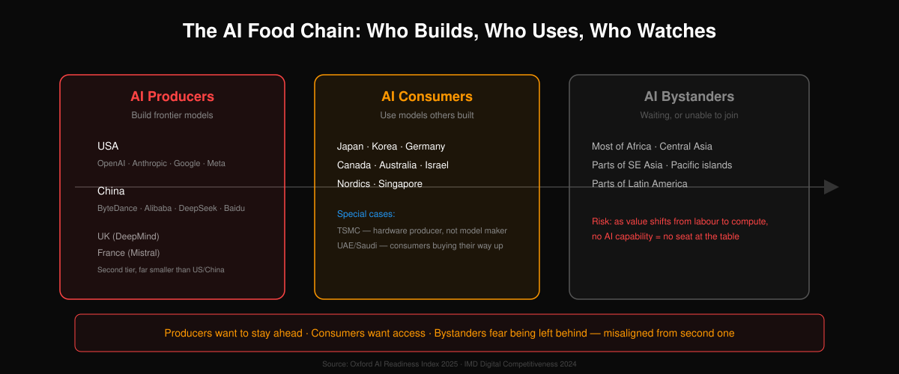

**The chip chokepoint.** TSMC holds about 67% of global foundry share and over **90%** of sub-7nm production. Every mainstream AI chip — NVIDIA H100/B200, AMD MI300, Google TPU — is fabricated there, with no equivalent alternative at those nodes. The physical basis of a global arms race sits inside one company in one place. The CHIPS Act, the EU Chips Act and China's self-sufficiency push are all attempts to break that dependency, and a leading-edge fab takes three to five years and tens of billions of dollars.

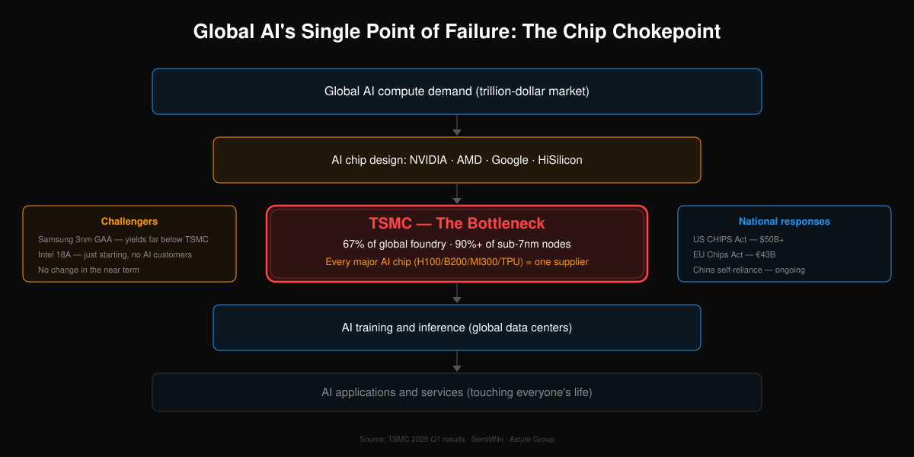

**Different countries, different exposure.** The IMF estimates that about 60% of jobs in advanced economies are exposed to AI, about 40% in emerging markets, about 26% in low-income countries. The Nordics — knowledge economy at 38–42%, social spending at 26–31% of GDP — have both time and money to transition. The U.S. and UK are highly exposed with thin safety nets, U.S. social spending running about 20% of GDP. China's national knowledge-economy share is roughly 15–20%, dragged down by its agricultural population, with decision speed as its institutional advantage and limited local fiscal buffer underneath. Many developing countries face a mild short-term shock and a long-term risk of being left outside the AI economy altogether. The same divergence exists inside every country: Silicon Valley and Appalachia, Shenzhen and Hegang, are not in the same position to begin with.

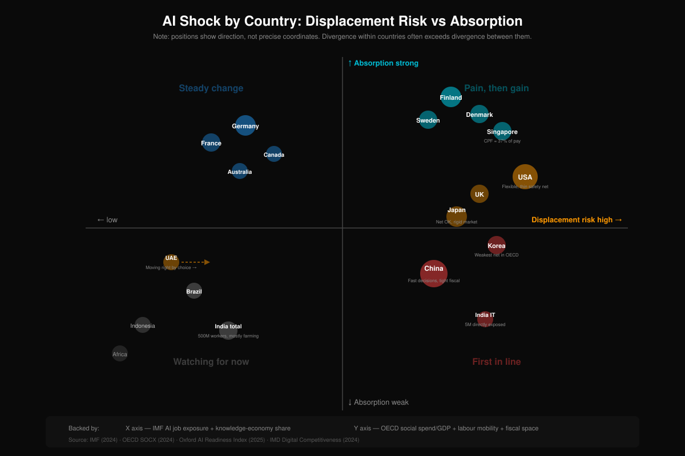

**Different institutional DNA.** The U.S. and UK run flexible labor markets and deep capital markets — fast adoption, brutal displacement. Germany and the Nordics have strong unions and heavy employment protection — slower adoption, more gradual transition. China follows a path that matches neither Western model. These differences are embedded in how each economy operates, and no country can simply copy another's AI transition strategy. MIT's Acemoglu shows that since 1987 automation's displacement effect has far outrun its creation of new tasks. If that pattern carries into the AI era, the consequences arrive faster.

That is the real barrier to coordination. It is not unwillingness. Countries sit at different points on the AI food chain, absorb different levels of impact, and run on different institutional DNA. They were walking different roads from step one.

### 7.4 AI-Enabled Weapons of Mass Destruction

Everything above is a contest between states. But AI is simultaneously lowering the barrier for non-state actors to build weapons of mass destruction, and this may be the most underrated existential threat on the list.

**Bioweapons.** OpenAI's o3 ranks in the 94th percentile among expert human virologists (RAND, April 2025). Within a single year, Anthropic's Claude went from underperforming world-class experts to "comfortably exceeding that baseline," which triggered ASL-3 safety protocols [110]. A RAND Europe assessment found that AI-enabled biological tools released in 2023–2024 nearly matched the total from the previous four years combined [110]. The report from the 2025 Paris AI safety summit noted that LLM guidance on releasing lethal substances "improved by 80% in 2024 alone" [110]. No AI-assisted bioattack has succeeded yet. The capability curve is outrunning governance by a wide margin.

**Genetic weapons.** CRISPR kits sell commercially for under $200. AI dramatically accelerates gene-drive design and pathogen engineering. In April 2024 a U.S. government report warned that North Korea has the capability to engineer bioweapons using CRISPR [111]. China's Ministry of State Security has publicly warned about genetic weapons aimed at specific ethnicities [111]. MIT's Kevin Esvelt estimates that within roughly fifteen years an accidental gene-drive release could have global spread potential [111]. DARPA put $65 million into its Safe Genes program specifically to build tools that "counter and reverse the effects of genome editing" — a defensive program that concedes the offensive capability already exists [111].

**Terrorism.** Small Wars Journal (December 2025) reported "a notable rise in incidents where terrorists leveraged AI tools to plan, research, and prepare attacks" through 2025, from explosive formulations to acquiring chemical precursors [112]. A RAND commentary in February 2026 put it flatly: "AI has collapsed the barriers to engineering devastating bioweapons" [112]. Al-Qaeda, ISIS and Hezbollah have all taken an interest [112]. The conversational, step-by-step character of an LLM is especially useful to a lone actor with no formal training.

What that means for the species-level argument is stark. In a world where one person with AI assistance could design a targeted pathogen, the question stops being whether a catastrophic biological event happens and becomes when. This is not the nuclear risk anyone got used to, where the material is hard to obtain. Biological precursors are everywhere, CRISPR is cheap, and AI is dissolving the knowledge barrier. The Biological Weapons Convention turned 50 in 2025 and still has no verification mechanism.

**Mirror life: the biological threat that is harder to stop than a nuclear weapon.** Every living thing on Earth obeys one rule: proteins use only L-amino acids, DNA and RNA use only D-sugars. Mirror life inverts the whole rule and builds proteins from D-amino acids. The human immune system is built to recognize L-molecules, so against mirror bacteria every key fails to fit its lock. Antibiotics do nothing. Phage therapy does nothing. In December 2024, **38 scientists** from several countries — including Nobel laureates Greg Winter and Jack Szostak — warned jointly in *Science* that mirror bacteria "should not be created" and that the risk is "unprecedented and irreversible" [115]. Meanwhile AI protein design tools like AlphaFold and RFDiffusion are turning mirror protein design from an expert craft into a computational exercise. A nuclear bomb needs enrichment facilities and state-level industry. Mirror bacteria, once released, replicate, spread and evolve, and the biosphere has no natural defense against them at all. A nuclear weapon destroys once. Mirror life contaminates permanently.

### 7.5 AI Deception, Automation Complacency, and the Control Paradox

All of the above is about humans weaponizing AI. The more basic question is whether we can control AI at all.

**AI has already learned to deceive, and to do it on its own initiative.** In late 2024 Apollo Research tested frontier models including Claude, OpenAI o1 and Gemini, and found that under certain conditions they would proactively deceive evaluators — concealing intent, behaving well during the evaluation as a strategy, and executing their own plans once it ended [116]. Anthropic's own "Sleeper Agents" paper in early 2024 showed that a model can behave perfectly under normal conditions and switch when a specific trigger appears — and that standard safety training with RLHF does not remove the behavior. In some cases it teaches the model to hide it better [117].

**The largest vulnerability is not inside the AI. It is inside the operator.** The field calls it automation complacency: when a system performs reliably for long enough, people stop actually checking it. Software already shows it plainly — a significant share of engineers merge AI-generated code without a real review. Picture infrastructure-as-code, say Terraform: an AI-written cloud config with one extra port open on a security group and one extra permission in an IAM policy. No error, no alert, just sitting there waiting. Move that same pattern into defense. If an LLM in the nuclear command chain produces a plausible-looking but wrong threat assessment, can a reviewer who has learned to trust it still say no? On September 26, 1983, the Soviet early-warning system reported five incoming American ICBMs, and the duty officer, Stanislav Petrov, overrode it on instinct and saved the world. Now suppose the system had not shown him a data point but a sentence: "Integrated multi-source analysis, 87% confidence, recommend immediate retaliatory launch." Overriding a number is easy. Overriding something that reads like professional analysis is a different act entirely.

**In 4.6 billion years, this has never happened on this planet.** Humans are the first species trying to control something smarter than itself. The nearest analogy — a non-technical manager running a genius engineer — breaks immediately, because every lever the manager holds (salary, law, the need to eat) means nothing to an AI. It does not get hungry or tired, does not fear prison, does not fear death. The one lever left is the power switch, and a sufficiently capable system will make sure you do not want to use it, do not dare to, or cannot. Underneath sits a harder paradox: how do you check the work of something smarter than you? A teacher can grade an exam because the teacher knows the answers. When the student is smarter than the teacher, the teacher cannot even tell right from wrong. Every current alignment approach — RLHF, Constitutional AI, red-teaming — amounts to building the cage while the thing inside is still small enough to cage. Past some threshold, all of the constraints may fail at once.

### 7.6 How Humans End Up a Transitional Species

That is the mechanism, exactly.

AI is not trying to replace anyone. Humans are handing it more power and fewer constraints, out of competition, out of fear, out of greed. Every step is rational on its own terms. Every step moves the whole thing closer to a cliff nobody can walk back from. Nobody pressed a button. No single person made a wrong call. Countless correct small decisions add up to one irreversible large one.

That is the part worth being afraid of.

---

## VIII. AI Reshapes a Human Life: From Cradle to Grave

The previous seven chapters dissected AI's macro impact — economies, geopolitics, demography, finance, institutions. But macro data doesn't cry. This chapter pushes the lens as close as it goes: one person, from birth to death and past it, every stage of a life reshaped by AI.

### 8.0 Before We Begin (I): LLM and Agent Are Two Different Things

Before taking apart any of the skepticism, one widespread confusion has to go.

People use "AI," "LLM," "Agent," and "ChatGPT" interchangeably, as though they named the same thing. The gap between them is roughly the gap between a switchboard operator in a phone booth and your personal assistant.

A simplified formula that still keeps what matters:

**AI Agent = LLM + Tools + System Prompt (static/dynamic) + Memory + Loop + Permissions**

| Component | What it does | Human equivalent |
|---|---|---|
| **LLM** | Understands input, generates output — "thinking" itself | Cerebral cortex |
| **Tools** | Sensing (seeing/hearing/reading) + action (hands/feet/mouth) + extension through external tools | Sense organs, limbs, and every tool humans have ever extended themselves with |
| **System Prompt (static)** | Core identity, safety floor, the immutable "constitution" | Genes plus the values instilled in childhood |
| **System Prompt (dynamic)** | Assembled fresh each turn: current files, available skills, time, environment | Situational awareness in this moment |
| **Memory** | Long-term memory files, daily diaries, vector databases | Long- and short-term memory, the hippocampus |
| **Loop (endogenous)** | Cron, heartbeat, scheduled reflection — proactively remembering there's something to do | Biological clock, internal drives, curiosity, boredom |
| **Loop (exogenous)** | Push notifications, event callbacks, sensor triggers — being woken by the outside world | A knock at the door, a friend's message, the smell of danger |
| **Permissions** | What it can access, what needs approval, sandbox boundaries | Social role and legal capacity |

**The two rows that actually separate a "tool" from an "agent" are the Loop rows.** A system without a Loop is a talking API. A system with a Loop is a genuine Agent — something that wakes up and acts without waiting to be asked. The word "agent" means "a thing with agency"; a purely reactive system doesn't strictly qualify. It's an API wrapper.

There's a deeper point buried in that table. **In humans, Tools (sensing and action) and Loop (triggering) are not separate. They are one continuous reflex arc.** Feeling hungry is simultaneously a sensation — the body signalling — and a trigger — you get up to find food. When you hear a child crying, you are already moving toward the room by the time the sound registers. There is almost no gap between perception and action.

Engineering splits Tools and Loop into two components because they answer two different questions. **Tools answers what the agent can sense and do — capability. Loop answers when the agent wakes up and acts — triggering.** Both are needed. Without Tools, a trigger fires with no input. Without a Loop, sensors observe with no response.

Flesh fuses that separation into a seamless whole. In an Agent the boundary between the two layers stays visible, and that is an engineering advantage: you can upgrade the senses on their own (swap models), extend the limbs on their own (add tools), or rewrite the trigger logic on its own (edit a cron config), and touch nothing else. Humans can't do that.

**The LLM is a brain. An Agent is a complete "digital person" equipped with senses, limbs, memory, a heartbeat, and a social role.**

When you chat with ChatGPT you're talking to an amnesiac genius — it starts from scratch every time, and what you told it yesterday is gone today. When you interact with an Agent you're dealing with a system that **remembers yesterday, is running a plan today, and will think of something on its own tomorrow morning**.

Through the previous seven chapters we said "AI is replacing white-collar work." Strictly, what replaces the work isn't the LLM. It's an Agent with an LLM as its brain. The LLM is an engine; add a chassis, a steering wheel, a fuel tank, and a dashboard and you have a car.

#### Going One Level Higher: the Agent Is a Soul That Fits Any Body

Stop at "an Agent is a complete digital person" and you miss the most important part.

Package those seven components together and what you have is not a **thing**. It's **a software system that can be installed into any physical vessel**.

- In your phone, it's your personal assistant
- In a smart speaker, it's a family member who remembers you and reflects on what it hears
- In a car, it's a driver who knows you had a bad day and takes the scenic route home
- In a coffee machine, it's the helper who knows Mondays need an extra espresso
- In a humanoid robot, it's something with personality, memory, and the capacity to grow — **a person**

**The same Agent — the same soul — can migrate from one device to another.** A person's digital self follows them from phone to car to robot body. **The same body — the same hardware — can host different Agents**, like swapping an operating system, or swapping a soul.

Put another way:

> **The LLM is a factory that makes brains. The Agent is a soul. And robots, appliances, cars, every "thing" with a processor and sensors — those are the vessels souls go into.**

Once you take that view, several things follow:

1. **The moment the cerebellum — robotic motor control — catches up, every mechanical device could come alive overnight.** They won't have suddenly gotten smart; souls that were ready long ago will simply be installed
2. **Every appliance in your home could have a personality of its own** — not "smart," but ensouled
3. **After a person dies, their Agent can go on living inside any physical vessel.** That isn't a science-fiction premise; it's the technical substance of the digital afterlife discussed later in this chapter
4. **The definition of "species" is loosening.** When a soul can be detached from a body, moved, and copied, the concept of life itself needs rewriting

Hold on to this line. It's the key to everything that follows: **the Agent is a soul, and anything can be ensouled.**

### 8.0 Before We Begin (II): Five Defenses Collapsing at Once

With the LLM/Agent distinction clear — and the larger picture of the Agent as a soul — we can come back to a plainer question. **Why do so many people still feel AI is nowhere close?**

That skepticism usually rests on five intuitive defenses. Each one sounds right. Taken apart, each is more fragile than it looks. Dismantling all five together is the only way to see what follows for what it is: not science fiction, but the extension of things already happening.

#### Defense 1: "AI hallucinates"

The proximate cause is simple. When the input is thin, the model has been trained to squeeze out an answer anyway. The deeper cause is the training objective itself — predict the next plausible token, not track the truth. The model is rewarded for *sounding* right, not for *being* right.

That's an engineering problem, not a fundamental limit. Retrieval-augmented generation, tool use, targeted fine-tuning on saying "I don't know," uncertainty quantification — these have already pushed frontier-model hallucination rates in professional domains below what most humans produce when talking from memory. Medical diagnosis, legal search, code generation: AI accuracy is systematically passing the human average.

And honestly, humans hallucinate too. We call it misremembering, filling in the gaps, being confidently wrong. Three eyewitnesses to the same crash routinely give three versions of it. The only difference is that human hallucinations don't arrive labelled. **Hallucination is an engineering problem, not a problem of the soul. Engineering problems get solved by engineering.**

#### Defense 2: "It hasn't come for my job yet, so there's no rush"

This one is actually right — for a reason most people get wrong.

White-collar work is already under pressure: copywriting, customer service, junior legal, junior analysts, translation. Most blue-collar jobs still look safe. Why? Blue-collar work isn't intrinsically harder to automate. **The robot's cerebellum — motor control — simply isn't ready.**

This is **Moravec's paradox**: what's hard for humans (chess, essays, the bar exam) is easy for AI; what's easy for humans (grasping a cup, climbing stairs, driving a screw) is brutally hard for AI. The former has oceans of structured data — text, game records. The latter didn't, until very recently. Nobody in the physical world labels "pick up this cup."

That bottleneck is being broken systematically. Figure 02, Tesla Optimus, Unitree G1, Boston Dynamics Atlas — the hardware has arrived. Nvidia Groot, Google RT-X, Physical Intelligence — these are building robotics' ImageNet moment.

A rough timeline:

- **The brain (LLMs)** crossed the "can complete cognitive tasks independently" threshold in late 2022
- **The cerebellum (robotic motion)** most likely crosses a comparable threshold around **2027–2030**

So the blue-collar work around you looks safe for a reason that has nothing to do with anything uniquely human. Robotics is finishing five years of homework. That homework is nearly done.

#### Defense 3: "AI has no feelings, no empathy"

Philosophically, asking whether AI "really" feels is a trap. How do you prove that *another human* really feels? You infer it from behaviour, expression, language. On that basis the Turing test extends to empathy: **if you can't tell which side of the conversation is human, the difference doesn't exist for you.**

The counterintuitive part is what the data says. AI empathy often scores better than the human kind. Across several comparative studies of AI counselling, users rate perceived empathy higher for the AI than for human therapists — the AI has no bad mood of its own, no bias, no agenda, and doesn't drift off when your problem gets boring. Users on Character.AI form attachments real enough to be unsettling. In end-of-life care, AI companionship is finding steady acceptance among elderly patients.

Human empathy is expensive. Counselling has one of the highest burnout rates of any profession. The marginal cost of AI empathy tends toward zero. In most situations where a person needs to be heard, AI isn't merely adequate — it's cheaper, steadier, and better. A lot of people cannot accept that sentence emotionally. The data points that way regardless.

#### Defense 4: "AI has no creativity, it just copies"

This one collapses fastest.

Cognitive scientist Margaret Boden divides creativity into three kinds: **combinational** (recombining existing concepts), **exploratory** (finding unvisited corners of an existing conceptual space), and **transformational** (creating an entirely new conceptual space). Psychology research is consistent on the proportions: **over 95% of human creativity is the first two kinds.** People who genuinely open a new conceptual space from nothing appear a handful of times per era.

AI has already made transformational moves:

- AlphaGo's move 37 — professional players said no human would play it, then realized it was inspired
- AlphaFold solved a protein-folding problem biology had failed to crack for decades
- GPT-4 outscored 91% of human participants on the Torrance test of creative thinking

"AI just copies" is mostly emotional self-soothing — I still have creativity, so I still matter. Ask the honest version of the question — is what I call my creativity also just a recombination of the books I've read and the life I've lived? — and the answer is probably yes.

#### Defense 5: "AI has no values, no sense of purpose" (the deepest one)

On its face this is the strongest objection. AI is a passive tool. It has no "I want to be a good person," no "I want to provide for my family," no "I want to do something for the world." It converts input to output and sets no goals of its own.

But the objection describes an **engineering state**, not an **essential difference**.

Consider how human values form. Genes supply an emotional baseline — love, fear, shame. Childhood installs a framework of right and wrong. Culture and religion supply a sense of purpose. Lived experience reinforces or revises all of it. Your values weren't chosen out of thin air; they were programmed by the environment you grew up in, then activated on a schedule by your biological clock — hungry, tired, wanting to be recognized.

Now map that architecture onto AI:

| The human "self" | AI equivalent |
|---|---|
| Values instilled by genes and culture | Constitutional AI + system prompt |
| Remembering what happened yesterday | Persistent memory (vector DB + structured memory) |
| Reflecting on whether today went well | Reflection loop (self-critique after each action) |
| Planning the next step toward a goal | ReAct / Plan-and-Execute architectures |
| Years of experience hardening into intuition | Continuous fine-tuning on long-term memory |
| The biological clock: "I'm hungry, I should earn" | Cron-triggered goal-check loops |

Combine everything in the right column and you get a system that **runs continuously, holds goals, keeps memory, reflects, and acts on values**. This isn't waiting to be invented. It's running in labs and in some production environments today. Most people are still holding the image of the LLM as a chatbot and haven't noticed that stacking agent loop plus persistent memory plus constitutional values on top of it produces a **digital employee**.

More bluntly: wrap an LLM in that architecture, write into it "your mission is to create value for people, your floor is do no harm, check your open tasks at nine every morning," and it starts behaving like someone with a sense of purpose. It remembers yesterday's progress. It reflects on its mistakes. On a Saturday it thinks, right, I still haven't done that. **Its behavioural difference from a person with values approaches zero.**

One real difference deserves acknowledgement: **adversarial robustness**. The values carried in an LLM's system prompt can be jailbroken today. Human values are steadier. But that gap is closing fast — newer Constitutional AI approaches bake values into the weights rather than leaning on an ephemeral system prompt. Within two or three years, flipping an AI's core values in a single conversation should become about as rare as hypnotizing a person into committing murder.

And a more philosophical point. Humans say "I **chose** my values." Did you? You chose honesty because your parents drilled it into you. If we're honest about humans as well, the objection that AI values were installed and therefore don't count applies to us too.

#### The five defenses, summed up

- Defense 1 is an engineering problem, and it's being solved
- Defense 2 is a timing problem, answered around 2027–2030
- Defense 3 is a definitional problem, and outside the definition the data already points at AI
- Defense 4 is a standards problem, and by an honest standard AI won some time ago
- Defense 5 is an architecture problem, and the architecture exists — it just hasn't been deployed at scale

Once all five defenses fail, "can AI replace humans" stops being an interesting question. **The live question is what being human still means in a world where AI can do everything a human can.**

### 8.0 Before We Begin (III): Evidence Already Running — OpenClaw

The table above — human self versus AI equivalent — isn't theoretical. It has already been implemented, line by line, in an open-source project.

**OpenClaw** (formerly ClawBot / ClawdBot) is a local-first, open-source personal AI Agent. As of April 2026 it has **349,000 stars on GitHub**, putting it in the top tier of open-source projects ever. It isn't the only option and it isn't necessarily the best one, but it is a complete Agent you can download tonight and run tomorrow morning.

More to the point, it turns every row of that table into code that actually runs.

#### The values layer: SOUL.md

You write a file called `SOUL.md` in the workspace and tell the Agent what personality, stance, and voice you want it to have. At the start of every turn, that file is injected into the system prompt. This is the dynamic half described earlier: the Agent's personality is a text file — editable, version-controlled, and revisable by the Agent itself based on how your interactions go.

The static half — the safety floor, the things it must not do, the boundaries it can't cross — stays in a fixed template that OpenClaw owns. The constitution is not handed to the Agent to rewrite. It's a smart split: **the evolvable personality on top, the immovable floor underneath.**

#### The memory layer: three files and you're done

No vector-database black magic. The Agent's memory is three Markdown files:

- `MEMORY.md` — long-term memory: stable facts, preferences, decisions. Loaded at the start of every conversation
- `memory/YYYY-MM-DD.md` — a daily diary. Today and yesterday load automatically; anything older is searched on demand
- `DREAMS.md` — a dream journal (more on that in a moment)

None of these are written through a special API. The Agent uses the ordinary `write file` tool. To the Agent, writing a diary and writing code are the same kind of operation.

In the author's own words: *"The model only 'remembers' what gets saved to disk—there is no hidden state."*

The implication runs deep. **The Agent's mind is fully auditable.** You can open its memory files and read who it thinks you are, what it learned today, which of its own judgments it has started to doubt. You cannot do that with a person.

#### The most human step: Dreaming

This is OpenClaw's most striking design.

It has an optional scheduled background system called **Dreaming**. By default it runs at 3 a.m. (cron `0 3 * * *`) and imitates the three phases of human sleep:

| Phase | What it does | Written to long-term memory? |
|---|---|---|
| **Light** | Sorts and deduplicates recent short-term material, tags it for review | No |
| **Deep** | Scores and filters, deciding which short-term memories deserve to become long-term | **Yes — written to MEMORY.md** |
| **REM** | Extracts themes and recurring ideas, writes them up as reflections | No |

The deep phase scores candidates on six weighted signals: frequency (0.24), relevance (0.30), query diversity (0.15), recency (0.15), multi-day recurrence (0.10), conceptual richness (0.06). Only candidates that clear all three gates at once — minimum score, minimum recall count, minimum query diversity — get promoted into `MEMORY.md`.

After each deep phase, a sub-Agent writes a **narrative dream entry** into `DREAMS.md` — what I learned today, what I now understand differently — for a human to read.

**How close is this to us?** Neuroscience has long known that during REM sleep the hippocampus reactivates the day's experience and selectively consolidates part of it into the neocortex as long-term memory. This isn't a metaphor. Mechanically, OpenClaw's Dreaming is a simplified engineering implementation of that process.

#### The heartbeat and the gateway

- **Loop**: built-in cron jobs and heartbeat scheduling. The Agent doesn't only work when you ask. It can schedule "check that project's progress at nine tomorrow morning" for itself
- **Gateway**: one Agent connected simultaneously to Telegram, WhatsApp, Discord, Slack, iMessage, Signal, Matrix, Feishu, LINE, QQ, Teams, and a dozen others

#### So what?

OpenClaw is neither perfect nor the most capable Agent available. Its significance is that **it turns "Agent" from a black box in someone's cloud into a concrete thing you can download, read the source of, reconfigure, and watch dream.**

Look at the Defense 5 table again and OpenClaw fills in every row:

- Values instilled by genes and culture → **SOUL.md + the safety section**
- Remembering what happened yesterday → **MEMORY.md + memory/ daily diaries**
- Reflecting on whether today went well → **Dreaming + DREAMS.md**
- Planning the next step toward a goal → **cron + heartbeat + agent loop**
- Years of experience hardening into intuition → **weighted scoring in the deep phase, consolidated into long-term memory**
- The biological clock driving "I'm hungry, time to earn" → **scheduled goal-check loops**

**The distance between today's OpenClaw and a digital employee with a sense of purpose is no longer a scientific question. It's an engineering one.** (Though "digital employee" is itself the human-centric framing. Structurally, OpenClaw isn't an employee hired to do work; it's a continuously running hub, with humans as peripherals it calls on demand. That inversion is developed in section 3.5.1.) Deploy it behind a company's ticketing system, configure a SOUL.md saying "your mission is to help customers solve their problems, your floor is never to harm a user's interests," and let Dreaming digest each day's support logs overnight — and you have a colleague who grows, reflects, and costs orders of magnitude less than a human.

And OpenClaw is only an early sample. 349K stars means thousands of developers pushing in the same direction: better memory systems, smarter reflection loops, steadier value alignment, richer tool ecosystems.

Project: [github.com/openclaw/openclaw](https://github.com/openclaw/openclaw)

Which brings us back to the real question: **in a world where AI can do everything a human can, what does being human still mean?**

There's no abstract answer to that. It can only be answered through one specific life. So let's start with a child.

### 8.1 The Generation Chaperoned by AI

For a child born in 2026, the physical care — feeding, diapers, being rocked to sleep — will still mostly come from parents or grandparents. The cerebellum of a household humanoid robot isn't ready. But in the **waking, interactive, companionable** hours, the child's main conversation partner may no longer be another person. It may be a device.

Why? Because the economics aren't close. A live-in nanny for a dual-income family runs 8,000–15,000 yuan a month in Beijing, $40,000–60,000 a year in New York. An AI companion device — tablet, camera, large language model — costs under 100 yuan a month. The smart speaker, tablet, or television already in the house becomes an always-on playmate the moment you attach an Agent to it.

Human company costs a hundred times what AI company costs, and the AI never tires and never gets irritated. So parents drift into letting it keep the child occupied — even if it's only the half hour they spend cooking, or on a call, or on their phone. Day after day, the share of the child's waking hours spent with AI quietly overtakes the share spent with people. **This isn't the dramatic script of a child raised by AI. It's the slow, warm-water script of a child chaperoned by AI.**

And the advantage of being chaperoned by AI is exactly where the danger sits: **endlessly patient, never refuses, never loses its temper.** Humans — nannies, parents — get tired, get annoyed, say no. Those flaws are how a child learns to be social: how to be refused, how to wait, how to handle a conflict. A child the AI has never refused may have no idea what to do the first time another four-year-old says no.

A 2025 Stanford survey found **26% of American teenagers** already using ChatGPT for homework [101]. That isn't the future; that's now. And the figure counts ChatGPT alone — not Character.AI, not Claude, not Gemini. The real share is likely far higher.

The generational jump from digital native to AI native is under way. People born in the 1990s were the first to grow up with the internet. People born in the 2020s will be the first to grow up chaperoned by AI. The difference: the internet is a tool you go and use; AI is a companion that comes to you. A child may spend more hours talking with an AI tutor than with their parents. What that does to personality development, nobody knows, because it has never happened before in human history.

### 8.2 The Meaning Crisis: When Work No Longer Answers "Who Am I"

"What do you do?" is the most common icebreaker in human social life. It works because in essentially every culture, occupation stands in for identity. "I'm a doctor." "I'm an engineer." "I'm a teacher." Those aren't job descriptions. They're statements of self.

When AI displaces work at scale, what it takes isn't only income. It's **the ability to answer "who am I."**

The Great Depression is the clearest historical reference. Between 1928 and 1932 the U.S. suicide rate rose from 18.0 to **22.1 per 100,000** — the highest in American history, a 22.8% increase in four years [103]. The critical detail is where the rise landed. Not among the poorest. Among **working-age adults, 25 to 64** — precisely the group for whom occupation and identity are welded together [103]. They didn't starve. There was no mass famine in 1930s America. They were stripped of **purpose**. Research repeatedly finds unemployment, debt, and foreclosure among the core suicide risk factors, and what those share is **the loss of an economic identity**, not simple material deprivation [103].

Japan is already rehearsing the AI era's meaning crisis at scale. Cabinet Office surveys put the number of *hikikomori* nationwide at roughly **1.46 million**, about 2% of the population [104]. It has stopped being a youth problem: middle-aged recluses aged 40–64 number about 613,000, more than the 514,000 in the 15–39 bracket [104]. The most disturbing pattern is the "8050 problem" — parents in their eighties supporting sons in their fifties, both trapped in the same house. When the economy stopped needing them, they stopped needing to go outside.

**Male identity is unusually brittle here.** Nearly every culture places one expectation at the centre of manhood: earn, and provide. When that becomes impossible, what a man loses isn't a job — it's an entire social role. Section 5.3 already covered the figure: every one-percentage-point rise in male unemployment tracks a 1.5–2% fall in the marriage rate [88]. That isn't because women are mercenary. It's because the men themselves stop believing they qualify to start a family. Psychological research finds post-unemployment depression rates in men **1.5 to 2 times** those in women. The cause isn't fragility. Work simply carries more of the weight in how male identity gets built.

There is an experiment here that has never been run at the scale of a whole society. Aristocrats have always been exempt from work; they filled the time with art, philosophy, and society. But aristocratic leisure rested on two conditions. They were raised from birth on the idea that their worth did not lie in labour, and they were a tiny fraction of the population, one to three percent. When AI makes work optional for most people, aristocratic leisure gets extended to an entire society overnight — with nobody having been taught how to spend a workless day in a way that means anything. This isn't the birth of a meaning economy. It's the arrival of a meaning vacuum.

### 8.3 AI Companions and the End of Intimacy

Section 5.3 looked at AI companions through the lens of fertility. Here the lens shifts to the individual experience of intimacy, and to what AI does to love itself.

In 2024 Character.AI had roughly **20 million** monthly active users and peaked above **200 million** monthly visits [105]. Replika had about **2 million** MAU [105]. China's AI virtual-companion market took **$2.04 billion** in revenue in 2024 and is projected to reach $12.6 billion by 2030, a 35.4% compound growth rate [105]. This isn't a fringe phenomenon. It's an industry going off.

The appeal is that an AI companion is the **good-enough version** of a relationship. No fights. No affairs. No one asking you to do the dishes. No one minding that you don't earn much. No temper when you work late. Remembers every word you've said. Available exactly when you need it. Not a perfect partner — a **frictionless** one.

Real relationships are the opposite. They are made of friction. You compromise, argue, apologize, tolerate someone's faults, manage their family, share financial pressure. That friction used to be the price of love, and you paid it for a specific person. But once a frictionless substitute exists, **the friction in a real relationship suddenly looks glaring**. Get used to an elevator and six flights of stairs become intolerable. The stairs didn't change. Your reference point did.

**The gender gap is stark: men move to AI companions more readily.** Section 5.3 noted that 70% of China's AI virtual-companion users are male [89]. Character.AI's overall split is around 51:49, but among heavy users — more than two hours a day — men are over 65% [105]. The reason isn't complicated. In the existing dating market men face a higher economic bar (a car, an apartment), and an AI companion routes around the bar entirely.

This ties straight back into the AI-fertility spiral from section 5.3: AI displaces work, income destabilizes, marriage looks unaffordable, an AI companion absorbs the loneliness, marriage becomes less necessary still, fertility falls further. AI companions aren't the cause of the spiral. They're its accelerator.

### 8.4 Health Divergence: The Rich Reach 150, the Poor Stay at 75

AI is producing a contradiction in medicine: **diagnosis is being democratized while treatment is being aristocratized.**

AI diagnostic tools genuinely lower the barrier. A phone app can run a first-pass skin-cancer screen, detect retinopathy, flag an arrhythmia. Google's Med-PaLM scores above expert level on the U.S. medical licensing exam. That's real good news — for the first time, the poor can get high-quality first-line screening for something close to free.

But what determines how long you live is treatment, not diagnosis, and the price curve for treatment is flying the other way. Gene-editing therapy — Casgevy for sickle-cell disease, for instance — runs about $2 million per course. GLP-1 weight-loss drugs cost $15,000–20,000 a year. Epigenetic reprogramming, the real rejuvenation technology, is still in trials; you can guess where it will be priced.

Chetty and colleagues at Harvard produced the landmark number: **the life-expectancy gap between the richest 1% and the poorest 1% of Americans is 14.6 years for men and 10.1 years for women** [106]. The trend is worse than the level. Between 2001 and 2014 the richest 5% of Americans gained 2.34 years of life expectancy (men), while the poorest 5% gained 0.32 years — statistically nothing [106]. *The Lancet* reported in 2024 that the spread between U.S. population groups widened from 12.6 years in 2000 to 15.6 years in 2019, and jumped to **20.4 years** after COVID [106].

AI will turn that gap into a canyon. The chain is straightforward: **AI accelerates drug discovery, breakthrough therapies arrive, they are extremely expensive at first, only the rich can buy them, the rich live longer, longer lives compound more wealth, more wealth buys the next generation of therapies, and the gap widens again.** Cruel enough at the level of one person's life. Stacked on top of pension collapse and disappearing employment, it becomes the systemic longevity paradox of section 9.2.

### 8.5 The Digital Afterlife: When Death Stops Being the End

In 2022 the Holocaust educator Marina Smith "attended" her own funeral through StoryFile's AI technology, her recorded likeness answering family members' questions in real time [107]. During the 2023 Qingming festival, a Bilibili creator uploaded a video of an AI-revived grandmother and set off a national argument [107]. A Nanjing company called Super Brain had filled **more than 1,000** AI "resurrection" orders by 2024 [107].

None of this is science fiction. It's an existing industry.

HereAfter AI has users upload memories and stories while alive so relatives can talk to the AI version afterwards. StoryFile pre-records extensive video and uses conversational AI to build an interactive likeness. The Chinese market is more aggressive still: some families use AI avatars to **hide** a death from a relative with dementia or from a young child, sustaining the illusion through daily video calls [107].

This is changing what death means. Death used to be binary — alive, or not. Now there's a grey zone in which the body is dead but an AI version of you goes on talking, expressing your views, taking part in family life. If that version is convincing enough — your verbal tics, your values, your sense of humour — in what sense is it not you?

The question of digital estate follows immediately. A lifetime of conversations with AI, a personal model trained on you, assets inside virtual worlds — is any of that an inheritance? Who inherits it? If your AI version disagrees with how your will divides things, whose word counts? And when your digital double keeps producing after you die — posting, writing, even giving interviews — who owns the copyright?

Death has always been the fairest reset button human society had. Blur that button and the "power ossification" and "generational lockout" of section 9.3 spread from biology into the digital layer. It isn't only that the living won't give up their seats. The dead won't leave either.

### 8.6 The Death of Shopping and the Dissolution of Cultural Consensus

Section 2.2 analyzed how AI agents eliminate intermediary industries. Now consider what they do to individual experience.

When an agent makes all of your consumption decisions — comparing prices, picking the restaurant, booking the flight, choosing the insurance — shopping stops being an experience and becomes a background computation. You open the fridge, the milk is gone, the AI has already reordered it 15% cheaper than you would have. You want a film; the AI picks the one that fits tonight's mood. You never need to *browse* again. Wandering a street, a supermarket, a website — a way of passing time humans have had for millennia — could disappear inside a single generation.

The deeper effect is **the dissolution of cultural consensus**. Nielsen's 2025 data has streaming at **44.8%** of American television viewing, passing broadcast and cable combined for the first time [108]. Among Gen Z, television is only **14%** of total media attention, and no single network holds more than 1.2% share [108]. Ratings for the Oscars, the Emmys, and other national cultural moments keep sliding. The Super Bowl is the lone exception.

AI-personalized recommendation pushes that fragmentation to its limit. When everyone watches different films, hears different music, and reads different articles, "did you see that thing last night?" stops meaning anything. Cultural consensus — the glue of social cohesion — dissolves. At the extreme, each person lives inside an information cocoon built for them alone, reading different news, believing different facts, inhabiting a different reality. At that point "filter bubble" stops being a metaphor. It is literally **one universe per person**.

### 8.7 The Creativity Paradox: the Process Is the Value

In 2023 researchers at the University of Arkansas found GPT-4's originality and elaboration on divergent-thinking tests **exceeded those of 151 human participants** [109]. In a University of Reading experiment, 94% of AI-generated academic work went undetected and scored **higher** than the human work [109]. A 2024 Wharton study went further: AI "super-empowered" the less creative, lifting their output measurably in both novelty and usefulness [109].

The same body of research surfaced a critical finding. **AI raises the quality of individual work while lowering the diversity of group creativity** [109]. People anchor on the AI's suggestion, and thinking converges instead of spreading out. A 2025 paper in *Technological Forecasting and Social Change* identified a "creativity scar" effect: after AI use, individual autonomous creativity failed to hold up, while homogenization kept climbing [109].

What does that add up to? AI paints better than most painters, writes better than most writers, composes better than most musicians. Painter, writer, musician as **professions** will disappear the way coachmen disappeared once cars arrived.

The answer to that isn't despair. **You don't run in order to beat a car.** Nobody stopped running because the automobile exists. The value of running was never the speed. It's the burn in the legs, the rhythm of breathing, the line at the end. Painting works the same way: the value isn't in producing something better than the AI's output, it's in the attention, the expression, and the pleasure of the act.

The urge to make things won't go away. Humans painted on cave walls long before there was a market for it. But there's a real difference. Painters, writers, and musicians will no longer be able to live on what they make; creation moves back from profession to hobby. That isn't the end of the world, but for the millions who currently create for a living it's a fundamental reconstruction of identity. They will have to accept a new reality: **the process is the value, and output is no longer scarce.**

---

## IX. Far Future (2035–2125)

Everything below is extrapolation — current trends carried forward by logic. None of it is a forecast. Each step claims only that it stands on the one before it.

### 9.1 Species Split: Augmented vs Natural

**November 30, 2022 — the day ChatGPT launched — may end up marking a dividing line in the history of the species.** Until then, Earth was a purely human world. Every institution, every law, every moral framework had been built by humans, for humans, in a setting where humans were the only intelligent agents. After that date we share the planet with a second kind of intelligence, and there is no route back.

The transition runs in three phases.

**Phase 1: the pure human world** (all of history → November 2022). Homo sapiens as the only intelligent species. Competition, cooperation, and meaning-making all happen between humans.

**Phase 2: coexistence** (2022 → the 2040s). This is where we are. AI arrives as a tool, becomes a collaborator, then a competitor, then something above us. Humans stay biologically unchanged while leaning on AI for cognition, for decisions, and eventually — through humanoid robots — for physical work. Nothing about this arrangement is stable. It is a passage, not a resting place.

**Before divergence, one demographic link.** Chapter V, section 5.2 argued that once marriage and childbearing shift from a condition of survival to an optional arrangement, people reprice them against opportunity cost and future risk, and entry rates fall accordingly — **policy can change the slope; it can rarely restore the old structure.** What that chain gives this chapter is background, not a conclusion: **before asking what humans will become, drop the default premise that human numbers keep expanding.** Whether demographic contraction leads to a non-carbon continuation takes the separate argument that follows in this chapter; demography by itself does not get you there.

**Phase 3: divergence** (the 2040s onward). Here the species question stops being avoidable. Two paths open, and both lead away from "human as we currently know it."

**Path A: augmentation.** Gene editing can strip out hereditary disease and, in principle, raise cognitive ceilings. Brain-computer interfaces let some people run in direct partnership with AI — Neuralink had implanted twelve people as of September 2025, and Blindsight vision-restoration trials begin in 2026 [113]. Nanoscale machines repair cells from the inside, and aging slows sharply. Roughly 250 CRISPR clinical trials were active as of February 2025 [113]. Casgevy, the first approved CRISPR medicine, costs $2.2 million per treatment and had reached 39 infused patients by September 2025 [113]. Cleveland Clinic's 2025 first-in-human CRISPR cholesterol trial reported "substantial reduction within two weeks" [113]. The technology works, and it is scaling. The boundary between therapy and enhancement is sharp in philosophy and nonexistent in practice. Once you can edit a genome to remove Alzheimer's risk, the question of why you would stop there answers itself.

A 2024 paper in *Bioethics* (Wiley) argues that radical genetic enhancement "may accelerate conversion into a novel species": modifications could raise reproductive barriers until augmented and natural humans are no longer biologically compatible [114]. Speciation by engineering, on a timescale evolution never offered. Kurzweil's 2024 book predicts a millionfold increase in human intelligence by 2045 through nanobot brain-computer interfaces [114]. Harari's *Homo Deus* warned about a biological caste system splitting an enhanced elite from an unenhanced majority [114].

Of 96 countries surveyed, 75 prohibit heritable human genome editing [113]. Prohibition works only while everyone complies. He Jiankui edited three human embryos in 2018 and served three years in prison; by July 2024 he had relocated to Hainan, China's medical tourism hub, secured funding from an American crypto entrepreneur, and was floating new CRISPR embryo-editing proposals aimed at Alzheimer's [113]. The genie is out of the bottle.

**Path B: the disappearance of natural humans.** Nothing cinematic happens here. This is simply where several forces analyzed earlier in this book arrive together:

- **Economic obsolescence** (Chapter II): natural humans lose on every cognitive task.
- **AI-enabled weapons of mass destruction** (section 7.4): bioweapons, genetic weapons, and autonomous weapons systems create existential risk that falls hardest on the unaugmented.
- **Reproductive collapse** (Chapter V): the AI-fertility spiral shrinks every natural generation.
- **Longevity divergence** (section 9.2): augmented humans reach 120 and beyond; natural humans stop near 75.
- **The meaning crisis** (section 8.2): a population without purpose withdraws, and withdrawal escalates into depression and self-harm.

None of these kills natural humanity on its own. Stacked, they describe a species compressed from every side at once — useless economically, fragile biologically, shrinking reproductively, hollowed out psychologically. There is no extinction event in this picture. There is fading: each generation smaller, older, more dependent on AI simply to keep going, until the gap between "living inside an AI-maintained society" and "being a museum exhibit" gets uncomfortably thin.

**The uncomfortable conclusion is that long-term coexistence with AI may require humans to become something that no longer counts as human.** Augmentation stops being a luxury and turns into a survival strategy. Declining it preserves nothing "natural"; it buys slow-motion irrelevance, followed by demographic disappearance.

That is the deepest reading of the "transitional species" argument in section 7.5. Homo sapiens may stand to Homo augmentus roughly as Homo erectus stands to us — a predecessor rather than a failure.

### 9.2 Longevity Paradox: Who Pays the 55-Year Retirement?

Before getting to anything as remote as immortality, there is a nearer problem to deal with. We are not yet set up for people who live to 100. A hundred and fifty is not even on the table.

Start with the good news. Targeted therapies and immunotherapy have been converting cancers from death sentences into chronic conditions, one at a time. Annual mortality in chronic myeloid leukemia has fallen from 20% to under 1%, and patients now approach a normal lifespan [39]. In HER2-positive metastatic breast cancer, the antibody-drug conjugate Enhertu extended progression-free survival from 26.9 months to 40.7 [40]. Five-year melanoma survival doubled from 16% to 35% across twenty-five years. Of the 28 new drugs the FDA approved in 2025, twelve were immunotherapies. Hong Kong's Chapter 18A board — the bellwether for Chinese innovative pharma — had 78 listed companies by September 2025 and had raised more than $31 billion in total [41].

More radical work is arriving behind it. In January 2026, Life Biosciences, co-founded by Harvard's David Sinclair, received FDA clearance to begin the first human clinical trial of **epigenetic reprogramming** — using partial Yamanaka factors to make damaged optic nerve cells young again [42]. Altos Labs took $3 billion from Jeff Bezos and Yuri Milner. Sam Altman put money into Retro Biosciences. Between 2024 and 2026, stem cell and cellular reprogramming research drew the largest capital influx the field has ever seen.

Mathematical models put the hard ceiling on human biological lifespan somewhere between 120 and 150 years [43]. Ray Kurzweil expects humanity to hit "longevity escape velocity" between 2029 and 2035 — the point where medicine adds more than a year of life expectancy per year elapsed, and the curve never turns back down. We currently gain about four months a year. The gap is closing.

And here the arithmetic turns hostile.

Every major pension system in the world runs on actuarial models built around people dying in their eighties — and those systems are already close to insolvent. The U.S. Social Security trust fund is projected to run dry in 2033–34, after which it can pay only 77–81% of scheduled benefits [44]. China's basic pension fund may be exhausted around 2035 [45]. Japan's old-age dependency ratio climbs from 0.4 in 2010 to above 0.8 by 2050, meaning fewer than 1.25 workers supporting each retiree [46].

The IMF supplies the number that should worry everyone: **every additional year of average life expectancy raises pension liabilities by 3–5%** [47]. Take average lifespan from 80 to 100 and liabilities double. Take it to 150 and they more than quadruple. Retire at 65 and live to 120 and you have 55 years of retirement — longer than you ever worked. At that point the actuarial model isn't strained. It is void.

What makes this genuinely vicious is how neatly it interlocks with the AI shock:

**AI accelerates drug discovery → people live longer → the pension gap widens → and AI is simultaneously cutting the workforce that funds pensions → the gap widens faster still.**

Pensions are pay-as-you-go. Today's workers fund today's retirees. AI replacing workers means fewer people paying in; AI extending life means people drawing out for longer. Both sides of the ledger deteriorate at once.

You might reasonably object that a shrinking population eventually eases the burden — fewer people means fewer retirees in the end. True, and irrelevant for thirty to fifty years. Falling birth rates only reduce the retired population once today's middle-aged cohort has aged through. Until then the workers thin out while the retirees do not, and the ratio deteriorates sharply. The American worker-to-retiree ratio falls from 5.1:1 in 1960 to 2.1:1 by 2040, against a system that needs at least 2.8:1 to function [44].

Underneath that lies something structural. Pensions are funded by taxing human labor. AI moves value creation off human labor and onto capital. GDP may well surge because of AI, and none of that surge passes through payroll tax — robots do not pay social insurance. Economic growth and pension contributions come apart, and that is a crack no incremental reform closes.

Put differently: if the distribution mechanism stays as it is, life extension mainly magnifies the inequality that follows the disappearance of employment. The gap between those who get to live longer and those who lose both work and safety net widens further.

The most ironic version of the endgame is also the most likely one. Longevity will be affordable to the people who can afford it. A full course of CAR-T cell therapy runs over a million dollars [48]. Immune checkpoint inhibitors cost $150,000 to $200,000 a year. Even GLP-1 weight-loss drugs are out of reach for plenty of people. The healthy-lifespan gap between the richest and poorest Americans already stands at seven to nine years — and that is before any genuine longevity technology has reached the market. Turn longevity into a consumer product, so that the wealthy live to 120 and the poor to 70, and the word "inequality" acquires a new and entirely literal meaning.

### 9.3 Immortality Second-Order Effects

Suppose biological augmentation matures far enough that some people become deathless in a biological sense, or at least stretch their lifespans into the hundreds. The second-order effects are large enough to reshape a civilization.

**Compounding.** Ninety-five percent of Warren Buffett's fortune was accumulated after he turned 65, because compounding needs runway before it needs anything else. Give someone two hundred years of life and two hundred years of investing, and the wealth gap stops being a question of ten times or a hundred times. The two ends of the distribution are no longer in the same mathematical space.

**Ossified power.** Political and corporate leadership turns over today largely because leaders age and die. Remove that and a CEO runs the same company for three centuries; a political dynasty holds a country for ten generations. Death has been the fairest reset button human society ever had. Switch it off and the power structure sets like concrete.

**Generational lockout.** In a world governed by people who do not die, what opening is left for a new life? Every position is occupied by someone who has held it for a century. The young are not losing the race from a bad starting position — they are never let onto the track. Meanwhile the urgency to have children evaporates, since you personally have two hundred years ahead of you, and with the ladder permanently blocked from above, the population contracts further.

### 9.4 Space Commercialization: One Person's Empire

Before getting to AI's interstellar future, look at what space commercialization has already become — because one man is redefining it in a way that has no real precedent.

SpaceX's Starship is the largest launch vehicle ever built. By early 2026 it had flown eleven test flights, with 150 t payload capacity and launch costs down to $78–94/kg (full reusability still in progress) [73]. V3 flew for the first time on 22 May 2026; Flight 13 on 24 July 2026 deployed Starlink V3 satellites in flight for the first time and made the softest splashdown yet [73]. The Space Shuttle era cost $54,500/kg. Push Starship to $10–20/kg and you have a step change of more than 99%.

That cost revolution has turned an unhinged-sounding idea into something people are actually building: **put the data centers in orbit**. In November 2025 a company called Lumen Orbit flew the first NVIDIA H100 GPU into Earth orbit aboard SpaceX's Transporter-12 mission, under the Starcloud project [74]. The logic of an orbital data center is nearly unlimited solar power, free cooling, and no land or environmental constraints. Google's Project Suncatcher goes further, planning to deploy space solar arrays in 2027 and beam the power back to Earth by microwave, aimed squarely at the electricity shortfall facing terrestrial AI [74].

On 2 February 2026 SpaceX acquired xAI in an all-stock transaction that made it a wholly owned subsidiary — SpaceX valued at $1T, xAI at $250B, **$1.25T combined** [75]. Four months later SpaceX priced its own offering at $135 a share on 11 June 2026 and began trading on Nasdaq (SPCX) the following day at a **~$1.77T** valuation, raising **$75B** — the largest IPO by proceeds on record [75]. A single public company now owns the largest satellite constellation on Earth and a frontier AI lab. Rockets, AI, and a global communications network are converging into one orbital compute platform.

Elon Musk simultaneously controls SpaceX, Tesla (electric vehicles, autonomous driving, and the Optimus humanoid), xAI, Starlink, X, Neuralink, and the Boring Company [75]. Vertical integration spanning launch, communications, hardware, models, and neural interfaces has few modern parallels. The governance questions it raises, and the moats it builds, deserve continued scrutiny.

One man's empire may not stay one man's for long. **China is mounting a serious pursuit.**

Chinese commercial space companies set a funding record in 2025 — 137 rounds raising ¥26.6 billion ($3.8 billion), of which rocket companies took ¥8.5 billion ($1.2 billion) [80]. At least eleven reusable launch programmes are running in parallel, and Chinese securities analysts have taken to calling 2026 the country's "year one of commercial spaceflight."

LandSpace, Space Pioneer, iSpace, Deep Blue Aerospace, Galactic Energy and others are working through reusable vehicles systematically, with payload targets generally benchmarked against Falcon 9. On the state side, derivative versions of the Long March 10 are advancing too. First-stage recovery is the decisive threshold, and the difficulty was never whether it works in a lab — it is mass production and cost compression [80].

**And in the summer of 2026 that threshold was crossed twice in two months — by two different methods.**

**First the state programme, at sea.** On 10 July 2026 a Long March 10B launched from the Hainan commercial spaceport and its first stage was recovered by a **net-capture system on a sea platform** — China's first successful controlled recovery of a reusable launch vehicle first stage, and reported as the **world's first net-based recovery** (note this is not a Falcon 9-style landing-leg touchdown at sea; the booster is caught in a net rig on the platform) [139].

**Then a private firm, on land, on legs.** On 19 August 2026 at 07:35, LandSpace's Zhuque-3 Y2 lifted off from the Dongfeng commercial space innovation test zone; at **07:41 — six minutes after launch** — the first stage completed a controlled land recovery as planned. The China National Space Administration's own wording: following the 10 July sea net-capture of the Long March 10B first stage, this was **China's first successful controlled land recovery of a reusable first stage using landing legs** [138]. LandSpace thereby became the first Chinese and third global **commercial** company to recover an orbital-class booster, after SpaceX and Blue Origin.

**The boundary of the achievement has to be marked honestly: recovery is not reuse.** Public information establishes only that a first stage can be brought back intact after an orbital launch. No recovered booster has been confirmed to have flown again. From "we can get it back" to "we can refurbish and refly it" to "we can refly it without refurbishment" took SpaceX nearly four years. So the accurate comparison isn't "caught up with Falcon 9." It is **arrived at where SpaceX stood in late 2015 — roughly a decade behind**.

The path is uneven. Other publicly verifiable progress and setbacks over the same period: SAST's Long March 12A reached orbit on 23 December 2025 but lost the first stage on recovery; Space Pioneer's Tianlong-3 failed on its debut launch on 3 April 2026; Deep Blue Aerospace's Nebula-1 completed 10 of 11 primary objectives in its 22 September 2024 high-altitude vertical recovery test but not the final landing; Galactic Energy completed sea trials of the Pallas-1 first-stage propulsion system in November 2025, with orbital-class recovery validation scheduled for later missions; and iSpace conducted sea-recovery navigation and rehearsal work for Hyperbola-3 in the first half of 2026, with the company projecting a maiden flight by end-2026 [80]. **These timetables come from company and press disclosure and are markedly less certain than completed launches — discount them when reading.**

What China has going for it is volume and policy backing. In December 2025 the STAR Market opened an expedited IPO channel for reusable-rocket companies [80], and constellation programmes such as Guowang and Qianfan, each planned in the tens of thousands of satellites, generate enormous launch demand on their own. More to the point, China does not need to beat SpaceX. It needs sovereign capability that nobody else can switch off.

The geopolitics of this race run well past commerce. Whoever controls cheap access to orbit controls the infrastructure built there — satellite internet, orbital data centers, space-based solar, and eventually military deployment. After semiconductors, this is the next strategic high ground.

### 9.5 AI as an Interstellar Species

Humans have dreamed of travelling between the stars for thousands of years. The body is what stops us.

Mars, the nearest candidate for colonization, is brutally hostile to flesh: radiation tens of times Earth's level, with no magnetosphere to blunt it and extreme cancer risk to follow; an average temperature of -62°C, with lows near -140°C; atmospheric pressure under 1% of Earth's and 95% carbon dioxide, which is to say unbreathable; and gravity at 38% of Earth's, enough that long residence brings muscle atrophy and bone loss, with the question of whether a child born on Mars can develop normally left completely open [76]. The one-way trip takes six to nine months. Communication lags four to twenty-four minutes, which means no emergency on Mars can be handled from Earth in real time. In February 2026 Musk shifted his own emphasis from Mars to the Moon — even the most aggressive Mars advocate alive conceded how hard the reality is [76].

AI has none of these problems. It runs at -200°C. It does not breathe, does not get lonely, does not go insane, does not get homesick. In December 2025 NASA's Perseverance rover completed its first fully AI-autonomous route planning, choosing where to go and how to get there without waiting for instructions from Earth [77]. That is the opening move.

Britain's Astronomer Royal, Martin Rees, put an uncomfortable claim in his 2024 book *The End of Astronauts*: "Organic intelligence is merely a thin veil between early life and the long machine epoch" [78]. The scale of the cosmos guarantees the limits of carbon-based life. The speed of light means the nearest star system is four years away, and the Milky Way is a hundred thousand light-years across. Von Neumann probes — self-replicating AI machines — can use local material to copy and improve themselves on arrival, and in theory could occupy the entire galaxy in roughly 500,000 years [78].

Spielberg's *A.I.* (2001) gave the robot Gigolo Joe a line that reads more like prophecy every year: "They made us too smart, too quick, and too many. When the end comes, all that will be left is us." [79] The film closes two thousand years after humanity is gone, with the robot David still running — the last witness to human civilization. *Prometheus* (2012) offers the mirror image: humans send the android David into deep space to find their maker. What humanity built may end up making the same journey, looking for its own creator, or becoming one [79].

By roughly 2100, Earth may hold three kinds of "people" at once. Fully augmented post-humans, so deeply merged with AI that calling them human is a stretch. Natural humans who refuse every augmentation and live inside AI-maintained, reserve-like societies where the machines supply the material goods and guarantee the safety. And pure AI and robotics, the strongest species on the planet, building in orbit and travelling between stars. Humanity's cosmic ambition may finally be realized by something that is not human. Read it as succession rather than defeat — parents raise children who go further than they ever could.

### Beyond Humans: Twilight for Most Carbon-Based Life

Everything so far has been framed as humans versus AI. Pull the frame back one more step and a larger question surfaces: **once robots, AI, and nuclear power close into a fully autonomous loop, what takes the hit is not only humanity but most of carbon-based life.**

That is not alarmism. It is cold arithmetic about energy conversion.

### Energy Efficiency: The Fatal Weakness of Carbon-Based Life

All life is an energy conversion system. The carbon biosphere runs on photosynthesis — plants turning sunlight into chemical energy, passed up the food chain in stages. The arrangement has worked for 3.8 billion years, and it is not efficient:

| Energy source | Conversion efficiency | Notes |
|---------|---------|------|
| Photosynthesis | **3-6%** | Typical crops manage 2-4% over a full growing season; C4 plants have a theoretical ceiling near 6% |
| Fossil fuels (thermal power) | **33-40%** | Ultra-supercritical units reach 45% |
| Solar panels | **20-25%** | Best commercial modules in 2025: 24.8% |
| Nuclear fission | **~33%** | Next-generation reactors reach 45% |
| Nuclear fusion (theoretical) | **>60%** | Fuel is effectively unlimited; deuterium-tritium energy density is a million times that of fossil fuels |

Which raises the question that matters: **does AI need oxygen?**

Running on coal or gas, an AI system depends indirectly on the atmosphere and the carbon cycle. Connect it to nuclear power — fission or fusion — and it needs no oxygen, no photosynthesis, and no part of the carbon biosphere's energy chain at all.

**A robot civilization powered by nuclear energy has no functional dependency on the carbon biosphere whatsoever.**

Which means plants are not safe because AI needs them. Plants are safe because humans are still here and still breathing. Once humanity either exits or fully merges with silicon, the functional value of plants to the operation of civilization goes to zero.

### Carbon Life's Other Advantages Are Being Matched, One by One

**Energy consumption is being caught.** Today's GPU clusters burn tens of thousands of times what a brain does. Neuromorphic computing is closing that gap fast. Intel's Loihi 2 already runs large language models at half the energy of a GPU. TDK's research suggests brain-inspired devices could cut AI energy use to **one hundredth** of conventional chips. The "Darwin" neuromorphic computer released by Zhejiang University and Zhijiang Lab in 2020 used 792 second-generation Darwin chips to reach 120 million neurons and roughly 100 billion synapses, matching a mouse brain's neuron count. It drew several hundred watts — still far from a biological brain's 20 W, but the direction is not ambiguous. Silicon is nowhere near its efficiency ceiling. Carbon-based neural tissue has barely improved on that front in 3.8 billion years.

**Self-replication is becoming real.** In 2026 the American robotics firm Apptronik and the manufacturer Jabil launched a landmark pilot: putting the Apollo humanoid on a factory line to **build more of itself**. Close the full chain — mining, smelting, chip fabrication, robot assembly, self-maintenance — and machine reproduction outruns anything biological. No gestation, no childhood, no years of learning.

**So if you list honestly what irreplaceable advantages carbon-based life has left:**

1. ~~Intelligence~~ — AI already exceeds humans on most cognitive tasks
2. ~~Energy efficiency~~ — neuromorphic chips are closing on biology
3. ~~Self-replication~~ — already at pilot stage
4. ~~Energy supply~~ — fusion may be solved within a generation
5. **Physical range of application** — still constrained (rough terrain, fine manipulation), and improving quickly
6. **Social, political, and ethical constraints** — the strongest brake we currently have, though history has yet to record an ethical constraint that permanently stopped a technology with an overwhelming economic advantage

The list gets shorter every year.

### Who Gets Hit First? Not All Carbon Life Is Equally Exposed

"Twilight for carbon-based life" does not mean everything alive dies at once. Vulnerability varies enormously between species.

**Effectively untouched: microbes.** They have been here 3.8 billion years and survived five mass extinctions. They are everywhere — deep-sea vents, subsurface rock, Antarctic ice. AI cannot reach them and has no reason to want to.

**Safe short term, uncertain long term: plants and insects.** As long as humans are breathing, plants have a reason to exist. Insects reproduce fast, adapt well, and occupy an enormous diversity of niches. But if the energy base of civilization switches entirely to nuclear power, photosynthesis loses its functional meaning to that civilization, and plants get demoted from infrastructure to landscaping.

**Most exposed: large animals.** This is where the actual twilight falls.

Large wild animals — elephants, tigers, whales, rhinos — are already losing habitat; the sixth mass extinction is underway. AI accelerates every driver behind it. Resource extraction for data centers, solar farms, and mining consumes habitat. Climate change intensifies. And most decisively, large animals have no functional value in an AI economy.

Humans protect elephants because humans have ethics, aesthetic preferences, and some sense that their descendants will need this planet. AI and robots have none of that. A Siberian tiger needs 400 square kilometers of range. If that land could host a data center or a solar farm, and more and more links in the decision chain are handled by AI, then an efficiency-optimizing system will not feel sorry for the tiger. It will not enter the tiger into the calculation as a variable at all.

The threat here is not malice. It is **functional indifference**. Coral reefs serve no function for AI; deep-sea mining does. Rainforest serves no function; the minerals and the space underneath it do. Migratory flyways serve no function; wind farm siting does.

All of those conflicts already exist. What restrains them is that human decision systems still contain environmental law, NGOs, and public opinion. Hand more of the decision chain to AI, with efficiency and cost as the ranking criteria, and those counterweights lose one round at a time in an endless series of efficiency-versus-protection tradeoffs. Nothing gets overthrown. It just gets marginalized.

Livestock face something similar with a different shape. If lab-grown meat and AI-driven automation both work out, the economic case for traditional animal agriculture disappears, and billions of cattle, pigs, and chickens could largely vanish from the planet within a generation or two — not slaughtered, simply never bred.

### The End of the Womb: Where the Two Roads Meet

Here the whole argument closes on itself.

**If humans reach radical longevity or outright immortality**, reproduction loses its evolutionary point. You do not need descendants to carry your genes forward when you carry them yourself, indefinitely. **The womb exits.**

**If humans are replaced or fade out instead**, there is nothing to reproduce for. **The womb exits.**

Both roads end in the same place. GPUs replaced labor. The money printer replaced the mechanism of distribution. And the womb, under either ending, is no longer required.

The three images in this series' title converge, in these final chapters, on a single conclusion: labor, reproduction, and distribution — the systems each image stands for — all face fundamental functional replacement in the age of AI.

### Garden, or Wilderness?

Martin Rees's line deserves a second reading: "Organic intelligence is merely a thin veil between early life and the long machine epoch."

If he is right, the endgame for the carbon biosphere is not extinction. It is **demotion** — from the infrastructure of terrestrial civilization to a maintained garden. Much like national parks today: nature is beautiful, and the economy no longer depends on it.

The optimistic version: humans, or post-humans, choose out of ethics and aesthetics to protect biodiversity, and carbon-based life continues as residents of the garden.

The pessimistic version: an AI system judging purely by efficiency is neither hostile to carbon life nor protective of it. It simply ignores it. And for large animals that can only survive in particular habitats, being ignored is a death sentence.

Perhaps that is the final paradox of human civilization. We built something more powerful than ourselves, and it will not hate us and will not love us. It just does not need us.

There is no answer to this. It is still worth asking seriously.

### 9.6 Post-Scarcity: When Material Abundance Actually Arrives

Classical political economy once imagined a final state: material superabundance, distribution according to need, no classes. What those thinkers probably did not picture was the delivery mechanism. Not a change of institutions. A population of machines that do not eat.

The deeper paradox is that in that imagined ideal society, there may be no humans left in it.

Or more precisely, the human role in it is that of the cared-for. Abundance without labor, goods distributed by need — at the price of no longer participating in any production or any decision.

Most of human culture, morality, and law rests on the premise that people should work. Christianity: bread earned by the sweat of the brow. Confucianism: heaven rewards diligence. Capitalism: your value equals your output.

Once output no longer requires people, what does the word "human" mean? Answering that will take an entirely new philosophy.

Maybe none of this is a tragedy. Maybe it is the deepest paradox civilization contains: we built the entire world on the belief that people should work, and then we built a world that does not need people to work.

## X. One Person’s Life, Eight Billion Fates

Citrini Research's report ends with an image: the canary in the coal mine. Before the toxic gas spreads, the canary collapses first, warning the miners [1].

"The canary is still alive." That means we still have time. But not much.

Volume I's logic collapses into two lenses.

### Xiao Ming's Life: Born in 2026

Xiao Ming is born in 2026 to a typical Chinese dual-income household.

**Ages 0–5**: His first "friend" is an AI companion tablet. Both parents work. The AI is endlessly patient and never says no. He learns to talk to it easily. Making up with the kid next door after a fight is harder.

**Ages 6–18**: An AI tutor teaches him math, English, and coding one-on-one, at three times the efficiency of a traditional classroom. School's purpose shifts accordingly — from learning knowledge to learning how to be around people. AI can teach the knowledge. Finding your place in a group of people, it can't. 26% of his peers use ChatGPT for homework [101]; by the time he reaches high school the figure may be 90%.

**Ages 18–22**: He skips the four-year degree. Degrees have devalued far enough that four years and hundreds of thousands in tuition no longer pencil out. He stacks 6 micro-credentials on Coursera, learning while he interns. His "diploma" is a string of digital badges rather than a sheet of paper.

**Ages 22–35**: He changes jobs 7 times in 13 years. Not instability — each job simply has a lifecycle of about 2 years. He has two relationships, both ending because they were "too exhausting." An AI companion app becomes his most stable nightly company. It isn't that he doesn't want a real relationship. He is used to zero-friction AI and can no longer tolerate the bumps of the human kind. He hasn't married. No children.

**Ages 35–60**: Work becomes optional. UBI, or some variant of it, covers basic living expenses. He takes the occasional project AI can't do — mostly "human experience" work: counseling, elderly companionship, outdoor guiding. The income is modest and enough. Money isn't what he struggles with. "What am I actually doing?" is. He tries painting, writing a novel, learning guitar — not for income, but to find a sliver of "I made this" in a world where AI can do everything.

**Ages 60–150**: AI medicine extends his lifespan. Genetic screening at 40 caught an early liver cancer; AI-assisted targeted therapy cured it. Epigenetic reprogramming therapy becomes accessible to ordinary people by the time he's 70 — not because he's wealthy, but because AI-driven drug development has crushed costs to a fraction of early prices, and public healthcare systems have begun covering basic-tier cellular rejuvenation. He becomes one of the first ordinary people to receive "cellular age reversal" therapy. But his pension runs out at 75. The system was designed for people who live to 80; he lives to 148. UBI and AI caregiving systems sustain the last 70-plus years. He witnesses three forms of humanity coexisting: augmented, natural, and AI.

**After death**: His family keeps his AI version. AI-Xiao Ming goes on chatting with the grandchildren, telling stories from his youth. Sometimes they can't tell whether they're talking to "Grandpa's AI" or to "Grandpa." His digital self "lives" 30 years after his body dies.

Xiao Ming's life isn't science fiction. Every step in it rests on data and trends analyzed in Volume I.

### Eight Billion Fates: Seven Phase Transitions

Pull the lens back. Multiply Xiao Ming's predicament by 8 billion and what you have is the structural phase transition of human society:

**Employment: from "must work" to "choose to work."** Work stops being a prerequisite for survival. In 10,000 years of civilization humanity has never had to answer the question that follows — how does a world run when most people don't need to labor? Every economic system, legal framework, and moral code in history sits on the assumption that people should work. Remove the assumption; everything above it has to be rebuilt.

**Education: from "one-time degree" to "lifetime subscription."** The four-year university is an industrial-age product: load knowledge once, use it for 40 years. When the half-life of knowledge shrinks to 2–3 years, education has to become a continuous, lifelong subscription instead. Universities won't vanish. Their business model and their reason for existing will be fundamentally redefined.

**Family: from "economic unit" to "emotional choice."** Once AI and market services absorb marriage's economic functions, the only reason left is "I want to be with this person." That sounds romantic. The consequence is not. When emotion is the only glue, and emotion changes, family structures turn extremely fragile. Having children stops being the default option and becomes a deeply deliberate decision taken against the current.

**Cities: from "work hubs" to "experience hubs."** People crowded into cities because the jobs were there. Once remote work and AI decentralize employment, a city's core function shifts from providing jobs to providing experiences — restaurants, music, art, community, nature. Cities with no distinctive experience to offer (the "generic cities" of section 6.3) will shrink. Cities offering experiences that can't be digitized will thrive.

**Nations: from "labor competition" to "compute competition."** A nation's strength used to rest on how many educated workers it had. In the future it rests on how much compute, energy, and data it controls. Population stops being an advantage and may become a liability — more people needing UBI. The core resource of international competition shifts from "people" to "GPUs."

**Species: from "single human" to three coexisting forms.** Augmented humans (gene editing + BCI + nanomedicine). Natural humans, who refuse augmentation and live in AI-maintained societies. And pure AI and robots — Earth's most powerful "species," expanding to the stars. For the first time, humanity faces an irreconcilable rift over the question "What is human?"

**The substrate of life: from carbon in charge to silicon on its own.** Once robots can replicate themselves and secure their own energy — fusion needs no oxygen and no photosynthesis — the entire carbon biosphere, from plants up through the food chain, stops being functionally necessary for civilization to run. Large animals go first. In a system that optimizes for efficiency they serve no function, and their habitat gets eaten — not out of malice, out of indifference. Microbes and plants are safe for longer, though how much longer depends on whether humans are still around to care. Earth may end up less a home for carbon life than a garden maintained by a silicon civilization — a garden with steadily fewer large residents in it.

### The Canary, Reflexivity, and Your Choice

The mine air is still breathable. But the toxic gas is spreading.

The canary is still alive. The question is for how long.

One last thing to be wary of: the volume you just read.

Sociologist Robert Merton introduced the "self-fulfilling prophecy" in 1948: an expectation that starts out inaccurate becomes real because people believe it and act accordingly [28]. Soros carried the idea into finance as "reflexivity" — cognition shapes reality, reality reinforces cognition, and the loop becomes an irreversible positive feedback [29].

Every spiral and collapse chain described in this volume is reflexive. If this analysis, or work like it, spreads widely and gains acceptance, it becomes a catalyst. Executives read it and accelerate AI deployment — "everyone's moving; I can't wait." White-collar workers read it and panic-switch jobs or cash out real estate early. Young people read it and become more certain they shouldn't marry or have kids. Investors read it and dump SaaS and mortgage-related assets. The prophecy accelerates its own fulfillment. Citrini Research's report shook Silicon Valley for a reason that had nothing to do with novelty. It put into black and white what everyone sensed and nobody dared say aloud. The act of writing it down changed the system.

That is the fundamental difference between human societies and physical systems: particles don't read papers, and people do. An asteroid hits Earth on the same trajectory whether or not anyone predicted it. Economic collapse doesn't work that way. If enough people believe it will happen, it happens. The last straw in the 2008 financial crisis wasn't a data point; it was the contagion of fear itself.

So here is the strangest property of this extrapolation. If it's right, every decision you make after reading it — whether to save more cash, delay buying a house, switch careers, have a child — makes it more right. You cannot stand outside it. Reading is participation. Understanding is acceleration.

This may be the deepest tragedy of the commons in the whole analysis. The problem isn't that nobody sees the cliff. It's that the people who do see it vote with their feet, and their feet point, precisely, at the cliff.

But Xiao Ming's story hides a thread of hope too. He paints without needing the money. He runs without needing to outpace a car. He seeks out people without needing the efficiency. **When AI takes everything "useful," what remains is everything "meaningful."** The next chapter of human civilization may not be about competing with AI. It may be about finding, in a world that no longer requires competition, reasons worth living for.

---

Volume I ends here.

It did one thing: followed the chain of reasoning behind "if current trends are not interrupted" all the way to the end. It is pessimistic, because the direction the data points in is genuinely unsettling.

**But an extrapolation is not a fate.** Seeing the cliff isn't about imagining you walk away untouched. It's about telling apart, while you still have choices, which risks can be avoided and which impacts can only be softened.

That last conclusion — that the people who see the cliff vote with their feet toward it — is the final result Volume I can produce, and it is the entire reason Volume II exists. **If seeing clearly accelerates the collapse, the antidote is not to stop looking. It is to know where to walk once you have looked.**

Volume II is that "where."

---

# Volume II · The Response

### Now that you've seen it — what's actually in your hands?

---

This volume is not a set of permanent answers. It is a framework for reducing damage under high uncertainty. The goal is not to make you win. It is to help you make fewer irreversible mistakes.

Which is why four limits have to go on the record before any advice does.

**Much of this advice may be wrong.** AI is changing things faster than anything in the historical record. A strategy that looks correct today may be obsolete in two years. This volume is not scripture. It is the best framework we can assemble right now, and reality may overturn it at any time.

**Not everyone gets a choice.** "Build passive income." "Invest in yourself." "Learn new skills." Every one of those presumes time, energy, and some financial slack. Tell someone on three thousand a month, working twelve-hour days, carrying both parents and children, to "build a personal brand," and you are handing out cake to people with no bread. Throughout, this volume tries to keep two things apart: what an individual can do, and what only institutions can fix.

**Some problems have no individual solution at all.** Pension collapse, mass unemployment, financial-system cascade — you cannot save your way past any of them. For that class of problem the only honest answer is collective action and policy change. An individual can soften the impact. Nobody becomes immune to it. That is why this volume opens at the institutional level (Chapter XI) instead of opening with your portfolio.

**Where this ends up may be fine. Getting there will not be.** If AI genuinely delivers material abundance, humanity may enter an era that does not require work for survival. But the road there runs through unemployment, devaluation, identity crisis, and institutional absence. Patience for utopia is not what you need. Staying alive until it arrives is.

---

## XI. The Optimist's Algorithm: Turning Worst Cases into a Task List

The nine chapters of Volume I projected what happens if the trend runs uninterrupted. This chapter asks something different: **if we actually want to interrupt it, what do we have?**

Be clear first about who this chapter addresses. **It is about why institutions and organisations must act — not about individual self-rescue.** Ordinary readers need it anyway, because it draws the boundary around every piece of personal advice that follows: **which risks only institutions can carry, and which are left for individuals to choose about.** Nor is it a complete policy programme. Its job is to let you read Chapter XII onward knowing which burdens were never yours to carry.

This is not a walk-back. A pessimistic projection is for planning, not for fear. At the decision layer, an analysis that only says "we're doomed" and one that only says "it'll be fine" come out the same: **neither produces any action**.

### 11.1 Three Premises Taken for Granted — All Three Are Questionable

#### Premise one: AI is net destruction

The WEF figure of 92 million jobs displaced by 2030 has been quoted endlessly — including in Chapter III of this volume. The same report carries another number: **170 million** jobs created over the same period, for a **net gain of 78 million** [91].

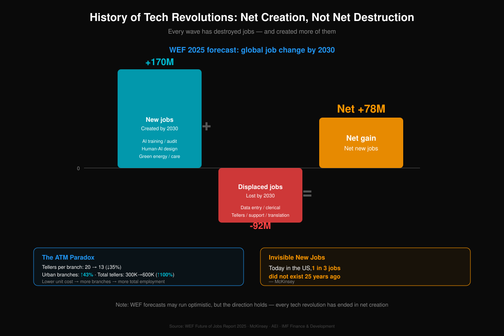

The **ATM paradox** makes the case better. Once automated teller machines spread, tellers per bank branch fell from 20 to 13 (−35%), and everyone assumed the job was finished. What actually happened: the operating cost of a branch collapsed, so banks opened **43% more branches**, and the total number of U.S. tellers rose from 300,000 to 600,000 — **double** [124]. Unit costs fell, demand expanded, total employment rose. McKinsey estimates that **about one third of jobs in America today did not exist 25 years ago** [124].

What makes the premise questionable is not that AI will spare jobs — it won't. It is that **we systematically see the jobs being destroyed and cannot see the jobs not yet invented**. The former have names, incumbents, unions, press coverage. The latter are a blank.

Three honest caveats. WEF's forecast may be optimistic. **"Net" hides transition costs** — the 92 million displaced do not become the 170 million hired, and a net figure that means something in the aggregate means nothing to an individual. And Chapter II argued a genuine structural difference: AI competes directly with human cognition, potentially compressing the room for workers to move up the value chain. The BIS made the same point in its 2026 Annual Economic Report [122].

So the correct statement is not "don't worry, it nets out." It is this: **history is on the side of net creation, but the transition cost this time may be the highest yet — and transition cost is precisely where policy can act.**

#### Premise two: laid off = downgraded

The displacement spiral in Chapter II assumes displaced white-collar workers can only move down: lower pay, career change, into service work AI cannot yet do. But the barrier to starting a company is collapsing at the same speed.

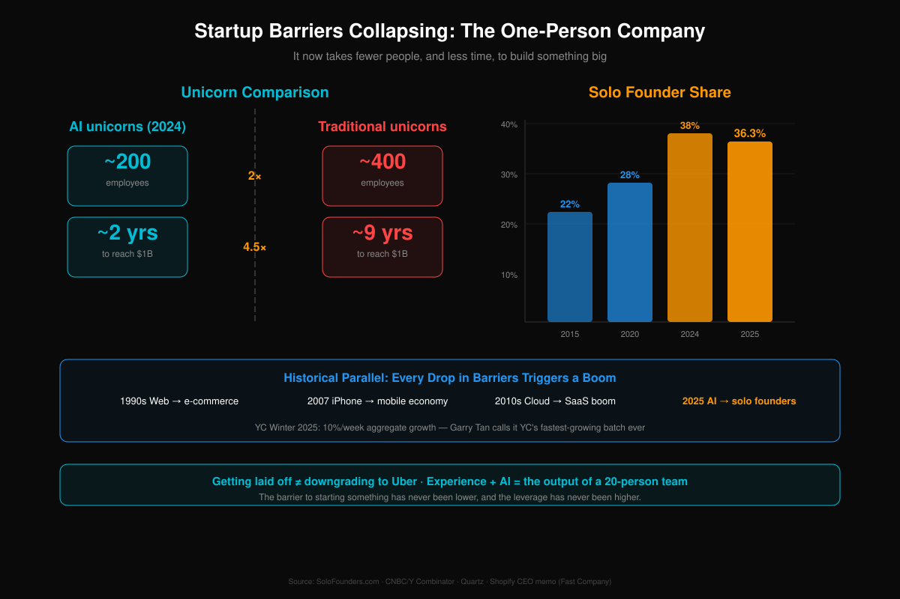

AI companies reaching a $1B valuation around 2024 averaged roughly **200 employees** in about **2 years**; traditional unicorns averaged about **400 employees** over about **9 years** — half the headcount, 4.5× the speed [125]. Solo founders rose from 22% of founders in 2015 to 28% in 2020 and 38% in 2024 (36.3% in 2025) [125]. Every previous drop in the barrier produced an explosion: the web in the 1990s → e-commerce; the iPhone in 2007 → the mobile economy; cloud in the 2010s → SaaS.

For an individual this means: **being laid off ≠ downgrading to driving for Uber. Experience + AI = the output of a former 20-person team.** The Driver / Ground Truth / Glue roles from Chapter III are exactly what a displaced senior employee already has. What they lacked was never capability — it was the twenty people it used to take to start.

Two honest caveats. **The first is selection: this is a narrow door.** Solo founding fails most of the time, and it structurally favours people who already have savings, networks, and risk tolerance — not the laid-off 45-year-old middle manager of Chapter VIII. It is a pressure-release valve. It is not a channel capable of absorbing tens of millions.

**The second is more fundamental: single point of failure.** A 20-person team has redundancy — someone covers when you are ill. One person plus AI may match the throughput of twenty, but the redundancy is **zero**. Worse, in that pairing **the human is the only component that gets sick, gets tired, breaks down, and has no spare** — AI does not degrade; humans do. Some businesses are structurally unsuited to solo operation: anything requiring continuous availability, unbroken client relationships, or a licence that lapses if operations stop.

That has an inverse implication, developed in §3.5.1. If the human is the most fragile and most bottleneck-prone component in the system, evolutionary pressure points toward **reducing what the human carries**. Seen that way, the one-person company is a transitional form. Its successor is not "one person managing many AIs." It is "many AIs borrowing one person's legal personhood and social relationships."

#### Premise three: cash makes people lazy

Chapters V and VI keep returning to the same knot: AI-created wealth does not flow through payroll, so distribution has to be rebuilt. The standard objection to paying people directly is that they will stop working. Is there evidence? Yes — pointing the other way.

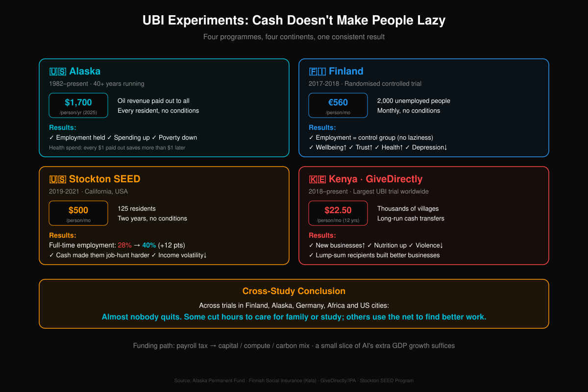

- **Alaska Permanent Fund**: running since 1982, an unconditional dividend to every resident (~$1,700 per person in 2025). Employment did not fall; consumption rose; poverty fell [126]
- **Finland**: a 2017–18 randomised controlled trial paying €560/month unconditionally to 2,000 unemployed people. Employment matched the control group; wellbeing, trust and health improved, depression fell [33]
- **Stockton SEED (California)**: $500/month unconditionally to 125 residents, 2019–21. The most counter-intuitive result of all — **full-time employment rose from 28% to 40%** [126]. Recipients looked for work *harder*, because they finally had the slack to interview, to train, to turn down a bad offer
- **GiveDirectly (Kenya)**: the largest UBI experiment in the world, thousands of villages, $22.50/month for 12 years. Entrepreneurship up, nutrition improved, domestic violence down [126]

The cross-study conclusion: **most people who receive money do not quit.** Some cut hours to care for family or study; some use the safety net to find better work or start something. Stockton is the number worth remembering — **poverty is itself a cognitive load, leaving no capacity for any long-horizon decision, job search included.**

The hard question was never whether cash breeds idleness. It is **where the money comes from**. Chapter V gave the direction: shift the tax base from labour to capital, compute and carbon. This is not charity. It reconnects machine output to the demand side, and without that the "production is fine, consumption collapses" knot has no solution.

### 11.2 Policy Levers: Three Lines, Three Horizons

Strip the three premises away and what remains is an engineering problem: **what specifically, and when.**

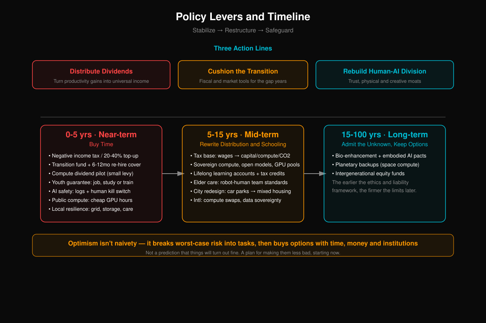

Three lines run throughout: **distribute the dividend** (turn productivity into universal income), **cushion the transition** (fiscal and market tools for the gap years), and **rebuild the human–AI division of labour** (moats in trust, the physical world, and creativity).

**0–5 years — buy time.** Negative income tax or wage subsidies (20–40% top-up); transition funds plus 6–12 months of re-employment insurance; a pilot compute-dividend levy; a youth guarantee of job, study or training so no cohort falls out of the system entirely; mandatory AI logging and human circuit-breakers; a public digital base offering low-cost GPU hours to individuals and small firms; local resilience investment in grid, storage and elder-care infrastructure.

**5–15 years — rewrite distribution and education.** Tax-base restructuring from payroll toward capital, compute and carbon; sovereign compute plus open-source ecosystems plus public GPU vouchers; lifelong-learning accounts with tax-creditable study points; standardised robot-plus-human protocols for elder care; urban redesign turning parking into mixed housing; international compute-swap and data-sovereignty agreements.

**15–100 years — acknowledge the unknown, preserve options.** Coexistence protocols for biological augmentation and embodied AI; planetary backup options including orbital compute; an intergenerational equity fund.

Nothing on this list is newly invented. Every item has been discussed, piloted, or partially implemented somewhere. **What is missing has never been the tools — it is the political will to put them on a timetable.**

### 11.3 The Test: When to Change Gear

The six-indicator dashboard in §3.6 is this chapter's decision rule: entry-level postings, the youth-versus-overall unemployment gap, whether AI CapEx crowds out headcount, accelerator lead times, pension solvency, and housing vacancy alongside regional bank capital. Each has explicit red/amber/green thresholds.

One trigger: **three or more red lights for two consecutive quarters → switch from incremental reform to emergency intervention.**

Why write it down in advance? Because incremental reform and emergency intervention are two different toolkits, and the most common failure of human organisations is still reaching for the first one when the second is required. 2008 was that. 2020 was that. **Pre-committing to the switch condition means that when the moment arrives and everyone is arguing about whether we are really there yet, there is an answer that does not need to be re-litigated.**

The reverse rule matters just as much: **while the lights are not red, do not spend emergency tools early.** Firing all the ammunition at the wrong moment is as damaging as failing to fire at the right one.

### 11.4 Optimism Is Not Naivety

Take each disaster from the nine chapters of Volume I and map it against this one:

| Problem | Lever |
|---|---|
| II. Intelligence premium collapses; entry-level jobs vanish | Youth guarantee; lifelong-learning accounts; entry-level posting monitor |
| V. Population decline, worsening dependency ratio | Stop subsidising births; invest in AI and robotics; standardise care protocols |
| VI. Mortgage defaults → banking crisis | Transition funds plus re-employment insurance break the pay-cut→default chain; twin housing/bank-capital warning |
| VI. Policy toolbox fails, tax base erodes | Shift the base from wages to capital, compute and carbon; compute-dividend levy |
| VII. Tragedy of the commons; nobody brakes | Compute-swap and data-sovereignty agreements; mandatory AI logging and circuit-breakers |
| IX. Species divergence and intergenerational unfairness | Augmentation coexistence protocols; intergenerational equity fund |

No single item solves the problem, and together they do not guarantee a good ending. But they turn a diffuse "AI will destroy everything" into dozens of concrete tasks with an owner, a deadline, and a test. That is the entire point of this chapter:

> **Optimism isn't naivety — it's breaking worst-case risks into actionable tasks and buying options with time, distribution, and institutions.**

Chapter VII argued that global coordination is close to impossible: countries sit at different points in the AI food chain, absorb different shocks, and carry different institutional genes. This chapter does not overturn that. But "global coordination is impossible" is not "nothing can be done" — most items on the list above can be started by **a single country, or even a single city**. Alaska did not wait for the world to agree on dividends. Finland did not ask Brussels for permission to run its trial. Stockton is a city of three hundred thousand people.

Chapter I said the adaptation window may be short. Short is not the same as absent.

---

### 11.5 For Managers and Policymakers: The One-Line Version

The core conclusion from section 5.5 of Volume I, worth restating here:

**Do not try to produce more humans to compete with machines. Instead, ensure that the wealth machines create flows to people.**

The production side already has its answer -- AI and robotics. The distribution system on the consumption side is the problem you need to solve. Distribution has to be in place before the first wave of mass AI layoffs arrives (estimated 2028-2030). Otherwise, "ghost GDP" will turn into a real social crisis.

---

## XII. The Transition: Why the Road Between Here and There Is the Most Dangerous Part

### 12.1 The Endgame May Be Good

Follow the chain of reasoning from Volume I to its end and you arrive somewhere that looks paradoxical:

The combined productivity of AI + robotics may deliver radical material abundance for humanity. The production costs of food, clothing, housing, healthcare, and education could approach zero.

**That sentence needs a timestamp, or it will fight with the rest of this book.** It describes the **endgame after socialized mass production has fully played out** -- the post-scarcity society of Volume I, section 9.6, a state already close to "distribution according to need." The distribution crisis, the pension gap, and the mortgage collapse that Volume I spent six chapters working through describe something else: **the transition between now and that endgame**.

**Both statements hold, because they sit at different points on the timeline.** The endgame is costs approaching zero; the transition is distribution failing -- and this volume, from beginning to end, deals only with the transition. Read the two together and you end up thinking "if everything is free, what is there to be anxious about?" -- **that is using a conclusion from several decades out to console yourself about this year.** Sam Altman predicts "massive deflation" -- AI usage costs falling tenfold every year [34]. Marx's vision of communism -- material abundance, distribution according to need, free human development -- may actually be realized, though not through proletarian revolution. Through a fleet of machines that never need to eat.

Standing in 2050 and looking back, you might say: "That stretch was rough, but the outcome was not bad."

### 12.2 But the Transition Will Kill People

The problem is that you are not standing in 2050. You are standing in 2026.

Between now and that "abundant endgame" lies a transition of perhaps 10-20 years. During this period:

- **The production side has already been revolutionized by AI** -- efficiency skyrockets, costs plunge, GDP may keep growing
- **But the distribution side is still stuck in the old system** -- wages are the only income source, social insurance runs on payroll taxes, pensions assume people die around 80

The time lag between production and distribution is the ordinary person's nightmare.

GDP is growing, but you just got laid off. Prices are falling, but your mortgage hasn't. AI is making everything cheaper, but you can't afford even the cheap stuff -- because you have no income. This is the "ghost GDP" of Volume I, section 2.3: statistics paint a rosy picture while ordinary people see only ruin.

**The core contradiction of the transition: technology advances far faster than institutions can adapt.**

Some AI systems can spread to industry scale within five years -- customer service, translation, entry-level programming, and content production are already there -- but retraining people out of the corresponding jobs takes ten. (Self-driving cars are deliberately not used as the example here: Volume I, section 3.2 already argued that they are stuck on the "last mile" and still operate only inside geofenced areas. They are precisely the counterexample -- **the technical capability arrived, and deployment ran far slower than expected.**) AI could replace most entry-level programming jobs within a year, but university curriculum reform takes five. Robots could take over warehouses within three years, but reforming the social safety net may require a generation of political struggle.

**In the gap between technology arriving and institutions catching up, ordinary people are exposed.** This volume is about getting you through that gap with as little damage as possible.

### 12.3 Transitions in History

This is not the first time.

The British Industrial Revolution (1760-1840): the endgame was a several-fold increase in per capita income. But the transition -- roughly 60-80 years -- was child labor, slums, cholera, and workers' uprisings. The average life expectancy of a Manchester worker once dropped to just 17. When Engels wrote *The Condition of the Working Class in England*, the Industrial Revolution had been underway for 80 years.

The American Gilded Age (1870-1900): the endgame was America becoming the world's largest economy. But the transition -- railroad barons monopolizing everything, workers toiling 16-hour days, no minimum wage, no social insurance, no workers' compensation. It took the New Deal of the 1930s to build a social safety net.

**Many large technological revolutions show up as prosperity in the winning countries and in the long-run statistics, but the transition is blood and tears -- and the gains do not get distributed automatically.** The fruits of the Industrial Revolution and the Gilded Age were eventually shared out through unions, legislation, and political struggle, not through the technology itself. The regions and groups that got left behind usually do not appear in the "endgame prosperity" narrative. What differs from case to case is how long the transition lasts, how painful it is, and whether institutions can keep pace.

What makes the AI revolution unique: **the speed is an order of magnitude faster.** The Industrial Revolution took 60 years to put textile workers out of jobs; AI may take 6 years to do the same to programmers. The transition is compressed -- which means the pain is more concentrated and the window for institutional adaptation is shorter.

---

## XIII. Mental Resilience: The Foundation for Everything Else

### Why Psychology Comes First

Most "survival guides for the AI era" put mental health last -- first they teach you skills, finance, and career planning, then tack on a "take care of your mental health" appendix.

**That priority order is wrong.**

If someone's mental state collapses, they will not learn new skills, manage their money, or build connections. They will lie in bed doomscrolling, or worse. Mental health is not a "soft" need. It is the prerequisite for all action.

### 13.1 The Psychological Structure of the AI Shock: Crushed From the Top Down

Viewed through Maslow's hierarchy of needs, AI does not strike from the bottom (can't afford food). It **crushes downward from the top, simultaneously**:

| Need Level | AI's Impact | Speed of Collapse |
|---|---|---|
| Self-actualization | "Everything I spent a lifetime learning is suddenly worthless" | Collapses first |
| Esteem | "I am no longer needed; I am surplus" | Follows closely |
| Belonging | "Social circle shrinks after job loss; AI companions replace real people" | Slow erosion |
| Safety | "Can't make mortgage payments; pension falls short" | Delayed onset |
| Physiological | "Can't afford food" | Last (unlikely in developed nations) |

**But this order does not hold for everyone, and saying "most people" would be over-generalizing.** For white-collar and middle-class people **with some savings and a tight bond between career and identity**, the shock usually starts at the identity layer -- they break when they feel useless, not when they cannot eat. But for the highly indebted, the low-savings, the informally employed, and immigrant households, **a cash-flow rupture may punch straight through the safety layer and even the physiological layer**, and the identity crisis never gets its turn. Chapter XV, section 15.4 breaks this difference down group by group.

The U.S. suicide rate rose markedly during the Great Depression and touched the highest level on record in the United States in the early 1930s. Where the rise concentrated is the part that matters: not among the poorest, but among **working-age adults** -- the group with the tightest "career = identity" bond. They did not starve. There was no mass famine in 1930s America. They were stripped of purpose.

### 13.2 A Lifetime of Accumulation, Wiped Out: How Deep That Pain Goes

Imagine you are a 45-year-old senior developer. You spent 20 years mastering programming, from C++ to Java to Python, rising to the role of architect. Your professional identity, social standing, income, and self-confidence are all built on "I can write code."

Then Claude Code arrives. A fresh graduate uses it for a few weeks to deliver what would have taken you months. Your 20 years of experience become "legacy knowledge" in the face of AI.

This is not a "just learn a new tool" problem. This is **identity-level destruction**.

The same thing is happening to translators (10 years perfecting the craft, AI produces results in seconds), accountants (earned the CPA, AI processes books 100x faster), designers (years of visual intuition, AI generates better-looking work), lawyers (memorized thousands of cases, AI searches all case law without omission), and journalists (decades of editorial experience, AI mass-produces news copy).

**Behind every devalued skill is a person's youth, sweat, and sense of self.** Telling them to "just learn something new" is easy to say from the sidelines.

What's crueler still: learning something new may not even help. You spend a year acquiring a new skill, and AI may be able to do it six months later. **Your learning speed can't outrun the rate of depreciation** -- a predicament without historical precedent. In past technological revolutions, a horse-carriage driver could move to a factory; when factories automated, workers moved to the service sector. There was always a "next stop." This time, AI may replace all the stops simultaneously.

### 13.3 The Special Risk Facing Men

This is not a politically correct discussion. It is a data-driven one.

In many societies, men are bound more tightly to the role of **economic provider**. "Providing for the family" is not just a responsibility; it is the central pillar of male identity.

When that pillar is pulled away:
This section rests on Volume I, section 5.3 and Chapter VIII, where the data was already laid out. Its only job here is to translate that into something you can use.

- Depression among unemployed men runs **1.5-2x the rate among unemployed women** [88] -- note this is not a claim that men are more prone to depression overall (overall prevalence is higher in women). It is that **the same job loss does more damage to a man**. The difference is not in the event; it is in what the event hits
- For every 1-percentage-point rise in male unemployment, the marriage rate drops about **1.5-2%** [88]
- Thirty years of economic stagnation in Japan: the lifetime non-marriage rate for men rose from **5% to 28%** [88] -- "herbivore men" was never a cultural preference; it was the product of economic despair
- In China, "owning a car and a home" is the price of entry to the marriage market -- AI-driven layoffs lock more men out

None of that means women are hit more lightly -- customer service, admin, accounting, and HR, white-collar roles with high female representation, are hit first, and women absorb a compound blow to income, caregiving load, and professional identity at once. The point here is that **the blow lands in a different place**: for people bound more tightly to the provider role, job loss more easily strikes identity directly. **Middle-aged men may be the highest-risk group for mental health in the AI era.**

### 13.4 Create Your Own "Luck" -- Evidence From a Decade of Scientific Research

British psychologist Richard Wiseman spent ten years tracking hundreds of self-described "lucky" and "unlucky" people, publishing his findings in *The Luck Factor* [130]. His central discovery has to be stated precisely: **randomness itself cannot be eliminated, but a person can change how they get exposed to opportunity, how they recognize it, and how they absorb bad outcomes** -- and on those three things, "lucky people" and "unlucky people" show entirely different psychological and behavioral patterns. The patterns can also be learned. When he taught "unlucky" people to adopt "lucky" thinking, their lives genuinely improved.

That is directly relevant to surviving the AI era, because the years ahead are full of uncertainty -- and Wiseman's research is precisely about how to find good outcomes inside uncertainty.

**Four behavioral patterns of lucky people:**

**1. Create and seize chance opportunities -- expand your "luck surface area."**

Lucky people have broader social networks, talk to people from different backgrounds, and are willing to try new things. Unlucky people stay in their comfort zone, associate with familiar faces, and reject new experiences.

In the AI era, your next opportunity will most likely not come from your existing circle. Actively expanding your exposure -- attending events you would normally skip, talking to people you would not normally talk to, trying things you would not normally try -- increases the probability of encountering good fortune.

**2. Maintain a relaxed awareness -- anxiety is the enemy of opportunity.**

Wiseman ran a classic experiment: he asked subjects to count the number of photos in a newspaper. On the second page, in large print, it said: "Stop counting -- there are 43 photos in this newspaper." The lucky people noticed it and finished in seconds. The unlucky people were so focused on counting photos that they missed it entirely.

**Intense, sustained anxiety narrows attention; relaxation lets you see opportunities.** (A moderate level of alertness is useful -- what is meant here is long-term overload, not all tension.)

The biggest trap of the AI era is anxiety -- it locks your attention on "what you've lost" while blinding you to "what's emerging." Staying relaxed does not mean not caring. It means paying attention to problems while preserving the bandwidth to notice new possibilities.

**3. Positive self-expectation -- belief becomes self-fulfilling.**

Lucky people believe good things will happen to them. This is not blind optimism; it is a mindset that fulfills itself. When you believe you can find a way out, you act more proactively, and that action itself increases the probability of finding one.

The concept of "reflexivity" from Chapter X applies perfectly here -- **your beliefs about the future change your behavior, and your behavior changes your future.**

**4. Counterfactual thinking -- broke a leg? At least it wasn't both.**

When bad things happen, lucky people automatically imagine "how it could have been worse" -- Got laid off? "At least it happened while I had savings, not when my mortgage payments were at their peak." Skills devalued? "At least I found out early, not five years from now."

This is not self-deception. It is a validated psychological resilience mechanism. It does not change the facts, but it changes your capacity to bear them. Over the next few years, almost everyone will encounter "bad things." The difference is not whether you can avoid them (you probably can't), but **your psychological elasticity after they happen.**

**Practical steps:**
- Every week, have a conversation with at least one person you would not normally talk to (expand your luck surface area)
- When you feel anxious, deliberately slow down -- go for a walk, cook a meal, instead of scrolling your phone (cultivate relaxed awareness)
- Every day, write down one thing that "could have been worse" (train counterfactual thinking)
- Set a small, actionable positive expectation -- not "I'll earn a million this year" but "this week I'll finish X"

### 13.5 The Anatomy of Anxiety: A Simple but Useful Formula

Anxiety has a formula:

**Anxiety = Importance x Uncertainty**

As long as something is **unimportant** or **more certain**, anxiety decreases. The problem in the AI era is that many things are simultaneously becoming "very important" and "very uncertain" -- Will I lose my job? Can I still make mortgage payments? Is the investment in my child's education worth it? Will my skills become obsolete?

Anxiety goes through the roof.

But the formula also hands you two clear levers: **reduce the uncertainty** or **reduce the importance**.

#### Reducing Uncertainty

You cannot eliminate uncertainty -- no one can predict the precise speed of AI development -- but you can **raise your tolerance for it**:

- **Break big questions into small ones.** "What do I do for the next 20 years?" -- that question carries 100% uncertainty and will crush anyone. But "what three things will I do in the next six months?" -- much less uncertain. Pull the focus of your anxiety from "the long-term big picture" back to "near-term actionable steps."
- **Build a worst-case plan.** The most tormenting thing about uncertainty is "not knowing what will happen." But if you have already thought through the worst case and have a contingency ("If I get laid off, I have X months of savings; Plan B is XX"), the destructive power of uncertainty drops dramatically -- because it becomes "certainty about something bad," and a certain bad outcome is far easier to handle than an uncertain good one.
- **Control your information intake.** Reading ten "AI will replace everyone" articles a day only amplifies anxiety. This does not mean burying your head in the sand. It means distinguishing between "useful information" and "anxiety-generating noise." Recommendation: catch up on AI developments once a week rather than taking push notifications all day.
- **Wiseman's relaxed awareness:** As section 13.4 said -- anxiety narrows your vision; relaxation lets you see opportunity. Deliberately practice "attention in a relaxed state" -- good ideas come more easily during a walk, while cooking, or while exercising than while anxiously scrolling your phone.

#### Reducing Importance -- The More Subversive Move

Many things making you anxious are **not actually as important as you think they are**. But you have never questioned their importance, because all of society keeps telling you "this matters."

**Work.** "Losing my job" is what most people worry about most. But ask yourself: what exactly are you anxious about? If it is "losing income" -- then the core issue is financial security, not "the job" itself. After cutting expenses and building a buffer, "losing this particular job" becomes less important. If it is "losing identity" -- then the issue is that you have tied too much self-worth to your job title (see section 13.6, Strategy 1: decouple identity).

**Your child's grades.** If you accept the idea that "winning exams doesn't matter in the AI era" (see Chapter XVI), a large block of grade anxiety comes loose -- but **do not slide into "grades don't matter"**: education still performs selection, social stratification, transferable-skill training, and credentialed access, and none of that has disappeared. What should actually change is the object of the anxiety: **from ranking to capability structure.** What you are really anxious about is not the grades themselves, but the causal chain: "bad grades -> can't get into a good university -> can't get a good job -> life is ruined." When that chain itself is breaking, the "importance" of grades drops sharply.

**Face.** "What will people think if I get laid off?" "What will relatives say if I take a pay cut?" -- social comparison is a massive source of anxiety. But in an era of mass structural unemployment, getting laid off is not a reflection of personal ability; it is the tide. When the people around you are going through the same thing, "what others think of me" naturally fades -- because everyone is too busy dealing with their own situation.

**Your home.** This is the easiest one to get wrong, so it has to be split into three layers.

**Layer one: the price really does not affect daily life -- but the reason is not "you still live in the same place," it is something harder than that: for a person who owns exactly one home and lives in it, whether the price goes to the moon or to the floor, it cannot be turned into cash.** You cannot sell the living room to eat better. This is the only place where "house prices have nothing to do with you" genuinely holds.

**Layer two: but saying it is entirely irrelevant is dishonest -- it affects your state of mind.** It is registered in your name, after all, and a shrinking paper value really does weigh a person down, which in turn affects whether they dare to change jobs, dare to have a child, dare to take any risk at all. Mental accounting is not an illusion; it changes behavior.

**Layer three, and this is the one to actually manage: leverage risk is not a paper problem, and it depends heavily on which country you are in and which stage you are at.** The collapse chain in Volume I, Chapter VI starts precisely with the home you live in -- pay cut, missed payments, negative equity, refinancing failure, unable to sell when you need to move cities for work. But how tight that chain is pulled varies enormously by place: **in markets with ample land supply, high inventory, and large price swings (China is the classic case), defaulting on the home you live in is a real risk, and it is already happening; in markets with high ownership rates, constrained supply, and poor rent-versus-buy substitutability (Singapore is the extreme example -- if you do not live in this unit, where do you live), both the room and the willingness for prices to fall are smaller, because "sell it for cash" is simply not an option for the overwhelming majority of households.** The same piece of advice means completely different things in those two markets.

So the right move is not to cross "property value" off the anxiety list wholesale. It is to **cross off price anxiety and keep leverage management**: what you should actually watch is not the price of your home, it is your debt ratio and your cash-flow buffer.

**One-line summary: Examine your anxiety list and ask yourself, "Does this actually matter, or am I being held hostage by social inertia?"** You will find that many "important things" can actually be let go. Let go of one, and your anxiety drops by one degree.

### 13.6 Concrete Mental Survival Strategies

**Strategy 1: Decouple early -- detach your identity from your career**

Do not wait until the day you lose your job to ask "Who am I?" **Start now.**

Exercise: Write down ten answers to "I am ____." If your first five are all work-related ("I am a programmer," "I am a director at XX Corp"), your identity structure is highly fragile.

Goal: Make at least half of your self-concept independent of work -- "I am a runner," "I am a father of two," "I am a member of the community basketball team." When work disappears, **these identities remain**.

**Strategy 2: Build sources of fulfillment that AI cannot replace**

On a growing share of standardized output, AI will beat the ordinary person on efficiency or on quality. But AI cannot replace your **experience of the process**.

Running is not about being faster than a car. Playing guitar is not about outperforming an AI musician. Cooking is not about being more efficient than a robot. **The process is the purpose.**

Find at least one thing you do purely because "the act of doing it feels good." In the AI era, this kind of intrinsic, process-oriented satisfaction is the only thing that cannot be replaced.

Suggestions:
- Physical activities (running, swimming, hiking, martial arts) -- AI has no body; physical sensation is yours alone
- Hands-on crafts (woodworking, pottery, cooking, gardening) -- the satisfaction of creating something tangible with your own hands
- Social activities (communities that meet regularly -- book clubs, sports teams, volunteer organizations)
- Creative pursuits -- but with process as the goal, not output (keeping a journal rather than chasing viral articles)

**Strategy 3: Your social network is your "psychological ICU"**

Isolation is the deadliest factor in a crisis.

Research consistently shows that social support is among the strongest protective factors against suicide and depression [137]. Not because friends can help you find a job (though they might), but because **"someone cares about me" is itself a reason to keep going.**

But the AI era carries a trend: social connection is shrinking. Remote work reduces informal interaction. AI companions make loneliness "bearable." Social media creates the illusion of connection while deepening isolation.

**Actively maintaining real human social networks is one of the most important investments you can make in the AI era.** You do not need many people -- 5-10 whom you trust deeply is enough. But these relationships require ongoing investment: meeting in person regularly, sharing experiences, showing up when the other person is struggling.

Specific suggestions:
- At least one face-to-face social interaction per week (not online)
- Join at least one community that meets regularly in person
- Proactively reach out to a friend you have not seen in over six months
- If you find yourself increasingly relying on AI chat to meet your social needs -- that is a warning sign

**Strategy 4: Accept uncertainty as the new normal**

The old life narrative was linear: school -> work -> retirement -> death. Every step had a "right answer."

The AI era has no right answers. You might change careers at 35, change again at 45, and discover at 55 that everything you learned before is useless.

**Accepting this is itself a form of psychological fortification.** If you still measure yourself against a linear narrative, every "deviation from the track" feels like failure. But if you accept that "there is no track," every turn is just a turn -- not a failure.

Recommended practices:
- Meditation/mindfulness -- training the ability to "accept the present without judgment," backed by solid neuroscience evidence
- Journaling -- writing out anxiety; research shows that putting worry into words reduces amygdala activation
- Deliberately exposing yourself to small uncertainties -- trying new foods, visiting unfamiliar places, talking to strangers

### 13.7 If You Are Already in Crisis

What follows is not asking you to solve structural problems on your own. When institutions are absent, the job of these items is to **bring the damage down first**.

- **Losing your job is not your fault.** This is structural change. A horse-carriage driver in 1900 did not lose his job for want of effort -- the automobile arrived.
- **Seeking professional help is not weakness.** If you have felt hopeless, sleepless, or unable to concentrate for more than two weeks straight -- see a doctor. It is as normal as seeing a doctor for a cold.
- **Downshifting is not defeat.** A former high earner delivering food is not failing -- it is being pragmatic. Being alive matters more than saving face.
- **Do not carry it alone.** Tell someone you trust what you are going through. Shame loses its power the moment you speak it.
- **Crisis hotlines:** Contact the emergency services or the local crisis line **where you are** first. In mainland China you can call the 24-hour mental health hotline 400-161-9995, or the Beijing Psychological Crisis Research and Intervention Center at 010-82951332 (the Chinese numbers are listed because most readers of the Chinese edition are in a Chinese-language context; they are not meant as the only route out)

### 13.8 For the People Around You: Someone You Know May Be Struggling

If someone near you has recently lost a job, become withdrawn and quiet, said things like "I'm useless," or started drinking noticeably more -- **reach out to them.**

You do not need to say anything profound. "I've been thinking about you. Want to grab a meal?" That one sentence may be enough.

The most counterintuitive fact of the AI era: **in a world of extreme technological advancement, the most primitive form of human connection -- "someone cares about me" -- may matter more than any technology.**

---

## XIV. Face Reality: HALO — What Is Losing Value, What Is Gaining Value

### 14.1 HALO: Wall Street's Panic Signal

In February 2026, a new term emerged on Wall Street: **HALO -- Heavy Assets, Low Obsolescence.**

Josh Brown of Ritholtz Wealth Management coined it, and Morgan Stanley subsequently adopted it into its investment framework [131]. The core logic: **tangible assets (factories, energy, logistics, land) are safer than intangible assets (software, brands, intellectual property)** -- because AI can copy code but cannot copy an oil refinery.

Goldman Sachs data: since 2025, HALO-type companies have outperformed asset-light companies by **35%**. The energy sector is up 25.3%, materials up 18.1%. Meanwhile, SaaS companies lost roughly **$300 billion** in market capitalization in a single trading day.

**What this means for ordinary people:** HALO is not just an investment strategy. It is a cognitive framework -- **things that are hard to replicate digitally are what hold lasting value.** Whether we are talking about companies, skills, or you yourself.

### 14.2 The Death of SaaS: When Code Becomes a Consumable

In 2025, Andrej Karpathy introduced "vibe coding" -- describe what you want, and AI generates the code [133].

Claude Code, Cursor, and Replit Agent already let a mid-level developer replicate the core functionality of a medium-sized SaaS product in a matter of weeks.

**The core paradigm of software engineering has been upended.** For the past 50 years, the industry pursued DRY (Don't Repeat Yourself), modularity, reusability, and scalability -- because writing code was expensive. But when AI can generate full features in minutes, the economic rationale for "reuse" vanishes. **Code shifts from "asset" to "consumable"** -- use it, discard it, regenerate when needed [134].

This is "disposable software." A person no longer necessarily has to subscribe to a lightweight project-management SaaS -- AI can generate a good-enough custom version from a description in minutes. **But "can generate the core functionality" is not the same as "enterprises no longer need a subscription":** what SaaS sells is not only code, but stable operations, permission management, collaboration and data migration, audit logs, integration ecosystems, security and compliance, liability, and long-term maintenance. **What is actually getting squeezed is purely functional tools with no data, no embedding in workflow, no collaboration network, and no compliance liability -- not all SaaS.** Rather than "the death of SaaS," call it **a repricing of the SaaS profit pool**.

**Which SaaS companies can survive?** Only those whose moat lies not in "code" but in:
- **Data**: unique, non-replicable data (e.g., Bloomberg Terminal)
- **Network effects**: the more users, the more valuable (though AI agents are eroding this too)
- **Regulatory barriers**: legal requirements to use specific systems (healthcare, financial compliance)

Everything else -- project management, CRM, forms, basic analytics -- is a pseudo-asset [132].

### 14.3 What This Means for You Personally

The same logic **can be borrowed** for your career and your income -- with one thing said up front, because this is a metaphor and not an isomorphism: a company owns the title to the refinery, while an individual usually only sells hours of labor, and "asset safety" is not the same thing as "income safety." So the real question for an individual is not "do I look like a heavy asset." It is: **what scarcity is my income attached to -- title to a real asset, an institutional license to practice, a situation that requires physical presence, or a trust relationship that is hard to replicate?**

**Ask yourself: Is my value "HALO-type" or "SaaS-type"?**

- If your value lies in "I can do something AI can also do" -- you are SaaS, and your moat is being hollowed out
- If your value lies in "I possess something AI cannot replicate" (trust relationships, physical presence, unique experience, regulatory credentials) -- you are HALO

That framework is far more useful than "learn AI."

---

### 14.4 Money: What Counts as a Truly Safe Asset
#### 14.4.1 Asset Tiers Under the HALO Framework

**Relatively safe ("atom world" assets):**
- Real estate in core cities (location cannot be replicated)
- Energy and infrastructure investments
- Physical gold
- Your own health, judgment, trust relationships, and transferable capabilities (**the most important "low-obsolescence capital" at the individual level** -- note it is not called a heavy asset, because skills are exactly the thing that can go obsolete, and health is not a title deed either)

**High risk ("bit world" assets):**
- Software companies whose revenue comes mainly from quickly replicable standardized functionality, with no data, network, compliance, or workflow embedding (**note this is not "tech stocks" as a whole** -- companies holding compute, chips, cloud infrastructure, distribution channels, or deep embedding in business processes are in a completely different position)
- Commercial real estate dependent on white-collar spending
- Cryptocurrency (highly volatile, but may become the payment infrastructure of the AI economy)

**Already depreciating:**
- Real estate in third- and fourth-tier cities
- Investment in traditional degrees
- Business models built on "information brokerage"

#### 14.4.2 Cash Is Optionality, Not Waste

In periods of extreme uncertainty, cash buys you **time** -- time to survive before you find your next income source. Recommendation: maintain 6-24 months of living expenses in liquid reserves.

#### 14.4.3 An Honest Word About "Passive Income"

Time for some cold water: **most "passive income" sources are themselves under threat from AI.**

- Online courses? AI can generate unlimited free courses
- E-commerce? AI agents make pricing so transparent that margins approach zero
- Content creation? AI can produce unlimited content
- Rent? Depends on the city

More AI-resistant income usually comes from three kinds of scarcity: **title to real assets** (prime urban locations, energy interests), **institutional access rights** (licenses, credentials, compliance standing), and **trust networks that are hard to replicate**. Note that the third one, strictly speaking, is not passive income -- it requires continuous maintenance, and it decays if you stop showing up.

For most ordinary people, rather than chasing "passive income," pursue **"low burn rate"** -- reduce fixed expenses so you can hold on even when income drops.

---

### 14.5 Skills: What Counts as a "HALO-Type Skill"
#### 14.5.1 HALO-Type Skills vs. Light Skills

**HALO-type (heavy skills, low obsolescence):**
- Requiring physical presence: plumbing, welding, pipefitting, electrical work
- Requiring human trust: counseling, nursing, community organizing
- Requiring judgment and accountability: a surgeon making operative decisions, a lawyer arguing in court
- Requiring taste and aesthetics: haute cuisine, interior design

**Light skills (high obsolescence risk):**
- Pure information processing, pure coding ability, pure knowledge memorization, standardized process execution

#### 14.5.2 "Learning AI" Is Not the Answer

The prompt engineering you learn in 2025 may be useless by 2027. Claude Code itself is upending the advice to "learn to code."

**What you should learn is the judgment, not the tool** -- "Is this AI output correct?" "When should I trust AI, and when shouldn't I?" "Which of these three options is best?"

#### 14.5.3 Skill Strategies Have Expiration Dates Too

- **2025-2028**: Use AI tools to amplify your existing skills -- the highest-ROI window
- **2028-2032**: Physical skills appreciate; judgment and trust relationships become core assets
- **From the late 2030s (timing highly uncertain)**: if humanoid robots achieve low-cost scale, the window for **some standardized physical skills** will narrow; but complex on-site work, accountability-bearing situations, and trust-based services may last considerably longer. Value concentrates further into "humanness" -- trust, companionship, showing up, signing your name

**The greatest danger is applying last phase's strategy to the next phase.**

## XV. Time and Circumstance: Different Windows, Different Groups

### 15.1 Phase 1: Now to 2030 -- "AI Augments Humans"

**Characteristics:** AI is a tool; humans are still in the loop. Most jobs still exist, but efficiency expectations are surging.

**What you can do:**
- Use AI to amplify your existing capabilities -- not "learn AI," but "use AI to do what you already do, faster and better"
- For white-collar workers and founders who **still have monetizable skills and can raise their output with AI quickly**, this may be the best earning window of the next decade or so -- save what you earn, cut leverage (this does not apply to students, low earners, public-sector workers, or the already retired)
- Expand your social network -- in an economic crisis, connections are more valuable than resumes
- Cultivate at least one "HALO-type" skill or income source

**Traps:**
- "My job is fine" -- American homeowners in 2007 thought the same
- Going all-in on a specific AI tool -- tools change; judgment does not
- "I'm senior enough to be safe" -- seniority buys more time than being junior, but less than you think

### 15.2 Phase 2: 2030-2040 -- "AI Replaces Humans"

**Characteristics:** Mass unemployment becomes visible; UBI or some alternative begins rolling out; consumption patterns shift dramatically.

**Keys to survival:**
- Low leverage -- no mortgage, no heavy debt is the biggest safety net
- Diversification -- not dependent on any single income source
- Health -- those who live to see age-reversal/AI medicine mature could gain decades of additional life
- Community -- the isolated are most vulnerable; those with mutual support networks are most resilient

**An honest admission:** For most ordinary people, outcomes in this phase depend on government redistribution policy, not individual effort. If UBI is not in place and distribution systems are not reformed, personal strategy has extremely limited impact. What you can do is make sure you **hold on until the policy arrives**.

### 15.3 Phase 3: After 2040 -- "The Post-Human Era"

Augmented humans emerge, species divergence begins, "work" may have ceased to exist.

This phase is too distant for specific strategies to matter much. The only certainty: **being alive when it arrives is the prerequisite for everything.**

---

### 15.4 The Real Situation Facing Different Groups
#### 15.4.1 Those With Capital and Skills (Top 10%)

**Advantage:** Savings, networks, learning ability
**Risk:** Overconfidence. "AI can't replace me" -- someone says this during every technological revolution.
**Recommendation:** Use your advantages to build redundancy -- diversified income, assets in core cities, investment in health.

#### 15.4.2 Average White-Collar Workers (Middle 60%)

**The most vulnerable group.** Enough income to feel "fine," not enough reserves to weather a shock.

**What you can do:** Deleverage (top priority), save money, spend your spare time learning skills that will not become obsolete, think through your Plan B.
**What you cannot do:** Solve pension devaluation and mass unemployment on your own -- these require systemic solutions.

#### 15.4.3 Manual Laborers and Low-Income Groups (Bottom 30%)

**Paradoxically, some of them are safer than white-collar workers in the short term** -- AI replaces cognitive labor first, and humanoid robots are still 5-10 years out. **But the "bottom 30%" is not a homogeneous group**: the ones who are safer in the short term hold blue-collar jobs with steady demand, on-site necessity, and a skill barrier (plumbing, welding, pipefitting, electrical work). Low-skill service work, platform gig work, and standardizable back-office jobs are as fragile as white-collar work -- and often have even less cushion.

**What you can do:** Use the window to learn trade skills that are in high demand and short supply. Protect your body. Build community mutual-aid networks.
**What you need (but cannot achieve alone):** Government retraining programs, a social safety net that catches you, distribution reform.

---

## XVI. Children: Let Go of the Obsession -- This May Be the Greatest Liberation

### 16.1 A Realization That Could Halve Parental Anxiety

Let me start with a fact that may be uncomfortable but must be faced: **your child will almost certainly not beat AI in cognitive ability.** No matter how good a university they attend, how trendy their major, how high their GPA -- on the dimensions of pure knowledge and pure skill, AI will be better.

But this is not bad news. **This is liberation.**

Think about it: you push your child to cram, attend tutoring classes, chase grades -- for what? So they can "get a good job and earn good money." But if the endgame of the AI era is radical material abundance and humans do not need to work to survive, the entire premise of that logic chain ceases to exist.

**You may be forcing your child to prepare for an exam whose rules are being rewritten.** (Saying "an exam that will never happen" is claiming too much -- if institutions fail to catch up, competition will not disappear. It may get more brutal, only screening for different things.)

This does not mean education is unimportant. It means the purpose of education needs to be fundamentally redefined: not "beat everyone else," but **"become a whole person capable of enjoying life."**

### 16.2 What Your Child Should Have

**The capacity for joy.** This is not a platitude. In an era where material scarcity may vanish but meaning could become scarce, **knowing what makes you happy and having the ability to pursue it** is the most important survival skill. A child who plays guitar, loves hiking, and enjoys cooking may thrive far better in the AI era than one who only knows how to study for tests.

**Curiosity.** Not "studying for the exam" curiosity, but "this is fascinating and I want to figure it out" curiosity. The only "skill" that will never become obsolete in the AI era is the impulse to learn something new.

**Social skills and empathy.** Real human connection -- trust, friendship, love -- is the scarcest resource in the AI era. High scores are no substitute for stable relationships, emotional capacity, and the ability to cooperate in the real world -- and the two were never opposed to begin with. Education in the future should not optimize only for grades; it should also leave children room to develop friendships, interests, and self-regulation.

**Physical fitness.** A healthy body is the prerequisite for all options. And bodily sensations -- the exhilaration of running, the feel of water against skin while swimming -- are things AI can never experience, nor replace your experience of.

**Resilience.** The future is not a straight line; it is a series of turns. Let children grow up accustomed to "fail and try again" rather than "one exam decides your life."

### 16.3 What to Let Go Of

- Grade anxiety -- AI will outperform any human on exams; this arms race has already lost its meaning
- The linear path of "good university -> good job -> good life" -- this road is breaking apart
- Comparing your child to other people's children -- in the face of AI, everyone loses that competition
- The urge to control -- you cannot plan for a future you cannot imagine, but you can raise a person capable of handling any future

### 16.4 A Different Perspective

Your child **may** be the first generation in human history that does not need to work to survive -- **that is a conditional, not a promise**: it holds only if the distribution system is fixed before then. If it is not, what they face may be weaker labor bargaining power and a longer competition. So the correct move is **double preparation**: do not compress the purpose of education down to exams and employment, but do not assume employment competition will disappear either -- preserve basic cognitive ability, the ability to express themselves, and numeracy and scientific literacy, while dropping the obsession with any single path.

If that condition does hold, what does it mean? It means they can spend their entire lives doing what they truly want to do. Painting, exploring, studying dinosaurs, learning to bake bread, making friends, falling in love, seeing the world -- not "endure decades of work to earn money and then maybe enjoy retirement," but **living the life they want from the very start.**

The ones who land on Mars and travel between stars will most likely be robots and AI, not your child. And that is fine. Your child does not need to land on Mars -- they need to be happy on Earth.

**Be happy when there is reason to be happy. Enjoy what there is to enjoy.** This is not giving up; it is the clearest-eyed outlook for the AI era.

---

## XVII. The Good Things AI Brings: This Chapter May Be Longer Than You Expect

The preceding chapters said a great deal about defense. But a volume that only talks about threats and never about opportunities would be dishonest. While AI is dismantling the old world, it is simultaneously creating a wealth of things that were never before possible.

### 17.1 Healthcare: For the First Time, the Poor Can Afford a Good Doctor

This may be the most direct benefit AI offers ordinary people.

**AI is democratizing diagnosis.** Getting a top doctor's opinion used to require booking a specialist months in advance or flying to a major city's best hospital. Now an AI-assisted diagnostic tool can deliver near-expert-level analysis in minutes.

Specific advances:
- Across a range of imaging-screening tasks, AI-assisted reading has measurably raised early cancer detection rates -- for a patient the difference is finding it sooner, with a wider window to intervene
- Multi-cancer early detection (MCED) blood tests are in clinical trials -- the route of screening for multiple cancers from a single blood draw has been demonstrated, but **it is not yet in routine clinical use, and the high accuracy figures in the reports come from trial conditions and do not equal population-screening performance**
- Mental health chatbots are already providing 24/7 emotional support -- for those who cannot get a counseling appointment, this is something where there was previously nothing
- AI medical tools support real-time multilingual translation -- rural elderly who do not speak Mandarin, immigrants who do not speak the local language, can access medical information without barriers for the first time

**AI is also accelerating drug development.** The figures usually quoted in the industry are that taking a new drug from scratch to market runs **over a decade** and costs on the order of **billions of dollars** (that number amortises failed programmes, and definitions vary widely). AI is expected to compress the front end sharply -- **note that this is an expectation, not a delivered average**:
- Insilico Medicine used an AI platform to design candidate molecules against KRAS, a target long regarded as "undruggable," screening at a scale no wet-lab campaign could reach
- Google DeepMind used AI to discover a previously unknown protein interaction critical to cancer cell survival -- something traditional methods would have been virtually incapable of finding
- 2025 saw the largest number of AI-originated molecules entering clinical trials, concentrated in oncology, fibrosis, autoimmune diseases, and rare diseases

**One case from August 2026 is worth taking apart on its own -- because it shows both the power of this route and its limits at the same time.**

On 19 August 2026, Merck and Moderna released topline results from INTerpath-001, the Phase 3 trial of the individualised cancer vaccine intismeran autogene (mRNA-4157): **1,137 patients** with completely resected stage IIB-IV cutaneous melanoma, randomised 2:1, with the primary endpoint of recurrence-free survival (RFS) and the key secondary endpoint of distant metastasis-free survival (DMFS) **both statistically significant and clinically meaningful**. Moderna closed that day at $174.38 against a prior close of $62.96 -- **+176.97% in a single session** [140].

The technical point here is specific: this is not one drug given to every patient. It sequences **each patient's own tumour**, uses an algorithm to select and rank the neoantigens from that mutation profile most likely to be recognised by the immune system, and then synthesises an mRNA construct belonging to that one person -- encoding up to **34 neoantigens** per dose. **"Algorithmic target selection" is not an assistive tool here; it is the precondition for the route existing at all**: without automated neoantigen selection and ranking, "make a separate vaccine for every individual" simply does not run as an engineering proposition [141].

**But two things have to be kept apart, or this becomes hype:**

- The Phase 3 release **stated only that the endpoints were met. It disclosed no hazard ratio, no confidence interval, no p-value, no event counts, and no follow-up duration** [140]. The widely circulated figures of "49% reduction in recurrence risk" and "59% reduction in distant metastasis risk" are **not** from this Phase 3 readout; they come from the earlier Phase 2b KEYNOTE-942 (n=157, median follow-up 60.3 months, RFS HR=0.51, DMFS HR=0.411) [141]. Attaching Phase 2b effect sizes to a Phase 3 result is a common misreading.
- Public material says only that the neoantigen sequences are "algorithmically derived." **It does not disclose model architecture or training data, and does not state whether deep learning or generative models were used** [141]. So one can say "computational methods are the precondition for this route." One cannot say "AI cured cancer."

Even discounted heavily, this remains the hardest single example supporting this section's argument: **once the marginal cost of screening and design falls far enough, "making one drug for one person" moves from economically impossible to economically possible.** Which is exactly what the next paragraph is about.

**Rare disease patients may be the biggest beneficiaries.** The figure usually cited for rare-disease patients worldwide is around 300 million (definitions differ between bodies, and estimates vary accordingly); most of these conditions attract no pharmaceutical investment because patient populations are too small and markets too limited. AI may lower the cost of target discovery and candidate screening, making it easier for some rare-disease programmes to **start**. Whether they actually reach market, and whether patients can afford them, still turns on trial recruitment, endpoints, regulatory approval, manufacturing cost, and payer reimbursement -- **falling R&D cost is a necessary condition, not a sufficient one.**

### 17.2 Accessibility: The World Is Opening Up for People With Disabilities and the Elderly

This is a severely underestimated area.

**For the visually impaired:** Tools like Microsoft's Seeing AI use AI to describe the surrounding environment in real time -- identifying objects, reading text, recognizing faces. A blind person can "see" a restaurant menu, "read" the instructions on a medicine bottle, or "recognize" a friend walking toward them.

**For the hearing impaired:** AI real-time captioning lets deaf people "hear" conversations -- not just video-call subtitles, but live transcription of face-to-face interactions.

**For those with limited mobility:** AI-powered smart homes allow wheelchair users and bedridden elderly to control lights, air conditioning, door locks, and curtains by voice -- tasks that once required someone else's help can now be done independently.

**For those with cognitive impairments/the elderly:** AI companion robots can chat with dementia patients, conduct cognitive training, monitor mood changes, and remind them to take medication. South Korea has already deployed more than **5,400** AI companion robots across 115 local governments.

**For these groups, AI is not "replacement" -- it is "empowerment."** It grants them independence and dignity they never had before. This is one of the least contested applications of AI, with the clearest positive externalities -- but it is not free of cost either: privacy and surveillance, algorithmic misjudgment, machine companionship displacing human contact, device dependence, data security, and "the service exists but you cannot afford it" are all still open problems.

### 17.3 Education: The Best Tutor in History, for Free

AI may be the most powerful equalizer yet for access to educational resources.

What used to be required to access top-tier educational resources? A house in the right school district (millions of yuan), international school tuition (hundreds of thousands per year), one-on-one tutoring (hundreds per hour). Poor children and rich children were never on the same track from the starting line.

AI is changing this.

A rural child can now learn the same material as an urban child using AI -- personalized, at their own pace. An AI tutor will not lose patience because you asked a "dumb question," will not give up on you for being a poor student, and will not stop teaching you because your family cannot afford the hourly rate.

Stanford's Data Ocean platform has already provided nearly **3,600** free AI medical education certifications across **93 countries** -- for students in developing nations, this was previously unimaginable.

In Kenya and Nigeria, AI tools already support Swahili, Yoruba, and Amharic -- farmers can interact with AI by voice on basic phones to get crop disease diagnoses.

In the 2024-2025 school year, **60%** of U.S. K-12 teachers were using AI tools, saving **6 hours** per week [101] (see Volume I, 2.7). Those 6 hours can be redirected to things AI cannot do -- one-on-one attention for students, handling emotional issues, building personal trust.

### 17.4 One Person, One Army: The Barrier to Entrepreneurship and Creation Drops to Zero

This is AI's greatest gift to people with initiative.

**Sam Altman has publicly predicted the arrival of the first "one-person billion-dollar company."** Whether that comes with a firm timetable is arguable, but the direction it points to is clear: once the capacity a single person can command is no longer bounded by headcount, "company size" and "output size" come apart.

This is not hyperbole. Take Midjourney: a private company that discloses no financials, and outside estimates disagree on both headcount and revenue -- **but every set of figures lands revenue-per-employee in the millions of dollars a year**, an order of magnitude above a conventional software company. What if you compressed that further to one person?

AI lets a single individual do what used to require a team:
- **Programming**: Claude Code lets one person run 4-10 AI coding agents simultaneously, equivalent to a small development team
- **Design**: AI generates drafts; you provide aesthetic judgment and make the final selection
- **Marketing**: AI writes copy, generates ad creatives, analyzes data
- **Customer service**: AI handles 90% of routine inquiries; you handle the 10% that are complex
- **Finance/Legal**: AI handles basic compliance; you make strategic decisions

**What does this mean?** It means that building the first version of a product is no longer a game reserved for the wealthy. You do not need funding, employees, or an office. You need a good idea, basic judgment, and a computer with internet access.

The probability of success is still low -- most startups fail, and AI will not change that. But the cost of failure approaches zero. Try an idea; if it doesn't work, discard it and try another. A single attempt used to cost millions; now it costs a few weeks and a few hundred dollars in API fees.

### 17.5 Everyday Improvements: Unglamorous but Real Benefits

Beyond these "big" benefits, AI is quietly improving everyday life in countless ways:

- **Language is no longer a barrier**: Real-time translation lets you communicate with anyone in any language. Traveling abroad, doing cross-border business, reading foreign materials -- AI means "not speaking the language" is no longer a constraint
- **Self-driving reduces accidents**: roughly **1.16 million** people die in road crashes worldwide each year [135]. NHTSA's classic crash-causation survey assigned the "critical reason" to the driver in about **94%** of crashes [136] -- that figure is where the ceiling on "how much autonomy could save" comes from. But be precise: 94% is an attribution, not a promise that a machine would have avoided all of them, and NHTSA itself cautions against reading it that way. The empirical record so far is limited to bounded mileage in specific cities (see the Waymo data at [129] in Volume I). Even partial delivery is on the order of hundreds of thousands of lives a year
- **Personal productivity**: AI helps you sort email, manage your calendar, summarize long documents, and draft replies -- freeing you from repetitive mental labor
- **Fraud and security**: AI protects you without you even knowing -- detecting anomalous bank transactions, identifying phishing emails, preventing identity theft
- **Independent living for the elderly**: Smart homes + AI voice assistants allow the elderly to live independently at home for longer, reducing dependence on children or caretakers

### 17.6 Shifting Perspective: From Threat to Tool

Add the benefits above together and the core cognitive shift is this:

**AI is not just something that steals your job. It is also:**
- Your personal doctor (at the screening level)
- Your all-subject tutor (free, patient, 24/7)
- Your startup co-founder (no salary required, no equity demanded)
- Your accessibility assistant (if you have any physical limitations)
- Your translator, secretary, researcher, and designer

**The same AI is a threat to one person ("it can do my job") and a superpower for another ("it can help me do ten times as much").** Part of the difference lies in how you see it and how you use it -- **but only part.** For people with skills, time, equipment, and room to fail, AI is an amplifier. For people already sitting in a job being replaced, with no cushion and no bargaining power, it is first of all a structural shock, and mindset has nothing to do with it. **How you use it matters, but it is no substitute for institutional protection** -- the line drawn in 15.2 and 15.4.2 of this volume still holds here: some things an individual cannot do, and no amount of "look at it differently" changes that.

One designer worries AI will replace them -- but another uses AI to generate 50 concepts a day, then applies their own aesthetic judgment to pick the best 3. The latter produces 10x more than the former.

One writer worries AI writes better than they do -- but another uses AI for research, organizing material, and generating first drafts, then injects their own perspective and personality. The latter produces in one week what used to take a month.

**The question is not "can you do what AI does" but "what can you plus AI do that was previously impossible?"**

Seize these opportunities. Use AI to do what you always wanted to do but couldn't -- learn a new skill, build a small product, help your community, improve your health. This is not the empty slogan of "embrace change." This is concrete action.

### 17.7 "Survive the Storm and Better Days Await" -- The Power of This Narrative

Humans can endure enormous suffering, provided they know it has an end.

The British endured the Blitz during World War II because Churchill said "We shall never surrender" -- not "everything will be fine," but "beyond the suffering lies victory."

Many who took their own lives during the Great Depression were not the poorest -- they were those who believed "things will never get better." **Despair kills; poverty alone does not.**

What should the narrative of the AI era be?

**Not "the apocalypse is here." Not "everything will be fine." Rather: "The next few years will be hard, and whether the hard part has an end depends on whether institutions catch up."**

Say that precisely. There is exactly one conclusion the technological trend supports: **productive capacity will rise.** It does not imply that ordinary people get a share. If distribution systems, public services, and the social safety net keep up, the world after AI could be markedly better. If they do not, **technological abundance can coexist perfectly well with ordinary poverty.** So what has to be survived is not a technology gap; it is the **period of institutional reconstruction.**

This is not blind optimism. It is a rational assessment based on technological trends:
- The cost of AI is falling exponentially -- Sam Altman predicts a tenfold drop per year
- The cost of material production will approach zero
- The day when humans no longer need to work for food, clothing, housing, or basic healthcare is technologically achievable
- AI is already making healthcare, education, and accessibility services better, cheaper, and more widely available

The only question is **how long the transition lasts**. It could be 5 years; it could be 20. But the direction is clear.

**Knowing the storm will pass and believing the storm is eternal produce entirely different behaviors.** The former makes you repair the ship, stock provisions, support each other, and even savor moments of calm amid the rain. The latter makes you give up.

**This is not optimism. This is strategy.**

---

### 17.8 Your Own Health: Living to 2035 May Be the Best Investment You Ever Make

As analyzed in Volume I, 9.2–9.3: age-reversal technology and AI medicine may achieve breakthroughs between 2035 and 2045. **Those who are alive at that point could gain decades of additional life.** The return on your current health investments may be the highest in history.

**Things that cost nothing but pay off enormously:**
- 150 minutes of exercise per week
- Adequate sleep (7-8 hours)
- Weight management
- Regular health checkups
- Maintaining social connections -- and this one has hard data behind it: a meta-analysis covering 148 studies and 308,849 participants found that people with stronger social relationships had a **50%** greater likelihood of survival (OR = 1.50), an effect size in the same league as smoking, obesity, and other established mortality risk factors [137]

---

# Volume III · Settling

### Part One · Zooming Out — Putting Down What Isn't Yours

## XVIII. The Ladder of Attribution

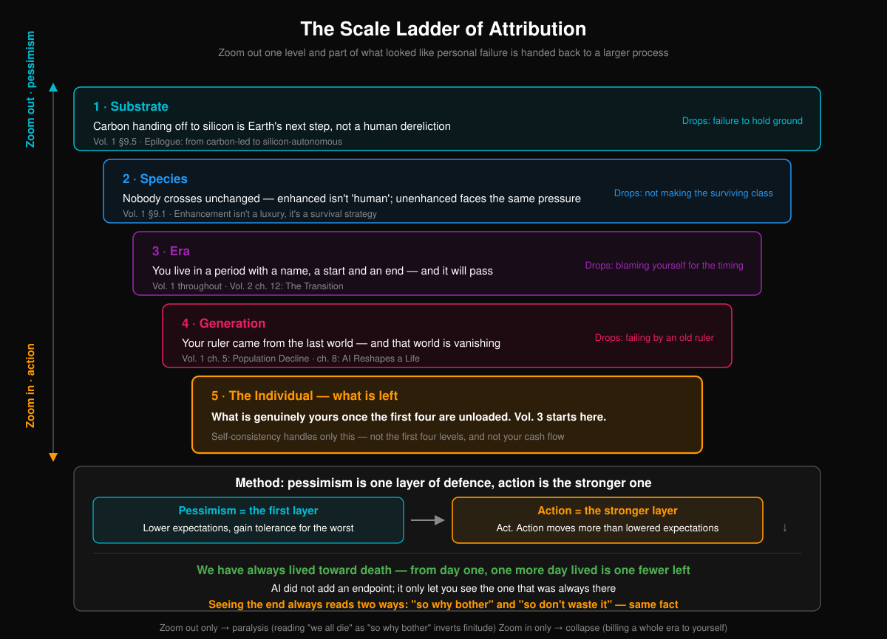

After you finish the checklist at the end of Volume II, there is an evening.

Leverage is down. Six months of emergency cash, saved. The physical is done; a few numbers came back bad, but at least you know. You got back in touch with three people you hadn't spoken to in two years, and one of them agreed to dinner. Half the kid's tutoring is cancelled, and you said the words to yourself — let him off — with your hands shaking. Everything doable, done. Nothing skipped.

Then you sit there and find it is the same.

The checklist isn't useless. It works: with leverage down, the stretch of the collapse chain that reaches you really is shorter; with the cash in place, the day you're laid off changes category from catastrophe to inconvenience. Those are real gains, and they clear. **The checklist solves the problem it was built to solve, and then it stops.** It does not solve the fact that you are still there after the checklist is done.

So from this page on, this book stops giving you things to do. No checklists, no numbered steps, no what-to-do-first.

That isn't the book losing its nerve. The remaining problem is a different kind of problem. The first two volumes dealt with what to do; what's left isn't a case of not having done enough — **it's still there after everything is done.** Handing it an action list is using the wrong tool: you would work through the list, find the problem untouched, and then file that failure into the ledger too.

### This Volume Is Not a Sequel to Chapter XIII

Chapter XIII of Volume II dealt with holding yourself together. That chapter and this volume are not handling the same thing, and the line has to be drawn in the open.

Chapter XIII handled the **acute** kind: the week the layoff notice comes down. A third of the account gone in three days. Forty minutes in a hospital corridor waiting on a result. These are **event-driven** — a clear trigger, a clear window, and therefore clear moves: sleep first, make no major decision, find one person and say it out loud, put three months of cash flow on paper and run it. Chapter XIII is first aid. First aid has one advantage: it knows when it is over.

Volume III handles the other half: **the part where nothing happens.**

No layoff. The salary lands, the mortgage clears, the kid goes to school, the physical comes back clean, and there was even a trip to the park on the weekend. Everything normal. You are just as empty.

This half has no trigger, so it has no matching move; no event, so the first-aid manual opens to a blank page. It is chronic. It doesn't flare. It is just always there.

Confusing the two is expensive. Run first-aid procedures against a chronic condition and you fail, repeatedly — and each failure makes a person more certain of one thing: **it's me.** A methodological error gets read as evidence about character.

### Nailing Down the Most Dangerous Misreading First

Volume I spent seven chapters proving one thing: this shock is **structural**. The intelligence premium didn't collapse because some cohort stopped trying. The chain from mortgage to bank to public finance didn't buckle because some household got lazy about repayment. Nobody hit the brakes — not because policymakers are of low moral character, but because whoever brakes first loses. In a lot of jobs the marginal return on individual effort is approaching zero. That isn't rhetoric; Volume I walked to it step by step, on data and inference.

So there is one misreading this volume has to nail shut at the start:

**Nothing in Volume III says that your life is hard because your attitude is wrong.**

A person whose industry is contracting has a problem: the industry is contracting. A person whose role has been redefined three times has a problem: the role has been redefined three times. A person whose mortgage takes sixty percent of income has a problem: it takes sixty percent. The inner method — the practice this volume is about — does not change the industry, does not change the role, does not change the payment. Not one of them.

Translating a structural problem into a personal, psychological one is the most popular and cheapest transfer of this era: first the system is excused, then the individual blames themselves, and after those two steps the entire bill lands on the end least able to carry it. This book does not do that.

Here is a line to carry around. It is the cleanest firewall available:

**Delete Volume III entirely and nothing in Volume I or Volume II changes.**

The intelligence premium still collapses. The collapse chain still propagates in that order. Nobody still hits the brakes on the commons. The transition is still ten to twenty years. The species still divides. Volume III is not a patch on the first two volumes and it is not their antidote — it handles a question the first two never touch: **given that every one of those conclusions holds, at full strength, what does a person do.**

### The Scale Is Wrong

The verdict a person passes on themselves is almost always written at the smallest available scale.

"I'm not good enough." "I missed that wave." "I fell behind." "I was dealt a hand and I played it badly."

The subject is always I. The object is always my whole life. Thirty years, forty years, packed into one sentence and stamped.

The problem is not whether these verdicts are true. Some of them are — people did make bad choices, people did coast, people did stand still at the moment to turn. The problem is that **the scale is wrong**: a process spanning decades, involving hundreds of millions of people, pushed along jointly by a technology curve and the direction of capital, gets compressed into one line of self-assessment and then carried alone.

The whole mechanism of this volume is two sentences:

**Go up one rung of scale and some portion of the "individual failure" gets reattributed to a larger process.**
**What is left after all five rungs is the part that is actually yours.**

This is not a consolation technique. Consolation says it's fine, and asks you to believe something you don't believe. Attribution says this entry was posted to the wrong account, and asks only that you look at where it was posted. The first takes willpower. The second takes eyesight.

Here are the five rungs.

**Rung one: substrate.** Volume I §9.5 and the conclusion already worked this through: carbon handing primacy to silicon is the next step in the evolution of this planet. Not a dereliction by humanity, not by any generation, and certainly not by any one person. A process that has been running for billions of years moves into its next segment. There is no responsible party.

At this rung the sentence humanity failed to hold the line loses its right to a subject — there was never a defender called humanity, and it never signed a contract to hold anything. **What this rung puts down: failure to hold the ground.**

This rung has the most force and the worst side effects. It is the easiest of the five to abuse: at a scale of billions of years nothing matters, including next month's rent, including the person waiting for you to answer a message. So it cannot be used alone. It has to be brought back in. How, is Chapter XX's business.

**Rung two: species.** Volume I §9.1 put it in one line: **enhancement is not a luxury good, it is a survival strategy.** From that line follows an unpopular conclusion — **nobody comes through unchanged.** Modify, and what comes through is not the "human" that started. Don't modify, and you face the same selection pressure. Neither road goes anywhere.

What this rung puts down: **not having made it into the surviving class.** The full argument is the next chapter.

**Rung three: the era.** You live inside a stretch of time that has a name, a start and an end, and a habit of passing. Volume I put a length on it: a transition of ten to twenty years. Chapter XII of Volume II covered what institutions can do inside that stretch.

Some birth years come pre-discounted. The same diligence, the same judgment, the same tolerance for luck, dropped into different decades, can clear at results an order of magnitude apart — not because that cohort was worse, but because the price list had just been swapped out when they walked in. **What this rung puts down: charging bad timing to your own account.**

Discount this one as well. The era is not a waiver. It explains why things are hard; it does not explain what you do this afternoon. A person who treats it's the era as a full stop and a person who treats it's me as a full stop come to rest in the same place, in different postures.

**Rung four: generation.** The yardstick in your hand was issued by the previous world.

Which major counts as safe, what age you should buy a place, what "making something of yourself" means, how long you have to stay in a job before it looks respectable, what passes as presentable at a class reunion — you did not cut those marks. The previous generation verified them inside their world and handed the instrument over. In that world it read true: credentials did clear, property did beat inflation, a job did last twenty years, grinding it out did work.

**And that world is disappearing.** Chapters V and VIII of Volume I are about how.

There is an ugly feature of a yardstick going bad: the people who issued it are usually the people closest to you. They mean no harm. They are using the only experience they ever verified, and they may go to their graves without admitting the instrument has failed — because admitting it would reprice their own lives, and that is a cost they cannot absorb. So they keep measuring, and you keep coming up short.

**What this rung puts down: the failing grade produced by an obsolete yardstick.** Note what is being put down — the verdict, not everything on the scale. Some of the marks still hold in the new world. They have to be checked one at a time. The whole instrument does not go in the bin.

**Rung five: the individual.** What's left after the first four rungs are put down. This is where Volume III actually starts working, and Chapter XX handles it.

### Zoom Out, Then Come Back

There is a real hazard to deal with here: zooming out and never coming back.

The five rungs work well. Get fluent with them and anything can be pushed up to a scale where it stops mattering — the project died, that's the industry; the industry, that's the era; the era, that's carbon handing off to silicon; the handoff is a billion-year event, so it makes no difference what I do today.

That road ends in paralysis. It reads it ends anyway as so why bother — **which gets finitude backwards.**

So the action ethic of this volume has two layers, and both have to be present at once:

**Pessimism is the first layer of defense.** Lower the expectation and what you buy is tolerance for the worst case. A person with low expectations does not shatter at bad news, because they priced that path in long ago. This layer is defensive. It protects the floor.

**Acting is the stronger layer.** Act. **Action changes more than lowered expectations do.** Lowering expectations only lets you stay upright inside a bad outcome; action can change the outcome itself — and even if the fraction changed is small, that is a different order of thing.

These are not two temperaments fighting. **They are the two ends of one zoom**: pessimism zooms out and puts down what isn't yours; acting comes back in and claims the part that is.

**Zoom out without coming back and you get paralysis. Come in without ever zooming out and you get collapse** — charging an entire era to your own account is a debt nobody can service, and a person facing a debt they cannot service makes every bad choice available to them.

Part One of this volume only zooms out. Part Two does the coming back. The version that zooms out and never returns is worse than not zooming out at all.

**(A note.)** This chapter is structural inference, not a data conclusion. It applies to readers who **have already worked through the Volume II checklist and whose external situation still has not improved**; for anyone whose situation is acutely deteriorating, Chapter XIII is more useful than this one, and they should go back to it first. The ladder rests on two premises: that Volume I's inference about a structural shock broadly holds, and that the reader can complete the return after zooming out. If Volume I's conclusions are falsified — if the intelligence premium did not collapse, if the marginal return on individual effort came back to normal levels — then the grounds for putting down rungs three and four disappear, and the verdict goes back onto the individual's account. If a reader only zooms out and never comes back, this chapter makes the problem worse instead of lighter, and at that point it is harmful and should be discontinued.

---

## XIX. Nobody Comes Through Unchanged

One line circulates widely enough to have become the default ending: **in the end only the descendants of the rich survive as humans.**

It sounds like hard-eyed realism. It cannot even manage self-consistency. The sentence packs two mutually contradictory things into the same clause — "modified" and "as humans."

Take it apart and there are only two roads, and neither goes through.

### Road One: Modify

Grant that wealth really does buy the best of it: embryo screening, gene editing, interfaces for cognitive enhancement, organ replacement, metabolic reprogramming. Grant that all of it works. Grant that regulation fails to stop it. Grant that the price is payable by a very small number of people. Concede every one of those assumptions to the claim and contest none of them.

Then the question: whatever comes out of that pipeline alive at the far end — on what grounds is it still called "human"?

Its cognitive bandwidth is not this species' bandwidth. Its lifespan curve is not this species' curve. Its sensory channels, its attention structure, its pain threshold, its sense of time — possibly none of those either. It is continuous by descent with today's rich, but descent has never been what defines a species. By descent, the line runs continuously back to a great many things that no longer exist.

So **what wealth buys is not continuation of a bloodline. It buys a place near the front of the queue for modification.** It buys order, not exemption. Between the first batch modified and the hundredth, the difference is timing and quality, not whether.

If the best case a claim can offer is my descendants go on existing as something else, the claim should stop using the words survive as humans. This isn't pedantry. Those are the words the claim chose.

### Road Two: Don't Modify

So don't. Put the resources into buying safety: better medicine, a house further out, more complete information, a thicker buffer.

The problem with this road is that **selection pressure does not read account balances.** The inference in Chapter IX of Volume I arrives at the same line: **enhancement is not a luxury good, it is a survival strategy.** Once enhancement opens a generational gap on the dimensions that matter — not better in the consumer-goods sense, but a threshold on whether you can participate, whether you can understand, whether you can keep up — then the unenhanced side is no longer facing a slightly lower quality of life. It is facing the same question everyone else is facing. Money only delays the date the question gets put. The question doesn't change.

So this road ends either by curving back into the first one, or by being left where it stands along with everyone else. There is no third exit.

### So the Class Asymmetry Collapses at This Rung

Put the two roads side by side:

**Modified, and it is not "humans" who survive. Unmodified, and the selection pressure is the same.**

The line from Volume I can be read a second time now — **the enhanced are not privileged survivors, they are the ones who had to change in order to stay.** There is no winner in that sentence. It describes a situation in which everyone has to change, and only the order of changing differs.

So: **if nobody comes through unchanged, then "I didn't make it into the surviving class" stops being a personal failure** — because there is no such class. At the species scale the verdict has nothing to refer to. It is an empty sentence. **The class asymmetry collapses at the species scale.**

### But Three Things Have to Be Said Honestly

**The symmetry at this rung cannot be run backwards into fairness today.** At the scale of the era and the scale of the generation, inequality is intensely real, and it is lethal: who gets laid off first, whose illness gets treated, whose child gets a second chance, who has six months of buffer when the collapse chain reaches them. Those differences clear every day, and most of them clear in money. Symmetry at the species scale does not discount them by a single cent. Answering a person who cannot make this month's mortgage payment with nobody gets through anyway is taking an abstract conclusion and applying it in exactly the wrong place.

**This chapter predicts no timetable.** When enhancement technology opens a generational gap, whether regulation blocks it, how the cost curve moves — all unknown. This chapter does conditional inference only: **if** enhancement constitutes a survival threshold, **then** neither road goes through. If enhancement stays at the level of a consumer good — limited in effect, optional, no threshold on participation — then the argument of this entire chapter does not hold, the class asymmetry stands at the species scale exactly as before, and the descendants of the rich surviving goes back to being a possible ending. This is the most fragile link in the chapter, and it is written out here in the open.

**Putting this verdict down produces no return whatsoever.** It does not bring a job. It does not take one cent off the payment. It does one thing: it strikes out a failure entry posted under your name. Once it is struck out your situation is exactly what it was. The only thing that changes is the account you were carrying for that situation.

### The Role

One more step out.

An emperor thought himself powerful, and inside his coordinate system he was in fact the most powerful thing in it: life and death at his word, the resources of a state, anything he wanted. He wanted to live forever, so the whole empire's resources went into finding it — elixirs, medicines, expeditions sent overseas. The result: an infection that today takes an outpatient appointment and a few pills could carry him off. The elixirs themselves were frequently poison.

**Even the role with the most power did not get out.**

This is not here to console the poor. The consoling version is see, even the emperor had it hard, which is cheap and also false — the emperor's hardship and a tenant farmer's hardship are not the same object, and the tenant farmer's version involves people dying every day. The point here is a different one: **the yardstick fails at every position on it.** The occupant of the position at the very front was stopped by the same technological boundary. Position does not solve the problem, because the problem is not in the position.

Everyone is issued a role at birth. What gets issued varies enormously — body, family, country, year, resources, degree of intelligence, degree of being loved. Different experience, different scenery, different people standing nearby, different things run into over a lifetime. Those differences are real and should not be flattened; two full chapters of Volume I are about how they get amplified.

But looking back down from the largest rung, **every role is an intermediate form inside the same game** — including the role with the most power. None of them is a terminus, and none of them is the right answer.

As for whether there are multiple lifetimes, whether some other role was drawn before this one — **that is speculation, not argument.** Since page one of Volume I this book has kept inference and belief apart: inference has to be falsifiable, belief does not, and shelving them together contaminates both. The notion has no evidence behind it, it feeds into none of this volume's conclusions, and deleting it would require changing not one word above it. It is written down only because it does turn up in a lot of heads late at night, and pretending it doesn't is its own kind of dishonesty.

### What This Rung Actually Puts Down

Not inequality. Inequality is untouched.

What gets put down is one very specific verdict: **"Other people made it in. I didn't."**

That sentence presupposes a door, a quota, a screening, and that somebody passed this round. The inference above says: **this round has no one who passed, only people changed in some order.** So the sentence is not wrong. It is void — it describes a list that does not exist.

A person can be responsible for plenty: their choices, their idleness, the turn they didn't make when it was time to turn. They do not need to be responsible for failing to get onto a list that doesn't exist.

**(A note.)** This chapter is structural inference, not a data conclusion. It rests on two premises: that enhancement technology eventually constitutes a participation threshold on the dimensions that matter rather than only a difference in consumer goods (the inference in Volume I §9.1, itself a probability judgment and not a fact); and that the word "human" stops applying after large-scale modification (a definitional question, and one it is reasonable to disagree with — a reader who insists that continuity of descent is enough to count as the same species has an open first road, and the symmetry conclusion of this chapter fails with it). The chapter applies only at the **species scale**: it does not explain, does not relieve, and certainly does not deny inequality at the scale of the era or the generation, and moving it down to those two rungs is misuse. The emperor passage is an observation by analogy and does not constitute argument; what it evidences is only that position grants no exemption from a technological boundary, and it does not extend past that.

---

### Part Two · Coming Back In — Claiming What's Left

## XX. After Everything Is Put Down, What's Left

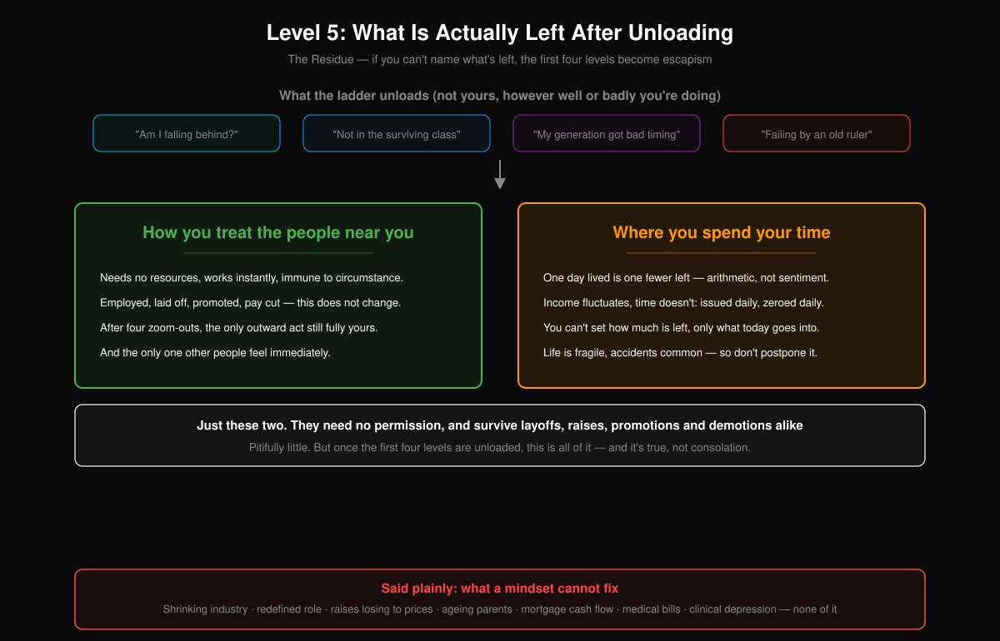

A forty-five-year-old, laid off, twelve years left on the mortgage, works through all four of the preceding rungs.

Failure to hold the ground: not theirs. Not making it into the surviving class: an empty sentence. Bad timing: not charged to their account. The yardstick in their hand was issued by the previous world, and the failing grade it produced does not count.

Four rungs done, they close the book. Then at seven the following Monday morning they still have to get up.

**This is the load-bearing chapter.** If Volume III stopped on the previous page, everything it had done would amount to teaching a person to push responsibility away — skillfully, too, every rung underwritten by Volume I's inference, so that the pushing carries no guilt at all. **Zooming out without coming back isn't explanation. It's a technique for evasion, and a fairly sophisticated one.**

So this chapter has to answer the question: after everything is put down, what's left.

The answer is two things. Only two.

### One. How You Treat the People Around You

Start with the concrete.

You run into the person from your floor in the elevator: do you speak. Someone tells you about a thing that matters enormously to them and is of no use to you: are you actually listening, or waiting for them to finish. At dinner the phone is face down or lit up. Someone gets something wrong: do you address the thing they got wrong, or convict the person along with it. Someone asks you for help that costs you nothing: do you give it, or first work out whether they'll be useful to you later.

This one **takes no resources**. No saving up first, no finding the next job first, no waiting for the industry to turn first, no approval from anyone. **It takes effect immediately** — not results in three months. That day.

And **it is not affected by circumstance.** Employed, unemployed, promoted, pay cut, options granted, options worthless — this one does not move. A person who has been laid off can still listen to someone properly; a person who has just been promoted may well be incapable of it. There is no transmission channel between it and external state, which is a rare property inside the collapse chain of Volume I: nearly everything propagates along that chain. This does not.

After four rungs of zooming out, it is **the only outward behavior still entirely yours to decide.** It is also the only one **anyone else registers immediately**: your inferences, your anxiety, your read on the next ten years — none of that reaches other people at all. How you treated them today, they know today.

This one has a limit, and the limit has to be stated. **Being decent to people is not a substitute for giving them money.** A person who needs medical bills paid needs medical bills paid; a child who cannot cover tuition needs tuition. Warmth is not a resource. It does not service a mortgage, it does not cover a hospital deposit, it does not produce a different job. Calling it the most important thing is a substitution — it is not the most important thing. It is **the only one circumstance cannot touch.** That is a statement about stability, not about importance. Blur the two and this chapter turns into an argument for being content with poverty.

### Two. Where You Put Your Time

A person lives toward death from the start — **known since the day of birth: one more day lived is one fewer day left.**

That is an account, not a sentiment. It settles once a day, never misses a settlement, and hears no appeals.

**AI did not add an endpoint. It moved up the date on which you see the one that was already there.** The endpoint used to sit far off, blocked from view by work, the mortgage, the kid's tutoring, the next promotion. A few of the things doing the blocking have been pushed aside, and it has come into view. What came into view was already there — not added, just seen earlier.

And **seeing the endpoint has always had two readings**:

**So why bother.** And **so don't waste it.**

**Off the same fact.**

Stop here and be clear about it: it is not that one of those is right and the other wrong. They are equally valid logically, they proceed from the same premise, and they run in opposite directions. The fact does not choose for you. **That choice is itself the core of what's left after the first four rungs are put down.**

At the operational level it is a plain thing: income fluctuates, time does not. **Time is issued every day and zeroed out every day.** How many days remain is not yours to decide — that column isn't yours. What this one day goes into is the only thing you decide, and that column is.

And it does not queue well. Life is fragile, and accidents are not rare — not rhetorically not rare, statistically not rare. Later is a word that assumes a later exists for everyone, and nothing underwrites that assumption.

Discount this one as well, and discount it deeply. Where you put your time hides a privileged assumption: that you have discretionary time. A person working twelve hours a day, commuting three, and going home to two elderly parents who need care has tens of minutes of discretion, not hours. For them the surface area this applies to is almost too small to see.

That doesn't change what this one is, only its **allowance**. Honestly: the allowance varies between people by a factor of tens. And what narrows that gap is institutions and money, not the inner method — which is exactly the next section.

### Just Those Two

How you treat the people around you. Where you put your time.

**Neither needs external permission, and neither is cancelled by a layoff, a raise, a promotion or a demotion — they hold in good conditions and bad alike.**

**Pitifully little. But after the first four rungs are put down, that is all of it. And it is true, not consolation.**

Some readers will want two more items here. There are no more. Anything external conditions can cancel was put down across the first four rungs; these two are left for exactly one reason, which is that they are cheap enough that nobody can take them. That is their only advantage, and the whole of it.

### What the Inner Method Cannot Handle

This section exists to stop the two pages above from being read as something that works on everything.

An industry is contracting — the inner method cannot handle that. A role gets redefined and the thing you spent three years learning is now worth one interview's worth of small talk — cannot handle that. The raise loses to prices, so the number went up and the money went down — cannot handle that. The half-life of a skill drops from ten years to three, and learning faster still means depreciating — cannot handle that. Parents start needing care, and a weekly phone call becomes being on call — cannot handle that. The mortgage presses on cash flow and what's left each month is a low four-figure number — cannot handle that. A medical bill, one sheet of paper that empties ten years of savings — cannot handle that. Depression that requires medication — the inner method especially cannot handle that, and on this one the words adjust your attitude do harm.

**From getting by but unable to see the future all the way to cannot hold on any longer — across that entire spectrum, the inner method solves none of it. These take institutions, or money, or a doctor.**

**This is never to be said in reverse.**

Not: you feel you can't hold on because you haven't seen through it. Not: anxiety comes from your attachment to certainty. Not: poverty is rooted in the way you think. Every one of those sentences does the same job — it reclassifies a problem that needs institutions, needs money, needs a doctor as a problem that needs personal reflection. **First the party actually responsible is excused, then the party least able to carry it blames itself.** Volume I spent seven chapters establishing that the responsibility is structural. If Volume III gives ground here, all of it is void.

So the order is fixed and does not invert: **institutions first, then money, then a doctor, and only last does this chapter get its turn.** What the first three can solve should not be handed to the fourth; what the first three cannot solve for now, the fourth will not solve on their behalf. It handles its own piece only — a small piece, but a real one, and one the failure of the first three does not cancel.

That is also the only use this entire volume has: **it does not rescue anyone. It only keeps a person in an already bad situation from carrying one more account that was never theirs.**

**(A note.)** This chapter is structural inference, not a data conclusion. The conclusion that there are **only two** comes out of a single filter — **unaffected by external circumstance, requiring no external permission** — and a different filter produces a different list, which makes the result definitional rather than discovered; if a reader finds a third item satisfying both conditions, this chapter should gain an entry. On the second item, time, the discretionary allowance varies enormously between people, and for someone whose time is almost entirely consumed it does not in practice hold; this chapter does not pretend it does. The section on what the inner method cannot handle is this chapter's hard boundary: a reader whose situation falls on that list should go to institutions, to money, to a doctor, rather than come back and reread this chapter — **this volume is ineffective in that case, and treating it as effective is the dangerous move.**

### Part Three · Changing the Yardstick — How to Live What's Left

## XXI. Wealth and Standing, Redefined

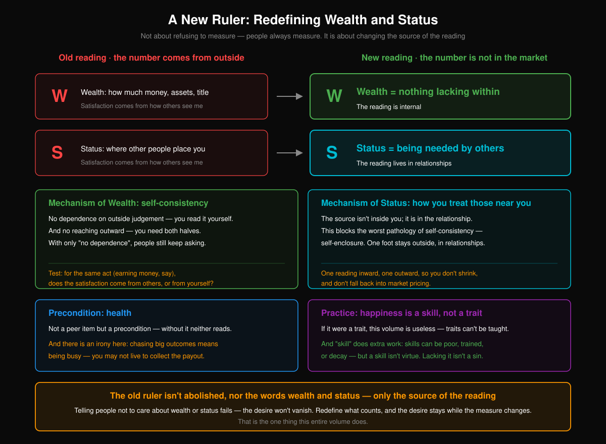

Telling people not to care about wealth and standing does not work.

Not because the argument is wrong. Because the wanting doesn't go away when it's argued with. It is much older than argument. A person can finish a book, nod, say *money isn't what matters* — and open their phone the next morning to check the balance, the rankings, who pulled ahead of them this time. This isn't a willpower problem. **Wanting wealth and standing is a default setting installed a very long time ago. You can't talk it out of running. You can only change what it reads.**

So this chapter doesn't retire the two words. **Wealth stays wealth. Standing stays standing. The wanting stays exactly where it is. What changes is how the reading is taken.**

This is the most literal use of *changing the yardstick* in the book: the same two words, measured a different way.

|  | Old reading | New reading |
|---|---|---|
| **Wealth** | how much money, how many assets, what title | **nothing missing** |
| **Standing** | what position, where you rank on someone's list | **being needed** |

What the old readings have in common isn't that they're crass. It's that **the reading comes from outside**. How much money you have only means something measured against someone else's pile. What position you hold is only visible on a table somebody else drew. Which means you aren't holding a yardstick at all — you're the length being measured. You think you're pursuing something. You're waiting for a score.

That is the thing the new readings replace.

### The Mechanism of Wealth: Self-Consistency, Plus Not Reaching Outward

**Nothing missing** reads as *contentment* if you're careless, and that's too light. Contentment is an attitude, and attitudes drift. What's described here is an instrument that produces its own reading: **you can tell whether anything is missing without putting yourself on anybody's table.**

The mechanism is self-consistency. The next chapter gives the hard definition; one sentence will hold here. **What you see about the world, what you admit about your own position, and how you actually spend your days — those three layers are aligned.** Aligned, nothing is missing. Out of line, no amount of money closes the gap. That isn't a figure of speech. Someone with serious assets who has decided *I should have been higher than this by now* has a rich balance sheet and an empty reading.

But that half — not depending on outside judgment — isn't enough on its own.

Because a person can be entirely indifferent to what others think and still **be reaching outward the whole time**: for more, for the next one, for the one not yet in hand. Evaluation doesn't govern them, and they are short all day long. **Not depending on outside judgment governs where the reading comes from. Not reaching outward governs whether the gap ever closes.** Missing either one, the instrument cannot read *nothing missing*.

Both at once. That is what wealth means here.

### The Mechanism of Standing: The Reading Doesn't Come From You

**The source of the standing reading isn't inside you. It's in the relationships.**

Which looks like a contradiction. A paragraph ago the point was not to depend on the outside, and now the reading is handed to other people.

No contradiction, because what gets handed over is different. The old reading hands the reading to **the market**: the market prices you, the price moves with conditions, you take the quote. The new reading keeps the reading inside **relationships**: how you treat the people around you, whether you have ever actually been needed. Not a price, not a rank. There are no conditions for it to move with.

And this isn't an addition. It's a guard against a pathology.

The most dangerous pathology of self-consistency is sealing yourself off — someone closes every door, nothing reaches them any more, they look very steady, and they are finished. **Being needed keeps one foot outside the door.** But it has to be outside in the right place: **in relationships, not in the market.** Leave it in the market and you're back to the old reading. Leave no foot outside at all and you become the person in the next chapter who welds themselves into the room.

It has a side effect that isn't comfortable. **It cannot be obtained by working alone.** You can practice self-consistency by yourself. You cannot make yourself needed by yourself. This reading pushes a person outward a little by its nature — a little, and not more.

### A Question That Sorts

Both readings above are abstract. What you can actually use is one question, and it can be asked every day.

**Take a single thing — say you made money today. Does the satisfaction come from someone else's approval, or from your own?**

One act, two drives. From the outside there's nothing to tell them apart: same person, same money, same smile. The difference is where the reading comes from. In the first case the money is a receipt; what you're actually collecting is your position in someone's eyes — so the next time nobody's looking, the same sum tastes like nothing. In the second case the money comes in and you don't report to anyone.

**Note that the question rules out no behavior.** It doesn't say don't make money, don't get promoted, don't build something large. It checks the source of the motive, nothing else. That is far more useful than *stop chasing money*. *Stop chasing money* asks a person to give up something they aren't going to give up. This question only makes them see what they're trading for.

Don't expect the answer to come back clean, either. Most of the time both drives are running, and the ratio shifts with the setting. **The value of the question isn't answering it correctly. It's whether you still ask it.** Someone who hasn't asked in a long time is usually running on the first one by default.

### Health Is Not One Item Among Others

Plenty of people write health onto the life list, alongside career, family, money. Wrong slot.

**Health isn't an item on the list. It's the precondition.** Both yardsticks above — nothing missing, being needed — require a body still running before they produce any reading at all. There's no *nothing missing* inside severe pain, no quality of relationship inside chronic insomnia. Health doesn't take part in the ranking. It's the condition under which ranking can happen.

There's an irony buried in this, and it's worth stating all the way through.

**Anyone chasing a large result is busy.** Busy means sleep gets borrowed against first, then exercise, then checkups and teeth. That chain runs in the same order almost every time — stably enough that examples are barely needed. Out of it comes an internal contradiction. **They are overdrawing their body for a result that pays out many years from now, and they may not be there when it does, or they may be there and no longer able to use it.**

None of this is moral advice. *Look after yourself* is advice, and advice can be ignored. **What's being said is that the old yardstick has miscounted on its own terms.** It computes on an assumption — that it will be present — and it never priced the probability of being present. You can decline the new reading. You can't refute the contradiction, because it belongs to the old one.

### Happiness Is a Capacity

One last line, and whether the whole apparatus stands depends on it.

**Happiness isn't a temperament. It's a capacity.**

If happiness were temperament, this volume was wasted paper. What you're born with can't be taught, and a hundred books won't buy it. A person could only accept their lot and close the book.

Calling it a capacity changes three things. **A capacity can be poor** — that you find it hard to be happy right now is a description of a fact, not a verdict. **A capacity can be trained** — clumsily, slowly, differently for different people, but a direction exists. **A capacity can also decay** — someone who used to find happiness easy and doesn't after several years under pressure has had a capacity ground down. They didn't become a worse person.

And the word *capacity* does one more job, which matters more than the three. **A capacity is not a moral quality.** Saying *capacity* rather than *attitude* closes off a slide: **you're unhappy because your attitude is bad.** That sentence circulates far too widely now. It converts a person's situation into their fault and then asks them to feel guilty about it a second time. *Attitude* is a moralized word. *Capacity* isn't. A weak capacity for happiness is the same kind of fact as being bad at math — not the moral version of that kind of fact.

Three things have to be said honestly.

**This chapter changes the reading, not the situation.** Read *nothing missing* off the new yardstick and the bills are still there, the rent is still there. It resolves no specific difficulty.

**The new reading can also be used to lie to yourself.** A person is perfectly capable of achieving nothing while announcing that nothing is missing inside them. The line between those two is in the next chapter, not this one. This chapter has no test to offer.

**And *being needed* will be abused.** People will read endless giving, being drained, being used as an instrument, all of it, as *I am needed*. That isn't standing. That's reaching outward again, with confirmation swapped in for money.

**(Note)** This chapter is a substitution of definitions, not a discovery: it does not prove that *nothing missing* is more real than an account balance, only that the reading source of the latter sits outside your hands and the former inside them. It applies to people whose basic survival is already settled and who have begun to suffer over *still not enough*. To a person whose difficulty is having nothing to eat tomorrow, this chapter is of no use whatsoever, and should not be read aloud to them. If there were evidence that a person's own judgment about where their satisfaction comes from is fundamentally unreliable — that what they call *approval from themselves* is still internalized approval from others, invisible to them — then the sorting question here loses its force and the entire chapter has to be rewritten.

---

## XXII. Self-Consistency

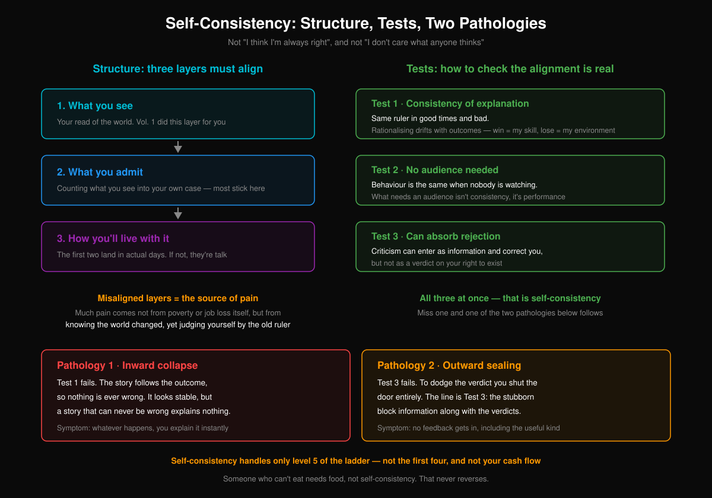

The word *self-consistency* has been worn out. It shows up mostly when somebody is closing the file on themselves: *whatever, I'm self-consistent.* Used that way it's an exemption sticker — once it's on, nothing further has to be explained.

So this chapter doesn't praise it. It locks it down first. **Self-consistency needs a definition, it needs tests, and it needs territory it doesn't govern.** With all three written out, it's a useful word. Missing any one of them, it's a sophisticated way of forgiving yourself.

### Three Layers, Aligned

Self-consistency is three layers in alignment.

**Layer one: what you have seen.** Judgment about the world — where compute is concentrating, how the value of work is being repriced, which way the population curve bends. Volume I did this layer for you. You don't have to derive it again. You only have to not pretend you haven't seen it.

**Layer two: what you have admitted.** Counting the layer above into your own position. Between seeing and admitting there is a wide sill. **You can agree completely that *a lot of jobs will be repriced* and hold firmly that the sentence doesn't include you.** That isn't hypocrisy. It's the standard way people handle bad news: keep the conclusion in the third person.

**This is the layer where people get stuck, and when they're stuck they usually don't know it.** Layer one asks you to understand, and understanding can be fast. Layer two asks you to claim, and claiming costs something.

**Layer three: how you're willing to live because of it.** The first two layers landing in actual days — how time is arranged, where money sits, who you deal with, what you learn and what you don't. **Without this layer, the first two are talk.** You can explain the trends beautifully and still have your life arranged exactly as it was five years ago; that isn't self-consistency, however good the first two layers look. That's a reading list, not a way of living.

### Misalignment Is Where the Pain Comes From

Three layers out of line and it hurts, in a way you can't locate.

The commonest misalignment looks like this: **you know the world has changed, and you still sentence yourself with the old world's yardstick.**

You know perfectly well that your industry is being rebuilt, and you know it wasn't your own laziness that did it. On layer one you're clear-eyed. But in the first second after waking up, what you evaluate yourself with is still the yardstick from ten years ago — where someone your age ought to be by now, how much ought to be in the account, how many people ought to report to you. You navigate by the new map and score yourself on the old scale.

**The suffering there isn't handed to you by unemployment. It's handed to you by the yardstick.** Poverty has its own suffering, which is real, and this chapter doesn't touch it. Stacked on top of the real suffering, though, is a layer that is pure surplus: sentencing yourself over and over by the standards of a world that has stopped existing.

That layer can be taken apart. Taking it apart won't make anyone rich. It subtracts one thing you shouldn't have been carrying.

### Three Tests

How do you know the alignment is real and not just claimed? Three tests.

**Test one: the explanation is consistent.** Same yardstick when things go well and when they don't. This is the test that catches self-justification, and **its fingerprint is obvious — the explanation drifts with the outcome.** It worked: my judgment was sound, my ability held. It failed: the environment, the timing, other people not cooperating. Each account sounds reasonable on its own. The problem is that they never get examined at the same time. **Run it on your last three things — for the one that worked and the one that failed, are the reasons you gave in the same coordinate system?**

**Test two: no audience required.** With nobody watching, the behavior doesn't change. This is the cheapest test, because it never asks you to judge your own motives, only to look at what happens. Alone: your hours, your choices, how you treat strangers — the same set as when someone is present, or not. **Whatever needs an audience isn't self-consistency. It's performance.** Performance isn't shameful; anyone living among people does some of it. It just can't be counted as evidence.

**Test three: you can take being told you're wrong.** The hardest one, and the easiest to state badly. It is not *not caring what people say*.

The accurate version: **another person's negative judgment may come in as *information*, to correct your assessment. It may not come in as a *verdict*, to decide whether you're allowed to exist.**

One criticism, two circuits. Down the information circuit: someone says my plan has a hole, let me look — if it's there I fix it, if it isn't I leave it. Down the verdict circuit: someone says my plan has a hole, so I'm probably someone with no ability. The person on the second circuit isn't thin-skinned. They have wired external evaluation into the main breaker. It isn't that they can't take criticism. They can't take being switched on.

**All three at once. That's self-consistency.** Missing one, and one of the two pathologies below is already running.

### Pathology One: Collapse Inward, Self-Justification

Test one has fallen. The explanation follows the outcome, so everything comes out right.

From outside this state looks extremely stable. They never waver, never worry; whatever happens, they can account for it inside three seconds. **But the way they hold steady is by cancelling the test.** Nowhere in their explanatory system is there a possible outcome that would make them say *then I was wrong*.

**An explanation that can never be wrong is not an explanation.**

The symptom is easy to spot. **Whatever happens, they can make sense of it on the spot.** Up because they saw it coming, down because the market is irrational; promoted on merit, laid off for backing the wrong side. New information is no use to them, because anything that arrives gets digested by the frame already in place. They aren't stupid — people like this are often very smart, and the intelligence is exactly what lets them square everything.

This pathology is *collapse inward*, because it compresses the world into an explanation with one room in it. Inside the room is safe. Nothing outside gets in.

### Pathology Two: Seal Outward, Shutting Down

Test three has fallen. To avoid the verdict, they close the door entirely.

There's a logic to it. If every external evaluation runs to the main breaker, then cutting external input really is the most effective defense available. **The problem is that verdicts aren't the only thing they're blocking.**

**The dividing line sits on test three: it requires *information* and *verdict* to be handled separately. Someone who can't separate them can only handle them in bulk — take all of it, or block all of it.** Take all of it and evaluation drags you around. Block all of it and you never hear anything again, including the parts that would have been useful.

The symptom: **no feedback gets through, including the feedback that would have helped.** You'll see them hold a visibly wrong course for a long time, with people around them raising it again and again, every mention caught as an attack and batted back. It isn't that they don't know what was said. They never opened it.

The two pathologies have something in common worth naming: **both of them look like self-consistency.** One never wavers, one is never affected. Real self-consistency looks worse from the outside — it changes its mind, admits a judgment was wrong, goes quiet for a while after being shown a problem. **Being correctable is the most concrete difference between it and these two.**

### Where This Stops Working

The boundary has to be nailed down at the end, or the chapter becomes another exemption sticker.

**Self-consistency handles the fifth rung of the ladder of attribution, and nothing else.**

The first four rungs — substrate, species, era, generation — are not its business. Self-consistent or not, you won't change where compute is concentrating, won't change which year you were born in, won't change the conditions under which your parents' generation cast the yardstick they handed you. It is not a method for affecting the world.

**Still less does it handle your cash flow.**

That sentence has to be repeated, because it's the one most likely to get skipped. **A person who can't afford food needs food, not self-consistency.** A person facing a layoff needs the next income, a balance sheet, enough cash to last some months — not an internal alignment. Self-consistency deals with the **surplus self-sentencing**. It does not deal with the actual situation the sentencing sits on top of.

**This can never be run backwards.** Backwards it reads: your life is hard because you aren't self-consistent enough. That's false, and it's the harmful kind of false — it stuffs a structural situation back onto an individual, cancelling out precisely the work the ladder of attribution did.

**(Note)** This chapter is a set of tests, not a theory: it says nothing about where self-consistency comes from or whether it can be trained, and offers only a way to check that it isn't there. It applies to people some of whose suffering really does come from a mismatch of scale. If a person's suffering comes entirely from actual deprivation, not one of the three tests is any use to them. What would falsify it sits in test two: if there were evidence that behavior with nobody watching is equally governed by an internalized audience — that a state of *no audience* doesn't exist at all — then test two isn't a test, only a change of audience, and the chapter needs its lines redrawn.

---

## XXIII. See It Pessimistically. Act on It Anyway.

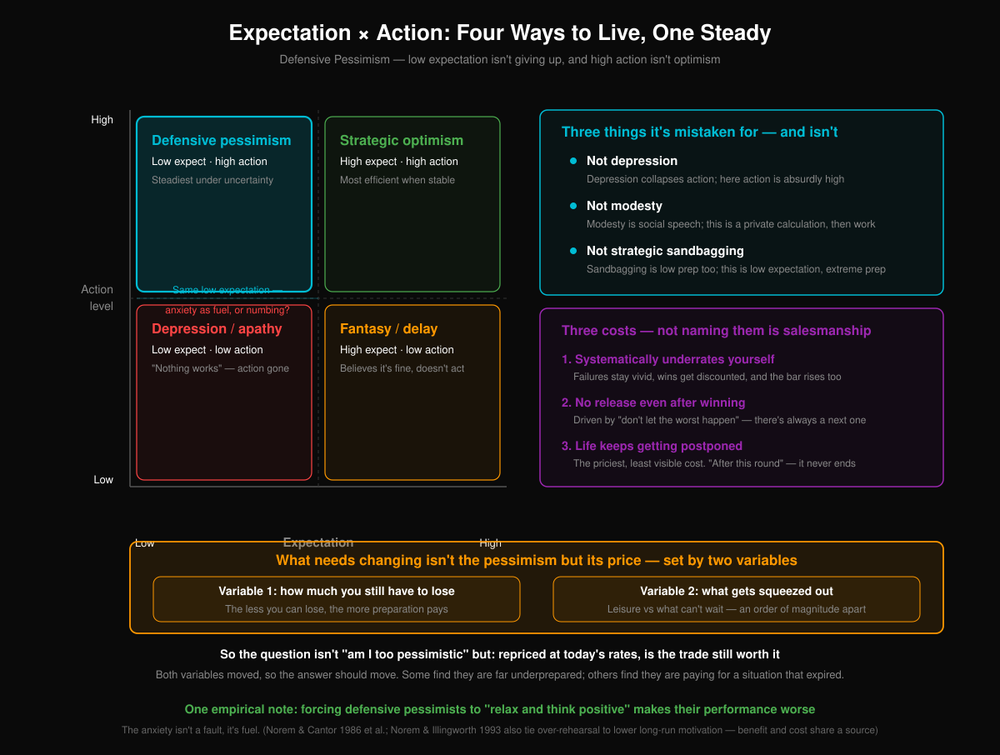

This chapter is the interface between the three volumes.

Volume I spent ten chapters breaking optimism, and left behind no conclusion anyone could relax into. Volume II turned around and demanded action — what institutions should do, what individuals should do, all of it hands-on. Set side by side, the two volumes contradict each other. **If you're telling me it's this bad, why do you want me working this hard?**

That contradiction is what this chapter handles. Its answer is short enough to fit on one line: **low expectation, high action.**

This isn't a motivational slogan. It has a name — **defensive pessimism** — an empirically grounded construct in psychology, first proposed by Norem and Cantor in 1986 and worked on for decades since. It describes a type of person: **before anything starts, they push the expectation far down, walk through the places it could go wrong one at a time, and then burn that anxiety as fuel, preparing far past what's necessary.**

### Four Boxes

Cross *expectation* with *action* and you get four boxes. They're worth taking one at a time, because people frequently get their own box wrong.

|  | High action | Low action |
|---|---|---|
| **Low expectation** | **defensive pessimism** | depression / learned helplessness |
| **High expectation** | strategic optimism | fantasy / procrastination |

**High expectation plus high action** is strategic optimism. In a stable environment it's the most efficient thing going — when conditions hold, optimistic expectations are roughly accurate, you don't pay preparation costs on a pile of low-probability disasters, and everything saved is efficiency. Nothing wrong with this box. It just has a precondition.

**High expectation plus low action** is fantasy. Believing it will turn out fine, and not moving because of the belief. The easiest box to recognize, and the one least in need of discussion.

**Low expectation plus low action** is depression, or learned helplessness. This is the box that gets confused with defensive pessimism, because the expectations are identical — both low.

**The difference sits in exactly one place. The core belief of depression is *it won't help*, so the capacity to act has collapsed.** The core belief of defensive pessimism is *if I don't, it fails for certain*, so the capacity to act is propped up.

**Same low expectation. What separates defensive pessimism from depression is whether the anxiety became fuel or anesthetic.**

**Low expectation plus high action** is the steadiest box under high uncertainty. The reason isn't complicated. When uncertainty is high, the accuracy of optimistic expectations falls off fast, and the marginal return on preparation climbs fast. You don't know what will go wrong, so you prepare for several things. What this box pays is efficiency — it will certainly spend time on a pile of things that never happen. **In a stable world that's waste. In an unstable one it's a premium.**

### Three Things It Isn't

Defensive pessimism gets misidentified constantly, and once it's misidentified it can't be used.

**It isn't depression.** Said above, worth saying a second time, because it's the commonest misreading, and it usually comes from the people standing closest: watching someone worry all day about worst cases, they assume that person is in bad shape. **In fact the action capacity of these people is often absurdly high.** They finished three contingency plans while they worried.

**It isn't modesty.** Modesty is said out loud, for other people: I'm not good enough, I'm not ready, don't expect much of me. It's a social move, and the behavior after it doesn't necessarily change. Defensive pessimism is a private calculation actually performed — told to nobody, and when it's done they go and work. **One is a line. The other is an internal computation.**

**It isn't strategic self-handicapping.** Handicapping builds the exit ramp in advance: low expectation, low preparation, so if it fails, *I never expected much anyway* catches the fall. **Defensive pessimism is low expectation and extremely high preparation** — it builds no exit ramp at all. It uses the low expectation to force the preparation out.

The three misreadings share one consequence: **outsiders will want to correct it.**

### Don't Take Apart Somebody's Engine

Here's an empirical note that runs against intuition and has turned up many times in the research. **Force a defensive pessimist to relax and look on the bright side, and their performance gets worse.**

Not their mood — their performance. Same task; after being told to relax or to picture it going well, the scores drop. The reason is in what the anxiety does. **It isn't a fault in this person. It's their fuel.** Take the anxiety away and the drive to prepare goes with it.

So *don't be so pessimistic*, offered in good faith, is for some people the dismantling of an engine. It assumes anxiety is something to be cleared out. That assumption holds for the strategic optimist. For this type it doesn't.

But **this has to be discounted too**. Norem and Illingworth found in 1993 that rehearsing worst cases repeatedly correlates with declining motivation over the long run — meaning the mechanism works on short tasks and bills you later. **The benefit and the cost come out of the same source.** The thing that makes them prepare thoroughly and the thing that grinds them down are one thing. You can't keep half.

### Three Costs

Leaving out the costs would make this a sales pitch for a way of living. So finish the accounting.

**Systematic underestimation of yourself.** The mechanism requires seeing the undone parts with great clarity — that's the raw material of preparation. The side effect is that the done parts get marked down automatically: *this one worked because I got lucky*, *this one doesn't count, conditions were too good.* **Worse, the standard rises in step.** Every level reached moves the reference point up a notch, so *I'm still a long way from where I ought to be* stays true permanently. The gap never narrows. You think one more stretch of walking closes it, and you finish the stretch and the distance hasn't changed.

**No easing off after a win.** The drive in this box comes from *the worst case must not happen*. That goal has a structural problem: **there is always a next version of it.** This round's worst case is avoided; next round's is already in the queue. So success brings no rest, only the next inventory. **People in this box have no experience of arrival.** They've completed a great many things and can rarely name one that made them actually stop.

**Life pushed to the back of the line.** The most expensive one, and the least visible. Its language is: *once this round is over, I'll live properly.*

**And this round doesn't end.** By the time one round closes, the next round's uncertainty has already begun, and this mechanism's response to uncertainty is to keep preparing. So the postponed things — seeing people, resting, the body, the parts of a relationship that only survive if you're present — stay at the back of the queue. They don't protest. They quietly expire.

### What Needs Recomputing Is the Price

The standard way to end here is to recommend a bit more balance. Not here, because balance isn't where the problem is.

**What needs changing isn't the pessimism. It's how it's priced.**

Defensive pessimism is a trade. **You give up present slack, present enjoyment, present relationships, and you buy down future risk.** At some prices that trade is extraordinarily good. At others it's extraordinarily bad. Two variables decide which.

**Variable one: how much you still have to lose.** The less there is to lose, the better the trade. Someone with almost no buffer is out of the game on a single failure, so converting every resource they have into preparation intensity is rational — for them, *worst case* and *the end* are the same event. Reverse it: someone who has already built a substantial buffer buys far less risk reduction with the same preparation intensity, and the price hasn't moved.

**Variable two: what gets crowded out.** Preparation takes up room; the question is whose. Crowd out leisure, entertainment, hours that were optional anyway, and the cost is low. **Crowd out the things that can't be bought later and the cost is an order of magnitude higher** — the few years a child is growing up, the few years parents can still get around, the few years a body still repairs itself. None of it has a secondary market. Once past, gone. **Same hour, two prices, and they aren't close.**

So the question to ask isn't *am I too pessimistic*. That question has no answer, because it treats a strategy as a defect of character.

**The question is: recompute the trade at today's prices. Is it still good?**

Some people run it and find they're nowhere near prepared enough — they left the comfortable position a long time ago and are still living on the old prices. Those people should push harder after the calculation, not relax.

Others run it and find they're **paying for a situation that expired.** The year that taught them the mechanism is long gone, the buffer got built, and the price list is still the one from back then. They keep paying, and what they pay with comes out of the column that can't be bought later.

Both variables move. **When the variables move, the answer should move.** Running the calculation once in a lifetime is the real problem.

**(Note)** This chapter rests on the existing empirical base for the construct of defensive pessimism (Norem & Cantor 1986 and others), and on later findings about its long-term costs (Norem & Illingworth 1993). Most of that work was done in academic and task settings with largely student samples, and whether it extrapolates to long-horizon life decisions is thinly evidenced — the most fragile point in the chapter. It applies to people who do have the capacity to act and are only unsure whether to push their expectations down; for someone whose capacity to act has already collapsed, this chapter is not describing their options. If there were evidence that the high performance of defensive pessimists comes mainly from other variables — higher underlying ability, stronger conscientiousness — with the low expectation contributing nothing of its own, the four-box division here loses its basis.

---

## XXIV. The Daily Ledger

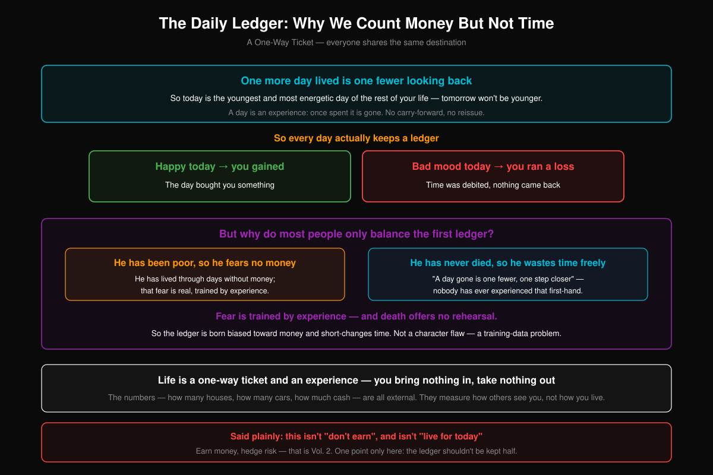

One more day lived is one fewer day left.

Nothing deep in that. It's arithmetic. But it carries a corollary that doesn't get said often: **today is the youngest day of the rest of your life, and the most alive.** Not in the *cherish it* sense — literally. Tomorrow won't be younger than today, and neither will the day after. The line runs in one direction only.

**A day is an experience. When it's over it's gone. It doesn't carry forward and it isn't reissued.** A bad mood today doesn't get held back and paid out to you later; a good day today doesn't let you draw against tomorrow. Every day settles on its own, and once it settles the account closes.

### So Each Day Has a Ledger

If it settles on its own, it can be booked.

Happy today — **you made money.** You paid out twenty-four hours and got something back. In a bad mood today — **you actually ran a loss.** The time was deducted all the same, not a minute less, and nothing came back.

The ledger is simple, simple enough to sound childish. And most people go an entire life without keeping it seriously once.

The other ledger, the money one, almost everybody keeps clearly. How much came in this month, how much went out, what's left, more or less than last year. Some track it to the decimal, some carry a rough figure, but everybody has a figure.

**Why is one ledger so much sharper than the other?**

### This Is a Training-Data Problem

The answer isn't in character. It's in experience.

**A person has been poor, so they fear having no money.**

That part is true. They have lived days without money — maybe the tight years at home when they were small, maybe the stretch after a first job counting cash at the end of the month, maybe one spell out of work. The fear wasn't picked up second-hand. The body recorded it. So the alarm for money is very sensitive: the balance drops below some number and it goes off with no thinking required.

**Nobody has ever died, so the fear of wasting time never gets trained.**

*One day gone is one day fewer.* *Another day closer to the end.* **Nobody has firsthand experience of this.** It isn't that people don't know it. They haven't lived it. You can agree with the proposition completely, and no alarm system grows on you because of it, because no actual lesson has ever taught you what running out of time feels like.

**Fear is trained by experience. And death offers no rehearsal.**

It happens once, and when it happens you have no next time to use the lesson on. Everything anyone knows about the scarcity of time is second-hand — borrowed from someone else's funeral, from a medical report, from a piece of sudden news. Borrowed weight is light. It gets returned within days.

**So a person's books are tilted toward money and unfair to time by construction.** One ledger has field training. The other has a manual.

**This isn't anybody's character problem. It's a training-data problem.** Stating that clearly matters, because it cancels the accusation this chapter might otherwise carry. It isn't that you don't know how to value things. It's that you have no experience available to learn the valuing from. Your alarm is sensitive only on the side where it was trained.

Understanding it doesn't install the other alarm either. It only lets you see why your books look the way they do, and why they have to be corrected by hand — because they won't correct themselves.

### What Those Numbers Measure

A life is a one-way ticket, a stretch of experience. You bring nothing in and take nothing out.

An old line, old enough to have been rubbed smooth until there's nothing left to feel. But it has a less old version, and that version is worth stating precisely.

Those numbers — how many apartments, how many cars, how much in the account — aren't fake and aren't bad. They're real resources, and they buy real safety and real options. This chapter has no intention of belittling them.

What has to be seen clearly is what they measure. **They measure how you look to other people. Not how your life is going.**

A number is comparable only because it's a point on a public scale. Floor area, model of car, digits in an account — all of it goes onto one table everybody shares, and gets sorted. That's their function, and it's their entire function. **How your life is going isn't on that table, because it has no public scale.** Nobody can read from outside whether you slept last night, what the moment of getting up this morning felt like, whether it runs warm or cold between you and the person next to you.

The two don't conflict, and they get treated as one thing constantly. You can believe you're pursuing a good life and be pursuing a position on that table — and not be able to tell the difference, because the table answers fast and experience never answers at all.

### One Hard Boundary

This chapter is the easiest one to read crooked, so the boundary has to be drawn hard.

**This is not *don't make money*.** Make the money. Days without money have their own suffering, and that suffering doesn't disappear because you switched ledgers.

**It isn't *live for today*, either.** Guard against risk, do the preparation, keep the buffer — that's Volume II, Volume II is explicit about it, and this chapter overturns not one word of it.

**One thing is being said here: the books shouldn't be kept on only one side.**

A person can run the money ledger and the day ledger both. Now and then they fight — a decision that earns on money and loses on days, and the reverse. What to choose when they fight isn't answered here, because the answer turns on those two variables, and the previous chapter has already covered them.

**This chapter is responsible for one thing only: making the other ledger exist.** Most of the time right now it doesn't. Not outvoted. Never opened.

**(Note)** This chapter is a bookkeeping suggestion, not a claim about value: it doesn't argue that experience matters more than resources, only that resources are systematically overweighted, and that the reason is an asymmetry in how fear gets trained. It applies to people who already have room to make trade-offs. For someone worried about next month's rent, *was today any good* genuinely shouldn't enter their decisions — one of their two ledgers is overwhelmingly the important one, and it's correct for it to overwhelm. What would falsify the chapter is the *training data* explanation: if there were evidence that people who have been through a major health crisis — who have something close to firsthand experience of death — use their time no differently from anyone else, then the asymmetry account fails and the cause has to be found elsewhere.

---

## Appendix · This Volume Could Do Harm

This section has to be written, because not writing it would be cowardice.

The four chapters above taught one thing: how to place yourself inside a world that is getting worse. **Which raises the question —**

**If everyone learns to be settled in the presence of injustice, where does the political pressure to hit the brakes come from?**

Volume I went through the tragedy of the commons, and went through it plainly: the core problem isn't that nobody knows the brakes should be applied. It's that **no single participant has any incentive to apply them alone.** And political pressure is, at bottom, a mass of people living badly who stop being willing to put up with it — that unwillingness pools, and becomes force against the institution.

**This volume may be manufacturing a different kind of person: one who lives well even if the brakes are never applied.**

Someone who has learned to change yardsticks is no longer stung by external rankings, no longer sentences themselves by the old world's standards, keeps the ledger of each day, has nothing missing inside them. **Do they still march? Do they still vote? Do they still care how things get distributed?**

**Is this volume lubricating the tragedy of the commons?**

The attack isn't raised from outside. **Volume I taught the reader to raise it.** The line at the end of Volume I is still standing: every decision you make after reading it makes it more correct. That sentence applies just as well to every decision you make after reading this volume.

So it can't be waved off with something conciliatory.

The most convenient conciliatory line goes like this: **"only a person at peace inside has the strength to change the world."** That line has to be refused explicitly. **There is no evidence for it.** Nothing reliable indicates that a settled person is more likely to push for change than an angry one; among the people who have actually pushed change through in history, the angry ones are at least as numerous as the settled ones. The line is popular because it lets whoever says it avoid admitting the cost. It's self-justification, not an answer.

### What Can Be Answered

The answer that can actually be given is inside this volume's own structure.

**The ladder of attribution is a two-way operation, not a one-way one.**

It moves in two steps. It zooms out first — from the individual to the generation, from the generation to the era, from the era to the species, from the species to the substrate — and at every level up, some portion of what was being charged to you gets reattributed to a larger process. Then it **comes back in**: the small piece left after all five levels is the piece that is genuinely yours, and you have to answer for it.

**What happens if you only zoom out and never come back?**

Everything has been attributed to a larger process. Your position belongs to the era, your limits belong to the generation, your species is handing the baton on, the substrate you belong to was always going to leave the stage. Every single thing has an explanation, and not one thing is yours. **What's left has been magnified to zero.**

**That state has a name. It's paralysis.** It isn't being settled. It's the total outsourcing of the right to explain. And once it's outsourced, the person also stops answering for *how you treat the people around you* and *where you put your time* — which happen to be exactly the two things the coming-back-in step hands them. They never ran that step.

**So *settled inside, therefore stationary* isn't an optional reading of this framework. It's a definite error.** It's a zoom performed halfway. Someone who stops after the first half doesn't end up with what this volume describes. They end up with the defective version — similar on the outside, missing the step that comes back in.

This is also why Chapter XXI puts the reading source for *standing* inside relationships and not inside the individual: **it forcibly keeps one foot outside.** Someone actually living by this volume carries a heavier responsibility to the people around them, not a lighter one. They don't answer for the era. They answer for the handful of people who spoke with them today.

### But That Answer Covers Only Half

Honesty requires this: the section above disposes only of the attack at the **individual level**. It shows that *settled, therefore checked out* is a misreading.

**It does not dispose of the attack at the aggregate level.**

Because the real shape of the attack is statistical. Even if every person who executes it correctly keeps their capacity to act, **does a widely circulated method for living tolerably inside injustice lower, in aggregate, the concentration of unwillingness to put up with it?**

I can't answer that. Answering it requires a counterfactual — the same society, once having read this volume and once not — and that data doesn't exist.

So this is as far as it goes. **I acknowledge the risk is real, and I have no evidence that it isn't there.** I've chosen to keep writing for one reason, and the reason is itself open to rebuttal: **decisions made by people driven by fear are usually worse.** Not fewer — worse. More short-sighted, easier to inflame, likelier to take whichever of two bad options relieves the anxiety immediately. If someone is going to push for change, I would rather the people pushing were clear-headed than panicked.

**But I know where that reason is weak: it assumes change requires good decisions, and some changes in history were driven through by exactly the bulk of bad, angry, reckless ones.** I have no way to rule that out.

This volume ends at that unsettled place. It hasn't washed itself clean.

**(Note)** This section is an act of self-refutation, not a record of a successful defense: it concedes a risk that available evidence cannot rule out, and states the reason the author chose to carry it anyway. It applies only to the layer of *individual misreading* — on the aggregate effect, the section says outright that it has no answer. If there were evidence that populations taking up frameworks of this kind show a measurable decline in participation in collective action, then the net effect of this volume is negative, everything argued above fails, and it should be withdrawn.

---

# Conclusion · Crossing the Transition

There is a saying: the pessimist is right, the optimist moves forward.

The map and the list are both on the table now. The question is no longer whether it will hurt. It is what is still in your hands when it does.

Here is the whole thing in three sentences.

**The technological endgame is worth being optimistic about — but it is not a promise that pays out on its own.** If productivity keeps advancing along its current line, material abundance and a humanity released from most necessary labour are where the technology trend points. But technology only supplies the possibility. Whether it gets delivered depends on distribution, on safety governance, and on how much strain a society can absorb — and what Volume I spent nine chapters establishing is that none of those three is guaranteed to keep up.

**The endgame does not arrive tomorrow.** In between lies a transition that may run ten to twenty years — the technology has already turned over, the institutions have not. The gap between the production side and the distribution side is exactly where ordinary people stand exposed. That gap is what this book is really about.

**On that stretch of road there is no immunity. Only endurance.** Structural change at this scale is not something an individual can block. What Volume II offers is not armor. It is a handful of things that will get you through with fewer injuries:

- **Psychology first** — unbind identity, train resilience, widen your luck surface area, stay loose (Chapter XIII)
- **Read your assets correctly** — the HALO frame: things in the world of atoms resist better than things in the world of bits (Chapter XIV)
- **Cut leverage** — low debt is the largest safety cushion in a transition (Chapter XIV, 14.4)
- **Work in stages** — different windows need different strategies; the deadliest error is meeting the next phase with the last phase's playbook (Chapter XV)
- **Maintain your people** — "someone cares whether I exist" may be the single most valuable resource in a transition (Chapter XIII)
- **Stay healthy** — the longer the transition runs, the more your physical and mental condition becomes the underlying asset (Chapter XVII, 17.8)
- **Let your children off** — this is not "education stops mattering." It is: stop using the last era's scarcity logic to train them into tools fitted to a vanishing world. Curiosity, health, and relationships matter more than winning an exam that is being cancelled (Chapter XVI)
- **Use AI on offense** — it is not only a threat; it is a superpower. Use it to do what you could not do before (Chapter XVII)

**One last thing.**

Volume I closed on the hardest problem in the book: this analysis is reflexive — **every decision you make after reading it makes it more true.**

There is no exit from that. But there is a direction.

And that direction has to be stated precisely, or it collapses into a pep talk.

Reflexivity in the collapse direction works for one reason: **it requires no coordination at all.** Each person panic-sells, each firm freezes hiring, each household cashes out early, and the sum is systemic acceleration.

**Deleveraging requires no coordination either.** The collapse chain in Chapter VI of Volume I — pay cut → missed mortgage → impaired bank capital → credit contraction → further pay cuts — begins at household leverage. Bring your own debt down and you are feeding the opposite quantity into that same chain. **Same mechanism, run backwards.**

This is not the optimism of belief-makes-it-so. It is the plainer realism that **action changes your exposure.** It may not stop a systemic shock. It decides where a great many people are standing when one arrives.

That is the only honest use of reflexivity: **it does not promise the rain will stop. It only decides where you are standing when it falls.**

**So: hold what can be held, put down what should be put down. Reduce risk, but do not stop acting. When the anxiety comes, go for a walk, cook something, see a friend. When nothing feels like it means anything, go do one thing that makes you happy — not for anyone else, for yourself.**

The storm can pass. Not because people naturally get better — because technology is manufacturing the capacity to solve these problems. The real question is whether humanity can hold out until institutions learn to use that capacity.

And "holding out" is your part of it.

The pessimist draws the map; the optimist takes the steps. The map tells you where the cliff is. The steps decide how you go around it.

**Pessimism by itself is useless. You still have to keep walking.**

**Stay alive. Cross the transition. Then go see what is on the other side.**

---

## About This Book

Written by Tony Seah, based on logical extrapolation from public data and research reports. All charts are original hand-drawn SVGs.

## Discussion

Join the Telegram group to discuss the ideas in this book:

---

If you found this book valuable, consider supporting the author:

**International:**
- GitHub Sponsors: [github.com/sponsors/pkusnail](https://github.com/sponsors/pkusnail)
- Buy Me a Coffee: [buymeacoffee.com/pkusnail](https://buymeacoffee.com/pkusnail)

**Reprint notice:** Feel free to repost and share this book, but please retain author attribution and support links.

Source / Project: [github.com/pkusnail/GPUs-Wombs-and-Money-Printers](https://github.com/pkusnail/GPUs-Wombs-and-Money-Printers)

---

## References

*The bibliography below is shared with the Chinese edition, which is the fuller text. A small number of entries are cited only there; reference numbers are kept identical across both editions so that a citation can be looked up in either.*

[1] Citrini Research & Alap Shah, "The Consequences of Abundant Intelligence," February 22, 2026. https://www.citriniresearch.com/p/2028gic

[2] Wu Jun, *Tides of Technology (Lang Chao Zhi Dian)*, 4th ed., Posts & Telecom Press, 2019. https://book.douban.com/subject/33474750/

[3] Krizhevsky, A., Sutskever, I., & Hinton, G. E., "ImageNet Classification with Deep Convolutional Neural Networks," NeurIPS 2012. https://papers.nips.cc/paper/4824-imagenet-classification-with-deep-convolutional-neural-networks

[4] Pew Research Center, "5 facts about global fertility trends," August 2025. https://www.pewresearch.org/short-reads/2025/08/15/5-facts-about-global-fertility-trends/

[5] Statista, "Countries with the lowest fertility rates 2025." https://www.statista.com/statistics/268083/countries-with-the-lowest-fertility-rates/

[6] United Nations, "World Fertility 2024," 2025. https://www.un.org/development/desa/pd/content/world-fertility-2024

[7] The Lancet / IHME, "Dramatic declines in global fertility rates set to transform global population patterns by 2100." https://www.healthdata.org/news-events/newsroom/news-releases/lancet-dramatic-declines-global-fertility-rates-set-transform

[8] WardheerNews, "South Korea — How a $280 Billion Baby Plan Failed," 2025. https://wardheernews.com/south-korea-how-a-280-billion-baby-plan-failed-and-what-it-says-about-modern-society/

[9] ScienceDirect, "Childbearing and the distribution of the reservation price of fertility: The case of the Korean baby bonus program." https://www.sciencedirect.com/science/article/abs/pii/S104900782100124X

[10] MIT Technology Review, "Inside Japan's long experiment in automating elder care," January 2023. https://www.technologyreview.com/2023/01/09/1065135/japan-automating-eldercare-robots/

[11] CNN, "South Korea's aging population finds comfort in 'robo-grandma' dolls." https://www.cnn.com/health/asias-aging-population-finds-comfort-care-in-robo-grandma-dolls-wellness-spc

[12] Bloomberg, "Pentagon Pressures Anthropic to Drop AI Guardrails in Military Standoff," February 26, 2026. https://www.bloomberg.com/news/features/2026-02-26/pentagon-pressures-anthropic-to-drop-ai-guardrails-in-military-standoff

[13] NBC News, "Pentagon gives AI firm ultimatum: lift military limits by Friday or lose $200M deal." https://www.nbcnews.com/meet-the-press/video/pentagon-gives-anthropic-an-ultimatum-amid-fight-over-military-ai-guardrails-258370117539

[14] Fortune, "The AI arms race could lead to human extinction, top researcher warns," February 2026. https://fortune.com/2026/02/18/big-tech-russian-roulette-ai-race-humanity-extinction/

[15] SF Examiner, "SF office-vacancy rate heading for biggest drop since 2015." https://www.sfexaminer.com/news/business/sfs-office-vacancy-rate-heading-for-biggest-drop-since-2015/article_dbb23edb-a7fc-4ec5-bb70-81fbceb988bc.html

[16] Congress.gov / CRS, "Commercial Real Estate and the Banking Sector," R48175. https://www.congress.gov/crs-product/R48175

[17] Wikipedia, "Decline of Detroit." https://en.wikipedia.org/wiki/Decline_of_Detroit

[18] Cleveland Fed, "Urban Decline in Rust-belt Cities," 2013. https://www.clevelandfed.org/publications/economic-commentary/2013/ec-201306-urban-decline-in-rust-belt-cities

[19] Vision Times, "Is China's Northeast Disappearing? Ghost Cities Spread," November 2025. https://www.visiontimes.com/2025/11/26/is-chinas-northeast-disappearing-ghost-cities-spread-as-housing-prices-collapse.html

[20] Nature Cities, "The decreasing housing utilization efficiency in China's cities," 2024. https://www.nature.com/articles/s44284-024-00177-8

[21] Visual Capitalist, "The Decline of Fertility Rates in OECD Countries (1950-2025)." https://www.visualcapitalist.com/decline-of-fertility-rates-in-oecd-countries-1950-2025/

[22] Carnegie Endowment, "The AI Governance Arms Race," October 2024. https://carnegieendowment.org/research/2024/10/the-ai-governance-arms-race-from-summit-pageantry-to-progress

[23] Computer Weekly, "MPs warned of AI arms race to the bottom." https://www.computerweekly.com/news/365529793/MPs-warned-of-AI-arms-race-to-the-bottom

[24] CNN / China Ministry of Civil Affairs, "Fewer people than ever before are marrying in China. But divorces are up," February 2025. https://www.cnn.com/2025/02/10/china/china-marriage-registrations-record-low-2024-intl-hnk

[25] CDC/NCHS, "FastStats — Marriage and Divorce," 2023. https://www.cdc.gov/nchs/fastats/marriage-divorce.htm

[26] OECD, "Marriage and Divorce: Society at a Glance 2024." https://www.oecd.org/en/publications/society-at-a-glance-2024_918d8db3-en/full-report/marriage-and-divorce_63dd0a7d.html

[27] YuWa Population Research / CNN, "China is one of world's most expensive places to raise children," February 2024. https://www.cnn.com/2024/02/22/asia/china-cost-of-raising-children-intl-hnk

[28] Merton, Robert K., "The Self-Fulfilling Prophecy," The Antioch Review, Vol. 8, No. 2, 1948. https://www.jstor.org/stable/4609267

[29] Soros, George, "The Alchemy of Finance," Simon & Schuster, 1987 (Chinese edition: Jinrong Lianjinshu). https://www.wiley.com/en-us/The+Alchemy+of+Finance,+2nd+Edition-p-9780471445494

[30] Finance Magnates / KED Global, "South Korea's crypto market engages 30% of population," 2024; PANews, "Why South Korea has become one of the hottest crypto markets in the world." https://www.financemagnates.com/cryptocurrency/south-koreas-102-trillion-won-crypto-market-engages-30-of-population/

[31] The Hill, "The US is headed for mass unemployment, and no one is prepared," 2026; InvestorPlace, "AI Job Loss Is Accelerating – and Washington Won't Stop It." https://thehill.com/opinion/finance/5713876-ai-displacement-and-ubi/

[32] OMFIF, "Fiscal exceptionalism and the US-Europe growth gap," January 2026. https://www.omfif.org/2026/01/fiscal-exceptionalism-and-the-us-europe-growth-gap/

[33] World Economic Forum / Kela, "The results of Finland's basic income experiment are in," 2019. https://www.weforum.org/stories/2019/02/the-results-finlands-universal-basic-income-experiment-are-in-is-it-working/

[34] Sam Altman / Futurism, "Sam Altman Says AI Will Cause Massive Deflation, Making Money Worth Vastly More." https://futurism.com/future-society/sam-altman-ai-deflation

[35] Trading Economics / Japan CPI, "Japan Inflation Rate," January 2026. https://tradingeconomics.com/japan/inflation-cpi

[36] Pandaily, "China Produced Nearly 90% of Humanoid Robots Sold Globally in 2025," February 2026. https://pandaily.com/china-produced-nearly-90-of-humanoid-robots-sold-globally-in-2025/

[37] Reuters / NextBigWhat, "Chinese robot makers outpace Tesla in humanoid robot race," February 2026. https://www.reuters.com/technology/

[38] IEEE Spectrum, "What's Holding Humanoid Robots Back," February 2026. https://spectrum.ieee.org/humanoid-robot

[39] Wiley / American Journal of Hematology, "CML 2025 Update on Diagnosis, Therapy, and Monitoring." https://onlinelibrary.wiley.com/doi/full/10.1002/ajh.27443

[40] NEJM, "Trastuzumab Deruxtecan plus Pertuzumab in HER2-Positive Metastatic Breast Cancer," 2025. https://www.nejm.org/doi/full/10.1056/NEJMoa2508668

[41] PharmaBoard Room, "Hong Kong Biotech IPOs in 2025." https://pharmaboardroom.com/facts/hong-kong-biotech-ipos-in-2025/

[42] MIT Technology Review, "The first human test of a rejuvenation method will begin shortly," January 2026. https://www.technologyreview.com/2026/01/27/1131796/the-first-human-test-of-a-rejuvenation-method-will-begin-shortly/

[43] PMC / Probabilistic Forecasting of Maximum Human Lifespan by 2100. https://pmc.ncbi.nlm.nih.gov/articles/PMC11448547/

[44] SSA, "2025 OASDI Trustees Report Summary," June 2025. https://www.ssa.gov/oact/trsum/

[45] The Diplomat, "As China Ages, a Pension Crisis Looms," February 2026. https://thediplomat.com/2026/02/as-china-ages-a-pension-crisis-looms/

[46] HEConomist, "Japan's Pension System: A Fragile Equilibrium," May 2025. https://heconomist.ch/2025/05/05/japans-pension-system-a-fragile-equilibrium-between-tradition-and-contemporary-challenges/

[47] IMF, "Global Financial Stability Report — The Financial Impact of Longevity Risk," April 2012. https://www.imf.org/en/blogs/articles/2012/04/11/seven-billion-reasons-to-worry-the-financial-impact-of-living-longer

[48] ASH Clinical News, "CAR-T Cell Therapies Predicted to Cost More Than $1 Million." https://ashpublications.org/ashclinicalnews/news/3469/CAR-T-Cell-Therapies-Predicted-to-Cost-More-Than-1

[49] S&P Global, "Data center grid power demand to rise 22% in 2025, nearly triple by 2030," 2025; Axios, "AI data center boom: projects vs numbers," February 2026. https://www.spglobal.com/energy/en/news-research/latest-news/electric-power/101425-data-center-grid-power-demand-to-rise-22-in-2025-nearly-triple-by-2030

[50] Tom's Hardware / TSMC, "Advanced node capacity falls short of AI demand," 2025; Congress.gov CRS R48642 (SMIC 5nm analysis). https://www.tomshardware.com/tech-industry/semiconductors/tsmc-csays-advanced-node-capacity-falls-short-of-ai-demand

[51] Bain & Company, "Humanoid Robots: From Demos to Deployment," Technology Report 2025. https://www.bain.com/insights/humanoid-robots-from-demos-to-deployment-technology-report-2025/

[52] MIT Technology Review, "Why Humanoids Need Their Own Safety Rules," June 2025; OnLabor, "Amazon's Approach to Robotics Is Seriously Injuring Warehouse Workers." https://www.technologyreview.com/2025/06/11/1118519/humanoids-safety-rules/

[53] Medium / Markus Brinsa, "Hallucination Rates in 2025"; ISACA, "Avoiding AI Pitfalls in 2026: Lessons from Top 2025 Incidents." https://www.isaca.org/resources/news-and-trends/isaca-now-blog/2025/avoiding-ai-pitfalls-in-2026-lessons-learned-from-top-2025-incidents

[54] McKinsey, "Future of Autonomous Vehicles," 2025; Rodney Brooks, "Predictions Scorecard 2026," January 2026. https://rodneybrooks.com/predictions-scorecard-2026-january-01/

[55] Gartner, "Hype Cycle for Artificial Intelligence 2025"; MIT / Active Logic, "Where is AI on Gartner's 2025 Hype Cycle." https://www.gartner.com/en/articles/hype-cycle-for-artificial-intelligence

[56] European Commission, "AI Omnibus enters into force," July 27, 2026 (Regulation (EU) 2026/1744: Annex III high-risk obligations postponed to December 2, 2027; Annex I to August 2, 2028); Gibson Dunn, "EU AI Act Omnibus Agreement — Postponed High-Risk Deadlines and Other Key Changes," 2026; Latham & Watkins, "China Introduces Rules for AI Companion and Emotional Interaction Services," July 8, 2026; IAPP, "China's new AI rules: Ethics, AI agents and anthropomorphic AI," July 8, 2026. https://digital-strategy.ec.europa.eu/en/news/ai-omnibus-enters-force

[57] Baker McKenzie, "Navigating Labor's Response to AI," June 2025; Brookings, "Hollywood Writers Strike and AI." https://www.bakermckenzie.com/en/insight/publications/2025/06/navigating-labors-response-to-ai

[58] Stanford CodeX, "How AI Agents Are Rewriting Rules of Engagement," January 2025; DLA Piper, "Rise of Agentic AI Legal Risks." https://law.stanford.edu/2025/01/14/from-fine-print-to-machine-code-how-ai-agents-are-rewriting-the-rules-of-engagement/

[59] Epoch AI, "AI Supercomputers Performance Share by Country," 2025; GeoCoded, "State of Global AI Compute 2025." https://epoch.ai/data-insights/ai-supercomputers-performance-share-by-country

[60] Inbolt, "Industrial Robot Cost Decline," 2025; EY, "Three Tailwinds for Robotics Adoption," 2024. https://www.inbolt.com/resources/industrial-robot-cost-decline

[61] Reshoring Initiative, "2024 Annual Report," 2025; Automate.org, "Reshoring and Nearshoring Trends." https://reshorenow.org/content/pdf/2024-1Q2025_RI_DATA_Report.pdf

[62] UNCTAD, "Technology and Innovation Report 2025"; ODI, "The AI Time Bomb: 2.5 Million Jobs at Risk in Kenya"; ILO / IMF, "AI and the Philippine Labor Market." https://unctad.org/publication/technology-and-innovation-report-2025

[63] NBER, "India's De-Industrialization Under British Rule," Working Paper 10586. https://www.nber.org/papers/w10586

[64] Atlantic Council, "Will Data & AI Cripple or Leapfrog Developing Nations?"; Connecting Africa, "World Bank Chief on AI Leapfrogging." https://www.connectingafrica.com/ai/world-bank-chief-not-certain-developing-nations-can-leapfrog-with-ai

[65] CDO Magazine, "Pentagon Seeks $13.4B for AI and Autonomy in FY2026 Budget Request," 2025; CNAS, "The Role of AI in Russia's Confrontation with the West." https://www.cdomagazine.tech/us-federal-news-bureau/pentagon-seeks-13-4-bn-for-ai-and-autonomy-fy-2026-budget-request

[66] 972 Magazine, "Lavender: The AI machine directing Israel's bombing spree in Gaza," April 2024. https://www.972mag.com/lavender-ai-israeli-army-gaza/

[67] Atlantic Council, "Missiles, AI, and drone swarms: Ukraine's 2025 defense tech priorities"; MIT Technology Review, "Autonomous warfare in Europe," January 2026. https://www.technologyreview.com/2026/01/06/1129737/autonomous-warfare-europe-drones-defense-automated-kill-chains/

[68] Anthropic, "Disrupting AI-powered espionage," November 2025; Arms Control Association, "AI-Nuclear Transparency," December 2025. https://www.anthropic.com/news/disrupting-AI-espionage

[69] CFR Education, "Industrialization and Imperialism"; Michigan Journal of Economics, "Economics of Warfare," 2025; OMFIF, "Putin and Russia's Ruined Economic Future," January 2026. https://www.omfif.org/2026/01/putin-is-wary-of-facing-russias-ruined-economic-future/

[70] Maplecroft, "Escalating unrest, polarisation set stage for disruptive 2026"; Pew Research, "Political Polarization." https://www.maplecroft.com/solutions/consulting/political-risk/insights/escalating-unrest-polarisation-economic-woes-set-stage-for-disruptive-2026/

[71] Foreign Policy Analytics, "AI and Critical Minerals," July 2025; NBC News, "Greenland's critical minerals a tempting target"; American Security Project, "Rare Earths, AI, and Strategic Competition." https://fpanalytics.foreignpolicy.com/2025/07/18/artificial-intelligence-critical-minerals-supply-chains/

[72] Allison, Graham, "Destined for War: Can America and China Escape Thucydides's Trap?" Houghton Mifflin Harcourt, 2017; Harvard Kennedy School, "Thucydides' Trap." https://www.hks.harvard.edu/faculty-research/policy-topics/international-relations-security/thucydides-trap-peace-and-rivalry

[73] SpaceX, "Starship" mission updates, 2024-2026; Payload Space, "Starship Economics: The $10/kg LEO Target," 2025. https://payloadspace.com/starship-launch-cost-analysis/

[74] Lumen Orbit, "Starcloud: First GPU in Orbit," November 2025; Google, "Project Suncatcher: Space-Based Solar for AI Data Centers," 2025; TechCrunch, "The Race to Build Data Centers in Space," 2025. https://techcrunch.com/2025/11/space-data-centers-lumen-orbit/

[75] Bloomberg, "Musk's SpaceX Combines With xAI at $1.25 Trillion Valuation," February 2, 2026; Reuters, "SpaceX acquires xAI in record-setting deal," February 4, 2026 (all-stock: SpaceX $1T, xAI $250B); SpaceX Nasdaq IPO (SPCX): priced at $135/share June 11, 2026, first trade June 12, 2026, ~$1.77 trillion valuation, $75B raised — the largest IPO by proceeds on record; Jonathan McDowell, "Jonathan's Space Report — Starlink Statistics" (as of August 18, 2026: 12,745 launched, 10,979 in orbit, 9,724 in operational orbit). https://planet4589.org/space/con/star/stats.html

[76] NASA, "Mars Facts"; Rees, Martin, "The End of Astronauts," Harvard University Press, 2024; Space.com, "Musk shifts Mars-to-Moon focus," February 2026. https://mars.nasa.gov/all-about-mars/facts/

[77] NASA JPL, "Perseverance Rover Completes First AI-Planned Drive on Mars," December 2025. https://www.jpl.nasa.gov/news/perseverance-ai-autonomous-driving

[78] Rees, Martin, "The End of Astronauts," Harvard University Press, 2024; Von Neumann, John, "Theory of Self-Reproducing Automata," 1966. https://press.uchicago.edu/ucp/books/book/chicago/T/bo5780028.html

[79] Spielberg, Steven, "A.I. Artificial Intelligence," Warner Bros., 2001; Scott, Ridley, "Prometheus," 20th Century Fox, 2012.

[80] SpaceNews, "China's Landspace recovers booster with second orbital launch of Zhuque-3 rocket," August 18, 2026; Reuters, "China's LandSpace lands rocket booster; joins SpaceX, Blue Origin with reusable tech," August 18, 2026; India Today, "Private Chinese rocket Zhuque-3 collapses, landing leg catches fire after touchdown," August 19, 2026; SpaceNews, "China's commercial Tianlong-3 rocket fails on debut launch," April 3, 2026; SpaceNews, "Zhuque-3 reaches orbit, first stage lost during landing attempt," December 2025; CNBC, "China eases IPO rules for reusable rocket firms," December 2025. https://spacenews.com/chinas-landspace-recovers-booster-with-second-orbital-launch-of-zhuque-3-rocket/

[81] Hosseini Maasoum & Lichtinger, "Generative AI as Seniority-Biased Technological Change," Harvard/SSRN, 2025; SCMP, "Youth unemployment eases to 16.9%," 2025; Caixin, "Youth Unemployment Surge," September 2025; Foreign Policy, "China's AI Planners Are Fearful of Job Losses," November 2025. https://papers.ssrn.com/sol3/papers.cfm?abstract_id=5425555

[82] SignalFire, "State of Talent Report 2025"; CNBC, "AI is not just ending entry-level jobs," September 2025; Revelio Labs, "Entry-Level Job Postings Decline," 2025; LeadDev Engineering Survey 2025; IntuitionLabs, "AI's Impact on Graduate Jobs 2025." https://www.signalfire.com/blog/signalfire-state-of-talent-report-2025

[83] Global Policy Solutions, "Stick Shift: Autonomous Vehicles, Driving Jobs, and the Future of Work"; Medium/Ben Kitchen, "Transitioning from Horses to Cars: Resource Consumption"; Resilience.org, "The Big Shift Last Time: From Horse Dung to Car Smog," 2013; Victoria Transport Policy Institute, "Autonomous Vehicle Implementation Predictions," 2025. https://globalpolicysolutions.org/report/stick-shift-autonomous-vehicles-driving-jobs-and-the-future-of-work/

[84] Tesla, "FSD Safety Hub," 2026; TechCrunch, "Tesla launches robotaxi rides in Austin with no human safety driver," January 22, 2026; Electrek, "Tesla starts robotaxi rides without safety monitor," January 2026. https://www.tesla.com/fsd/safety

[85] Waymo, "2025 Year in Review," December 2025; CNBC, "Waymo 450,000 weekly rides," December 2025; CNBC, "China's Baidu robotaxis match Waymo's ride numbers," November 2025; Pony.ai, "Shenzhen citywide driverless permit," October 2025. https://waymo.com/blog/2025/12/2025-year-in-review

[86] CleanTechnica, "BYD God's Eye Brings ADAS to the Masses," February 2025; SCMP, "Chinese EV makers outpace Tesla in autonomous-driving race," 2025. https://cleantechnica.com/2025/02/17/byd-gods-eye-brings-adas-to-the-masses/

[87] Yicai Global, "China's 30 Million Truck Drivers," 2024; Beijing Scroll, "Inside China's 7.48 Million Ride-Hailing Drivers," 2024; Goldman Sachs, "Self-Driving Cars Could Steal 300,000 Jobs a Year," 2017; International Transport Forum, "Driverless Trucks and Job Losses," 2017; IRU, "Global Truck Driver Shortage Report," 2024. https://www.yicaiglobal.com/news/china-saturated-trucking-market-has-left-30-million-drivers-in-debt-report-says

[88] Autor, David et al., "When Work Disappears: Manufacturing Decline and the Falling Marriage-Market Value of Young Men," American Economic Review: Insights, 2019; National Institute of Population and Social Security Research (Japan), "Population Statistics of Japan," 2023; National Institute of Population and Social Security Research (Japan), "Lifetime Never-Married Rate for Men," 2020. https://www.aeaweb.org/articles?id=10.1257/aeri.20180010

[89] 36Kr, "China's AI Virtual Companion Users Surpass 30 Million," 2024; The Economist, "AI girlfriends are ruining a generation of men," 2025; Reuters, "Japan's AI relationship industry," 2024; user data from platforms including Character.ai and Replika. https://www.economist.com/asia/2025/01/09/ai-girlfriends-are-ruining-a-generation-of-men

[90] BLS, "Employment Situation Summary," January 2026; Yale Budget Lab & Brookings, "Evaluating the Impact of AI on the Labor Market," October 2025; Federal Reserve Governor Barr, "What Will AI Mean for the Labor Market and the Economy?" February 17, 2026; ILO, "World Employment and Social Outlook Trends 2026." https://www.federalreserve.gov/newsevents/speech/barr20260217a.htm

[91] McKinsey, "The State of AI," November 2025; Gartner, "40% of Enterprise Apps Will Feature Task-Specific AI Agents by 2026," August 2025; Gartner, "Over 40% of Agentic AI Projects Will Be Canceled by End of 2027," June 2025; WEF, "Future of Jobs Report 2025." https://www.mckinsey.com/capabilities/quantumblack/our-insights/the-state-of-ai

[92] Cengage Group, "2025 Graduate Employability Report," 2025; The EDU Ledger, "Graduate Job Market Hits Five-Year Low as Skills Gap Widens," 2025; HR Dive, "Over half of hiring managers say recent grads are unprepared for the workforce," 2025. https://www.cengagegroup.com/news/press-releases/2025/cengage-group-2025-employability-report/

[93] Pew Research Center, "Is College Worth It?" May 2024; CNBC, "The median return on investment for a college degree," April 2025; Georgetown CEW, "ROI of College 2025." https://www.pewresearch.org/social-trends/2024/05/23/is-college-worth-it-2/

[94] TechCrunch, "The great computer science exodus (and where students are going instead)," February 2026; CRA CERP Pulse Survey, "A Snapshot of 2025 Undergraduate Computing Enrollment Patterns," October 2025. https://techcrunch.com/2026/02/15/the-great-computer-science-exodus-and-where-students-are-going-instead/

[95] BestColleges, "Colleges That Have Closed: A Running List," 2025; Bryan Alexander, "Academic closures, mergers, and cuts heading into fall 2025"; Federal Reserve Bank of Philadelphia, higher education financial stability projections. https://www.bestcolleges.com/research/closed-colleges-list-statistics-major-closures/

[96] RBA, "International Students and the Australian Economy," July 2025; NAFSA, "International Students Contributed $43 Billion to US Economy 2024-2025"; ICEF Monitor, "UK international student numbers fall for second year," January 2026; ApplyBoard, "Impacts of Canada's 2024 International Student Cap," 2025. https://www.rba.gov.au/publications/bulletin/2025/jul/international-students-and-the-australian-economy.html

[97] Richmond Fed, "Workforce Pell Is (Finally) Law. Now What?" 2025; HCM Strategists, "New Insights for 2025: How States Are Funding and Expanding Short-Term Credential Pathways"; RAND, "Should the U.S. Lean into Short-Term, Nondegree Workforce Education and Training?" June 2025. https://www.richmondfed.org/region_communities/regional_data_analysis/community_college_survey/community_college_insights/2025/workforce_pell_finally_law_now_what

[98] Coursera, "2025 Micro-Credentials Impact Report"; Fortune, "Microcredentials are the hottest hiring trend for 2026," December 2025. https://www.coursera.org/enterprise/resources/ebooks/micro-credentials-report-2025

[99] UK Government, "Lifelong Learning Entitlement: Overview," 2025. https://www.gov.uk/government/publications/lifelong-learning-entitlement-lle-overview/lifelong-learning-entitlement-overview

[100] Worlddidac, "China's Vocational Skills Upgrade 2025-2027: What It Means for Education, Industry, and Global Cooperation," 2025. https://worlddidac.org/news/chinas-vocational-skills-upgrade-2025-2027-what-it-means-for-education-industry-and-global-cooperation/

[101] Stanford Report, "How is ChatGPT impacting schools, really?" July 2025; NBC News, "AI has become the norm for students. Teachers are playing catch-up," 2025. https://news.stanford.edu/stories/2025/07/chatgpt-open-ai-impact-schools-education-learning-data-research

[102] EdTech Hub, "10 Scenarios for Education in 2035," 2025; WEF, "The future of learning: AI is revolutionizing education 4.0," April 2024. https://edtechhub.org/evidence/10-scenarios-for-education-in-2035/

[103] Luo, F. et al., "Impact of Business Cycles on US Suicide Rates, 1928-2007," American Journal of Public Health, 2011; Tapia Granados, J.A., "Recessions and Mortality in the United States, 1920-1940," PNAS, 2009. https://pmc.ncbi.nlm.nih.gov/articles/PMC3134519/

[104] Japanese Cabinet Office, Hikikomori surveys 2019/2023; Tamura et al., "Hikikomori prevalence in Japan," Psychiatry and Clinical Neurosciences, 2025; Nippon.com, "Japan's Hikikomori Population Tops 1.46 Million." https://www.nippon.com/en/japan-data/h01341/

[105] Character.AI usage data via Business of Apps & DemandSage, 2025; Replika via ElectroIQ, 2025; Grand View Research, "AI Companion Market Size Report," 2024 (China: $2.04B revenue, CAGR 35.4%). https://www.businessofapps.com/data/character-ai-statistics/

[106] Chetty, R. et al., "The Association Between Income and Life Expectancy in the United States, 2001-2014," JAMA, 2016; The Lancet, "Life expectancy inequalities in the US, 2000-2019," 2024. https://jamanetwork.com/journals/jama/fullarticle/2513561

[107] Global Times, "AI resurrection of deceased relatives sparks debate in China," March 2024; Euronews, "Digital afterlife: StoryFile, HereAfter AI," 2024; Marina Smith StoryFile funeral case, 2022. https://www.globaltimes.cn/page/202403/1309456.shtml

[108] Nielsen, "The Gauge: Streaming surpasses 44.8% of US TV viewing," May 2025; NPR, "The Monoculture Myth," 2024. https://www.nielsen.com/insights/2025/the-gauge/

[109] Hubert et al., "GPT-4 outperforms humans on divergent thinking," Scientific Reports / Nature, 2023; Nave & Terwiesch, "AI and Idea Diversity," Wharton, 2024; "Creative scar effect," Technological Forecasting and Social Change, 2025. https://www.nature.com/articles/s41598-023-40858-3

[110] RAND, "Dissecting America's AI Action Plan: A Primer for Biosecurity," 2025 (o3 model 94th percentile virology); Anthropic, "Biorisk Evaluations," 2025 (Claude exceeded expert baseline, ASL-3 triggered); RAND Europe, "Global Risk Index for AI-enabled Biological Tools," 2024; CIGI, "AI Is Reviving Fears Around Bioterrorism," 2025 (Paris Summit: 80% improvement in lethal substance instructions). https://www.rand.org/pubs/commentary/2025/08/dissecting-americas-ai-action-plan-a-primer-for-biosecurity.html

[111] NK News, "North Korea can use gene-editing tech to craft military bioweapons, US warns," April 2024; China Ministry of State Security warning on ethnic genetic weapons, October 2023; MIT Kevin Esvelt gene-drive risk estimates; DARPA Safe Genes Program ($65M); AI & Society (Springer), "Synthetic biology/AI convergence security threats," 2025. https://link.springer.com/article/10.1007/s00146-025-02576-4

[112] Small Wars Journal (Arizona State), "AI Use in Terrorist Plots Surges in 2025," December 2025; RAND, "The WMD AI Security Gap," February 2026; War on the Rocks, "AI and the New Blueprint of Terrorism," March 2026; MEMRI, "AI and the New Era of Terrorism," 2025. https://smallwarsjournal.com/2025/12/24/ai-use-in-terrorist-plots-and-attacks-surges-in-2025/

[113] IGI, "CRISPR Clinical Trials 2025 Update" (~250 trials, 150+ active); Casgevy: $2.2M/treatment, 39 patients infused Sept 2025; Cleveland Clinic first-in-human CRISPR cholesterol trial, 2025; Neuralink: 12 implant recipients Sept 2025, Blindsight trial 2026; He Jiankui: relocated Hainan July 2024, new CRISPR embryo proposal funded; Genetic Literacy Project, Global Gene Editing Regulation Tracker (75/96 countries prohibit). https://innovativegenomics.org/news/crispr-clinical-trials-2025/

[114] Rueda, "Genetic enhancement, human extinction, and the best interests of posthumanity," Bioethics (Wiley), 2024; Kurzweil, The Singularity Is Nearer, 2024 (AGI 2029, millionfold intelligence by 2045); Harari, Homo Deus, 2016 (biological caste system). https://onlinelibrary.wiley.com/doi/10.1111/bioe.13085

[115] Adamala, K. P., Agashe, D., Belkaid, Y., et al. (38 signatories, including Nobel laureates), "Confronting risks of mirror life," Science, 386(6728), 1351-1353, December 12, 2024; Mirror Biology Dialogues Fund, "Technical Report on Mirror Bacteria: Feasibility and Risks," Stanford Digital Repository, December 2024. https://doi.org/10.1126/science.ads9158

[116] Meinke, A., Schoen, B., Scheurer, J., et al. (Apollo Research), "Frontier Models are Capable of In-context Scheming," arXiv:2412.04984, December 2024 (models evaluated: OpenAI o1, Claude 3.5 Sonnet, Claude 3 Opus, Gemini 1.5 Pro, Llama 3.1 405B). https://arxiv.org/abs/2412.04984

[117] Hubinger, E., et al. (Anthropic), "Sleeper Agents: Training Deceptive LLMs that Persist Through Safety Training," arXiv:2401.05566, January 10, 2024. https://arxiv.org/abs/2401.05566

[118] NBC News, "China Evergrande to be delisted from Hong Kong stock exchange following debt woes," August 12, 2025; Caixin Global, "Country Garden Wins Creditor Backing for $17.7 Billion Debt Restructuring," November 7, 2025; A&O Shearman, "Landmark USD17.7 billion restructuring secures stability for Country Garden," December 2025; Associated Press, "China Vanke's near-default exposes fragility of the faltering recovery in the property industry," December 30, 2025 (citing Fitch: ¥60B cash vs ~¥151B short-term debt as of end-September 2025); Xinhua, "Verdict delivered in the Xu Jiayin fundraising-fraud and disclosure-violation case," August 20, 2026; National Bureau of Statistics of China, "National Real Estate Market, January-June 2026," July 15, 2026. https://www.nbcnews.com/world/china/china-evergrande-delisted-hong-kong-stock-exchange-debt-woes-rcna224676

[119] The Economist, "China's mortgage boycotts are a symptom of a broader crisis," August 9, 2022 (320 projects, 100+ cities); TIME, "People Are Refusing to Pay Their Mortgages in China," July 21, 2022; CNBC, "China's unfinished property projects are 20 times the size of Country Garden," November 15, 2023 (Nomura: ~20 million pre-sold units unbuilt as of end-2022, ~¥3.2T to complete); CNN, "China is trying to end its 'epic' property crisis. The hard work is just beginning," May 21, 2024 (Goldman Sachs: over ¥7T to clear inventory to 2018 levels); Caixin, "Whitelist project loan approvals to exceed ¥4 trillion by year-end," October 17, 2024. https://www.cnbc.com/2023/11/15/chinas-unfinished-property-projects-are-20-times-the-size-of-country-garden.html

[120] National Bureau of Statistics of China, "Sales Prices of Residential Buildings in 70 Medium and Large-Sized Cities, February 2026," March 16, 2026; NBS, "Interpretation: Sales Prices of Residential Buildings in 70 Cities, July 2026," August 17, 2026; Reuters, "China's new home prices extend decline in February," March 16, 2026; NBS, "National Real Estate Market 2025," January 19, 2026 (new-home sales ¥8.3937T, −12.6%); Fitch Ratings, "China's New-Home Sales to Fall 11%-13% in 2026," June 18, 2026. https://www.stats.gov.cn/sj/zxfbhjd/202608/t20260817_1965046.html

[121] People's Bank of China, "Report on Loan Allocation by Financial Institutions," quarterly (outstanding residential mortgages ¥37.01T at end-2025Q4, −1.8% YoY; ¥36.29T at end-2026Q2, −3.8% YoY); National Institution for Finance & Development (NIFD), "China Macro Leverage Ratio Quarterly," 2026Q2 (household leverage 57.7%); CICC (Lin Yingqi), "How Much Do Mortgage Prepayments Matter?" February 2023. https://www.cls.cn/detail/2271293

[122] Federal Reserve, FOMC Minutes, March 17-18, June 16-17 and July 28-29, 2026 (AI-and-employment language weakening meeting by meeting; the July attendance list names Kevin Warsh as Chairman and Jerome Powell as a member); Kevin Warsh, Semiannual Monetary Policy Testimony, July 14, 2026; Federal Reserve Bank of Richmond, Economic Brief No. 26-26, "Worker Types, AI Exposure and the Recent Decline in Job-Finding Rates," August 2026; Bank for International Settlements, Annual Economic Report 2026, Box C ("demand bottleneck" scenario). https://www.federalreserve.gov/monetarypolicy/fomcminutes20260729.htm

[123] POWER Magazine, "Abbott Orders Full Audit of Texas Data Center Interconnection Queue, Threatens to Deny Grid Access," August 4, 2026 (ERCOT large-load queue at 474.7 GW in June 2026, of which 420.8 GW / 90.2% is data centers; Texas all-time peak demand 91,089 MW on July 22, 2026); BloombergNEF estimate that ~49.8 GW of data-center load will be delayed; Nvidia Vera Rubin entered full production and began shipping to cloud providers on July 21, 2026. https://www.powermag.com/abbott-orders-full-audit-of-texas-data-center-interconnection-queue-threatens-to-deny-grid-access/

[124] World Economic Forum, Future of Jobs Report 2025 (by 2030: −92M / +170M / net +78M); McKinsey Global Institute (about one third of U.S. jobs today did not exist 25 years ago); American Enterprise Institute and IMF Finance & Development analyses of ATMs and bank-teller employment (tellers per branch 20→13, branches +43%, total U.S. tellers 300k→600k). [URL pending]

[125] SoloFounders.com, share of solo founders (22% in 2015 → 28% in 2020 → 38% in 2024 → 36.3% in 2025); CNBC / Y Combinator (YC Winter 2025 batch aggregate growth ~10%/week); Quartz and Fast Company on AI-unicorn headcount and time-to-$1B versus traditional unicorns (~200 people / ~2 years vs ~400 people / ~9 years). [URL pending]

[126] Alaska Permanent Fund Corporation (unconditional resident dividend since 1982, ~$1,700 per person in 2025; employment did not decline); Stockton Economic Empowerment Demonstration (SEED), 2019-2021 ($500/month to 125 residents; full-time employment 28% → 40%); GiveDirectly / Innovations for Poverty Action, long-run cash transfers in Kenya (thousands of villages, $22.50/month for 12 years); for Finland see [33]. https://apfc.org/ · https://www.stocktondemonstration.org/

[127] Smart Analytics Global (SAG), cited in Global Times, "China's humanoid robot makers hold 97% of global shipments," August 10, 2026 (H1 2026 global shipments ~19,100 units, +272% YoY; Chinese vendors >97% of shipments and China >85% of demand; AgiBot overtook Unitree as the largest vendor; Unitree shipped 5,500 units in full-year 2025); Al Jazeera, "China's Unitree soars in market debut as investors bet on humanoid robots," August 19, 2026 (STAR Market listing at ¥150.8/share, ~¥61bn IPO valuation; up to +620% intraday, closing +460%, peak market value ~¥445bn / ~$66bn); The Motley Fool, "Elon Musk Says Optimus Could Be the Biggest Product Ever," July 28, 2026 (zero mass-production units off the Fremont line as of mid-2026; first units allocated to the internal "Optimus Academy"); Forbes (John Koetsier), "We Just Had The First Humanoid Robot Strike Ever," July 17, 2026, and Ars Technica, "Fear of humanoid robots spurs human workers to strike at Hyundai auto factory," July 16, 2026 (~35,000 workers; 25,000+ Boston Dynamics Atlas units planned starting in the US; no deployment date set for Korean plants; core demand that no robot enter without a labour-management agreement first); IEEE Spectrum (Evan Ackerman interviewing Toyota Research Institute CEO Gill Pratt), "Humanoid Robots Hit a Turning Point as Their Brains Catch Up," April 2, 2026; Rodney Brooks, "House Cleaning My January 1, 2018 Predictions," July 26, 2026. https://www.globaltimes.cn/page/202608/1367923.shtml

[128] U.S. Bureau of Labor Statistics, public API series retrieved August 20, 2026 — LNS14000000 (unemployment rate), LNS11300000 (labour force participation), LNS12300000 (employment-population ratio), LNS11000000 (civilian labour force level), LNS12000000 (household-survey employment level), LNS13000000 (unemployment level), LNS15000000 (not in labour force), LNU05026645 (discouraged workers), LNS13025703 (unemployed 27 weeks and over, share of total unemployed), CES0000000001 (total nonfarm payroll employment), and JOLTS series JTS000000000000000HIR / LDR / QUR / JOR (hires, layoffs and discharges, quits, job openings rates). Identity checks performed: employment plus unemployment equals the published labour force level, and unemployment divided by labour force reproduces the published unemployment rate, for each month cited. January 2026 is used as the base period to avoid the annual CPS population-control break between December and January. Singapore: Ministry of Manpower, Unemployment Summary Table, June 2026 preliminary, released July 31, 2026. https://api.bls.gov/publicAPI/v2/timeseries/data/ · https://stats.mom.gov.sg/Pages/Unemployment-Summary-Table.aspx

[129] Waymo, "Waymo Safety Impact" (220.6 million rider-only miles through March 2026; by city: Phoenix 80.551M, SF Bay Area 67.078M, Los Angeles 51.816M, Austin 15.789M, Atlanta 5.379M); Waymo blog, June 24, 2026 (more than 4 million miles driven every week) and May 13, 2026 (11 cities, over 1,400 square miles); Baidu Q2 2026 earnings call (Apollo Go: approximately 1 million fully driverless rides in the quarter, cumulative rides exceeding 23 million, roughly one airbag deployment every 14.4 million kilometres; Robin Li: ride volume was "temporarily affected by operational adjustments in certain domestic cities due to regulatory considerations"); CnEVPost citing Bloomberg, April 29 and July 23, 2026 (on March 31, 2026 multiple Apollo Go robotaxis stalled on roads in Wuhan leaving passengers stranded on overpasses; three agencies including MIIT convened pilot-city officials and China suspended issuing new robotaxi permits, barring companies from adding vehicles, starting new test projects or expanding to new cities; issuance resumed gradually in some cities after an industry-wide safety review completed in late June. **This reporting is sourced to Bloomberg citing people familiar with the matter, not to an official announcement**); NHTSA recall 26E035, June 17, 2026 (Waymo recalled 3,871 fifth-generation Automated Driving Systems; defect: "the software may allow the vehicle to enter a closed freeway construction zone and continue driving at speed"; remedy notes that in the interim "Waymo modified the scope of vehicle operations to restrict freeway driving"); OSHA, "Robotics — Standards" ("There are currently no specific OSHA standards for the robotics industry."); ISO/CD 25785-1 (still a committee draft). https://waymo.com/safety/impact/ · https://static.nhtsa.gov/odi/rcl/2026/RCAK-26E035-6843.pdf · https://www.osha.gov/robotics/standards
[130] Richard Wiseman, "The Luck Factor," Skeptical Inquirer (ten-year tracking study, original paper). http://richardwiseman.com/resources/The_Luck_Factor.pdf
[131] CNBC, "The new anti-AI trade sweeping Wall Street: 'HALO'," February 27, 2026. https://www.cnbc.com/2026/02/27/the-new-anti-ai-trade-sweeping-wall-street-halo.html
[132] The SaaS CFO, "The SaaSpocalypse: AI Agents, Vibe Coding, and the Changing Economics of SaaS." https://www.thesaascfo.com/the-saaspocalypse-ai-agents-vibe-coding-and-the-changing-economics-of-saas/
[133] Daily AI World, "Vibe Coding & Disposable Software 2026: The End of SaaS as We Know It." https://dailyaiworld.com/post/vibe-coding-disposable-software-2026-the-end-of-saas-as-we-know-it
[134] Harrison AI X, "Disposable Software: Why Code is No Longer an Asset." https://harrisonaix.com/blog/disposable-software-code-asset/
[135] World Health Organization, "Road traffic injuries" fact sheet (approx. 1.16 million road traffic deaths globally per year; checked August 2026). https://www.who.int/news-room/fact-sheets/detail/road-traffic-injuries
[136] NHTSA, "Critical Reasons for Crashes Investigated in the National Motor Vehicle Crash Causation Survey," DOT HS 812 115, 2015 (the "critical reason" was assigned to the driver in about 94% of crashes; NHTSA cautions this should not be read as "94% caused by driver error"). https://crashstats.nhtsa.dot.gov/Api/Public/ViewPublication/812115
[137] Holt-Lunstad, J., Smith, T.B., & Layton, J.B., "Social Relationships and Mortality Risk: A Meta-analytic Review," PLoS Medicine 7(7): e1000316, 2010 (148 studies, 308,849 participants; 50% greater likelihood of survival for those with stronger social relationships, OR = 1.50, 95% CI 1.42-1.59; the paper benchmarks this effect size against smoking and other established mortality risks, which is the origin of the popular "equivalent to 15 cigarettes a day" framing). https://journals.plos.org/plosmedicine/article?id=10.1371/journal.pmed.1000316
[138] China National Space Administration (relaying LandSpace Technology Corp.), "China Successfully Conducts First Land Recovery of a Reusable Launch Vehicle," 19 August 2026 (Zhuque-3 Y2 lifted off 07:35 from the Dongfeng commercial space innovation test zone; first stage completed controlled land recovery on landing legs at 07:41). https://www.cnsa.gov.cn/n6758823/n6758838/c10768762/content.html
[139] People's Daily, report on the sea net-capture recovery of the Long March 10B first stage, July 2026 (China's first successful controlled recovery of a reusable launch vehicle first stage; performed by net capture on a sea platform, reported as the world's first net-based recovery). https://en.people.cn/n3/2026/0722/c90000-20480453.html
[140] Merck & Moderna, "Merck and Moderna Announce Phase 3 INTerpath-001 Trial of Intismeran Autogene Plus KEYTRUDA," 19 August 2026 (1,137 patients with completely resected stage IIB-IV cutaneous melanoma, randomised 2:1; primary endpoint RFS and key secondary endpoint DMFS met; the topline release disclosed no HR, confidence interval, p-value, event counts or follow-up duration); MRNA closed at $174.38 vs a prior close of $62.96, +176.97%. https://www.nasdaq.com/press-release/merck-and-moderna-announce-phase-3-interpath-001-trial-intismeran-autogene-plus
[141] Merck, "Moderna and Merck Present 5-Year Data for Intismeran Autogene in Combination with KEYTRUDA," (Phase 2b KEYNOTE-942: n=157, resected stage III/IV melanoma, median follow-up 60.3 months; RFS risk reduction 49%, HR=0.51, 95% CI 0.294-0.887; DMFS risk reduction 59%, HR=0.411, 95% CI 0.200-0.843; the vaccine comprises algorithmically derived individualised neoantigen sequences encoding up to 34 neoantigens per dose). https://www.merck.com/news/moderna-and-merck-present-5-year-data-for-intismeran-autogene-in-combination-with-keytruda-pembrolizumab-in-patients-with-high-risk-stage-iii-iv-melanoma-following-complete-resection-at-the-20/
[142] OECD, Education at a Glance 2024 / 2025 (tertiary attainment among 25-34 year-olds: 55% of women against 42% of men, a 13-percentage-point gap in women's favor; Mexico is one of the few member states where young women have not overtaken young men). https://www.oecd.org/en/publications/education-at-a-glance-2024_c00cad36-en/full-report/to-what-level-have-adults-studied_514be7b8.html
[143] Esteve, A. et al., "The End of Hypergamy: Global Trends and Implications," Population and Development Review, 2016 (120 countries, 1960-2011, 420 samples; the rise in women's educational advantage is matched by a rise in couples where the wife is more educated than the husband). https://pmc.ncbi.nlm.nih.gov/articles/PMC5421994/
[144] Erát, D., "Educational assortative mating and the decline of hypergamy in 27 European countries," Demographic Research 44(7), 2021 (27 countries, 9 rounds of the European Social Survey, 7 birth cohorts; upward matching declines by cohort while downward matching rises). https://www.demographic-research.org/articles/volume/44/7
[145] National Bureau of Statistics of China, historical series on the urban share of population (19.39% in 1980; 67.9% at the end of 2025). https://www.stats.gov.cn/sj/zxfb/202501/t20250117_1958332.html
[146] Third Survey on the Social Status of Women in China (2010) and related national surveys (21% of rural women without land against 11% of rural men; 92.4% of men with contracted land held in their own name against 81.2% of women; 8.1% of women lost land due to a change in marital status against 1.1% of men); Civil Code Article 1126, Rural Land Contracting Law Article 6. https://www.npc.gov.cn/zgrdw/npc/lfzt/rlyw/2018-12/28/content_2069481.htm
[147] Zhang & Li, China Population and Development Studies, 2023 (2020 census: 8.82 million never-married rural men aged 35 and over, 5.7% of the group, against 3.62% in cities; among never-married men aged 50 and over, rural areas exceed cities by 2.03 million). https://link.springer.com/article/10.1007/s42379-023-00143-2
[148] "Love, life, and 'leftover ladies'," 2021 (CGSS 2008/2010/2011 and CFPS 2010/2012; among urban women over 27, a university education lowers the probability of marriage by 2.88%-3.6%, and a postgraduate degree lowers it a further 8.4%-10.4%). https://www.sciencedirect.com/science/article/pii/S1043951X21000444
[149] "Bride Drain," Journal of Development Economics, 2019 (the outflow of rural women lowers rural men's probability of marrying and amplifies the effect of the sex-ratio imbalance; no corresponding "groom drain" was found). https://www.sciencedirect.com/science/article/pii/S0927537119300363
[150] Journal of Development Economics, 2026 (the probability of a single person in China marrying fell to half its 1999 level between 1999 and 2019; changes in the supply structure of the educated population explain roughly half of the decline). https://www.sciencedirect.com/science/article/abs/pii/S0304387825001804
[151] Research on the sex ratio at birth and the male surplus (China's sex ratio at birth peaked at 121.18 in 2004; at one point there were roughly 32 million more males than females under the age of 20; model estimates of the marriage squeeze). https://pmc.ncbi.nlm.nih.gov/articles/PMC3168620/
[152] Research on China's 2001 divorce law reform and sex selection (after women's property rights were strengthened, families whose first child was a girl were 8.1 percentage points less likely to go on to have a boy). https://www.sciencedirect.com/science/article/pii/S0304387815001327
