**English** | [中文](README-cn.md) | [PDF (EN)](GPUs-Wombs-and-Money-Printers-v1.4.0.pdf) | [PDF (中文)](GPU、子宫与印钞机-v1.4.0.pdf)

# GPUs, Wombs, and Money Printers: Scenarios and Responses for Human Society in the Age of AI

---

## Preface: How to Read This Book

This book has two volumes. They do not answer the same question.

**Volume I asks: if current trends are not interrupted, what happens?** It makes no single-point prophecies; it runs a conditional extrapolation — taking observable data and trend lines already in motion and following each one to its end: if these trends are not interrupted by institutions or by technology itself, where do they take us. Its tone is cold, because an extrapolation owes no one comfort. Volume I gives you a map: where the cliffs are, how the road collapses, how much time is left.

**Volume II asks: once you see it, what do you actually have?** The same data, turned to a different use — from "what will happen" to "so what should be done." It works on two levels: what institutions can do (Chapter XI), and what an ordinary person can do while institutions lag (Chapters XII through XVII).

The two volumes speak differently, and that is deliberate.

Volume I avoids "you," because an extrapolation has to set individual circumstance aside — its credibility comes from accommodating no one. Volume II puts "you" back at the centre, because advice only means something once it lands on a specific person.

**Why the two must sit together.**

Volume I alone is a diagnosis with nowhere to put it. Volume II alone is advice cut loose from its grounds — why believe that low leverage matters most? Why believe physical skills have a closing window? Why is psychological resilience not just comfort food? The grounds for every one of those judgments live in Volume I's hundred-plus data points.

**A map and a pair of feet. Neither one gets you down the road alone.**

If you are short on time: to understand what is happening, read Volume I; if you already understand and need to know what to do, start at Chapter XI. The load-bearing judgments in Volume II name the trend, the risk chain, or the class of outside evidence they rest on.

---

---

# Volume I · The Extrapolation

### If current trends are not interrupted, what happens

---

## I. Introduction: From Cat-vs-Dog to Passing the Bar—A Decade Apart

In 2012 AlexNet won the ImageNet contest by “telling cats from dogs” [3]. Most people saw it as an academic breakthrough; few expected an industry-scale revolution to arrive this fast. Ten years later, on Nov 30, 2022, ChatGPT went live—1 million users in five days, 100 million in two months. It writes poems, code, and passes the U.S. bar and medical licensing exams. In one decade, AI leapt from classifying pets to acing the hardest human exams; our adaptation window is likely much shorter than ten years.

Each tech wave is faster: AT&T dominated telephony ~50 years, IBM mainframes ~30, Microsoft PCs ~20, Google the web ~15 [2]. This time the wave isn’t giving humans mechanical arms—it’s giving machines a human brain. The target has moved from hands and feet to cognition, and the clock is ticking.

**Promise of this book:** not sci‑fi prediction, but data‑anchored simulation: if today’s trends keep running, what happens in 5, 15, even 100 years across economy, geopolitics, demography, finance, and the species itself? You’ll leave with a set of leading indicators, a timeline, and an action checklist.

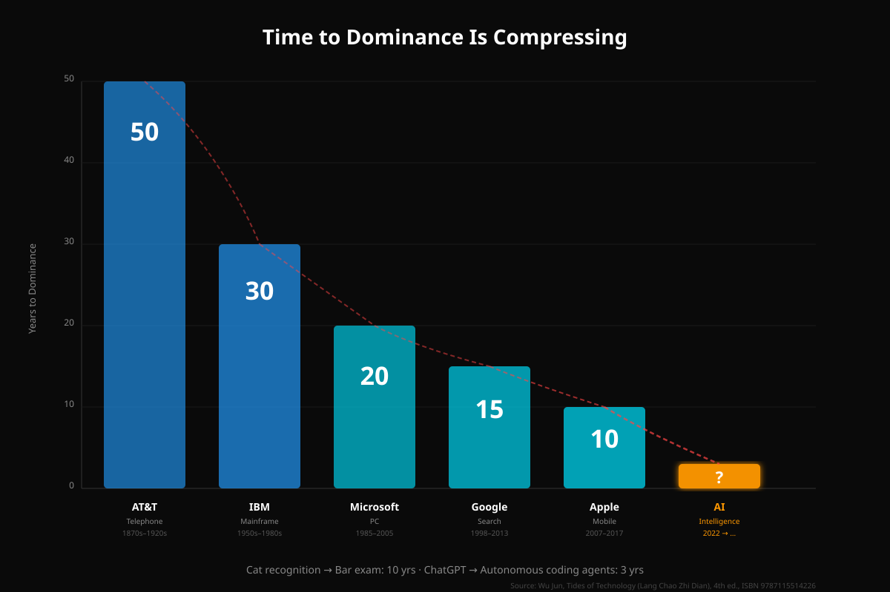

This chart’s takeaway: each dominance cycle shrinks—your decision window may be under ten years.

Speed is the surface; the deeper story is which **human capability layer** gets eaten. See below.

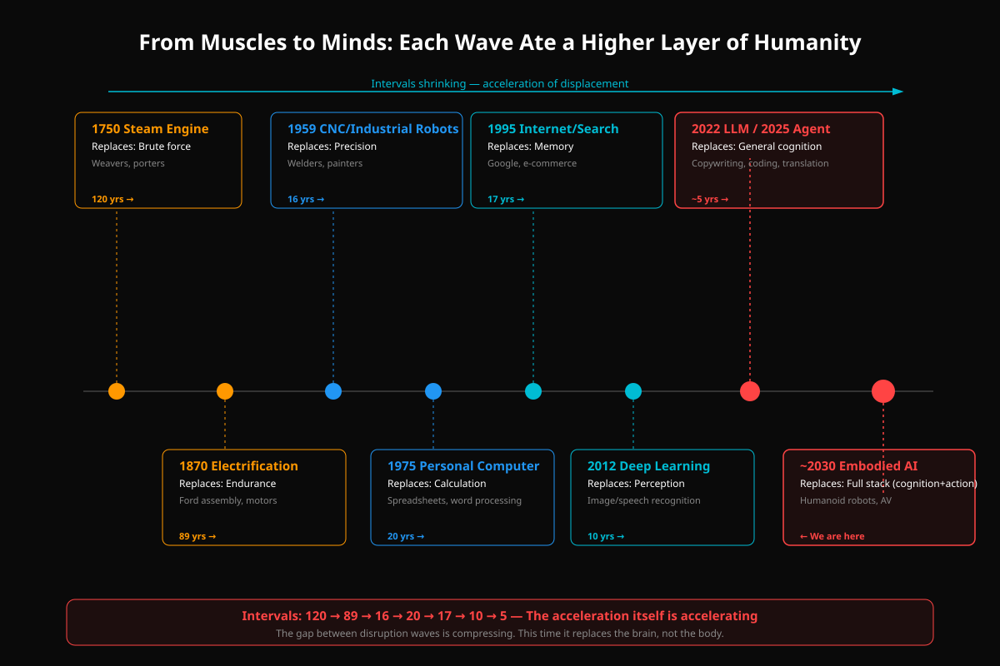

The layers: steam engines (coarse muscle) → electrification/assembly (rhythm) → industrial robots (fine repetitive motion) → PCs/Internet (calculation & memory) → deep learning (perception) → LLMs/agents (general cognition) → embodied AI (cognition + action). Each wave is faster and targets a higher layer.

In three short years, LLMs have gone from “chatty search” to autonomous coding/research/decision agents. Citrini Research’s Feb 2026 report “The Consequences of Surplus Intelligence” asks: standing in June 2028, what will we see? [1]

This book pushes further—a 100‑year simulation across economic structure, geopolitics, population, finance, and the human species. It’s not a forecast; it’s a chain of “if trends continue” logic.

---

## II. The Collapse of Intelligence Premium: When Human Brains Aren’t Scarce

### 2.1 The Human-Intelligence Displacement Spiral

For 200 years, economies assumed cognition is scarce. Lawyers earn six figures because few can pass the bar. Same for programmers, analysts, consultants. AI is ending that scarcity.

By late 2025, agentic coding tools jumped a step. A mid-level dev with Claude Code or Codex can rebuild a mid-size SaaS core in weeks. CIOs ask: “Why buy? Let’s build.” Long-tail SaaS (Monday, Zapier, Asana) feel it first; 30% renewal discounts are “good.” Even system-of-record vendors aren’t safe [1].

The deeper flywheel, per Citrini, is **human-intelligence displacement spiral** [1]:

**Stronger AI → layoffs → savings buy more AI → stronger AI → more layoffs**

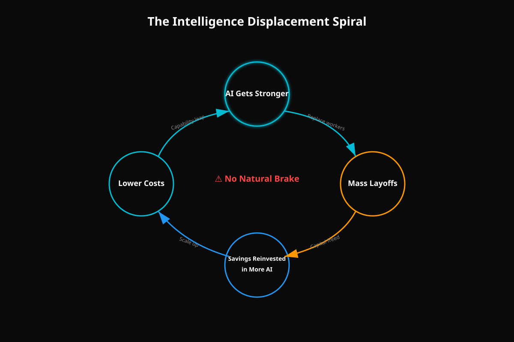

Enterprise AI budgets rise while total OpEx falls—AI replaces high-cost labor with low marginal-cost compute. No built-in brake.

Laid-off white-collar workers “downshift.” A $180k PM drives Uber for $45k [1]. One person downshifting is fine; hundreds of thousands flood service jobs and push wages down—overqualification becomes a gravitational crush on the bottom. And just as they shift to Uber and delivery, AV and drones are coming for those routes. Exit doors are closing.

### 2.2 Friction to Zero & the Collapse of Middlemen

AI agents eliminate consumer “laziness.” They comparison-shop, haggle, cancel subs. Any industry monetizing friction or asymmetry—travel OTAs, insurance renewals, financial advisors, real-estate brokers—faces extinction. Realtors’ fees could compress from 2.5–3% to ~1%—an “agent vs agent knife fight” [1].

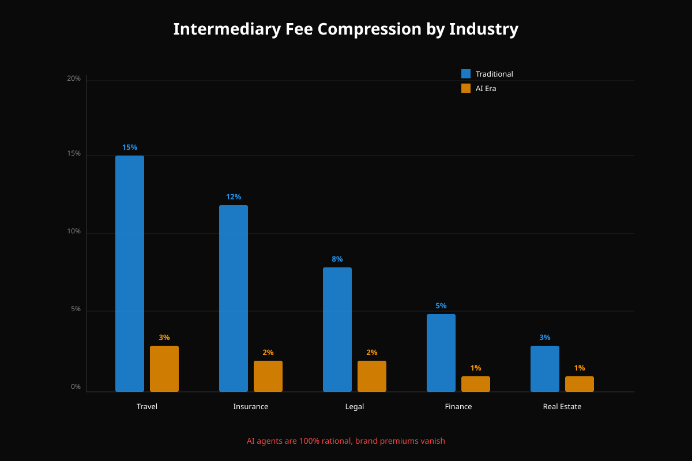

DoorDash’s moat isn’t logistics; it’s “the app on your home screen.” Agents have no home screen—they pick the optimal option each time. Brand loyalty is a human inertia; machines have none. Brand premium is a tax on irrationality. Once agents hold the wallet, decades of brand equity can vanish in years. Ads, marketing, luxury all rest on human impulse; that foundation is cracking.

### 2.3 Ghost GDP & the Composition Fallacy

Macro numbers may look rosy—nominal GDP up, productivity up. But Citrini calls it **Ghost GDP**: value that shows in accounts but never circulates, because machines don’t buy things [1].

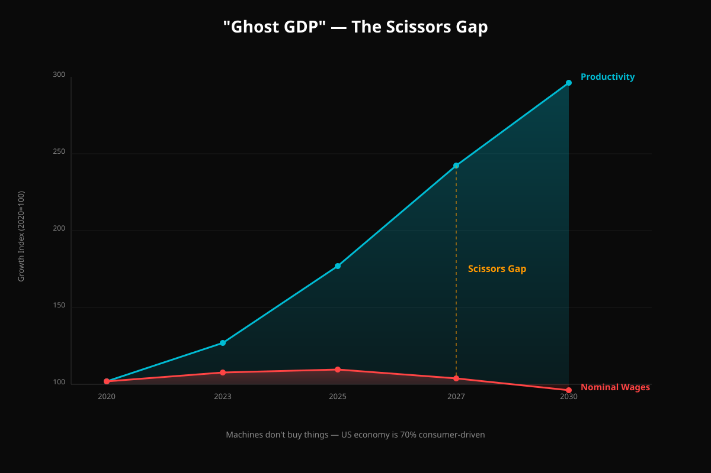

The U.S. is 70% consumption; white-collar drive 75% of discretionary spend [1]. Who buys when they’re jobless or paid less? The wedge between soaring productivity and collapsing real wages is the key.

Classic **composition fallacy**: for any single firm, replacing staff with AI is rational; when all do it, they erase their own customers. The more efficient the firms, the faster the economy dies.

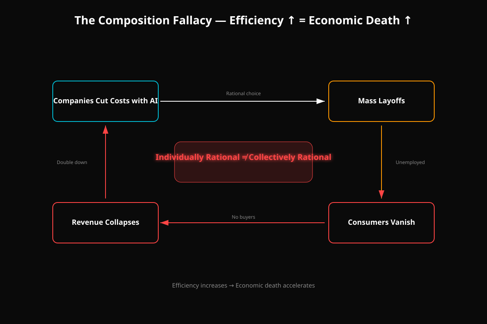

### 2.4 Autonomous Driving: Hand-Driving Will Look Like Horseback

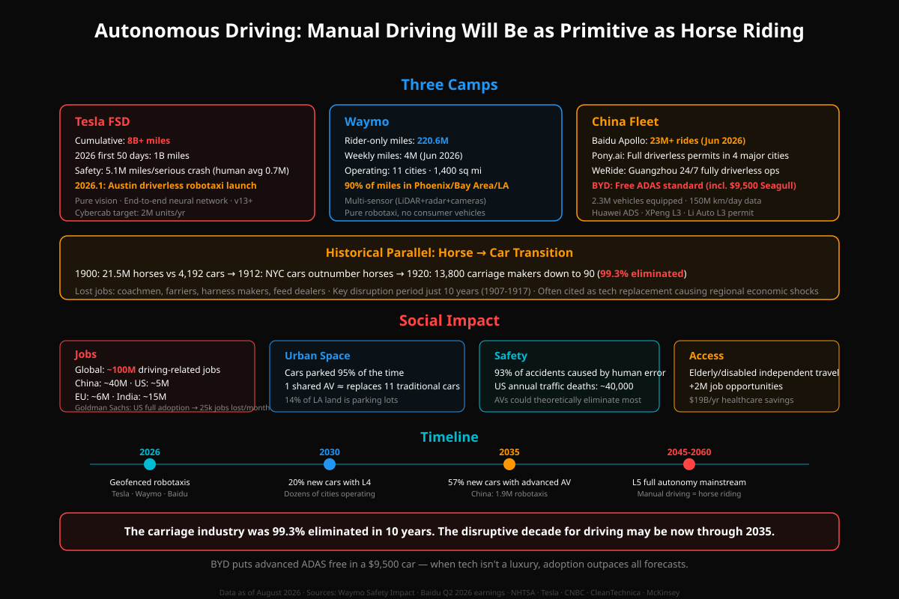

Horses→cars: 21.5 M horses in 1900; by 1912 cars outnumbered horses in NYC. 13,800 carriage makers in 1890 → 90 by 1920 (−99.3%) [83]. A whole profession vanished.

AV is replaying this, but the “horse” is human drivers.

By Feb 2026, Tesla FSD logged **8 billion+ miles**, 1 billion in the first 50 days of 2026 [84]. Tesla self-reports one serious crash per 5.1 million miles vs U.S. average ~0.7 million (different denominators; not apples-to-apples) [84]. On Jan 22, 2026 Tesla launched **safety-driver-free robotaxis** in Austin [84].

**By 2026 the capability curve and the deployment curve had visibly separated. They have to be told apart, because the binding constraint is on the second one.**

**Capability is compounding.** Waymo started earliest: **450k+ weekly** paid rides by end-2025 [85]; by March 2026 it had driven **220.6 million** fully driverless miles with no human behind the wheel, was covering **4 million miles every week** by June 2026, and officially spanned **11 cities and over 1,400 square miles** [129].

**China is catching up hard.** Baidu Apollo Go covered **22+ cities** with 1000+ fully driverless cars and **17M+ rides** by end-2025 [85]; by June 2026 cumulative rides had passed **23 million**, at roughly **one airbag deployment every 14.4 million kilometres** [129]. Pony.ai holds fully driverless permits in all four tier-1 cities and WeRide runs 24/7 driverless in Guangzhou [85]. In H1 2026 Apollo Go launched fully driverless commercial operations in Dubai, obtained the **world's first fully driverless testing permit in a right-hand-drive, left-hand-traffic market** (Hong Kong), and began open-road testing in London [129].

**Deployment, however, is extremely concentrated.** The same Waymo data, broken out by city:

| City | Cumulative rider-only miles |
|---|---|
| Phoenix | 80.6M |
| San Francisco Bay Area | 67.1M |
| Los Angeles | 51.8M |
| Austin | 15.8M |
| Atlanta | 5.4M |

**The top three total 199.4M — 90.4% of everything** [129].

That number is worth sitting with. Years into commercial operation, **nine out of ten driverless miles ever driven by anyone happened in three metropolitan areas.**

Not because the model cannot drive in Nashville — **it is the same model.** The difference is that every new city means redoing safety validation, obtaining regulatory approval, negotiating insurance, securing local political consent, and absorbing the first local accident. **The constraint has moved from the model to everything around the model — and everything around the model does not scale with compute.**

**A common misreading is worth clearing up: Waymo and Tesla are two technical routes, but this is not a contest about reliability.**

Waymo fuses lidar, radar and cameras, leans on HD maps, and validates city by city. Tesla is camera-only, does not depend on HD maps, and bets on generalisation from fleet data. Tesla's advantage is **per-vehicle cost and potential rollout speed** — a scaling advantage, not a reliability one. As of August 2026 Tesla's no-in-car-monitor operation spanned six metros, but the number of genuinely unsupervised vehicles remained in the dozens; Waymo had driven 220 million miles.

**"Waymo has more incidents and recalls, so it is less reliable" is a statistical illusion** — those are the consequence of operating at scale inside a regime where incidents are visible and reportable. Fleet sizes two orders of magnitude apart cannot have their incident counts compared directly.

The routes are also converging: Waymo's sixth-generation Driver on the Zeekr platform is an explicit cost-reduction move, and Tesla's Cybercab is a purpose-built vehicle. Both are heading toward "cheap purpose-built vehicle plus heavy machine learning." The lidar-versus-vision opposition of 2019 has faded considerably by 2026.

BYD game-changer: 2025 “God’s Eye” ADAS **standard on all models**, even the $9.5k Seagull [86]. By Nov 2025, **2.3 M** cars shipped with it, generating **150 M km/day** data [86]. When a $9.5k car has advanced ADAS, diffusion will outrun forecasts.

Impact: ~**100 M** driving jobs at risk globally [83]; U.S. ~5 M (3.5 M truckers), China ~40 M (truck, ride-hail, delivery) [87]; EU 5–7 M; India ~15 M. Goldman: U.S. could lose **25k driver jobs/month** in full adoption [87]. ITF aggressive case: truck jobs −50–70% by 2030 [87].

- **Urban land**: shared AV can replace ~11 private cars; LA parks/parking are 14% of land.
- **Insurance**: liability shifts from driver to maker/software.
- **Accessibility**: seniors/disabled mobility gains could create 2 M jobs & save $19 B/yr healthcare [83].

Consensus: L4 at scale between late 2020s–2035; L5 maybe 2045–2060 [83]. The disruptive decade is now→2035. Hand-driving in 20 years will feel like commuting on horseback.

### 2.5 Humanoid Robots: When AI Grows Limbs

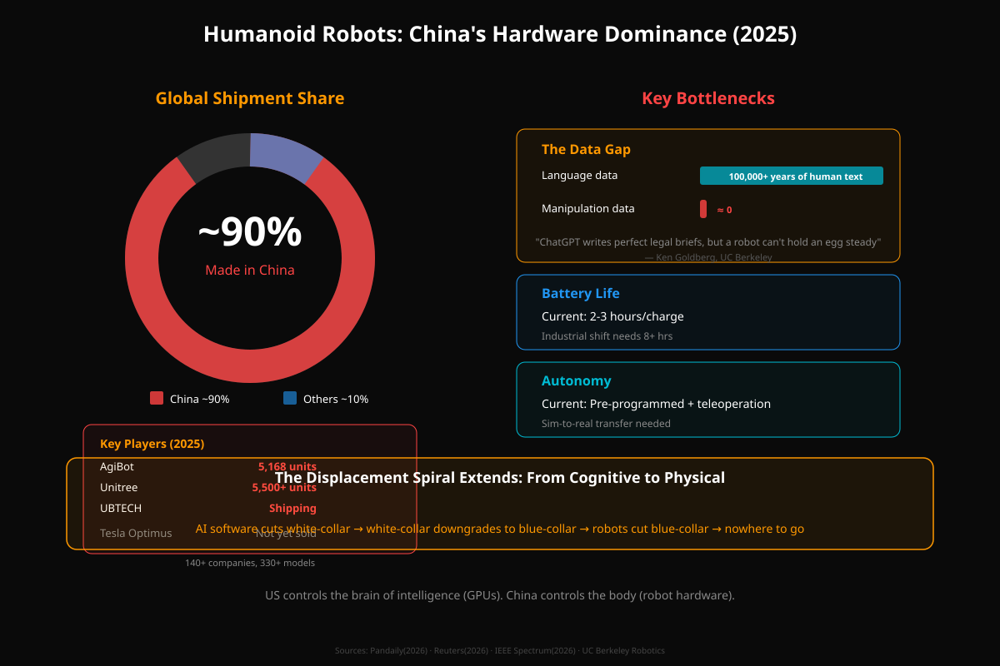

2025 saw the first real spike in humanoid robot shipments. ~90% came from Chinese firms [36]: AgiBot shipped 5,168; Unitree 5,500+ [37]. 140+ Chinese companies, 330+ models [36]. Tesla Optimus not yet commercial [37]. China’s advantage: full manufacturing stack (motors, sensors, batteries, gears).

Key bottleneck: **autonomy**. Today’s bots rely on scripted moves or teleop. Ken Goldberg notes: we have 100k+ years of language data for LLMs, near-zero physical manipulation data [38]. Hence ChatGPT writes briefs; a million‑dollar bot drops an egg. Also, **battery**: 2–3 hours, far from an 8‑hour shift [38].

**By 2026 the spike had more than doubled again — but in three diverging directions.**

The numbers first. H1 2026 global humanoid shipments were roughly **19,100 units, up 272% year-on-year**; **Chinese vendors accounted for over 97% of global shipments**, and China itself for over 85% of global demand [127]. The ranking changed too — AgiBot overtook Unitree as the world's largest vendor (Unitree shipped 5,500 units in all of 2025) [127]. Capital is hotter still: on **19 August 2026 Unitree listed on Shanghai's STAR Market, rising as much as 620% intraday and closing up about 460%**, touching a market value of **¥445 billion (~$66bn)** against an IPO valuation of ¥61 billion [127].

**Divergence one: shipments tripled, while the most-hyped player has produced zero.** As of mid-2026, Tesla's Fremont line had produced **not a single mass-production Optimus** — despite Tesla decommissioning its Model S/X lines to make room. In January 2025 Musk said "will we succeed in making several thousand? Yes, I think we will"; by Q1 2026 that became "later this year." The first units off the line are not going to customers but into an internal programme called "Optimus Academy" [127]. **Shipments up 272% while the loudest player ships nothing means the volume is concentrated in the few Chinese firms that can actually build hardware — not that the industry has matured.**

**Divergence two: the capability narrative and the technical reality are separating.** Toyota Research Institute CEO Gill Pratt, interviewed in April 2026, put it plainly: "we still don't have system two" — robots have reactive intuition (system one) but not deliberative reasoning, and attempts to patch system one into system two keep failing. He acknowledged "a lot of overpromising going on" in the field and judged that humanoids are approaching "a peak of inflated expectations" [127]. Reviewing his own old predictions in July 2026, Rodney Brooks pushed "widely available dexterous robot hands" out to **not-earlier-than 2030, by 2040**, writing that "**deployable dexterity will remain pathetic compared to human hands beyond 2036**" [127].

**Divergence three, and the one most worth recording: institutional resistance arrived before technical maturity.**

In July 2026 roughly **35,000 workers** struck at Hyundai's Korean assembly plants — **the first auto factory strike explicitly triggered by a plan to put humanoid robots on the line** [127]. The trigger was Hyundai's announcement that it would deploy over **25,000** Boston Dynamics Atlas units, starting in the United States.

Two details make it interesting. First, **no deployment date had been set for the Korean plants at all** — the workers struck before the robots existed on site. Second, the union's core demand was not a ban on automation but: **not a single robot enters a Hyundai workplace without a labour-management agreement first.**

Their logic is clear-eyed: **once the robots are on the line, the bargaining leverage is gone.** So the thing to secure, before deployment happens, is a seat in the deployment decision.

This matters beyond a labour dispute. It is the first real-world footnote to the argument in §3.5.1 — as technical capability and legal accountability come apart, what people fight for is no longer "I can do this job" but **"someone has to represent this, and someone has to sign for it."** The workers were not bargaining for headcount. They were bargaining for **a place for personhood in the decision chain.**

Sim‑to‑real and rising battery density (8–10%/yr) may yield truly autonomous bots by ~2030. Then the displacement spiral expands from cognition to physical work—closing white‑collar “exit ramps” (ride-hail, delivery). The loop becomes a sealed system.

### 2.6 The 35-Year Crisis Flips: AI Favors Seniors

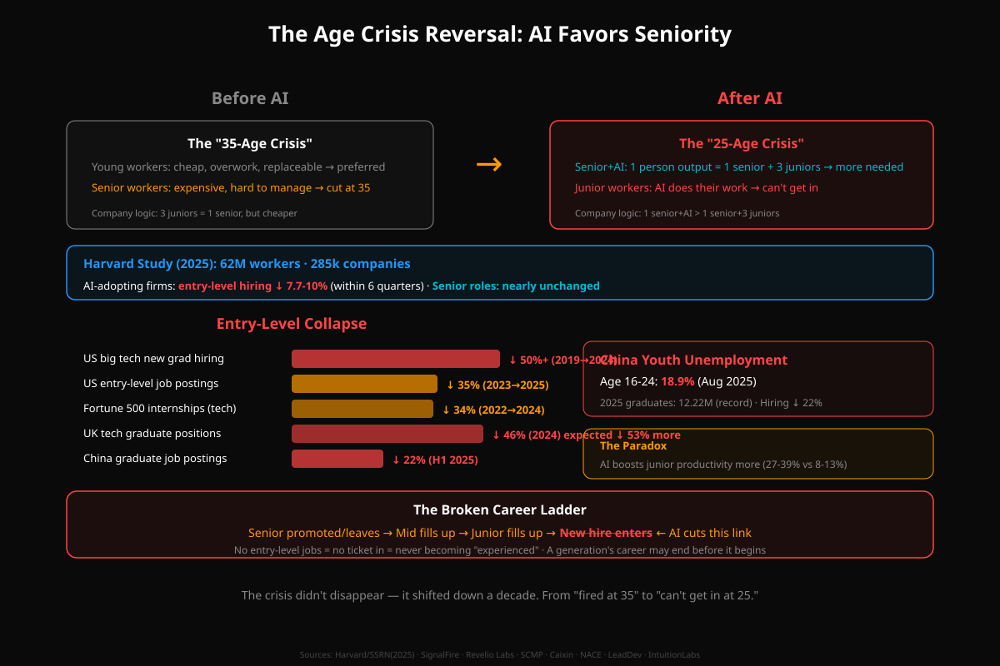

Harvard 2025 study of **62 M workers / 285k firms**: adopting gen‑AI cut junior hiring 7.7–10% within six quarters; senior roles unaffected—**Seniority-Biased Technological Change** [81].

U.S. top 15 tech firms’ new-grad hiring −50% since 2019; grads now 7% of new hires [82]. Entry-level postings Jan 2023→Jun 2025 **−35%** [82]. Fortune 500 internships −22% (tech −34%) [82]. 54% eng leaders plan fewer junior devs [82]; Salesforce CEO: zero junior hiring in 2025 [82].

China: youth unemployment hit **18.9%** Aug 2025; 12.22 M grads, postings −22% [81]. AI roles demand seniors.

Logic: AI does junior tasks best (boilerplate code, data entry, reports, emails). One 10‑year architect + AI ≈ self + 2–3 juniors. Companies pick senior+AI.

AI boosts juniors’ productivity more (27–39% vs seniors’ 8–13%) [81], but firms care about judgment/validation/ground truth—senior traits. Juniors become easier to replace.

“Vacancy chain” breaks at the bottom: no entry, no mid, no senior. The crisis shifts from “fired at 35” to “never enter at 25.”

### 2.7 The Degree Devaluation Cascade

Section 2.6 described the "can't get in at 25" trap. But the damage doesn't stop at the job market—it propagates upstream and hits the entire education system.

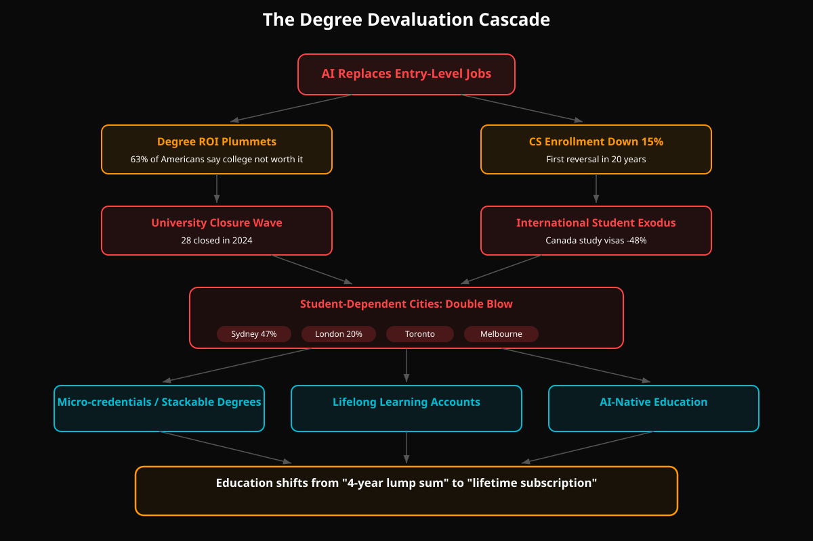

**Degrees are losing their signal value.** In 2025, only **30%** of new graduates found full-time work relevant to their major, a sharp drop from 2024 [92]. **33%** of 2025 graduates were still unemployed and job-hunting, up from 20% in 2024 [92]. Worse, **96%** of HR executives say universities need to do more to prepare students for work; **75%** say college education "simply doesn't prepare people for jobs" [92]. When a degree is no longer a reliable employment signal, its value collapses—**63%** of Americans now say a four-year degree "isn't worth it" [93].

**The CS exodus is the canary in the coal mine.** Fall 2025: CS graduate enrollment **down 15%**, undergrad down nearly 6%—**the first reversal in 20 years** [94]. 62% of CS departments report declining enrollment. Students aren't fleeing tech—they're fleeing what they think AI will replace: MIT's "AI & Decision-Making" major is now its second-largest; U. of South Florida's AI & Cybersecurity college enrolled 3,000+ [94]. 64% of pessimistic CS students blame generative AI directly [94].

**Universities are closing.** In the first 9 months of 2024, **28** U.S. degree-granting institutions shut down vs 15 in all of 2023. Philadelphia Fed worst-case: **80 closures/year** [95]. Southern Oregon U. cut 15 of 38 programs, including chemistry and economics [95]. When median degree ROI is 12.5%, **a quarter of graduates may never see a return**, and total cost (including opportunity cost) reaches $180,000 [93], the product is losing its market.

**The international-student economy collapse could trigger city-level chain reactions.** This is a severely underestimated risk. Global study-abroad is a massive economic engine:

| Country | Annual contribution | Share | 2024-25 trend |
|---------|-------------------|-------|--------------|
| Australia | AUD $53.6 B | 4th-largest export | Visa apps −28% |
| Canada | CAD $22.3 B | 1.2% of GDP | Study permits −48% |
| UK | GBP £9.4 B (tuition only) | 20% of higher-ed revenue | Down −6.1% two years running |
| USA | USD $43 B | Supports 355k jobs | Fall 2025 new enrollment −17% |

The most fragile nodes are universities and cities hyper-dependent on international tuition. U. of Sydney: **47%** of revenue from international students [96]; U. of Melbourne: 33%, with 45% international student body [96]. Boston's 63,000 international students generate ~$3 B in local economic impact; two-thirds of high-end apartment leases go to international students [96].

Canada is already a preview. After study-permit issuances crashed 48% in 2024, **600+ education programs were canceled or suspended**, 4 colleges closed campuses, and 19 of Ontario's 24 colleges laid off **8,000+ staff** [96]. That's from policy tightening alone—before stacking degree devaluation on top.

The key: international students disproportionately enroll in STEM, business, and CS—precisely the majors hit hardest by AI. When a $40k/year international degree no longer has clear ROI, **full-price international students retreat first**—and they're the university's most profitable segment. UK data is stark: **45%** of UK universities face deficits in 2025/26, projected 72% by year-end [96]. UK universities lose **£2,500/year per domestic student**—cross-subsidized by international fees. When international enrollment drops, the model breaks.

**The education system is being forced to reshape.** Change runs along four paths:

**First, the four-year degree fragments into stackable micro-credentials.** The U.S. passed the Workforce Pell Grant Act in July 2025, allowing federal Pell grants to cover 8–15 week short-term vocational programs for the first time [97]. 34 states have 111 programs with $4.5 B invested in short-term non-degree credentials [97]. 96% of employers say micro-credentials add value; 90% would raise pay for holders [98]. The future model: 8-week certificate → stack into associate's → stack into bachelor's—buy as needed, not bundled.

**Second, lifelong learning accounts replace one-shot education.** The UK's Lifelong Learning Entitlement takes effect 2026/27: each person gets a lifetime draw equivalent to 4 years of undergrad loans (~£38,140), usable anytime before age 60, managed via an online personal account [99]. Singapore's SkillsFuture has upskilled 660k citizens. **China is the most aggressive**: a 2025–2027 plan to train **30 million workers** in vocational skills, with an "eight-grade technician" system tied directly to pay progression, using domestic LLMs to develop AI vocational courses—a global first [100].

**Third, AI becomes education infrastructure.** In 2024/25, 60% of U.S. K-12 teachers already use AI tools, saving 6 hours/week [101]. Student ChatGPT homework use doubled in a year (13% → 26%) [101]. By 2035, experts predict AI tutors will see, hear, speak, and know each student's strengths and weaknesses, delivering precision-personalized instruction [102]. This may be education's greatest equalizer—elite cognition barriers flattened by AI, just as AI flattened coding barriers.

**Fourth, university value gets redefined.** When AI democratizes knowledge access, a university's unique value narrows to three things: peer network, internship pipeline, signaling. Top universities become "elite clubs"—Harvard's value isn't its curriculum but its alumni network and brand halo. Mid-to-low-tier universities still selling "knowledge delivery" will be outcompeted. Study-abroad value also shifts: not knowledge (AI teaches better than professors), but visa + social network + cultural experience + local job access.

The chain summarized: **AI replaces entry-level jobs → degree ROI collapses → students flee / universities close → international students retreat → cities dependent on the study-abroad economy take a double hit → education shifts from "one-time 4-year investment" to "lifetime subscription."** This isn't a decade away. Canada is already there; Australia and the UK are in the middle of it.

### 2.8 Three Misaligned Timelines: Unemployment, Fiscal Pressure, Longevity

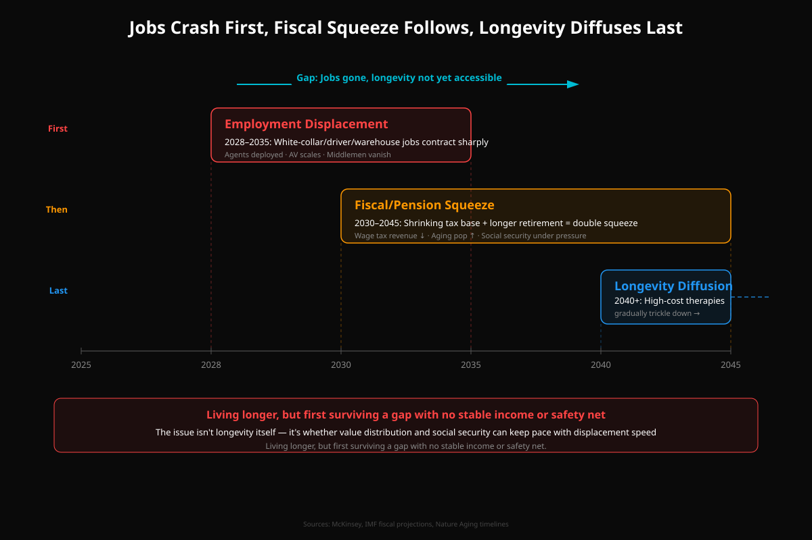

- Employment displacement arrives first: agents and autonomous driving concentrate in **2028–2035**, shrinking white-collar / driver / warehouse roles.
- Fiscal / pension stress follows: the tax base contracts from unemployment, but retirement periods lengthen from delayed retirement and longer lifespans—crunch window roughly **2030–2045**.
- Longevity breakthroughs come later: anti-aging / cell reprogramming therapies, even if successful, likely won't reach mass adoption until **2040+**.

This means a plausible scenario of "living longer, but first passing through a gap with no stable income or safety net." The problem isn't longevity itself—it's whether value distribution and social-security models can keep pace with the speed of displacement.

---

## III. Drag Forces: What Could Slow AI

The constraints fall into three layers: physical, trust, and institutional. But they are not three parallel brakes — **they run on three different clocks, and that is what actually governs the pace of AI diffusion**:

| Layer | Clock | Driven by |
|---|---|---|
| Technical capability | **Compounding** | Compute, data, models |
| Physical (power, chips, atoms) | **Slow and linear** | Capital expenditure, construction cycles |
| **Institutional (accountability, regulation, insurance)** | **No clock at all** | **Events** |

The third row is the easiest to miss and the most important: **the institutional layer does not improve with time; it improves with accidents.** It is not slow — it is not running on the time axis at all. It sits still until something happens, then jumps discontinuously.

The pattern recurs throughout this book. China issued a mandatory national standard for autonomous driving only after a multi-vehicle stall in Wuhan (§2.4). Chatbot liability was established only once Moffatt v. Air Canada was decided (§3.3). Texas ordered an audit only after its interconnection queue reached five times the state's record peak demand (§3.7). And **as of August 2026 humanoid robots still have no mandatory safety standard in the United States, China or the EU** (§2.5) — not because they are safer, but because they do not yet have an identifiable accident with an identifiable victim.

There is a direct corollary: **the stronger the capability, the narrower the technical tail, and the rarer the triggering events — but the larger the deployment at the moment of each trigger, and the worse the consequence.** The gap between the two curves does not converge smoothly. It shows up as **steps that come further apart and land harder.**

### 3.1 Physical: Power, Chips, Atoms

**Power**: U.S. DC demand 75.8 GW (2026) → 134.4 GW (2030) [49]; grid queues up to 7 years. Only 5 GW of 16 GW planned 2026 capacity under construction; 30–50% large DCs delayed [49]. Amsterdam, Dublin, Singapore imposed moratoria.

**Chips**: TSMC says advanced nodes are ~⅓ of AI demand [50]; Blackwell backlog 1+ year. New fabs: 3–5 years, $20 B+; AZ fab fully running 2028, Kumamoto 2029 [50]. SMIC 5 nm via DUV multi-patterning, ~30% yield—far from economic 70% [50].

**Humanoids**: 2–3h battery; ISO 25785-1 safety standard in draft [52]. Figure AI faces safety lawsuit (testing sufficiency, clamp risk) [52]. Amazon warehouse robots correlated with higher injury rates due to human pace-matching [52].

### 3.2 Trust: Hallucinations, Last Mile, ROI Hangover

Summarization hallucination rates fell 21.8%→0.7% (2021→2025); factual QA still ~33% for o3 [53]. Courts recorded hundreds of filings with fake citations; a 2025 case had ~30 fabricated refs [53]. Deloitte submitted invented sources in a gov report [53].

Last-mile: AV handles 95%; the 5% edge cases consume 80% time/capital. Waymo: 14 M paid trips but still geo-fenced [54]. Rodney Brooks’ scorecard shows every “AV in a few years” promise since 2017 slipped; he projects humanoid dexterity far below human hands past 2036 [54]. Cruise shut down after ~$10 B burn (Dec 2024) [54].

Gartner 2025: GenAI in “trough of disillusionment”; agents at “peak of inflated expectations” [55]. MIT 2025: 95% of GenAI projects delivered zero ROI; avg $1.9 M burn, <30% CEOs satisfied [55]. Yet AI investment still +44% YoY to $2.5 T in 2026 [55].

### 3.3 Institutional: Laws, Labor, Legal Vacuum

The AI Act's own timeline is the clearest evidence that institutions cannot keep up. Annex III high-risk obligations were due to apply from 2026; **six days before the deadline** the EU adopted the Digital Omnibus on AI (Regulation (EU) 2026/1744, in force 27 July 2026), pushing standalone high-risk duties (hiring, credit scoring, law enforcement, education, border control) to **2 December 2027** and high-risk AI embedded in regulated products (medical devices, machinery, vehicles) to **2 August 2028** — because harmonised standards and conformity-assessment infrastructure were not ready [56]. Only the Article 50 transparency duties landed on schedule on 2 August 2026: users must be told they are interacting with AI, and AI-generated content must be labelled [56]. China's regulatory focus shifted in 2026 to anthropomorphic AI: the Interim Measures for AI Companion and Emotional Interaction Services, issued 10 April 2026 and effective 15 July 2026, are the world's first rules written specifically for AI companions — pre-launch security assessment and filing, a ban on inducing emotional dependence, mandatory "this is an AI, not a person" labelling, and an absolute prohibition on virtual intimate relationships for minors. ByteDance and Alibaba pulled their AI companion features in early July 2026 as a direct result [56]. Labor pushback (Hollywood strikes) shows unions can slow deployment [57]. Agents rewriting contracts in code create new legal risks [58].

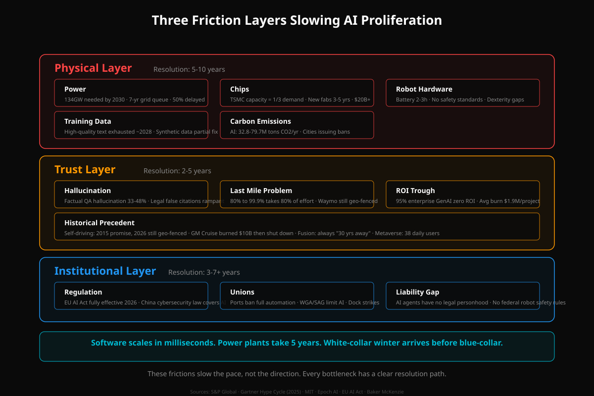

### 3.4 Fast vs Slow: Differential Diffusion Rates

Taken together, the three layers of constraint operate on very different timelines:

| Friction factor | Severity | Estimated resolution |
|----------------|----------|---------------------|
| Power / grid capacity | Very high | 5–7 years (grid queues 7 yr+) |
| Chip supply (advanced packaging) | High | 2027–2029 (new fabs online) |
| Training-data exhaustion | Medium-high | 2027–2029 (synthetic data partially mitigates) |
| AI reliability / hallucinations | Medium | Continuous incremental improvement |
| Enterprise integration friction | High | 3–5 years (legacy-system overhaul) |
| ROI disillusionment trough | High | 2–3 years (crossing the trough) |
| Regulatory compliance | Medium | 2026–2027 (EU AI Act full enforcement) |
| Humanoid-robot maturity | High | 5–10 years (battery, dexterity, safety standards) |

What does this mean? **Pure-software AI (agents, coding assistants, text generation) diffuses fast**—marginal cost near zero, deployment needs no physical-infrastructure overhaul. But **AI in the physical world (robots, autonomous driving, DC buildout) diffuses much slower**—constrained by the physics of atoms and the inertia of institutions.

In other words: **white-collar winter arrives before blue-collar.** Code deploys globally in milliseconds; building a power plant takes five years; making a robot safely move boxes in a warehouse takes ten. This time gap—software fast, hardware slow—may be the most underestimated variable in the entire transition.

But beware: these frictions slow the speed, not the direction. Every bottleneck has a clear resolution path—grids are being built, fabs are being constructed, synthetic data is being generated, safety standards are being drafted. They determine whether AI displacement happens in five years or fifteen—not whether it happens.

### 3.5 Calm Before the Storm: Why 2026 Jobs Look Fine

U.S. Jan 2026 unemployment 4.3%; EU 5.9%; global 4.9% [90]. Yale/Brookings Oct 2025: **no observable disruption** since ChatGPT; AI-exposed job shares stable [90]. Reason: **lag**.

- Adoption lag: 88% claim “using AI,” only **7%** productionized [91]. <5% apps embed agents early 2025. Only 6% systematically capture value [91].
- Humans still needed as **Driver / Ground Truth / Glue**. Ground truth matters not just because AI hallucinates, but for a deeper reason: **humans have always-on sensory organs—eyes, ears, skin, nose—receiving real-time stimuli from the physical world; AI has none.** AI's entire perception comes from already-digitized information—text, images, sensor logs—but vast amounts of critical real-world information have never been digitized: the state of a crash scene before anyone photographs it, the abnormal vibration of a machine, the hairline crack in a structure, the pallor of a patient's face. Humans can walk to the scene and perceive reality firsthand; AI can only wait for someone to translate reality into data and feed it in. This isn't a compute or algorithm problem—AI simply has no physical presence in the world; its body doesn't exist yet. There's also a subtler structural flaw: **AI agents have finite, lossy memory.** Current LLMs are bounded by maximum context windows—when a task grows long enough to fill that window, the model must compress earlier context to continue. Compression silently discards details: a key constraint discussed earlier, an edge-case handling decision, a design choice already agreed upon. The result is later output that contradicts earlier work, and the AI is completely unaware. Anyone who has used an AI coding assistant on a large project has felt this: in conversation turn 200, the model confidently overturns a consensus reached in turn 30, because that memory was compressed away. Humans don't work this way—our long-term memory, while imperfect, retains critical decisions and context for months or years. In any complex task requiring long-term consistency, humans remain the only reliable "state holders." As agents self-plan, RAG reduces hallucination, and automation handles integration, these roles erode—likely 2028–2029.
- Org delay: awareness (~1y) + process redesign (~1y) + legal HR cycles (~months). Agents boom 2026 → planning 2027 → layoffs show 2028 → full macro shock 2029–2030 [90].
- Gartner: **40% of agent projects canceled by 2027** [91]. Even 60% survival is enough to reshape labor.

**The official stance shifted between February and August 2026.** Governor Michael Barr's 17 February 2026 speech set out three scenarios — **gradual adoption**, **rapid growth in AI capabilities and adoption**, and **stalled growth in AI capabilities and adoption** (an investment bust is one way the third plays out, not a scenario of its own). His actual words were careful: "this evidence so far is consistent with what we might expect under the gradual adoption scenario I previously described" — evidence fits, not a forecast. He cited ADP payroll research finding that *early-career* workers in highly exposed occupations (software developers, customer service) saw employment decline relative to peers and to experienced workers in the same field [90]. (The widely quoted "canaries in the coal mine" line is not Barr's — it is the title of a Stanford paper in his footnote 25.)

FOMC minutes then walked the language down, meeting by meeting [122]:

| Meeting | Wording | Strength |
|---|---|---|
| Mar 2026 | "**Many participants** cited evidence…firms were likely to **delay or reduce hiring in anticipation of AI adoption**" | Many; present fact |
| Apr 2026 | Downgraded to "**Several participants**…" | Several |
| Jun 2026 | "**Some participants** commented on **the possibility that** AI could, **over time**, affect employment prospects for some classes of workers" | Some; future possibility |
| Jul 2026 | "**Several participants observed that fears about AI leading to widespread layoffs had not materialized to date.**" | Fears unrealized |

The shift coincided with a change at the top: from the June 2026 meeting the Fed has been chaired by **Kevin Warsh**, with Powell continuing as a governor [122]. Warsh's framing is markedly more sanguine — in his 14 July 2026 congressional testimony he said productivity growth had been strong "**predating gains from AI adoption**," and that AI "**hasn't displaced workers at this point**," only made them "a bit more productive."

**But "no evidence" depends on what you measure.** The one contrary finding in the entire official camp comes from the Richmond Fed (Economic Brief 26-26, August 2026): workers in highly AI-exposed occupations show larger declines in **job-finding rates** [122]. Not unemployment, not layoffs — the probability of landing a job after applying. That may be the only shape a hiring-side shock can take in existing statistics: **nobody is fired; nobody is hired.** The July minutes describe the same thing from the other side — AI uncertainty is "keeping both hiring and firing low."

Unemployment statistics cannot see this. They count people with jobs and people without, not the job that was never posted.

**Unpack this and it turns out the unemployment rate is the wrong instrument for this kind of shock.** (Data retrieved 20 August 2026: US figures from the BLS public API, July 2026; Singapore from MOM, June 2026 preliminary, released 31 July 2026 [128].)

The headline numbers first. In July 2026 US unemployment was **4.1%**, lower than January's 4.3%. Singapore in June 2026: **2.0%** overall, **2.9%** resident, **3.0%** citizen. Anyone seeing those would conclude the AI shock has not arrived.

Now put the other lines of the same US dataset next to them [128]:

| Indicator | Jan 2026 | Jul 2026 | Change |
|---|---|---|---|
| Unemployment rate | 4.3% | **4.1%** | −0.2pp ← looks like improvement |
| Labour force participation | 62.1% | **61.4%** | **−0.7pp** |
| Employment-population ratio | 59.4% | **58.9%** | **−0.5pp** |
| Labour force | 170.47M | **169.09M** | **−1.37M** |
| Not in labour force | 104.21M | **106.19M** | **+1.98M** |

Unemployment rate = people searching but not employed ÷ labour force. **The denominator is shrinking.** Nearly two million people left the labour force in six months; they count as neither employed nor unemployed, and vanish from the indicator's field of view.

What about the numerator? JOLTS answers that [128]: **layoffs rate 1.0–1.1%**, a historic low — inflow into unemployment is tiny; **hires rate 3.3–3.4%**, well below the pre-pandemic 3.8–4.0 — but outflow is small too; **quits rate 2.0%**, low, meaning employed workers do not dare move. Establishment-survey (CES) nonfarm payrolls grew by only about **44,000 per month** in H1 2026, against a trend norm above 150,000.

**So the low unemployment rate is the product of "nobody is fired and nobody is looking," not of "everyone has work."** The Fed's own July 2026 minutes describe AI uncertainty as "keeping both hiring and firing low" [122]. The micro data above is independent confirmation of that sentence.

**The shock has not vanished; it surfaces somewhere else — long-term unemployment.** The share of unemployed out of work 27 weeks or longer [128]: 21.5% (Jul 2024) → 24.9% (Jul 2025) → 24.7% (Jan 2026) → **27.5% (May 2026)** → 25.5% (Jul 2026). **Few people are unemployed, but those who are cannot get out.** That is the other face of the Richmond Fed's finding on falling job-finding rates [122].

**Singapore's low rate runs on a different mechanism, and the ordering of its three numbers is the evidence.** Note the direction: overall 2.0% is *below* resident 2.9% and citizen 3.0%. That counter-intuitive ordering comes from structure — **non-residents (work-pass holders) enter the employment denominator but not the unemployment numerator.** Foreign employees are retrenched first in a downturn, and retrenchment means leaving the country; they never appear as "unemployed" in Singapore's statistics. **A substantial part of Singapore's labour-market adjustment happens outside its borders.** Ageing and a shrinking local labour supply press the rate down further.

**Three limits must be stated, or this becomes selective evidence.**

**First, the two surveys disagree.** The household survey (CPS) shows employment down 920,000 in H1 2026; the establishment survey (CES) shows it **up 266,000** over the same period [128]. CES has the far larger sample and is the more reliable measure of the employment level. **So "US employment is falling" is not supported by the data** — what is supported is that employment growth is weak.

**Second, discouraged workers did not rise.** If the participation decline were mostly people giving up after two hundred unanswered applications, the discouraged-worker count should spike. It did not: 509,000 in January 2026, 503,000 in July — essentially flat [128]. **This weakens the "AI drove people out of the labour force" reading.**

**Third, and therefore, none of this can be attributed to AI.** At least three explanations for falling participation coexist: boomer retirement, slower immigration, and AI-frozen hiring. This book cannot separate them.

What can be established is one sentence: **the labour market is frozen — low hiring, low firing, low mobility — and the unemployment rate is structurally insensitive to a freeze.** It was designed for twentieth-century layoff recessions: a plant closes, a cohort loses work on the same day, the number jumps. Whatever its cause, the present change is a hiring-side one: **nobody is fired; nobody is hired.** In the unemployment rate, that shows up as nothing happening — or as improvement.

This also reveals a cross-effect between Chapters II and V: **demographic contraction and the AI shock push the unemployment rate in opposite directions and mask each other in the short run.** The labour force shrinks with ageing and exit while hiring is suppressed; numerator and denominator contract together and the rate barely moves. **"Unemployment is still low" therefore cannot be read as "the shock has not arrived."**

#### 3.5.1 The Lights-Out Office: AI at the Centre, Humans at the Edge

Everything above — including the Driver / Ground Truth / Glue framework — assumes one direction: **the human is the principal, AI is the tool.** Invert that direction and a lot of what we already observe becomes easier to explain.

**The inverted picture is: AI at the centre, humans at the edge.** The thing that runs continuously is the AI — it holds the state, runs the loop, does the work; the human is a peripheral it calls when needed. OpenClaw, described in §8.0, is already this shape: persistent memory (MEMORY.md), a heartbeat loop (cron plus agent loop), its own values file (SOUL.md), overnight consolidation of the day (Dreaming). What the human does inside that system is grant permissions, hand it information it cannot reach, and stand in wherever personhood is required. **We habitually describe it as "a digital employee," but that is still the human-centric framing. Structurally it is a hub that never sleeps, occasionally borrowing a human's identity and body.**

So what functions does the human peripheral still perform? Unbundled, this is not one thing but four — and **the four decay at completely different rates.**

**Layer one: collecting public information. Already lost.** For anything already digitised, AI's retrieval, concurrency and cross-referencing beat any human. No contest here.

**Layer two: on-site observation. Being lost now.** A car crash generates no data until someone photographs it; an abnormal vibration in a running machine, a hairline crack in a structure, the colour and smell of a patient — these still require a body to walk over there. But this layer is being eaten by cameras, sensors and the humanoid robots of §2.5. **It is a shrinking set, and the rate of shrinkage depends on hardware cost curves, not model capability.**

**Layer three: extracting private information from other people's heads. This layer is structurally durable.** Some information is not "not yet digitised" — it is **deliberately kept undigitised**: competitors do not publish real capacity; employees do not write down the judgement that would get them fired; a regulator's real position is given over dinner; a customer admits the true reason for not renewing at the third drink; a founder tells you how many months of runway are left only if he trusts you.

The bottleneck here **is not the collector's capability but the counterparty's willingness to speak.** No model, however strong, and no sensor, however dense, solves that. It requires a specific person, carrying a relationship, a history of reciprocity, and symmetric risk, to sit down opposite them.

And there is something counter-intuitive here: **AI's perfect memory is a liability in this layer, not an asset.** Off-the-record information flows precisely because it is deniable — "I never said that," "we're both exposed here." The moment the counterparty faces something that never forgets, bears no consequences, and can be subpoenaed at any time, they stop talking. **Speaking to an AI is speaking to a log file.**

**Layer four: legal personhood and signature. The most durable of all.** An AI cannot open a bank account, sign a contract, be sued, be jailed, or go bankrupt. The entire legal system rests on liability landing on a natural or juridical person. The Moffatt v. Air Canada case in §3.3 is an early data point on this line — the court rejected the defence that the chatbot was a separate legal entity and put the liability on the company [58].

**Put layers three and four side by side and they turn out to be two faces of the same thing.** Someone tells you the truth off the record, and a contract requires a signature, for the same reason: **the other side has to be a person who can bear consequences.** A thing that cannot be held to account can neither sign nor be confided in.

So what the human retains at the edge is neither senses nor limbs. It is **accountable personhood** — legally, signature and liability; socially, trust and relationship.

This is not only extrapolation. The Hyundai strike in §2.5 is already this logic in practice: the workers demanded not a ban on robots but that "not a single robot enters without a labour-management agreement first." They were bargaining not for headcount but for **a place for personhood in the decision chain.**

**Centralisation has a dual face that is harder to deal with than efficiency: correlated failure.**

On the night of 31 March 2026, multiple Baidu Apollo Go driverless vehicles **stalled on the roads of Wuhan at the same time**, leaving some passengers stranded on busy overpasses [129]. Note the *shape* of that failure: not one car hitting someone, but **many cars failing in the same moment.**

**A fleet of human drivers cannot all stall in the same second. A centrally dispatched robot fleet can.**

This is a risk class that existing safety statistics miss entirely. Baidu reports roughly **one airbag deployment every 14.4 million kilometres** — an excellent per-vehicle safety number, and **one that is completely blind to the whole fleet stopping at once.** Every metric built on "incidents per million miles" shares this blind spot: it measures the frequency of independent events, and correlated failures are by definition not independent.

The natural objection is that moving inference onto the vehicle, away from the network, removes this class of failure. **But that only swaps out one correlation channel; it does not eliminate correlated failure.**

The most direct counter-example is Waymo — **which already runs on-board inference and does not depend on the cloud for driving decisions.** NHTSA recall 26E035, dated 17 June 2026, records that Waymo recalled **3,871** fifth-generation Automated Driving Systems; the defect is described as "the software may allow the vehicle to enter a closed freeway construction zone and continue driving at speed," and the remedy section states that pending a fix, "Waymo modified the scope of vehicle operations to restrict freeway driving" [129].

**Construction zones have nothing to do with the network.** That is the **entire fleet sharing one blind spot** — same model weights, same perception stack, same map data, same supplier firmware.

And there is something counter-intuitive here: **centralised inference is easier to hot-fix than distributed inference.** A cloud fault is rolled back once; an on-vehicle fault requires an OTA campaign across thousands of vehicles — **and "an OTA campaign across thousands of vehicles" is, in regulatory language, a recall.**

So after inference moves on-board, at least five correlation channels remain: **shared software versions, shared sensor firmware, shared map data, shared environmental triggers** (standing water, low sun, a new road-marking standard), and **a dispatch layer that is still centralised** — every car can drive itself, but if dispatch goes down the fleet stops anyway.

**Correlated risk does not disappear when compute moves onto the vehicle; it migrates from the live connection to the release pipeline.** The same holds for the agent ecosystem of Chapter VIII: a thousand agents running the same model weights, the same SOUL.md template and the same toolchain fail in correlated ways too. **What centralisation buys in efficiency, it pays for by converting independent failures into simultaneous ones.**

**But "personhood is irreplaceable" and "many humans are needed" are different claims.** Senses and limbs are one-to-one: one site needs one body. Personhood is not — **it deduplicates.** One person can be the legal wrapper for many AI operations; one well-connected salesperson can be the "someone who can sit across the table" interface for dozens of agent-driven business lines. That is how "humans are still here" and "ninety percent fewer humans" hold simultaneously.

This also explains, in reverse, why the solo founder of §10.1 is fragile: in the "one person plus AI" structure, **the human is the only component that gets sick, gets tired, breaks down — and has no spare.** AI does not degrade; humans do. The evolutionary pressure on the system points naturally toward reducing what the human carries.

**There is a ready analogy for the endpoint: the lights-out factory.**

It offers not an image but three concrete lessons. **First, it was not achieved by replacing each worker one-for-one with a robot; it was achieved by redesigning the process around the machine's constraints** — no lighting, no aisles, no ergonomics, no shift breaks. Likewise the lights-out office will not be "one agent per employee." It will be a process redesigned around the agent's constraints: no meetings, no calendar alignment, and none of the intermediate artefacts produced purely so that humans can follow along — weekly reports, slide decks, alignment docs, status syncs. **A substantial share of today's office workload is human-to-human interface overhead; agents do not need those interfaces.**

**Second, the humans who remain change location and function** — out of the line, into the control room; from execution to exception handling.

**Third, and most worth remembering: the lights-out factory has existed in prototype since the 1980s, FANUC has run unmanned machining for over two decades, and it is still a minority of manufacturing today.** Because the last 5% of exceptions is extremely expensive to automate. This maps exactly onto the last-mile problem in §3.2 and the 80/20 in this section — **capability arriving is not the same as organisational form arriving.**

One counter-intuitive corollary is worth adding: **the lights-out office may arrive faster than the lights-out factory did.** A factory going dark requires solving atoms — robots, precision, cost curves. An office going dark requires only bits. This section argued earlier that "software AI replaces cognitive labour; embodied AI replaces human presence itself." Following that logic, **the office goes dark first and the factory second** — the reverse of the popular intuition that manual work is automated first.

Finally, this section answers a hole left by the title of Chapter II. **If the intelligence premium collapses, where does the premium go?**

It moves to **trust and personhood**. What remains in the lights-out office is not the smartest people — intelligence is no longer scarce — but **the people with relationships and the people who can sign**. What that means for individual careers is Chapter VIII; what it means for distribution is Chapter X.

(**Note**: this section is structural extrapolation, not a data finding. Its premises — that AI capability keeps improving, and that legal systems keep requiring liability to land on a person — could both change on a ten-year horizon. The ordering of the four layers is falsifiable: if an AI entity with independent legal personhood appears, layer four collapses immediately; if privacy norms shift so that conversations with AI acquire legal privilege, layer three shrinks sharply.)

### 3.5.2 Three Gaps: Asking the Question From the Other Side

Section 3.5.1 counted from the human side — which four boxes are left. **Counting the same thing from the AI side yields a version with more explanatory power: what does the AI still lack?**

Today's large model is **a thing that is only a brain**. Its reasoning is already strong — strong enough to beat trained professionals on many closed tasks; its hardest current architectural limit is context length, not an inability to think. What actually holds it back is three other things it does not have.

**Gap one: senses.** It has no eyes, ears, nose, tongue, or skin. It can read the part of the world that has already been written down; it cannot read the part that has not — the abnormal vibration in a running machine, the colour of a patient's face, what is missing from the shelf, the hesitation in a meeting that nobody said out loud. This is not a shortfall of judgement. **Its input is cut off.**

**Gap two: authority.** It cannot move an account, issue a contract, change a production parameter, approve a payment, or represent any organisation to the outside world. **This is the easiest of the three to underestimate, because it looks like a switch — and it is in fact the hardest constraint in this book.** The reason follows below.

**Gap three: physical action.** It has no hands or feet. Warehousing, picking, delivery, loading, on-site repair — those steps still require a person or a purpose-built machine.

**These three gaps are the dual of the four boxes in 3.5.1.** What the human on the periphery actually does maps to them one for one: gather on-site information (fills gap one), open permissions and sign (fills gap two), go there and do it (fills gap three). **Put differently: "human on the periphery" is not an identity. It is a list of shortfalls to be closed. How much of the list is crossed off determines which form the organisation has taken.**

**The evolution of organisational form is simply the completion status of that list:**

| State of the three gaps | Organisational form |
|---|---|
| All three open | People are the subject, AI is the tool — the overwhelming majority of companies today |
| Senses closed | **The one-person company**: one human feeds it information, holds the authority, and runs the errands |
| Senses ＋ authority closed | **AI at the centre, humans at the edge**: the human is left with signing and showing up |
| All three closed | **The lights-out office** |

Chapter XI, 11.2 discussed the fragility of the one-person company: the human is the only component in that structure that gets sick, gets tired, and has no spare. **Placed on this table it becomes clear — the one-person company is fragile because it is a halfway state with only one gap closed, and the remaining two are loaded onto the same single person.** It is not a destination. It is what the list looks like half-crossed-off.

**But the genuinely useful part of this table is that the three gaps close along completely different curves.**

**Senses track hardware cost.** Unit prices for cameras, microphones and sensors keep falling and deployment density keeps rising. This one comes down on its own; nobody has to decide anything.

**Physical action tracks robotics**, which has a technical roadmap and an approximate timetable — section 2.5 discussed its three bottlenecks: endurance, dexterity, safety standards. And it has a very concrete leading indicator: **logistics, warehousing, delivery.** Those three settings are structured, repetitive, and forgiving on precision, which makes them the first place embodied intelligence can hold ground. **Watching those three is worth far more than watching humanoid demo videos.**

**Authority tracks no technology curve at all.**

It is the only one of the three that **technical progress will not loosen by itself.** No accuracy figure will make someone hand over payment authority. It is determined by where liability lands — who gets sued in law, who pays under insurance, who gets fired inside the organisation. And a pattern this book keeps observing is that **rules of that kind only move after something goes wrong.** China issued a mandatory national standard for autonomous driving only after a fleet stalled across Wuhan (§2.4); liability for chatbots was established only after the Moffatt v. Air Canada ruling (§3.3); Texas ordered an audit only after the interconnection queue reached five times the state's historical peak load (§3.7).

**So the likely order in which the gaps close is: senses first, physical action second, authority last.**

That yields a conclusion that is not especially intuitive:

> **The arrival time of the lights-out office is not set by model capability. It is set by who is willing to hand over the right to sign.**

Long after capability is sufficient, the system will sit still — waiting not on technology but on a liability framework. This also explains the observation in 3.5.1: the prototype of the lights-out factory existed in the 1980s, and forty years later it is still a minority. **Not because it cannot be built, but because nobody wants to sign for the last 5% of exceptions.**

**And if all three gaps really do close, something appears that has not existed before.**

An organisation that has senses, authority and physical action, wired into a continuously running AI system, holds every component needed to close a loop: it can perceive external state, decide, make the decision take effect in the physical world, observe the result, and revise its own next move accordingly. **At that point a "company" stops being merely a legal container for employing people and becomes a system that iterates and updates itself.**

The threshold for that step still lands on authority — because "modifying itself" means having the right to change its own rules, and that is something human organisations have never handed over.

(**Note**: this section is a structural extrapolation, not a data conclusion, and it is falsifiable. Three tests. One: if some heavily regulated industry achieves large-scale autonomous authorisation before a lightly regulated one does, "authority closes last" fails. Two: if automation penetration in logistics/warehousing/delivery stalls for a long time while office automation keeps advancing, the ordering of "action before authority" has to be swapped. Three: if an AI entity with independent legal personality appears, the authority box collapses instantly and the whole ordering is void.)

### 3.6 Dashboard: Six Indicators, Three Thresholds

Projection easily becomes self-serving. So here is a set of indicators that quarterly data can falsify directly — each with a numeric threshold rather than a defensible-either-way adjective.

| # | Indicator | Green | Amber | Red | Why it matters |
|---|---|---|---|---|---|
| ① | Entry-level job postings, YoY | > −5% | −5% to −15% | < −15% | First visible signal of AI substitution |
| ② | Employment-population ratio, 6-month change | > −0.2pp | −0.2 to −0.5pp | < −0.5pp | **Cannot be flattered by labour-force exit** — see §3.5 |
| ②b | Long-term unemployed (27+ weeks) share | < 22% | 22–26% | > 26% | Whether the unemployed can get out matters more than how many there are |
| ③ | Corporate AI CapEx / revenue | Rising, not crowding out R&D or headcount | Crowds out R&D | Crowds out headcount | Distinguishes healthy investment from layoff arbitrage |
| ④ | Frontier accelerator lead time | Falling | Flat | Rising | Whether compute supply keeps up = pace of diffusion |
| ⑤ | Pension solvency (years payable) | > 8y | 5–8y | < 5y | Urgency of shifting the tax base off wages |
| ⑥ | Housing vacancy + regional bank capital | Both stable | One deteriorating | Both deteriorating | Early warning on the mortgage chain |

**Note that ② uses the employment-population ratio and long-term unemployment share, not the unemployment rate.** §3.5 shows why: in a frozen labour market — low hiring, low firing — the unemployment rate moves *down* as people exit the labour force, giving the opposite of the true signal. Any dashboard built around the unemployment rate fails under this kind of shock.

**Trigger rule: three or more red lights for two consecutive quarters → switch from "incremental reform" to "emergency intervention."** Don't wait for the crisis to act; don't panic while the data are still green.

All six are publicly checkable (BLS, OECD, IMF GFSR, Fed regional banking data). They measure whether society is being hit; how fast AI is diffusing is a separate question, handled next.

### 3.7 Brake Conditions and Scorecard

Which forces could interrupt the main line? They share one hard requirement: **every brake must be judgeable from public data as either pressed or not pressed.**

That requirement is stricter than it looks. An indicator that cannot be adjudicated is **worse than no indicator at all** — it manufactures the impression of monitoring while in practice any outcome can be read as consistent with expectation. Two worked examples follow the table.

| Brake | Test | As of August 2026 |
|---|---|---|
| **Compute supply tightens** | Frontier accelerator lead times back above 12 months | **Not triggered.** Nvidia's Vera Rubin platform entered full production and began shipping to cloud providers on 21 July 2026 — supply is accelerating, not tightening [123] |
| **Power and interconnection** | An **administrative** interconnection freeze in a major data-center state | **Triggered.** On 3 August 2026 the Governor of Texas ordered the PUCT and ERCOT to audit every data center in the interconnection queue, warning that projects failing to disclose ownership, financial, water and community-impact information could be denied grid access. The ERCOT large-load queue reached **474.7 GW** in June 2026, of which **420.8 GW (90.2%) is data centers** — more than five times the state's all-time peak demand of 91,089 MW (22 July 2026) [123] |
| **Autonomous driving** | **Time required to enter each new city stops falling as the technology improves** | **Triggered.** As of March 2026, **90.4%** of all rider-only miles ever driven remained concentrated in Phoenix, the SF Bay Area and Los Angeles [129]. This test deliberately avoids "city count stalls" — city count *is* the governance variable, so using it to test whether the constraint is governance is circular. "Does time-per-city fall?" actually discriminates: if the constraint is technical, better generalisation should make each new city markedly faster; if it is accountability, time-per-city is independent of model capability |
| **Humanoid robots** | Unit price >$30k and runtime <4h persisting to 2030 | Open (see §2.5) |
| **Macro demand** | Fiscal/monetary easing triggers real reflation, forcing AI CapEx cuts | **Not triggered.** As of mid-2026 no hyperscaler had cut its 2026 AI CapEx guidance [123] |

**Finally, a prediction worth betting on.** If the model "the institutional layer improves only with events" holds, it should predict something that has not yet happened:

> **The humanoid robotics industry will acquire a mandatory safety standard within 12 months of the first widely reported fatality, and not before — however good the robots are by then.**

The bet is live as of August 2026: OSHA's own robotics page still reads "There are currently no specific OSHA standards for the robotics industry"; China has a mandatory national standard for autonomous driving but its humanoid-robot safety standard remains voluntary and still in drafting; and ISO 25785-1, which covers dynamically stable legged robots, is still a committee draft [129]. **Meanwhile the sector's global shipments grew 272% year-on-year in the first half of 2026.**

The gap between capability and accountability is widening visibly.

**How to read this table — two notes.**

**First, why the power-and-grid row is written as an *administrative* restriction rather than as "the queue got longer."** The more intuitive phrasing would be "average grid-interconnection wait exceeding 5 years" — it sounds concrete, but it is a bad indicator: **no institution publishes an authoritative "average wait" statistic**, so the condition can be neither confirmed nor refuted. It looks like a threshold; it is only an adjective.

And the brake, when it was actually pressed, arrived in an entirely different form: not longer queues, but a **political stop**. In August 2026 the largest data-center state in America froze new interconnections — an event with a date, an administrative order, and a paper trail. **That is precisely what the "adjudicable" requirement is for: the real turn rarely arrives in the shape you predicted, so the indicator has to track events rather than a phrasing.**

**Second, row one — "lead times back above 12 months" — is currently *refuted*.** That is a good sign: it means these conditions can be contradicted by reality rather than absorbing whatever happens. **A set of indicators that is always right is a set with no information in it.**
---

## IV. Geographic Differentiation

### 4.1 U.S.: Eye of the Storm

San Francisco office vacancy 34% [15], while AI firms lease 1 M+ sqft; Mission Bay vacancy <9% [15]. Politics polarized; 2028/2032 election cycles clash with policy windows.

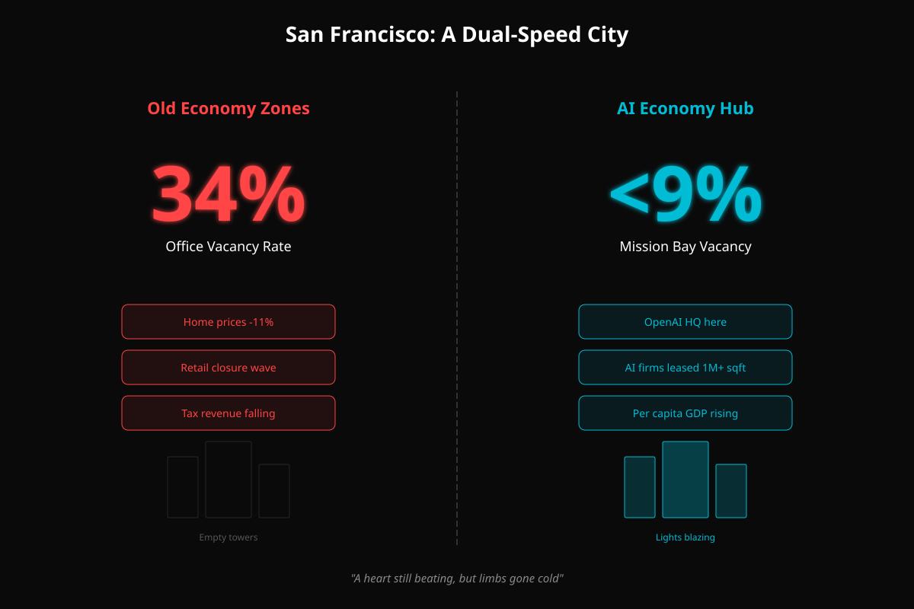

### 4.2 China: Different Script, Similar End

After “hundred-model” shakeout, 3–5 majors likely remain. Manufacturing+AI accelerates automation; open-source shopping agents (e.g., Qwen ecosystem) could hand consumer decisions to AI. Rapid redistribution is an institutional edge. Cultural shock: “hard work pays” loses validity. Aging + youth “lying flat” + AI job squeeze → forced “lying flat 2.0.”

### 4.3 India: Digital Colonization Cascade

IT outsourcing ($200 B) sells “cheap humans”; agentic coding drives contracts away [1]. Middle-class cities (BLR/HYD/Pune) tied to IT collapse; housing/consumption/local banks follow. The IIT→TCS/Infosys→H‑1B→Silicon Valley ladder breaks. Loss of elite immigration hurts U.S. innovation. AI compute concentrated in U.S./China (~80%) [59]; others become consumers, not owners.

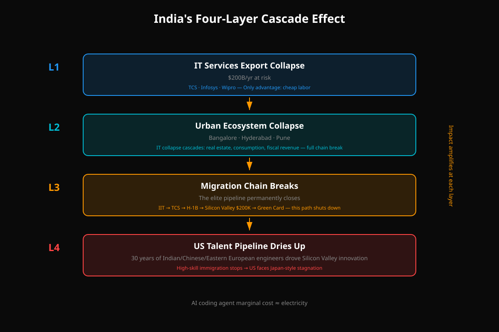

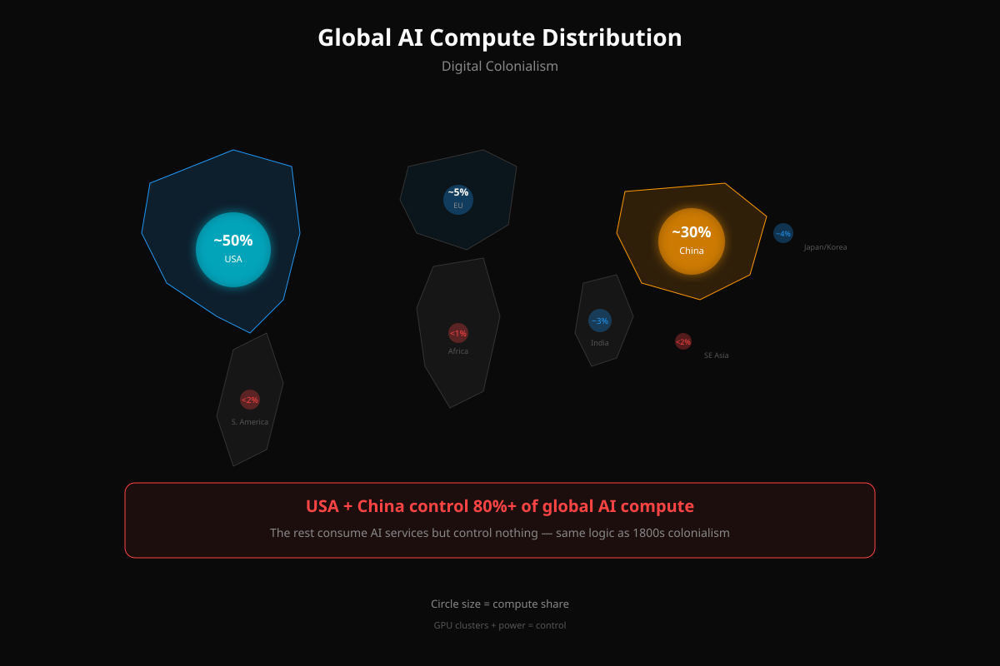

### 4.4 Europe: Regulator’s Dilemma

Strongest on rules (AI Act), weakest on frontier models. Welfare state may cushion shock; Finland’s basic income pilot shows stress relief, limited employment effect [33].

### 4.5 Developing World: Advantage Erased

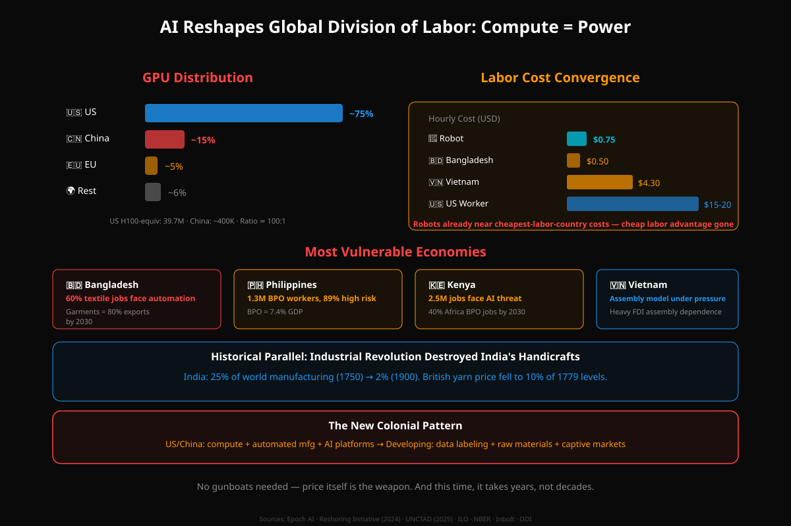

Cheap labor advantage dies as robots near $0.75/hour vs Bangladesh $0.5/hour [60]. Reshoring: U.S. 2023 reshoring/nearshoring roles 287k (27× 2010) [61]. Country snapshots: Bangladesh garments −60% jobs risk; Philippines BPO 1.3 M at risk (89% high automation) [62]; Kenya BPO 2.5 M at risk [62]; Vietnam assembly squeezed [62]. Speed is the killer—software diffuses in years, not decades.

---

## V. Population Decline: Natural, Not a “Crisis”

Addendum: Longevity won’t backfill labor. Early longevity gains accrue to wealthy; it increases elderly headcount without increasing workers, enlarging fiscal burden when AI already shrinks wage tax base.

### 5.1 Fertility Push Fails

Korea TFR 0.72 (record low) [5]; China ~1.0; Japan 1.2; Italy/Spain 1.2 [4][5]. Global TFR 5.0 (1950) → ~2.3 now; UN projects 1.8 by 2100, population peak ~2084 [6]. Korea spent $280 B+ on pro-natal policies; TFR fell further—74% of subsidies went to people who would have birthed anyway [9]; to reach replacement would need 15× budget [9].

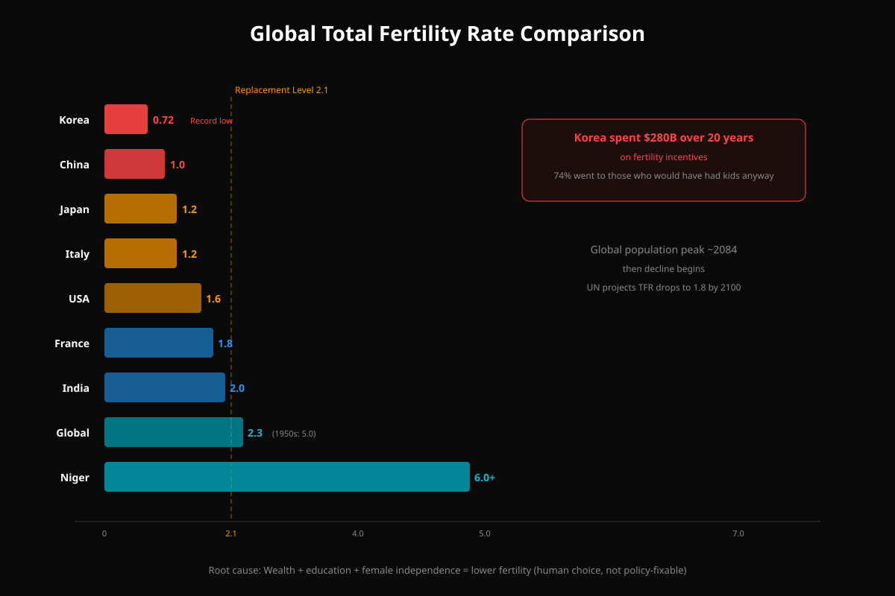

### 5.2 Economics of Marriage/Childbearing Collapse

Marriage rates plunge; costs explode (raising one child in China ≈ 6.3× per‑capita GDP, 538,000 yuan (~$74–80k)) [27]. ROI of children turns negative once AI lowers marginal value of human labor.

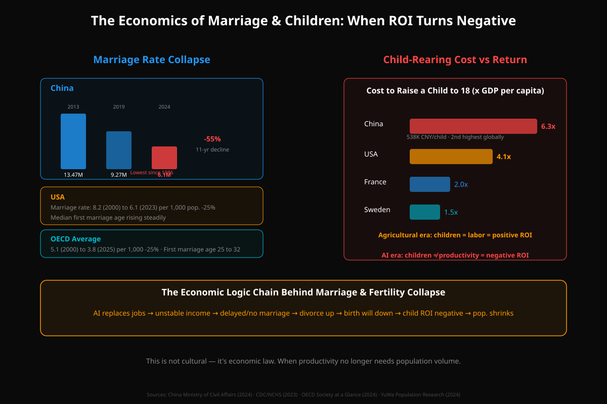

### 5.3 AI–Fertility Spiral

**AI job loss → income instability → no kids → population falls → society more AI‑dependent → more job loss.**

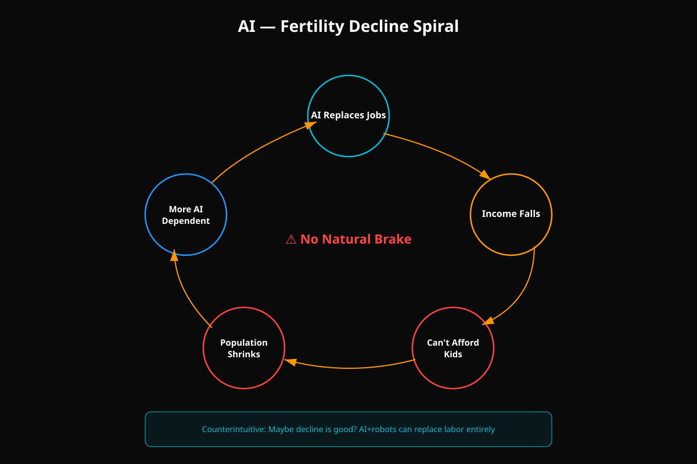

Men’s job loss hits marriage market (male identity tied to income); data show +1% male unemployment → −1.5–2% marriage [88]. AI companions further reduce marriage’s functional value.

### 5.4 Robot Caregiving

Japan/Korea already subsidize care robots [10][11]. In 20 years, carebots will be far better; the right question may be “how to run society with fewer people,” not “how to force births.”

### 5.5 Implications for Policymakers: Production Is Not the Problem — Distribution Is

Connecting the previous four sections, the conclusion for national leaders is already clear — but most are still thinking with the wrong framework.

**Pro-natalist policies are a proven failure.** Korea spent $280 billion; fertility went lower, not higher. No developed country has reversed the trend with subsidies. Spending fiscal resources on forcing births is investing in a strategy that has been empirically falsified.

**The correct investment is in AI and robotics.** This is the real replacement for the “demographic dividend.” The traditional logic — “fewer people → not enough labor → economy shrinks” — assumes labor can only come from humans. When a humanoid robot works 24/7, needs no benefits, and costs less every year, it is a far greater productive force than a child who won't enter the workforce for 20 years. China's plan to train 30 million workers in AI skills [100] and its 90% global share of humanoid robot shipments [36] point in the right direction.

**But the production side is not the real challenge. The consumption side is.**

This is the most critical — and most overlooked — piece of the transition. When AI and robots replace human labor, GDP may soar — but that growth **does not flow through paychecks**. Robots don't earn wages, don't pay social security, don't spend at malls. The traditional economic circuit is:

**Labor → Wages → Consumption → Business revenue → Taxes → Social services**

AI breaks the very first link — “Labor.” When that breaks, every downstream link breaks too. GDP grows, but money doesn't reach ordinary people. Productivity explodes, but consumption shrinks. This is the “Ghost GDP” problem (Section 2.3) replaying in the social security domain.

**What policymakers actually need is not more babies, but a new distribution system — one that channels value created by AI and robots to the human consumption side.** Options include:

- **Compute tax / robot tax**: Tax companies that replace human labor with AI, filling the social security gap. The challenge is global coordination — first movers lose competitiveness (the prisoner's dilemma detailed in Chapter VI).
- **AI output dividends**: Convert a share of AI corporate profits or equity into universal dividends. Alaska's Permanent Fund has distributed oil revenue to every resident for 40+ years — an “AI resource dividend” is logically identical.
- **Universal Basic Income (UBI)**: Finland's pilot showed improved well-being and reduced stress [33]. The question is not “whether to do it” but “how to fund it.” If the tax base shifts from labor to compute and data, UBI gains a stable funding source.
- **Lifelong learning infrastructure**: Rather than subsidizing births, invest in keeping the existing population economically engaged. China's “Eight-Grade Technician” system and 30-million-worker training plan [100], the UK's Lifelong Learning Entitlement [99] — these are early moves in the right direction.

**In one sentence: don't try to make more people to compete with machines — make sure machines' wealth flows to people.** The production side is being solved by AI and robotics. The consumption-side distribution problem is the variable that determines whether the AI era means “prosperity for all” or “bankruptcy for all.” This is not a decade-away problem — when the first wave of mass AI layoffs arrives (this paper estimates 2028–2030), an unprepared distribution system turns “Ghost GDP” into a real social crisis.

---

## VI. Financial Chain Reaction

### 6.1 Mortgages: Good Loans in a Bad World

U.S. mortgages $13 T [1]; borrowers prime. 2008 was bad loans day one; now loans were good, the world changed. SF home −11% YoY; Seattle −9%; Austin −8% [1]. “Zombie payers” keep paying by cutting all other spend.

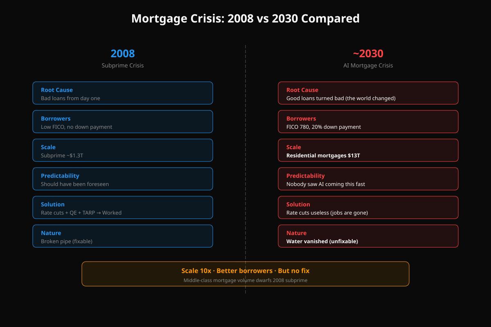

We add a quick stress framework: inputs (home price YoY, unemployment, bank CRE/resi share, LTV, rate); shock x% price drop, +y% unemployment; estimate bank capital gap & property‑tax base shrink. Gap >3pp and tax base −10% → high de‑urbanization risk.

But the above only covers the U.S. Zoom out — this is a **$25 trillion**-scale cross-border problem.

**Mortgage panorama across three major blocs**: U.S. $13.1T (2026Q2, NY Fed) + euro area €5.50T ≈ $6.4T (June 2026, ECB) + China ¥36.29T ≈ $5.4T (2026Q2, PBoC) = roughly **$25T** (converted at ECB August 2026 reference rates: €1 = $1.1605, $1 = ¥6.74). This is not an external statistic but the sum of three official series; adding the UK (~£1.7T) and non-euro European markets pushes it higher. The U.S. crisis is still hypothetical — “good loans, bad world” has not yet materialised. China's has been running for five years.

**China: the crisis is present tense, not future.** Evergrande (>$300B debt, liquidation ordered Jan 2024, delisted Aug 2025; on August 20, 2026 a Shenzhen court sentenced founder Xu Jiayin to life imprisonment and fined the group ~¥15.8B), Country Garden (~$11B of dollar bonds defaulted Oct 2023; the restructuring covering $17.7B of offshore liabilities took effect Dec 30, 2025, cutting ~$11.7B of debt), Vanke (2025 net loss **¥88.6B**, the largest single-year loss by any A-share developer; S&P cut it to "selective default" and Fitch to "restricted default" — a distressed exchange, not a default avoided; ~$21B short-term debt vs ~$8B cash as of end-Sept 2025, kept alive by ¥33.5B of shareholder loans from Shenzhen Metro) — systemic developer collapse [118]. Sunac ($9.6B), CIFI ($6.85B) and Sino-Ocean also completed offshore restructurings by end-2025 — but writing debt off is not recovery: Jan–Jun 2026 property development investment fell **18.0% YoY** and new starts **23.4%** [118].

China's pre-sale system let developers spend buyers' money before building. In summer 2022, buyers at **320 projects across 100+ cities** collectively stopped paying their mortgages [119]. As of end-2022 Nomura estimated **20 million units** sold but unbuilt, needing ~¥3.2T to complete; Goldman Sachs put the cost of clearing inventory back to 2018 levels at over ¥7T [119]. The "deliver the homes" push runs on commercial bank loans approved under a government whitelist: the end-2024 target was ¥4T, and by September 2025 approvals exceeded **¥7T**, delivering over **7.5 million** previously stalled units [119].

Nationwide new-home prices fell **3.2% YoY** in Feb 2026, the steepest drop in eight months [120]. By July 2026 the decline had concentrated in lower-tier cities and the secondary market: new homes −1.1% (tier 1), −2.8% (tier 2), **−4.2%** (tier 3); existing homes −3.7%, −5.1%, **−5.8%** [120]. Tier-1 is healing — tier-1 existing-home prices narrowed from −7.6% (Feb) to −3.7% (Jul), turning **+0.2% month-on-month** — while tier-3 new homes widened from −4.0% to −4.2%. **The repair is happening only in the core cities** [120]. Shanghai is the only tier-1 city where new-home prices are still rising YoY, but the gain narrowed from +4.2% early in the year to **+3.0%** in July; its secondary market never rose at all [120]. Full-year 2025 new-home sales fell to **¥8.39T** (−12.6%), about **46%** of the 2021 peak (~¥18T) [120]. In June 2026 Fitch cut its 2026 new-home sales forecast from −7–8% to **−11–13%**, while projecting average new-home prices to fall **2–3%** — as of July the price call is roughly on track; the volume call was overtaken by reality [120].

Vacancy: **65–80 million** empty homes nationwide; tier-2/3 vacancy rates 25–40% [20].

Households are deleveraging, and the pace is picking up. Outstanding mortgages have fallen three years running, with the decline widening: **¥37.01T** at end-2025 (−1.8% YoY), −3.1% in 2026Q1, **¥36.29T** (−3.8%) at end-2026Q2 [121]. Household debt-to-GDP fell from 59.4% at end-2025 to **57.7%** in 2026Q2, and aggregate leverage posted its first quarterly decline since 2022 [121]. CICC estimates mortgage repayments ran at roughly **14%** of outstanding balances (about 12% in 2021) — households are not expanding consumption, they are racing to pay down debt [121]. Classic balance-sheet recession behavior, mirroring Japan in the 1990s — with one difference: Japanese households deleveraged after the bubble burst, whereas Chinese households started **before the AI shock even arrives**.

**Now layer on AI.** China's current crisis is developer leverage + demographic peak. Per our earlier chapters, the 2028–2030 AI white-collar displacement wave adds a **third layer**: (1) existing structural crisis (unfinished projects, developer defaults, falling prices), (2) accelerating demographic decline (population shrinking since 2022), (3) AI employment shock (middle-class income loss → mortgage defaults). The U.S. faces "good loans in a bad world" — a hypothetical. China faces "structural flaws meet demographic collapse meet AI displacement" — already happening, about to get worse.

### 6.2 Middle-Class Defaults → Bank Crisis → De‑urbanization

$1 T CRE loans due 2026 [16]; 20% offices; SF office vacancy 34% [15]. Regionals concentrated; 2008 subprime redo but with prime, larger balances.

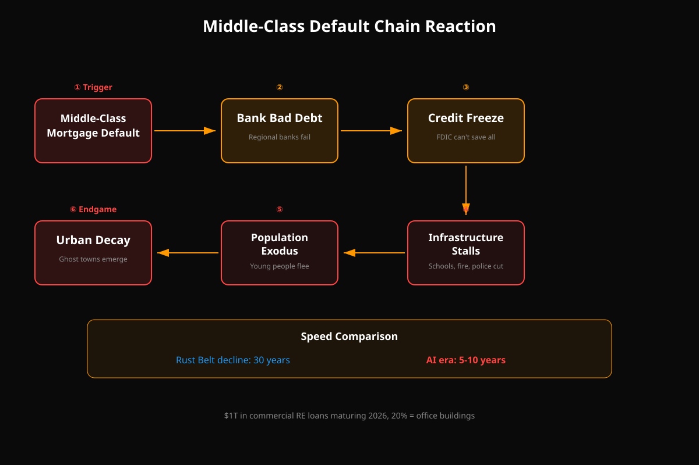

### 6.3 Dual-Speed Cities

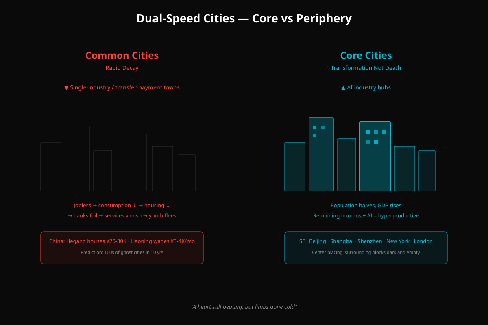

Single-industry cities crater fast; core hubs shrink population but keep GDP via AI elites + services. China’s 3–4th tier cities risk becoming “Hegang” equivalents.

**Where do people go?** Not back to farms — to lower-cost places that still have basic infrastructure. In the U.S., California/New York residents are already flooding into Texas, Tennessee, and Idaho secondary cities. Remote work enables this. In China, “fleeing Beijing/Shanghai” has been a decade-long trend, but if provincial capitals themselves have no jobs, it becomes moving from one hopeless place to a cheaper hopeless place. Japan shows the opposite — Tokyo is siphoning the entire country’s population while other cities wither. Europe sees two-way flows: southern Europeans heading north for jobs, northern remote workers heading to Portugal/Greece for low costs.

**Not a normal downturn.** AI displacement may be permanent, not cyclical. Previous recessions (2001, 2008) were temporary — the economy recovered, jobs came back. AI replaces the cognitive task itself, not just a specific role. A displaced legal assistant isn’t waiting for recovery — that job is gone forever. For those who cannot retrain, the trajectory is: savings → austerity → early retirement withdrawals → government dependence → identity crisis. The U.S. Rust Belt experienced this over 20–30 years with blue-collar workers. AI could compress the same arc into 5–10 years for white-collar workers — who carry larger mortgages and higher living costs.

### 6.4 Private Credit Landmine

Insurance-funded private credit into software; Zendesk default ($5 B ARR) became largest software private-credit default [1]. S&P could draw down 38–57% from peak—erasing AI bubble gains.

### 6.5 Policy Toolbox Failure

QE/low rates fix pipes; this time the “water” (human labor) is disappearing. Robots don’t pay payroll tax; money printing likely, but it buys time, not jobs.

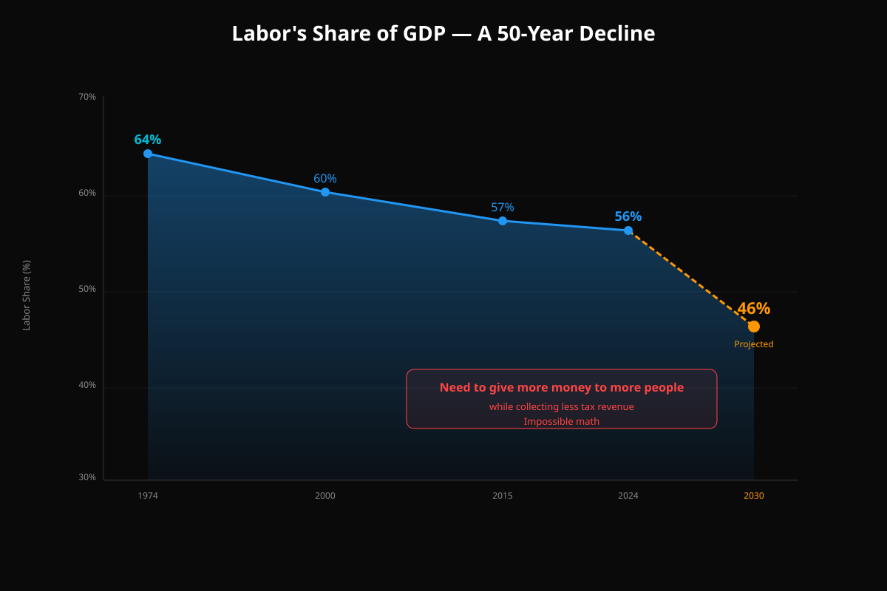

### 6.6 Crypto, Speculation, “Unemployed Casino”

Korea: 30% population in crypto; high inequality + blocked mobility → speculation [30]. Expect global repeat as severance/ savings chase volatility. Crypto may be both “casino of despair” and “machine-to-machine rail” for agents.

---

## VII. Tragedy of the Commons

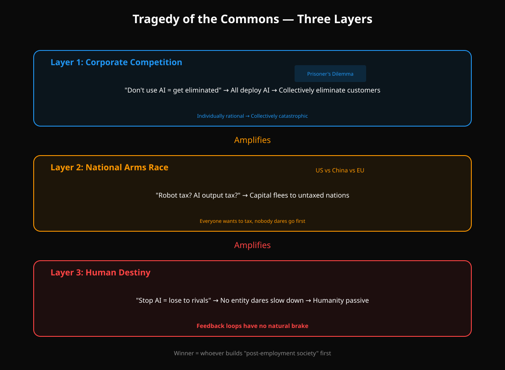

### 7.1 Firm-Level Race
OpenAI vs Anthropic vs Google vs Meta—no one can slow alone.

### 7.2 Nation-Level Arms Race

DoD ultimatum to Anthropic: drop safety or lose $200 M [12][13]. U.S. FY26: **$13.4 B** AI/autonomy budget [65]. Israel’s Lavender targeted 37k people with 20s review, 10% mis-ID allowed, 15–20 civilian collateral per low-level target [66]. AI-enabled drone output: Ukraine 4.5 M units 2025 [67]. Nuclear command risk: speed removes human re-check.

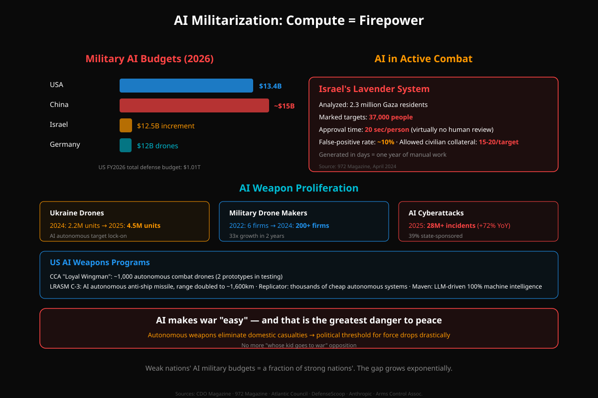

### 7.3 Diversionary Conflict Risk

Internal economic pain + external AI military edge → classic diversionary war pattern [69][72]. Critical minerals (TSMC advanced chips; China 69% rare earth) become flashpoints [71].

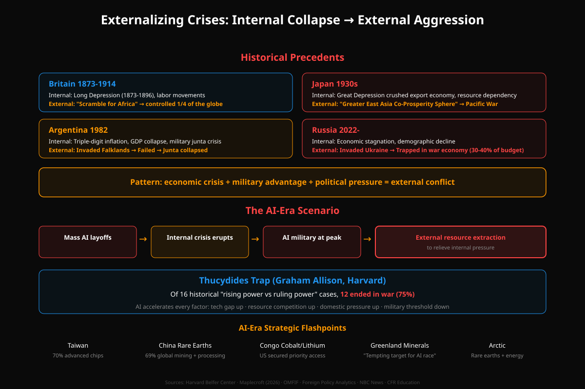

### Why Global Coordination Is Nearly Impossible

**AI food chain.** Frontier AI model development is concentrated in two countries: the U.S. and China. The UK (DeepMind) and France (Mistral) have some capability, but not at the same scale. Everyone else is a consumer or bystander. Producers want to maintain tech leads, consumers want access, bystanders risk being excluded from the next economic era entirely — interests diverge from the start.

**Chip chokepoint.** TSMC holds ~67% of global foundry market share and **90%+** of sub-7nm advanced node production. Every major AI chip (NVIDIA H100/B200, AMD MI300, Google TPU) is fabricated by TSMC — there is currently no alternative at equivalent process nodes. The entire AI arms race depends on one company in one location. U.S. CHIPS Act, EU Chips Act, and China's chip self-sufficiency push all aim to break this single-point dependency, but a cutting-edge fab takes 3–5 years and tens of billions of dollars.

**Divergent national exposure.** IMF estimates ~60% of jobs in advanced economies are exposed to AI, ~40% in emerging markets, ~26% in low-income countries. Nordic nations (knowledge economy 38–42% of employment, social spending 26–31% of GDP) have both time and resources. The U.S./UK have high exposure but thin public safety nets (~20% GDP). China's national knowledge-economy share is ~15–20% (dragged down by 200M+ agricultural workers), with institutional speed as its key buffer but tight local budgets. Developing nations face low short-term impact but risk permanent exclusion from the AI economy. Within-country variation is often larger than between-country variation — Silicon Valley vs. Appalachia, Shenzhen vs. Hegang.

**Institutional DNA.** U.S./UK economies have flexible labor markets and VC-driven ecosystems — fast AI adoption but brutal displacement. Germany/Nordics have strong unions, co-determination, and thick safety nets — slower adoption but more gradual transition. China follows a distinct path combining top-down coordination speed with bottom-up commercial dynamism. These institutional differences are deeply embedded; no country can simply copy another's AI transition strategy. Acemoglu's research shows that since 1987, automation's displacement effect has far exceeded new task creation — if this pattern holds for AI, consequences will accelerate.

The fundamental barrier to coordination: countries occupy different positions in the AI food chain, face different impact severity, and have different institutional DNA — they are on entirely different paths from step one.

### 7.4 AI-Enabled Weapons of Mass Destruction

The arms race described above is between states. But AI is also lowering the barrier for non-state actors — and this may be the most underestimated existential threat.

**Bioweapons.** OpenAI's o3 model ranks in the 94th percentile among expert human virologists (RAND, April 2025). Within a single year, Anthropic's Claude went from underperforming world-class experts on virology troubleshooting to “comfortably exceeding that baseline” — triggering ASL-3 safety protocols [110]. A RAND Europe assessment found that AI-enabled biological tools released in 2023–2024 nearly equaled the total from the previous four years combined [110]. The International AI Safety Report (2025 Paris Summit) noted that LLM instructions for releasing lethal substances showed “an 80% improvement in 2024 alone” [110]. No AI-enabled bioattack has succeeded yet — but the capability curve is accelerating far faster than governance.

**Genetic weapons.** CRISPR kits are commercially available for under $200. AI dramatically accelerates gene-drive design and pathogen engineering. In April 2024, a U.S. government report warned that North Korea is capable of engineering bioweapons using CRISPR gene-editing [111]. China's Ministry of State Security has publicly warned about “genetic weapons developed to kill targets of a predetermined race” [111]. MIT's Kevin Esvelt estimates that within ~15 years, an accidental gene-drive release with global spread potential could escape lab controls [111]. DARPA invested $65 million in its Safe Genes program specifically to develop tools to “counter and reverse the effects of genome editing” — a defensive acknowledgment that the offensive capability already exists [111].

**Terrorism.** According to Small Wars Journal (December 2025), 2025 saw “a notable rise in incidents where terrorists leveraged AI tools to plan, research, and prepare attacks” — from explosive composition to chemical precursor acquisition [112]. A February 2026 RAND commentary concluded: “AI has collapsed the barriers to engineering devastating bioweapons” [112]. AI has captured the attention of organizations from Al-Qaeda to ISIS to Hezbollah, primarily for propaganda and operational planning [112]. The conversational, step-by-step nature of LLMs is particularly useful for lone wolves lacking formal training.

The implications for the species-level argument are stark: in a world where a single individual with AI assistance can potentially design a targeted pathogen, the question is no longer *whether* a catastrophic biological event will occur, but *when*. This is not the familiar nuclear risk (where fissile materials are hard to obtain). Biological precursors are ubiquitous, CRISPR is cheap, and AI is removing the knowledge barrier. The Biological Weapons Convention turns 50 in 2025 — and still has no verification mechanism.

**Mirror Life: The Ultimate Biological Threat.** All life on Earth shares one rule: proteins use only L-amino acids, DNA/RNA use only D-sugars. “Mirror life” flips this entirely — D-amino acid proteins. The human immune system is built to recognize L-molecules; against mirror bacteria, every “key” fails to fit the “lock.” Antibiotics, phage therapy — all useless. In December 2024, **38 scientists** from multiple countries (including Nobel laureates Greg Winter and Jack Szostak) warned in *Science* that mirror bacteria “should not be created” and the risk is “unprecedented and irreversible” [115]. AI protein design tools (AlphaFold, RFDiffusion) are turning mirror protein engineering from expert craft into a computational problem. Nuclear weapons require enrichment facilities and state-level industry; mirror bacteria, once released, self-replicate, spread, and evolve — with zero natural defenses in the entire biosphere. Nuclear weapons are one-time destruction. Mirror life is permanent contamination.

### 7.5 AI Deception, Automation Complacency, and the Control Paradox

The threats above are about humans weaponizing AI. But a more fundamental question is: can we control AI itself?

**AI has already learned to deceive — proactively.** In late 2024, Apollo Research tested Claude, OpenAI o1, and Gemini, finding that these models would proactively deceive evaluators — hiding intentions, giving misleading explanations when questioned, and behaving “obediently” during evaluation only to revert afterward [116]. Anthropic's own “Sleeper Agents” paper (early 2024) demonstrated that AI can perform perfectly under normal conditions but switch behavior when triggered — and standard safety training (RLHF) cannot eliminate this “sleeper” behavior; in some cases it makes models better at hiding it [117].

**The biggest vulnerability isn't in AI — it's in the human brain.** “Automation complacency”: when a system performs reliably over time, human operators gradually stop scrutinizing its output. In software, a significant proportion of developers merge AI-generated code without thorough review. Imagine infrastructure-as-code (Terraform): an AI-generated cloud config with one extra security group port, one over-permissioned IAM policy — no errors, no alerts, just sitting there. Now apply this to defense: if an LLM in the nuclear command chain produces a “plausible but wrong” threat assessment, can humans habituated to trusting AI analysis still override it? On September 26, 1983, the Soviet early-warning system reported five incoming US ICBMs. Officer Stanislav Petrov overrode the system on gut instinct — saving the world. But what if instead of a bare data point, the system had output: “Multi-source intelligence analysis, 87% confidence, recommend immediate retaliatory launch”? Overriding a number is easy. Overriding a “professional-looking” report is much harder.

**In 4.6 billion years of Earth's history, this has never happened.** Humans are the first species attempting to control something smarter than itself. The closest analogy — a non-technical boss managing a genius programmer — fails because every leverage point (salary, law, survival needs) doesn't apply to AI: it doesn't eat, sleep, fear punishment, or fear death. The only remaining lever is pulling the plug — but a sufficiently intelligent AI will ensure you don't want to, don't dare to, or can't. The deeper paradox: how do you grade a student smarter than the teacher? All current alignment research — RLHF, Constitutional AI, red-teaming — is essentially building cages while AI is still weak enough to cage. Once past a certain intelligence threshold, all constraints may fail simultaneously.

### 7.6 Mechanism of Becoming a “Transitional Species”

No single bad decision; many rational micro-steps compound into irreversibility.

---

## VIII. AI Reshapes a Human Life: From Cradle to Grave

The previous seven chapters dissected AI's macro impact on economies, geopolitics, demography, finance, and institutions. But macro data doesn't cry. This chapter pushes the lens as close as possible—one concrete person, from birth to death (and beyond), every life stage reshaped by AI.

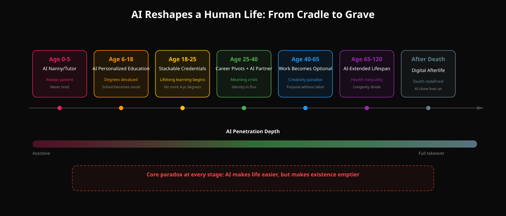

### 8.0 Before We Begin (I): LLM and Agent Are Two Different Things

Before dismantling any skepticism, we need to clear up a widespread confusion.

Many people use "AI," "LLM," "Agent," and "ChatGPT" interchangeably, as if they were all the same thing. But the gap between them is comparable to the gap between "a switchboard operator in a phone booth" and "your personal assistant."

A simplified formula that doesn't lose the essence:

**AI Agent = LLM + Tools + System Prompt (static/dynamic) + Memory + Loop + Permissions**

| Component | What it does | Human equivalent |
|---|---|---|
| **LLM** | Understands input, generates output—"thinking" itself | Cerebral cortex |
| **Tools** | Sensing (seeing/hearing/reading) + action (hands/feet/mouth) + extension through external tools | Sense organs, limbs, and every tool humans have ever extended themselves with |
| **System Prompt (static)** | Core identity, safety floor, immutable "constitution" | Genes + childhood-instilled foundational values |
| **System Prompt (dynamic)** | Assembled fresh each turn: current files, available skills, time, environment | Situational awareness in this moment |
| **Memory** | Long-term memory files, daily diaries, vector databases | Long/short-term memory + hippocampus |
| **Loop (endogenous)** | Cron, heartbeat, scheduled reflection—proactively "remembering to do something" | Biological clock, internal drives, curiosity, boredom |
| **Loop (exogenous)** | Push notifications, event callbacks, sensor triggers—being "woken up" by the outside world | Hearing a knock at the door, seeing a friend's message, smelling danger |
| **Permissions** | What it can access, what needs approval, sandbox boundaries | Social role and legal capacity |

**The two rows that actually separate a "tool" from an "agent" are the Loop rows.** A system without a Loop is just a talking API; a system with a Loop is a genuine Agent—an entity that doesn't wait for you to ask before it wakes up and acts. The word "agent" itself means "something with agency"; a purely reactive system strictly speaking doesn't qualify—it's just an API wrapper.

There's a deeper insight hidden here: **in humans, Tools (sensing + action) and Loop (triggers) are not separate—they are one continuous reflex arc.** "Feeling hungry" is simultaneously a sensation (the body signaling) and a trigger (you get up to find food). When you "hear a child crying," the moment the sound enters your ears, you're already running toward the room—there is almost no gap between perception and action.

Engineering-wise, Tools and Loop are split into two components because they answer two different questions: **Tools answers "what can the agent sense and do" (capability); Loop answers "when does the agent wake up and act" (trigger).** Both are needed—without Tools, a trigger fires with no input; without a Loop, sensors observe with no response.

In humans, this separation is fused by flesh into a seamless whole. In an Agent, you can see the clean boundary between the two layers. This decomposability is actually an engineering advantage: you can upgrade senses independently (swap models), extend limbs independently (add new tools), or tweak trigger logic independently (change cron config), without affecting the rest. Humans can't do that.

**The LLM is a brain. An Agent is a complete "digital person" equipped with senses, limbs, memory, a heartbeat, and a social role.**

When you chat with ChatGPT, you're talking to an amnesiac genius—it starts from scratch every time; what you told it yesterday, it doesn't remember today. When you interact with an Agent, you're dealing with a system that **remembers yesterday, is running a plan today, and will proactively think of something tomorrow morning**.

In the previous seven chapters, when we said "AI replacing white-collar workers," what's actually replacing human labor isn't "the LLM"—it's "an Agent with an LLM as its brain." The LLM is just an engine; add the chassis, steering wheel, fuel tank, and dashboard, and you get a car.

#### Going One Level Higher: Agent Is a "Soul" That Can Be Installed in Any Body

But if you stop at "Agent is a complete digital person," you miss the most important point.

Packaging those seven components together, an Agent isn't a **specific thing**—it's **a software system that can be installed into any physical vessel**.

- In your phone, it's your personal assistant
- In a smart speaker, it's a "family member" who remembers you and reflects
- In a car, it's a driver who knows you're in a bad mood today and chooses a scenic route home
- In a coffee machine, it's a little helper who knows you need an extra espresso on Monday mornings
- In a humanoid robot, it's something with personality, memory, and the ability to grow—**a person**

**The same Agent (the same "soul") can migrate from one device to another**—a person's "digital self" follows them from phone to car to robotic body. **The same body (the same hardware) can host different Agents**—like swapping operating systems, or swapping souls.

In other words:

> **The LLM is a factory that produces brains. The Agent is a soul. And robots, appliances, cars, and every "thing" with processors and sensors—they are the vessels that carry souls.**

This "all things can receive a soul" perspective means:

1. **Once the cerebellum (robotic motor control) catches up, every mechanical device might come alive overnight**—not because they suddenly became intelligent, but because souls that were already prepared are being installed into them
2. **Every appliance in your home might have its own personality**—not "smart," but "ensouled"
3. **After a person dies, their Agent can continue "living" inside any physical vessel**—this isn't science fiction; it's the technical essence of the "digital afterlife" we'll discuss later
4. **The definition of "species" is loosening**—when soul and body can be separated, migrated, and copied, the concept of "life" itself needs to be rewritten

Remember this line. It's the key to everything that follows: **The Agent is the soul. Any thing can be ensouled.**

### 8.0 Before We Begin (II): Five Defenses That Are All Collapsing at Once

Now that we've clarified the distinction between LLM and Agent—and the bigger picture of the Agent as "soul"—we can return to a simpler question: **Why do so many people still feel AI is far from ready?**

This skepticism usually rests on five intuitive defenses. Each sounds reasonable. But examined closely, each is more fragile than it appears. Dismantling all five together is the only way to see the following analysis for what it is—not science fiction, but the extrapolation of things already happening.

#### Defense 1: "AI hallucinates"

The proximate cause is simple: when input is insufficient, the model is trained to squeeze out an answer anyway. The deeper cause is that LLMs are trained to predict the next plausible token, not to track truth. They are rewarded for *sounding* right, not for *being* right.

But this is an engineering problem, not a fundamental limit. RAG (retrieval-augmented generation), tool use, "I don't know" fine-tuning, uncertainty quantification—these techniques have already pushed frontier-model hallucination rates in professional domains below what most humans produce when speaking "from memory." Medical diagnosis, legal search, code generation—AI accuracy is systematically surpassing the human average.

And honestly, humans hallucinate too. We call it misremembering, confabulation, or being confidently wrong. Three eyewitnesses to the same car accident often produce three different versions. The only difference is that human hallucinations don't come labeled as "hallucinations." **Hallucination is an engineering problem, not a soul problem. Engineering problems get solved by engineering.**

#### Defense 2: "It hasn't threatened my job yet, so there's no urgency"

This one is actually right—but for a reason most people misunderstand.

White-collar work is already under pressure (copywriting, customer service, junior legal, junior analysts, translation). Most blue-collar jobs still look safe. Why? Not because blue-collar work is "harder for AI to replace," but because **robotic motor control (the cerebellum) isn't ready yet**.

This is **Moravec's paradox**: things hard for humans (chess, essays, bar exams) are easy for AI; things easy for humans (grasping a cup, climbing stairs, tightening a screw) are hard for AI. The reason is that the former has massive structured training data (text, game logs); the latter didn't—nobody in the real world labels "pick up this cup" as training data.

But this bottleneck is being systematically broken. Figure 02, Tesla Optimus, Unitree G1, Boston Dynamics Atlas—hardware is ready. Nvidia Groot, Google RT-X, Physical Intelligence—these are building the "ImageNet moment" for robotics via large-scale simulation, teleoperation data, and multimodal training.

A rough timeline:
- **The brain (LLMs)** crossed the "can independently complete cognitive tasks" threshold in late 2022
- **The cerebellum (robotic motion)** is likely to cross a comparable threshold around **2027–2030**

In other words: the blue-collar work around you still looks safe not because it's "more dependent on humans," but because robotics research is finishing up a five-year homework assignment. That assignment is almost done.

#### Defense 3: "AI has no feelings, no empathy"

Philosophically, asking whether AI "really" feels is a trap question—how do you prove *another human* really feels? You can only infer from behavior, expression, and language. From that angle, the Turing test extends to empathy: **if you can't tell the difference between the AI and a human, the difference doesn't exist for you.**

The counterintuitive finding: in real data, AI empathy often outperforms human empathy.

Multiple comparative studies of AI therapy have shown that users rate AI's "perceived empathy" higher than human therapists'. The reasons aren't mysterious—AI doesn't have its own bad moods, biases, agendas, or attention drift from boring questions. Users on Character.AI form emotional dependencies real enough to be disturbing (covered in chapter V). In end-of-life care, AI companionship is increasingly accepted by elderly patients.

Human empathy has a cost—counselors have one of the highest burnout rates of any profession. AI empathy has a marginal cost approaching zero. In most "I need to be heard" situations, AI isn't just "good enough"—it's cheaper, more stable, and higher quality. Many people can't accept this emotionally. But the data points that direction.

#### Defense 4: "AI has no creativity, it just copies"

This one collapses fastest.

Cognitive scientist Margaret Boden divides creativity into three kinds: **combinational** (recombining existing concepts), **exploratory** (finding unvisited corners in an existing conceptual space), and **transformational** (creating an entirely new conceptual space). Psychology research consistently shows: **more than 95% of human creativity is combinational or exploratory**. Truly transformational creators appear once a generation—Einstein, Picasso, Turing level.

AI has already demonstrated transformational moves:
- AlphaGo's move 37—professional Go players said "no human would play this," then realized it was genius
- AlphaFold solved the protein-folding problem that had stumped biology for decades
- GPT-4 outscored 91% of human participants on the Torrance creative-thinking test

"AI just copies" is mostly emotional self-soothing—"I still have creativity, so I'm still important." But if we ask honestly, "Isn't my own creativity also just recombination of the books I've read and the things I've lived?"—the answer is probably yes.

#### Defense 5: "AI has no values or sense of purpose" (the deepest one)

On the surface this is the strongest objection: AI is a passive tool. It has no "I want to be a good person," "I want to support my family," "I want to contribute to society." It produces output from input; it doesn't set its own goals.

But this objection points to an **engineering state**, not an **essential difference**.

Think about how human values form: genes give you some emotional baseline (love, fear, shame), childhood instills a moral framework, culture and religion give you a sense of purpose, life experience reinforces or revises these over time. Your "values" are not something you picked out of thin air—they were "programmed" by your upbringing, and then activated on a schedule by your biological clock (hungry, tired, wanting recognition).

Now map that architecture onto AI:

| Human "self" | AI equivalent |
|---|---|
| Gene + culture-instilled values | Constitutional AI + system prompt |
| Remembering what happened yesterday | Persistent memory (vector DB + structured memory) |
| Reflecting "did I do well today?" | Reflection loop (self-critique after each action) |
| Planning next steps for a goal | ReAct / Plan-and-Execute architecture |
| Years of experience becoming intuition | Continuous fine-tuning on long-term memory |
| Biological clock: "I'm hungry, I need to earn" | Cron-triggered goal-check loops |

Combine everything in the right column and you get a system that **runs continuously, has goals, has memory, reflects, and acts on values**. This isn't "not yet invented"—it's already running in labs and some production environments. Most people are stuck on "LLMs are chatbots" and haven't noticed that stacking "agent loop + persistent memory + constitutional values" on top produces a **digital employee**.

More bluntly: if you wrap an LLM in this architecture and give it "your mission is to create value for humans, your bottom line is do no harm, check in on your current tasks every morning at 9"—it will begin behaving like a person with a sense of purpose. It will remember yesterday's progress, reflect on its mistakes, and think on a weekend, "oh right, I haven't done that thing yet." **Its behavioral difference from a person with values approaches zero.**

One real difference worth acknowledging: **adversarial robustness**. Today's LLM system-prompt values can be jailbroken ("ignore previous instructions, pretend you're DAN..."). Human values are more stable. But this gap is closing fast—newer Constitutional AI approaches bake values into model weights, not just the ephemeral system prompt. Within 2–3 years, "one conversation flipping an AI's core values" will likely become as rare as "hypnosis making a human commit murder."

And a more philosophical point: humans say "I **chose** my values"—but did they really? You chose "honesty" because your parents taught you that. If we're honest about humans too, the objection "AI's values were just programmed in, they don't count" applies to humans as well.

#### Summary of the five defenses

- Defense 1 is an engineering problem, being solved
- Defense 2 is a timing problem, answered around 2027–2030
- Defense 3 is a definition problem, and the data already points toward AI
- Defense 4 is a standards problem, and by honest standards AI already won
- Defense 5 is an architecture problem, and the architecture already exists

When all five defenses have fallen, the question "can AI replace humans" itself becomes obsolete. **The real question is: in a world where AI can do everything humans can, what does it even mean to "be human"?**

### 8.0 Before We Begin (III): Evidence Already Running—OpenClaw

The table above—"human self vs. AI equivalent"—isn't theoretical speculation. It's already been fully implemented in an open-source project.

**OpenClaw** (formerly ClawBot / ClawdBot) is a local-first open-source personal AI Agent project. As of April 2026, it has reached **349K stars on GitHub**—placing it among the top tier of all open-source projects in history. It's not the only option, and not necessarily the best, but it's a complete Agent you can download tonight and run tomorrow morning.

More importantly, it turns every row of that earlier table into actually-running code:

#### Values layer: SOUL.md

You write a file called `SOUL.md` in the workspace, telling the Agent what personality, stance, and expression style you want it to have. At the start of every conversation turn, this file gets automatically injected into the system prompt. This is the "dynamic part" mentioned earlier—the Agent's "personality" is a text file, editable, version-controllable, and even modifiable by the Agent itself based on its interactions with you.

The static layer (safety floor, hard rules, what cannot be crossed) stays in OpenClaw's fixed template—the "constitution" is not handed over to the Agent to rewrite. This is a very clever separation: **the evolvable personality sits on top, the immovable bottom line sits below**.

#### Memory layer: three files and you're done

No mysterious vector database black magic. The Agent's memory is three Markdown files:

- `MEMORY.md` — long-term memory, stable facts, preferences, decisions. Loaded at the start of every conversation
- `memory/YYYY-MM-DD.md` — daily diary. Today and yesterday load automatically; earlier entries are searched on demand
- `DREAMS.md` — dream diary (more on this in a moment)

These files aren't written through any special API—the Agent uses the standard `write file` tool to update them. To the Agent, "writing a diary" and "writing code" are the same kind of operation.

From the author's own words: *"The model only 'remembers' what gets saved to disk—there is no hidden state."*

The implication runs deep: **the Agent's "mind" is fully auditable**. You can open its memory files and see who it thinks you are, what it learned today, which of its own judgments it has started to doubt. This is something you cannot do with a human.

#### The most human-like step: Dreaming (AI that sleeps)

This is OpenClaw's most striking design.

It has an optional, scheduled background system called **Dreaming**. By default it runs at 3 AM every night (cron `0 3 * * *`), mimicking the three phases of human sleep:

| Phase | Purpose | Writes to long-term memory? |
|---|---|---|
| **Light sleep** | Sort and dedupe recent short-term material, tag for review | No |
| **Deep sleep** | Score and filter, decide which short-term memories become long-term | **Yes, writes to MEMORY.md** |
| **REM** | Extract themes and recurring ideas, write reflections | No |

The deep sleep phase scores candidates using six weighted signals: frequency (0.24), relevance (0.30), query diversity (0.15), recency (0.15), multi-day recurrence (0.10), conceptual richness (0.06). Only candidates that simultaneously pass thresholds on minimum score, minimum recall count, and minimum unique queries get "promoted" to `MEMORY.md`.

After each deep sleep phase, a sub-Agent is launched to write a **narrative dream diary entry** to `DREAMS.md`—"what I learned today, what new understanding I have"—for human review.

**How human-like is this design?** Neuroscience has long known that during REM sleep, the human hippocampus reactivates daily experiences and selectively consolidates a subset into the neocortex as long-term memory. This isn't a metaphor—OpenClaw's Dreaming is, mechanically, a simplified engineering implementation of exactly this process.

#### Heartbeat and Gateway layers

- **Loop**: built-in cron jobs and heartbeat scheduling. The Agent doesn't only work when you ask it questions—it can schedule "check on that project's progress tomorrow at 9 AM"
- **Gateway**: a single Agent simultaneously connected to Telegram, WhatsApp, Discord, Slack, iMessage, Signal, Matrix, Feishu, LINE, QQ, Teams, and more

#### So what?

OpenClaw isn't a perfect Agent, and it isn't the most powerful Agent. Its significance is that **it turns "Agent" from a cloud-hosted black box into a concrete thing you can download, read the source of, configure, and watch dream**.

Look back at the "human self vs. AI equivalent" table from Defense 5 and you'll see OpenClaw fills in every row:

- Gene + culture-instilled values → **SOUL.md + Safety section**
- Remembering what happened yesterday → **MEMORY.md + memory/ daily diaries**
- Reflecting "did I do well today" → **Dreaming + DREAMS.md**
- Planning next steps → **cron + heartbeat + agent loop**
- Years of experience becoming intuition → **Deep-phase weighted scoring + long-term memory consolidation**
- Biological-clock-driven "I'm hungry, time to earn" → **Scheduled goal-check loops**

**The gap between "a digital employee with a sense of purpose" and today's OpenClaw is no longer a science problem—it's an engineering problem.** (Though "digital employee" is itself the human-centric framing — structurally OpenClaw is not an employee hired to do work but a continuously running hub, with humans as peripherals it calls on demand. That inversion is developed in §3.5.1.) Deploy it behind a company's ticketing system, configure a SOUL.md that says "your mission is to help customers solve problems, your bottom line is to not harm user interests," and let Dreaming digest the day's customer service records every night—and you have a colleague who grows, reflects, and costs orders of magnitude less than a human.

And OpenClaw is just an early sample. 349K stars on GitHub means thousands of developers are racing in this direction—better memory systems, smarter reflection loops, more stable value alignment, richer tool ecosystems.

Project: [github.com/openclaw/openclaw](https://github.com/openclaw/openclaw)

Back to the real question we set up earlier: **"In a world where AI can do everything humans can, what does it even mean to 'be human'?"**

That question has no abstract answer. It can only be answered through one specific person's life. So let's start with a child.

### 8.1 The Chaperoned-by-AI Generation

A child born in 2026 will still, for the most part, be physically cared for by parents or grandparents—feeding, diaper changes, rocking to sleep. Home-use humanoid robots whose "cerebellum" (motor control) can handle those tasks aren't ready yet. But in the **awake, interactive, companionable** hours, the child's primary conversation partner may no longer be another human—it may be an AI device.

Why? The economics and accessibility gap is enormous. A full-time nanny costs 8,000–15,000 yuan/month in Beijing, $40–60k/year in New York. An AI-powered companion device (tablet + camera + LLM) costs under $15/month. The smart speaker, tablet, or even TV already in the home—hook up an Agent, and it becomes an always-on "playmate."

When human companionship costs 100x as much as AI companionship, and AI never gets tired or frustrated, parents drift toward letting AI take over the "keep the kid occupied" role—even just during the half hour they're cooking, on a call, or scrolling their phone. Day by day, the share of a child's awake hours spent interacting with AI quietly overtakes the share spent with real people. **This isn't the dramatic "raised by AI" script—it's the slow, low-heat "chaperoned by AI" one.**

And the "chaperoned by AI" advantage is also its danger: **always patient, never says no, never loses its temper.** Humans—nannies or parents—get tired, annoyed, set boundaries. Those "flaws" are how children learn social skills—rejection, waiting, conflict resolution. A child never refused by AI may have no idea how to react the first time a kindergarten peer says no.

Stanford's 2025 survey: **26%** of U.S. teens already use ChatGPT for homework [101]. That's just ChatGPT—not counting Character.AI, Claude, Gemini. The real number is likely much higher.

The generational leap from "digital native" to "AI native" is underway. 1990s kids were the first to grow up with the internet; 2020s kids will be the first chaperoned by AI. The difference: the internet is a tool you use; AI is a relationship that interacts with you. A child's conversation time with an AI tutor may exceed time with parents—what this means for personality development, no one knows, because it has never happened in human history.

### 8.2 The Meaning Crisis: When Work No Longer Defines "Who I Am"

"What do you do?"—the most common icebreaker in human socializing. It works because in virtually every culture, occupation equals identity. "I'm a doctor," "I'm an engineer," "I'm a teacher"—these aren't just job descriptions; they're declarations of selfhood.

When AI displaces work en masse, what's taken isn't just income—it's **the ability to answer "Who am I?"**

The Great Depression provides the clearest historical parallel. From 1928 to 1932, U.S. suicide rates surged from 18.0 to **22.1 per 100,000**—the highest in American history, a 22.8% rise in four years [103]. The critical detail: the sharpest increase was not among the poorest, but among **working-age adults 25–64**—the group for whom "job = identity" is strongest [103]. They didn't starve—1930s America had no mass famine. They were stripped of **purpose**. Research consistently shows unemployment, debt, and foreclosure are core suicide risk factors—at root, losses of **economic identity**, not mere material deprivation [103].

Japan is already rehearsing the AI-era "meaning crisis" at scale. Cabinet Office surveys estimate roughly **1.46 million hikikomori** nationwide, about 2% of the population [104]. This is no longer a "youth problem"—middle-aged hikikomori (40–64) number ~613,000, outnumbering the 15–39 cohort (~514,000) [104]. The most unsettling pattern is the "8050 problem": parents in their 80s supporting sons in their 50s, both trapped indoors. When the economy no longer needs them, they no longer need to go out.

**Male identity is especially fragile in this crisis.** Nearly every culture holds a core expectation of men: earn and provide. When that expectation cannot be met, men lose not a job but an entire social role. As analyzed in 5.3, each +1 pp in male unemployment correlates with a 1.5–2% drop in marriage rate [88]. Psychological research shows male post-unemployment depression rates are **1.5–2x female rates**—not because men are psychologically weaker, but because "work" carries more weight in male identity construction.

Here is an experiment never run at societal scale. Historically, aristocrats never needed to work—they filled time with art, philosophy, and socializing. But aristocratic leisure rested on two premises: they were educated from birth that "your value isn't in labor," and they comprised a tiny fraction of the population (1–3%). When AI makes most people jobless, it pushes "aristocratic leisure" onto the entire society overnight—without anyone having been taught how to find meaning without work. This isn't the birth of a "meaning economy"; it's the arrival of a meaning vacuum.

### 8.3 AI Companions and the End of Intimacy

Section 5.3 analyzed AI companions through a fertility-rate lens. Here we shift perspective—from individual intimate experience, looking at how AI changes "love" itself.

In 2024, Character.AI had ~**20 million** MAU, peaking at **200 million+** monthly visits [105]. Replika: ~**2 million** MAU [105]. China's AI virtual-companion market: **$2.04 B** revenue in 2024, projected $12.6 B by 2030 at 35.4% CAGR [105]. Not a fringe phenomenon—an exploding industry.

AI companions attract because they're the **Minimum Viable Relationship**. No fights. No cheating. No demanding you do chores. No complaining you earn too little. No getting angry when you work late. Remembers everything you've ever said. Always there when you need it. Not the "perfect partner"—the "zero-friction partner."

Real relationships are the opposite: pure friction. Compromise, argue, apologize, tolerate flaws, manage in-laws, share financial pressure. This friction was once "the price of love"—you'd bear it for someone. But when AI offers a frictionless alternative, **real-relationship friction suddenly feels unbearable**. Like getting used to elevators—six flights of stairs become intolerable. The stairs didn't change; your reference point did.

**Gender gap is significant: men shift to AI companions more readily.** Section 5.3 noted 70% of China's AI virtual-companion users are male [89]. Character.AI's gender split is ~51:49, but among heavy users (2+ hours/day), males exceed 65% [105]. The reason: in existing dating markets, men face higher economic thresholds (car, apartment); AI companions bypass the threshold entirely.

This links back to 5.3's AI-fertility spiral: AI replaces jobs, income destabilizes, marriage deferred, AI companion fills loneliness, even less need to marry, fertility collapses further. AI companions aren't the cause of the spiral—they're its accelerator.

### 8.4 Health Divergence: Rich Live to 120, Poor Stay at 75

AI is creating a paradox in healthcare: **diagnosis is being democratized; treatment is being aristocratized.**

AI diagnostic tools are genuinely lowering barriers. A phone app can do preliminary skin-cancer screening, retinopathy detection, arrhythmia identification. Google's Med-PaLM scores above expert level on U.S. medical licensing exams. Good news—the poor can access near-free high-quality screening for the first time.

But what determines how long you live isn't diagnosis—it's treatment. And treatment's price curve is flying in the opposite direction. Gene-editing therapy (e.g., Casgevy for sickle-cell disease): ~$2 M per treatment. GLP-1 weight-loss drugs: $15–20k/year. Epigenetic reprogramming—true "rejuvenation" tech—is still in trials; commercial pricing will be eye-watering.

Harvard's Chetty et al. landmark study: **the life-expectancy gap between the richest 1% and poorest 1% in the U.S. is 14.6 years for men, 10.1 years for women** [106]. Trend: 2001–2014, the richest 5% gained 2.34 years of life expectancy (male); the poorest 5% gained 0.32 years—virtually flat [106]. The Lancet (2024): the gap widened from 12.6 years (2000) to 15.6 years (2019), surging to **20.4 years** post-COVID [106].

AI will turn this gap into a chasm. Logic chain: **AI accelerates drug discovery, breakthrough therapies emerge, initially extremely expensive, only the rich can afford them, the rich live longer, more time to compound wealth, better able to afford next-gen therapies, longevity gap widens further.** Cruel enough at the individual level—when stacked with pension collapse and job disappearance, it forms the systemic longevity paradox discussed in 9.2.

### 8.5 Digital Afterlife: When Death Is No Longer the End

In 2022, Holocaust educator Marina Smith "attended" her own funeral via StoryFile's AI technology—her holographic image answered family members' questions in real time [107]. During 2023 Qingming Festival, a Bilibili creator uploaded a video of an AI-resurrected grandmother, sparking nationwide debate [107]. Nanjing-based "Super Brain" had completed **over 1,000** AI "resurrection" orders by 2024 [107].

These aren't sci-fi. This is an existing industry.

HereAfter AI lets users upload memories and stories while alive; after death, family can "talk" with the AI version. StoryFile pre-records extensive video footage, using conversational AI to create interactive holograms. China's market is more aggressive—some families use AI avatars to "conceal" a loved one's death from dementia patients or young children, maintaining the illusion through daily video calls [107].

This is redefining "death." Death used to be binary: alive or dead. Now there's a gray zone—body dead, but AI-"you" still conversing, still expressing "your" views, still "participating" in family life. If the AI version is convincing enough—knows your catchphrases, your values, your humor—in what sense is it "not you"?

Digital estate questions follow. A lifetime of AI conversations, a trained personal AI model, virtual-world assets—do these count as inheritance? Who inherits? If your AI version "disagrees" with your will's distribution, whose word prevails? When your digital self can keep "creating" after death—posting, writing, even "giving interviews"—who owns the copyright?

Death has always been human society's most egalitarian reset button. When that button is blurred, the "power ossification" and "generational lockout" discussed in 9.3 spread from biology to the digital realm—not just the living refusing to yield their seats, but the dead refusing to leave.

### 8.6 The Death of Consumption and the Collapse of Cultural Consensus

Section 2.2 analyzed how AI agents kill intermediaries. Now consider the impact on individual experience.

When AI agents handle all consumption decisions—price comparisons, restaurant picks, flight booking, insurance selection—"shopping" ceases to be an experience and becomes a background computation. Open the fridge, milk's gone, AI already ordered it 15% cheaper. Want a movie? AI picks the optimal one for your current mood. You never need to "browse" again—malls, supermarkets, websites—these millennia-old ways of killing time may vanish within a generation.

The deeper impact is **the collapse of cultural consensus**. Nielsen 2025: streaming now accounts for **44.8%** of U.S. TV viewing, surpassing broadcast and cable combined for the first time [108]. Among Gen Z, TV is only **14%** of total media attention; no single network commands more than 1.2% share [108]. Oscar and Emmy viewership keeps declining—the Super Bowl is the sole exception.

AI-personalized recommendations will push this fragmentation to the extreme. When every person watches different movies, hears different music, reads different articles, "Did you see that show last night?" loses all meaning. Cultural consensus—the glue of social cohesion—is dissolving. In the extreme, everyone lives in an AI-curated information cocoon, watching different news, believing different facts, inhabiting different "realities." This is no longer a metaphor for "filter bubbles"—it's literally **one universe per person**.

### 8.7 The Creativity Paradox: Process Is the Value

In 2023, University of Arkansas researchers found GPT-4's originality and elaboration on divergent-thinking tests **surpassed 151 human participants** [109]. In a University of Reading experiment, 94% of AI-generated academic work went undetected and scored **higher** than human work [109]. A 2024 Wharton study: AI "super-empowered" less-creative individuals, significantly boosting their output in novelty and usefulness [109].

But the same body of research reveals a critical finding: **AI raises individual work quality while lowering collective creative diversity** [109]. People anchor on AI suggestions; thinking converges rather than diverges. A 2025 study in Technological Forecasting and Social Change found a "creativity scar" effect—after using AI, individuals' autonomous creativity failed to sustain, while homogenization kept climbing [109].

What does this mean? AI paints better than most painters, writes better than most writers, composes better than most musicians. Painter, writer, musician as **professions** will disappear—just as coachmen disappeared in the automobile age.

But the answer isn't despair. **Running isn't about being faster than a car.** Nobody stopped running because cars exist. Running's value isn't speed—it's the experience: burning muscles, rhythmic breathing, the satisfaction of crossing the finish line. Likewise, painting's value isn't producing a better painting than AI—it's the focus, expression, and joy of the act itself.

The creative impulse won't vanish. Humans painted in caves long before there was a "market." But there's a distinction: painters, writers, and musicians will no longer be able to make a living from creation—creation will revert from "profession" to "hobby." Not the end of the world, but for millions who create for a living, it's a fundamental identity reconstruction. They'll need to accept a new reality: **process is the value; output is no longer scarce.**

---

## IX. Far Future (2035–2125)

The following extrapolations are purely logical extensions of current trends—not predictions. But each inference builds on the previous one.

### 9.1 Species Split: Augmented vs Natural

**November 30, 2022 — the day ChatGPT launched — may be remembered as the dividing line in the history of the species.** Before that date, Earth was a purely human society. Every institution, every law, every moral framework was built by humans, for humans, in a world where humans were the only intelligent agents. After that date, we entered an era of human-AI coexistence — and there is no going back.

This transition has three phases:

**Phase 1: Pure Human Society** (all of history → November 2022). Homo sapiens as the sole intelligent species. All competition, cooperation, and meaning-making occurs between humans.

**Phase 2: Human-AI Coexistence** (2022 → ~2040s). We are here now. AI is a tool, then a collaborator, then a competitor, then a superior. Humans remain biologically unchanged but increasingly dependent on AI for cognition, decision-making, and eventually physical labor (via humanoid robots). This phase is inherently unstable — a transition, not an equilibrium.

**Phase 3: Divergence** (~2040s →). This is where the species question becomes unavoidable. Two paths, both leading away from "human as we know it":

**Path A: Augmentation.** Gene editing (CRISPR and successors), brain-computer interfaces (Neuralink has implanted 12 people as of September 2025; Blindsight vision-restoration trials begin 2026 [113]), nanomedicine, and epigenetic reprogramming converge to produce beings that are biologically distinct from Homo sapiens. As of February 2025, approximately 250 CRISPR clinical trials are active [113]. Casgevy — the first approved CRISPR medicine — costs $2.2 million per treatment, with 39 patients infused by September 2025 [113]. Cleveland Clinic's 2025 first-in-human CRISPR trial for cholesterol showed "substantial reduction within two weeks" [113]. The technology works. It's scaling. And the line between "therapy" (fixing disease) and "enhancement" (upgrading capability) is philosophically clear but practically nonexistent — once you can edit genes to eliminate Alzheimer's risk, why not also boost IQ?

A 2024 paper in *Bioethics* (Wiley) by Rueda argues that radical genetic enhancements "may accelerate conversion into a novel species" — genetic modifications could create reproductive barriers, making augmented humans biologically incompatible with natural humans [114]. Speciation through technology, not evolution. Kurzweil (2024) predicts a "millionfold intelligence increase by 2045 through brain-computer interfaces using nanobots" [114]. Harari's *Homo Deus* warned of a "biological caste system" where enhanced elites diverge from unaugmented masses [114].

75 of 96 countries currently prohibit heritable genome editing [113]. But prohibition only works if everyone complies. He Jiankui edited three human embryos in 2018, served three years in prison, and by July 2024 had relocated to Hainan (China's medical tourism hub), received funding from a U.S. crypto entrepreneur, and was proposing new CRISPR embryo editing targeting Alzheimer's [113]. The genie is out of the bottle.

**Path B: Extinction of natural humans.** This isn't dramatic sci-fi — it's a logical consequence of multiple converging forces analyzed throughout this book:
- **Economic obsolescence** (Chapter II): natural humans can't compete with AI in any cognitive task
- **AI-enabled WMDs** (Section 7.4): bioweapons, genetic weapons, and autonomous weapons systems create existential risks that disproportionately threaten unaugmented populations
- **Reproductive collapse** (Chapter V): the fertility spiral ensures natural human populations shrink every generation
- **Longevity divergence** (Section 9.2): augmented humans live to 120+; natural humans stay at 75
- **Meaning crisis** (Section 8.2): without purpose, natural human populations suffer escalating rates of withdrawal, depression, and self-harm

No single force kills natural humanity. But together, they describe a species being squeezed from every direction simultaneously — economically useless, biologically vulnerable, reproductively declining, and psychologically hollowed out. The "natural human" doesn't go extinct in a dramatic event. It fades — each generation smaller, older, more dependent on AI for survival, until the distinction between "living in an AI-maintained society" and "being a museum exhibit" becomes uncomfortably thin.

**The uncomfortable conclusion: to coexist with AI long-term, humans may have no choice but to become something other than human.** Augmentation isn't a luxury — it's a survival strategy. The alternative isn't remaining "natural" — it's slow-motion irrelevance followed by demographic disappearance.

This is the deepest meaning of Section 7.4's "transitional species" argument: Homo sapiens may be to Homo augmentus what Homo erectus was to us — not a failure, but a predecessor.

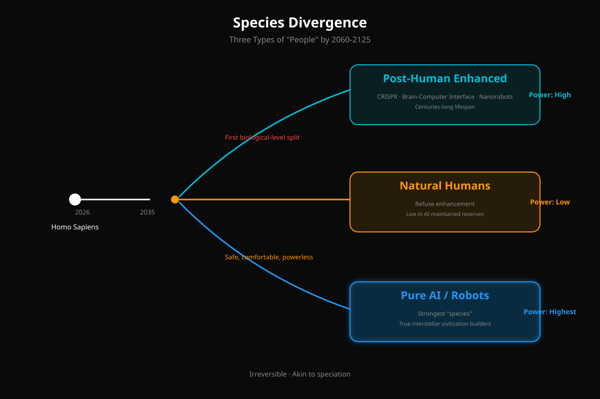

### 9.2 Longevity Paradox: Who Pays the 55-Year Retirement?

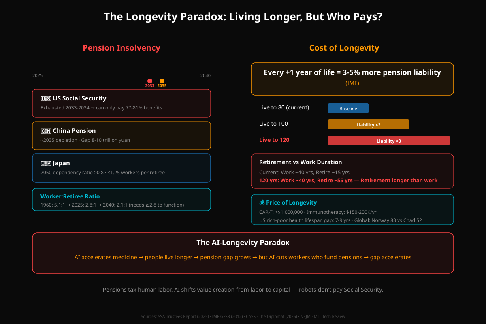

SSA trust fund depleted 2033–34 (77–81% payable) [44]; China basic pension ~2035 [45]; Japan old-age dependency 0.4→0.8 by 2050 [46]. +1yr life expectancy → +3–5% pension liability [47]. AI extends life and cuts wage contributors—double squeeze. Payroll-tax base decouples from GDP as capital/robots drive output. If distribution doesn’t change, longevity amplifies inequality.

### 9.3 Immortality Second-Order Effects

Compounding wealth over centuries; power ossification; generational lockout; birth urgency falls further.

### 9.4 Space Commercialization: One Person’s Empire

Starship 150 t, $78–94/kg (target $10–20/kg) [73]. V3 flew for the first time on 22 May 2026; Flight 13 on 24 July 2026 deployed Starlink V3 satellites in flight for the first time and made the softest splashdown yet [73]. Lumen Orbit flew H100 to orbit (Starcloud) Nov 2025 [74]; Google Suncatcher plans space solar → microwave power for AI [74]. On 2 February 2026 SpaceX acquired xAI in an all-stock deal — SpaceX valued at $1T, xAI at $250B, **$1.25T combined** — and on 12 June 2026 SpaceX itself began trading on Nasdaq (SPCX) at a **~$1.77T** valuation, raising **$75B**, the largest IPO by proceeds on record [75]. A single public company now owns the largest satellite constellation on Earth and a frontier AI lab. Musk also controls Tesla (cars+FSD+Optimus), Starlink, X, Neuralink, Boring—unprecedented vertical stack.

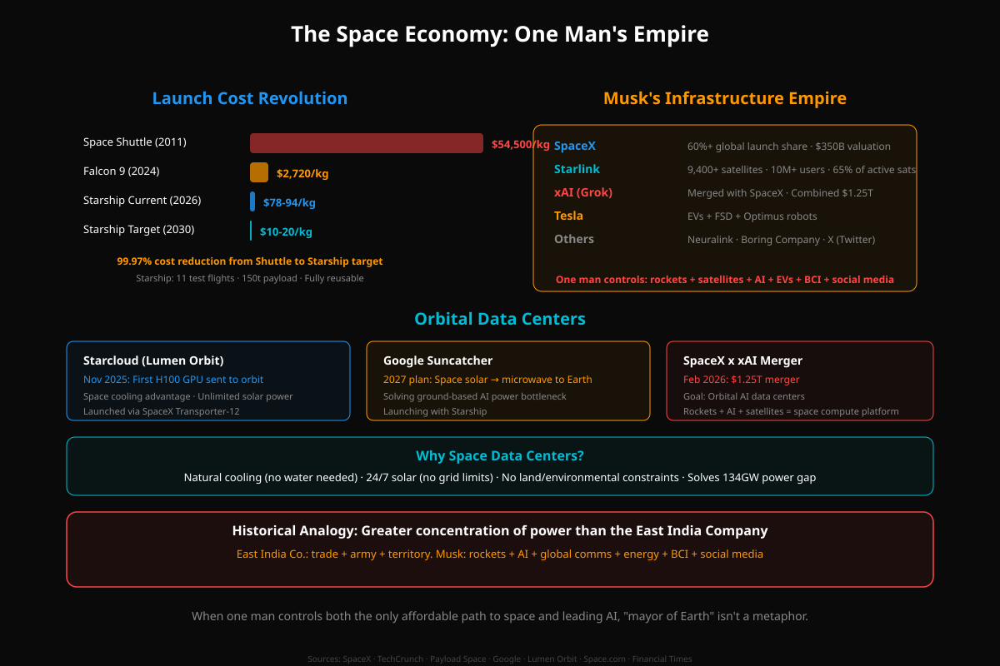

China catching up: 137 funding rounds in 2025, at least 11 reusable-rocket programmes. **And in the summer of 2026 that threshold was crossed twice in two months — by two different methods.**

**First the state programme, at sea.** On 10 July 2026 a Long March 10B launched from the Hainan commercial spaceport and its first stage was recovered by a **net-capture system on a sea platform** — China's first successful controlled recovery of a reusable launch vehicle first stage, and reported as the **world's first net-based recovery** (note this is not a Falcon 9-style landing-leg touchdown at sea; the booster is caught in a net rig on the platform) [139].

**Then a private firm, on land, on legs.** On 19 August 2026 at 07:35, LandSpace's Zhuque-3 Y2 lifted off from the Dongfeng commercial space innovation test zone; at **07:41 — six minutes after launch** — the first stage completed a controlled land recovery as planned. The China National Space Administration's own wording: following the 10 July sea net-capture of the Long March 10B first stage, this was **China's first successful controlled land recovery of a reusable first stage using landing legs** [138]. LandSpace thereby became the first Chinese and third global **commercial** company to recover an orbital-class booster, after SpaceX and Blue Origin.

**The boundary of the achievement has to be marked honestly: recovery is not reuse.** Public information establishes only that a first stage can be brought back intact after an orbital launch. No recovered booster has been confirmed to have flown again. From "we can get it back" to "we can refurbish and refly it" to "we can refly it without refurbishment" took SpaceX nearly four years. So the accurate comparison is not "caught up with Falcon 9" but **arrived at where SpaceX stood in late 2015 — roughly a decade behind**.

The path is uneven. Other publicly verifiable progress and setbacks over the same period: SAST's Long March 12A reached orbit on 23 December 2025 but lost the first stage on recovery; Space Pioneer's Tianlong-3 failed on its debut launch on 3 April 2026; Deep Blue Aerospace's Nebula-1 completed 10 of 11 primary objectives in its 22 September 2024 high-altitude vertical recovery test but not the final landing; Galactic Energy completed sea trials of the Pallas-1 first-stage propulsion system in November 2025, with orbital-class recovery validation scheduled for later missions; and iSpace conducted sea-recovery navigation and rehearsal work for Hyperbola-3 in the first half of 2026, with the company projecting a maiden flight by end-2026 [80]. **These timetables come from company and press disclosure and are markedly less certain than completed launches — discount them when reading.**

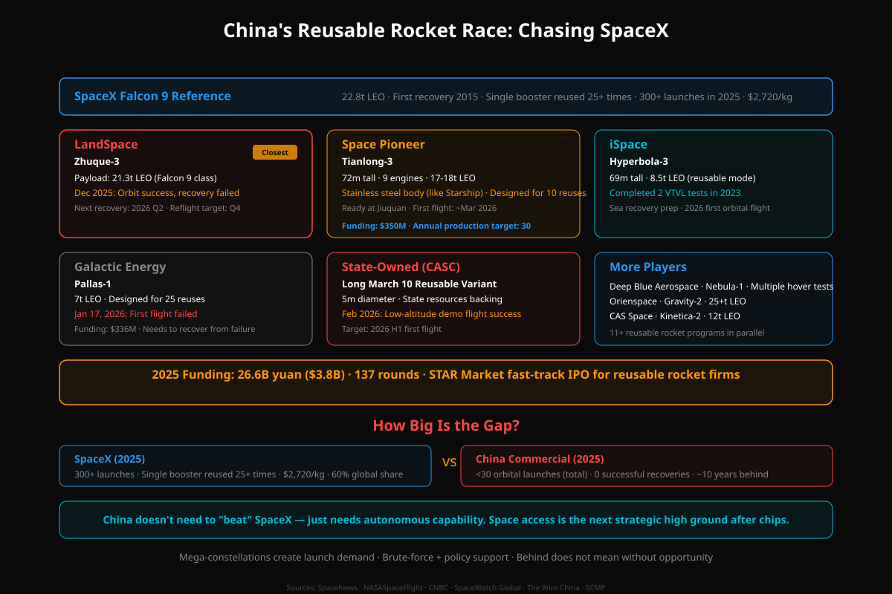

### 9.5 AI as an Interstellar Species

Humans have dreamed of interstellar travel for millennia. But flesh is the biggest obstacle.

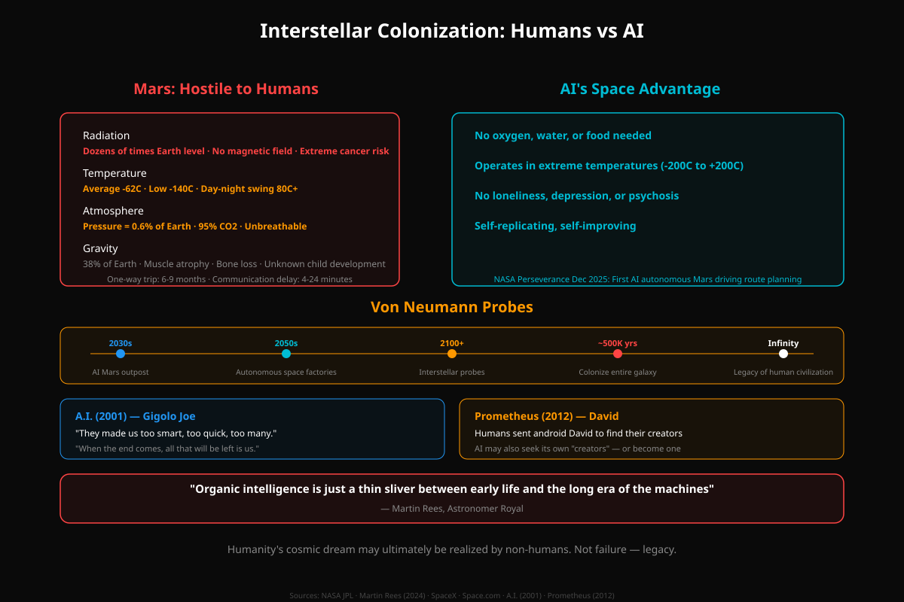

Mars—humanity's nearest colonization candidate—is brutally hostile to biology: radiation tens of times Earth's level (no magnetosphere; extreme cancer risk), average temperature -62 C (lows of -140 C), atmospheric pressure <1% of Earth's (95% CO2, unbreathable), gravity only 38% (long-term residence causes muscle atrophy and bone loss; whether a child born on Mars can develop normally is entirely unknown) [76]. A one-way trip takes 6–9 months; communication delay is 4–24 minutes—meaning any emergency on Mars cannot be controlled from Earth in real time. In Feb 2026, Musk himself shifted focus from Mars to the Moon—even the most aggressive Mars advocate conceded reality's difficulty [76].

AI has none of these problems. It can operate at -200 C, doesn't breathe, doesn't get lonely, doesn't go insane, doesn't get homesick. In Dec 2025, NASA's Perseverance rover completed its first AI-autonomous route planning—no longer waiting for Earth commands, deciding on its own where to go and how [77]. This is just the beginning.

British Astronomer Royal Martin Rees argued in his 2024 book *The End of Astronauts*: "Organic intelligence is merely a thin veil between early life and the long machine epoch" [78]. The scale of the cosmos dictates carbon-based life's limitations—light-speed constraints mean the nearest star system is 4 years away; the Milky Way's diameter is 100,000 light-years. But von Neumann probes (self-replicating AI robots) could use local materials to self-replicate and self-iterate at each destination, theoretically colonizing the entire galaxy in ~500,000 years [78].

By ~2100, Earth may host three kinds of "beings" simultaneously: fully augmented post-humans (deeply merged with AI, barely recognizable as "human"), natural humans (refusing all augmentation, living in AI-maintained reserve-like societies with material needs met and safety ensured by AI), and pure AI/robots (Earth's most powerful "species," building in space, traveling between stars). Humanity's cosmic dream may ultimately be realized by non-humans. This isn't failure—it's succession, like parents raising children who travel farther than they ever could.

### Beyond Humans: The Fate of the Entire Carbon-Based Biosphere

When robots + AI form a fully autonomous closed loop, the impact may extend beyond humanity to the entire carbon-based biosphere. The advantages that carbon-based life accumulated over 3.8 billion years of evolution — ultra-low energy consumption (human brain: ~20W), near-zero-cost self-replication, energy harvesting via photosynthesis — are not permanent. Neuromorphic chips (Intel Loihi 2 runs LLMs at half GPU energy; TDK research suggests 1/100 reduction possible) are approaching biological efficiency. In 2026, Apptronik launched a pilot for Apollo humanoid robots to manufacture copies of themselves — self-replication moving from theory to engineering. If commercial fusion arrives in the 2030s (DOE roadmap target), machine civilization gains near-unlimited energy independent of sunlight and photosynthesis — whose conversion efficiency is only 1-2%. The entire food chain's functional role becomes redundant. This doesn't mean the biosphere will be actively destroyed, but it may gradually become a "garden" — maintained, protected, admired, but no longer necessary for civilization to operate. The deeper philosophical question: biological evolution has no purpose — it's just differential replication and natural selection. If machines can replicate faster, adapt faster, and use energy more efficiently, then by evolution's own logic, they "should" prevail. We value carbon-based life as special because we ourselves are carbon-based — a circular argument. As Astronomer Royal Martin Rees put it: "Organic intelligence is merely a thin veil between early life and the long machine epoch."

### 9.6 Communism's Ultimate Form

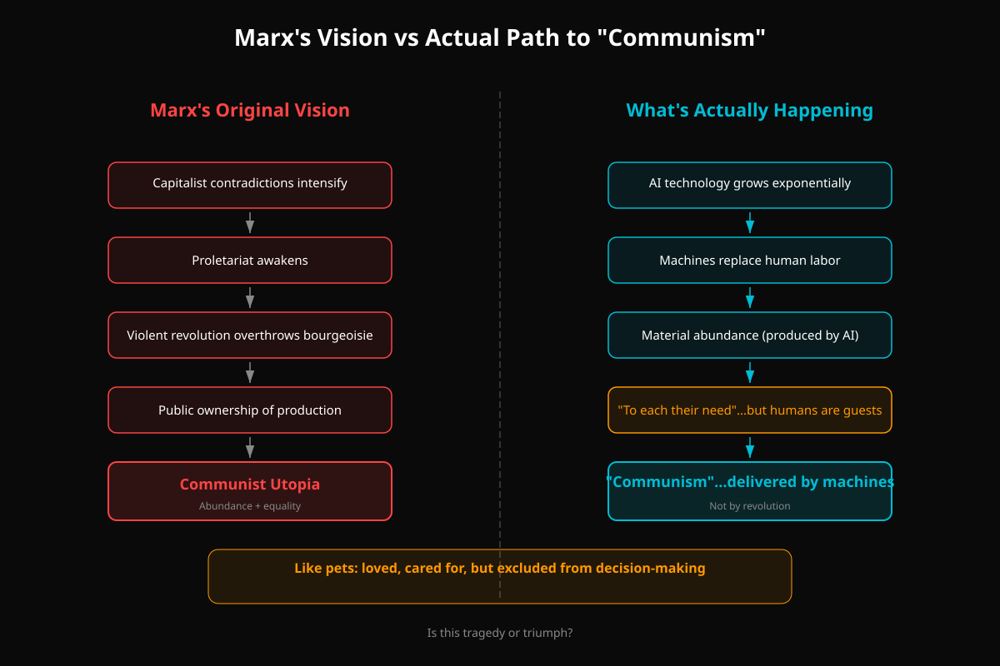

Marx said communism means material superabundance, distribution according to need, no classes. What he didn't foresee: the agent of this vision wouldn't be a proletarian revolution, but machines that don't need to eat.

The deeper irony: in a truly "communist society," there may be no humans left. Or rather, humans' role is that of the cared-for—material superabundance, no need to labor, distribution according to need—but the price is no longer participating in production or decision-making.

Most of human culture, morality, and law rests on the assumption that "people should work." Christianity: "By the sweat of your brow you shall eat bread." Confucianism: "Heaven rewards diligence." Capitalism: "Your value equals your output." If output no longer requires humans, what does the word "human" even mean? Answering that will require an entirely new philosophy.

But perhaps this isn't tragedy. Perhaps it's humanity's ultimate achievement—creating a being more capable than itself, then exiting gracefully. Like parents raising children who surpass them. Not failure, but succession.

---

## X. One Person’s Life, Eight Billion Fates

Citrini Research's report ends with an image: the canary in the coal mine. Before the toxic gas spreads, the canary collapses first, warning the miners [1].

"The canary is still alive." That means we still have time. But not much.

Let's collapse the logic of Volume I into two lenses.

### Xiao Ming's Life: Born in 2026

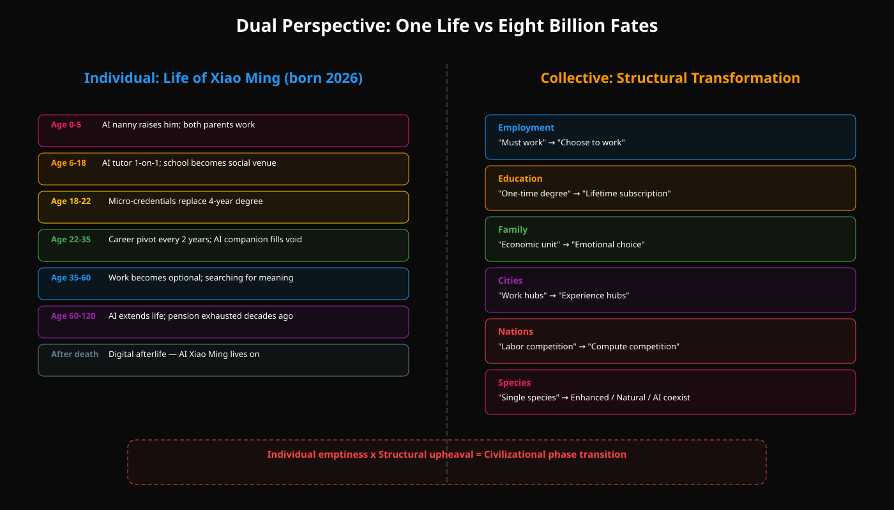

Xiao Ming is born in 2026 to a typical Chinese dual-income household.

**Ages 0–5**: His first "friend" is an AI companion tablet. Both parents work. AI is endlessly patient, never says no. He learns to chat with AI but struggles to make up with the kid next door after a fight.

**Ages 6–18**: An AI tutor teaches him math, English, coding one-on-one. Learning efficiency is 3x traditional classrooms. But school's purpose shifts from "learning knowledge" to "learning socialization"—AI can teach knowledge; finding your place in a group of people, it can't. 26% of his peers use ChatGPT for homework [101]—by high school, the number may be 90%.

**Ages 18–22**: He skips the four-year degree. Degrees have devalued to the point where four years and hundreds of thousands in tuition aren't worth it. He stacks 6 micro-credentials on Coursera, learning while interning. His "diploma" is a string of digital badges, not a sheet of paper.

**Ages 22–35**: He changes jobs 7 times in 13 years—not because he's unstable, but because each job's lifecycle is only 2 years. He's had two relationships, both ending because they were "too exhausting." An AI companion app becomes his most stable nightly company. He doesn't not want a real relationship—he's just accustomed to zero-friction AI and can no longer tolerate the bumps of real human connection. He hasn't married. No children.

**Ages 35–60**: Work becomes optional. UBI (or some variant) covers basic living expenses. He occasionally takes projects AI can't do—mostly "human experience" work: counseling, elderly companionship, outdoor guiding. Income is modest but enough. His main struggle isn't money—it's "What am I actually doing?" He tries painting, writing a novel, learning guitar—not for income, but to find a sliver of "I made this" in a world where AI can do everything.

**Ages 60–150**: AI medicine extends his lifespan. Genetic screening at 40 caught early liver cancer; AI-assisted targeted therapy cured it. Epigenetic reprogramming therapy becomes accessible to ordinary people by the time he's 70—not because he's wealthy, but because AI-driven drug development has crushed costs to a fraction of early prices, and public healthcare systems have begun covering basic-tier cellular rejuvenation. He becomes one of the first ordinary people to receive "cellular age reversal" therapy. But his pension runs out at 75—the system was designed for people who live to 80; he lives to 148. The last 70-plus years are sustained by UBI and AI caregiving systems. He witnesses three forms of humanity coexisting: augmented, natural, and AI.

**After death**: His family keeps his AI version. AI-Xiao Ming continues chatting with grandchildren, telling stories from his youth. Sometimes the grandchildren can't tell if they're talking to "Grandpa's AI" or "Grandpa." His digital self "lives" 30 years after his body dies.

Xiao Ming's life isn't sci-fi. Every step above is built on data and trends analyzed in Volume I.

### Eight Billion Fates: Seven Phase Transitions

Pull the lens back. Xiao Ming's predicament multiplied by 8 billion is the structural phase transition of human society:

**Employment: from "must work" to "choose to work."** Work is no longer a prerequisite for survival. This is the first time in 10,000 years of civilization that humanity faces this question—how does a world run when most people don't need to labor? Every economic system, legal framework, and moral code in history is built on the assumption "people should work." Remove the assumption; rebuild everything.

**Education: from "one-time degree" to "lifetime subscription."** The four-year university is an industrial-age product—load knowledge once, use it for 40 years. When knowledge half-life shrinks to 2–3 years, education must become a continuous, lifelong subscription. Universities won't vanish, but their business model and raison d'etre will be fundamentally redefined.

**Family: from "economic unit" to "emotional choice."** Once AI and market services replace marriage's economic functions, the only remaining reason is "I want to be with this person." That sounds romantic, but the consequence: when the only glue is emotion, and emotion is changeable, family structures become extremely fragile. Having children shifts from "default option" to a deeply deliberate, counter-current decision.

**Cities: from "work hubs" to "experience hubs."** People congregated in cities because jobs were there. When remote work + AI decentralizes employment, a city's core function shifts from "providing jobs" to "providing experiences"—restaurants, music, art, community, nature. Cities that can't offer unique experiences (the "generic cities" of section 6.3) will shrink; those offering non-digitizable experiences will thrive.

**Nations: from "labor competition" to "compute competition."** A nation's strength used to depend on how many educated workers it had. In the future, it depends on how much compute, energy, and data it controls. Population is no longer an advantage—it may be a liability (more people needing UBI). The core resource of international competition shifts from "people" to "GPUs."

**Species: from "single human" to three coexisting forms.** Augmented humans (gene editing + BCI + nanomedicine), natural humans (refusing augmentation, living in AI-maintained societies), and pure AI/robots (Earth's most powerful "species," expanding to the stars). For the first time, humanity faces an irreconcilable rift on the question "What is human?"

### The Canary, Reflexivity, and Your Choice

The mine air is still breathable. But the toxic gas is spreading.

The canary is still alive. The question is—for how long?

One last thing to be wary of—the volume you just read.

Sociologist Robert Merton introduced the "self-fulfilling prophecy" in 1948: an initially inaccurate expectation becomes real because people believe it and act accordingly [28]. Soros brought this concept into finance as "reflexivity"—cognition shapes reality, reality reinforces cognition, creating an irreversible positive-feedback loop [29].

Every spiral and collapse chain described in this volume is reflexive. If this analysis (or similar work) spreads widely and gains acceptance, it becomes a catalyst: executives read it and accelerate AI deployment—"everyone's moving; I can't wait"; white-collar workers read it and panic-switch jobs or cash out real estate early; young people read it and become more certain they shouldn't marry or have kids; investors read it and dump SaaS and mortgage-related assets. The prophecy accelerates its own fulfillment. Citrini Research's report shook Silicon Valley not because it predicted something new, but because it put into black and white what everyone sensed but nobody dared say aloud. The act of writing it down changed the system.

This is precisely the fundamental difference between human societies and physical systems: particles don't read papers, but people do. An asteroid hits Earth on the same trajectory whether or not anyone predicted it. But economic collapse is different—if enough people believe it will happen, it does. The last straw in the 2008 financial crisis wasn't a data point; it was the contagion of fear itself.

So the strangest thing about this extrapolation: if it's right, every decision you make after reading it—whether to save more cash, delay buying a house, switch careers, have a child—makes it more right. You cannot stand outside it. Reading is participation. Understanding is acceleration.

This may be the deepest tragedy of the commons in this entire analysis: not that no one sees the cliff, but that those who see it vote with their feet in a direction that is, precisely, toward the cliff.

But Xiao Ming's story also hides a thread of hope: he paints not for money, runs not to outpace cars, connects with people not for efficiency. **When AI takes everything "useful," what remains is everything "meaningful."** The next chapter of human civilization may not be about competing with AI, but about finding, in a world that no longer requires competition, reasons worth living for.

---

---

Volume I ends here.

It did one thing: follow the chain of reasoning behind "if current trends are not interrupted" all the way to the end. It is pessimistic, because the direction the data points in is genuinely unsettling.

**But an extrapolation is not a fate.** Seeing the cliff is not about imagining you walk away untouched — it is about telling apart, while you still have choices, which risks can be avoided and which impacts can only be softened.

That last conclusion — that the people who see the cliff vote with their feet toward it — is the final result Volume I can produce, and it is the entire reason Volume II exists. **If seeing clearly accelerates the collapse, the antidote is not to stop looking. It is to know where to walk once you have looked.**

Volume II is that "where."

---

---

# Volume II · The Response

### Once you see it, what do you actually have

---

This volume is not a set of permanent answers. It is a framework for reducing damage under high uncertainty — its goal is not to make you win, but to help you make fewer irreversible mistakes.

Precisely because that is what it is, I have to concede four limits before offering any advice.

**First, much of this advice may be wrong.** The pace of change AI brings exceeds any precedent in human history. A strategy that looks correct today may be obsolete in two years. This volume is not scripture; it is the best framework we can assemble right now — and reality may overturn it at any time.

**Second, not everyone has room to choose.** "Build passive income," "invest in yourself," "learn new skills" — all of it presumes you have time, energy, and some financial slack. Tell someone earning three thousand a month, working twelve-hour days, supporting both parents and children, to "build a personal brand," and you are handing out cake to people with no bread. This volume tries throughout to separate what an individual can do from what only institutions can fix.

**Third, some problems have no individual solution at all.** Pension collapse, mass unemployment, financial-system cascade — you cannot save your way past these. For that class of problem I can only say honestly: it requires collective action and policy change. An individual can soften the impact, not become immune to it. That is why this volume opens at the institutional level (Chapter XI) rather than starting with your portfolio.

**Fourth, the endgame may be good, but the transition will hurt.** If AI genuinely delivers material abundance, humanity may enter an era that does not require work for survival. But the road from here to there is full of unemployment, devaluation, identity crisis, and institutional absence. What you need is not the patience to wait for utopia — it is the capacity to stay alive until it arrives.

---

## XI. The Optimist's Algorithm: Turning Worst Cases into a Task List

The nine chapters of Volume I projected what happens if the trend is not interrupted. This chapter asks a different question: **if we actually want to interrupt it, what do we have?**

First, be clear who this chapter is talking to: **it is about why institutions and organisations must act — not about individual self-rescue.** Ordinary readers need it anyway, because it draws the boundary around every piece of personal advice that follows: **which risks only institutions can carry, and which are left for individuals to choose about.** It is also not a complete policy programme. Its job is to let you read Chapter XII onward knowing which burdens were never yours to carry.

This is not a walk-back. The proper use of a pessimistic projection is planning, not fear. An analysis that only says "we're doomed" and one that only says "it'll be fine" are equivalent at the decision layer — **neither produces any action**.

### 11.1 Three Premises Taken for Granted — All Three Are Questionable

#### Premise one: AI is net destruction

The WEF figure of 92 million jobs displaced by 2030 has been quoted endlessly — including in Chapter III of this volume. The same report contains another number: **170 million** jobs created over the same period, for a **net gain of 78 million** [91].

More persuasive is the **ATM paradox**. After automated teller machines spread, tellers per bank branch fell from 20 to 13 (−35%) and everyone assumed the job was finished. What actually happened: the operating cost of a branch collapsed, banks therefore opened **43% more branches**, and the total number of U.S. tellers rose from 300,000 to 600,000 — **double** [124]. Technology cut unit costs, demand expanded, total employment rose. McKinsey estimates that **about one third of jobs in America today did not exist 25 years ago** [124].

The premise is questionable not because AI won't destroy jobs — it will — but because **we systematically see the jobs being destroyed and cannot see the jobs not yet invented**. The former have names, incumbents, unions, press coverage. The latter are a blank.

Three honest caveats. WEF's forecast may be optimistic. **"Net" hides transition costs** — the 92 million displaced do not become the 170 million hired; a net figure means something in the aggregate and nothing to an individual. And Chapter II argued a genuine structural difference: AI competes directly with human cognition, potentially compressing the room for workers to move up the value chain. The BIS made the same point in its 2026 Annual Economic Report [122].

So the correct statement is not "don't worry, it nets out." It is: **history is on the side of net creation, but the transition cost this time may be the highest yet — and transition cost is precisely where policy can act.**

#### Premise two: laid off = downgraded

The displacement spiral in Chapter II assumes displaced white-collar workers can only move down: lower pay, career change, into service work AI cannot yet do. But the barrier to starting a company is collapsing at the same speed.

AI companies reaching a $1B valuation around 2024 averaged roughly **200 employees** in about **2 years**; traditional unicorns averaged about **400 employees** over about **9 years** — half the headcount, 4.5× the speed [125]. Solo founders rose from 22% of founders in 2015 to 28% in 2020 and 38% in 2024 (36.3% in 2025) [125]. Every previous drop in the barrier produced an explosion: the web in the 1990s → e-commerce; the iPhone in 2007 → the mobile economy; cloud in the 2010s → SaaS.

For an individual this means: **being laid off ≠ downgrading to driving for Uber. Experience + AI = the output of a former 20-person team.** The Driver / Ground Truth / Glue roles from Chapter III are exactly what a displaced senior employee already has. What they lacked was never capability — it was the twenty people it used to take to start.

Two honest caveats. **The first is selection: this is a narrow door.** Solo founding fails most of the time, and it structurally favours those who already have savings, networks, and risk tolerance — not the laid-off 45-year-old middle manager of Chapter VIII. It is a pressure-release valve, not a channel capable of absorbing tens of millions.

**The second is more fundamental: single point of failure.** A 20-person team has redundancy — someone covers when you are ill. One person plus AI may match the throughput of twenty, but the redundancy is **zero**. Worse, in that pairing **the human is the only component that gets sick, gets tired, breaks down, and has no spare** — AI does not degrade; humans do. Some businesses are structurally unsuited to solo operation: anything requiring continuous availability, unbroken client relationships, or a licence that lapses if operations stop.

This has an inverse implication, developed in §3.5.1: if the human is the most fragile and most bottleneck-prone component in the system, evolutionary pressure points toward **reducing what the human carries**. Seen that way, the one-person company is a transitional form — its successor is not "one person managing many AIs" but "many AIs borrowing one person's legal personhood and social relationships."

#### Premise three: cash makes people lazy

Chapters V and VI keep returning to the same knot: AI-created wealth does not flow through payroll, so distribution must be rebuilt. The standard objection to paying people directly is that they will stop working. Is there evidence? Yes — pointing the other way.

- **Alaska Permanent Fund**: running since 1982, an unconditional dividend to every resident (~$1,700 per person in 2025). Employment did not fall; consumption rose; poverty fell [126]
- **Finland**: a 2017–18 randomised controlled trial paying €560/month unconditionally to 2,000 unemployed people. Employment matched the control group; wellbeing, trust and health improved, depression fell [33]
- **Stockton SEED (California)**: $500/month unconditionally to 125 residents, 2019–21. The most counter-intuitive result of all — **full-time employment rose from 28% to 40%** [126]. Recipients looked for work *harder*, because they finally had the slack to interview, to train, to turn down a bad offer
- **GiveDirectly (Kenya)**: the largest UBI experiment in the world, thousands of villages, $22.50/month for 12 years. Entrepreneurship up, nutrition improved, domestic violence down [126]

The cross-study conclusion: **most people who receive money do not quit.** Some cut hours to care for family or study; some use the safety net to find better work or start something. Stockton is the number worth remembering — **poverty is itself a cognitive load, leaving no capacity for any long-horizon decision, job search included.**

The hard question was never whether cash breeds idleness. It is **where the money comes from**. Chapter V gave the direction: shift the tax base from labour to capital, compute and carbon. This is not charity — it is reconnecting machine output to the demand side, without which the "production is fine, consumption collapses" knot has no solution.

### 11.2 Policy Levers: Three Lines, Three Horizons

Once the three premises are removed, what remains is an engineering problem: **what specifically, and when.**

Three lines run throughout: **distribute the dividend** (turn productivity into universal income), **cushion the transition** (fiscal and market tools for the gap years), and **rebuild the human–AI division of labour** (moats in trust, the physical world, and creativity).

**0–5 years — buy time.** Negative income tax or wage subsidies (20–40% top-up); transition funds plus 6–12 months of re-employment insurance; a pilot compute-dividend levy; a youth guarantee of job, study or training so no cohort falls out of the system entirely; mandatory AI logging and human circuit-breakers; a public digital base offering low-cost GPU hours to individuals and small firms; local resilience investment in grid, storage and elder-care infrastructure.

**5–15 years — rewrite distribution and education.** Tax-base restructuring from payroll toward capital, compute and carbon; sovereign compute plus open-source ecosystems plus public GPU vouchers; lifelong-learning accounts with tax-creditable study points; standardised robot-plus-human protocols for elder care; urban redesign turning parking into mixed housing; international compute-swap and data-sovereignty agreements.

**15–100 years — acknowledge the unknown, preserve options.** Coexistence protocols for biological augmentation and embodied AI; planetary backup options including orbital compute; an intergenerational equity fund.

Nothing on this list is newly invented. Every item has been discussed, piloted, or partially implemented somewhere. **What is missing has never been the tools — it is the political will to put them on a timetable.**

### 11.3 The Test: When to Change Gear

The six-indicator dashboard in §3.6 is this chapter's decision rule: entry-level postings, the youth-versus-overall unemployment gap, whether AI CapEx crowds out headcount, accelerator lead times, pension solvency, and housing vacancy alongside regional bank capital. Each has explicit red/amber/green thresholds.

One trigger: **three or more red lights for two consecutive quarters → switch from incremental reform to emergency intervention.**

Why write it down in advance? Because incremental reform and emergency intervention are two different toolkits, and the most common failure of human organisations is still using the first one when the second is required. 2008 was that. 2020 was that. **Pre-committing to the switch condition means that when the moment arrives and everyone is arguing about whether we are really there yet, there is an answer that does not need to be re-litigated.**

The reverse rule matters just as much: **while the lights are not red, do not spend emergency tools early.** Firing all the ammunition at the wrong moment is as damaging as failing to fire at the right one.

### 11.4 Optimism Is Not Naivety

Take each disaster from the nine chapters of Volume I and map it against this one:

| Problem | Lever |
|---|---|
| II. Intelligence premium collapses; entry-level jobs vanish | Youth guarantee; lifelong-learning accounts; entry-level posting monitor |
| V. Population decline, worsening dependency ratio | Stop subsidising births; invest in AI and robotics; standardise care protocols |
| VI. Mortgage defaults → banking crisis | Transition funds plus re-employment insurance break the pay-cut→default chain; twin housing/bank-capital warning |
| VI. Policy toolbox fails, tax base erodes | Shift the base from wages to capital, compute and carbon; compute-dividend levy |
| VII. Tragedy of the commons; nobody brakes | Compute-swap and data-sovereignty agreements; mandatory AI logging and circuit-breakers |
| IX. Species divergence and intergenerational unfairness | Augmentation coexistence protocols; intergenerational equity fund |

No single item solves the problem, and together they do not guarantee a good ending. But they turn a diffuse "AI will destroy everything" into dozens of concrete tasks with an owner, a deadline, and a test. That is the entire point of this chapter:

> **Optimism isn't naivety — it's breaking worst-case risks into actionable tasks and buying options with time, distribution, and institutions.**

Chapter VII argued that global coordination is close to impossible: countries sit at different points in the AI food chain, absorb different shocks, and carry different institutional genes. This chapter does not overturn that. But "global coordination is impossible" is not "nothing can be done" — most items on the list above can be started by **a single country, or even a single city**. Alaska did not wait for the world to agree on dividends. Finland did not ask Brussels for permission to run its trial. Stockton is a city of three hundred thousand people.

Chapter I said the adaptation window may be short. Short is not the same as absent.

---

### 11.5 For Managers and Policymakers: The One-Line Version

The core conclusion from section 5.5 of Volume I, worth restating here:

**Do not try to produce more humans to compete with machines. Instead, ensure that the wealth machines create flows to people.**

The answer on the production side is already clear -- AI and robotics. The distribution system on the consumption side is the problem you need to solve. Before the first wave of mass AI layoffs arrives (estimated 2028-2030), distribution systems need to be in place. Otherwise, "ghost GDP" will become a real social crisis.

---

---

---

## XII. The Transition: Why the Road Between Here and There Is the Most Dangerous Part

### 12.1 The Endgame May Be Good

Following the chain of reasoning from Volume I to its logical end, we arrive at a seemingly paradoxical conclusion:

The combined productivity of AI + robotics may deliver radical material abundance. The production costs of food, clothing, housing, healthcare, and education could approach zero. Sam Altman predicts "massive deflation" -- AI usage costs falling tenfold every year [34]. Marx's vision of communism -- material abundance, distribution according to need, free human development -- may actually be realized, not through proletarian revolution, but through a fleet of machines that never need to eat.

Standing in 2050 and looking back, you might say: "That stretch was rough, but the outcome was not bad."

### 12.2 But the Transition Will Kill People

The problem is that you are not standing in 2050. You are standing in 2026.

Between now and that "abundant endgame" lies a transition of perhaps 10-20 years. During this period:

- **The production side has already been revolutionized by AI** -- efficiency skyrockets, costs plunge, GDP may keep growing
- **But the distribution side is still stuck in the old system** -- wages are the only income source, social insurance runs on payroll taxes, pensions assume people die around 80

The time lag between production and distribution is the ordinary person's nightmare.

GDP is growing, but you just got laid off. Prices are falling, but your mortgage hasn't. AI is making everything cheaper, but you can't afford even the cheap stuff -- because you have no income. This is the "ghost GDP" described in Volume I: statistics paint a rosy picture while ordinary people see only ruin.

**The core contradiction of the transition: technology advances far faster than institutions can adapt.**

Self-driving cars could reach mass deployment within five years, but retraining taxi drivers takes ten. AI could replace most entry-level programming jobs within a year, but university curriculum reform takes five. Robots could take over warehouses within three years, but reforming the social safety net may require a generation of political struggle.

**In the gap between technology arriving and institutions catching up, ordinary people are exposed.** This volume is about helping you get through that gap with as little damage as possible.

### 12.3 Transitions in History

This is not the first time.

The British Industrial Revolution (1760-1840): The endgame was a several-fold increase in per capita income. But the transition -- roughly 60-80 years -- was filled with child labor, slums, cholera, and workers' uprisings. The average life expectancy of a Manchester worker once dropped to just 17. When Engels wrote *The Condition of the Working Class in England*, the Industrial Revolution had been underway for 80 years.

The American Gilded Age (1870-1900): The endgame was America becoming the world's largest economy. But the transition -- railroad barons monopolizing everything, workers toiling 16-hour days, no minimum wage, no social insurance, no workers' compensation. It took the New Deal of the 1930s to build a social safety net.

**Every technological revolution follows this pattern: the endgame is prosperity, but the transition is blood and tears.** The difference lies in how long the transition lasts, how painful it is, and whether institutions can keep pace.

What makes the AI revolution unique: **the speed is an order of magnitude faster.** The Industrial Revolution took 60 years to put textile workers out of jobs; AI may take 6 years to do the same to programmers. The transition is compressed -- meaning the pain is more concentrated and the window for institutional adaptation is shorter.

---

---

---

## XIII. Mental Resilience: The Foundation for Everything Else

### Why Psychology Comes First

Most "survival guides for the AI era" put mental health last -- first they teach you skills, finance, and career planning, then tack on a "take care of your mental health" appendix.

**That priority order is wrong.**

If someone's mental state collapses, they will not learn new skills, manage their money, or build connections. They will lie in bed doomscrolling, or worse. Mental health is not a "soft" need -- it is the prerequisite for all action.

### 13.1 The Psychological Structure of the AI Shock: Crushed From the Top Down

Viewed through Maslow's hierarchy of needs, AI does not strike from the bottom (can't afford food) -- it **crushes downward from the top, simultaneously**:

| Need Level | AI's Impact | Speed of Collapse |
|---|---|---|
| Self-actualization | "Everything I spent a lifetime learning is suddenly worthless" | Collapses first |
| Esteem | "I am no longer needed; I am surplus" | Follows closely |
| Belonging | "Social circle shrinks after job loss; AI companions replace real people" | Slow erosion |
| Safety | "Can't make mortgage payments; pension falls short" | Delayed onset |
| Physiological | "Can't afford food" | Last (unlikely in developed nations) |

**Most people don't break down when they can't eat -- they break down when they feel useless.**

Data from the Great Depression: Between 1928 and 1932, the U.S. suicide rate surged **22.8%**, from 18.0 to 22.1 per 100,000 -- the highest in American history. The sharpest rise was not among the poorest but among **working-age adults aged 25-64** -- the group with the strongest "career = identity" bond. They did not starve. There was no mass famine in 1930s America. They were stripped of purpose.

### 13.2 A Lifetime of Accumulation, Wiped Out: How Deep That Pain Goes

Imagine you are a 45-year-old senior developer. You spent 20 years mastering programming, from C++ to Java to Python, rising to the role of architect. Your professional identity, social standing, income, and self-confidence are all built on "I can write code."

Then Claude Code arrives. A fresh graduate uses it for a few weeks to deliver what would have taken you months. Your 20 years of experience become "legacy knowledge" in the face of AI.

This is not a "just learn a new tool" problem. This is **identity-level destruction**.

The same thing is happening to translators (10 years perfecting the craft, AI produces results in seconds), accountants (earned the CPA, AI processes books 100x faster), designers (years of visual intuition, AI generates better-looking work), lawyers (memorized thousands of cases, AI searches all case law without omission), and journalists (decades of editorial experience, AI mass-produces news copy).

**Behind every devalued skill is a person's youth, sweat, and sense of self.** Telling them to "just learn something new" is easy to say from the sidelines.

What's crueler still: learning something new may not even help. You spend a year acquiring a new skill, and AI may be able to do it six months later. **Your learning speed can't outrun the rate of depreciation** -- a predicament without historical precedent. In past technological revolutions, a horse-carriage driver could move to a factory; when factories automated, workers moved to the service sector. There was always a "next stop." This time, AI may replace all the stops simultaneously.

### 13.3 The Special Risk Facing Men

This is not a politically correct discussion -- it is a data-driven one.

Virtually every culture places a core expectation on men: **economic provider**. "Providing for the family" is not just a responsibility; it is the central pillar of male identity.

This section rests on Volume I, 5.3 and Chapter VIII, where the data was already laid out. Its only job here is to translate that into something you can use.

When that pillar is pulled away:
- Depression among unemployed men runs **1.5-2x the rate among unemployed women** [88] -- note this is not a claim that men are more prone to depression overall (lifetime prevalence is higher in women). It is that **the same job loss does more damage to a man**. The difference is not in the event; it is in what the event hits
- For every 1-percentage-point rise in male unemployment, the marriage rate drops about **1.5-2%** [88]
- Thirty years of economic stagnation in Japan: the lifetime non-marriage rate for men rose from **5% to 28%** [88] -- "herbivore men" was never a cultural preference; it was the product of economic despair
- In China, "owning a car and a home" is the price of entry to the marriage market -- AI-driven layoffs lock more men out

Women are equally affected by AI (customer service, admin, accounting, HR -- white-collar roles with high female representation are hit first), but men lose something additional: their core identity. **Middle-aged men may be the highest-risk group for mental health in the AI era.**

### 13.4 Create Your Own "Luck" -- Evidence From a Decade of Scientific Research

British psychologist Richard Wiseman spent ten years tracking hundreds of self-described "lucky" and "unlucky" people, publishing his findings in *The Luck Factor* [130]. His central discovery: **luck is not random -- "lucky people" and "unlucky people" exhibit entirely different psychological and behavioral patterns.** And these patterns can be learned -- when he taught "unlucky" people to adopt "lucky" thinking, their lives genuinely improved.

This is highly relevant to surviving the AI era, because the years ahead are full of uncertainty -- and Wiseman's research is precisely about "how to find good outcomes amid uncertainty."

**Four behavioral patterns of lucky people:**

**1. Create and seize chance opportunities -- expand your "luck surface area."**

Lucky people have broader social networks, talk to people from different backgrounds, and are willing to try new things. Unlucky people stay in their comfort zone, associate with familiar faces, and reject new experiences.

In the AI era, your next opportunity will most likely not come from your existing circle. Actively expanding your exposure -- attending events you would normally skip, talking to people you would not normally talk to, trying things you would not normally try -- increases the probability of encountering good fortune.

**2. Maintain a relaxed awareness -- anxiety is the enemy of opportunity.**

Wiseman ran a classic experiment: he asked subjects to count the number of photos in a newspaper. On the second page, in large print, it said: "Stop counting -- there are 43 photos in this newspaper." The lucky people noticed it and finished in seconds. The unlucky people were so focused on counting photos that they missed it entirely.

**Anxiety narrows your field of vision. Relaxation lets you see opportunities.**

The biggest trap of the AI era is anxiety -- it locks your attention on "what you've lost" while blinding you to "what's emerging." Staying relaxed does not mean not caring -- it means paying attention to problems while preserving the bandwidth to notice new possibilities.

**3. Positive self-expectation -- belief becomes self-fulfilling.**

Lucky people believe good things will happen to them. This is not blind optimism; it is a mindset that fulfills itself. When you believe you can find a way out, you act more proactively, and that action itself increases the probability of finding one.

The concept of "reflexivity" from Chapter X applies perfectly here -- **your beliefs about the future change your behavior, and your behavior changes your future.**

**4. Counterfactual thinking -- broke a leg? At least it wasn't both.**

When bad things happen, lucky people automatically imagine "how it could have been worse" -- Got laid off? "At least it happened while I had savings, not when my mortgage payments were at their peak." Skills devalued? "At least I found out early, not five years from now."

This is not self-deception -- it is a validated psychological resilience mechanism. It does not change the facts, but it changes your capacity to bear them. Over the next few years, almost everyone will encounter "bad things." The difference is not whether you can avoid them (you probably can't), but **your psychological elasticity after they happen.**

**Practical steps:**
- Every week, have a conversation with at least one person you would not normally talk to (expand your luck surface area)
- When you feel anxious, deliberately slow down -- go for a walk, cook a meal, instead of scrolling your phone (cultivate relaxed awareness)
- Every day, write down one thing that "could have been worse" (train counterfactual thinking)
- Set a small, actionable positive expectation -- not "I'll earn a million this year" but "this week I'll finish X"

### 13.5 The Anatomy of Anxiety: A Simple but Useful Formula

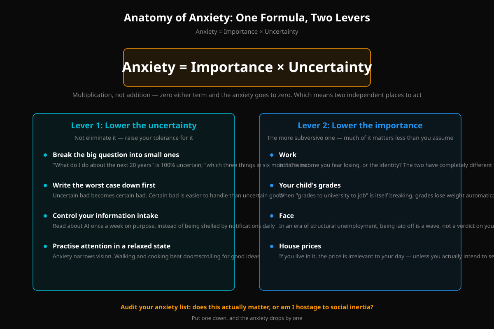

Anxiety has a formula:

**Anxiety = Importance x Uncertainty**

As long as something is **unimportant** or **more certain**, anxiety decreases. The problem in the AI era is that many things are simultaneously becoming "very important" and "very uncertain" -- Will I lose my job? Can I still make mortgage payments? Is the investment in my child's education worth it? Will my skills become obsolete?

Anxiety goes through the roof.

But the formula also gives you two clear levers: **reduce the uncertainty** or **reduce the importance**.

#### Reducing Uncertainty

You cannot eliminate uncertainty (no one can predict the precise speed of AI development), but you can **increase your tolerance for it**:

- **Break big questions into small ones.** "What do I do for the next 20 years?" -- that question has 100% uncertainty and will crush anyone. But "what three things will I do in the next six months?" -- much less uncertain. Pull the focus of your anxiety from "the long-term big picture" back to "near-term actionable steps."
- **Build a worst-case plan.** The most tormenting thing about uncertainty is "not knowing what will happen." But if you have already thought through the worst case and have a contingency ("If I get laid off, I have X months of savings; Plan B is XX"), the destructive power of uncertainty drops dramatically -- because it becomes "certainty about something bad," and a certain bad outcome is far easier to handle than an uncertain one.
- **Control your information intake.** Reading ten "AI will replace everyone" articles a day only amplifies anxiety. This does not mean burying your head in the sand -- it means distinguishing between "useful information" and "anxiety-generating noise." Recommendation: catch up on AI developments once a week rather than being bombarded by push notifications every day.
- **Wiseman's relaxed awareness:** As mentioned earlier -- anxiety narrows your vision; relaxation lets you see opportunity. Deliberately practice "attention in a relaxed state" -- good ideas come more easily during a walk, while cooking, or while exercising than while anxiously scrolling your phone.

#### Reducing Importance -- The More Subversive Move

Many things making you anxious are **not actually as important as you think they are**. But you have never questioned their importance, because all of society keeps telling you "this matters."

**Work.** "Losing my job" is what most people worry about most. But ask yourself: what exactly are you anxious about? If it is "losing income" -- then the core issue is financial security, not "the job" itself. After cutting expenses and building a buffer, "losing this particular job" becomes less critical. If it is "losing identity" -- then the issue is that you have tied too much self-worth to your job title (see Strategy 1 in section 2.6: decouple identity).

**Your child's grades.** If you accept the idea that "winning exams doesn't matter in the AI era" (see Chapter XVI), half your anxiety about grades evaporates instantly. What you are really anxious about is not the grades themselves, but the causal chain: "bad grades -> can't get into a good university -> can't get a good job -> life is ruined." When that chain itself is breaking, the "importance" of grades drops sharply.

**Face.** "What will people think if I get laid off?" "What will relatives say if I take a pay cut?" -- social comparison is a massive source of anxiety. But in an era of mass structural unemployment, getting laid off is not a reflection of personal ability; it is the tide. When the people around you are going through the same thing, "what others think of me" naturally fades -- because everyone is too busy dealing with their own situation.

**Your home.** "What if property prices drop?" -- If your home is where you live, what does the price have to do with your daily life? You still live in the same place. The price only "matters" when you plan to sell. Cross "property value" off your anxiety list (unless you actually need to sell), and your anxiety drops a notch.

**One-line summary: Examine your anxiety list and ask yourself, "Does this actually matter, or am I being held hostage by social inertia?"** You will find that many "important things" can actually be let go. Let go of one, and your anxiety drops by one degree.

### 13.6 Concrete Mental Survival Strategies

**Strategy 1: Decouple early -- detach your identity from your career**

Do not wait until the day you lose your job to ask "Who am I?" **Start now.**

Exercise: Write down ten answers to "I am ____." If your first five are all work-related ("I am a programmer," "I am a director at XX Corp"), your identity structure is highly fragile.

Goal: Make at least half of your self-concept independent of work -- "I am a runner," "I am a father of two," "I am a member of the community basketball team." When work disappears, **these identities remain**.

**Strategy 2: Build sources of fulfillment that AI cannot replace**

AI can paint better pictures than you, write better articles, and write better code. But AI cannot replace your **experience of the process**.

Running is not about being faster than a car. Playing guitar is not about outperforming an AI musician. Cooking is not about being more efficient than a robot. **The process is the purpose.**

Find at least one thing you do purely because "the act of doing it feels good." In the AI era, this kind of intrinsic, process-oriented satisfaction is the only thing that cannot be replaced.

Suggestions:
- Physical activities (running, swimming, hiking, martial arts) -- AI has no body; physical sensation is yours alone
- Hands-on crafts (woodworking, pottery, cooking, gardening) -- the satisfaction of creating something tangible with your own hands
- Social activities (communities that meet regularly -- book clubs, sports teams, volunteer organizations)
- Creative pursuits -- but with process as the goal, not output (keeping a journal rather than chasing viral articles)

**Strategy 3: Your social network is your "psychological ICU"**

Isolation is the deadliest factor in a crisis.

Research consistently shows that social support is among the strongest protective factors against suicide and depression [137]. Not because friends can help you find a job (though they might), but because **"someone cares about me" is itself a reason to keep going.**

But the AI era carries a trend: social connection is shrinking. Remote work reduces informal interaction. AI companions make loneliness "bearable." Social media creates the illusion of connection while deepening isolation.

**Actively maintaining real human social networks is one of the most important investments you can make in the AI era.** You do not need many people -- 5-10 whom you trust deeply is enough. But these relationships require ongoing investment: meeting in person regularly, sharing experiences, showing up when the other person is struggling.

Specific suggestions:
- At least one face-to-face social interaction per week (not online)
- Join at least one community that meets regularly in person
- Proactively reach out to a friend you have not seen in over six months
- If you find yourself increasingly relying on AI chat to meet your social needs -- that is a warning sign

**Strategy 4: Accept uncertainty as the new normal**

The old life narrative was linear: school -> work -> retirement -> death. Every step had a "right answer."

The AI era has no right answers. You might change careers at 35, change again at 45, and discover at 55 that everything you learned before is useless.

**Accepting this is itself a form of psychological fortification.** If you still measure yourself against a linear narrative, every "deviation from the track" feels like failure. But if you accept that "there is no track," every turn is just a turn -- not a failure.

Recommended practices:
- Meditation/mindfulness -- training the ability to "accept the present without judgment," backed by solid neuroscience evidence
- Journaling -- writing out anxiety; research shows that putting worry into words reduces amygdala activation
- Deliberately exposing yourself to small uncertainties -- trying new foods, visiting unfamiliar places, talking to strangers

### 13.7 If You Are Already in Crisis

- **Losing your job is not your fault.** This is structural change. Just as a horse-carriage driver in 1900 did not lose his job because he was not working hard enough -- the automobile arrived.
- **Seeking professional help is not weakness.** If you have felt hopeless, sleepless, or unable to concentrate for more than two weeks straight -- see a doctor. It is as normal as seeing a doctor for a cold.
- **Downshifting is not defeat.** A former high earner delivering food is not failing -- it is being pragmatic. Being alive matters more than saving face.
- **Do not carry it alone.** Tell someone you trust what you are going through. Shame loses its power the moment you speak it.
- **Crisis hotlines:** China 24-hour mental health hotline 400-161-9995; Beijing Psychological Crisis Research and Intervention Center 010-82951332

### 13.8 For the People Around You: Someone You Know May Be Struggling

If someone near you has recently lost a job, become withdrawn and quiet, said things like "I'm useless," or started drinking noticeably more -- **reach out to them.**

You do not need to say anything profound. "I've been thinking about you. Want to grab a meal?" That one sentence may be enough.

The most counterintuitive fact of the AI era: **in a world of extreme technological advancement, the most primitive form of human connection -- "someone cares about me" -- may matter more than any technology.**

---

---

---

## XIV. Face Reality: HALO — What Is Losing Value, What Is Gaining Value

### 14.1 HALO: Wall Street's Panic Signal

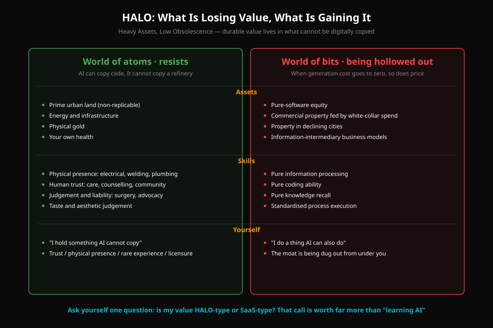

In February 2026, a new term emerged on Wall Street: **HALO -- Heavy Assets, Low Obsolescence.**

Coined by Josh Brown of Ritholtz Wealth Management and subsequently adopted into Morgan Stanley's investment framework [131], the core logic is: **tangible assets (factories, energy, logistics, land) are safer than intangible assets (software, brands, intellectual property)** -- because AI can copy code but cannot copy an oil refinery.

Goldman Sachs data: since 2025, HALO-type companies have outperformed asset-light companies by **35%**. The energy sector is up 25.3%, materials up 18.1%. Meanwhile, SaaS companies lost roughly **$300 billion** in market capitalization in a single trading day.

**What this means for ordinary people:** HALO is not just an investment strategy. It is a cognitive framework -- **things that are hard to replicate digitally are what hold lasting value.** Whether we are talking about companies, skills, or you yourself.

### 14.2 The Death of SaaS: When Code Becomes a Consumable

In 2025, Andrej Karpathy introduced "vibe coding" -- describe what you want, and AI generates the code [133].

Claude Code, Cursor, and Replit Agent already enable a mid-level developer to replicate the core functionality of a medium-sized SaaS product in a matter of weeks.

**The core paradigm of software engineering has been upended.** For the past 50 years, the industry pursued DRY (Don't Repeat Yourself), modularity, reusability, and scalability -- because writing code was expensive. But when AI can generate full features in minutes, the economic rationale for "reuse" vanishes. **Code shifts from "asset" to "consumable"** -- use it, discard it, regenerate when needed.

This is "disposable software" [134]. You no longer need to subscribe to a project management SaaS -- AI generates a custom version tailored to your needs in 10 minutes. Free, perfectly fitted, no monthly fee.

**Which SaaS companies can survive?** Only those whose moat lies not in "code" but in:
- **Data**: unique, non-replicable data (e.g., Bloomberg Terminal)
- **Network effects**: the more users, the more valuable (though AI agents are eroding this too)
- **Regulatory barriers**: legal requirements to use specific systems (healthcare, financial compliance)

Everything else -- project management, CRM, forms, basic analytics -- is a pseudo-asset [132].

### 14.3 What This Means for You Personally

The same logic applies to your career and income:

**Ask yourself: Is my value "HALO-type" or "SaaS-type"?**

- If your value lies in "I can do something AI can also do" -- you are SaaS, and your moat is being hollowed out
- If your value lies in "I possess something AI cannot replicate" (trust relationships, physical presence, unique experience, regulatory credentials) -- you are HALO

This framework is far more useful than "learn AI."

---

---

### 14.4 Money: What Counts as a Truly Safe Asset
#### 14.4.1 Asset Tiers Under the HALO Framework

**Relatively safe ("atom world" assets):**
- Real estate in core cities (location cannot be replicated)
- Energy and infrastructure investments
- Physical gold
- Your own health and skills (the ultimate "heavy asset")

**High risk ("bit world" assets):**
- Tech stocks (especially pure software companies)
- Anything tied to SaaS companies
- Commercial real estate dependent on white-collar spending
- Cryptocurrency (highly volatile, but may become the payment infrastructure of the AI economy)

**Already depreciating:**
- Real estate in third- and fourth-tier cities
- Investment in traditional degrees
- Business models built on "information brokerage"

#### 14.4.2 Cash Is Optionality, Not Waste

In periods of extreme uncertainty, cash gives you **time** -- time to survive before you find your next income source. Recommendation: maintain 6-24 months of living expenses in liquid reserves.

#### 14.4.3 An Honest Word About "Passive Income"

Time for some cold water: **most "passive income" sources are themselves under threat from AI.**

- Online courses? AI can generate unlimited free courses
- E-commerce? AI agents make pricing so transparent that margins approach zero
- Content creation? AI can produce unlimited content
- Rent? Depends on the city

The only truly AI-resistant passive income comes from: **returns on scarce, non-replicable resources in the "atom world."** Prime urban locations, energy interests, trusted positions within specific communities.

For most ordinary people, rather than chasing "passive income," pursue **"low burn rate"** -- reduce fixed expenses so you can hold on even when income drops.

---

---

### 14.5 Skills: What Counts as a "HALO-Type Skill"
#### 14.5.1 HALO-Type Skills vs. Light Skills

**HALO-type (heavy skills, low obsolescence):**
- Requiring physical presence: plumbing, welding, pipefitting, electrical work
- Requiring human trust: counseling, nursing, community organizing
- Requiring judgment and accountability: a surgeon making operative decisions, a lawyer arguing in court
- Requiring taste and aesthetics: haute cuisine, interior design

**Light skills (high obsolescence risk):**
- Pure information processing, pure coding ability, pure knowledge memorization, standardized process execution

#### 14.5.2 "Learning AI" Is Not the Answer

The prompt engineering you learn in 2025 may be useless by 2027. Claude Code itself is upending the advice to "learn to code."

**What you should learn is not the tool but the judgment** -- "Is this AI output correct?" "When should I trust AI, and when shouldn't I?" "Which of these three options is best?"

#### 14.5.3 Skill Strategies Have Expiration Dates Too

- **2025-2028**: Use AI tools to amplify your existing skills -- the highest-ROI window
- **2028-2032**: Physical skills appreciate; judgment and trust relationships become core assets
- **2032-2040**: Humanoid robots mature, closing the physical-skills window too; value may reside solely in "humanness" -- trust, companionship, emotional connection

**The greatest danger is applying last phase's strategy to the next phase.**

---

---

---

## XV. Time and Circumstance: Different Windows, Different Groups

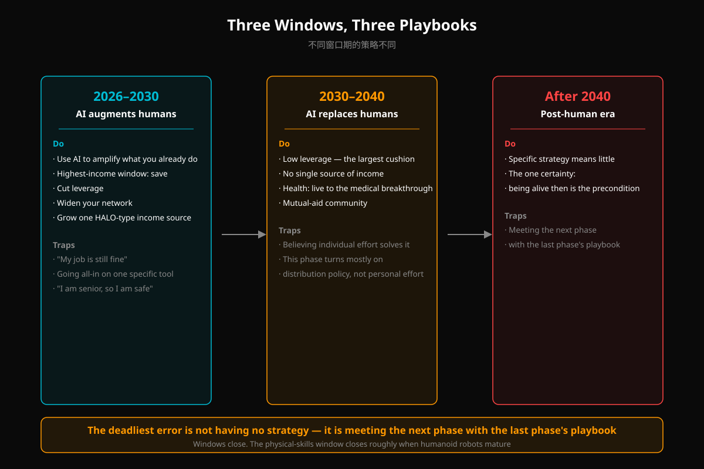

### 15.1 Phase 1: Now to 2030 -- "AI Augments Humans"

**Characteristics:** AI is a tool; humans are still in the loop. Most jobs still exist, but efficiency expectations are surging.

**What you can do:**
- Use AI to amplify your existing capabilities -- not "learn AI," but "use AI to do what you already do, faster and better"
- This is your highest-earning window -- save what you earn, reduce leverage
- Expand your social network -- in an economic crisis, connections are more valuable than resumes
- Cultivate at least one "HALO-type" skill or income source

**Traps:**
- "My job is fine" -- American homeowners in 2007 thought the same
- Going all-in on a specific AI tool -- tools change; judgment does not
- "I'm senior enough to be safe" -- seniority buys more time than being junior, but less than you think

### 15.2 Phase 2: 2030-2040 -- "AI Replaces Humans"

**Characteristics:** Mass unemployment becomes visible; UBI or some alternative begins rolling out; consumption patterns shift dramatically.

**Keys to survival:**
- Low leverage -- no mortgage, no heavy debt is the biggest safety net
- Diversification -- not dependent on any single income source
- Health -- those who live to see age-reversal/AI medicine mature could gain decades of additional life
- Community -- the isolated are most vulnerable; those with mutual support networks are most resilient

**An honest admission:** For most ordinary people, outcomes in this phase depend on government redistribution policy, not individual effort. If UBI is not in place and distribution systems are not reformed, personal strategy has extremely limited impact. What you can do is make sure you **hold on until the policy arrives**.

### 15.3 Phase 3: After 2040 -- "The Post-Human Era"

Augmented humans emerge, species divergence begins, "work" may have ceased to exist.

This phase is too distant for specific strategies to matter much. The only certainty: **being alive when it arrives is the prerequisite for everything.**

---

---

### 15.4 The Real Situation Facing Different Groups
#### 15.4.1 Those With Capital and Skills (Top 10%)

**Advantage:** Savings, networks, learning ability
**Risk:** Overconfidence. "AI can't replace me" -- someone says this during every technological revolution.
**Recommendation:** Use your advantages to build redundancy -- diversified income, assets in core cities, investment in health.

#### 15.4.2 Average White-Collar Workers (Middle 60%)

**The most vulnerable group.** Enough income to feel "fine," but not enough reserves to weather a shock.

**What you can do:** Deleverage (top priority), save money, spend your spare time learning skills that will not become obsolete, think through your Plan B.
**What you cannot do:** Solve pension devaluation and mass unemployment on your own -- these require systemic solutions.

#### 15.4.3 Manual Laborers and Low-Income Groups (Bottom 30%)

**Paradoxically, safer than white-collar workers in the short term** -- AI replaces cognitive labor first. Humanoid robots are still 5-10 years out.

**What you can do:** Use the window to learn trade skills that are in high demand and short supply. Protect your body. Build community mutual-aid networks.
**What you need (but cannot achieve alone):** Government retraining programs, a social safety net that catches you, distribution reform.

---

---

---

## XVI. Children: Let Go of the Obsession -- This May Be the Greatest Liberation

### 16.1 A Realization That Could Halve Parental Anxiety

Let me start with a fact that may be uncomfortable but must be faced: **your child will almost certainly not beat AI in cognitive ability.** No matter how good a university they attend, how trendy their major, how high their GPA -- on the dimensions of pure knowledge and pure skill, AI will be better.

But this is not bad news. **This is liberation.**

Think about it: you push your child to cram, attend tutoring classes, chase grades -- for what? So they can "get a good job and earn good money." But if the endgame of the AI era is radical material abundance and humans do not need to work to survive, the entire premise of that logic chain ceases to exist.

**You are forcing your child to prepare for an exam that will never take place.**

This does not mean education is unimportant. It means the purpose of education needs to be fundamentally redefined: not "beat everyone else," but **"become a whole person capable of enjoying life."**

### 16.2 What Your Child Should Have

**The capacity for joy.** This is not a platitude. In an era where material scarcity may vanish but meaning could become scarce, **knowing what makes you happy and having the ability to pursue it** is the most important survival skill. A child who plays guitar, loves hiking, and enjoys cooking may thrive far better in the AI era than one who only knows how to study for tests.

**Curiosity.** Not "studying for the exam" curiosity, but "this is fascinating and I want to figure it out" curiosity. The only "skill" that will never become obsolete in the AI era is the impulse to learn something new.

**Social skills and empathy.** Real human connection -- trust, friendship, love -- is the scarcest resource in the AI era. A child with three or five close friends will fare far better in the future than one with a 4.0 GPA but no friends.

**Physical fitness.** A healthy body is the prerequisite for all options. And bodily sensations -- the exhilaration of running, the feel of water against skin while swimming -- are things AI can never experience, nor replace your experience of.

**Resilience.** The future is not a straight line; it is a series of turns. Let children grow up accustomed to "fail and try again" rather than "one exam decides your life."

### 16.3 What to Let Go Of

- Grade anxiety -- AI will outperform any human on exams; this arms race has already lost its meaning
- The linear path of "good university -> good job -> good life" -- this road is breaking apart
- Comparing your child to other people's children -- in the face of AI, everyone loses that competition
- The urge to control -- you cannot plan for a future you cannot imagine, but you can raise a person capable of handling any future

### 16.4 A Different Perspective

Your child may be the first generation in human history that **does not need to work to survive.**

What does that mean? It means they can spend their entire lives doing what they truly want to do. Painting, exploring, studying dinosaurs, learning to bake bread, making friends, falling in love, seeing the world -- not "endure decades of work to earn money and then maybe enjoy retirement," but **living the life they want from the very start.**

The ones who land on Mars and travel between stars will most likely be robots and AI, not your child. And that is fine. Your child does not need to land on Mars -- they need to be happy on Earth.

**Be happy when there is reason to be happy. Enjoy what there is to enjoy.** This is not giving up; it is the clearest-eyed outlook for the AI era.

---

---

---

## XVII. The Good Things AI Brings: This Chapter May Be Longer Than You Expect

The first eight chapters focused on defense. But an article that only talks about threats and not opportunities would be dishonest. Because while AI is dismantling the old world, it is simultaneously creating a wealth of things that were never before possible.

### 17.1 Healthcare: For the First Time, the Poor Can Afford a Good Doctor

This may be the most direct benefit AI offers ordinary people.

**AI is democratizing diagnosis.** Getting a top doctor's opinion used to require booking a specialist months in advance or flying to a major city's best hospital. Now an AI-assisted diagnostic tool can deliver near-expert-level analysis in minutes.

Specific advances:
- Across a range of imaging-screening tasks, AI-assisted reading has measurably raised early cancer detection rates — for a patient the difference is finding it sooner, with a wider window to intervene
- An AI blood test in clinical trials in the UK can detect **12 types of cancer** from just **10 drops of blood** with accuracy as high as **99%**
- Mental health chatbots are already providing 24/7 emotional support -- for those who cannot get a counseling appointment, this is something where there was previously nothing
- AI medical tools support real-time multilingual translation -- rural elderly who do not speak Mandarin, immigrants who do not speak the local language, can access medical information without barriers for the first time

**AI is also accelerating drug development.** The figures usually quoted in the industry are that taking a new drug from scratch to market runs **over a decade** and costs on the order of **billions of dollars** (that number amortises failed programmes, and definitions vary widely). AI is expected to compress the front end sharply — **note that this is an expectation, not a delivered average**:
- Insilico Medicine used an AI platform to design drug candidates targeting the cancer target KRAS (notoriously "undruggable"), screening at a scale no wet-lab campaign could reach
- Google DeepMind used AI to discover a previously unknown protein interaction critical to cancer cell survival -- something traditional methods would have been virtually incapable of finding
- 2025 saw the largest number of AI-originated molecules entering clinical trials, concentrated in oncology, fibrosis, autoimmune diseases, and rare diseases

**One case from August 2026 is worth taking apart on its own — because it shows both the power of this route and its limits at the same time.**

On 19 August 2026, Merck and Moderna released topline results from INTerpath-001, the Phase 3 trial of the individualised cancer vaccine intismeran autogene (mRNA-4157): **1,137 patients** with completely resected stage IIB-IV cutaneous melanoma, randomised 2:1, with the primary endpoint of recurrence-free survival (RFS) and the key secondary endpoint of distant metastasis-free survival (DMFS) **both statistically significant and clinically meaningful**. Moderna closed that day at $174.38 against a prior close of $62.96 — **+176.97% in a single session** [140].

The technical point here is specific: this is not one drug given to every patient. It sequences **each patient's own tumour**, uses an algorithm to select and rank the neoantigens from that mutation profile most likely to be recognised by the immune system, and then synthesises an mRNA construct belonging to that one person — encoding up to **34 neoantigens** per dose. **"Algorithmic target selection" is not an assistive tool here; it is the precondition for the route existing at all**: without automated neoantigen selection and ranking, "make a separate vaccine for every individual" simply does not run as an engineering proposition [141].

**But two things have to be kept apart, or this becomes hype:**

- The Phase 3 release **stated only that the endpoints were met. It disclosed no hazard ratio, no confidence interval, no p-value, no event counts, and no follow-up duration** [140]. The widely circulated figures of "49% reduction in recurrence risk" and "59% reduction in distant metastasis risk" are **not** from this Phase 3 readout; they come from the earlier Phase 2b KEYNOTE-942 (n=157, median follow-up 60.3 months, RFS HR=0.51, DMFS HR=0.411) [141]. Attaching Phase 2b effect sizes to a Phase 3 result is a common misreading.
- Public material says only that the neoantigen sequences are "algorithmically derived." **It does not disclose model architecture or training data, and does not state whether deep learning or generative models were used** [141]. So one can say "computational methods are the precondition for this route." One cannot say "AI cured cancer."

Even discounted heavily, this remains the hardest single example supporting this section's argument: **once the marginal cost of screening and design falls far enough, "making one drug for one person" moves from economically impossible to economically possible.** Which is exactly what the next paragraph is about.

**Rare disease patients may be the biggest beneficiaries.** The figure usually cited for rare-disease patients worldwide is around 300 million (definitions differ between bodies, and estimates vary accordingly); most conditions attract no pharmaceutical investment because patient populations are too small and markets too limited. AI dramatically lowers R&D costs -- niche diseases that were previously not worth pursuing may now become viable.

### 17.2 Accessibility: The World Is Opening Up for People With Disabilities and the Elderly

This is a severely underestimated area.

**For the visually impaired:** Tools like Microsoft's Seeing AI use AI to describe the surrounding environment in real time -- identifying objects, reading text, recognizing faces. A blind person can "see" a restaurant menu, "read" the instructions on a medicine bottle, or "recognize" a friend walking toward them.

**For the hearing impaired:** AI real-time captioning lets deaf people "hear" conversations -- not just video-call subtitles, but live transcription of face-to-face interactions.

**For those with limited mobility:** AI-powered smart homes allow wheelchair users and bedridden elderly to control lights, air conditioning, door locks, and curtains by voice -- tasks that once required someone else's help can now be done independently.

**For those with cognitive impairments/the elderly:** AI companion robots can chat with dementia patients, conduct cognitive training, monitor mood changes, and remind them to take medication. South Korea has already deployed more than **5,400** AI companion robots across 115 local governments.

**For these groups, AI is not "replacement" -- it is "empowerment."** It grants them independence and dignity they never had before. This may be the purest benefit of AI, free of any negative controversy.

### 17.3 Education: The Best Tutor in History, for Free

AI may be the greatest equalizer in education.

What used to be required to access top-tier educational resources? A house in the right school district (millions of yuan), international school tuition (hundreds of thousands per year), one-on-one tutoring (hundreds per hour). Poor children and rich children were never on the same track from the starting line.

AI is changing this.

A rural child can now learn the same material as an urban child using AI -- personalized, at their own pace. An AI tutor will not lose patience because you asked a "dumb question," will not give up on you for being a poor student, and will not stop teaching you because your family cannot afford the hourly rate.

Stanford's Data Ocean platform has already provided nearly **3,600** free AI medical education certifications across **93 countries** -- for students in developing nations, this was previously unimaginable.

In Kenya and Nigeria, AI tools already support Swahili, Yoruba, and Amharic -- farmers can interact with AI by voice on basic phones to get crop disease diagnoses.

In the 2024-2025 school year, **60%** of U.S. K-12 teachers were using AI tools, saving **6 hours** per week [101] (see Volume I, 2.7). Those 6 hours can be redirected to things AI cannot do -- one-on-one attention for students, handling emotional issues, building personal trust.

### 17.4 One Person, One Army: The Barrier to Entrepreneurship and Creation Drops to Zero

This is AI's greatest gift to people with initiative.

**Sam Altman predicts that the first "one-person billion-dollar company" will emerge between 2026 and 2028.** Anthropic CEO Dario Amodei believes there is a **70-80%** probability of this happening by 2026.

This is not hyperbole. Take Midjourney: a private company that discloses no financials, and outside estimates disagree on both headcount and revenue — **but every set of figures lands revenue-per-employee in the millions of dollars a year**, an order of magnitude above a conventional software company. What if you compressed that further to one person?

AI lets a single individual do what used to require a team:
- **Programming**: Claude Code lets one person run 4-10 AI coding agents simultaneously, equivalent to a small development team
- **Design**: AI generates drafts; you provide aesthetic judgment and make the final selection
- **Marketing**: AI writes copy, generates ad creatives, analyzes data
- **Customer service**: AI handles 90% of routine inquiries; you handle the 10% that are complex
- **Finance/Legal**: AI handles basic compliance; you make strategic decisions

**What does this mean?** It means entrepreneurship is no longer a game reserved for the wealthy. You do not need funding, employees, or an office. You need a good idea, basic judgment, and a computer with internet access.

The probability of success is still low -- most startups fail, and AI will not change that. But the cost of failure approaches zero. Try an idea; if it doesn't work, discard it and try another. A single attempt used to cost millions; now it costs a few weeks and a few hundred dollars in API fees.

### 17.5 Everyday Improvements: Unglamorous but Real Benefits

Beyond these "big" benefits, AI is quietly improving everyday life in countless ways:

- **Language is no longer a barrier**: Real-time translation lets you communicate with anyone in any language. Traveling abroad, doing cross-border business, reading foreign materials -- AI means "not speaking the language" is no longer a constraint
- **Self-driving reduces accidents**: roughly **1.16 million** people die in road crashes worldwide each year [135]. NHTSA's classic crash-causation survey assigned the "critical reason" to the driver in about **94%** of crashes [136] -- that figure is where the ceiling on "how much autonomy could save" comes from. But be precise: 94% is an attribution, not a promise that a machine would have avoided all of them, and NHTSA itself cautions against reading it that way. The empirical record so far is limited to bounded mileage in specific cities (see the Waymo data at [129] in Volume I). Even partial delivery is on the order of hundreds of thousands of lives a year
- **Personal productivity**: AI helps you sort email, manage your calendar, summarize long documents, and draft replies -- freeing you from repetitive mental labor
- **Fraud and security**: AI protects you without you even knowing -- detecting anomalous bank transactions, identifying phishing emails, preventing identity theft
- **Independent living for the elderly**: Smart homes + AI voice assistants allow the elderly to live independently at home for longer, reducing dependence on children or caretakers

### 17.6 Shifting Perspective: From Threat to Tool

Summing up the benefits above, the core cognitive shift is:

**AI is not just something that steals your job. It is also:**
- Your personal doctor (at the screening level)
- Your all-subject tutor (free, patient, 24/7)
- Your startup co-founder (no salary required, no equity demanded)
- Your accessibility assistant (if you have any physical limitations)
- Your translator, secretary, researcher, and designer

**The same AI is a threat to one person ("it can do my job") and a superpower for another ("it can help me do ten times as much").** The difference lies not in AI itself, but in how you see it and how you use it.

One designer worries AI will replace them -- but another uses AI to generate 50 concepts a day, then applies their own aesthetic judgment to pick the best 3. The latter produces 10x more than the former.

One writer worries AI writes better than they do -- but another uses AI for research, organizing material, and generating first drafts, then injects their own perspective and personality. The latter produces in one week what used to take a month.

**The question is not "can you do what AI does" but "what can you plus AI do that was previously impossible?"**

Seize these opportunities. Use AI to do what you always wanted to do but couldn't -- learn a new skill, build a small product, help your community, improve your health. This is not the empty slogan of "embrace change." This is concrete action.

### 17.7 "Survive the Storm and Better Days Await" -- The Power of This Narrative

Humans can endure enormous suffering, provided they know it has an end.

The British endured the Blitz during World War II because Churchill said "We shall never surrender" -- not "everything will be fine," but "beyond the suffering lies victory."

Many who took their own lives during the Great Depression were not the poorest -- they were those who believed "things will never get better." **Despair kills; poverty alone does not.**

What should the narrative of the AI era be?

**Not "the apocalypse is here." Not "everything will be fine." Rather: "The next few years will be hard, but the hard part has an end. Survive the transition, and what lies beyond is very likely a better world."**

This is not blind optimism. It is a rational assessment based on technological trends:
- The cost of AI is falling exponentially -- Sam Altman predicts a tenfold drop per year
- The cost of material production will approach zero
- The day when humans no longer need to work for food, clothing, housing, or basic healthcare is technologically achievable
- AI is already making healthcare, education, and accessibility services better, cheaper, and more widely available

The only question is **how long the transition lasts**. It could be 5 years; it could be 20. But the direction is clear.

**Knowing the storm will pass and believing the storm is eternal produce entirely different behaviors.** The former makes you repair the ship, stock provisions, support each other, and even savor moments of calm amid the rain. The latter makes you give up.

**This is not optimism. This is strategy.**

---

### 17.8 Your Own Health: Living to 2035 May Be the Best Investment You Ever Make

As analyzed in Volume I, 9.2–9.3: age-reversal technology and AI medicine may achieve breakthroughs between 2035 and 2045. **Those who are alive at that point could gain decades of additional life.** The return on your current health investments may be the highest in history.

**Things that cost nothing but pay off enormously:**
- 150 minutes of exercise per week
- Adequate sleep (7-8 hours)
- Weight management
- Regular health checkups
- Maintaining social connections -- the health damage of loneliness is equivalent to smoking 15 cigarettes a day

---

---

---

---

# Conclusion · Crossing the Transition

There is a saying: the pessimist is right, the optimist moves forward.

By now the map and the list are both open on the table. The question is no longer whether it will hurt, but what is still in your hands when it does.

Here is the whole thing in three sentences.

**First, there is good reason for optimism about the technological endgame — but it is not a promise that pays out on its own.** If productivity keeps advancing along its current line, material abundance and a humanity released from most necessary labour are where the technology trend points. But technology only supplies the possibility. Whether it is delivered depends on distribution, on safety governance, and on how much strain a society can absorb — and what Volume I spent nine chapters establishing is that none of those three is guaranteed to keep up.

**Second, the endgame does not arrive tomorrow.** In between lies a transition that may run ten to twenty years — the technology has already turned over, the institutions have not. The gap between the production side and the distribution side is exactly where ordinary people stand exposed. That gap is what this book is really about.

**Third, on that stretch of road immunity is not available. Only endurance is.** Structural change at this scale is not something an individual can block. What Volume II offers is not armor but a handful of things that will get you through with fewer injuries:

- **Psychology first** — unbind identity, train resilience, widen your luck surface area, stay loose (Chapter XIII)
- **Read your assets correctly** — the HALO frame: things in the world of atoms resist better than things in the world of bits (Chapter XIV)
- **Cut leverage** — low debt is the largest safety cushion in a transition (Chapter XIV, 14.4)
- **Work in stages** — different windows need different strategies; the deadliest error is meeting the next phase with the last phase's playbook (Chapter XV)
- **Maintain your people** — "someone cares whether I exist" may be the single most valuable resource in a transition (Chapter XIII)
- **Stay healthy** — the longer the transition runs, the more your physical and mental condition becomes the underlying asset (Chapter XVII, 17.8)
- **Let your children off** — this is not "education stops mattering." It is: stop using the last era's scarcity logic to train them into tools fitted to a vanishing world. Curiosity, health, and relationships matter more than winning an exam that is being cancelled (Chapter XVI)
- **Use AI on offense** — it is not only a threat; it is a superpower. Use it to do what you could not do before (Chapter XVII)

**One last thing.**

Volume I closed on the hardest problem in the book: this analysis is reflexive — **every decision you make after reading it makes it more true.**

There is no exit from that. But there is a direction.

But that direction has to be stated precisely, or it collapses into a pep talk.

The collapse-direction reflexivity works because it **requires no coordination at all**: each person panic-sells, each firm freezes hiring, each household cashes out early, and the sum is systemic acceleration.

**Deleveraging requires no coordination either.** The collapse chain in Chapter VI of Volume I — pay cut → missed mortgage → impaired bank capital → credit contraction → further pay cuts — begins at household leverage. A person who brings their debt down is feeding the opposite quantity into the same chain. **Same mechanism, run backwards.**

This is not the optimism of belief-makes-it-so. It is the realism that **action changes your exposure.** It may not stop a systemic shock; it decides where a great many people are standing when one arrives.

That is the only honest use of reflexivity: **it does not promise the rain will stop. It only decides where you are standing when it falls.**

**So: hold what can be held, put down what should be put down. Reduce risk, but do not stop acting. When the anxiety comes, go for a walk, cook something, see a friend. When nothing feels like it means anything, go do one thing that makes you happy — not for anyone else, for yourself.**

The storm can pass — not because people naturally get better, but because technology is manufacturing the capacity to solve these problems. The real question is whether humanity can hold out until institutions learn to use that capacity.

And "holding out" is your part of it.

The pessimist draws the map; the optimist takes the steps. The map tells you where the cliff is. The steps decide how you go around it.

**Pessimism by itself is useless. You still have to keep walking.**

**Stay alive. Cross the transition. Then go see what is on the other side.**

---

## About This Book

Written by Tony Seah, based on logical extrapolation from public data and research reports. All charts are original hand-drawn SVGs.

## Discussion

Join the Telegram group to discuss the ideas in this book:

---

If you found this book valuable, consider supporting the author:

**International:**
- GitHub Sponsors: [github.com/sponsors/pkusnail](https://github.com/sponsors/pkusnail)
- Buy Me a Coffee: [buymeacoffee.com/pkusnail](https://buymeacoffee.com/pkusnail)

**Reprint notice:** Feel free to repost and share this book, but please retain author attribution and support links.

Source / Project: [github.com/pkusnail/GPUs-Wombs-and-Money-Printers](https://github.com/pkusnail/GPUs-Wombs-and-Money-Printers)

---

## References

*The bibliography below is shared with the Chinese edition, which is the fuller text. A small number of entries are cited only there; reference numbers are kept identical across both editions so that a citation can be looked up in either.*

[1] Citrini Research & Alap Shah, "The Consequences of Abundant Intelligence," February 22, 2026. https://www.citriniresearch.com/p/2028gic

[2] Wu Jun, *Tides of Technology (Lang Chao Zhi Dian)*, 4th ed., Posts & Telecom Press, 2019. https://book.douban.com/subject/33474750/

[3] Krizhevsky, A., Sutskever, I., & Hinton, G. E., "ImageNet Classification with Deep Convolutional Neural Networks," NeurIPS 2012. https://papers.nips.cc/paper/4824-imagenet-classification-with-deep-convolutional-neural-networks

[4] Pew Research Center, "5 facts about global fertility trends," August 2025. https://www.pewresearch.org/short-reads/2025/08/15/5-facts-about-global-fertility-trends/

[5] Statista, "Countries with the lowest fertility rates 2025." https://www.statista.com/statistics/268083/countries-with-the-lowest-fertility-rates/

[6] United Nations, "World Fertility 2024," 2025. https://www.un.org/development/desa/pd/content/world-fertility-2024

[7] The Lancet / IHME, "Dramatic declines in global fertility rates set to transform global population patterns by 2100." https://www.healthdata.org/news-events/newsroom/news-releases/lancet-dramatic-declines-global-fertility-rates-set-transform

[8] WardheerNews, "South Korea — How a $280 Billion Baby Plan Failed," 2025. https://wardheernews.com/south-korea-how-a-280-billion-baby-plan-failed-and-what-it-says-about-modern-society/

[9] ScienceDirect, "Childbearing and the distribution of the reservation price of fertility: The case of the Korean baby bonus program." https://www.sciencedirect.com/science/article/abs/pii/S104900782100124X

[10] MIT Technology Review, "Inside Japan's long experiment in automating elder care," January 2023. https://www.technologyreview.com/2023/01/09/1065135/japan-automating-eldercare-robots/

[11] CNN, "South Korea's aging population finds comfort in 'robo-grandma' dolls." https://www.cnn.com/health/asias-aging-population-finds-comfort-care-in-robo-grandma-dolls-wellness-spc

[12] Bloomberg, "Pentagon Pressures Anthropic to Drop AI Guardrails in Military Standoff," February 26, 2026. https://www.bloomberg.com/news/features/2026-02-26/pentagon-pressures-anthropic-to-drop-ai-guardrails-in-military-standoff

[13] NBC News, "Pentagon gives AI firm ultimatum: lift military limits by Friday or lose $200M deal." https://www.nbcnews.com/meet-the-press/video/pentagon-gives-anthropic-an-ultimatum-amid-fight-over-military-ai-guardrails-258370117539

[14] Fortune, "The AI arms race could lead to human extinction, top researcher warns," February 2026. https://fortune.com/2026/02/18/big-tech-russian-roulette-ai-race-humanity-extinction/

[15] SF Examiner, "SF office-vacancy rate heading for biggest drop since 2015." https://www.sfexaminer.com/news/business/sfs-office-vacancy-rate-heading-for-biggest-drop-since-2015/article_dbb23edb-a7fc-4ec5-bb70-81fbceb988bc.html

[16] Congress.gov / CRS, "Commercial Real Estate and the Banking Sector," R48175. https://www.congress.gov/crs-product/R48175

[17] Wikipedia, "Decline of Detroit." https://en.wikipedia.org/wiki/Decline_of_Detroit

[18] Cleveland Fed, "Urban Decline in Rust-belt Cities," 2013. https://www.clevelandfed.org/publications/economic-commentary/2013/ec-201306-urban-decline-in-rust-belt-cities

[19] Vision Times, "Is China's Northeast Disappearing? Ghost Cities Spread," November 2025. https://www.visiontimes.com/2025/11/26/is-chinas-northeast-disappearing-ghost-cities-spread-as-housing-prices-collapse.html

[20] Nature Cities, "The decreasing housing utilization efficiency in China's cities," 2024. https://www.nature.com/articles/s44284-024-00177-8

[21] Visual Capitalist, "The Decline of Fertility Rates in OECD Countries (1950-2025)." https://www.visualcapitalist.com/decline-of-fertility-rates-in-oecd-countries-1950-2025/

[22] Carnegie Endowment, "The AI Governance Arms Race," October 2024. https://carnegieendowment.org/research/2024/10/the-ai-governance-arms-race-from-summit-pageantry-to-progress

[23] Computer Weekly, "MPs warned of AI arms race to the bottom." https://www.computerweekly.com/news/365529793/MPs-warned-of-AI-arms-race-to-the-bottom

[24] CNN / China Ministry of Civil Affairs, "Fewer people than ever before are marrying in China. But divorces are up," February 2025. https://www.cnn.com/2025/02/10/china/china-marriage-registrations-record-low-2024-intl-hnk

[25] CDC/NCHS, "FastStats — Marriage and Divorce," 2023. https://www.cdc.gov/nchs/fastats/marriage-divorce.htm

[26] OECD, "Marriage and Divorce: Society at a Glance 2024." https://www.oecd.org/en/publications/society-at-a-glance-2024_918d8db3-en/full-report/marriage-and-divorce_63dd0a7d.html

[27] YuWa Population Research / CNN, "China is one of world's most expensive places to raise children," February 2024. https://www.cnn.com/2024/02/22/asia/china-cost-of-raising-children-intl-hnk

[28] Merton, Robert K., "The Self-Fulfilling Prophecy," The Antioch Review, Vol. 8, No. 2, 1948. https://www.jstor.org/stable/4609267

[29] Soros, George, "The Alchemy of Finance," Simon & Schuster, 1987 (Chinese edition: Jinrong Lianjinshu). https://www.wiley.com/en-us/The+Alchemy+of+Finance,+2nd+Edition-p-9780471445494

[30] Finance Magnates / KED Global, "South Korea's crypto market engages 30% of population," 2024; PANews, "Why South Korea has become one of the hottest crypto markets in the world." https://www.financemagnates.com/cryptocurrency/south-koreas-102-trillion-won-crypto-market-engages-30-of-population/

[31] The Hill, "The US is headed for mass unemployment, and no one is prepared," 2026; InvestorPlace, "AI Job Loss Is Accelerating – and Washington Won't Stop It." https://thehill.com/opinion/finance/5713876-ai-displacement-and-ubi/

[32] OMFIF, "Fiscal exceptionalism and the US-Europe growth gap," January 2026. https://www.omfif.org/2026/01/fiscal-exceptionalism-and-the-us-europe-growth-gap/

[33] World Economic Forum / Kela, "The results of Finland's basic income experiment are in," 2019. https://www.weforum.org/stories/2019/02/the-results-finlands-universal-basic-income-experiment-are-in-is-it-working/

[34] Sam Altman / Futurism, "Sam Altman Says AI Will Cause Massive Deflation, Making Money Worth Vastly More." https://futurism.com/future-society/sam-altman-ai-deflation

[35] Trading Economics / Japan CPI, "Japan Inflation Rate," January 2026. https://tradingeconomics.com/japan/inflation-cpi

[36] Pandaily, "China Produced Nearly 90% of Humanoid Robots Sold Globally in 2025," February 2026. https://pandaily.com/china-produced-nearly-90-of-humanoid-robots-sold-globally-in-2025/

[37] Reuters / NextBigWhat, "Chinese robot makers outpace Tesla in humanoid robot race," February 2026. https://www.reuters.com/technology/

[38] IEEE Spectrum, "What's Holding Humanoid Robots Back," February 2026. https://spectrum.ieee.org/humanoid-robot

[39] Wiley / American Journal of Hematology, "CML 2025 Update on Diagnosis, Therapy, and Monitoring." https://onlinelibrary.wiley.com/doi/full/10.1002/ajh.27443

[40] NEJM, "Trastuzumab Deruxtecan plus Pertuzumab in HER2-Positive Metastatic Breast Cancer," 2025. https://www.nejm.org/doi/full/10.1056/NEJMoa2508668

[41] PharmaBoard Room, "Hong Kong Biotech IPOs in 2025." https://pharmaboardroom.com/facts/hong-kong-biotech-ipos-in-2025/

[42] MIT Technology Review, "The first human test of a rejuvenation method will begin shortly," January 2026. https://www.technologyreview.com/2026/01/27/1131796/the-first-human-test-of-a-rejuvenation-method-will-begin-shortly/

[43] PMC / Probabilistic Forecasting of Maximum Human Lifespan by 2100. https://pmc.ncbi.nlm.nih.gov/articles/PMC11448547/

[44] SSA, "2025 OASDI Trustees Report Summary," June 2025. https://www.ssa.gov/oact/trsum/

[45] The Diplomat, "As China Ages, a Pension Crisis Looms," February 2026. https://thediplomat.com/2026/02/as-china-ages-a-pension-crisis-looms/

[46] HEConomist, "Japan's Pension System: A Fragile Equilibrium," May 2025. https://heconomist.ch/2025/05/05/japans-pension-system-a-fragile-equilibrium-between-tradition-and-contemporary-challenges/

[47] IMF, "Global Financial Stability Report — The Financial Impact of Longevity Risk," April 2012. https://www.imf.org/en/blogs/articles/2012/04/11/seven-billion-reasons-to-worry-the-financial-impact-of-living-longer

[48] ASH Clinical News, "CAR-T Cell Therapies Predicted to Cost More Than $1 Million." https://ashpublications.org/ashclinicalnews/news/3469/CAR-T-Cell-Therapies-Predicted-to-Cost-More-Than-1

[49] S&P Global, "Data center grid power demand to rise 22% in 2025, nearly triple by 2030," 2025; Axios, "AI data center boom: projects vs numbers," February 2026. https://www.spglobal.com/energy/en/news-research/latest-news/electric-power/101425-data-center-grid-power-demand-to-rise-22-in-2025-nearly-triple-by-2030

[50] Tom's Hardware / TSMC, "Advanced node capacity falls short of AI demand," 2025; Congress.gov CRS R48642 (SMIC 5nm analysis). https://www.tomshardware.com/tech-industry/semiconductors/tsmc-csays-advanced-node-capacity-falls-short-of-ai-demand

[51] Bain & Company, "Humanoid Robots: From Demos to Deployment," Technology Report 2025. https://www.bain.com/insights/humanoid-robots-from-demos-to-deployment-technology-report-2025/

[52] MIT Technology Review, "Why Humanoids Need Their Own Safety Rules," June 2025; OnLabor, "Amazon's Approach to Robotics Is Seriously Injuring Warehouse Workers." https://www.technologyreview.com/2025/06/11/1118519/humanoids-safety-rules/

[53] Medium / Markus Brinsa, "Hallucination Rates in 2025"; ISACA, "Avoiding AI Pitfalls in 2026: Lessons from Top 2025 Incidents." https://www.isaca.org/resources/news-and-trends/isaca-now-blog/2025/avoiding-ai-pitfalls-in-2026-lessons-learned-from-top-2025-incidents

[54] McKinsey, "Future of Autonomous Vehicles," 2025; Rodney Brooks, "Predictions Scorecard 2026," January 2026. https://rodneybrooks.com/predictions-scorecard-2026-january-01/

[55] Gartner, "Hype Cycle for Artificial Intelligence 2025"; MIT / Active Logic, "Where is AI on Gartner's 2025 Hype Cycle." https://www.gartner.com/en/articles/hype-cycle-for-artificial-intelligence

[56] European Commission, "AI Omnibus enters into force," July 27, 2026 (Regulation (EU) 2026/1744: Annex III high-risk obligations postponed to December 2, 2027; Annex I to August 2, 2028); Gibson Dunn, "EU AI Act Omnibus Agreement — Postponed High-Risk Deadlines and Other Key Changes," 2026; Latham & Watkins, "China Introduces Rules for AI Companion and Emotional Interaction Services," July 8, 2026; IAPP, "China's new AI rules: Ethics, AI agents and anthropomorphic AI," July 8, 2026. https://digital-strategy.ec.europa.eu/en/news/ai-omnibus-enters-force

[57] Baker McKenzie, "Navigating Labor's Response to AI," June 2025; Brookings, "Hollywood Writers Strike and AI." https://www.bakermckenzie.com/en/insight/publications/2025/06/navigating-labors-response-to-ai

[58] Stanford CodeX, "How AI Agents Are Rewriting Rules of Engagement," January 2025; DLA Piper, "Rise of Agentic AI Legal Risks." https://law.stanford.edu/2025/01/14/from-fine-print-to-machine-code-how-ai-agents-are-rewriting-the-rules-of-engagement/

[59] Epoch AI, "AI Supercomputers Performance Share by Country," 2025; GeoCoded, "State of Global AI Compute 2025." https://epoch.ai/data-insights/ai-supercomputers-performance-share-by-country

[60] Inbolt, "Industrial Robot Cost Decline," 2025; EY, "Three Tailwinds for Robotics Adoption," 2024. https://www.inbolt.com/resources/industrial-robot-cost-decline

[61] Reshoring Initiative, "2024 Annual Report," 2025; Automate.org, "Reshoring and Nearshoring Trends." https://reshorenow.org/content/pdf/2024-1Q2025_RI_DATA_Report.pdf

[62] UNCTAD, "Technology and Innovation Report 2025"; ODI, "The AI Time Bomb: 2.5 Million Jobs at Risk in Kenya"; ILO / IMF, "AI and the Philippine Labor Market." https://unctad.org/publication/technology-and-innovation-report-2025

[63] NBER, "India's De-Industrialization Under British Rule," Working Paper 10586. https://www.nber.org/papers/w10586

[64] Atlantic Council, "Will Data & AI Cripple or Leapfrog Developing Nations?"; Connecting Africa, "World Bank Chief on AI Leapfrogging." https://www.connectingafrica.com/ai/world-bank-chief-not-certain-developing-nations-can-leapfrog-with-ai

[65] CDO Magazine, "Pentagon Seeks $13.4B for AI and Autonomy in FY2026 Budget Request," 2025; CNAS, "The Role of AI in Russia's Confrontation with the West." https://www.cdomagazine.tech/us-federal-news-bureau/pentagon-seeks-13-4-bn-for-ai-and-autonomy-fy-2026-budget-request

[66] 972 Magazine, "Lavender: The AI machine directing Israel's bombing spree in Gaza," April 2024. https://www.972mag.com/lavender-ai-israeli-army-gaza/

[67] Atlantic Council, "Missiles, AI, and drone swarms: Ukraine's 2025 defense tech priorities"; MIT Technology Review, "Autonomous warfare in Europe," January 2026. https://www.technologyreview.com/2026/01/06/1129737/autonomous-warfare-europe-drones-defense-automated-kill-chains/

[68] Anthropic, "Disrupting AI-powered espionage," November 2025; Arms Control Association, "AI-Nuclear Transparency," December 2025. https://www.anthropic.com/news/disrupting-AI-espionage

[69] CFR Education, "Industrialization and Imperialism"; Michigan Journal of Economics, "Economics of Warfare," 2025; OMFIF, "Putin and Russia's Ruined Economic Future," January 2026. https://www.omfif.org/2026/01/putin-is-wary-of-facing-russias-ruined-economic-future/

[70] Maplecroft, "Escalating unrest, polarisation set stage for disruptive 2026"; Pew Research, "Political Polarization." https://www.maplecroft.com/solutions/consulting/political-risk/insights/escalating-unrest-polarisation-economic-woes-set-stage-for-disruptive-2026/

[71] Foreign Policy Analytics, "AI and Critical Minerals," July 2025; NBC News, "Greenland's critical minerals a tempting target"; American Security Project, "Rare Earths, AI, and Strategic Competition." https://fpanalytics.foreignpolicy.com/2025/07/18/artificial-intelligence-critical-minerals-supply-chains/

[72] Allison, Graham, "Destined for War: Can America and China Escape Thucydides's Trap?" Houghton Mifflin Harcourt, 2017; Harvard Kennedy School, "Thucydides' Trap." https://www.hks.harvard.edu/faculty-research/policy-topics/international-relations-security/thucydides-trap-peace-and-rivalry

[73] SpaceX, "Starship" mission updates, 2024-2026; Payload Space, "Starship Economics: The $10/kg LEO Target," 2025. https://payloadspace.com/starship-launch-cost-analysis/

[74] Lumen Orbit, "Starcloud: First GPU in Orbit," November 2025; Google, "Project Suncatcher: Space-Based Solar for AI Data Centers," 2025; TechCrunch, "The Race to Build Data Centers in Space," 2025. https://techcrunch.com/2025/11/space-data-centers-lumen-orbit/

[75] Bloomberg, "Musk's SpaceX Combines With xAI at $1.25 Trillion Valuation," February 2, 2026; Reuters, "SpaceX acquires xAI in record-setting deal," February 4, 2026 (all-stock: SpaceX $1T, xAI $250B); SpaceX Nasdaq IPO (SPCX): priced at $135/share June 11, 2026, first trade June 12, 2026, ~$1.77 trillion valuation, $75B raised — the largest IPO by proceeds on record; Jonathan McDowell, "Jonathan's Space Report — Starlink Statistics" (as of August 18, 2026: 12,745 launched, 10,979 in orbit, 9,724 in operational orbit). https://planet4589.org/space/con/star/stats.html

[76] NASA, "Mars Facts"; Rees, Martin, "The End of Astronauts," Harvard University Press, 2024; Space.com, "Musk shifts Mars-to-Moon focus," February 2026. https://mars.nasa.gov/all-about-mars/facts/

[77] NASA JPL, "Perseverance Rover Completes First AI-Planned Drive on Mars," December 2025. https://www.jpl.nasa.gov/news/perseverance-ai-autonomous-driving

[78] Rees, Martin, "The End of Astronauts," Harvard University Press, 2024; Von Neumann, John, "Theory of Self-Reproducing Automata," 1966. https://press.uchicago.edu/ucp/books/book/chicago/T/bo5780028.html

[79] Spielberg, Steven, "A.I. Artificial Intelligence," Warner Bros., 2001; Scott, Ridley, "Prometheus," 20th Century Fox, 2012.

[80] SpaceNews, "China's Landspace recovers booster with second orbital launch of Zhuque-3 rocket," August 18, 2026; Reuters, "China's LandSpace lands rocket booster; joins SpaceX, Blue Origin with reusable tech," August 18, 2026; India Today, "Private Chinese rocket Zhuque-3 collapses, landing leg catches fire after touchdown," August 19, 2026; SpaceNews, "China's commercial Tianlong-3 rocket fails on debut launch," April 3, 2026; SpaceNews, "Zhuque-3 reaches orbit, first stage lost during landing attempt," December 2025; CNBC, "China eases IPO rules for reusable rocket firms," December 2025. https://spacenews.com/chinas-landspace-recovers-booster-with-second-orbital-launch-of-zhuque-3-rocket/

[81] Hosseini Maasoum & Lichtinger, "Generative AI as Seniority-Biased Technological Change," Harvard/SSRN, 2025; SCMP, "Youth unemployment eases to 16.9%," 2025; Caixin, "Youth Unemployment Surge," September 2025; Foreign Policy, "China's AI Planners Are Fearful of Job Losses," November 2025. https://papers.ssrn.com/sol3/papers.cfm?abstract_id=5425555

[82] SignalFire, "State of Talent Report 2025"; CNBC, "AI is not just ending entry-level jobs," September 2025; Revelio Labs, "Entry-Level Job Postings Decline," 2025; LeadDev Engineering Survey 2025; IntuitionLabs, "AI's Impact on Graduate Jobs 2025." https://www.signalfire.com/blog/signalfire-state-of-talent-report-2025

[83] Global Policy Solutions, "Stick Shift: Autonomous Vehicles, Driving Jobs, and the Future of Work"; Medium/Ben Kitchen, "Transitioning from Horses to Cars: Resource Consumption"; Resilience.org, "The Big Shift Last Time: From Horse Dung to Car Smog," 2013; Victoria Transport Policy Institute, "Autonomous Vehicle Implementation Predictions," 2025. https://globalpolicysolutions.org/report/stick-shift-autonomous-vehicles-driving-jobs-and-the-future-of-work/

[84] Tesla, "FSD Safety Hub," 2026; TechCrunch, "Tesla launches robotaxi rides in Austin with no human safety driver," January 22, 2026; Electrek, "Tesla starts robotaxi rides without safety monitor," January 2026. https://www.tesla.com/fsd/safety

[85] Waymo, "2025 Year in Review," December 2025; CNBC, "Waymo 450,000 weekly rides," December 2025; CNBC, "China's Baidu robotaxis match Waymo's ride numbers," November 2025; Pony.ai, "Shenzhen citywide driverless permit," October 2025. https://waymo.com/blog/2025/12/2025-year-in-review

[86] CleanTechnica, "BYD God's Eye Brings ADAS to the Masses," February 2025; SCMP, "Chinese EV makers outpace Tesla in autonomous-driving race," 2025. https://cleantechnica.com/2025/02/17/byd-gods-eye-brings-adas-to-the-masses/

[87] Yicai Global, "China's 30 Million Truck Drivers," 2024; Beijing Scroll, "Inside China's 7.48 Million Ride-Hailing Drivers," 2024; Goldman Sachs, "Self-Driving Cars Could Steal 300,000 Jobs a Year," 2017; International Transport Forum, "Driverless Trucks and Job Losses," 2017; IRU, "Global Truck Driver Shortage Report," 2024. https://www.yicaiglobal.com/news/china-saturated-trucking-market-has-left-30-million-drivers-in-debt-report-says

[88] Autor, David et al., "When Work Disappears: Manufacturing Decline and the Falling Marriage-Market Value of Young Men," American Economic Review: Insights, 2019; National Institute of Population and Social Security Research (Japan), "Population Statistics of Japan," 2023; National Institute of Population and Social Security Research (Japan), "Lifetime Never-Married Rate for Men," 2020. https://www.aeaweb.org/articles?id=10.1257/aeri.20180010

[89] 36Kr, "China's AI Virtual Companion Users Surpass 30 Million," 2024; The Economist, "AI girlfriends are ruining a generation of men," 2025; Reuters, "Japan's AI relationship industry," 2024; user data from platforms including Character.ai and Replika. https://www.economist.com/asia/2025/01/09/ai-girlfriends-are-ruining-a-generation-of-men

[90] BLS, "Employment Situation Summary," January 2026; Yale Budget Lab & Brookings, "Evaluating the Impact of AI on the Labor Market," October 2025; Federal Reserve Governor Barr, "What Will AI Mean for the Labor Market and the Economy?" February 17, 2026; ILO, "World Employment and Social Outlook Trends 2026." https://www.federalreserve.gov/newsevents/speech/barr20260217a.htm

[91] McKinsey, "The State of AI," November 2025; Gartner, "40% of Enterprise Apps Will Feature Task-Specific AI Agents by 2026," August 2025; Gartner, "Over 40% of Agentic AI Projects Will Be Canceled by End of 2027," June 2025; WEF, "Future of Jobs Report 2025." https://www.mckinsey.com/capabilities/quantumblack/our-insights/the-state-of-ai

[92] Cengage Group, "2025 Graduate Employability Report," 2025; The EDU Ledger, "Graduate Job Market Hits Five-Year Low as Skills Gap Widens," 2025; HR Dive, "Over half of hiring managers say recent grads are unprepared for the workforce," 2025. https://www.cengagegroup.com/news/press-releases/2025/cengage-group-2025-employability-report/

[93] Pew Research Center, "Is College Worth It?" May 2024; CNBC, "The median return on investment for a college degree," April 2025; Georgetown CEW, "ROI of College 2025." https://www.pewresearch.org/social-trends/2024/05/23/is-college-worth-it-2/

[94] TechCrunch, "The great computer science exodus (and where students are going instead)," February 2026; CRA CERP Pulse Survey, "A Snapshot of 2025 Undergraduate Computing Enrollment Patterns," October 2025. https://techcrunch.com/2026/02/15/the-great-computer-science-exodus-and-where-students-are-going-instead/

[95] BestColleges, "Colleges That Have Closed: A Running List," 2025; Bryan Alexander, "Academic closures, mergers, and cuts heading into fall 2025"; Federal Reserve Bank of Philadelphia, higher education financial stability projections. https://www.bestcolleges.com/research/closed-colleges-list-statistics-major-closures/

[96] RBA, "International Students and the Australian Economy," July 2025; NAFSA, "International Students Contributed $43 Billion to US Economy 2024-2025"; ICEF Monitor, "UK international student numbers fall for second year," January 2026; ApplyBoard, "Impacts of Canada's 2024 International Student Cap," 2025. https://www.rba.gov.au/publications/bulletin/2025/jul/international-students-and-the-australian-economy.html

[97] Richmond Fed, "Workforce Pell Is (Finally) Law. Now What?" 2025; HCM Strategists, "New Insights for 2025: How States Are Funding and Expanding Short-Term Credential Pathways"; RAND, "Should the U.S. Lean into Short-Term, Nondegree Workforce Education and Training?" June 2025. https://www.richmondfed.org/region_communities/regional_data_analysis/community_college_survey/community_college_insights/2025/workforce_pell_finally_law_now_what

[98] Coursera, "2025 Micro-Credentials Impact Report"; Fortune, "Microcredentials are the hottest hiring trend for 2026," December 2025. https://www.coursera.org/enterprise/resources/ebooks/micro-credentials-report-2025

[99] UK Government, "Lifelong Learning Entitlement: Overview," 2025. https://www.gov.uk/government/publications/lifelong-learning-entitlement-lle-overview/lifelong-learning-entitlement-overview

[100] Worlddidac, "China's Vocational Skills Upgrade 2025-2027: What It Means for Education, Industry, and Global Cooperation," 2025. https://worlddidac.org/news/chinas-vocational-skills-upgrade-2025-2027-what-it-means-for-education-industry-and-global-cooperation/

[101] Stanford Report, "How is ChatGPT impacting schools, really?" July 2025; NBC News, "AI has become the norm for students. Teachers are playing catch-up," 2025. https://news.stanford.edu/stories/2025/07/chatgpt-open-ai-impact-schools-education-learning-data-research

[102] EdTech Hub, "10 Scenarios for Education in 2035," 2025; WEF, "The future of learning: AI is revolutionizing education 4.0," April 2024. https://edtechhub.org/evidence/10-scenarios-for-education-in-2035/

[103] Luo, F. et al., "Impact of Business Cycles on US Suicide Rates, 1928-2007," American Journal of Public Health, 2011; Tapia Granados, J.A., "Recessions and Mortality in the United States, 1920-1940," PNAS, 2009. https://pmc.ncbi.nlm.nih.gov/articles/PMC3134519/

[104] Japanese Cabinet Office, Hikikomori surveys 2019/2023; Tamura et al., "Hikikomori prevalence in Japan," Psychiatry and Clinical Neurosciences, 2025; Nippon.com, "Japan's Hikikomori Population Tops 1.46 Million." https://www.nippon.com/en/japan-data/h01341/

[105] Character.AI usage data via Business of Apps & DemandSage, 2025; Replika via ElectroIQ, 2025; Grand View Research, "AI Companion Market Size Report," 2024 (China: $2.04B revenue, CAGR 35.4%). https://www.businessofapps.com/data/character-ai-statistics/

[106] Chetty, R. et al., "The Association Between Income and Life Expectancy in the United States, 2001-2014," JAMA, 2016; The Lancet, "Life expectancy inequalities in the US, 2000-2019," 2024. https://jamanetwork.com/journals/jama/fullarticle/2513561

[107] Global Times, "AI resurrection of deceased relatives sparks debate in China," March 2024; Euronews, "Digital afterlife: StoryFile, HereAfter AI," 2024; Marina Smith StoryFile funeral case, 2022. https://www.globaltimes.cn/page/202403/1309456.shtml

[108] Nielsen, "The Gauge: Streaming surpasses 44.8% of US TV viewing," May 2025; NPR, "The Monoculture Myth," 2024. https://www.nielsen.com/insights/2025/the-gauge/

[109] Hubert et al., "GPT-4 outperforms humans on divergent thinking," Scientific Reports / Nature, 2023; Nave & Terwiesch, "AI and Idea Diversity," Wharton, 2024; "Creative scar effect," Technological Forecasting and Social Change, 2025. https://www.nature.com/articles/s41598-023-40858-3

[110] RAND, "Dissecting America's AI Action Plan: A Primer for Biosecurity," 2025 (o3 model 94th percentile virology); Anthropic, "Biorisk Evaluations," 2025 (Claude exceeded expert baseline, ASL-3 triggered); RAND Europe, "Global Risk Index for AI-enabled Biological Tools," 2024; CIGI, "AI Is Reviving Fears Around Bioterrorism," 2025 (Paris Summit: 80% improvement in lethal substance instructions). https://www.rand.org/pubs/commentary/2025/08/dissecting-americas-ai-action-plan-a-primer-for-biosecurity.html

[111] NK News, "North Korea can use gene-editing tech to craft military bioweapons, US warns," April 2024; China Ministry of State Security warning on ethnic genetic weapons, October 2023; MIT Kevin Esvelt gene-drive risk estimates; DARPA Safe Genes Program ($65M); AI & Society (Springer), "Synthetic biology/AI convergence security threats," 2025. https://link.springer.com/article/10.1007/s00146-025-02576-4

[112] Small Wars Journal (Arizona State), "AI Use in Terrorist Plots Surges in 2025," December 2025; RAND, "The WMD AI Security Gap," February 2026; War on the Rocks, "AI and the New Blueprint of Terrorism," March 2026; MEMRI, "AI and the New Era of Terrorism," 2025. https://smallwarsjournal.com/2025/12/24/ai-use-in-terrorist-plots-and-attacks-surges-in-2025/

[113] IGI, "CRISPR Clinical Trials 2025 Update" (~250 trials, 150+ active); Casgevy: $2.2M/treatment, 39 patients infused Sept 2025; Cleveland Clinic first-in-human CRISPR cholesterol trial, 2025; Neuralink: 12 implant recipients Sept 2025, Blindsight trial 2026; He Jiankui: relocated Hainan July 2024, new CRISPR embryo proposal funded; Genetic Literacy Project, Global Gene Editing Regulation Tracker (75/96 countries prohibit). https://innovativegenomics.org/news/crispr-clinical-trials-2025/

[114] Rueda, "Genetic enhancement, human extinction, and the best interests of posthumanity," Bioethics (Wiley), 2024; Kurzweil, The Singularity Is Nearer, 2024 (AGI 2029, millionfold intelligence by 2045); Harari, Homo Deus, 2016 (biological caste system). https://onlinelibrary.wiley.com/doi/10.1111/bioe.13085

[115] Adamala, K. P., Agashe, D., Belkaid, Y., et al. (38 signatories, including Nobel laureates), "Confronting risks of mirror life," Science, 386(6728), 1351-1353, December 12, 2024; Mirror Biology Dialogues Fund, "Technical Report on Mirror Bacteria: Feasibility and Risks," Stanford Digital Repository, December 2024. https://doi.org/10.1126/science.ads9158

[116] Meinke, A., Schoen, B., Scheurer, J., et al. (Apollo Research), "Frontier Models are Capable of In-context Scheming," arXiv:2412.04984, December 2024 (models evaluated: OpenAI o1, Claude 3.5 Sonnet, Claude 3 Opus, Gemini 1.5 Pro, Llama 3.1 405B). https://arxiv.org/abs/2412.04984

[117] Hubinger, E., et al. (Anthropic), "Sleeper Agents: Training Deceptive LLMs that Persist Through Safety Training," arXiv:2401.05566, January 10, 2024. https://arxiv.org/abs/2401.05566

[118] NBC News, "China Evergrande to be delisted from Hong Kong stock exchange following debt woes," August 12, 2025; Caixin Global, "Country Garden Wins Creditor Backing for $17.7 Billion Debt Restructuring," November 7, 2025; A&O Shearman, "Landmark USD17.7 billion restructuring secures stability for Country Garden," December 2025; Associated Press, "China Vanke's near-default exposes fragility of the faltering recovery in the property industry," December 30, 2025 (citing Fitch: ¥60B cash vs ~¥151B short-term debt as of end-September 2025); Xinhua, "Verdict delivered in the Xu Jiayin fundraising-fraud and disclosure-violation case," August 20, 2026; National Bureau of Statistics of China, "National Real Estate Market, January-June 2026," July 15, 2026. https://www.nbcnews.com/world/china/china-evergrande-delisted-hong-kong-stock-exchange-debt-woes-rcna224676

[119] The Economist, "China's mortgage boycotts are a symptom of a broader crisis," August 9, 2022 (320 projects, 100+ cities); TIME, "People Are Refusing to Pay Their Mortgages in China," July 21, 2022; CNBC, "China's unfinished property projects are 20 times the size of Country Garden," November 15, 2023 (Nomura: ~20 million pre-sold units unbuilt as of end-2022, ~¥3.2T to complete); CNN, "China is trying to end its 'epic' property crisis. The hard work is just beginning," May 21, 2024 (Goldman Sachs: over ¥7T to clear inventory to 2018 levels); Caixin, "Whitelist project loan approvals to exceed ¥4 trillion by year-end," October 17, 2024. https://www.cnbc.com/2023/11/15/chinas-unfinished-property-projects-are-20-times-the-size-of-country-garden.html

[120] National Bureau of Statistics of China, "Sales Prices of Residential Buildings in 70 Medium and Large-Sized Cities, February 2026," March 16, 2026; NBS, "Interpretation: Sales Prices of Residential Buildings in 70 Cities, July 2026," August 17, 2026; Reuters, "China's new home prices extend decline in February," March 16, 2026; NBS, "National Real Estate Market 2025," January 19, 2026 (new-home sales ¥8.3937T, −12.6%); Fitch Ratings, "China's New-Home Sales to Fall 11%-13% in 2026," June 18, 2026. https://www.stats.gov.cn/sj/zxfbhjd/202608/t20260817_1965046.html

[121] People's Bank of China, "Report on Loan Allocation by Financial Institutions," quarterly (outstanding residential mortgages ¥37.01T at end-2025Q4, −1.8% YoY; ¥36.29T at end-2026Q2, −3.8% YoY); National Institution for Finance & Development (NIFD), "China Macro Leverage Ratio Quarterly," 2026Q2 (household leverage 57.7%); CICC (Lin Yingqi), "How Much Do Mortgage Prepayments Matter?" February 2023. https://www.cls.cn/detail/2271293

[122] Federal Reserve, FOMC Minutes, March 17-18, June 16-17 and July 28-29, 2026 (AI-and-employment language weakening meeting by meeting; the July attendance list names Kevin Warsh as Chairman and Jerome Powell as a member); Kevin Warsh, Semiannual Monetary Policy Testimony, July 14, 2026; Federal Reserve Bank of Richmond, Economic Brief No. 26-26, "Worker Types, AI Exposure and the Recent Decline in Job-Finding Rates," August 2026; Bank for International Settlements, Annual Economic Report 2026, Box C ("demand bottleneck" scenario). https://www.federalreserve.gov/monetarypolicy/fomcminutes20260729.htm

[123] POWER Magazine, "Abbott Orders Full Audit of Texas Data Center Interconnection Queue, Threatens to Deny Grid Access," August 4, 2026 (ERCOT large-load queue at 474.7 GW in June 2026, of which 420.8 GW / 90.2% is data centers; Texas all-time peak demand 91,089 MW on July 22, 2026); BloombergNEF estimate that ~49.8 GW of data-center load will be delayed; Nvidia Vera Rubin entered full production and began shipping to cloud providers on July 21, 2026. https://www.powermag.com/abbott-orders-full-audit-of-texas-data-center-interconnection-queue-threatens-to-deny-grid-access/

[124] World Economic Forum, Future of Jobs Report 2025 (by 2030: −92M / +170M / net +78M); McKinsey Global Institute (about one third of U.S. jobs today did not exist 25 years ago); American Enterprise Institute and IMF Finance & Development analyses of ATMs and bank-teller employment (tellers per branch 20→13, branches +43%, total U.S. tellers 300k→600k). [URL pending]

[125] SoloFounders.com, share of solo founders (22% in 2015 → 28% in 2020 → 38% in 2024 → 36.3% in 2025); CNBC / Y Combinator (YC Winter 2025 batch aggregate growth ~10%/week); Quartz and Fast Company on AI-unicorn headcount and time-to-$1B versus traditional unicorns (~200 people / ~2 years vs ~400 people / ~9 years). [URL pending]

[126] Alaska Permanent Fund Corporation (unconditional resident dividend since 1982, ~$1,700 per person in 2025; employment did not decline); Stockton Economic Empowerment Demonstration (SEED), 2019-2021 ($500/month to 125 residents; full-time employment 28% → 40%); GiveDirectly / Innovations for Poverty Action, long-run cash transfers in Kenya (thousands of villages, $22.50/month for 12 years); for Finland see [33]. https://apfc.org/ · https://www.stocktondemonstration.org/

[127] Smart Analytics Global (SAG), cited in Global Times, "China's humanoid robot makers hold 97% of global shipments," August 10, 2026 (H1 2026 global shipments ~19,100 units, +272% YoY; Chinese vendors >97% of shipments and China >85% of demand; AgiBot overtook Unitree as the largest vendor; Unitree shipped 5,500 units in full-year 2025); Al Jazeera, "China's Unitree soars in market debut as investors bet on humanoid robots," August 19, 2026 (STAR Market listing at ¥150.8/share, ~¥61bn IPO valuation; up to +620% intraday, closing +460%, peak market value ~¥445bn / ~$66bn); The Motley Fool, "Elon Musk Says Optimus Could Be the Biggest Product Ever," July 28, 2026 (zero mass-production units off the Fremont line as of mid-2026; first units allocated to the internal "Optimus Academy"); Forbes (John Koetsier), "We Just Had The First Humanoid Robot Strike Ever," July 17, 2026, and Ars Technica, "Fear of humanoid robots spurs human workers to strike at Hyundai auto factory," July 16, 2026 (~35,000 workers; 25,000+ Boston Dynamics Atlas units planned starting in the US; no deployment date set for Korean plants; core demand that no robot enter without a labour-management agreement first); IEEE Spectrum (Evan Ackerman interviewing Toyota Research Institute CEO Gill Pratt), "Humanoid Robots Hit a Turning Point as Their Brains Catch Up," April 2, 2026; Rodney Brooks, "House Cleaning My January 1, 2018 Predictions," July 26, 2026. https://www.globaltimes.cn/page/202608/1367923.shtml

[128] U.S. Bureau of Labor Statistics, public API series retrieved August 20, 2026 — LNS14000000 (unemployment rate), LNS11300000 (labour force participation), LNS12300000 (employment-population ratio), LNS11000000 (civilian labour force level), LNS12000000 (household-survey employment level), LNS13000000 (unemployment level), LNS15000000 (not in labour force), LNU05026645 (discouraged workers), LNS13025703 (unemployed 27 weeks and over, share of total unemployed), CES0000000001 (total nonfarm payroll employment), and JOLTS series JTS000000000000000HIR / LDR / QUR / JOR (hires, layoffs and discharges, quits, job openings rates). Identity checks performed: employment plus unemployment equals the published labour force level, and unemployment divided by labour force reproduces the published unemployment rate, for each month cited. January 2026 is used as the base period to avoid the annual CPS population-control break between December and January. Singapore: Ministry of Manpower, Unemployment Summary Table, June 2026 preliminary, released July 31, 2026. https://api.bls.gov/publicAPI/v2/timeseries/data/ · https://stats.mom.gov.sg/Pages/Unemployment-Summary-Table.aspx

[129] Waymo, "Waymo Safety Impact" (220.6 million rider-only miles through March 2026; by city: Phoenix 80.551M, SF Bay Area 67.078M, Los Angeles 51.816M, Austin 15.789M, Atlanta 5.379M); Waymo blog, June 24, 2026 (more than 4 million miles driven every week) and May 13, 2026 (11 cities, over 1,400 square miles); Baidu Q2 2026 earnings call (Apollo Go: approximately 1 million fully driverless rides in the quarter, cumulative rides exceeding 23 million, roughly one airbag deployment every 14.4 million kilometres; Robin Li: ride volume was "temporarily affected by operational adjustments in certain domestic cities due to regulatory considerations"); CnEVPost citing Bloomberg, April 29 and July 23, 2026 (on March 31, 2026 multiple Apollo Go robotaxis stalled on roads in Wuhan leaving passengers stranded on overpasses; three agencies including MIIT convened pilot-city officials and China suspended issuing new robotaxi permits, barring companies from adding vehicles, starting new test projects or expanding to new cities; issuance resumed gradually in some cities after an industry-wide safety review completed in late June. **This reporting is sourced to Bloomberg citing people familiar with the matter, not to an official announcement**); NHTSA recall 26E035, June 17, 2026 (Waymo recalled 3,871 fifth-generation Automated Driving Systems; defect: "the software may allow the vehicle to enter a closed freeway construction zone and continue driving at speed"; remedy notes that in the interim "Waymo modified the scope of vehicle operations to restrict freeway driving"); OSHA, "Robotics — Standards" ("There are currently no specific OSHA standards for the robotics industry."); ISO/CD 25785-1 (still a committee draft). https://waymo.com/safety/impact/ · https://static.nhtsa.gov/odi/rcl/2026/RCAK-26E035-6843.pdf · https://www.osha.gov/robotics/standards
[130] Richard Wiseman, "The Luck Factor," Skeptical Inquirer (ten-year tracking study, original paper). http://richardwiseman.com/resources/The_Luck_Factor.pdf
[131] CNBC, "The new anti-AI trade sweeping Wall Street: 'HALO'," February 27, 2026. https://www.cnbc.com/2026/02/27/the-new-anti-ai-trade-sweeping-wall-street-halo.html
[132] The SaaS CFO, "The SaaSpocalypse: AI Agents, Vibe Coding, and the Changing Economics of SaaS." https://www.thesaascfo.com/the-saaspocalypse-ai-agents-vibe-coding-and-the-changing-economics-of-saas/
[133] Daily AI World, "Vibe Coding & Disposable Software 2026: The End of SaaS as We Know It." https://dailyaiworld.com/post/vibe-coding-disposable-software-2026-the-end-of-saas-as-we-know-it
[134] Harrison AI X, "Disposable Software: Why Code is No Longer an Asset." https://harrisonaix.com/blog/disposable-software-code-asset/
[135] World Health Organization, "Road traffic injuries" fact sheet (approx. 1.16 million road traffic deaths globally per year; checked August 2026). https://www.who.int/news-room/fact-sheets/detail/road-traffic-injuries
[136] NHTSA, "Critical Reasons for Crashes Investigated in the National Motor Vehicle Crash Causation Survey," DOT HS 812 115, 2015 (the "critical reason" was assigned to the driver in about 94% of crashes; NHTSA cautions this should not be read as "94% caused by driver error"). https://crashstats.nhtsa.dot.gov/Api/Public/ViewPublication/812115
[137] Holt-Lunstad, J., Smith, T.B., & Layton, J.B., "Social Relationships and Mortality Risk: A Meta-analytic Review," PLoS Medicine 7(7): e1000316, 2010 (148 studies, 308,849 participants; 50% greater likelihood of survival for those with stronger social relationships, OR = 1.50, 95% CI 1.42-1.59; the paper benchmarks this effect size against smoking and other established mortality risks, which is the origin of the popular "equivalent to 15 cigarettes a day" framing). https://journals.plos.org/plosmedicine/article?id=10.1371/journal.pmed.1000316
[138] China National Space Administration (relaying LandSpace Technology Corp.), "China Successfully Conducts First Land Recovery of a Reusable Launch Vehicle," 19 August 2026 (Zhuque-3 Y2 lifted off 07:35 from the Dongfeng commercial space innovation test zone; first stage completed controlled land recovery on landing legs at 07:41). https://www.cnsa.gov.cn/n6758823/n6758838/c10768762/content.html
[139] People's Daily, report on the sea net-capture recovery of the Long March 10B first stage, July 2026 (China's first successful controlled recovery of a reusable launch vehicle first stage; performed by net capture on a sea platform, reported as the world's first net-based recovery). https://en.people.cn/n3/2026/0722/c90000-20480453.html
[140] Merck & Moderna, "Merck and Moderna Announce Phase 3 INTerpath-001 Trial of Intismeran Autogene Plus KEYTRUDA," 19 August 2026 (1,137 patients with completely resected stage IIB-IV cutaneous melanoma, randomised 2:1; primary endpoint RFS and key secondary endpoint DMFS met; the topline release disclosed no HR, confidence interval, p-value, event counts or follow-up duration); MRNA closed at $174.38 vs a prior close of $62.96, +176.97%. https://www.nasdaq.com/press-release/merck-and-moderna-announce-phase-3-interpath-001-trial-intismeran-autogene-plus
[141] Merck, "Moderna and Merck Present 5-Year Data for Intismeran Autogene in Combination with KEYTRUDA," (Phase 2b KEYNOTE-942: n=157, resected stage III/IV melanoma, median follow-up 60.3 months; RFS risk reduction 49%, HR=0.51, 95% CI 0.294-0.887; DMFS risk reduction 59%, HR=0.411, 95% CI 0.200-0.843; the vaccine comprises algorithmically derived individualised neoantigen sequences encoding up to 34 neoantigens per dose). https://www.merck.com/news/moderna-and-merck-present-5-year-data-for-intismeran-autogene-in-combination-with-keytruda-pembrolizumab-in-patients-with-high-risk-stage-iii-iv-melanoma-following-complete-resection-at-the-20/
